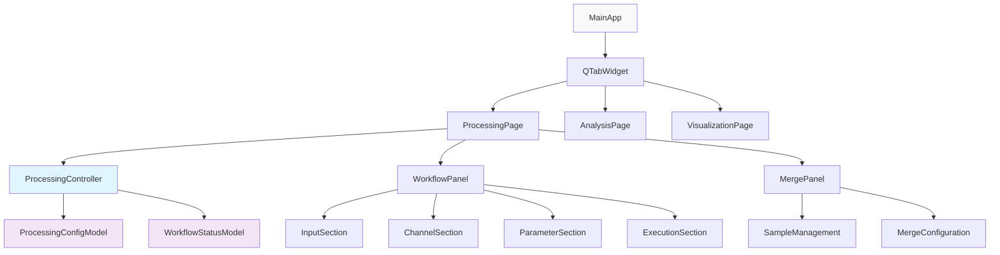
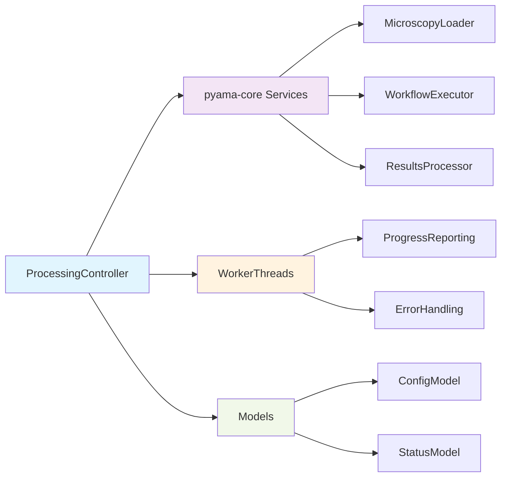
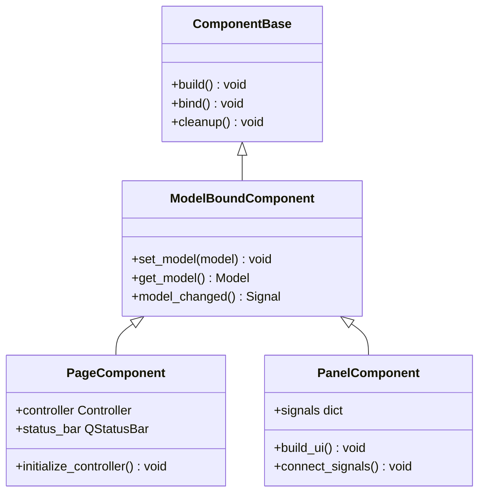
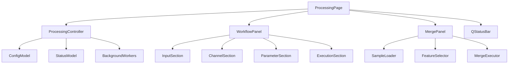
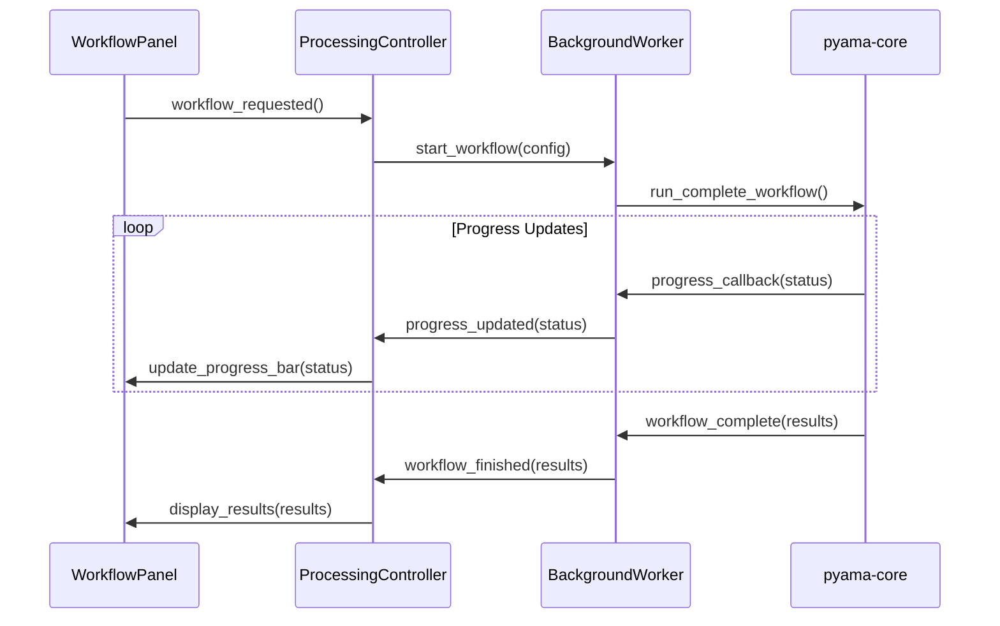
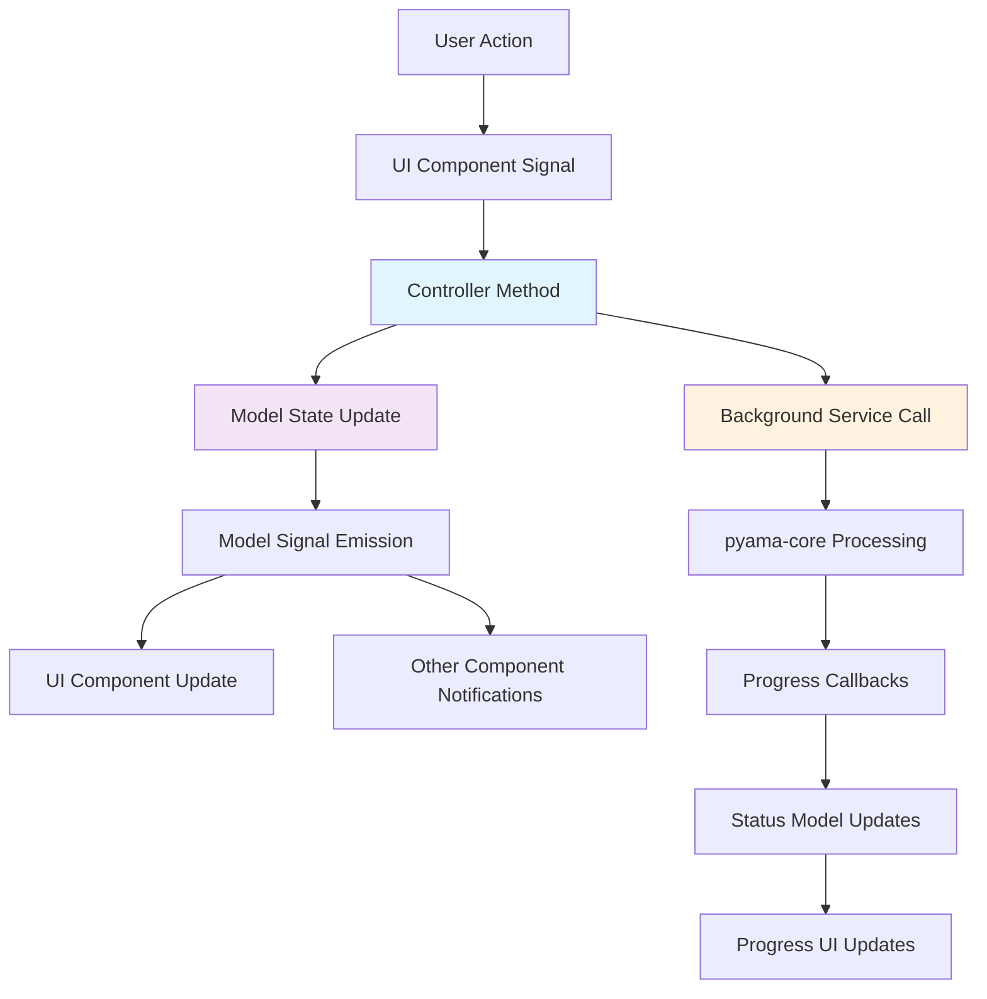
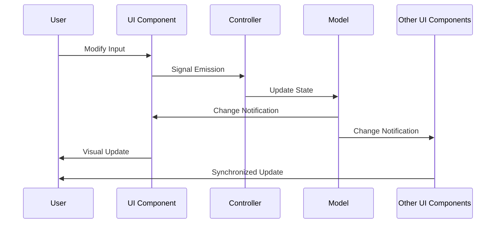
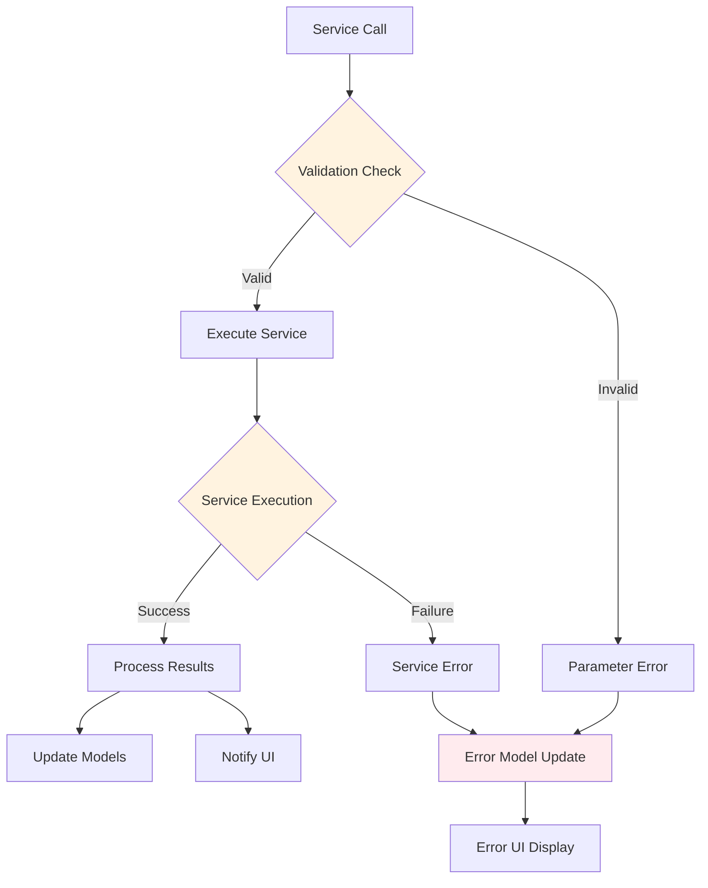
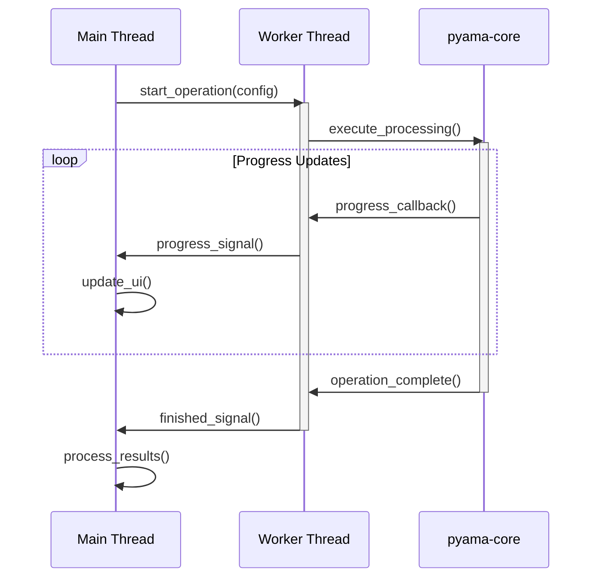
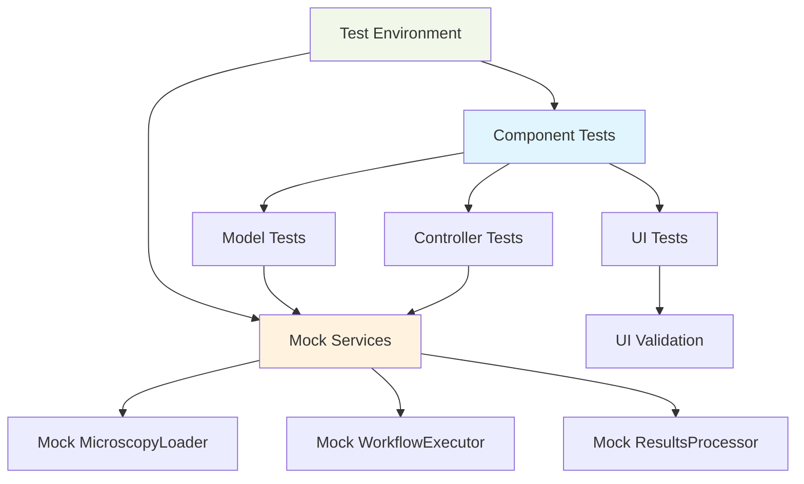

# Component-Based PySide6 Implementation for PyAMA-Qt-Slim

## Overview

This design outlines the implementation of a component-based PySide6 architecture for the pyama-qt-slim project, transforming it from a UI-only framework into a fully functional application with clean separation of concerns. The design focuses on creating a demonstrative processing page that serves as a template for implementing other pages (analysis and visualization).

The current pyama-qt-slim has a Next.js-like structure with all necessary UI elements but lacks business logic, while pyama-qt contains a complete but chaotic half-component, half-MVC implementation. This design establishes a clean, maintainable component-based architecture that leverages the existing pyama-core processing engine.

### Project Context

PyAMA (Python Automated Microscopy Analysis) is a modular microscopy data analysis platform consisting of:

- **pyama-core**: Processing engine with algorithms and data models
- **pyama-qt**: Full-featured GUI with mixed architectural patterns
- **pyama-qt-slim**: UI-only implementation requiring business logic integration

## Technology Stack & Dependencies

### Core Framework Dependencies

- **PySide6**: Primary GUI framework for Qt-based user interface
- **pyama-core**: Processing engine providing algorithms and data models
- **numpy/scipy**: Scientific computing foundations
- **pandas**: Data manipulation and analysis
- **matplotlib**: Visualization and plotting capabilities

### Architecture Dependencies

- **Signal-Slot Pattern**: Qt's native communication mechanism for component interaction
- **Model-View-Controller Pattern**: Separation of data, presentation, and business logic
- **Component Composition**: Hierarchical component structure with clear responsibilities

## Architecture

### Component Hierarchy and Composition

The architecture follows a hierarchical component structure with clear separation of concerns:



### Component Definition Framework

Each component follows a standardized definition pattern with four core responsibilities:

| Component Type            | Responsibilities                                                        | Base Class | Signal Patterns                          |
| ------------------------- | ----------------------------------------------------------------------- | ---------- | ---------------------------------------- |
| **Page Components**       | Layout coordination, controller instantiation, top-level signal routing | `QWidget`  | Page-level events, navigation signals    |
| **Panel Components**      | Feature grouping, section coordination, model binding                   | `QWidget`  | Feature-specific events, data validation |
| **Controller Components** | Business logic, model coordination, service integration                 | `QObject`  | Model updates, operation completion      |
| **Model Components**      | State management, data persistence, change notification                 | `QObject`  | Property changes, validation results     |

### Model-View-Controller Implementation

The MVC pattern implementation ensures strict separation of concerns:

#### Model Layer Specification

- **ProcessingConfigModel**: Manages microscopy file paths, channel selections, and processing parameters
- **WorkflowStatusModel**: Tracks execution state, progress updates, and error conditions
- **Model Communication**: Uses Qt signals for automatic view updates when model state changes

#### View Layer Organization

- **Component Composition**: Pages contain panels, panels contain sections
- **Signal Emission**: Views emit user intent signals without containing business logic
- **Model Binding**: Views subscribe to model signals for automatic UI updates

#### Controller Layer Coordination

- **Service Integration**: Controllers interface with pyama-core services
- **Background Operations**: Manages worker threads for long-running operations
- **State Orchestration**: Coordinates model updates based on user actions and service results

### Service Integration Architecture

The component system integrates with pyama-core services through a clean service layer:



## Component Architecture

### Base Component System

#### Component Base Classes

The component system defines abstract base classes that enforce architectural consistency:



#### Component Lifecycle Management

| Phase              | Responsibility                              | Methods                 | Validation              |
| ------------------ | ------------------------------------------- | ----------------------- | ----------------------- |
| **Initialization** | Component creation, basic setup             | `__init__`, `build()`   | Structure validation    |
| **Binding**        | Signal connections, model attachment        | `bind()`, `set_model()` | Connection verification |
| **Operation**      | Runtime behavior, user interaction          | Event handlers, slots   | State consistency       |
| **Cleanup**        | Resource deallocation, signal disconnection | `cleanup()`, `unbind()` | Resource verification   |

### Processing Page Component Design

#### Page-Level Architecture

The ProcessingPage serves as the primary container and coordination point:

**Core Responsibilities:**

- Controller instantiation and lifecycle management
- Panel composition and layout coordination
- Top-level signal routing and error handling
- Status bar management for user feedback

**Component Structure:**



#### Panel Component Specifications

##### WorkflowPanel Design

The WorkflowPanel manages the complete processing workflow configuration and execution:

**Section Organization:**

- **Input Section**: Microscopy file selection and validation
- **Channel Section**: Phase contrast and fluorescence channel configuration
- **Parameter Section**: FOV range, batch size, and worker configuration
- **Execution Section**: Workflow initiation and progress monitoring

**Signal Interface:**

- `file_selected(Path)`: Emitted when user selects microscopy file
- `channels_configured(ChannelSelection)`: Emitted when channel selection changes
- `parameters_updated(Parameters)`: Emitted when processing parameters change
- `workflow_requested()`: Emitted when user initiates processing

##### MergePanel Design

The MergePanel handles sample aggregation and feature extraction results merging:

**Functional Sections:**

- **Sample Management**: Loading and displaying sample configurations
- **Feature Selection**: Choosing features for merge operations
- **Merge Configuration**: Output formatting and file selection
- **Progress Monitoring**: Real-time feedback during merge operations

### Controller Architecture

#### ProcessingController Specification

The ProcessingController coordinates all processing operations and model state management:

**Core Methods:**

- `load_microscopy(path: Path)`: Validates and loads microscopy files
- `configure_channels(selection: ChannelSelection)`: Updates channel configuration
- `update_parameters(params: Parameters)`: Modifies processing parameters
- `execute_workflow()`: Initiates background processing workflow
- `monitor_progress()`: Handles progress updates and error conditions

**Service Integration:**

- **Microscopy Loading**: Interfaces with pyama-core file I/O services
- **Workflow Execution**: Manages pyama-core processing pipeline
- **Progress Tracking**: Coordinates worker thread communication
- **Error Handling**: Provides user-friendly error reporting

#### Background Operation Management

Processing operations utilize worker threads to prevent UI blocking:



## State Management

### Model Architecture

#### ProcessingConfigModel Specification

The ProcessingConfigModel maintains all processing configuration state:

**State Properties:**

- `microscopy_path`: Currently selected microscopy file path
- `metadata`: Extracted microscopy metadata (channels, timepoints, FOVs)
- `output_directory`: Target directory for processing results
- `channel_selection`: Phase contrast and fluorescence channel configuration
- `processing_parameters`: FOV range, batch size, worker count configuration

**Change Notification System:**

```mermaid
graph LR
    A[User Input] --> B[UI Component]
    B --> C[Controller]
    C --> D[Model.set_property()]
    D --> E[Signal Emission]
    E --> F[UI Update]
    E --> G[Other Components]

    style D fill:#f3e5f5
    style E fill:#fff3e0
```

#### WorkflowStatusModel Specification

The WorkflowStatusModel tracks execution state and progress:

**Status Tracking:**

- `is_processing`: Boolean flag indicating active workflow execution
- `current_stage`: Current processing stage (loading, segmentation, tracking, etc.)
- `progress_percentage`: Numeric progress indicator (0-100)
- `error_messages`: Collection of error conditions and user-friendly messages
- `completion_status`: Final workflow outcome and result summary

### Data Flow Architecture

The data flow follows a unidirectional pattern ensuring predictable state updates:



### Model-View Binding Patterns

#### Signal-Slot Connection Architecture

Each component establishes specific signal-slot connections during the binding phase:

| Connection Type        | Pattern                                              | Example                                                          |
| ---------------------- | ---------------------------------------------------- | ---------------------------------------------------------------- |
| **Model → View**       | `model.propertyChanged.connect(view.update_display)` | `config_model.microscopyPathChanged.connect(path_field.setText)` |
| **View → Controller**  | `view.user_action.connect(controller.handle_action)` | `browse_button.clicked.connect(controller.select_file)`          |
| **Controller → Model** | Direct method calls                                  | `controller.load_file() → model.set_microscopy_path()`           |
| **Model → Model**      | Signal relay patterns                                | `config_model.changed → status_model.validate()`                 |

#### Automatic UI Synchronization

The binding system ensures automatic UI updates when model state changes:



## API Integration Layer

### pyama-core Service Integration

The component architecture integrates with pyama-core services through a standardized service layer:

#### Service Interface Patterns

**Microscopy Loading Service:**

- **Input**: File path, validation parameters
- **Output**: Metadata object, channel information, error conditions
- **Integration**: Asynchronous loading with progress callbacks

**Workflow Execution Service:**

- **Input**: Processing configuration, channel selection, parameter set
- **Output**: Progress updates, intermediate results, completion status
- **Integration**: Multi-threaded execution with real-time progress reporting

**Results Processing Service:**

- **Input**: Processing results, merge configuration, output specifications
- **Output**: Merged datasets, exported files, operation summaries
- **Integration**: Background processing with status notifications

#### Error Handling and Validation

The service integration layer implements comprehensive error handling:



### Asynchronous Operation Management

Processing operations are managed through worker threads to maintain UI responsiveness:

#### Worker Thread Architecture

**Thread Management:**

- **WorkerPool**: Manages multiple background threads for parallel operations
- **ProgressReporting**: Provides real-time progress updates through Qt signals
- **ErrorPropagation**: Safely handles exceptions and communicates errors to UI
- **ResourceManagement**: Ensures proper cleanup and memory management

**Communication Patterns:**



### Existing Folder Structure (pyama-qt-slim)

The component-based architecture respects and enhances the existing pyama-qt-slim folder structure:

```
pyama-qt-slim/
├── src/pyama_qt/
│   ├── __init__.py
│   ├── main.py                     # Application entry point
│   ├── layout.py                   # Main window and tab management
│   ├── globals.py                  # Application-wide constants
│   │
│   ├── lib/                        # Shared utilities
│   │   ├── __init__.py
│   │   ├── config.py               # Application configuration
│   │   └── utils.py                # Common utility functions
│   │
│   ├── components/                 # Minimal shared UI components
│   │   ├── __init__.py
│   │   ├── common/
│   │   │   └── __init__.py
│   │   └── ui/
│   │       ├── __init__.py
│   │       └── canvas.py           # Matplotlib canvas (existing)
│   │
│   └── app/                        # Application pages
│       ├── __init__.py
│       ├── page.py                 # Base page (enhanced with complete MVC)
│       │
│       ├── processing/             # Processing workflow
│       │   ├── __init__.py
│       │   ├── page.py             # ProcessingPage (complete MVC in one file)
│       │   └── components/
│       │       ├── __init__.py
│       │       ├── workflow_panel.py    # Complete MVC component
│       │       └── merge_panel.py       # Complete MVC component
│       │
│       ├── analysis/               # Analysis workflow
│       │   ├── __init__.py
│       │   ├── page.py             # AnalysisPage (complete MVC in one file)
│       │   └── components/
│       │       ├── __init__.py
│       │       ├── analysis_data_panel.py    # Complete MVC component
│       │       ├── analysis_fitting_panel.py # Complete MVC component
│       │       └── analysis_results_panel.py # Complete MVC component
│       │
│       └── visualization/          # Visualization workflow
│           ├── __init__.py
│           ├── page.py             # VisualizationPage (complete MVC in one file)
│           └── components/
│               ├── __init__.py
│               ├── image_panel.py       # Complete MVC component
│               ├── project_panel.py     # Complete MVC component
│               └── trace_panel.py       # Complete MVC component
└── tests/                          # Test files mirror structure
```

### Self-Contained Component Philosophy

Each component file contains a complete MVC implementation within a single file:

**Page Component Structure Pattern (page.py files):**
- **Model Classes**: All data models and business logic within the page.py file
- **Controller Classes**: All event handling and model coordination within the page.py file  
- **View Classes**: UI widgets and layout management within the page.py file
- **Standalone Execution**: Runnable with `if __name__ == "__main__"` for testing
- **Signal Communication**: Uses Qt signals/slots for inter-component communication

**Panel Component Structure Pattern (xxx_panel.py files):**
- **Complete MVC**: All models, controllers, and views in the single panel file
- **Independent Testing**: Each panel can be run standalone
- **Signal Interface**: Clean signal/slot interface for communication with parent page
- **No External Dependencies**: All logic self-contained, no separate controller or model files

### Complete Page Example with Integrated MVC

#### processing/page.py - Complete Page Implementation

```python
# app/processing/page.py
"""Complete processing page with integrated MVC architecture."""

import sys
import logging
from pathlib import Path
from typing import Optional, List
from dataclasses import dataclass, field

from PySide6.QtCore import QObject, Signal, QThread, QTimer
from PySide6.QtWidgets import (
    QApplication, QWidget, QVBoxLayout, QHBoxLayout, QStatusBar,
    QMessageBox
)

try:
    from pyama_core.io import load_microscopy_file, MicroscopyMetadata
    from pyama_core.processing.workflow import run_complete_workflow
except ImportError:
    # Mock implementations for standalone testing
    MicroscopyMetadata = object
    def load_microscopy_file(path): return None
    def run_complete_workflow(**kwargs): return {}

# Import panel components
from .components.workflow_panel import WorkflowPanel
from .components.merge_panel import MergePanel


# ==================== MODEL CLASSES ====================

@dataclass
class ChannelSelection:
    """Channel selection configuration for processing."""
    phase: Optional[int] = None
    fluorescence: List[int] = field(default_factory=list)


@dataclass
class ProcessingParameters:
    """Processing workflow parameters."""
    fov_start: int = 1
    fov_end: int = 50
    batch_size: int = 2
    workers: int = 2


class ProcessingConfigModel(QObject):
    """Model for processing page configuration state."""
    
    # Configuration change signals
    microscopy_path_changed = Signal(object)  # Path or None
    metadata_changed = Signal(object)  # MicroscopyMetadata or None
    output_directory_changed = Signal(object)  # Path or None
    channels_changed = Signal(object)  # ChannelSelection
    parameters_changed = Signal(object)  # ProcessingParameters
    
    def __init__(self):
        super().__init__()
        self._microscopy_path: Optional[Path] = None
        self._metadata: Optional[MicroscopyMetadata] = None
        self._output_directory: Optional[Path] = None
        self._channels = ChannelSelection()
        self._parameters = ProcessingParameters()
    
    def set_microscopy_path(self, path: Optional[Path]) -> None:
        """Set microscopy file path."""
        if self._microscopy_path != path:
            self._microscopy_path = path
            self.microscopy_path_changed.emit(path)
    
    def get_microscopy_path(self) -> Optional[Path]:
        return self._microscopy_path
    
    def set_metadata(self, metadata: Optional[MicroscopyMetadata]) -> None:
        """Set microscopy metadata."""
        if self._metadata != metadata:
            self._metadata = metadata
            self.metadata_changed.emit(metadata)
    
    def get_metadata(self) -> Optional[MicroscopyMetadata]:
        return self._metadata
    
    def set_output_directory(self, path: Optional[Path]) -> None:
        """Set output directory path."""
        if self._output_directory != path:
            self._output_directory = path
            self.output_directory_changed.emit(path)
    
    def get_output_directory(self) -> Optional[Path]:
        return self._output_directory
    
    def set_channels(self, channels: ChannelSelection) -> None:
        """Set channel selection."""
        self._channels = channels
        self.channels_changed.emit(channels)
    
    def get_channels(self) -> ChannelSelection:
        return self._channels
    
    def set_parameters(self, parameters: ProcessingParameters) -> None:
        """Set processing parameters."""
        self._parameters = parameters
        self.parameters_changed.emit(parameters)
    
    def get_parameters(self) -> ProcessingParameters:
        return self._parameters


class ProcessingStatusModel(QObject):
    """Model for processing page status and progress."""
    
    # Status change signals
    processing_changed = Signal(bool)  # Is processing active
    progress_changed = Signal(int)  # Progress percentage 0-100
    status_message_changed = Signal(str)  # Current status message
    error_occurred = Signal(str)  # Error message
    
    def __init__(self):
        super().__init__()
        self._is_processing = False
        self._progress = 0
        self._status_message = "Ready"
    
    def set_processing(self, is_processing: bool) -> None:
        """Set processing state."""
        if self._is_processing != is_processing:
            self._is_processing = is_processing
            self.processing_changed.emit(is_processing)
    
    def is_processing(self) -> bool:
        return self._is_processing
    
    def set_progress(self, progress: int) -> None:
        """Set progress percentage."""
        progress = max(0, min(100, progress))
        if self._progress != progress:
            self._progress = progress
            self.progress_changed.emit(progress)
    
    def get_progress(self) -> int:
        return self._progress
    
    def set_status_message(self, message: str) -> None:
        """Set status message."""
        if self._status_message != message:
            self._status_message = message
            self.status_message_changed.emit(message)
    
    def get_status_message(self) -> str:
        return self._status_message
    
    def emit_error(self, error_message: str) -> None:
        """Emit error signal."""
        self.error_occurred.emit(error_message)


# ==================== CONTROLLER CLASSES ====================

class ProcessingController(QObject):
    """Controller for processing page operations."""
    
    # Operation completion signals
    file_loaded = Signal(bool, str)  # success, message
    workflow_completed = Signal(bool, str)  # success, message
    merge_completed = Signal(bool, str)  # success, message
    
    def __init__(self, config_model: ProcessingConfigModel, 
                 status_model: ProcessingStatusModel):
        super().__init__()
        self.config_model = config_model
        self.status_model = status_model
        self._worker_thread: Optional[QThread] = None
        self.logger = logging.getLogger(self.__class__.__name__)
    
    def load_microscopy_file(self, file_path: Path) -> None:
        """Load microscopy file asynchronously."""
        if self._worker_thread and self._worker_thread.isRunning():
            self.status_model.emit_error("Another operation is in progress")
            return
        
        self.status_model.set_processing(True)
        self.status_model.set_status_message(f"Loading {file_path.name}...")
        
        # Simulate async loading with timer (replace with actual worker thread)
        QTimer.singleShot(1000, lambda: self._simulate_file_load(file_path))
    
    def _simulate_file_load(self, file_path: Path) -> None:
        """Simulate file loading completion."""
        try:
            # In real implementation: metadata = load_microscopy_file(file_path)
            self.config_model.set_microscopy_path(file_path)
            self.config_model.set_metadata(None)  # Mock metadata
            self.status_model.set_processing(False)
            self.status_model.set_status_message(f"Loaded {file_path.name}")
            self.file_loaded.emit(True, "File loaded successfully")
        except Exception as e:
            self.status_model.set_processing(False)
            self.status_model.emit_error(f"Failed to load file: {e}")
            self.file_loaded.emit(False, str(e))
    
    def start_workflow(self) -> None:
        """Start processing workflow."""
        if not self._validate_configuration():
            return
        
        if self._worker_thread and self._worker_thread.isRunning():
            self.status_model.emit_error("Workflow already running")
            return
        
        self.status_model.set_processing(True)
        self.status_model.set_progress(0)
        self.status_model.set_status_message("Starting workflow...")
        
        # Simulate workflow with progress updates
        self._simulate_workflow()
    
    def _validate_configuration(self) -> bool:
        """Validate current configuration."""
        if not self.config_model.get_microscopy_path():
            self.status_model.emit_error("No microscopy file selected")
            return False
        
        if not self.config_model.get_output_directory():
            self.status_model.emit_error("No output directory selected")
            return False
        
        return True
    
    def _simulate_workflow(self) -> None:
        """Simulate workflow execution with progress updates."""
        stages = [
            ("Initializing...", 10),
            ("Processing FOVs...", 30),
            ("Segmentation...", 50),
            ("Tracking...", 70),
            ("Feature extraction...", 90),
            ("Finalizing...", 100)
        ]
        
        def update_stage(stage_index):
            if stage_index < len(stages):
                message, progress = stages[stage_index]
                self.status_model.set_status_message(message)
                self.status_model.set_progress(progress)
                
                if stage_index < len(stages) - 1:
                    QTimer.singleShot(800, lambda: update_stage(stage_index + 1))
                else:
                    self._complete_workflow()
        
        update_stage(0)
    
    def _complete_workflow(self) -> None:
        """Complete workflow execution."""
        self.status_model.set_processing(False)
        self.status_model.set_status_message("Workflow completed successfully")
        self.workflow_completed.emit(True, "Processing completed")
    
    def start_merge(self, samples_config: dict) -> None:
        """Start sample merging operation."""
        self.status_model.set_processing(True)
        self.status_model.set_status_message("Starting merge operation...")
        
        # Simulate merge operation
        QTimer.singleShot(2000, lambda: self._complete_merge())
    
    def _complete_merge(self) -> None:
        """Complete merge operation."""
        self.status_model.set_processing(False)
        self.status_model.set_status_message("Merge completed successfully")
        self.merge_completed.emit(True, "Merge completed")


# ==================== VIEW CLASSES ====================

class ProcessingPage(QWidget):
    """Complete processing page with integrated MVC architecture."""
    
    # Inter-page communication signals
    page_ready = Signal()
    workflow_started = Signal()
    workflow_finished = Signal(bool, str)  # success, message
    
    def __init__(self, parent=None):
        super().__init__(parent)
        
        # Initialize models
        self.config_model = ProcessingConfigModel()
        self.status_model = ProcessingStatusModel()
        
        # Initialize controller
        self.controller = ProcessingController(self.config_model, self.status_model)
        
        # Setup logging
        self.logger = logging.getLogger(self.__class__.__name__)
        
        # Build UI
        self._build_ui()
        
        # Connect signals
        self._connect_signals()
        
        # Initialize page
        self._initialize_page()
        
        self.logger.info("ProcessingPage initialized")
    
    def _build_ui(self) -> None:
        """Build the user interface."""
        layout = QVBoxLayout(self)
        
        # Main content layout
        content_layout = QHBoxLayout()
        
        # Create panel components
        self.workflow_panel = WorkflowPanel(self)
        self.merge_panel = MergePanel(self)
        
        content_layout.addWidget(self.workflow_panel, 1)
        content_layout.addWidget(self.merge_panel, 1)
        
        layout.addLayout(content_layout)
        
        # Status bar
        self._status_bar = QStatusBar(self)
        layout.addWidget(self._status_bar)
    
    def _connect_signals(self) -> None:
        """Connect all signals and slots."""
        # Panel to controller signals
        self.workflow_panel.file_selected.connect(self.controller.load_microscopy_file)
        self.workflow_panel.workflow_requested.connect(self.controller.start_workflow)
        self.workflow_panel.output_directory_selected.connect(
            self.config_model.set_output_directory
        )
        
        self.merge_panel.merge_requested.connect(self.controller.start_merge)
        
        # Model to status bar signals
        self.status_model.status_message_changed.connect(self._status_bar.showMessage)
        self.status_model.error_occurred.connect(self._on_error_occurred)
        
        # Controller signals
        self.controller.file_loaded.connect(self._on_file_loaded)
        self.controller.workflow_completed.connect(self._on_workflow_completed)
        self.controller.merge_completed.connect(self._on_merge_completed)
        
        # Pass models to panels for binding
        self.workflow_panel.set_models(self.config_model, self.status_model)
        self.merge_panel.set_models(self.config_model, self.status_model)
    
    def _initialize_page(self) -> None:
        """Initialize page state."""
        self.status_model.set_status_message("Ready for processing")
        self.page_ready.emit()
    
    def _on_error_occurred(self, error_message: str) -> None:
        """Handle error occurrence."""
        QMessageBox.warning(self, "Processing Error", error_message)
        self.logger.error(f"Processing error: {error_message}")
    
    def _on_file_loaded(self, success: bool, message: str) -> None:
        """Handle file load completion."""
        if success:
            self.logger.info(f"File loaded: {message}")
        else:
            self.logger.error(f"File load failed: {message}")
    
    def _on_workflow_completed(self, success: bool, message: str) -> None:
        """Handle workflow completion."""
        self.workflow_finished.emit(success, message)
        if success:
            self.logger.info(f"Workflow completed: {message}")
        else:
            self.logger.error(f"Workflow failed: {message}")
    
    def _on_merge_completed(self, success: bool, message: str) -> None:
        """Handle merge completion."""
        if success:
            self.logger.info(f"Merge completed: {message}")
        else:
            self.logger.error(f"Merge failed: {message}")
    
    def get_config_model(self) -> ProcessingConfigModel:
        """Get the configuration model for external access."""
        return self.config_model
    
    def get_status_model(self) -> ProcessingStatusModel:
        """Get the status model for external access."""
        return self.status_model


# ==================== STANDALONE EXECUTION ====================

def main():
    """Standalone execution for testing the page."""
    logging.basicConfig(level=logging.INFO)
    
    app = QApplication(sys.argv)
    
    # Create and show the page
    page = ProcessingPage()
    page.setWindowTitle("Processing Page - Standalone Test")
    page.resize(1200, 800)
    page.show()
    
    # Connect test signals
    page.page_ready.connect(lambda: print("Page ready signal emitted"))
    page.workflow_started.connect(lambda: print("Workflow started signal emitted"))
    page.workflow_finished.connect(
        lambda success, msg: print(f"Workflow finished: {success}, {msg}")
    )
    
    sys.exit(app.exec())


if __name__ == "__main__":
    main()
```

This example demonstrates a complete page implementation that:
- Contains all model, controller, and view classes in one file
- Can be executed standalone for testing with proper mock panels
- Integrates with panel components through clean signal interfaces
- Maintains clear separation of concerns within the single file
- Follows the existing pyama-qt-slim structure without separate files
- Provides proper model access methods for external components

#### workflow_panel.py - Complete MVC Implementation

```python
# app/processing/components/workflow_panel.py
"""Complete workflow panel component with integrated MVC architecture."""

import sys
import logging
from pathlib import Path
from typing import Optional, List
from dataclasses import dataclass, field

from PySide6.QtCore import QObject, Signal, QThread, QTimer
from PySide6.QtWidgets import (
    QApplication, QWidget, QVBoxLayout, QHBoxLayout, QGroupBox,
    QLabel, QPushButton, QLineEdit, QComboBox, QListWidget,
    QProgressBar, QTableWidget, QTableWidgetItem, QFileDialog,
    QAbstractItemView, QMessageBox
)
from PySide6.QtCore import Qt

try:
    from pyama_core.io import load_microscopy_file, MicroscopyMetadata
    from pyama_core.processing.workflow import run_complete_workflow
except ImportError:
    # Mock implementations for standalone testing
    MicroscopyMetadata = object
    def load_microscopy_file(path): return None
    def run_complete_workflow(**kwargs): return {}


# ==================== MODEL CLASSES ====================

@dataclass
class ChannelSelection:
    """Channel selection configuration."""
    phase: Optional[int] = None
    fluorescence: List[int] = field(default_factory=list)


@dataclass
class ProcessingParameters:
    """Processing workflow parameters."""
    fov_start: int = 1
    fov_end: int = 50
    batch_size: int = 2
    workers: int = 2


class WorkflowConfigModel(QObject):
    """Model for workflow configuration state."""

    # Configuration change signals
    microscopy_path_changed = Signal(object)  # Path or None
    metadata_changed = Signal(object)  # MicroscopyMetadata or None
    output_directory_changed = Signal(object)  # Path or None
    channels_changed = Signal(object)  # ChannelSelection
    parameters_changed = Signal(object)  # ProcessingParameters

    def __init__(self):
        super().__init__()
        self._microscopy_path: Optional[Path] = None
        self._metadata: Optional[MicroscopyMetadata] = None
        self._output_directory: Optional[Path] = None
        self._channels = ChannelSelection()
        self._parameters = ProcessingParameters()

    def set_microscopy_path(self, path: Optional[Path]) -> None:
        """Set microscopy file path."""
        if self._microscopy_path != path:
            self._microscopy_path = path
            self.microscopy_path_changed.emit(path)

    def get_microscopy_path(self) -> Optional[Path]:
        return self._microscopy_path

    def set_metadata(self, metadata: Optional[MicroscopyMetadata]) -> None:
        """Set microscopy metadata."""
        if self._metadata != metadata:
            self._metadata = metadata
            self.metadata_changed.emit(metadata)

    def get_metadata(self) -> Optional[MicroscopyMetadata]:
        return self._metadata

    def set_output_directory(self, path: Optional[Path]) -> None:
        """Set output directory path."""
        if self._output_directory != path:
            self._output_directory = path
            self.output_directory_changed.emit(path)

    def get_output_directory(self) -> Optional[Path]:
        return self._output_directory

    def set_channels(self, channels: ChannelSelection) -> None:
        """Set channel selection."""
        self._channels = channels
        self.channels_changed.emit(channels)

    def get_channels(self) -> ChannelSelection:
        return self._channels

    def set_parameters(self, parameters: ProcessingParameters) -> None:
        """Set processing parameters."""
        self._parameters = parameters
        self.parameters_changed.emit(parameters)

    def get_parameters(self) -> ProcessingParameters:
        return self._parameters


class WorkflowStatusModel(QObject):
    """Model for workflow execution status."""

    # Status change signals
    processing_changed = Signal(bool)  # Is processing active
    progress_changed = Signal(int)  # Progress percentage 0-100
    status_message_changed = Signal(str)  # Current status message
    error_occurred = Signal(str)  # Error message

    def __init__(self):
        super().__init__()
        self._is_processing = False
        self._progress = 0
        self._status_message = "Ready"

    def set_processing(self, is_processing: bool) -> None:
        """Set processing state."""
        if self._is_processing != is_processing:
            self._is_processing = is_processing
            self.processing_changed.emit(is_processing)

    def is_processing(self) -> bool:
        return self._is_processing

    def set_progress(self, progress: int) -> None:
        """Set progress percentage."""
        progress = max(0, min(100, progress))
        if self._progress != progress:
            self._progress = progress
            self.progress_changed.emit(progress)

    def get_progress(self) -> int:
        return self._progress

    def set_status_message(self, message: str) -> None:
        """Set status message."""
        if self._status_message != message:
            self._status_message = message
            self.status_message_changed.emit(message)

    def get_status_message(self) -> str:
        return self._status_message

    def emit_error(self, error_message: str) -> None:
        """Emit error signal."""
        self.error_occurred.emit(error_message)


# ==================== CONTROLLER CLASSES ====================

class WorkflowController(QObject):
    """Controller for workflow operations."""

    # Operation completion signals
    file_loaded = Signal(bool, str)  # success, message
    workflow_completed = Signal(bool, str)  # success, message

    def __init__(self, config_model: WorkflowConfigModel,
                 status_model: WorkflowStatusModel):
        super().__init__()
        self.config_model = config_model
        self.status_model = status_model
        self._worker_thread: Optional[QThread] = None
        self.logger = logging.getLogger(self.__class__.__name__)

    def load_microscopy_file(self, file_path: Path) -> None:
        """Load microscopy file asynchronously."""
        if self._worker_thread and self._worker_thread.isRunning():
            self.status_model.emit_error("Another operation is in progress")
            return

        self.status_model.set_processing(True)
        self.status_model.set_status_message(f"Loading {file_path.name}...")

        # Simulate async loading with timer (replace with actual worker thread)
        QTimer.singleShot(1000, lambda: self._simulate_file_load(file_path))

    def _simulate_file_load(self, file_path: Path) -> None:
        """Simulate file loading completion."""
        try:
            # In real implementation: metadata = load_microscopy_file(file_path)
            self.config_model.set_microscopy_path(file_path)
            self.config_model.set_metadata(None)  # Mock metadata
            self.status_model.set_processing(False)
            self.status_model.set_status_message(f"Loaded {file_path.name}")
            self.file_loaded.emit(True, "File loaded successfully")
        except Exception as e:
            self.status_model.set_processing(False)
            self.status_model.emit_error(f"Failed to load file: {e}")
            self.file_loaded.emit(False, str(e))

    def start_workflow(self) -> None:
        """Start processing workflow."""
        if not self._validate_configuration():
            return

        if self._worker_thread and self._worker_thread.isRunning():
            self.status_model.emit_error("Workflow already running")
            return

        self.status_model.set_processing(True)
        self.status_model.set_progress(0)
        self.status_model.set_status_message("Starting workflow...")

        # Simulate workflow with progress updates
        self._simulate_workflow()

    def _validate_configuration(self) -> bool:
        """Validate current configuration."""
        if not self.config_model.get_microscopy_path():
            self.status_model.emit_error("No microscopy file selected")
            return False

        if not self.config_model.get_output_directory():
            self.status_model.emit_error("No output directory selected")
            return False

        return True

    def _simulate_workflow(self) -> None:
        """Simulate workflow execution with progress updates."""
        stages = [
            ("Initializing...", 10),
            ("Processing FOVs...", 30),
            ("Segmentation...", 50),
            ("Tracking...", 70),
            ("Feature extraction...", 90),
            ("Finalizing...", 100)
        ]

        def update_stage(stage_index):
            if stage_index < len(stages):
                message, progress = stages[stage_index]
                self.status_model.set_status_message(message)
                self.status_model.set_progress(progress)

                if stage_index < len(stages) - 1:
                    QTimer.singleShot(800, lambda: update_stage(stage_index + 1))
                else:
                    self._complete_workflow()

        update_stage(0)

    def _complete_workflow(self) -> None:
        """Complete workflow execution."""
        self.status_model.set_processing(False)
        self.status_model.set_status_message("Workflow completed successfully")
        self.workflow_completed.emit(True, "Processing completed")


# ==================== VIEW CLASSES ====================

class WorkflowPanel(QWidget):
    """Complete workflow panel with integrated MVC architecture."""

    # Inter-component communication signals
    workflow_started = Signal()
    workflow_finished = Signal(bool, str)  # success, message

    def __init__(self, parent=None):
        super().__init__(parent)

        # Initialize models
        self.config_model = WorkflowConfigModel()
        self.status_model = WorkflowStatusModel()

        # Initialize controller
        self.controller = WorkflowController(self.config_model, self.status_model)

        # Setup logging
        self.logger = logging.getLogger(self.__class__.__name__)

        # Build UI
        self._build_ui()

        # Connect signals
        self._connect_signals()

        self.logger.info("WorkflowPanel initialized")

    def _build_ui(self) -> None:
        """Build the user interface."""
        layout = QHBoxLayout(self)

        # Input group
        self._input_group = self._create_input_group()
        layout.addWidget(self._input_group, 1)

        # Output group
        self._output_group = self._create_output_group()
        layout.addWidget(self._output_group, 1)

    def _create_input_group(self) -> QGroupBox:
        """Create input configuration group."""
        group = QGroupBox("Input Configuration")
        layout = QVBoxLayout(group)

        # File selection
        file_layout = QHBoxLayout()
        file_layout.addWidget(QLabel("Microscopy File:"))
        file_layout.addStretch()

        self._browse_button = QPushButton("Browse...")
        file_layout.addWidget(self._browse_button)
        layout.addLayout(file_layout)

        self._file_path_field = QLineEdit()
        self._file_path_field.setReadOnly(True)
        self._file_path_field.setPlaceholderText("No file selected")
        layout.addWidget(self._file_path_field)

        # Channel selection
        channel_group = QGroupBox("Channels")
        channel_layout = QVBoxLayout(channel_group)

        # Phase contrast
        channel_layout.addWidget(QLabel("Phase Contrast:"))
        self._phase_combo = QComboBox()
        self._phase_combo.addItems(["None", "Channel 0", "Channel 1", "Channel 2"])
        channel_layout.addWidget(self._phase_combo)

        # Fluorescence
        channel_layout.addWidget(QLabel("Fluorescence (multi-select):"))
        self._fluorescence_list = QListWidget()
        self._fluorescence_list.setSelectionMode(QListWidget.SelectionMode.MultiSelection)
        for i, name in enumerate(["GFP", "RFP", "DAPI", "Cy5"]):
            self._fluorescence_list.addItem(f"Channel {i}: {name}")
        channel_layout.addWidget(self._fluorescence_list)

        layout.addWidget(channel_group)

        return group

    def _create_output_group(self) -> QGroupBox:
        """Create output configuration group."""
        group = QGroupBox("Output Configuration")
        layout = QVBoxLayout(group)

        # Output directory
        dir_layout = QHBoxLayout()
        dir_layout.addWidget(QLabel("Output Directory:"))
        dir_layout.addStretch()

        self._output_browse_button = QPushButton("Browse...")
        dir_layout.addWidget(self._output_browse_button)
        layout.addLayout(dir_layout)

        self._output_dir_field = QLineEdit()
        self._output_dir_field.setReadOnly(True)
        self._output_dir_field.setPlaceholderText("No directory selected")
        layout.addWidget(self._output_dir_field)

        # Parameters
        param_group = QGroupBox("Processing Parameters")
        param_layout = QVBoxLayout(param_group)

        self._param_table = QTableWidget(4, 2)
        self._param_table.setHorizontalHeaderLabels(["Parameter", "Value"])
        self._param_table.setVerticalHeaderLabels(["FOV Start", "FOV End", "Batch Size", "Workers"])

        # Set default values
        for row, value in enumerate(["1", "50", "2", "2"]):
            item = QTableWidgetItem(value)
            self._param_table.setItem(row, 1, item)

        param_layout.addWidget(self._param_table)
        layout.addWidget(param_group)

        # Execution controls
        self._start_button = QPushButton("Start Workflow")
        self._start_button.setEnabled(False)
        layout.addWidget(self._start_button)

        # Progress monitoring
        self._progress_bar = QProgressBar()
        self._progress_bar.setVisible(False)
        layout.addWidget(self._progress_bar)

        self._status_label = QLabel("Ready")
        layout.addWidget(self._status_label)

        return group

    def _connect_signals(self) -> None:
        """Connect all signals and slots."""
        # UI to controller signals
        self._browse_button.clicked.connect(self._on_browse_file)
        self._output_browse_button.clicked.connect(self._on_browse_output_dir)
        self._start_button.clicked.connect(self._on_start_workflow)

        # Parameter changes
        self._phase_combo.currentIndexChanged.connect(self._on_channels_changed)
        self._fluorescence_list.itemSelectionChanged.connect(self._on_channels_changed)
        self._param_table.cellChanged.connect(self._on_parameters_changed)

        # Model to view signals
        self.config_model.microscopy_path_changed.connect(self._on_microscopy_path_changed)
        self.config_model.output_directory_changed.connect(self._on_output_directory_changed)

        self.status_model.processing_changed.connect(self._on_processing_changed)
        self.status_model.progress_changed.connect(self._on_progress_changed)
        self.status_model.status_message_changed.connect(self._on_status_message_changed)
        self.status_model.error_occurred.connect(self._on_error_occurred)

        # Controller signals
        self.controller.file_loaded.connect(self._on_file_loaded)
        self.controller.workflow_completed.connect(self._on_workflow_completed)

    def _on_browse_file(self) -> None:
        """Handle file browse button click."""
        file_path, _ = QFileDialog.getOpenFileName(
            self, "Select Microscopy File",
            "", "Microscopy files (*.nd2 *.czi);;All files (*.*)"
        )

        if file_path:
            self.controller.load_microscopy_file(Path(file_path))

    def _on_browse_output_dir(self) -> None:
        """Handle output directory browse button click."""
        dir_path = QFileDialog.getExistingDirectory(
            self, "Select Output Directory"
        )

        if dir_path:
            self.config_model.set_output_directory(Path(dir_path))

    def _on_start_workflow(self) -> None:
        """Handle start workflow button click."""
        self.workflow_started.emit()
        self.controller.start_workflow()

    def _on_channels_changed(self) -> None:
        """Handle channel selection changes."""
        phase_index = self._phase_combo.currentIndex()
        phase = phase_index if phase_index > 0 else None

        fluorescence = [
            i for i in range(self._fluorescence_list.count())
            if self._fluorescence_list.item(i).isSelected()
        ]

        channels = ChannelSelection(phase=phase, fluorescence=fluorescence)
        self.config_model.set_channels(channels)

    def _on_parameters_changed(self, row: int, column: int) -> None:
        """Handle parameter table changes."""
        if column != 1:  # Only value column
            return

        try:
            values = []
            for i in range(4):
                item = self._param_table.item(i, 1)
                values.append(int(item.text()) if item else 0)

            parameters = ProcessingParameters(
                fov_start=values[0],
                fov_end=values[1],
                batch_size=values[2],
                workers=values[3]
            )
            self.config_model.set_parameters(parameters)
        except ValueError:
            pass  # Invalid input, ignore

    def _on_microscopy_path_changed(self, path: Optional[Path]) -> None:
        """Handle microscopy path change."""
        if path:
            self._file_path_field.setText(str(path))
            self._update_start_button_state()
        else:
            self._file_path_field.clear()

    def _on_output_directory_changed(self, path: Optional[Path]) -> None:
        """Handle output directory change."""
        if path:
            self._output_dir_field.setText(str(path))
            self._update_start_button_state()
        else:
            self._output_dir_field.clear()

    def _on_processing_changed(self, is_processing: bool) -> None:
        """Handle processing state change."""
        self._start_button.setEnabled(not is_processing and self._can_start_workflow())
        self._progress_bar.setVisible(is_processing)

        # Disable inputs during processing
        self._input_group.setEnabled(not is_processing)
        self._output_browse_button.setEnabled(not is_processing)

    def _on_progress_changed(self, progress: int) -> None:
        """Handle progress change."""
        self._progress_bar.setValue(progress)

    def _on_status_message_changed(self, message: str) -> None:
        """Handle status message change."""
        self._status_label.setText(message)

    def _on_error_occurred(self, error_message: str) -> None:
        """Handle error occurrence."""
        QMessageBox.warning(self, "Error", error_message)
        self._status_label.setText(f"Error: {error_message}")

    def _on_file_loaded(self, success: bool, message: str) -> None:
        """Handle file load completion."""
        if success:
            self.logger.info(f"File loaded: {message}")
        else:
            self.logger.error(f"File load failed: {message}")

    def _on_workflow_completed(self, success: bool, message: str) -> None:
        """Handle workflow completion."""
        self.workflow_finished.emit(success, message)
        if success:
            self.logger.info(f"Workflow completed: {message}")
        else:
            self.logger.error(f"Workflow failed: {message}")

    def _update_start_button_state(self) -> None:
        """Update start button enabled state."""
        can_start = self._can_start_workflow() and not self.status_model.is_processing()
        self._start_button.setEnabled(can_start)

    def _can_start_workflow(self) -> bool:
        """Check if workflow can be started."""
        return (self.config_model.get_microscopy_path() is not None and
                self.config_model.get_output_directory() is not None)


# ==================== STANDALONE EXECUTION ====================

def main():
    """Standalone execution for testing the component."""
    logging.basicConfig(level=logging.INFO)

    app = QApplication(sys.argv)

    # Create and show the component
    panel = WorkflowPanel()
    panel.setWindowTitle("Workflow Panel - Standalone Test")
    panel.resize(800, 600)
    panel.show()

    # Connect test signals
    panel.workflow_started.connect(lambda: print("Workflow started signal emitted"))
    panel.workflow_finished.connect(
        lambda success, msg: print(f"Workflow finished: {success}, {msg}")
    )

    sys.exit(app.exec())


if __name__ == "__main__":
    main()
```

This example demonstrates a complete self-contained component that:

- Contains all MVC classes within one file
- Can be executed standalone for testing
- Uses proper signal/slot communication
- Integrates with pyama-core services
- Maintains clean separation of concerns within the component
- Follows the existing pyama-qt-slim folder structure

### Recommended Folder Structure

The component-based architecture follows a clear organizational structure that separates concerns and promotes maintainability:

```
pyama-qt-slim/
├── src/pyama_qt/
│   ├── __init__.py
│   ├── main.py                     # Application entry point
│   ├── layout.py                   # Main window and tab management
│   ├── globals.py                  # Application-wide constants
│   │
│   ├── lib/                        # Shared utilities and configuration
│   │   ├── __init__.py
│   │   ├── config.py               # Application configuration
│   │   └── utils.py                # Common utility functions
│   │
│   ├── components/                 # Reusable UI components
│   │   ├── __init__.py
│   │   ├── base/                   # Base component classes
│   │   │   ├── __init__.py
│   │   │   ├── component.py        # ComponentBase abstract class
│   │   │   ├── page.py             # PageComponent base class
│   │   │   └── panel.py            # PanelComponent base class
│   │   │
│   │   ├── common/                 # Shared UI components
│   │   │   ├── __init__.py
│   │   │   ├── progress_bar.py     # Custom progress indicators
│   │   │   ├── file_selector.py    # File/directory selection widgets
│   │   │   └── status_display.py   # Status and error display components
│   │   │
│   │   └── ui/                     # Low-level UI widgets
│   │       ├── __init__.py
│   │       └── canvas.py           # Matplotlib canvas component
│   │
│   ├── app/                        # Application pages and features
│   │   ├── __init__.py
│   │   ├── page.py                 # Base page coordination
│   │   │
│   │   ├── processing/             # Processing workflow page
│   │   │   ├── __init__.py
│   │   │   ├── page.py             # ProcessingPage main component
│   │   │   ├── controller.py       # ProcessingController business logic
│   │   │   ├── models.py           # ProcessingConfigModel, WorkflowStatusModel
│   │   │   │
│   │   │   ├── components/         # Processing-specific components
│   │   │   │   ├── __init__.py
│   │   │   │   ├── workflow_panel.py    # Main workflow configuration panel
│   │   │   │   ├── merge_panel.py       # Sample merging panel
│   │   │   │   ├── input_section.py     # File input components
│   │   │   │   ├── channel_section.py   # Channel selection components
│   │   │   │   ├── parameter_section.py # Processing parameter components
│   │   │   │   └── execution_section.py  # Workflow execution components
│   │   │   │
│   │   │   └── services/           # Processing-specific services
│   │   │       ├── __init__.py
│   │   │       ├── workflow_service.py  # Workflow execution service
│   │   │       └── validation_service.py # Input validation service
│   │   │
│   │   ├── analysis/               # Analysis workflow page
│   │   │   ├── __init__.py
│   │   │   ├── page.py
│   │   │   ├── controller.py
│   │   │   ├── models.py
│   │   │   └── components/
│   │   │       ├── __init__.py
│   │   │       ├── data_panel.py
│   │   │       ├── fitting_panel.py
│   │   │       └── results_panel.py
│   │   │
│   │   └── visualization/          # Visualization workflow page
│   │       ├── __init__.py
│   │       ├── page.py
│   │       ├── controller.py
│   │       ├── models.py
│   │       └── components/
│   │           ├── __init__.py
│   │           ├── image_panel.py
│   │           ├── project_panel.py
│   │           └── trace_panel.py
│   │
│   └── services/                   # Application-wide services
│       ├── __init__.py
│       ├── threading.py            # Background thread management
│       ├── file_service.py         # File I/O operations
│       └── core_integration.py     # pyama-core service integration
└── tests/                          # Test organization mirrors src structure
    ├── test_components/
    ├── test_app/
    │   ├── test_processing/
    │   ├── test_analysis/
    │   └── test_visualization/
    └── test_services/
```

### Example Component Implementation

#### Base Component Class

```python
# components/base/component.py
"""Base component class defining the component lifecycle and interface."""

from abc import ABC, abstractmethod
from typing import Any, Optional
from PySide6.QtCore import QObject, Signal
from PySide6.QtWidgets import QWidget


class ComponentBase(QWidget, ABC):
    """Abstract base class for all UI components in the application.

    Defines the standard component lifecycle and ensures consistent
    implementation patterns across all components.
    """

    # Lifecycle signals
    component_initialized = Signal()
    component_ready = Signal()
    component_error = Signal(str)

    def __init__(self, parent: Optional[QWidget] = None):
        super().__init__(parent)
        self._is_built = False
        self._is_bound = False

        try:
            self.build()
            self._is_built = True
            self.component_initialized.emit()

            self.bind()
            self._is_bound = True
            self.component_ready.emit()

        except Exception as e:
            self.component_error.emit(str(e))
            raise

    @abstractmethod
    def build(self) -> None:
        """Build the component UI structure.

        This method should create all child widgets, set up layouts,
        and configure the visual structure of the component.
        Should not connect signals or bind to models.
        """
        pass

    @abstractmethod
    def bind(self) -> None:
        """Bind signals and connect to models.

        This method should establish all signal-slot connections,
        bind to data models, and set up component communication.
        Called after build() completes successfully.
        """
        pass

    def cleanup(self) -> None:
        """Clean up component resources.

        Override this method to perform custom cleanup operations
        such as disconnecting signals, releasing resources, etc.
        """
        pass

    def is_ready(self) -> bool:
        """Check if component is fully initialized and ready for use."""
        return self._is_built and self._is_bound


class ModelBoundComponent(ComponentBase):
    """Base class for components that bind to data models.

    Provides standardized model binding patterns and automatic
    model change handling.
    """

    model_changed = Signal(object)  # Emitted when model is set/changed
    model_updated = Signal()        # Emitted when model data changes

    def __init__(self, parent: Optional[QWidget] = None):
        self._model: Optional[QObject] = None
        self._model_connections: list = []
        super().__init__(parent)

    def set_model(self, model: Optional[QObject]) -> None:
        """Set the data model for this component.

        Args:
            model: The model object to bind to, or None to unbind
        """
        if self._model is model:
            return

        # Disconnect from previous model
        if self._model is not None:
            self._disconnect_model()

        self._model = model

        # Connect to new model
        if self._model is not None:
            self._connect_model()

        self.model_changed.emit(model)
        self._on_model_changed(model)

    def get_model(self) -> Optional[QObject]:
        """Get the current data model."""
        return self._model

    def _connect_model(self) -> None:
        """Connect to model signals. Override in subclasses."""
        pass

    def _disconnect_model(self) -> None:
        """Disconnect from model signals."""
        for connection in self._model_connections:
            connection.disconnect()
        self._model_connections.clear()

    def _on_model_changed(self, model: Optional[QObject]) -> None:
        """Handle model change. Override in subclasses."""
        pass

    def cleanup(self) -> None:
        """Clean up model connections."""
        self._disconnect_model()
        super().cleanup()
```

#### Example Processing Panel Component

```python
# app/processing/components/input_section.py
"""Input section component for microscopy file selection."""

from pathlib import Path
from typing import Optional

from PySide6.QtCore import Signal, QFileDialog
from PySide6.QtWidgets import (
    QGroupBox, QVBoxLayout, QHBoxLayout, QLabel,
    QPushButton, QLineEdit, QWidget
)

from pyama_qt.components.base.component import ModelBoundComponent
from pyama_qt.app.processing.models import ProcessingConfigModel


class InputSection(ModelBoundComponent):
    """Component for handling microscopy file input selection.

    Provides file browser interface and displays selected file path.
    Integrates with ProcessingConfigModel for state management.
    """

    # Component-specific signals
    file_selected = Signal(Path)  # Emitted when user selects a file
    file_validated = Signal(bool, str)  # Emitted after file validation

    def __init__(self, parent: Optional[QWidget] = None):
        self._config_model: Optional[ProcessingConfigModel] = None
        super().__init__(parent)

    def build(self) -> None:
        """Build the input section UI structure."""
        # Create main container
        self._group = QGroupBox("Microscopy File Input", self)
        layout = QVBoxLayout(self)
        layout.addWidget(self._group)

        # Build internal layout
        group_layout = QVBoxLayout(self._group)

        # Header with label and browse button
        header_layout = QHBoxLayout()
        header_layout.addWidget(QLabel("Microscopy File:"))
        header_layout.addStretch()

        self._browse_button = QPushButton("Browse...")
        self._browse_button.setToolTip("Select microscopy file (.nd2, .czi)")
        header_layout.addWidget(self._browse_button)

        group_layout.addLayout(header_layout)

        # File path display
        self._path_field = QLineEdit()
        self._path_field.setReadOnly(True)
        self._path_field.setPlaceholderText("No file selected")
        group_layout.addWidget(self._path_field)

        # File info display
        self._info_label = QLabel("Select a microscopy file to view details")
        self._info_label.setStyleSheet("color: gray; font-style: italic;")
        group_layout.addWidget(self._info_label)

    def bind(self) -> None:
        """Bind signals and connect to model."""
        # Connect internal signals
        self._browse_button.clicked.connect(self._on_browse_clicked)

        # Connect to external signals
        self.file_selected.connect(self._on_file_selected)

    def _connect_model(self) -> None:
        """Connect to ProcessingConfigModel signals."""
        if not isinstance(self._model, ProcessingConfigModel):
            return

        # Store connections for cleanup
        connections = [
            self._model.microscopyPathChanged.connect(self._on_model_path_changed),
            self._model.metadataChanged.connect(self._on_model_metadata_changed)
        ]
        self._model_connections.extend(connections)

    def _on_browse_clicked(self) -> None:
        """Handle browse button click."""
        file_dialog = QFileDialog(self)
        file_dialog.setFileMode(QFileDialog.FileMode.ExistingFile)
        file_dialog.setNameFilter("Microscopy files (*.nd2 *.czi);;All files (*.*)")
        file_dialog.setViewMode(QFileDialog.ViewMode.Detail)

        if file_dialog.exec():
            selected_files = file_dialog.selectedFiles()
            if selected_files:
                file_path = Path(selected_files[0])
                self.file_selected.emit(file_path)

    def _on_file_selected(self, file_path: Path) -> None:
        """Handle file selection from browse dialog."""
        # Validate file exists and has correct extension
        if not file_path.exists():
            self.file_validated.emit(False, f"File does not exist: {file_path}")
            return

        if file_path.suffix.lower() not in ['.nd2', '.czi']:
            self.file_validated.emit(False, f"Unsupported file type: {file_path.suffix}")
            return

        # Update model if connected
        if self._model:
            self._model.set_microscopy_path(file_path)

        self.file_validated.emit(True, f"Selected: {file_path.name}")

    def _on_model_path_changed(self, path: Optional[Path]) -> None:
        """Handle model path change."""
        if path:
            self._path_field.setText(str(path))
            self._info_label.setText(f"File: {path.name}")
        else:
            self._path_field.clear()
            self._info_label.setText("No file selected")

    def _on_model_metadata_changed(self, metadata) -> None:
        """Handle model metadata change."""
        if metadata:
            info_text = f"Channels: {len(metadata.channels)}, FOVs: {metadata.fov_count}"
            self._info_label.setText(info_text)
            self._info_label.setStyleSheet("color: black;")
        else:
            self._info_label.setText("Loading metadata...")
            self._info_label.setStyleSheet("color: blue; font-style: italic;")

    def set_enabled(self, enabled: bool) -> None:
        """Enable or disable the input section."""
        self._browse_button.setEnabled(enabled)
        self._group.setEnabled(enabled)
```

#### Example Controller Implementation

```python
# app/processing/controller.py
"""Processing controller managing workflow execution and model coordination."""

import logging
from pathlib import Path
from typing import Optional

from PySide6.QtCore import QObject, Signal, QThread

from pyama_core.io import load_microscopy_file
from pyama_core.processing.workflow import run_complete_workflow
from pyama_qt.app.processing.models import ProcessingConfigModel, WorkflowStatusModel
from pyama_qt.services.threading import WorkerThread


class ProcessingController(QObject):
    """Controller coordinating processing operations and model state.

    Manages the interaction between UI components, data models, and
    pyama-core processing services. Handles background operations
    and provides progress feedback.
    """

    # Operation completion signals
    microscopy_loaded = Signal(object)  # MicroscopyMetadata
    workflow_started = Signal()
    workflow_progress = Signal(int, str)  # progress percentage, status message
    workflow_completed = Signal(bool, str)  # success, message
    workflow_error = Signal(str)

    def __init__(self, parent: Optional[QObject] = None):
        super().__init__(parent)

        # Initialize models
        self.config_model = ProcessingConfigModel()
        self.status_model = WorkflowStatusModel()

        # Background operation management
        self._worker_thread: Optional[QThread] = None
        self._current_operation: Optional[str] = None

        self._setup_model_connections()

        self.logger = logging.getLogger(self.__class__.__name__)

    def _setup_model_connections(self) -> None:
        """Set up connections between models."""
        # Connect config changes to status updates
        self.config_model.microscopyPathChanged.connect(
            lambda path: self.status_model.set_status_message(
                f"File selected: {path.name if path else 'None'}"
            )
        )

    def load_microscopy_file(self, file_path: Path) -> None:
        """Load microscopy file and extract metadata.

        Args:
            file_path: Path to the microscopy file to load
        """
        if self._worker_thread and self._worker_thread.isRunning():
            self.logger.warning("Cannot load file: operation already in progress")
            return

        self.logger.info(f"Loading microscopy file: {file_path}")
        self.status_model.set_processing(True)
        self.status_model.set_status_message("Loading microscopy file...")

        # Create worker thread for file loading
        self._worker_thread = WorkerThread(
            target=self._load_microscopy_worker,
            args=(file_path,)
        )
        self._worker_thread.finished.connect(self._on_load_finished)
        self._worker_thread.error.connect(self._on_load_error)
        self._worker_thread.start()

        self._current_operation = "loading"

    def _load_microscopy_worker(self, file_path: Path) -> object:
        """Worker function for loading microscopy files."""
        metadata = load_microscopy_file(file_path)
        return metadata

    def _on_load_finished(self, metadata) -> None:
        """Handle successful microscopy file loading."""
        self.config_model.set_metadata(metadata)
        self.status_model.set_processing(False)
        self.status_model.set_status_message("File loaded successfully")

        self.microscopy_loaded.emit(metadata)
        self._current_operation = None

        self.logger.info("Microscopy file loaded successfully")

    def _on_load_error(self, error_message: str) -> None:
        """Handle microscopy file loading error."""
        self.status_model.set_processing(False)
        self.status_model.set_error_message(f"Failed to load file: {error_message}")

        self.workflow_error.emit(error_message)
        self._current_operation = None

        self.logger.error(f"Failed to load microscopy file: {error_message}")

    def start_workflow(self) -> None:
        """Start the complete processing workflow."""
        if not self._validate_configuration():
            return

        if self._worker_thread and self._worker_thread.isRunning():
            self.logger.warning("Cannot start workflow: operation already in progress")
            return

        self.logger.info("Starting processing workflow")
        self.status_model.set_processing(True)
        self.workflow_started.emit()

        # Create workflow configuration
        config = self._build_workflow_config()

        # Create worker thread for workflow execution
        self._worker_thread = WorkerThread(
            target=self._workflow_worker,
            args=(config,)
        )
        self._worker_thread.progress.connect(self._on_workflow_progress)
        self._worker_thread.finished.connect(self._on_workflow_finished)
        self._worker_thread.error.connect(self._on_workflow_error)
        self._worker_thread.start()

        self._current_operation = "processing"

    def _validate_configuration(self) -> bool:
        """Validate current configuration before starting workflow."""
        if not self.config_model.microscopy_path():
            self.status_model.set_error_message("No microscopy file selected")
            return False

        if not self.config_model.output_dir():
            self.status_model.set_error_message("No output directory selected")
            return False

        params = self.config_model.parameters()
        if params.fov_start < 0 or params.fov_end < params.fov_start:
            self.status_model.set_error_message("Invalid FOV range")
            return False

        return True

    def _build_workflow_config(self) -> dict:
        """Build configuration dictionary for workflow execution."""
        return {
            'microscopy_path': self.config_model.microscopy_path(),
            'output_dir': self.config_model.output_dir(),
            'channels': self.config_model.channels(),
            'parameters': self.config_model.parameters()
        }

    def _workflow_worker(self, config: dict) -> dict:
        """Worker function for workflow execution."""
        # This would integrate with pyama-core workflow execution
        # with progress callbacks
        results = run_complete_workflow(
            microscopy_path=config['microscopy_path'],
            output_dir=config['output_dir'],
            channels=config['channels'],
            parameters=config['parameters'],
            progress_callback=self._workflow_progress_callback
        )
        return results

    def _workflow_progress_callback(self, percentage: int, message: str) -> None:
        """Progress callback for workflow execution."""
        # This runs in worker thread, emit signal for thread-safe UI update
        self.workflow_progress.emit(percentage, message)

    def _on_workflow_progress(self, percentage: int, message: str) -> None:
        """Handle workflow progress updates."""
        self.status_model.set_progress(percentage)
        self.status_model.set_status_message(message)

    def _on_workflow_finished(self, results: dict) -> None:
        """Handle successful workflow completion."""
        self.status_model.set_processing(False)
        self.status_model.set_progress(100)
        self.status_model.set_status_message("Workflow completed successfully")

        self.workflow_completed.emit(True, "Processing completed")
        self._current_operation = None

        self.logger.info("Processing workflow completed successfully")

    def _on_workflow_error(self, error_message: str) -> None:
        """Handle workflow execution error."""
        self.status_model.set_processing(False)
        self.status_model.set_error_message(f"Workflow failed: {error_message}")

        self.workflow_completed.emit(False, error_message)
        self.workflow_error.emit(error_message)
        self._current_operation = None

        self.logger.error(f"Processing workflow failed: {error_message}")

    def is_busy(self) -> bool:
        """Check if controller is currently executing an operation."""
        return self._current_operation is not None

    def get_current_operation(self) -> Optional[str]:
        """Get the name of the currently executing operation."""
        return self._current_operation
```

These examples demonstrate the complete component architecture with proper separation of concerns, standardized lifecycle management, and clean integration patterns. The folder structure provides clear organization that scales well as the application grows.

## Testing Strategy

### Component Testing Framework

The component architecture supports comprehensive testing through clear separation of concerns:

#### Unit Testing Approach

**Component Isolation Testing:**

- **Model Testing**: Verify state management, signal emission, data validation
- **Controller Testing**: Test business logic, service integration, error handling
- **UI Component Testing**: Validate signal emission, user interaction handling
- **Service Integration Testing**: Mock pyama-core services for controller testing

#### Integration Testing Strategy

**Component Interaction Testing:**

- **Model-View Binding**: Verify automatic UI updates when model state changes
- **Signal Flow Testing**: Ensure proper signal routing through component hierarchy
- **End-to-End Workflows**: Test complete user scenarios from input to results
- **Error Condition Testing**: Validate error handling and user feedback mechanisms

#### Mock Service Integration

Testing utilizes mock implementations of pyama-core services:



### Test Case Organization

| Test Category         | Scope                       | Validation Focus                                    |
| --------------------- | --------------------------- | --------------------------------------------------- |
| **Model Tests**       | Individual model classes    | State management, signal emission, data validation  |
| **Controller Tests**  | Business logic coordination | Service integration, error handling, model updates  |
| **Component Tests**   | UI component behavior       | Signal emission, user interaction, display updates  |
| **Integration Tests** | Component interaction       | End-to-end workflows, cross-component communication |
| **Performance Tests** | Background operations       | Thread management, memory usage, responsiveness     |
