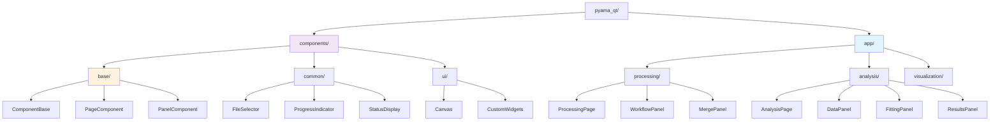
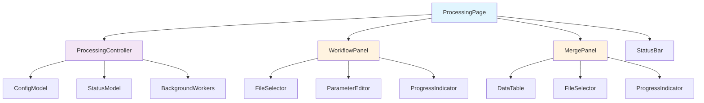
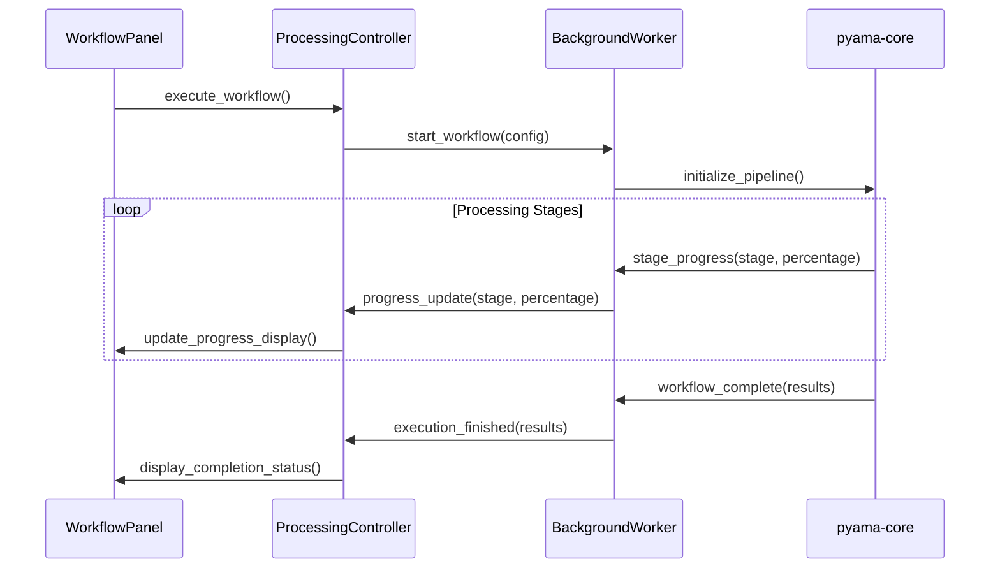
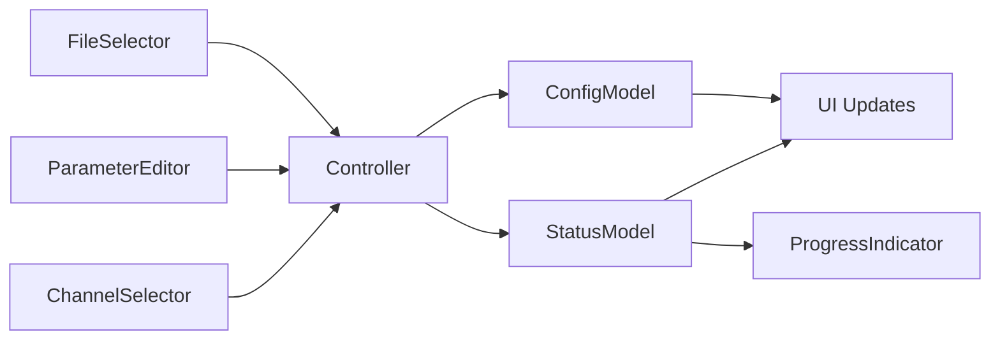
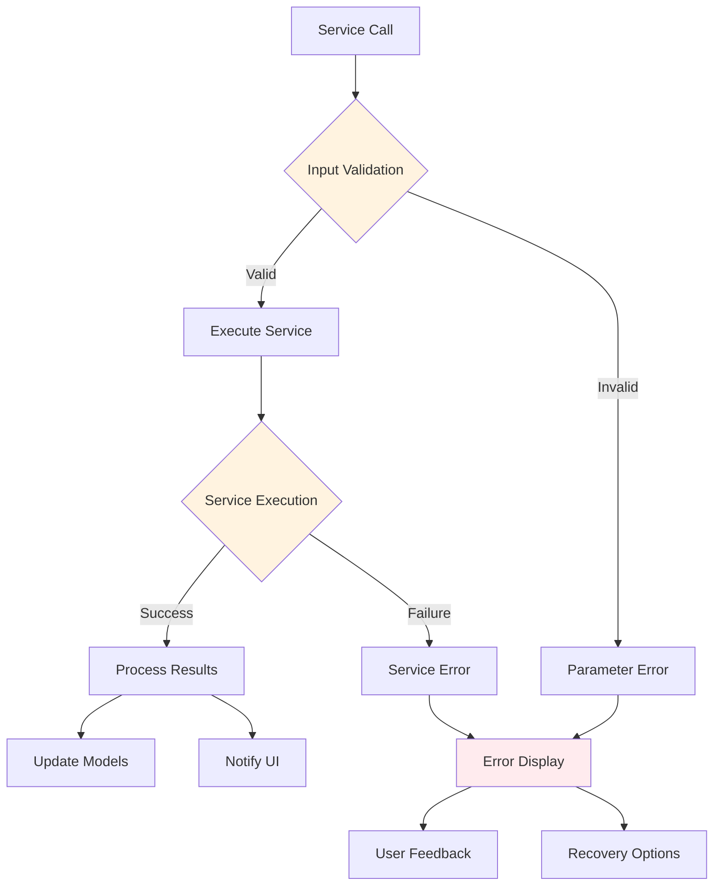
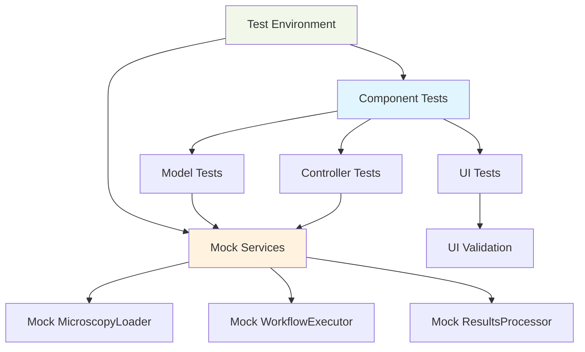

# Component Renaming and Organization for PyAMA-Qt-Slim

## Overview

This design document outlines the component renaming and organizational restructuring for the PyAMA-Qt-Slim application, based on the existing component-based PySide6 implementation. The primary goals are to standardize component naming conventions, consolidate shared components into a centralized location, and implement a complete processing page following the updated architecture specifications.

### Existing Structure

The current pyama-qt-slim follows a Next.js-like structure with analysis components located in:

- `pyama_qt/app/analysis/components/analysis_data_panel.py`
- `pyama_qt/app/analysis/components/analysis_fitting_panel.py`
- `pyama_qt/app/analysis/components/analysis_results_panel.py`

Base components are currently minimal in the `pyama_qt/components` directory.

### Key Changes

The restructuring focuses on three main areas:

- **Component Renaming**: Renaming analysis panel components to remove redundant prefixes
- **Component Organization**: Centralizing base components in `pyama_qt/components` with proper inheritance hierarchy
- **Processing Page Implementation**: Creating a complete, functional processing page as a reference implementation

## Architecture

### Updated Component Organization

The new architecture establishes a clear separation between base components, shared components, and application-specific components:



### Component Naming Standardization

The component naming follows a consistent pattern that reflects functionality rather than application context:

| Original Name               | Updated Name       | Rationale                                                                       |
| --------------------------- | ------------------ | ------------------------------------------------------------------------------- |
| `analysis_data_panel.py`    | `data_panel.py`    | Removes redundant "analysis" prefix as context is clear from directory location |
| `analysis_fitting_panel.py` | `fitting_panel.py` | Simplifies name while maintaining clear functional description                  |
| `analysis_results_panel.py` | `results_panel.py` | Standardizes with other panel naming conventions                                |

### Base Component Centralization

Base components are moved to `pyama_qt/components` to provide application-wide reusability:

```
pyama_qt/
├── components/
│   ├── base/
│   │   ├── __init__.py
│   │   ├── component.py          # ComponentBase abstract class
│   │   ├── page.py               # PageComponent base class
│   │   └── panel.py              # PanelComponent base class
│   │
│   ├── common/                   # Enhanced from existing minimal structure
│   │   ├── __init__.py
│   │   ├── file_selector.py      # Reusable file selection widget
│   │   ├── progress_indicator.py # Progress bars and status displays
│   │   ├── parameter_editor.py   # Parameter input components
│   │   ├── data_table.py         # Enhanced table widgets
│   │   └── sample_table.py       # Migrated from existing components
│   │
│   └── ui/                       # Existing directory enhanced
│       ├── __init__.py
│       ├── canvas.py             # Matplotlib canvas (existing)
│       └── parameter_panel.py    # Migrated from existing components
```

### Component Migration Strategy

The migration preserves the existing self-contained component philosophy where each component contains complete MVC implementation within a single file while establishing proper inheritance from base classes.

## Component Architecture Specifications

### Base Component Framework

#### ComponentBase Abstract Class

The `ComponentBase` class defines the fundamental component lifecycle and interface patterns:

**Core Responsibilities:**

- Component lifecycle management (initialization, binding, cleanup)
- Signal-slot connection framework
- Error handling and validation
- Resource management

**Lifecycle Methods:**

- `build()`: Construct UI structure and child widgets
- `bind()`: Establish signal connections and model bindings
- `cleanup()`: Release resources and disconnect signals

#### PageComponent Base Class

Extends `ComponentBase` for page-level coordination:

**Additional Responsibilities:**

- Controller instantiation and management
- Model lifecycle coordination
- Inter-page communication through signals
- Status bar integration

#### PanelComponent Base Class

Extends `ComponentBase` for panel-level functionality:

**Additional Responsibilities:**

- Section coordination within panels
- Feature-specific signal definitions
- Model binding for panel-specific data
- Validation and error reporting

### Shared Component Library

#### FileSelector Component

A standardized file selection widget used across multiple pages:

**Features:**

- File browser integration with validation
- Support for multiple file types and filters
- Path display and validation feedback
- Integration with application configuration

**Signal Interface:**

- `file_selected(Path)`: Emitted when valid file is selected
- `file_validated(bool, str)`: Validation results with error messages
- `selection_cleared()`: Emitted when selection is reset

#### ProgressIndicator Component

Unified progress reporting component for background operations:

**Features:**

- Configurable progress bar with percentage display
- Status message integration
- Cancellation support for interruptible operations
- Error state visualization

**Signal Interface:**

- `progress_updated(int)`: Progress percentage (0-100)
- `status_changed(str)`: Status message updates
- `operation_cancelled()`: User-initiated cancellation
- `operation_completed(bool)`: Completion with success flag

#### ParameterEditor Component

Reusable parameter input and validation component:

**Features:**

- Type-aware input widgets (int, float, string, boolean)
- Real-time validation with visual feedback
- Preset and configuration management
- Batch parameter updates

**Signal Interface:**

- `parameter_changed(str, object)`: Parameter name and new value
- `validation_failed(str, str)`: Parameter name and error message
- `parameters_updated(dict)`: Batch parameter update

## Processing Page Implementation

### Complete Implementation Architecture

The ProcessingPage implementation follows the established self-contained component philosophy while integrating with the new base component structure. Each component file contains complete MVC implementation with proper inheritance from base classes.

### Page-Level Architecture

The ProcessingPage serves as the reference implementation demonstrating the complete MVC architecture within the updated component organization:



### Implementation Structure

The processing page implementation creates a complete, self-contained file structure:

```
pyama_qt/app/processing/
├── __init__.py
├── page.py                       # Complete ProcessingPage with MVC
└── components/
    ├── __init__.py
    ├── workflow_panel.py          # Complete WorkflowPanel with MVC
    └── merge_panel.py             # Complete MergePanel with MVC
```

Each file contains:

- **Model Classes**: Data management and state tracking
- **Controller Classes**: Business logic and service integration
- **View Classes**: UI components with signal handling
- **Standalone Execution**: Testing capability with `if __name__ == "__main__"`

### Model Architecture

#### ProcessingConfigModel

Manages all processing configuration state with comprehensive validation:

**State Properties:**

- `microscopy_path`: Selected microscopy file path with metadata validation
- `output_directory`: Target directory for processing results with permissions check
- `channel_selection`: Phase contrast and fluorescence channel configuration
- `processing_parameters`: FOV range, batch size, worker configuration with constraints
- `workflow_settings`: Pipeline step selection and parameter overrides

**Signal Interface:**

```
microscopy_path_changed(Path)     # File selection updates
metadata_changed(MicroscopyMetadata) # Metadata extraction completion
output_directory_changed(Path)    # Output directory selection
channels_changed(ChannelSelection) # Channel configuration updates
parameters_changed(ProcessingParameters) # Parameter value changes
validation_failed(str, str)       # Field name and error message
```

**Validation Logic:**

- File existence and format validation (.nd2, .czi support)
- Parameter range checking (FOV ranges, batch size limits)
- Output directory permissions and space verification
- Channel selection consistency with extracted metadata
- Cross-parameter dependency validation (start <= end FOV)

#### WorkflowStatusModel

Tracks execution state with detailed progress and error reporting:

**Status Properties:**

- `execution_state`: Current workflow stage (idle, loading, processing, completing)
- `progress_percentage`: Numeric progress indicator with stage breakdown (0-100)
- `status_message`: Human-readable status updates with stage information
- `error_conditions`: Detailed error collection with suggested resolutions
- `performance_metrics`: Execution timing and resource usage statistics

**Signal Interface:**

```
processing_changed(bool)          # Processing state toggle
progress_changed(int)             # Progress percentage updates
status_message_changed(str)       # Status text updates
error_occurred(str)               # Error condition reporting
stage_changed(str)                # Processing stage transitions
```

- `execution_state`: Current workflow stage (idle, loading, processing, completing)
- `progress_percentage`: Numeric progress indicator with stage breakdown
- `status_message`: Human-readable status updates
- `error_conditions`: Detailed error collection with suggested resolutions
- `performance_metrics`: Execution timing and resource usage statistics

### Controller Implementation

#### ProcessingController

Coordinates all processing operations with comprehensive error handling and background operation management:

**Core Methods:**

- `load_microscopy_file(path)`: Asynchronous file loading with metadata extraction
- `configure_workflow(settings)`: Workflow configuration with comprehensive validation
- `execute_workflow()`: Background workflow execution with real-time progress reporting
- `handle_interruption()`: Graceful workflow cancellation and resource cleanup
- `validate_configuration()`: Pre-execution validation with detailed error reporting

**Service Integration Architecture:**



**Service Integration:**

- **MicroscopyLoader**: Interfaces with pyama-core file I/O services for async loading
- **WorkflowExecutor**: Manages complete processing pipeline execution with monitoring
- **ProgressTracker**: Provides real-time progress updates and performance metrics
- **ErrorHandler**: Comprehensive error categorization with user-friendly reporting

**Background Operation Management:**

- Worker thread pool for parallel processing operations
- Progress callback system for real-time UI updates
- Graceful cancellation with proper resource cleanup
- Memory management for large microscopy datasets

### Component Integration

#### WorkflowPanel Implementation

The WorkflowPanel demonstrates integration of shared components within a cohesive panel structure:

**Component Composition:**

- **InputSection**: Uses `FileSelector` for microscopy file selection with validation
- **ChannelSection**: Custom channel selection component with metadata integration
- **ParameterSection**: Uses `ParameterEditor` for processing parameter configuration
- **ExecutionSection**: Uses `ProgressIndicator` for workflow execution monitoring

**Panel Signal Interface:**

```
file_selected(Path)               # Microscopy file selection
channels_configured(ChannelSelection) # Channel configuration updates
parameters_updated(ProcessingParameters) # Parameter changes
workflow_requested()              # Workflow execution initiation
validation_failed(str, str)       # Validation error reporting
```

**Integration with Shared Components:**



#### MergePanel Implementation

The MergePanel handles sample aggregation using shared components for consistency:

**Component Composition:**

- **SampleLoader**: Uses `FileSelector` for sample configuration file selection
- **FeatureSelector**: Custom component for feature selection with validation
- **OutputConfiguration**: Uses `FileSelector` for output file selection
- **MergeExecution**: Uses `ProgressIndicator` for merge operation monitoring

**Sample Management Features:**

- Load existing sample configurations from CSV/JSON files
- Display sample metadata and processing status in tabular format
- Feature selection with real-time validation
- Batch merge operations with progress tracking

### Integration with pyama-core

The processing page implementation demonstrates comprehensive integration with pyama-core services:

#### Service Interface Layer

**MicroscopyLoader Service:**

- Asynchronous file loading with progress callbacks for large files
- Metadata extraction and validation with error handling
- Support for multiple formats (.nd2, .czi) with format-specific validation
- Memory-efficient loading for large datasets

**WorkflowExecutor Service:**

- Complete pipeline execution with configurable processing stages
- Real-time progress reporting through callback mechanisms
- Resource management and cleanup for background operations
- Error recovery and partial result preservation

**ResultsProcessor Service:**

- Output file generation with configurable formats
- Result aggregation and summary reporting
- Export format configuration (CSV, HDF5, images)
- Quality control and validation reporting

#### Error Handling Strategy

The implementation provides comprehensive error handling across all service integration points:



**Error Categories:**

- **Validation Errors**: Invalid parameters, missing files, permission issues
- **Service Errors**: pyama-core processing failures, memory issues, format errors
- **System Errors**: File system issues, network problems, resource constraints
- **User Errors**: Invalid configurations, unsupported operations

**Recovery Mechanisms:**

- Automatic retry for transient failures
- Graceful degradation for partial service failures
- User-guided recovery with suggested actions
- State preservation for operation resumption

## Testing Strategy

### Component Testing Framework

The updated architecture supports comprehensive testing through clear component boundaries and inheritance hierarchies:

#### Unit Testing Approach

**Base Component Testing:**

- Lifecycle method validation (build, bind, cleanup)
- Signal emission verification and connection testing
- Error condition handling and recovery mechanisms
- Resource management and memory leak detection

**Shared Component Testing:**

- FileSelector validation and error handling with various file types
- ParameterEditor type conversion, validation, and constraint checking
- ProgressIndicator display updates, user interaction, and cancellation
- DataTable sorting, filtering, and data manipulation operations

**Processing Page Component Testing:**

- Model-view synchronization and automatic UI updates
- Controller operation coordination and background thread management
- Inter-component communication through signal-slot mechanisms
- Integration with pyama-core services through mock implementations

#### Integration Testing Strategy

**Service Integration Testing:**

- Mock pyama-core services for controller testing without external dependencies
- Background operation simulation, progress reporting, and cancellation handling
- Error propagation and user feedback validation across component boundaries
- Performance testing for large dataset handling and memory management

**End-to-End Testing:**

- Complete workflow execution simulation from file selection to results
- User interaction scenario testing with realistic data and configurations
- Error recovery testing with various failure modes and conditions
- Cross-platform compatibility testing for different operating systems

**Component Interaction Testing:**

- Signal flow validation between components and across hierarchy levels
- Model synchronization across multiple components and views
- Event handling and user interaction propagation
- State consistency during complex operations and error conditions

### Test Case Organization

| Test Category              | Focus Area            | Validation Scope                                     |
| -------------------------- | --------------------- | ---------------------------------------------------- |
| **Base Component Tests**   | Component lifecycle   | Signal emission, resource management, error handling |
| **Shared Component Tests** | Reusable widgets      | Input validation, display updates, configuration     |
| **Processing Page Tests**  | Complete workflows    | Model synchronization, service integration           |
| **Integration Tests**      | Component interaction | Signal flow, error propagation, user feedback        |
| **Performance Tests**      | Background operations | Memory usage, responsiveness, cancellation           |

### Mock Service Implementation

Testing utilizes comprehensive mock implementations of pyama-core services:



**Mock Service Features:**

- Configurable response times for testing async operations
- Error injection capabilities for testing error handling
- Progress simulation for testing progress reporting
- Resource usage simulation for performance testing

### Implementation Validation

The testing strategy validates the complete implementation:

**Component Renaming Validation:**

- Verify all analysis panel components are correctly renamed
- Ensure import statements and references are updated
- Validate component functionality remains intact after renaming

**Component Organization Validation:**

- Confirm base components are properly centralized in pyama_qt/components
- Verify inheritance relationships function correctly
- Ensure shared components are accessible across application modules

**Processing Page Implementation Validation:**

- Complete workflow execution testing with realistic data
- Integration testing with mock pyama-core services
- Performance testing for background operations and responsiveness
- Error handling testing with various failure scenarios

## Implementation Guidelines

### Migration Sequence

The implementation follows a structured migration sequence:

1. **Component Renaming Phase**

   - Rename analysis panel components (analysis_data_panel.py → data_panel.py)
   - Update import statements and internal references
   - Verify component functionality through testing

2. **Base Component Development Phase**

   - Create base component classes in pyama_qt/components/base/
   - Implement ComponentBase abstract class with lifecycle methods
   - Develop PageComponent and PanelComponent base classes

3. **Shared Component Migration Phase**

   - Move existing components to pyama_qt/components/common/
   - Enhance components with base class inheritance
   - Implement new shared components (FileSelector, ProgressIndicator, etc.)

4. **Processing Page Implementation Phase**
   - Implement complete ProcessingPage with MVC architecture
   - Create WorkflowPanel and MergePanel components
   - Integrate with pyama-core services and shared components

### Quality Assurance

**Code Quality Standards:**

- Comprehensive docstring documentation for all components
- Type hints for method signatures and return values
- Consistent naming conventions following PEP 8 guidelines
- Signal-slot connection documentation and validation

**Testing Requirements:**

- Minimum 90% code coverage for all new and modified components
- Integration testing for all component interactions
- Performance testing for background operations
- Cross-platform compatibility validation

**Review Process:**

- Architecture review for component design and integration patterns
- Code review for implementation quality and consistency
- Testing review for coverage and scenario completeness
- Documentation review for clarity and completeness

This comprehensive design ensures a successful transformation of the pyama-qt-slim architecture while maintaining functionality and improving maintainability through standardized component organization and naming.
