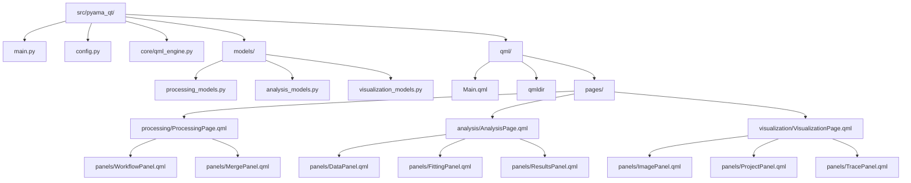
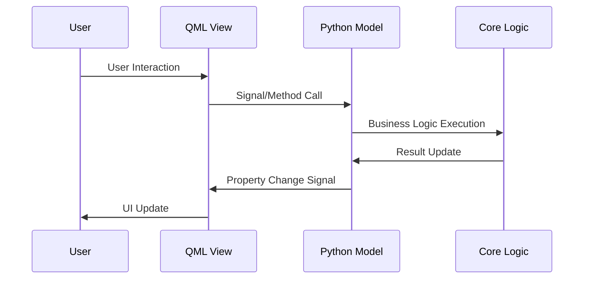

# QML Idiomatic Refactor Design

## Overview

This design document outlines the strategic refactoring of the PyAMA Qt application from a hybrid Python/Qt architecture to a clean, idiomatic QML-based architecture. The refactor transforms the current widget-based UI implementation into a declarative QML interface while maintaining the existing functionality across processing, analysis, and visualization modules.

The refactoring introduces a clear separation between presentation (QML), business logic (Python models), and application state management through a standardized QML engine pattern. This approach leverages QML's declarative nature for UI development while preserving the robust Python backend for complex microscopy data processing.

## Current Architecture Analysis

### Existing Structure Assessment

The current pyama-qt implementation follows a mixed architecture:

| Component         | Current Implementation                            | Architecture Pattern                 |
| ----------------- | ------------------------------------------------- | ------------------------------------ |
| UI Layer          | Python QWidget-based panels and pages             | Imperative widget composition        |
| Data Models       | Python QObject models with Qt properties          | Model-View pattern                   |
| Controllers       | Python controller classes managing business logic | MVC with signal-slot communication   |
| Application Entry | Python main.py with QApplication setup            | Traditional Qt application lifecycle |

### Legacy Dependencies

The current implementation maintains dependencies on:

- Widget-based layouts (QVBoxLayout, QHBoxLayout)
- Mixed QQuickWidget embedding within QWidget containers
- Controller classes handling both UI state and business logic
- Manual signal-slot connections between components

## Target Architecture

### Architectural Principles

The target architecture follows these core principles:

| Principle                 | Implementation Strategy                             | Benefit                                             |
| ------------------------- | --------------------------------------------------- | --------------------------------------------------- |
| **Declarative UI**        | Pure QML component hierarchy                        | Improved maintainability and designer collaboration |
| **Model-View Separation** | Python models exposed to QML via context properties | Clear data flow and testability                     |
| **Component Reusability** | Modular QML panel components                        | Consistent UI patterns and reduced duplication      |
| **Engine Centralization** | Single QML engine managing all type registration    | Simplified deployment and debugging                 |

### Directory Structure Transformation

The refactoring reorganizes the codebase according to modern QML application patterns:

## Component Architecture

### QML Engine Management

The core QML engine serves as the central orchestrator for the application:

**QML Engine Responsibilities:**

- Type registration for all Python models
- QML import path configuration
- Root context property management
- Application lifecycle coordination

**Engine Configuration:**

- Single engine instance shared across application
- Centralized type registration preventing conflicts
- Context property injection for model access
- QML module path resolution

### Model Layer Design

The Python model layer provides the data interface between QML views and core processing logic:

| Model Category           | Purpose                           | Key Properties                                         |
| ------------------------ | --------------------------------- | ------------------------------------------------------ |
| **Processing Models**    | Workflow configuration and status | microscopyPath, channelSelection, processingParameters |
| **Analysis Models**      | Data analysis and curve fitting   | dataPath, modelSelection, fittingResults               |
| **Visualization Models** | Image and trace display state     | currentProject, selectedFOV, traceData                 |

**Model Pattern:**

- Each model inherits from QObject for property system
- Properties use Qt's Property system with change signals
- Validation methods return structured error information
- Async operations emit progress and completion signals

### QML Component Hierarchy

The QML layer implements a hierarchical component structure:

**Page-Level Components:**

- Each page represents a major functional area
- Pages manage panel coordination and navigation
- State persistence across page switches
- Integration with Python model layer

**Panel-Level Components:**

- Encapsulate specific UI functionality
- Reusable across different contexts
- Clear property interfaces for configuration
- Signal emission for user interactions

## Data Flow Architecture

### Model-View Communication

The data flow follows a unidirectional pattern from models to QML views:

**Data Binding Strategy:**

- QML components bind directly to model properties
- Model changes automatically update bound QML elements
- User interactions trigger model methods via signals
- Validation feedback provided through dedicated properties

### State Management

Application state is managed through the model layer with these patterns:

| State Type               | Management Strategy                | Persistence            |
| ------------------------ | ---------------------------------- | ---------------------- |
| **UI State**             | QML component internal state       | Session-based          |
| **Configuration**        | Python model properties            | File-based persistence |
| **Processing Status**    | Workflow status model with signals | Temporary              |
| **Application Settings** | Configuration dataclass            | Settings file          |

## Processing Module Transformation

### Current Processing Architecture

The existing processing module uses:

- QWidget-based ProcessingPage with embedded panels
- Python controllers managing workflow execution
- Mixed QML/Widget panel implementation
- Manual layout management

### Target Processing Architecture

The refactored processing module implements:

**Processing Page Structure:**

- Pure QML ProcessingPage.qml as root component
- Declarative panel layout with responsive design
- Model binding for all configuration properties
- Integrated status feedback through model properties

**Panel Decomposition:**

| Panel             | Responsibilities                       | Model Interface       |
| ----------------- | -------------------------------------- | --------------------- |
| **WorkflowPanel** | Workflow configuration and execution   | ProcessingConfigModel |
| **MergePanel**    | Sample assignment and merge operations | MergeConfigModel      |

**Workflow Execution Pattern:**

- QML triggers workflow through model methods
- Python models manage async processing via QThread
- Progress updates flow through model property changes
- Status feedback displayed via declarative QML bindings

## Analysis Module Transformation

### Analysis Component Strategy

The analysis module transformation focuses on:

**Data Management:**

- AnalysisDataModel for CSV import/export operations
- Model selection through enumerated property system
- Batch fitting status through dedicated progress model

**UI Component Design:**

| Panel Component  | Primary Function                            | Data Binding                         |
| ---------------- | ------------------------------------------- | ------------------------------------ |
| **DataPanel**    | File selection and data preview             | dataPath, previewData properties     |
| **FittingPanel** | Model selection and parameter configuration | modelType, parameters properties     |
| **ResultsPanel** | Results visualization and export            | fittingResults, chartData properties |

**Analysis Workflow:**

- Declarative model selection through QML ComboBox
- Parameter configuration via property-bound input controls
- Results visualization through Chart.js or similar QML charting

## Visualization Module Transformation

### Visualization Architecture Design

The visualization module implements:

**Image Display Management:**

- Custom QML components for microscopy image rendering
- Zoom and pan functionality through declarative transforms
- Synchronized selection across image and trace views

**Component Structure:**

| Component        | Functionality                          | Technical Implementation             |
| ---------------- | -------------------------------------- | ------------------------------------ |
| **ImagePanel**   | Microscopy image display with zoom/pan | QML Image with custom mouse handling |
| **ProjectPanel** | FOV navigation and selection           | ListView with custom delegate        |
| **TracePanel**   | Temporal trace visualization           | QML Charts or custom Canvas drawing  |

**Synchronization Strategy:**

- Shared visualization model managing selection state
- Property bindings propagating selection changes
- Coordinated updates across all visualization panels

## QML Module Organization

### QML Directory Structure

The QML modules are organized for maximum reusability and maintainability:

**Module Registration:**

- qmldir file defines module exports and versions
- Component registration enables cross-module imports
- Version management supports API evolution

**Component Naming Convention:**

| Component Type | Naming Pattern       | Example            |
| -------------- | -------------------- | ------------------ |
| **Pages**      | {Module}Page.qml     | ProcessingPage.qml |
| **Panels**     | {Function}Panel.qml  | WorkflowPanel.qml  |
| **Controls**   | {Purpose}Control.qml | FileSelector.qml   |

### Import Path Configuration

QML import paths are configured to support:

- Local component resolution within module hierarchy
- Cross-module component reuse
- Third-party QML module integration
- Development vs. deployment path handling

## Migration Strategy

### Phase-Based Migration Approach

The migration follows a systematic phase-based approach:

| Phase       | Scope                                     | Deliverables                                      |
| ----------- | ----------------------------------------- | ------------------------------------------------- |
| **Phase 1** | Core infrastructure and processing module | QML engine, processing models, ProcessingPage.qml |
| **Phase 2** | Analysis module transformation            | Analysis models and QML components                |
| **Phase 3** | Visualization module and integration      | Visualization components and full QML main window |
| **Phase 4** | Testing and optimization                  | Performance tuning and feature parity validation  |

### Compatibility Preservation

During migration, compatibility is maintained through:

- Gradual replacement of widget components with QML equivalents
- Preserved public API for model classes
- Backward-compatible signal signatures
- Configuration format consistency

### Data Migration Requirements

The refactoring preserves data compatibility:

- Existing configuration files remain compatible
- Processing pipeline configurations transfer unchanged
- Analysis results maintain format consistency
- User preferences migrate automatically

## Testing Strategy

### Component Testing Approach

The testing strategy addresses both Python and QML components:

**Python Model Testing:**

- Unit tests for model property validation
- Signal emission verification
- Business logic correctness
- Async operation handling

**QML Component Testing:**

- Component instantiation and property binding tests
- User interaction simulation
- Integration testing with Python models
- Visual regression testing for UI consistency

### Integration Testing Framework

Integration testing covers:

- End-to-end workflow execution
- Cross-component communication
- Data persistence and recovery
- Performance benchmarking

## Performance Considerations

### QML Rendering Optimization

Performance optimization focuses on:

| Optimization Area     | Strategy                              | Expected Benefit                 |
| --------------------- | ------------------------------------- | -------------------------------- |
| **Component Loading** | Lazy loading of complex panels        | Improved startup time            |
| **Data Binding**      | Efficient property change propagation | Reduced CPU overhead             |
| **Image Rendering**   | Optimized QML Image components        | Smooth visualization performance |
| **Memory Management** | Proper QML object lifecycle           | Reduced memory footprint         |

### Rendering Performance

QML rendering performance is optimized through:

- Scene graph optimization for complex visualizations
- Texture sharing for repeated graphical elements
- Efficient property animations and transitions
- Background thread utilization for heavy computations

## Configuration Management

### Application Configuration

Configuration management is centralized through:

**Configuration Structure:**

- Single config.py module with dataclass definitions
- Environment-specific configuration overrides
- Runtime configuration validation
- User preference persistence

**Settings Categories:**

| Category        | Configuration Elements             | Storage Method             |
| --------------- | ---------------------------------- | -------------------------- |
| **Application** | Window geometry, theme preferences | Qt QSettings               |
| **Processing**  | Default parameters, worker counts  | YAML configuration         |
| **Paths**       | Default directories, recent files  | Platform-specific settings |

### QML-Specific Configuration

QML configuration includes:

- Component styling parameters
- Animation durations and easing curves
- Layout spacing and sizing preferences
- Color themes and visual styling
