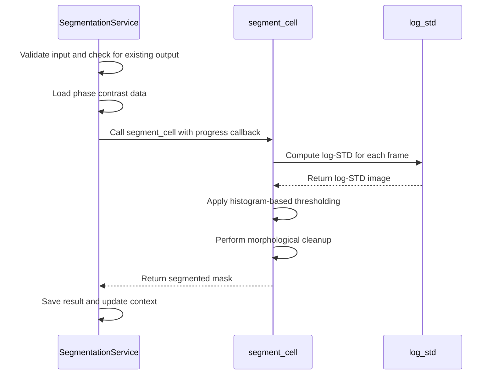
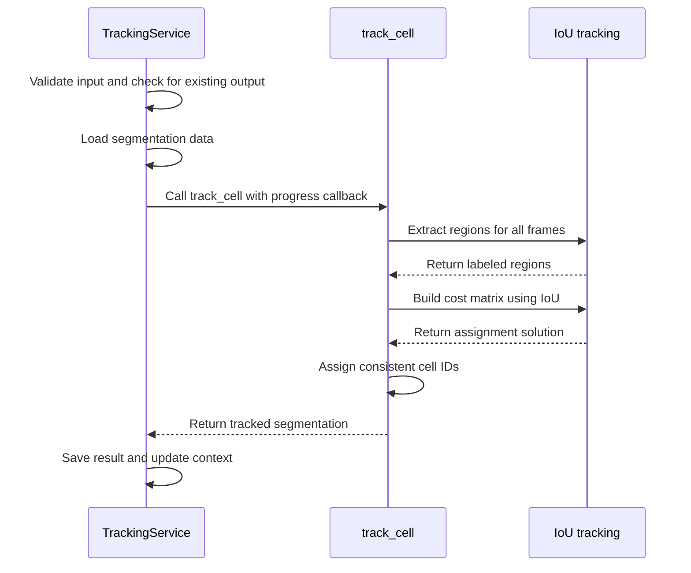
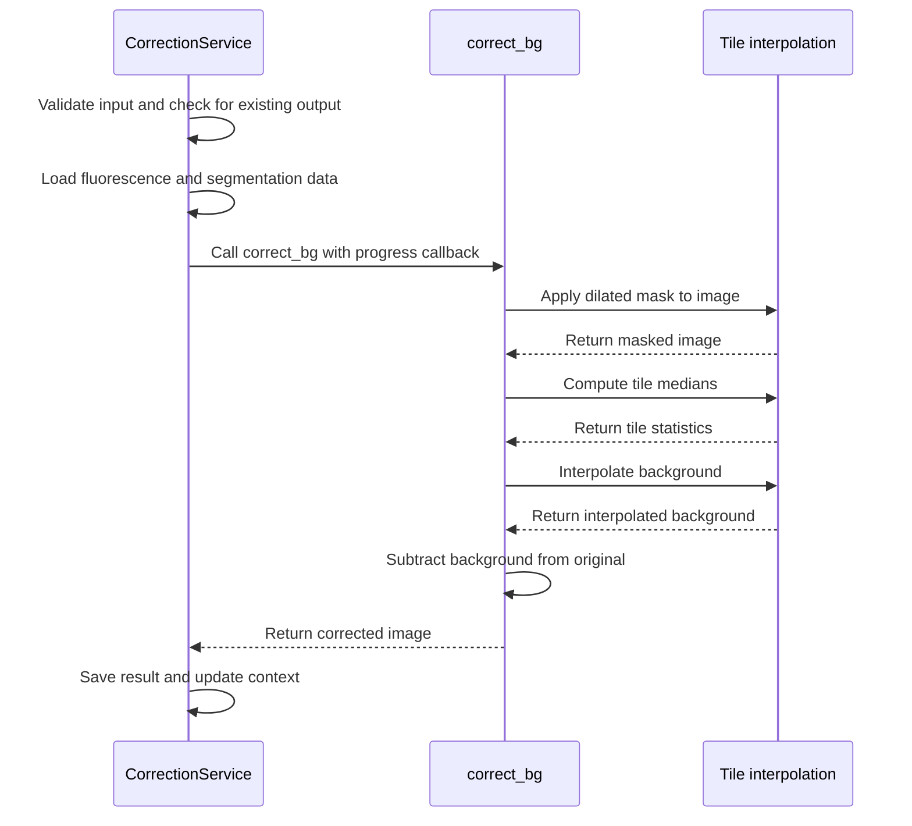
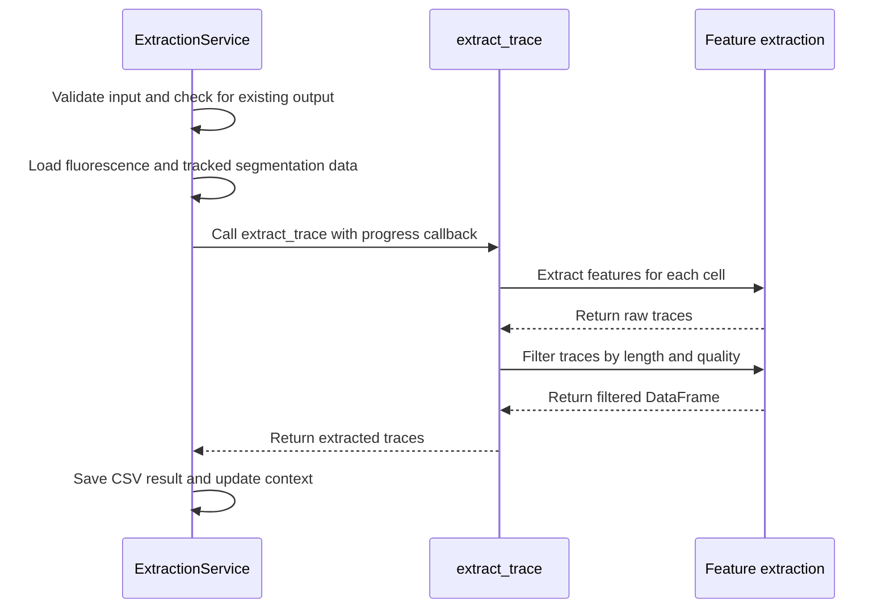
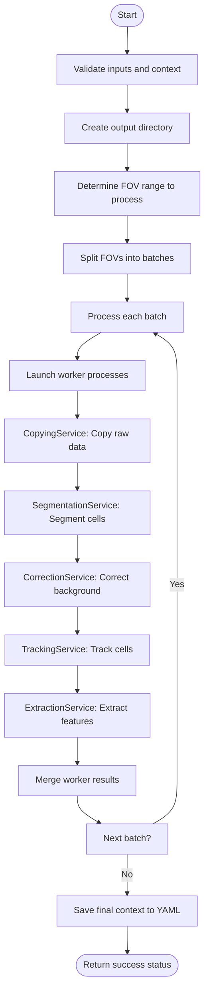

# API Reference

<cite>
**Referenced Files in This Document**   
- [segmentation.py](file://pyama-core/src/pyama_core/processing/workflow/services/steps/segmentation.py)
- [tracking.py](file://pyama-core/src/pyama_core/processing/workflow/services/steps/tracking.py)
- [types.py](file://pyama-core/src/pyama_core/processing/workflow/services/types.py)
- [fitting.py](file://pyama-core/src/pyama_core/analysis/fitting.py)
- [base.py](file://pyama-core/src/pyama_core/processing/workflow/services/base.py)
- [pipeline.py](file://pyama-core/src/pyama_core/processing/workflow/pipeline.py)
- [microscopy.py](file://pyama-core/src/pyama_core/io/microscopy.py)
- [correction.py](file://pyama-core/src/pyama_core/processing/workflow/services/steps/correction.py)
- [extraction.py](file://pyama-core/src/pyama_core/processing/workflow/services/steps/extraction.py)
- [log_std.py](file://pyama-core/src/pyama_core/processing/segmentation/log_std.py)
- [iou.py](file://pyama-core/src/pyama_core/processing/tracking/iou.py)
- [tile_interp.py](file://pyama-core/src/pyama_core/processing/background/tile_interp.py)
- [trace.py](file://pyama-core/src/pyama_core/processing/extraction/trace.py)
- [__init__.py](file://pyama-core/src/pyama_core/analysis/models/__init__.py)
- [trivial.py](file://pyama-core/src/pyama_core/analysis/models/trivial.py)
- [maturation.py](file://pyama-core/src/pyama_core/analysis/models/maturation.py)
- [maturation_blocked.py](file://pyama-core/src/pyama_core/analysis/models/maturation_blocked.py)
</cite>

## Table of Contents
1. [Introduction](#introduction)
2. [Processing Services](#processing-services)
   - [SegmentationService](#segmentationservice)
   - [TrackingService](#trackingservice)
   - [CorrectionService](#correctionservice)
   - [ExtractionService](#extractionservice)
   - [CopyingService](#copyingservice)
3. [Data Models](#data-models)
   - [ProcessingContext](#processingcontext)
   - [ResultsPathsPerFOV](#resultspathsperfov)
   - [MicroscopyMetadata](#microscopymetadata)
   - [Channels](#channels)
4. [Analysis Fitting Interface](#analysis-fitting-interface)
   - [FittingResult](#fittingresult)
   - [fit_model](#fit_model)
   - [fit_trace_data](#fit_trace_data)
   - [get_trace](#get_trace)
5. [Model Registration System](#model-registration-system)
   - [Available Models](#available-models)
   - [Parameter Definitions](#parameter-definitions)
6. [Workflow Pipeline](#workflow-pipeline)
   - [run_complete_workflow](#run_complete_workflow)
7. [Versioning and Compatibility](#versioning-and-compatibility)
8. [Integration Examples](#integration-examples)

## Introduction
This API reference documents the public interfaces of the pyama-core library, providing comprehensive technical documentation for developers building on the PyAMA platform. The library is organized into functional areas including processing, analysis, and I/O operations. The core architecture follows a service-based pattern where each processing step is encapsulated in a dedicated service class that inherits from BaseProcessingService. Data flow is managed through standardized data models like ProcessingContext and ResultsPathsPerFOV, ensuring consistency across the pipeline. The analysis subsystem provides a flexible model registration system that supports multiple fitting models for trace data analysis.

## Processing Services

### SegmentationService
Implements cell segmentation using LOG-STD thresholding and morphological operations. The service processes phase contrast data to generate binary masks identifying cell regions.

**Parameters:**
- `metadata`: MicroscopyMetadata object containing file information
- `context`: ProcessingContext with processing parameters and results tracking
- `output_dir`: Path object specifying where to store output files
- `fov`: Integer indicating the field of view index to process

**Returns:**
- None. Results are written to the output directory and context object.

**Exceptions:**
- FileNotFoundError: Raised when phase contrast input file is not found
- ValueError: Raised when input data has incorrect dimensions

**Behavior:**
The service checks for existing output to avoid redundant processing. It loads phase contrast data, applies segmentation using the segment_cell function, and stores results as boolean arrays. The service updates the context.results_paths dictionary with output file locations.



**Diagram sources**
- [segmentation.py](file://pyama-core/src/pyama_core/processing/workflow/services/steps/segmentation.py#L25-L124)
- [log_std.py](file://pyama-core/src/pyama_core/processing/segmentation/log_std.py#L93-L130)

**Section sources**
- [segmentation.py](file://pyama-core/src/pyama_core/processing/workflow/services/steps/segmentation.py#L25-L124)

### TrackingService
Implements cell tracking across frames using IoU-based Hungarian assignment. The service processes segmented data to assign consistent cell IDs over time.

**Parameters:**
- `metadata`: MicroscopyMetadata object containing file information
- `context`: ProcessingContext with processing parameters and results tracking
- `output_dir`: Path object specifying where to store output files
- `fov`: Integer indicating the field of view index to process

**Returns:**
- None. Results are written to the output directory and context object.

**Exceptions:**
- FileNotFoundError: Raised when segmentation input file is not found
- ValueError: Raised when input data has incorrect dimensions

**Behavior:**
The service checks for existing output to avoid redundant processing. It loads segmented data, applies tracking using the track_cell function, and stores results as labeled integer arrays. The service updates the context.results_paths dictionary with output file locations.



**Diagram sources**
- [tracking.py](file://pyama-core/src/pyama_core/processing/workflow/services/steps/tracking.py#L25-L125)
- [iou.py](file://pyama-core/src/pyama_core/processing/tracking/iou.py#L279-L360)

**Section sources**
- [tracking.py](file://pyama-core/src/pyama_core/processing/workflow/services/steps/tracking.py#L25-L125)

### CorrectionService
Implements background correction for fluorescence channels using tiled interpolation. The service processes fluorescence data to remove background artifacts.

**Parameters:**
- `metadata`: MicroscopyMetadata object containing file information
- `context`: ProcessingContext with processing parameters and results tracking
- `output_dir`: Path object specifying where to store output files
- `fov`: Integer indicating the field of view index to process

**Returns:**
- None. Results are written to the output directory and context object.

**Exceptions:**
- FileNotFoundError: Raised when segmentation input file is not found
- ValueError: Raised when input data has incorrect dimensions or shapes don't match

**Behavior:**
The service checks for existing output to avoid redundant processing. It loads fluorescence and segmentation data, applies background correction using the correct_bg function, and stores results as float32 arrays. The service updates the context.results_paths dictionary with output file locations.



**Diagram sources**
- [correction.py](file://pyama-core/src/pyama_core/processing/workflow/services/steps/correction.py#L25-L146)
- [tile_interp.py](file://pyama-core/src/pyama_core/processing/background/tile_interp.py#L152-L192)

**Section sources**
- [correction.py](file://pyama-core/src/pyama_core/processing/workflow/services/steps/correction.py#L25-L146)

### ExtractionService
Implements feature extraction and trace generation from fluorescence data. The service processes corrected fluorescence data to extract cell-level features over time.

**Parameters:**
- `metadata`: MicroscopyMetadata object containing file information
- `context`: ProcessingContext with processing parameters and results tracking
- `output_dir`: Path object specifying where to store output files
- `fov`: Integer indicating the field of view index to process

**Returns:**
- None. Results are written to the output directory and context object.

**Exceptions:**
- FileNotFoundError: Raised when tracked segmentation input file is not found
- InterruptedError: Raised when feature extraction is interrupted

**Behavior:**
The service checks for existing output to avoid redundant processing. It loads fluorescence and tracked segmentation data, extracts features using the extract_trace function, and stores results as CSV files. The service prioritizes corrected fluorescence data but falls back to raw data if corrections are unavailable. The service updates the context.results_paths dictionary with output file locations.



**Diagram sources**
- [extraction.py](file://pyama-core/src/pyama_core/processing/workflow/services/steps/extraction.py#L25-L132)
- [trace.py](file://pyama-core/src/pyama_core/processing/extraction/trace.py#L188-L235)

**Section sources**
- [extraction.py](file://pyama-core/src/pyama_core/processing/workflow/services/steps/extraction.py#L25-L132)

### CopyingService
Implements data loading and copying from microscopy files. The service handles the initial data extraction from source files to working directories.

**Parameters:**
- `metadata`: MicroscopyMetadata object containing file information
- `context`: ProcessingContext with processing parameters and results tracking
- `output_dir`: Path object specifying where to store output files
- `fov`: Integer indicating the field of view index to process

**Returns:**
- None. Results are written to the output directory and context object.

**Behavior:**
The service checks for existing output to avoid redundant processing. It loads data from the source microscopy file using load_microscopy_file, copies specified channels (phase contrast and fluorescence) to the output directory as numpy memory-mapped files, and updates the context.results_paths dictionary with output file locations.

**Section sources**
- [copying.py](file://pyama-core/src/pyama_core/processing/workflow/services/copying.py#L23-L98)

## Data Models

### ProcessingContext
Central data model that maintains processing state and configuration across pipeline steps.

**Attributes:**
- `output_dir`: Path object or None - Output directory for processed files
- `channels`: Channels object or None - Channel configuration for processing
- `results_paths`: Dictionary mapping FOV indices to ResultsPathsPerFOV objects, or None
- `params`: Dictionary of additional processing parameters, or None
- `time_units`: String or None - Units for time values (e.g., "min")

**Section sources**
- [types.py](file://pyama-core/src/pyama_core/processing/workflow/services/types.py#L25-L30)

### ResultsPathsPerFOV
Data model that tracks file paths for processing results on a per-FOV basis.

**Attributes:**
- `pc`: Tuple[int, Path] or None - Phase contrast channel index and file path
- `fl`: List of tuples[int, Path] - Fluorescence channel indices and file paths
- `seg`: Tuple[int, Path] or None - Segmentation channel index and file path
- `seg_labeled`: Tuple[int, Path] or None - Tracked segmentation channel index and file path
- `fl_corrected`: List of tuples[int, Path] - Corrected fluorescence channel indices and file paths
- `traces_csv`: List of tuples[int, Path] - Trace CSV file channel indices and file paths

**Section sources**
- [types.py](file://pyama-core/src/pyama_core/processing/workflow/services/types.py#L15-L21)

### MicroscopyMetadata
Data model that contains metadata extracted from microscopy files.

**Attributes:**
- `file_path`: Path - Path to the source microscopy file
- `base_name`: String - Base name of the file (without extension)
- `file_type`: String - File format (e.g., "nd2", "czi")
- `height`: Integer - Image height in pixels
- `width`: Integer - Image width in pixels
- `n_frames`: Integer - Number of time points
- `n_fovs`: Integer - Number of fields of view
- `n_channels`: Integer - Number of channels
- `timepoints`: List[float] - Time points in microseconds
- `channel_names`: List[str] - Names of channels
- `dtype`: String - Data type of the image data

**Section sources**
- [microscopy.py](file://pyama-core/src/pyama_core/io/microscopy.py#L11-L24)

### Channels
Data model that specifies which channels to process.

**Attributes:**
- `pc`: Integer or None - Phase contrast channel index
- `fl`: List[int] - Fluorescence channel indices

**Section sources**
- [types.py](file://pyama-core/src/pyama_core/processing/workflow/services/types.py#L9-L11)

## Analysis Fitting Interface

### FittingResult
Data model that represents the results of a curve fitting operation.

**Attributes:**
- `fitted_params`: Dictionary mapping parameter names to fitted values
- `success`: Boolean indicating whether the fitting was successful
- `r_squared`: Float representing the coefficient of determination (0.0-1.0)

**Section sources**
- [fitting.py](file://pyama-core/src/pyama_core/analysis/fitting.py#L14-L17)

### fit_model
Core function for fitting mathematical models to trace data.

**Parameters:**
- `model_type`: String specifying the model to use (e.g., "trivial", "maturation")
- `t_data`: NumPy array of time values
- `y_data`: NumPy array of intensity values
- `user_params`: Optional dictionary of initial parameter values
- `user_bounds`: Optional dictionary of parameter bounds

**Returns:**
- FittingResult object containing fitted parameters, success status, and R-squared value

**Exceptions:**
- ValueError: Raised when invalid parameter names are provided

**Behavior:**
The function validates inputs, cleans data by removing NaN values, sets up the optimization problem with appropriate bounds, and uses scipy.optimize.least_squares to fit the model. It computes the R-squared value to assess fit quality.

**Section sources**
- [fitting.py](file://pyama-core/src/pyama_core/analysis/fitting.py#L102-L147)

### fit_trace_data
Convenience function for fitting models to trace data extracted from DataFrames.

**Parameters:**
- `df`: Pandas DataFrame with time as index and cells as columns
- `model_type`: String specifying the model to use
- `cell_id`: Integer index or string column name identifying the cell
- `progress_callback`: Optional callable for progress reporting
- `user_params`: Optional dictionary of initial parameter values
- `user_bounds`: Optional dictionary of parameter bounds
- `**kwargs`: Additional keyword arguments (currently unused)

**Returns:**
- FittingResult object containing the fitting results

**Behavior:**
The function extracts trace data using get_trace, calls fit_model with the extracted data, and optionally reports progress.

**Section sources**
- [fitting.py](file://pyama-core/src/pyama_core/analysis/fitting.py#L174-L193)

### get_trace
Utility function for extracting trace data from DataFrames.

**Parameters:**
- `df`: Pandas DataFrame with time as index and cells as columns
- `cell_id`: Integer index (positional) or string column name identifying the cell

**Returns:**
- Tuple of (time_data, trace_data) as NumPy arrays

**Behavior:**
The function extracts time values from the DataFrame index and trace values from the specified column, handling both positional and named access.

**Section sources**
- [fitting.py](file://pyama-core/src/pyama_core/analysis/fitting.py#L150-L171)

## Model Registration System

### Available Models
The system supports multiple mathematical models for curve fitting, registered in the MODELS dictionary.

**Registered Models:**
- "trivial": Simple maturation model with basic parameters
- "maturation": Extended maturation model with additional kinetic parameters
- "maturation_blocked": Maturation model with blocked maturation pathway

**Access Functions:**
- `get_model(model_name)`: Returns the model module by name
- `get_types(model_name)`: Returns a dictionary of type definitions for the model
- `list_models()`: Returns a list of available model names

**Section sources**
- [__init__.py](file://pyama-core/src/pyama_core/analysis/models/__init__.py#L8-L12)

### Parameter Definitions
Each model defines several type classes that standardize parameter handling.

**Common Type Classes:**
- `Params`: Dataclass defining all model parameters with their types
- `Bounds`: Dataclass defining bounds for each parameter as (min, max) tuples
- `UserParams`: Dataclass defining optional user-specifiable parameters with default None values
- `UserBounds`: Dataclass defining optional user-specifiable bounds with default None values
- `DEFAULTS`: Instance of Params class containing default parameter values

**Model-Specific Parameters:**
- **Trivial Model:** t0, ktl, delta, beta, offset
- **Maturation Model:** t0, ktl, km, delta, beta, offset
- **Maturation Blocked Model:** t0, G0, Gu0, km, beta, offset

**Section sources**
- [trivial.py](file://pyama-core/src/pyama_core/analysis/models/trivial.py#L9-L46)
- [maturation.py](file://pyama-core/src/pyama_core/analysis/models/maturation.py#L9-L51)
- [maturation_blocked.py](file://pyama-core/src/pyama_core/analysis/models/maturation_blocked.py#L9-L51)

## Workflow Pipeline

### run_complete_workflow
Orchestrates the complete processing workflow across multiple FOVs with parallel execution.

**Parameters:**
- `metadata`: MicroscopyMetadata object containing file information
- `context`: ProcessingContext with processing configuration
- `fov_start`: Integer or None - Starting FOV index (0-based, inclusive)
- `fov_end`: Integer or None - Ending FOV index (0-based, inclusive)
- `batch_size`: Integer - Number of FOVs to process in each batch (default: 2)
- `n_workers`: Integer - Number of parallel workers (default: 2)

**Returns:**
- Boolean indicating overall success (True if all FOVs processed successfully)

**Exceptions:**
- ValueError: Raised when context is missing required information like output_dir
- RuntimeError: Raised when file loading fails

**Behavior:**
The function processes FOVs in batches, with each batch processed in parallel across multiple worker processes. For each batch, it:
1. Copies raw data using CopyingService
2. Applies segmentation using SegmentationService
3. Performs background correction using CorrectionService
4. Tracks cells using TrackingService
5. Extracts features using ExtractionService

Worker processes communicate progress through a shared queue, and results are merged into the parent context. The final context is serialized to a YAML file for downstream use.



**Diagram sources**
- [pipeline.py](file://pyama-core/src/pyama_core/processing/workflow/pipeline.py#L0-L558)

**Section sources**
- [pipeline.py](file://pyama-core/src/pyama_core/processing/workflow/pipeline.py#L0-L558)

## Versioning and Compatibility
The pyama-core library follows semantic versioning principles to ensure backward compatibility. Public interfaces in the processing, analysis, and I/O modules are considered stable and will maintain backward compatibility within major versions. Breaking changes will only occur with major version increments and will be accompanied by migration guides.

The data model interfaces (ProcessingContext, ResultsPathsPerFOV, MicroscopyMetadata) are designed to be extensible, allowing new fields to be added without breaking existing code. The model registration system supports adding new analysis models without affecting existing functionality.

Configuration parameters in the ProcessingContext.params dictionary provide a flexible mechanism for introducing new processing options without changing function signatures.

## Integration Examples

### Calling the Pipeline Programmatically
```python
from pyama_core.io import load_microscopy_file
from pyama_core.processing.workflow.pipeline import run_complete_workflow
from pyama_core.processing.workflow.services.types import ProcessingContext

# Load microscopy file and metadata
file_path = "path/to/microscopy.nd2"
img, metadata = load_microscopy_file(file_path)

# Configure processing context
context = ProcessingContext()
context.output_dir = "path/to/output"
context.channels.pc = 0  # Phase contrast on channel 0
context.channels.fl = [1, 2]  # Fluorescence on channels 1 and 2

# Run complete workflow
success = run_complete_workflow(
    metadata=metadata,
    context=context,
    fov_start=0,
    fov_end=4,
    batch_size=2,
    n_workers=2
)
```

### Extending Analysis Models
```python
from dataclasses import dataclass
from pyama_core.analysis.models import MODELS

@dataclass
class CustomParams:
    t0: float
    rate: float
    amplitude: float
    offset: float

@dataclass
class CustomBounds:
    t0: tuple[float, float]
    rate: tuple[float, float]
    amplitude: tuple[float, float]
    offset: tuple[float, float]

@dataclass
class CustomUserParams:
    rate: float | None = None
    amplitude: float | None = None

@dataclass
class CustomUserBounds:
    rate: tuple[float, float] | None = None
    amplitude: tuple[float, float] | None = None

def custom_eval(t, params):
    return params.offset + params.amplitude * (1 - t/params.t0) * t * params.rate

# Register custom model
MODELS["custom"] = type('CustomModel', (), {
    'Params': CustomParams,
    'Bounds': CustomBounds,
    'UserParams': CustomUserParams,
    'UserBounds': CustomUserBounds,
    'DEFAULTS': CustomParams(t0=10.0, rate=1.0, amplitude=100.0, offset=10.0),
    'BOUNDS': CustomBounds(
        t0=(1.0, 100.0), rate=(0.1, 10.0),
        amplitude=(1.0, 1000.0), offset=(0.0, 50.0)
    ),
    'eval': custom_eval
})
```

**Section sources**
- [pipeline.py](file://pyama-core/src/pyama_core/processing/workflow/pipeline.py#L0-L558)
- [fitting.py](file://pyama-core/src/pyama_core/analysis/fitting.py#L0-L194)
- [__init__.py](file://pyama-core/src/pyama_core/analysis/models/__init__.py#L0-L42)