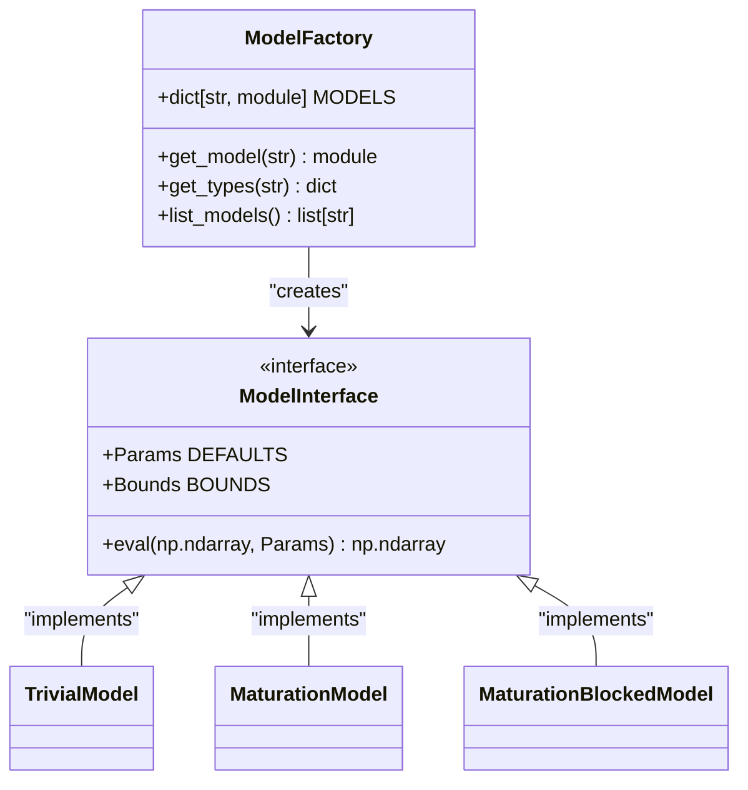
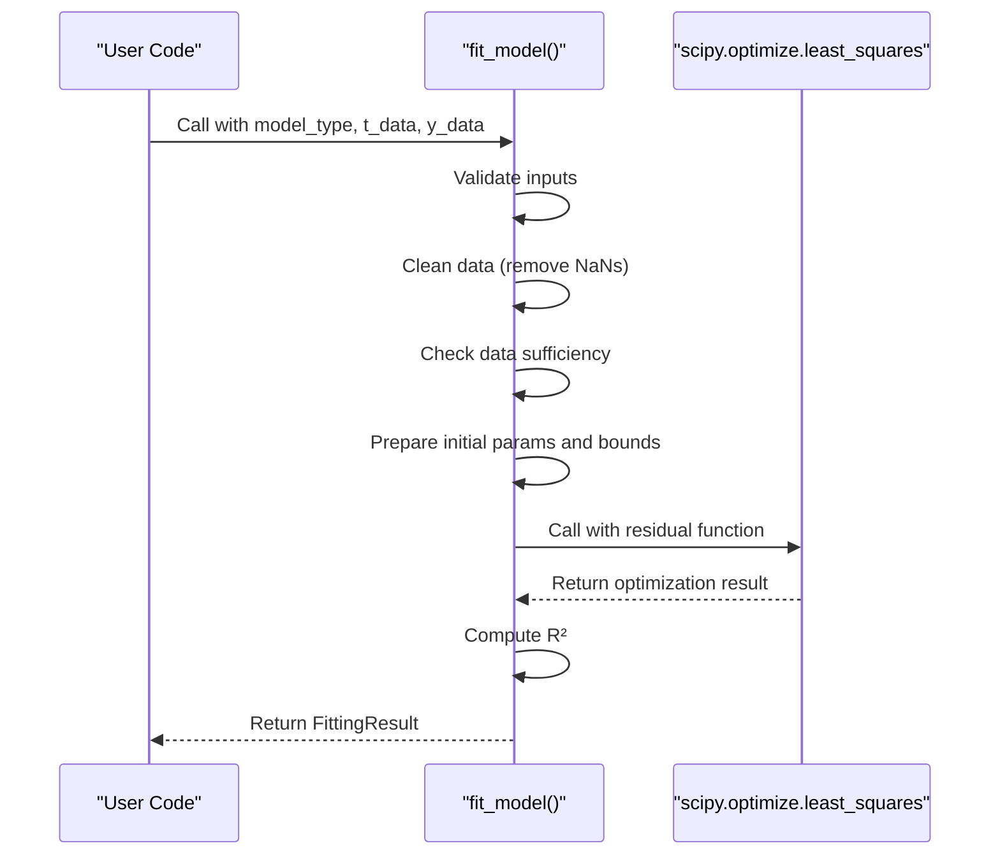

# Analysis API

<cite>
**Referenced Files in This Document**   
- [fitting.py](file://pyama-core/src/pyama_core/analysis/fitting.py)
- [trivial.py](file://pyama-core/src/pyama_core/analysis/models/trivial.py)
- [maturation.py](file://pyama-core/src/pyama_core/analysis/models/maturation.py)
- [maturation_blocked.py](file://pyama-core/src/pyama_core/analysis/models/maturation_blocked.py)
- [__init__.py](file://pyama-core/src/pyama_core/analysis/models/__init__.py)
- [analysis_csv.py](file://pyama-core/src/pyama_core/io/analysis_csv.py)
- [results_yaml.py](file://pyama-core/src/pyama_core/io/results_yaml.py)
</cite>

## Table of Contents
1. [Introduction](#introduction)
2. [Model Factory and Registration System](#model-factory-and-registration-system)
3. [Analysis Models](#analysis-models)
   - [TrivialModel](#trivialmodel)
   - [MaturationModel](#maturationmodel)
   - [MaturationBlockedModel](#maturationblockedmodel)
4. [Fitting Interface](#fitting-interface)
5. [Data Input Requirements](#data-input-requirements)
6. [Output Structure](#output-structure)
7. [Error Handling](#error-handling)
8. [Model Selection and Performance](#model-selection-and-performance)
9. [Usage Examples](#usage-examples)
10. [Integration with External Tools](#integration-with-external-tools)

## Introduction
The analysis module in pyama-core provides a comprehensive framework for fitting biological trace data using various mathematical models. This API documentation details the fitting interface, model registration system, and usage patterns for the three primary analysis models: TrivialModel, MaturationModel, and MaturationBlockedModel. The system is designed for batch processing of cellular trace data with robust error handling and extensibility through a model factory pattern.

**Section sources**
- [fitting.py](file://pyama-core/src/pyama_core/analysis/fitting.py#L1-L10)

## Model Factory and Registration System
The model factory system in pyama-core implements a registry pattern that allows for dynamic model retrieval and type introspection. Models are registered in a central dictionary and accessed through factory functions that provide both the model implementation and its associated type definitions.

The factory system exposes three primary functions:
- `get_model(model_name)`: Returns the model module by name
- `get_types(model_name)`: Returns a dictionary of type classes (Params, Bounds, UserParams, UserBounds)
- `list_models()`: Returns a list of available model names

Models are automatically registered in the `MODELS` dictionary during package initialization, enabling extensibility by simply adding new model modules to the models package and updating the registry.



**Diagram sources**
- [__init__.py](file://pyama-core/src/pyama_core/analysis/models/__init__.py#L15-L41)

**Section sources**
- [__init__.py](file://pyama-core/src/pyama_core/analysis/models/__init__.py#L15-L41)

## Analysis Models
The analysis module provides three specialized models for fitting gene expression dynamics, each representing different biological scenarios. All models follow a consistent interface with standardized parameter definitions, bounds, and evaluation functions.

### TrivialModel
The TrivialModel represents simple gene expression dynamics without protein maturation effects. This model is appropriate for systems where the fluorescent protein matures rapidly relative to the timescale of expression.

**Mathematical Formulation**
```
I(t) = offset + {ktl/(δ-β) * [1 - exp(-(δ-β)(t-t0))] * exp(-β(t-t0))} for t > t0
I(t) = offset for t ≤ t0
```

**Parameters**
- `t0`: Time of induction (hours)
- `ktl`: Transcription-translation rate
- `delta`: mRNA degradation rate
- `beta`: Protein degradation rate
- `offset`: Baseline fluorescence

**Parameter Bounds**
- `t0`: (0, 30.0)
- `ktl`: (1.0, 1e6)
- `delta`: (1e-5, 10.1)
- `beta`: (1e-5, 10.0)
- `offset`: (-1e6, 1e6)

**Fitting Algorithm**
The model uses nonlinear least squares optimization (scipy.optimize.least_squares) with bounded constraints to minimize residuals between observed and predicted intensities.

**Return Values**
Returns a FittingResult object containing fitted parameters, success status, and R² value.

**Section sources**
- [trivial.py](file://pyama-core/src/pyama_core/analysis/models/trivial.py#L1-L82)

### MaturationModel
The MaturationModel extends the TrivialModel by incorporating protein maturation kinetics, making it suitable for systems where maturation is slow relative to expression dynamics.

**Mathematical Formulation**
```
I(t) = offset + ktl * [exp(-(β+km)(t-t0))/(β-δ+km) - exp(-β(t-t0))/(β-δ) + km/(β-δ)/(β-δ+km) * exp(-δ(t-t0))] for t > t0
I(t) = offset for t ≤ t0
```

**Parameters**
- `t0`: Time of induction (hours)
- `ktl`: Transcription-translation rate
- `km`: Maturation rate
- `delta`: mRNA degradation rate
- `beta`: Protein degradation rate
- `offset`: Baseline fluorescence

**Parameter Bounds**
- `t0`: (0, 1)
- `ktl`: (1, 5e8)
- `km`: (1e-5, 30)
- `delta`: (1e-5, 11)
- `beta`: (1e-5, 10)
- `offset`: (-1e6, 1e6)

**Fitting Algorithm**
Employs the same nonlinear least squares approach as TrivialModel but with an additional parameter (km) to account for maturation kinetics.

**Return Values**
Returns a FittingResult object with fitted parameters, success status, and R² value.

**Section sources**
- [maturation.py](file://pyama-core/src/pyama_core/analysis/models/maturation.py#L1-L93)

### MaturationBlockedModel
The MaturationBlockedModel describes decay dynamics following inhibition of maturation, useful for studying protein stability after blocking maturation processes.

**Mathematical Formulation**
```
I(t) = offset + G0 * exp(-β(t-t0)) + Gu0 * [exp(-β(t-t0)) - exp(-(β+km)(t-t0))] for t > t0
I(t) = offset for t ≤ t0
```

**Parameters**
- `t0`: Time of inhibition (hours)
- `G0`: Initial mature protein concentration
- `Gu0`: Initial immature protein concentration
- `km`: Maturation rate
- `beta`: Protein degradation rate
- `offset`: Baseline fluorescence

**Parameter Bounds**
- `t0`: (0, 1)
- `G0`: (0, 1e6)
- `Gu0`: (0, 1e6)
- `km`: (1e-5, 30)
- `beta`: (1e-5, 10)
- `offset`: (-1e6, 1e6)

**Fitting Algorithm**
Uses nonlinear least squares optimization with bounded constraints, similar to other models in the suite.

**Return Values**
Returns a FittingResult object containing the fitted parameters, success status, and R² value.

**Section sources**
- [maturation_blocked.py](file://pyama-core/src/pyama_core/analysis/models/maturation_blocked.py#L1-L89)

## Fitting Interface
The fitting interface provides a unified API for model fitting operations, abstracting the underlying optimization details. The core function `fit_model` handles the complete fitting workflow including data validation, preprocessing, optimization, and result formatting.

The interface supports user-specified initial parameter values and bounds through optional parameters, allowing customization of the fitting process. The fitting process follows these steps:
1. Validate user inputs against model parameter specifications
2. Clean data by removing NaN values
3. Check sufficient data points for fitting
4. Prepare initial parameter values and bounds
5. Perform nonlinear least squares optimization
6. Calculate goodness-of-fit metrics
7. Return structured results



**Diagram sources**
- [fitting.py](file://pyama-core/src/pyama_core/analysis/fitting.py#L74-L151)

**Section sources**
- [fitting.py](file://pyama-core/src/pyama_core/analysis/fitting.py#L44-L194)

## Data Input Requirements
The analysis module requires input data in a specific CSV format designed for time-series trace data. The format specifications ensure consistency across different experiments and processing pipelines.

**CSV Format Specifications**
- Time values as the index (first column)
- Cell IDs as column headers (0, 1, 2, ...)
- Time units specified in a comment header (optional)
- Floating-point precision up to 6 decimal places
- Comma-separated values with header row

**Column Specifications**
- Index column: "time" (automatically set)
- Data columns: Sequential integers starting from 0, representing individual cells
- No additional metadata columns in the primary data matrix

**Time Unit Handling**
The system supports automatic conversion of time units through a comment header:
```
# Time units: hours
time,0,1,2,3
0,100.5,200.3,150.7,180.2
1,105.2,210.1,155.3,185.6
```

Supported time units: seconds (s, sec), minutes (m, min), hours (h, hr, hrs).

**Section sources**
- [analysis_csv.py](file://pyama-core/src/pyama_core/io/analysis_csv.py#L1-L164)

## Output Structure
The fitting process generates structured output that includes both fitted parameters and quality metrics. Results are returned in a standardized format that facilitates downstream analysis and visualization.

**FittingResult Structure**
- `fitted_params`: Dictionary of fitted parameter values
- `success`: Boolean indicating optimization success
- `r_squared`: Coefficient of determination (goodness-of-fit)

**Batch Processing Output**
When processing multiple traces, results are aggregated into a pandas DataFrame with the following columns:
- `cell_id`: Identifier of the fitted cell
- `model_type`: Name of the model used
- `success`: Fitting success status
- `r_squared`: Goodness-of-fit metric
- Parameter columns: One column per fitted parameter
- Additional metadata: As required by the application

The batch results are automatically saved to a CSV file with "_fitted" appended to the original filename, maintaining provenance and enabling reproducibility.

**Section sources**
- [fitting.py](file://pyama-core/src/pyama_core/analysis/fitting.py#L15-L25)
- [controller.py](file://pyama-qt/src/pyama_qt/analysis/controller.py#L193-L224)

## Error Handling
The fitting system implements comprehensive error handling to manage various failure modes during the fitting process. Errors are gracefully handled and reported through the success flag and appropriate default values.

**Failed Fit Conditions**
- Invalid model name
- Insufficient data points (fewer than parameters)
- Optimization convergence failure
- Invalid user parameters or bounds

**Convergence Issues**
The system detects convergence issues through the optimization routine's success flag. When convergence fails, the system returns:
- `success = False`
- `fitted_params` set to default values
- `r_squared = 0.0`

**Input Validation**
The system validates user-provided parameters and bounds against the model's parameter specifications, raising ValueError for:
- Invalid parameter names
- Incorrect bound format (must be tuple of min, max)
- Invalid bound values (min ≥ max)

**Robustness Features**
- Automatic data cleaning (removal of NaN values)
- Sufficient data point checking
- Exception handling around optimization calls
- Graceful degradation to default parameters on failure

**Section sources**
- [fitting.py](file://pyama-core/src/pyama_core/analysis/fitting.py#L27-L72)
- [fitting.py](file://pyama-core/src/pyama_core/analysis/fitting.py#L112-L151)

## Model Selection and Performance
Selecting the appropriate model depends on the biological system and experimental design. The performance characteristics of each model vary based on complexity and data quality.

**Model Selection Criteria**
- **TrivialModel**: Use when protein maturation is rapid compared to expression dynamics
- **MaturationModel**: Use when maturation kinetics are significant and need to be quantified
- **MaturationBlockedModel**: Use for decay experiments after maturation inhibition

**Performance Characteristics**
| Model | Parameters | Complexity | Data Requirements | Typical Use Case |
|-------|------------|------------|-------------------|------------------|
| TrivialModel | 5 | Low | Moderate | Standard expression |
| MaturationModel | 6 | Medium | High | Maturation kinetics |
| MaturationBlockedModel | 6 | Medium | High | Decay after inhibition |

**Computational Performance**
All models use the same optimization algorithm (scipy.optimize.least_squares) with similar computational complexity. The fitting time is primarily determined by:
- Number of data points
- Number of parameters
- Quality of initial parameter estimates
- Convergence behavior

The system is optimized for batch processing, allowing efficient fitting of hundreds of traces with progress reporting.

**Section sources**
- [fitting.py](file://pyama-core/src/pyama_core/analysis/fitting.py#L112-L151)
- [models](file://pyama-core/src/pyama_core/analysis/models/)

## Usage Examples
The following examples demonstrate common usage patterns for the analysis API, from basic fitting to batch processing operations.

### Basic Fitting Operation
```python
from pyama_core.analysis.fitting import fit_model
from pyama_core.analysis.models import get_model

# Load data (example values)
t_data = [0, 1, 2, 3, 4, 5]
y_data = [10, 50, 80, 95, 105, 110]

# Perform fitting
result = fit_model("trivial", t_data, y_data)

# Access results
if result.success:
    print(f"Fitted parameters: {result.fitted_params}")
    print(f"R²: {result.r_squared}")
```

### Batch Fitting with Custom Parameters
```python
from pyama_core.analysis.fitting import fit_trace_data
from pyama_core.io.analysis_csv import load_analysis_csv
import pandas as pd

# Load data from CSV
df = load_analysis_csv("data.csv")

# Define custom initial parameters and bounds
user_params = {"ktl": 500, "delta": 0.05}
user_bounds = {"ktl": (100, 1000), "delta": (0.01, 0.1)}

results = []
for cell_id in df.columns:
    result = fit_trace_data(
        df,
        model_type="maturation",
        cell_id=cell_id,
        user_params=user_params,
        user_bounds=user_bounds
    )
    record = {
        "cell_id": cell_id,
        "success": result.success,
        "r_squared": result.r_squared,
        **result.fitted_params
    }
    results.append(record)

# Convert to DataFrame
results_df = pd.DataFrame(results)
```

### Results Interpretation
```python
# Analyze fitting quality
successful_fits = results_df[results_df["success"]]
print(f"Success rate: {len(successful_fits)/len(results_df):.1%}")

# Calculate parameter statistics
if not successful_fits.empty:
    mean_ktl = successful_fits["ktl"].mean()
    std_ktl = successful_fits["ktl"].std()
    print(f"ktl: {mean_ktl:.2f} ± {std_ktl:.2f}")

# Identify poor fits
poor_fits = results_df[results_df["r_squared"] < 0.7]
print(f"Poor fits (R² < 0.7): {len(poor_fits)}")
```

**Section sources**
- [fitting.py](file://pyama-core/src/pyama_core/analysis/fitting.py#L153-L194)
- [analysis_csv.py](file://pyama-core/src/pyama_core/io/analysis_csv.py#L46-L85)

## Integration with External Tools
The analysis API is designed for seamless integration with external analysis tools and visualization libraries. The structured output format enables easy interoperability with common data science ecosystems.

**Pandas Integration**
Results are naturally compatible with pandas DataFrames, enabling:
- Statistical analysis with pandas methods
- Data visualization with seaborn and matplotlib
- Export to various formats (Excel, JSON, etc.)
- Database integration

**Visualization Integration**
Fitted parameters can be used to generate prediction curves for overlay with experimental data:
```python
import matplotlib.pyplot as plt
from pyama_core.analysis.models import get_model

# Get model for prediction
model = get_model("trivial")
params = model.Params(**result.fitted_params)

# Generate smooth prediction curve
t_smooth = np.linspace(min(t_data), max(t_data), 200)
y_pred = model.eval(t_smooth, params)

# Plot
plt.plot(t_data, y_data, 'o', label='Data')
plt.plot(t_smooth, y_pred, '-', label='Fit')
plt.legend()
```

**Workflow Integration**
The API supports integration into larger processing workflows:
- Automated batch processing of multiple files
- Pipeline integration with preprocessing modules
- Results aggregation across experiments
- Database storage of fitted parameters

The modular design allows the fitting components to be incorporated into custom analysis pipelines while maintaining consistency with the core data structures.

**Section sources**
- [fitting.py](file://pyama-core/src/pyama_core/analysis/fitting.py#L153-L194)
- [results_yaml.py](file://pyama-core/src/pyama_core/io/results_yaml.py#L1-L296)