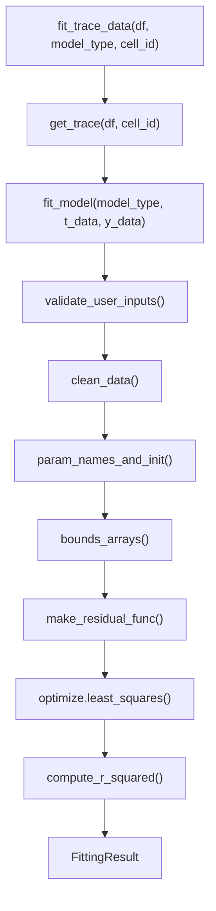
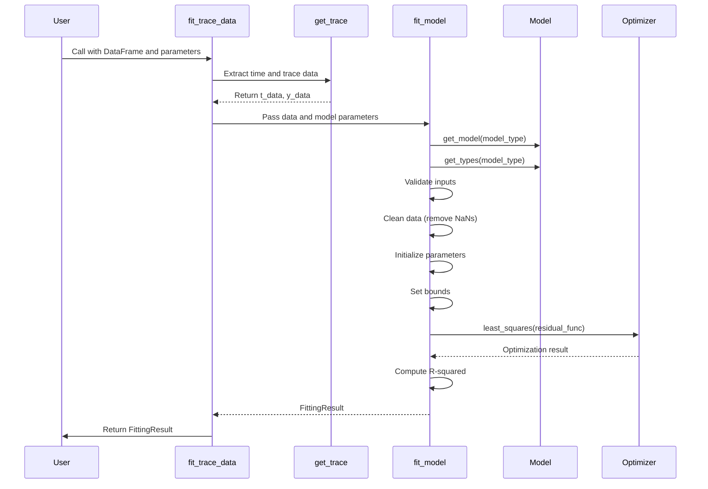
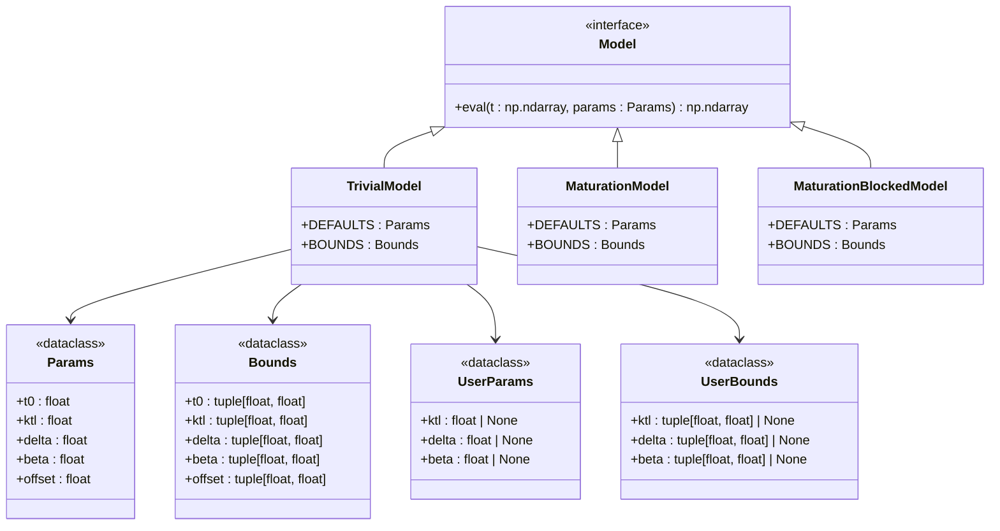
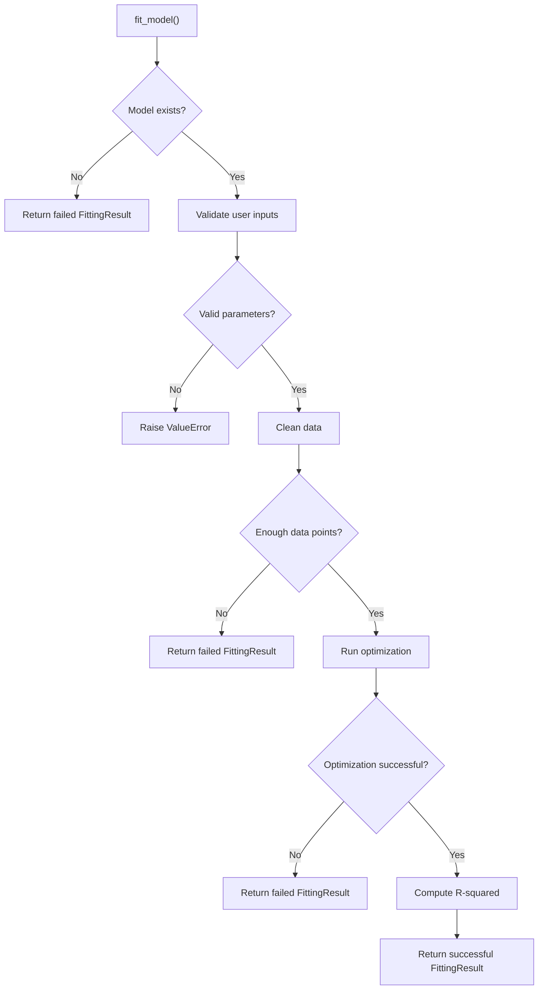
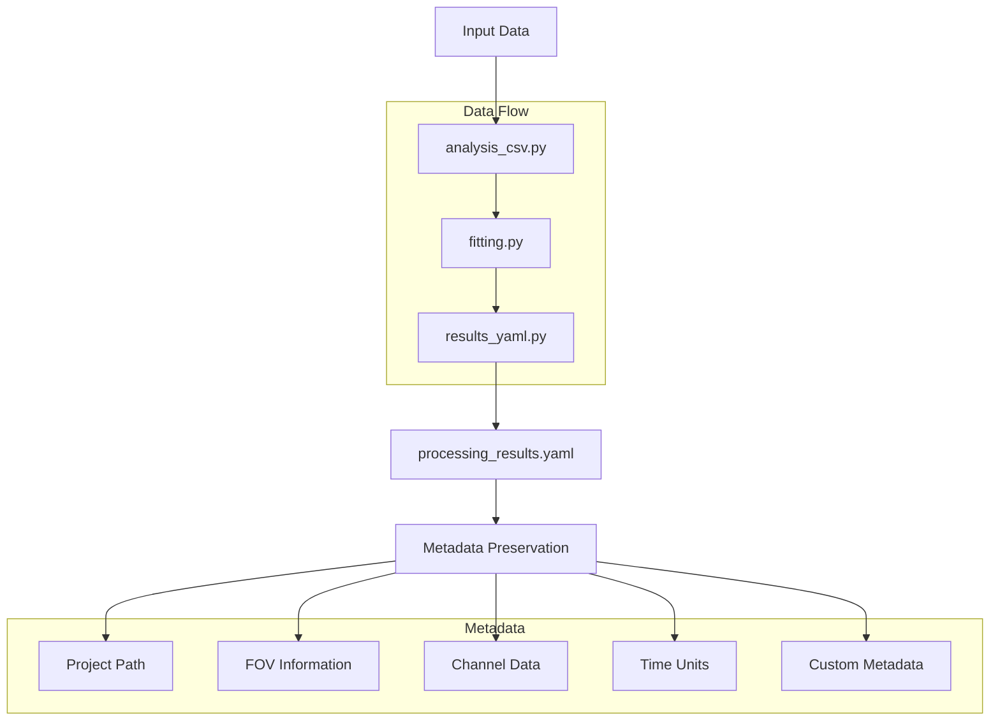

# Fitting Engine API

<cite>
**Referenced Files in This Document**   
- [fitting.py](file://pyama-core/src/pyama_core/analysis/fitting.py)
- [models/__init__.py](file://pyama-core/src/pyama_core/analysis/models/__init__.py)
- [models/trivial.py](file://pyama-core/src/pyama_core/analysis/models/trivial.py)
- [models/maturation.py](file://pyama-core/src/pyama_core/analysis/models/maturation.py)
- [models/maturation_blocked.py](file://pyama-core/src/pyama_core/analysis/models/maturation_blocked.py)
- [io/analysis_csv.py](file://pyama-core/src/pyama_core/io/analysis_csv.py)
- [io/results_yaml.py](file://pyama-core/src/pyama_core/io/results_yaml.py)
</cite>

## Table of Contents
1. [Introduction](#introduction)
2. [Core Fitting Interface](#core-fitting-interface)
3. [Workflow Overview](#workflow-overview)
4. [Model System](#model-system)
5. [Error Handling](#error-handling)
6. [Usage Examples](#usage-examples)
7. [Performance Considerations](#performance-considerations)
8. [Integration with Results System](#integration-with-results-system)

## Introduction
The fitting engine in PyAMA provides a robust interface for analyzing biological trace data through nonlinear curve fitting. It supports multiple biological models and integrates seamlessly with data loading and results serialization systems. The core functionality enables both single-trace fitting and batch processing across multiple fields of view (FOVs) or experimental conditions.

**Section sources**
- [fitting.py](file://pyama-core/src/pyama_core/analysis/fitting.py#L1-L20)

## Core Fitting Interface

The primary interface for the fitting engine consists of two main functions: `fit_model` for low-level fitting operations and `fit_trace_data` for high-level DataFrame-based analysis.



**Diagram sources**
- [fitting.py](file://pyama-core/src/pyama_core/analysis/fitting.py#L102-L193)

### Main Parameters
The fitting functions accept the following parameters:

- **Data Input**: Accepts either file paths or pandas DataFrames containing time-series data
- **Model Selection**: Specifies the biological model to use for fitting
- **User Parameters**: Optional dictionary of initial parameter values
- **User Bounds**: Optional dictionary of parameter bounds for optimization
- **Progress Callback**: Optional callback function for monitoring batch operations

The `FittingResult` dataclass returns three key pieces of information:
- `fitted_params`: Dictionary of optimized parameter values
- `success`: Boolean indicating whether the optimization converged
- `r_squared`: Coefficient of determination for the fit quality

**Section sources**
- [fitting.py](file://pyama-core/src/pyama_core/analysis/fitting.py#L14-L17)
- [fitting.py](file://pyama-core/src/pyama_core/analysis/fitting.py#L102-L147)
- [fitting.py](file://pyama-core/src/pyama_core/analysis/fitting.py#L174-L193)

## Workflow Overview

The fitting workflow follows a structured pipeline from data loading to result aggregation:



**Diagram sources**
- [fitting.py](file://pyama-core/src/pyama_core/analysis/fitting.py#L102-L193)

The workflow begins with data extraction from a DataFrame using `get_trace`, which handles both integer-indexed and named column access. The extracted time and intensity data are then passed to `fit_model`, which orchestrates the entire fitting process including input validation, data cleaning, parameter initialization, and optimization.

**Section sources**
- [fitting.py](file://pyama-core/src/pyama_core/analysis/fitting.py#L150-L171)
- [fitting.py](file://pyama-core/src/pyama_core/analysis/fitting.py#L53-L57)

## Model System

The fitting engine supports multiple biological models through a factory pattern implemented in the models module. Available models are registered in the `MODELS` dictionary and can be accessed by name.



**Diagram sources**
- [models/__init__.py](file://pyama-core/src/pyama_core/analysis/models/__init__.py#L8-L12)
- [models/trivial.py](file://pyama-core/src/pyama_core/analysis/models/trivial.py#L1-L71)
- [models/maturation.py](file://pyama-core/src/pyama_core/analysis/models/maturation.py#L1-L82)
- [models/maturation_blocked.py](file://pyama-core/src/pyama_core/analysis/models/maturation_blocked.py#L1-L78)

### Available Models
The system currently supports three biological models:

1. **Trivial Model**: Simple gene expression dynamics with parameters for transcription rate (ktl), degradation rate (delta), maturation rate (beta), and offset.
2. **Maturation Model**: Gene expression with protein maturation, adding a maturation rate parameter (km) to the trivial model.
3. **Maturation Blocked Model**: Decay dynamics after maturation inhibition, modeling G0 and Gu0 initial concentrations with decay parameters.

Each model defines its own parameter structure, default values, and bounds through dataclasses. The factory functions `get_model` and `get_types` provide runtime access to these models by name.

**Section sources**
- [models/__init__.py](file://pyama-core/src/pyama_core/analysis/models/__init__.py#L15-L29)
- [models/trivial.py](file://pyama-core/src/pyama_core/analysis/models/trivial.py#L1-L71)
- [models/maturation.py](file://pyama-core/src/pyama_core/analysis/models/maturation.py#L1-L82)
- [models/maturation_blocked.py](file://pyama-core/src/pyama_core/analysis/models/maturation_blocked.py#L1-L78)

## Error Handling

The fitting engine implements comprehensive error handling strategies to manage various failure modes:



**Diagram sources**
- [fitting.py](file://pyama-core/src/pyama_core/analysis/fitting.py#L102-L147)

### Input Validation
The system validates user-provided parameters and bounds against the model's defined parameter structure. Invalid parameter names or malformed bounds specifications raise descriptive `ValueError` exceptions with details about the expected parameters.

### Data Quality Checks
Before optimization, the engine checks for sufficient data points after removing NaN values. The minimum requirement is that the number of valid data points must be at least equal to the number of parameters in the model.

### Optimization Failures
The fitting process is wrapped in exception handling to catch any errors during optimization. In case of failure, the engine returns a `FittingResult` with default parameter values and success=False, ensuring predictable behavior even when optimization fails.

**Section sources**
- [fitting.py](file://pyama-core/src/pyama_core/analysis/fitting.py#L20-L50)
- [fitting.py](file://pyama-core/src/pyama_core/analysis/fitting.py#L102-L147)

## Usage Examples

### Single Model Fitting
```python
import pandas as pd
from pyama_core.analysis.fitting import fit_trace_data
from pyama_core.io.analysis_csv import load_analysis_csv

# Load data from CSV
df = load_analysis_csv("path/to/data.csv")

# Fit a single trace with the trivial model
result = fit_trace_data(
    df=df,
    model_type="trivial",
    cell_id=0,
    user_params={"ktl": 25.0},
    user_bounds={"delta": (0.01, 0.1)}
)

if result.success:
    print(f"Fitted parameters: {result.fitted_params}")
    print(f"R-squared: {result.r_squared}")
else:
    print("Fitting failed")
```

### Batch Processing
```python
from pyama_core.analysis.fitting import fit_trace_data
from pyama_core.io.results_yaml import discover_processing_results
import multiprocessing as mp
from functools import partial

def fit_single_cell(df, model_type, cell_id, results_queue):
    result = fit_trace_data(df, model_type, cell_id)
    results_queue.put((cell_id, result))

def batch_fit_fovs(yaml_path, model_type):
    # Discover processing results
    results = discover_processing_results(yaml_path)
    
    manager = mp.Manager()
    results_queue = manager.Queue()
    jobs = []
    
    # Process each FOV
    for fov_idx in results["fov_data"].keys():
        # Load trace data for this FOV
        trace_path = get_trace_csv_path_from_yaml(results, fov_idx, 0)
        df = load_analysis_csv(trace_path)
        
        # Create process for each cell
        for cell_id in df.columns:
            p = mp.Process(
                target=fit_single_cell,
                args=(df, model_type, cell_id, results_queue)
            )
            jobs.append(p)
            p.start()
    
    # Collect results
    results_dict = {}
    for _ in jobs:
        cell_id, result = results_queue.get()
        results_dict[cell_id] = result
    
    # Wait for all processes
    for p in jobs:
        p.join()
        
    return results_dict
```

**Section sources**
- [fitting.py](file://pyama-core/src/pyama_core/analysis/fitting.py#L174-L193)
- [io/analysis_csv.py](file://pyama-core/src/pyama_core/io/analysis_csv.py#L75-L100)
- [io/results_yaml.py](file://pyama-core/src/pyama_core/io/results_yaml.py#L200-L250)

## Performance Considerations

The fitting engine's performance is influenced by several factors:

- **Memory Usage**: Each fitting operation requires memory for storing time and intensity arrays, parameter vectors, and intermediate calculation results. For large datasets, consider processing in chunks.
- **Computation Time**: The nonlinear optimization process can be computationally intensive, especially for complex models with many parameters.
- **Parallel Processing**: The engine supports multiprocessing for batch operations, allowing simultaneous fitting of multiple traces across different FOVs or conditions.

To optimize performance:
- Use appropriate model complexity for your data
- Provide good initial parameter estimates when possible
- Configure multiprocessing with an appropriate number of workers based on available CPU cores
- Monitor memory usage when processing large datasets

**Section sources**
- [fitting.py](file://pyama-core/src/pyama_core/analysis/fitting.py#L102-L147)
- [fitting.py](file://pyama-core/src/pyama_core/analysis/fitting.py#L174-L193)

## Integration with Results System

The fitting engine integrates with PyAMA's results serialization system through the `ProcessingResults` class and YAML configuration files. This integration preserves metadata throughout the fitting pipeline and enables reproducible analysis.



**Diagram sources**
- [io/analysis_csv.py](file://pyama-core/src/pyama_core/io/analysis_csv.py#L1-L164)
- [io/results_yaml.py](file://pyama-core/src/pyama_core/io/results_yaml.py#L1-L295)

The `ProcessingResults` class manages the discovery and loading of processing outputs, including fitted results. It handles path correction when data folders are moved, ensuring robustness across different computing environments. Custom metadata can be stored in the YAML file and accessed through the `extra` field of the `ProcessingResults` object.

**Section sources**
- [io/results_yaml.py](file://pyama-core/src/pyama_core/io/results_yaml.py#L1-L295)
- [io/analysis_csv.py](file://pyama-core/src/pyama_core/io/analysis_csv.py#L1-L164)