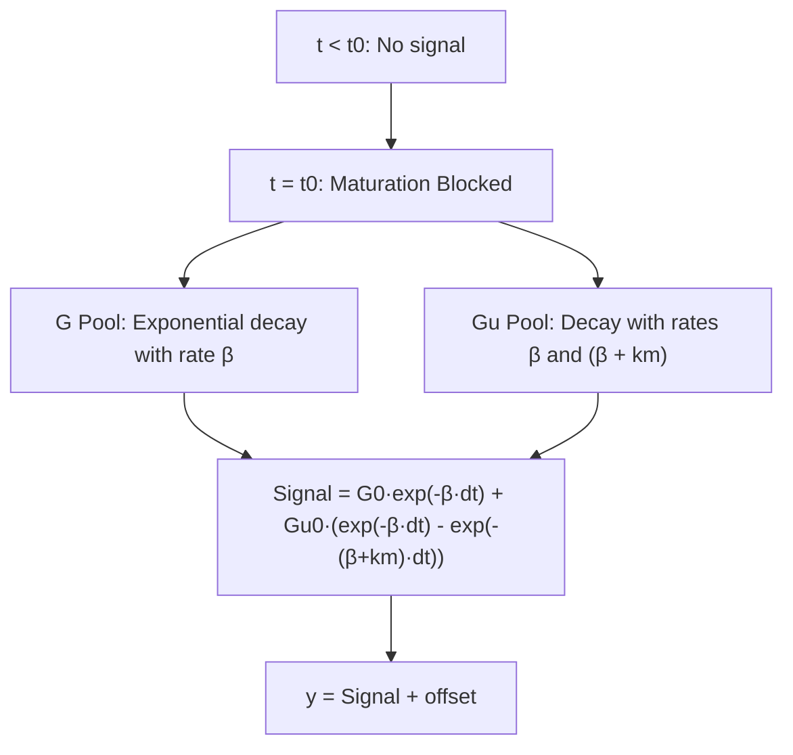
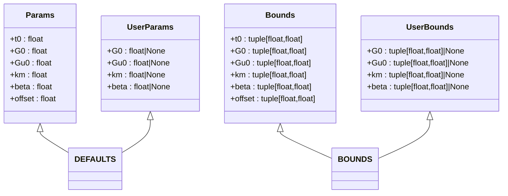
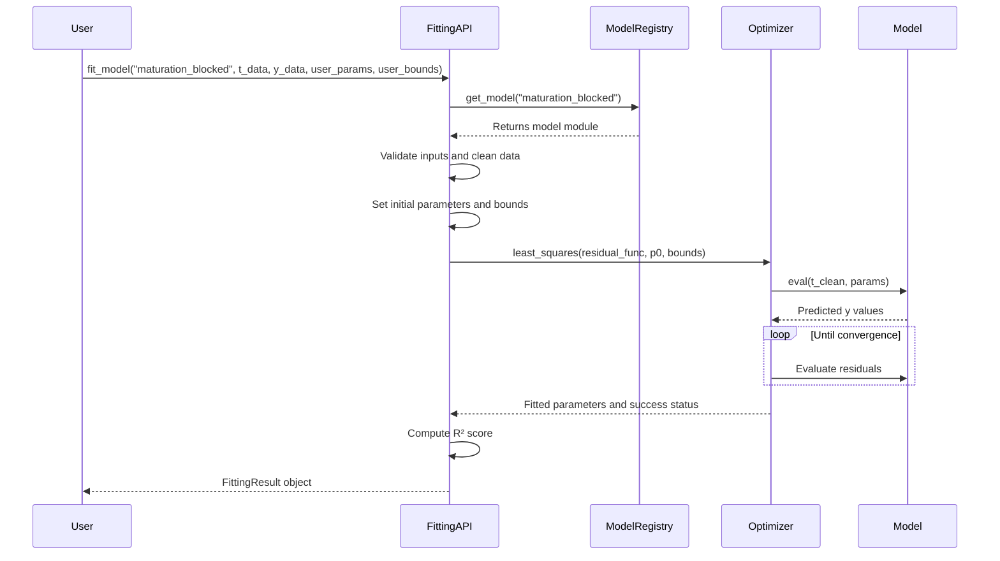
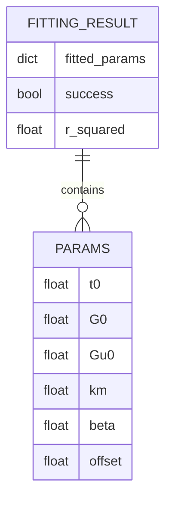
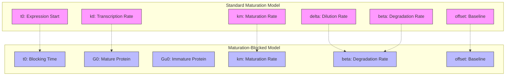

# Maturation-Blocked Model API

<cite>
**Referenced Files in This Document**   
- [maturation_blocked.py](file://pyama-core/src/pyama_core/analysis/models/maturation_blocked.py)
- [fitting.py](file://pyama-core/src/pyama_core/analysis/fitting.py)
- [maturation.py](file://pyama-core/src/pyama_core/analysis/models/maturation.py)
- [__init__.py](file://pyama-core/src/pyama_core/analysis/models/__init__.py)
</cite>

## Table of Contents
1. [Introduction](#introduction)
2. [Mathematical Model](#mathematical-model)
3. [Parameter Definitions](#parameter-definitions)
4. [Implementation Details](#implementation-details)
5. [Fitting Interface](#fitting-interface)
6. [Input Format and Requirements](#input-format-and-requirements)
7. [Output Schema](#output-schema)
8. [Comparison with Standard Maturation Model](#comparison-with-standard-maturation-model)
9. [Practical Example](#practical-example)
10. [Dataset Selection Guidance](#dataset-selection-guidance)
11. [Convergence Diagnostics](#convergence-diagnostics)
12. [Performance Optimization](#performance-optimization)

## Introduction
The Maturation-Blocked Model in pyama-core implements a modified protein maturation process that incorporates an inhibition or blocking term to capture decay dynamics following maturation interruption. This model is specifically designed for experimental scenarios where gene expression or protein maturation is abruptly halted, enabling quantitative analysis of post-inhibition decay behavior. The implementation provides a robust framework for fitting time-series fluorescence data to extract kinetic parameters governing both maturation and suppression processes.

**Section sources**
- [maturation_blocked.py](file://pyama-core/src/pyama_core/analysis/models/maturation_blocked.py#L1-L10)

## Mathematical Model
The Maturation-Blocked Model describes a system where protein maturation is blocked at time t0, leading to exponential decay of both mature (G) and immature (Gu) protein pools. The model is defined by a closed-form analytical solution that captures the dynamics after inhibition onset. The core equation combines two exponential decay terms: one representing direct decay of existing mature protein, and another capturing the decay of immature protein that would have otherwise matured. The mathematical formulation accounts for the time-dependent depletion of both pools following the blocking event, with the resulting signal reflecting the combined contribution of these decaying components plus a constant offset.

**Diagram sources**
- [maturation_blocked.py](file://pyama-core/src/pyama_core/analysis/models/maturation_blocked.py#L64-L77)

**Section sources**
- [maturation_blocked.py](file://pyama-core/src/pyama_core/analysis/models/maturation_blocked.py#L64-L77)

## Parameter Definitions
The model is governed by six parameters that define the maturation blocking dynamics:

**Core Parameters**
- **t0**: Time point of maturation blocking onset (hours)
- **G0**: Initial concentration of mature protein at blocking time
- **Gu0**: Initial concentration of immature protein at blocking time  
- **km**: Maturation rate constant (hour⁻¹)
- **beta**: Degradation rate constant (hour⁻¹)
- **offset**: Baseline signal offset

**Parameter Constraints**
The model enforces biologically plausible parameter bounds to ensure physically meaningful fits:
- t0 constrained between 0 and 1 hour
- G0 and Gu0 bounded between 0 and 1e6 (positive concentrations)
- km limited to range (1e-5, 30) hour⁻¹
- beta constrained between 1e-5 and 10 hour⁻¹
- offset permitted across wide range (-1e6, 1e6)

**Default Initial Guesses**
The model provides sensible default parameter values to facilitate convergence:
- G0 = 100.0, Gu0 = 100.0
- km = 1.28 hour⁻¹, beta = 5.22e-3 hour⁻¹
- t0 = 0, offset = 0

**Section sources**
- [maturation_blocked.py](file://pyama-core/src/pyama_core/analysis/models/maturation_blocked.py#L9-L61)

## Implementation Details
The model is implemented as a functional interface with dataclass-based parameter management. The core evaluation function `eval()` takes time points and parameter objects as inputs, computing the expected signal using vectorized NumPy operations for efficiency. The implementation handles the discontinuity at t0 through conditional logic, returning zero before blocking onset and the full decay expression afterward. Parameter validation is enforced through type hints and runtime bounds checking, ensuring numerical stability during fitting. The code structure follows a modular pattern with clear separation between parameter definitions, default values, and the mathematical evaluation function.

**Diagram sources**
- [maturation_blocked.py](file://pyama-core/src/pyama_core/analysis/models/maturation_blocked.py#L9-L61)

**Section sources**
- [maturation_blocked.py](file://pyama-core/src/pyama_core/analysis/models/maturation_blocked.py#L9-L77)

## Fitting Interface
The model integrates with pyama-core's unified fitting framework through the `fit_model()` function in the analysis module. Users specify "maturation_blocked" as the model type when calling the fitting routine. The interface accepts optional user-specified parameters and bounds through `user_params` and `user_bounds` dictionaries, which override default values and constraints. The fitting process employs scipy's least_squares optimizer with bound constraints to ensure parameter validity. Model registration is handled through the models package __init__.py, which maintains a registry of available models and their associated components.

**Diagram sources**
- [fitting.py](file://pyama-core/src/pyama_core/analysis/fitting.py#L102-L147)
- [__init__.py](file://pyama-core/src/pyama_core/analysis/models/__init__.py#L15-L29)

**Section sources**
- [fitting.py](file://pyama-core/src/pyama_core/analysis/fitting.py#L102-L147)
- [__init__.py](file://pyama-core/src/pyama_core/analysis/models/__init__.py#L15-L29)

## Input Format and Requirements
The model expects input data in the form of two NumPy arrays: time points (t_data) and corresponding signal intensities (y_data). The data should represent time-series measurements from a single cell or region of interest, with time in consistent units (typically hours). Missing values (NaN) are automatically filtered during preprocessing. The fitting routine requires at least as many valid data points as model parameters (6 parameters minimum). Data should ideally capture both pre-blocking baseline and post-blocking decay phases, with sufficient temporal resolution to resolve the decay dynamics. The time array must be in ascending order, and negative time values are permitted for pre-blocking measurements.

**Section sources**
- [fitting.py](file://pyama-core/src/pyama_core/analysis/fitting.py#L102-L147)
- [maturation_blocked.py](file://pyama-core/src/pyama_core/analysis/models/maturation_blocked.py#L64-L77)

## Output Schema
The fitting process returns a `FittingResult` object containing the following fields:

**Output Fields**
- **fitted_params**: Dictionary of optimized parameter values with keys matching the Params dataclass fields
- **success**: Boolean indicating whether the optimization converged successfully
- **r_squared**: Coefficient of determination (0.0 to 1.0) measuring goodness of fit

The fitted_params dictionary contains all six model parameters (t0, G0, Gu0, km, beta, offset) with their optimized values. The success flag indicates convergence status, where False may suggest poor data quality, insufficient points, or convergence failure. The R² score provides a normalized measure of fit quality, with values closer to 1.0 indicating better agreement between model predictions and observed data.

**Diagram sources**
- [fitting.py](file://pyama-core/src/pyama_core/analysis/fitting.py#L14-L17)
- [maturation_blocked.py](file://pyama-core/src/pyama_core/analysis/models/maturation_blocked.py#L9-L15)

**Section sources**
- [fitting.py](file://pyama-core/src/pyama_core/analysis/fitting.py#L14-L17)

## Comparison with Standard Maturation Model
The Maturation-Blocked Model differs fundamentally from the standard maturation model in both biological interpretation and mathematical formulation. While the standard model describes continuous protein production and maturation with parameters for transcription (ktl), maturation (km), dilution (delta), and degradation (beta), the blocked model focuses exclusively on post-inhibition decay dynamics. The standard model produces a rising curve as protein accumulates, whereas the blocked model generates a decaying curve after t0. Key structural differences include:
- Absence of transcription rate (ktl) and dilution (delta) parameters in the blocked model
- Presence of separate G0 and Gu0 initial conditions instead of production-driven accumulation
- Different mathematical form: decay combination vs. maturation kinetics
- Inverse biological interpretation: inhibition response vs. expression dynamics

**Diagram sources**
- [maturation.py](file://pyama-core/src/pyama_core/analysis/models/maturation.py#L9-L15)
- [maturation_blocked.py](file://pyama-core/src/pyama_core/analysis/models/maturation_blocked.py#L9-L15)

**Section sources**
- [maturation.py](file://pyama-core/src/pyama_core/analysis/models/maturation.py#L9-L81)
- [maturation_blocked.py](file://pyama-core/src/pyama_core/analysis/models/maturation_blocked.py#L9-L77)

## Practical Example
A typical use case involves analyzing fluorescence data from cells where protein expression is abruptly stopped (e.g., via transcriptional shutoff or protein degradation tag activation). The workflow begins with loading time-series data into a pandas DataFrame with time as index and cell traces as columns. Using the `fit_trace_data()` function, users can fit the maturation_blocked model to individual cell traces. For example, with experimental data showing GFP signal decay after transcription inhibition, the model would estimate the degradation rate (beta) and remaining protein pools (G0, Gu0). The fitted curve would capture both the rapid initial decay (from existing mature protein) and slower subsequent decay (from residual maturation of immature protein), providing quantitative insights into protein turnover dynamics post-inhibition.

**Section sources**
- [fitting.py](file://pyama-core/src/pyama_core/analysis/fitting.py#L149-L194)
- [maturation_blocked.py](file://pyama-core/src/pyama_core/analysis/models/maturation_blocked.py#L64-L77)

## Dataset Selection Guidance
The Maturation-Blocked Model is appropriate for datasets exhibiting clear post-inhibition decay dynamics. Ideal datasets should:
- Contain measurements before and after a defined blocking event
- Show discernible decay patterns rather than stable or increasing signals
- Have sufficient temporal resolution to capture decay kinetics
- Include multiple time points during the decay phase (minimum 6 points)
- Represent systems where maturation can be effectively blocked

The model is not suitable for:
- Continuous expression time courses
- Systems with incomplete or gradual inhibition
- Data dominated by noise or photobleaching effects
- Very short time series with limited post-blocking points
- Non-decaying or increasing signal profiles

When inhibition timing is uncertain, the t0 parameter can be fitted, but datasets should still show a clear transition from stable/accumulating to decaying behavior.

**Section sources**
- [maturation_blocked.py](file://pyama-core/src/pyama_core/analysis/models/maturation_blocked.py#L64-L77)
- [fitting.py](file://pyama-core/src/pyama_core/analysis/fitting.py#L102-L147)

## Convergence Diagnostics
The fitting process provides several indicators of solution quality:
- **Success flag**: Primary indicator of optimization convergence
- **R² score**: Measures goodness of fit (values > 0.7 generally acceptable)
- **Parameter values**: Should lie within biological plausibility ranges
- **Residual patterns**: Randomly distributed residuals indicate good fit

Common convergence issues and their interpretations:
- **Failed convergence with valid data**: May indicate poor initial guesses or overly restrictive bounds
- **High R² but implausible parameters**: Suggests model mis-specification or local minimum
- **Low R² with reasonable parameters**: Indicates data-model mismatch or high noise levels
- **Boundary-constrained parameters**: Values at bound limits suggest need for bound adjustment

Users should examine residual plots and parameter correlations to assess fit quality beyond the R² metric.

**Section sources**
- [fitting.py](file://pyama-core/src/pyama_core/analysis/fitting.py#L102-L147)
- [fitting.py](file://pyama-core/src/pyama_core/analysis/fitting.py#L88-L98)

## Performance Optimization
For optimal performance with the Maturation-Blocked Model:
- **Provide informed initial guesses** through user_params to reduce iterations
- **Tighten parameter bounds** via user_bounds to constrain search space
- **Ensure data quality** by preprocessing to remove outliers and artifacts
- **Use vectorized operations** by passing full time and signal arrays
- **Batch process multiple cells** using parallel fitting routines

The model's computational complexity is primarily determined by the optimization routine, with fitting time scaling linearly with data points. For large datasets, consider processing cells in parallel using the provided threading utilities. Pre-filtering data to the relevant time window (around and after blocking) can also improve fitting speed without sacrificing accuracy.

**Section sources**
- [fitting.py](file://pyama-core/src/pyama_core/analysis/fitting.py#L102-L147)
- [maturation_blocked.py](file://pyama-core/src/pyama_core/analysis/models/maturation_blocked.py#L64-L77)