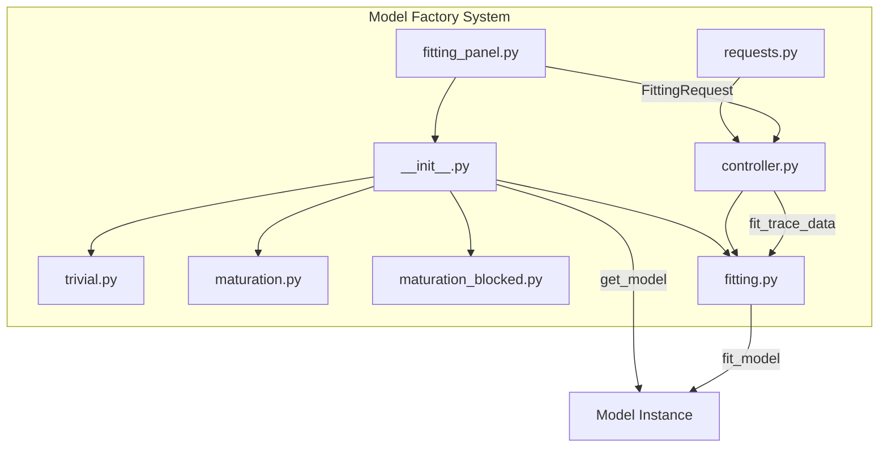
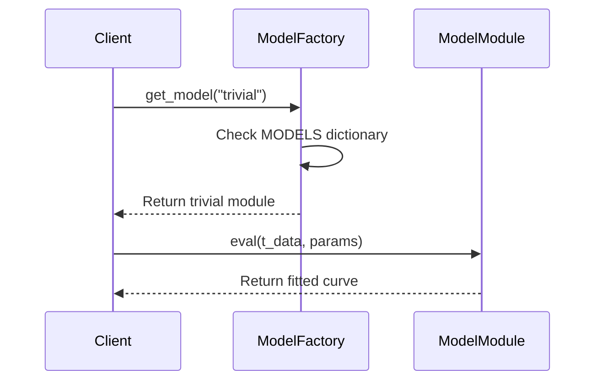
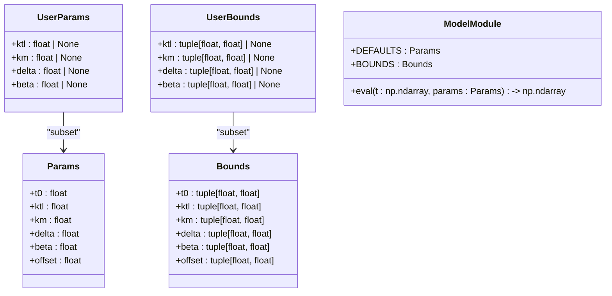
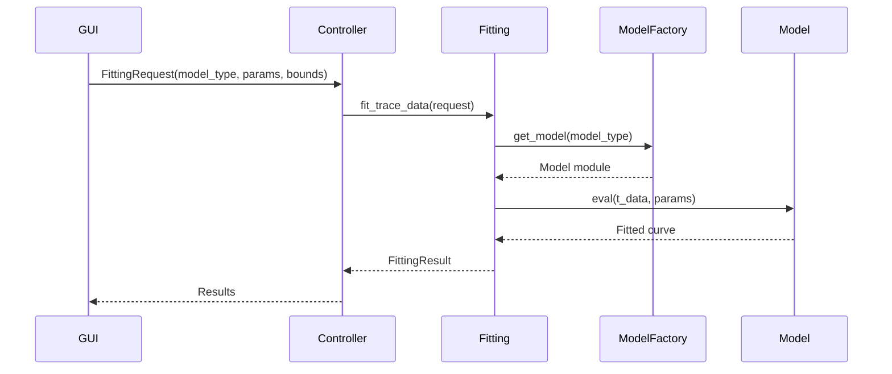
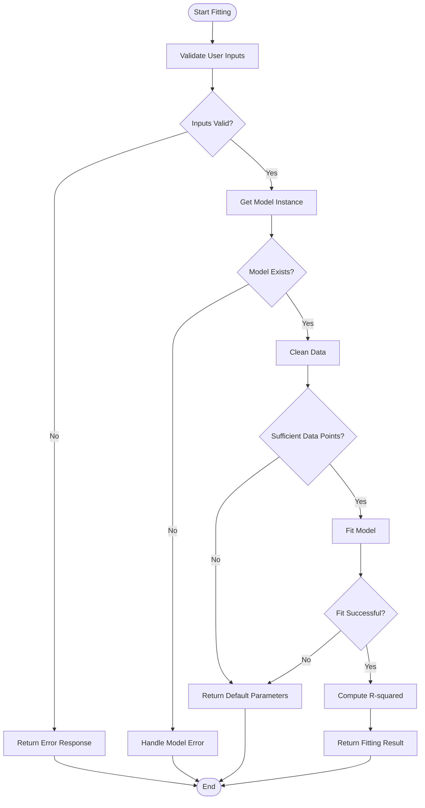

# Model Factory System

<cite>
**Referenced Files in This Document**   
- [__init__.py](file://pyama-core/src/pyama_core/analysis/models/__init__.py)
- [trivial.py](file://pyama-core/src/pyama_core/analysis/models/trivial.py)
- [maturation.py](file://pyama-core/src/pyama_core/analysis/models/maturation.py)
- [maturation_blocked.py](file://pyama-core/src/pyama_core/analysis/models/maturation_blocked.py)
- [fitting.py](file://pyama-core/src/pyama_core/analysis/fitting.py)
- [fitting_panel.py](file://pyama-qt/src/pyama_qt/analysis/panels/fitting_panel.py)
- [controller.py](file://pyama-qt/src/pyama_qt/analysis/controller.py)
- [requests.py](file://pyama-qt/src/pyama_qt/analysis/requests.py)
</cite>

## Table of Contents
1. [Introduction](#introduction)
2. [Architecture Overview](#architecture-overview)
3. [Core Components](#core-components)
4. [Registry Pattern Implementation](#registry-pattern-implementation)
5. [Base Model Interface](#base-model-interface)
6. [Model Registration Mechanism](#model-registration-mechanism)
7. [Usage Examples](#usage-examples)
8. [Integration with GUI and Script Workflows](#integration-with-gui-and-script-workflows)
9. [Import-Time Registration](#import-time-registration)
10. [Common Issues and Validation](#common-issues-and-validation)
11. [Extending the System](#extending-the-system)
12. [Conclusion](#conclusion)

## Introduction
The Model Factory System provides a flexible framework for curve fitting in biological data analysis. It enables dynamic model discovery and instantiation through string-based lookup, allowing users to select and apply different mathematical models to their data without code changes. The system is designed to support domain-specific fitting models for gene expression dynamics, protein maturation, and decay processes after maturation inhibition. This documentation explains the architecture, implementation details, and usage patterns of the model factory system.

## Architecture Overview



**Diagram sources**
- [__init__.py](file://pyama-core/src/pyama_core/analysis/models/__init__.py)
- [fitting.py](file://pyama-core/src/pyama_core/analysis/fitting.py)
- [fitting_panel.py](file://pyama-qt/src/pyama_qt/analysis/panels/fitting_panel.py)

## Core Components

The model factory system consists of several core components that work together to provide a seamless curve fitting experience. The system is built around a registry pattern that allows for dynamic model discovery and instantiation. Each model is implemented as a separate module with a consistent interface, making it easy to add new models to the system. The fitting utilities provide the computational backbone for parameter estimation and model evaluation.

**Section sources**
- [__init__.py](file://pyama-core/src/pyama_core/analysis/models/__init__.py#L1-L41)
- [fitting.py](file://pyama-core/src/pyama_core/analysis/fitting.py#L1-L194)

## Registry Pattern Implementation

The registry pattern is implemented through a global MODELS dictionary that maps model names to their corresponding modules. This dictionary is populated at import time by explicitly importing each model module and adding it to the registry. The get_model function provides the primary interface for model discovery, accepting a string-based model name and returning the corresponding module. If the requested model is not found, the function raises a ValueError with a helpful message listing available models.



**Diagram sources**
- [__init__.py](file://pyama-core/src/pyama_core/analysis/models/__init__.py#L15-L19)

## Base Model Interface

All models in the system implement a consistent interface defined by several dataclasses and functions. The Params dataclass defines the complete set of parameters for the model, while Bounds specifies the valid ranges for each parameter. UserParams and UserBounds provide subsets of these that users can modify. Each model also defines DEFAULTS and BOUNDS constants, and implements an eval function that takes time data and parameters and returns the model's prediction.



**Diagram sources**
- [trivial.py](file://pyama-core/src/pyama_core/analysis/models/trivial.py#L9-L70)
- [maturation.py](file://pyama-core/src/pyama_core/analysis/models/maturation.py#L9-L81)
- [maturation_blocked.py](file://pyama-core/src/pyama_core/analysis/models/maturation_blocked.py#L9-L77)

## Model Registration Mechanism

Models are registered through explicit imports in the __init__.py file, where each model module is imported and added to the MODELS dictionary with a string key. The register_model decorator is not used in the current implementation; instead, registration is handled manually. This approach ensures that all models are available globally once the package is imported. The list_models function provides a way to discover all available models by returning the keys of the MODELS dictionary.

**Section sources**
- [__init__.py](file://pyama-core/src/pyama_core/analysis/models/__init__.py#L1-L41)

## Usage Examples

To use a model from the factory system, call get_model with the desired model name. For example, to use the trivial model:

```python
model = get_model("trivial")
params = model.Params(t0=2.0, ktl=20.0, delta=0.07, beta=0.0436, offset=0.0)
result = model.eval(time_data, params)
```

The get_types function can be used to retrieve the type information for a model, which is useful for validation and UI generation:

```python
types = get_types("maturation")
UserParams = types["UserParams"]
Params = types["Params"]
```

**Section sources**
- [__init__.py](file://pyama-core/src/pyama_core/analysis/models/__init__.py#L22-L29)

## Integration with GUI and Script Workflows

The model factory system integrates with both GUI and script-based workflows through the fitting.py module. In the GUI, the fitting panel allows users to select a model and configure its parameters through a user interface. The selected model and parameters are packaged into a FittingRequest object and sent to the analysis controller, which processes the data using fit_trace_data. In script workflows, users can directly call fit_model with their data and desired model type.



**Diagram sources**
- [fitting_panel.py](file://pyama-qt/src/pyama_qt/analysis/panels/fitting_panel.py#L113-L147)
- [controller.py](file://pyama-qt/src/pyama_qt/analysis/controller.py#L193-L224)
- [fitting.py](file://pyama-core/src/pyama_core/analysis/fitting.py#L102-L147)

## Import-Time Registration

Models are made available globally through import-time registration in the __init__.py file. When the package is imported, all model modules are imported and added to the MODELS dictionary. This ensures that models are immediately available without requiring additional setup. The import-time registration mechanism also means that the availability of models is determined by the package structure rather than runtime conditions.

**Section sources**
- [__init__.py](file://pyama-core/src/pyama_core/analysis/models/__init__.py#L1-L41)

## Common Issues and Validation

Common issues with the model factory system include name collisions, import order dependencies, and validation of registered models. The system validates user inputs through the _validate_user_inputs function in fitting.py, which checks that parameter names and bounds are valid for the selected model. Name collisions are prevented by using a global MODELS dictionary with string keys. Import order dependencies are minimized by importing all models at package initialization time.



**Diagram sources**
- [fitting.py](file://pyama-core/src/pyama_core/analysis/fitting.py#L14-L17)

## Extending the System

Developers can extend the system with domain-specific fitting models by creating a new module in the models directory that implements the required interface. The new module should define the Params, Bounds, UserParams, and UserBounds dataclasses, provide DEFAULTS and BOUNDS constants, and implement an eval function. The module must then be imported in __init__.py and added to the MODELS dictionary. This approach allows for easy addition of new models without modifying existing code.

**Section sources**
- [__init__.py](file://pyama-core/src/pyama_core/analysis/models/__init__.py#L1-L41)
- [trivial.py](file://pyama-core/src/pyama_core/analysis/models/trivial.py#L1-L70)

## Conclusion
The Model Factory System provides a robust and extensible framework for curve fitting in biological data analysis. By leveraging the registry pattern and a consistent model interface, the system enables dynamic model discovery and instantiation through string-based lookup. The integration with both GUI and script workflows makes it accessible to users with different technical backgrounds. The system's design allows for easy extension with domain-specific models, making it adaptable to a wide range of biological research applications.