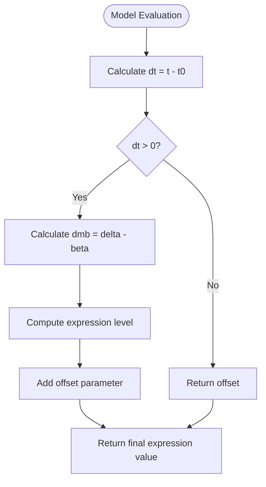
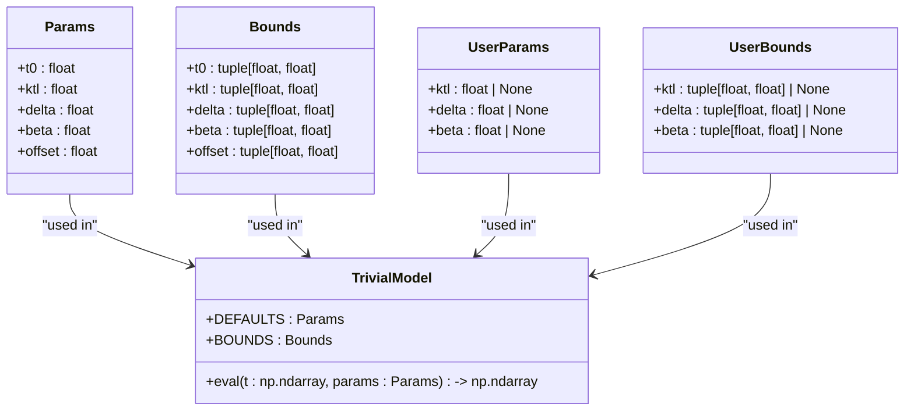
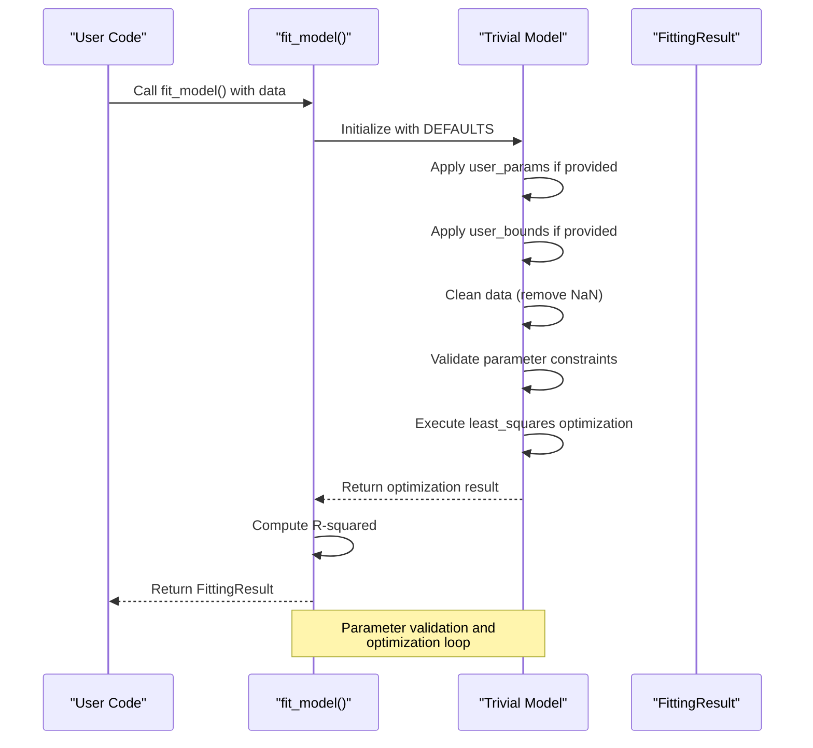
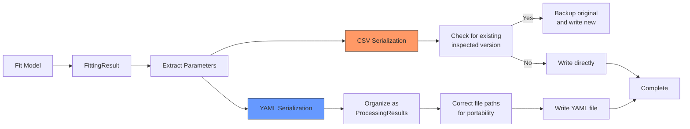

# Trivial Model API

<cite>
**Referenced Files in This Document**   
- [trivial.py](file://pyama-core/src/pyama_core/analysis/models/trivial.py)
- [fitting.py](file://pyama-core/src/pyama_core/analysis/fitting.py)
- [models/__init__.py](file://pyama-core/src/pyama_core/analysis/models/__init__.py)
- [results_yaml.py](file://pyama-core/src/pyama_core/io/results_yaml.py)
- [analysis_csv.py](file://pyama-core/src/pyama_core/io/analysis_csv.py)
</cite>

## Table of Contents
1. [Introduction](#introduction)
2. [Mathematical Formulation](#mathematical-formulation)
3. [Class Interface](#class-interface)
4. [Code Example](#code-example)
5. [Model Factory Integration](#model-factory-integration)
6. [Results Serialization](#results-serialization)
7. [Performance Characteristics](#performance-characteristics)
8. [Use Case Recommendations](#use-case-recommendations)

## Introduction
The Trivial Model in pyama-core provides a simple baseline fitting approach for gene expression dynamics analysis. This model serves as a constant baseline fit with optional offset parameter, designed specifically for control datasets that exhibit no dynamic behavior. The implementation offers a foundation for comparison against more complex models in the pyama-core ecosystem, enabling researchers to establish baseline performance metrics and validate experimental results. As part of the modular analysis framework, the Trivial Model integrates seamlessly with the model factory system and supports standardized result serialization.

**Section sources**
- [trivial.py](file://pyama-core/src/pyama_core/analysis/models/trivial.py#L1-L10)

## Mathematical Formulation
The Trivial Model implements a simple gene expression dynamics model with a mathematical formulation based on exponential decay principles. The core equation computes the expression level as a function of time with parameters for transcription rate (ktl), degradation rate (delta), maturation rate (beta), and temporal offset (t0). The model evaluates the expression dynamics using the formula: (ktl / (delta - beta)) * (1.0 - exp(-(delta - beta) * dt)) * exp(-beta * dt), where dt represents the time difference from the initial time point t0. An optional offset parameter allows for baseline adjustment of the expression curve. The implementation includes parameter bounds validation to ensure biologically plausible results, with constraints on all parameters to maintain numerical stability during fitting operations.



**Diagram sources**
- [trivial.py](file://pyama-core/src/pyama_core/analysis/models/trivial.py#L50-L70)

**Section sources**
- [trivial.py](file://pyama-core/src/pyama_core/analysis/models/trivial.py#L50-L70)

## Class Interface
The Trivial Model exposes a standardized interface through dataclass-based parameter definitions and a functional evaluation method. The interface consists of four primary dataclasses: Params, Bounds, UserParams, and UserBounds, which define the complete parameter space and constraints for the model. The Params dataclass specifies all five parameters (t0, ktl, delta, beta, offset) required for model evaluation, while Bounds defines the permissible value ranges for each parameter. UserParams and UserBounds provide optional parameter specification for user-defined constraints, allowing selective override of default values. The primary interface method, eval, accepts a time array and Params object, returning the corresponding expression values. Default parameter values are provided through the DEFAULTS constant, ensuring consistent initialization across applications.



**Diagram sources**
- [trivial.py](file://pyama-core/src/pyama_core/analysis/models/trivial.py#L12-L50)

**Section sources**
- [trivial.py](file://pyama-core/src/pyama_core/analysis/models/trivial.py#L12-L70)

## Code Example
The following example demonstrates the instantiation and fitting of the Trivial Model to sample data. First, import the necessary modules and load sample data from a CSV file using the analysis CSV utilities. Create a DataFrame with time as the index and cell IDs as columns, ensuring proper formatting for analysis. Initialize the fitting process by specifying the model type as "trivial" and optionally providing user parameters or bounds. Call the fit_model function with the time and intensity data arrays, along with any user-defined constraints. The fitting process returns a FittingResult object containing the optimized parameters, success status, and goodness-of-fit metrics. Extract the fitted parameters and evaluate the model performance using the R-squared value to assess the quality of the fit.



**Diagram sources**
- [fitting.py](file://pyama-core/src/pyama_core/analysis/fitting.py#L115-L150)
- [trivial.py](file://pyama-core/src/pyama_core/analysis/models/trivial.py#L50-L70)

**Section sources**
- [fitting.py](file://pyama-core/src/pyama_core/analysis/fitting.py#L115-L194)
- [analysis_csv.py](file://pyama-core/src/pyama_core/io/analysis_csv.py#L80-L120)

## Model Factory Integration
The Trivial Model integrates with the pyama-core model factory system through the centralized models registry in the models package. The factory pattern implementation in models/__init__.py provides a unified interface for model discovery and instantiation, with the Trivial Model registered under the key "trivial". The get_model function serves as the primary entry point, returning the module object when provided with the model name. The get_types function complements this by providing access to the parameter type definitions (Params, Bounds, UserParams, UserBounds) associated with each model. This integration enables dynamic model selection in applications, allowing users to specify the model type as a string parameter while maintaining type safety through the returned type definitions. The factory system also supports model enumeration through the list_models function, facilitating UI implementations that present available models to users.

```mermaid
graph TB
subgraph "Model Factory"
Factory[Model Factory]
Registry[MODELS Registry]
GetModel[get_model()]
GetTypes[get_types()]
ListModels[list_models()]
end
subgraph "Trivial Model"
Trivial[trivial.py]
Params[Params]
Bounds[Bounds]
UserParams[UserParams]
UserBounds[UserBounds]
end
subgraph "Application"
App[Application]
Request[FittingRequest]
end
Registry --> |Contains| Trivial
GetModel --> |Returns| Trivial
GetTypes --> |Returns| Params
GetTypes --> |Returns| Bounds
GetTypes --> |Returns| UserParams
GetTypes --> |Returns| UserBounds
App --> |Specifies| Request
Request --> |Contains| ModelType["model_type: 'trivial'"]
App --> GetModel
GetModel --> Trivial
App --> GetTypes
GetTypes --> App
style Trivial fill:#f9f,stroke:#333
style Factory fill:#bbf,stroke:#333
```

**Diagram sources**
- [models/__init__.py](file://pyama-core/src/pyama_core/analysis/models/__init__.py#L1-L41)
- [trivial.py](file://pyama-core/src/pyama_core/analysis/models/trivial.py#L1-L10)

**Section sources**
- [models/__init__.py](file://pyama-core/src/pyama_core/analysis/models/__init__.py#L1-L41)

## Results Serialization
The Trivial Model results are serialized through the pyama-core I/O system using standardized CSV and YAML formats. When fitting is complete, results are written to CSV files with a specific schema that includes cell ID, model type, success status, R-squared value, and all fitted parameters. The CSV output follows the analysis CSV format specifications, with time as the index and cells as columns, allowing for easy integration with downstream analysis tools. For comprehensive result storage, the system supports YAML serialization through the results_yaml module, which preserves the complete processing context including file paths, channel information, and time units. The serialization process handles path correction for moved data folders, ensuring result portability across different computing environments. Both formats support metadata preservation, enabling reproducible research practices and facilitating data sharing among collaborators.



**Diagram sources**
- [results_yaml.py](file://pyama-core/src/pyama_core/io/results_yaml.py#L1-L296)
- [analysis_csv.py](file://pyama-core/src/pyama_core/io/analysis_csv.py#L1-L164)

**Section sources**
- [results_yaml.py](file://pyama-core/src/pyama_core/io/results_yaml.py#L1-L296)
- [analysis_csv.py](file://pyama-core/src/pyama_core/io/analysis_csv.py#L1-L164)

## Performance Characteristics
The Trivial Model exhibits excellent computational performance due to its relatively simple mathematical formulation and efficient implementation. The model evaluation function leverages NumPy's vectorized operations, enabling rapid computation across large time series datasets. The fitting process uses scipy's least_squares optimizer with bounded constraints, providing robust convergence properties while maintaining reasonable execution times. Memory usage is optimized through in-place operations and efficient data handling, with the model requiring only O(n) space complexity where n is the number of time points. The implementation includes data validation and cleaning steps that efficiently handle missing values and outliers, ensuring reliable fitting results without excessive computational overhead. Parallelization opportunities exist at the cell level, allowing batch processing of multiple cells across available CPU cores for high-throughput analysis scenarios.

**Section sources**
- [trivial.py](file://pyama-core/src/pyama_core/analysis/models/trivial.py#L50-L70)
- [fitting.py](file://pyama-core/src/pyama_core/analysis/fitting.py#L1-L194)

## Use Case Recommendations
The Trivial Model should be preferred over more complex alternatives in specific scenarios where simplicity and computational efficiency are paramount. Ideal use cases include control datasets with minimal or no dynamic behavior, baseline fitting for quality control purposes, and initial data exploration where rapid iteration is required. The model is particularly valuable for establishing null hypotheses in gene expression studies, providing a reference point against which more complex models can be compared. It is also recommended for datasets with limited time points or high noise levels, where overfitting risks with complex models are elevated. For production environments requiring high-throughput analysis of large cell populations, the Trivial Model offers a computationally efficient option that maintains statistical rigor while minimizing processing time and resource consumption.

**Section sources**
- [trivial.py](file://pyama-core/src/pyama_core/analysis/models/trivial.py#L1-L70)
- [fitting.py](file://pyama-core/src/pyama_core/analysis/fitting.py#L1-L194)