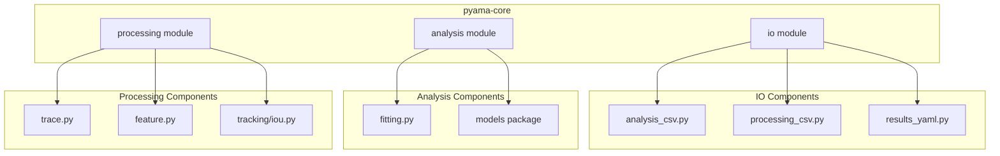
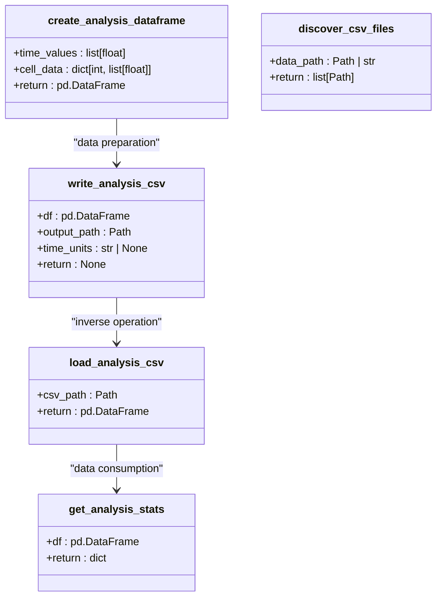
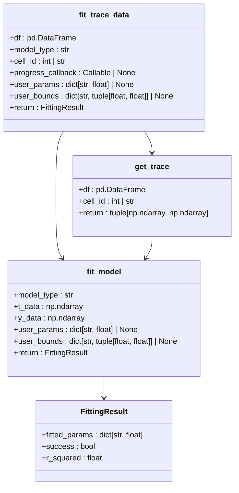
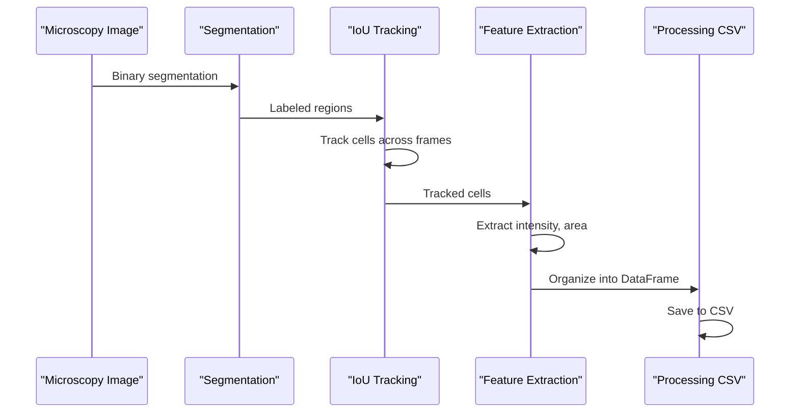
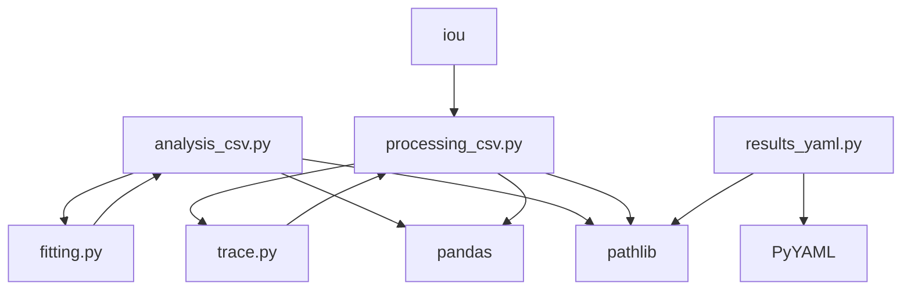

# Analysis CSV I/O

<cite>
**Referenced Files in This Document**   
- [analysis_csv.py](file://pyama-core/src/pyama_core/io/analysis_csv.py)
- [fitting.py](file://pyama-core/src/pyama_core/analysis/fitting.py)
- [maturation.py](file://pyama-core/src/pyama_core/analysis/models/maturation.py)
- [maturation_blocked.py](file://pyama-core/src/pyama_core/analysis/models/maturation_blocked.py)
- [trivial.py](file://pyama-core/src/pyama_core/analysis/models/trivial.py)
- [processing_csv.py](file://pyama-core/src/pyama_core/io/processing_csv.py)
- [results_yaml.py](file://pyama-core/src/pyama_core/io/results_yaml.py)
- [trace.py](file://pyama-core/src/pyama_core/processing/extraction/trace.py)
- [feature.py](file://pyama-core/src/pyama_core/processing/extraction/feature.py)
- [iou.py](file://pyama-core/src/pyama_core/processing/tracking/iou.py)
</cite>

## Table of Contents
1. [Introduction](#introduction)
2. [Project Structure](#project-structure)
3. [Core Components](#core-components)
4. [Architecture Overview](#architecture-overview)
5. [Detailed Component Analysis](#detailed-component-analysis)
6. [Dependency Analysis](#dependency-analysis)
7. [Performance Considerations](#performance-considerations)
8. [Troubleshooting Guide](#troubleshooting-guide)
9. [Conclusion](#conclusion)

## Introduction
This document provides comprehensive API documentation for the analysis CSV module in PyAMA, a microscopy analysis framework. The module enables importing and exporting of analysis datasets, including fitted parameters, model outputs, and statistical summaries. The documentation details the CSV schema used for analysis results, explains interoperability with external statistical tools and data visualization software, and provides usage examples for common workflows. The system is designed to support batch processing of experimental data and integration with popular data science libraries like pandas.

## Project Structure
The PyAMA project consists of multiple components organized in a modular structure. The core functionality resides in the pyama-core package, which contains the analysis, IO, and processing modules. The analysis CSV functionality is primarily located in the io subpackage, with supporting components in the analysis and processing modules. The pyama-qt and pyama-qt-slim packages provide graphical user interfaces that utilize the core functionality. The analysis CSV module specifically handles the import and export of time-series data for cell analysis, with complementary functionality in processing CSV for feature extraction and YAML for processing results management.



**Diagram sources**
- [analysis_csv.py](file://pyama-core/src/pyama_core/io/analysis_csv.py)
- [processing_csv.py](file://pyama-core/src/pyama_core/io/processing_csv.py)
- [results_yaml.py](file://pyama-core/src/pyama_core/io/results_yaml.py)
- [fitting.py](file://pyama-core/src/pyama_core/analysis/fitting.py)
- [trace.py](file://pyama-core/src/pyama_core/processing/extraction/trace.py)

**Section sources**
- [analysis_csv.py](file://pyama-core/src/pyama_core/io/analysis_csv.py)
- [processing_csv.py](file://pyama-core/src/pyama_core/io/processing_csv.py)
- [results_yaml.py](file://pyama-core/src/pyama_core/io/results_yaml.py)

## Core Components
The analysis CSV module provides essential functionality for handling time-series data in microscopy analysis. The core components include utilities for reading and writing CSV files with time as the index and cell IDs as columns. The module supports optional time unit specification in comment headers and automatically converts time values to hours during loading. Additional functions enable the creation of properly formatted DataFrames from time values and cell data, extraction of statistics from analysis DataFrames, and discovery of CSV files in directories. The processing CSV module complements this with functions for extracting cell quality information, feature data for specific cells, and position data, as well as updating cell quality status in DataFrames.

**Section sources**
- [analysis_csv.py](file://pyama-core/src/pyama_core/io/analysis_csv.py#L1-L165)
- [processing_csv.py](file://pyama-core/src/pyama_core/io/processing_csv.py#L1-L179)

## Architecture Overview
The analysis CSV module is part of a larger architecture that integrates data import/export, processing, and analysis components. The system follows a pipeline approach where raw microscopy data is processed to extract cell features and traces, which are then analyzed using mathematical models. The CSV I/O components serve as the interface between the processing and analysis stages, allowing for the persistence and exchange of data. The architecture supports interoperability with external tools through standard CSV format and pandas DataFrame integration. The analysis module provides fitting functions that work directly with the CSV-formatted data, enabling parameter estimation and model validation.

```mermaid
graph TD
RawData[Raw Microscopy Data] --> Segmentation
Segmentation --> Tracking
Tracking --> FeatureExtraction
FeatureExtraction --> ProcessingCSV[processing_csv.py]
ProcessingCSV --> TraceExtraction
TraceExtraction --> AnalysisCSV[analysis_csv.py]
AnalysisCSV --> ModelFitting
ModelFitting --> Results[Analysis Results]
Results --> Export[CSV/YAML Export]
ExternalTools[External Statistical Tools] < --> AnalysisCSV
VisualizationTools[Data Visualization Software] < --> AnalysisCSV
Pandas[pandas DataFrames] < --> AnalysisCSV
style AnalysisCSV fill:#f9f,stroke:#333
```

**Diagram sources**
- [analysis_csv.py](file://pyama-core/src/pyama_core/io/analysis_csv.py)
- [processing_csv.py](file://pyama-core/src/pyama_core/io/processing_csv.py)
- [trace.py](file://pyama-core/src/pyama_core/processing/extraction/trace.py)
- [fitting.py](file://pyama-core/src/pyama_core/analysis/fitting.py)

## Detailed Component Analysis

### Analysis CSV Module
The analysis CSV module provides functions for reading and writing CSV files in a specific format used for analysis data. The format uses time as the index and cell IDs as columns, with optional time unit specification in comment headers. The module handles automatic conversion of time values to hours and ensures proper formatting of DataFrames for analysis.



**Diagram sources**
- [analysis_csv.py](file://pyama-core/src/pyama_core/io/analysis_csv.py#L13-L165)

**Section sources**
- [analysis_csv.py](file://pyama-core/src/pyama_core/io/analysis_csv.py#L1-L165)

### Analysis and Fitting Components
The analysis module provides fitting functionality for mathematical models applied to cell trace data. It supports multiple models including maturation, maturation_blocked, and trivial models, each with specific parameters and bounds. The fitting process uses least squares optimization to estimate model parameters from experimental data.



**Diagram sources**
- [fitting.py](file://pyama-core/src/pyama_core/analysis/fitting.py#L1-L195)
- [maturation.py](file://pyama-core/src/pyama_core/analysis/models/maturation.py)
- [maturation_blocked.py](file://pyama-core/src/pyama_core/analysis/models/maturation_blocked.py)
- [trivial.py](file://pyama-core/src/pyama_core/analysis/models/trivial.py)

**Section sources**
- [fitting.py](file://pyama-core/src/pyama_core/analysis/fitting.py#L1-L195)

### Processing and Feature Extraction
The processing module handles the extraction of features from segmented microscopy images. It includes tracking functionality using IoU-based assignment, feature extraction for cell properties like intensity and area, and organization of the data into structured formats.



**Diagram sources**
- [trace.py](file://pyama-core/src/pyama_core/processing/extraction/trace.py#L1-L237)
- [feature.py](file://pyama-core/src/pyama_core/processing/extraction/feature.py#L1-L60)
- [iou.py](file://pyama-core/src/pyama_core/processing/tracking/iou.py#L1-L362)

**Section sources**
- [trace.py](file://pyama-core/src/pyama_core/processing/extraction/trace.py#L1-L237)
- [feature.py](file://pyama-core/src/pyama_core/processing/extraction/feature.py#L1-L60)
- [iou.py](file://pyama-core/src/pyama_core/processing/tracking/iou.py#L1-L362)

## Dependency Analysis
The analysis CSV module has dependencies on several other components within the PyAMA system. It relies on pandas for DataFrame operations and Path from pathlib for file path handling. The module is used by the analysis components for loading data for model fitting and by the processing components for exporting extracted features. The processing CSV module shares similar dependencies and serves as a complementary component for processing-stage data. The results YAML module provides additional functionality for managing processing results and discovering data files, creating a cohesive ecosystem for data handling throughout the analysis pipeline.



**Diagram sources**
- [analysis_csv.py](file://pyama-core/src/pyama_core/io/analysis_csv.py)
- [processing_csv.py](file://pyama-core/src/pyama_core/io/processing_csv.py)
- [results_yaml.py](file://pyama-core/src/pyama_core/io/results_yaml.py)
- [fitting.py](file://pyama-core/src/pyama_core/analysis/fitting.py)
- [trace.py](file://pyama-core/src/pyama_core/processing/extraction/trace.py)
- [iou.py](file://pyama-core/src/pyama_core/processing/tracking/iou.py)

**Section sources**
- [analysis_csv.py](file://pyama-core/src/pyama_core/io/analysis_csv.py)
- [processing_csv.py](file://pyama-core/src/pyama_core/io/processing_csv.py)
- [results_yaml.py](file://pyama-core/src/pyama_core/io/results_yaml.py)

## Performance Considerations
The analysis CSV module is designed for efficient handling of microscopy time-series data. The use of pandas DataFrames provides optimized operations for large datasets, and the CSV format allows for streaming I/O operations that minimize memory usage. The module includes functionality for filtering and cleaning data during loading, which helps maintain data quality and reduce processing overhead. When working with large datasets, it is recommended to use the discover_csv_files function to identify relevant files before loading, and to process data in batches to manage memory consumption. The integration with pandas enables efficient data manipulation and analysis, leveraging optimized C implementations for numerical operations.

## Troubleshooting Guide
Common issues with the analysis CSV module typically relate to file format compatibility and data type handling. When encountering problems with CSV file loading, verify that the file follows the expected format with time as the index and cell IDs as columns. Check for proper time unit specification in comment headers and ensure that time values are numeric. For issues with model fitting, validate that the input data contains sufficient time points and that the cell traces are complete. When working with external tools, ensure that the CSV files are saved with compatible encodings and delimiters. The module includes error handling for missing files and invalid data, providing descriptive error messages to aid in troubleshooting.

**Section sources**
- [analysis_csv.py](file://pyama-core/src/pyama_core/io/analysis_csv.py#L1-L165)
- [fitting.py](file://pyama-core/src/pyama_core/analysis/fitting.py#L1-L195)

## Conclusion
The analysis CSV module in PyAMA provides a robust interface for importing and exporting analysis datasets, enabling seamless integration with external statistical tools and data visualization software. The module's design emphasizes interoperability, with support for standard CSV format and pandas DataFrame integration. The comprehensive API allows for batch processing of experimental data, export of fitting results, and extension of the CSV schema for custom analysis workflows. By following the documented patterns and best practices, users can effectively leverage the module for a wide range of microscopy analysis applications, from basic data exploration to advanced modeling and parameter estimation.