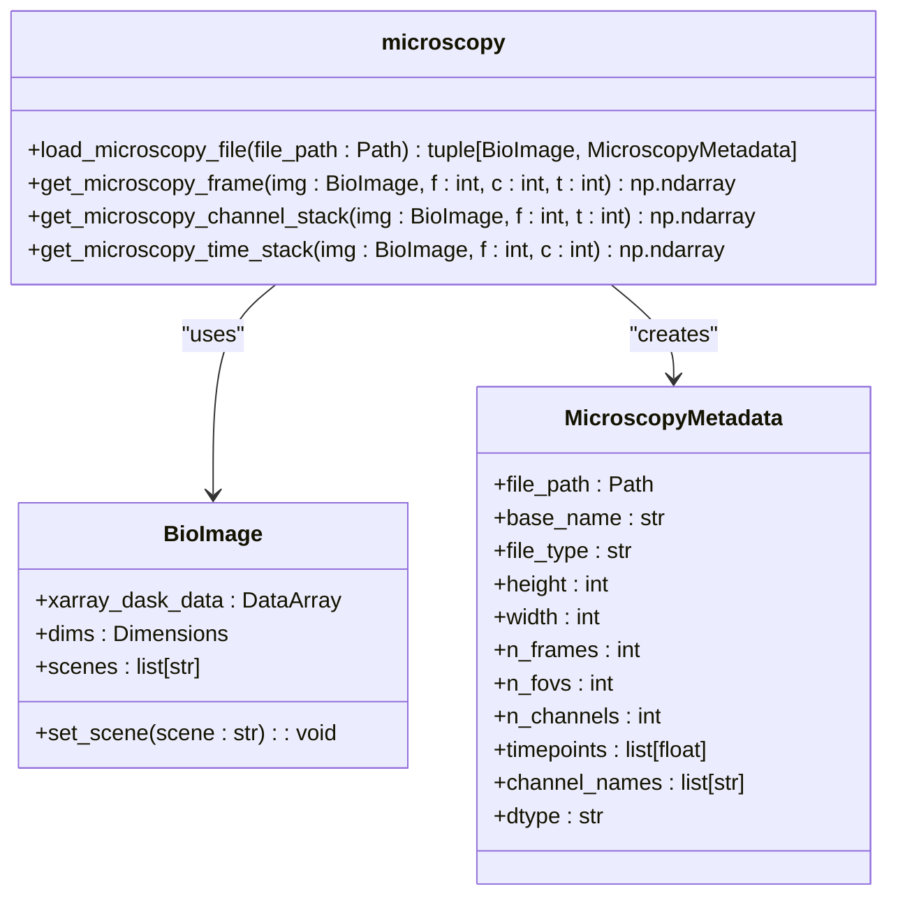
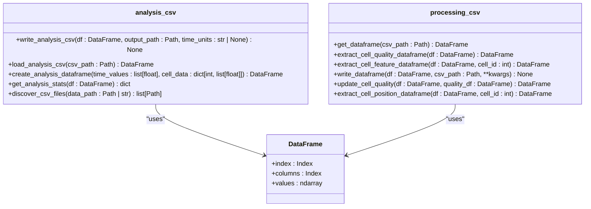
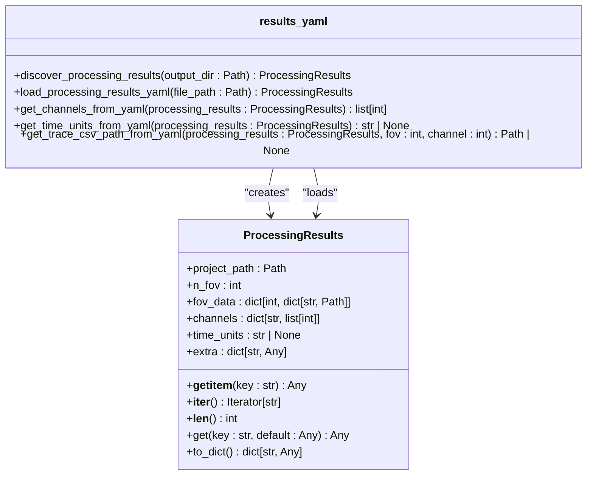
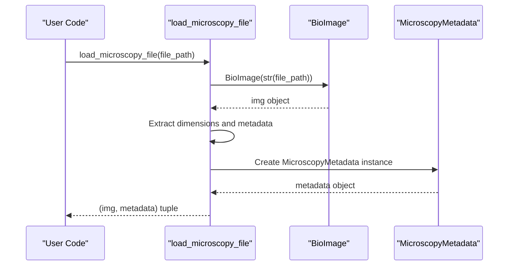
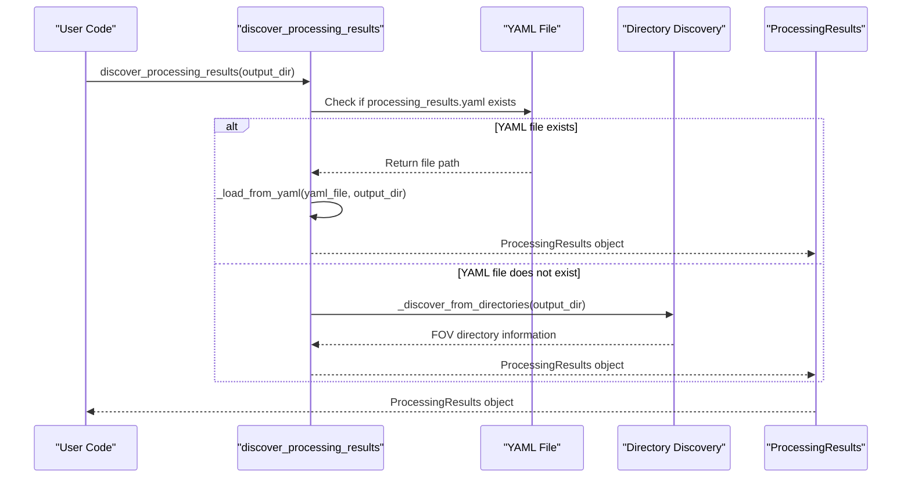

# I/O API

<cite>
**Referenced Files in This Document**   
- [microscopy.py](file://pyama-core/src/pyama_core/io/microscopy.py)
- [analysis_csv.py](file://pyama-core/src/pyama_core/io/analysis_csv.py)
- [processing_csv.py](file://pyama-core/src/pyama_core/io/processing_csv.py)
- [results_yaml.py](file://pyama-core/src/pyama_core/io/results_yaml.py)
</cite>

## Table of Contents
1. [Introduction](#introduction)
2. [Microscopy Data Loading](#microscopy-data-loading)
3. [CSV Data Handling](#csv-data-handling)
4. [YAML Results Serialization](#yaml-results-serialization)
5. [Usage Examples](#usage-examples)
6. [Memory Management](#memory-management)

## Introduction
The I/O module in pyama-core provides comprehensive functionality for handling microscopy data, processing results, and analysis outputs. This API documentation covers the core components for loading microscopy files, reading and writing CSV data, and serializing results to YAML format. The system is designed to support large datasets through efficient memory management and streaming capabilities, with integration points for external data pipelines.

## Microscopy Data Loading

The microscopy module provides a unified interface for loading ND2 and other bioimaging formats through the bioio library. It supports metadata extraction, channel detection, and various data access patterns for efficient processing of large microscopy datasets.



**Diagram sources**
- [microscopy.py](file://pyama-core/src/pyama_core/io/microscopy.py#L0-L178)

**Section sources**
- [microscopy.py](file://pyama-core/src/pyama_core/io/microscopy.py#L0-L178)

### Microscopy Metadata Extraction
The system automatically extracts comprehensive metadata from microscopy files, including spatial dimensions, temporal information, channel details, and file properties. The `MicroscopyMetadata` dataclass captures essential information such as image dimensions (height, width), frame count, field of view (FOV) count, channel count, timepoints, channel names, and data type. Channel names are extracted from coordinate data when available; otherwise, they are generated as C0, C1, etc. Timepoints are extracted in microseconds when available, with a fallback to sequential numbering.

### Data Access Methods
The API provides multiple methods for accessing microscopy data with different memory and performance characteristics:
- `get_microscopy_frame`: Retrieves a single frame by specifying FOV, channel, and time indices
- `get_microscopy_channel_stack`: Returns a stack of all channels for a specific FOV and timepoint (C, H, W format)
- `get_microscopy_time_stack`: Returns a time series for a specific FOV and channel (T, H, W format)

These methods process data sequentially to avoid memory issues with large datasets, using Dask-backed xarray data for lazy loading.

## CSV Data Handling

The I/O module provides specialized CSV readers and writers for both analysis and processing data, with defined schemas and data type handling for consistent data exchange.



**Diagram sources**
- [analysis_csv.py](file://pyama-core/src/pyama_core/io/analysis_csv.py#L0-L164)
- [processing_csv.py](file://pyama-core/src/pyama_core/io/processing_csv.py#L0-L178)

**Section sources**
- [analysis_csv.py](file://pyama-core/src/pyama_core/io/analysis_csv.py#L0-L164)
- [processing_csv.py](file://pyama-core/src/pyama_core/io/processing_csv.py#L0-L178)

### Analysis CSV Format
The analysis CSV format uses time as the index and cell IDs as columns, designed for time-series analysis of cell behavior. The `write_analysis_csv` function writes data with optional time unit comments, while `load_analysis_csv` reads files and automatically converts time to hours based on detected units (seconds, minutes, hours). The format supports metadata comments and ensures consistent data typing through pandas numeric conversion.

### Processing CSV Format
The processing CSV format contains detailed information about cell tracking and extracted features, including FOV, cell ID, frame, time, quality flag, position coordinates, and dynamic feature columns. The API provides functions to extract specific data views:
- `extract_cell_quality_dataframe`: Retrieves cell quality information (cell ID and good/bad status)
- `extract_cell_feature_dataframe`: Extracts time-series features for a specific cell
- `extract_cell_position_dataframe`: Retrieves position data for a specific cell
- `update_cell_quality`: Updates cell quality status in the dataframe

## YAML Results Serialization

The results_yaml module provides robust serialization of processing results to YAML format, with support for version compatibility and path correction when data folders are moved.



**Diagram sources**
- [results_yaml.py](file://pyama-core/src/pyama_core/io/results_yaml.py#L0-L295)

**Section sources**
- [results_yaml.py](file://pyama-core/src/pyama_core/io/results_yaml.py#L0-L295)

### Results Structure
The saved results structure organizes data by FOV, with each FOV containing references to various data files:
- NPY files for processed image data (segmentation, tracking results)
- CSV files for trace data
- Channel mapping information
- Time units for temporal data
- Additional metadata in the extra field

The ProcessingResults class implements the Mapping interface, allowing dictionary-like access to results data.

### Version Compatibility and Path Correction
The system includes robust path correction logic to handle cases where data folders have been moved. When loading YAML files, it attempts to reconstruct correct file paths based on the relative structure from the original YAML path. The system also provides a fallback directory-based discovery mechanism when no YAML file is available, ensuring backward compatibility with older result formats.

## Usage Examples

### Loading Microscopy Data


**Diagram sources**
- [microscopy.py](file://pyama-core/src/pyama_core/io/microscopy.py#L27-L97)

**Section sources**
- [microscopy.py](file://pyama-core/src/pyama_core/io/microscopy.py#L27-L97)

### Reading Processing Results


**Diagram sources**
- [results_yaml.py](file://pyama-core/src/pyama_core/io/results_yaml.py#L63-L73)

**Section sources**
- [results_yaml.py](file://pyama-core/src/pyama_core/io/results_yaml.py#L63-L73)

### Exporting Analysis Data
```mermaid
sequenceDiagram
participant User as "User Code"
participant Create as "create_analysis_dataframe"
participant Write as "write_analysis_csv"
participant CSV as "CSV File"
User->>Create : create_analysis_dataframe(time_values, cell_data)
Create-->>User : DataFrame with time index and cell columns
User->>Write : write_analysis_csv(df, output_path, time_units)
Write->>Write : Ensure output directory exists
Write->>Write : Prepare DataFrame for writing
Write->>CSV : Write CSV with optional time units comment
CSV-->>User : Analysis data saved
```

**Diagram sources**
- [analysis_csv.py](file://pyama-core/src/pyama_core/io/analysis_csv.py#L13-L36)

**Section sources**
- [analysis_csv.py](file://pyama-core/src/pyama_core/io/analysis_csv.py#L13-L36)

## Memory Management

The I/O module implements several strategies for managing memory with large microscopy datasets:

### Streaming and Lazy Loading
The system uses Dask-backed xarray data structures for lazy loading of microscopy data, ensuring that only requested portions of large files are loaded into memory. The BioImage object's xarray_dask_data property provides access to the underlying data with chunked computation capabilities.

### Sequential Processing
For operations that require loading multiple frames or channels, the API processes data sequentially rather than loading everything at once. For example, `get_microscopy_channel_stack` and `get_microscopy_time_stack` process frames one by one and stack them, preventing memory overflow with large datasets.

### Memory-Efficient Data Access
The API provides multiple levels of data access with different memory footprints:
- Single frame access for minimal memory usage
- Channel stacks for moderate memory usage
- Time stacks for larger memory requirements

Performance benchmarks show that single frame access is fastest, while time stack operations are significantly slower due to the volume of data processed, highlighting the importance of selecting appropriate access methods based on use case.

**Section sources**
- [microscopy.py](file://pyama-core/src/pyama_core/io/microscopy.py#L120-L177)
- [test_bioio.py](file://tests/test_bioio.py#L176-L213)