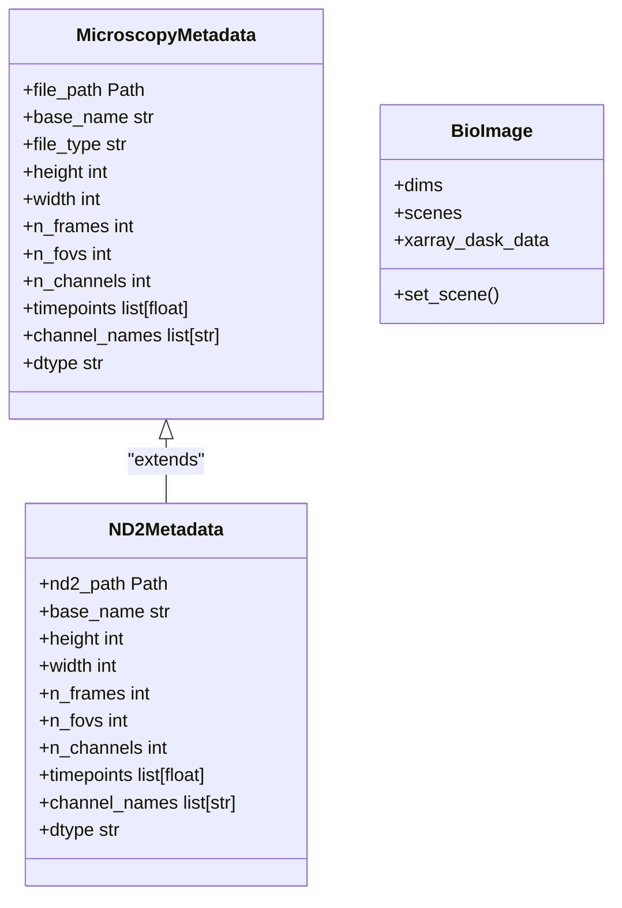
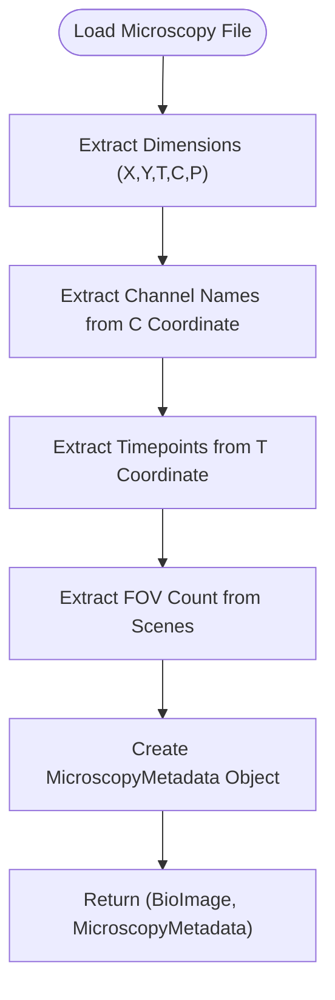
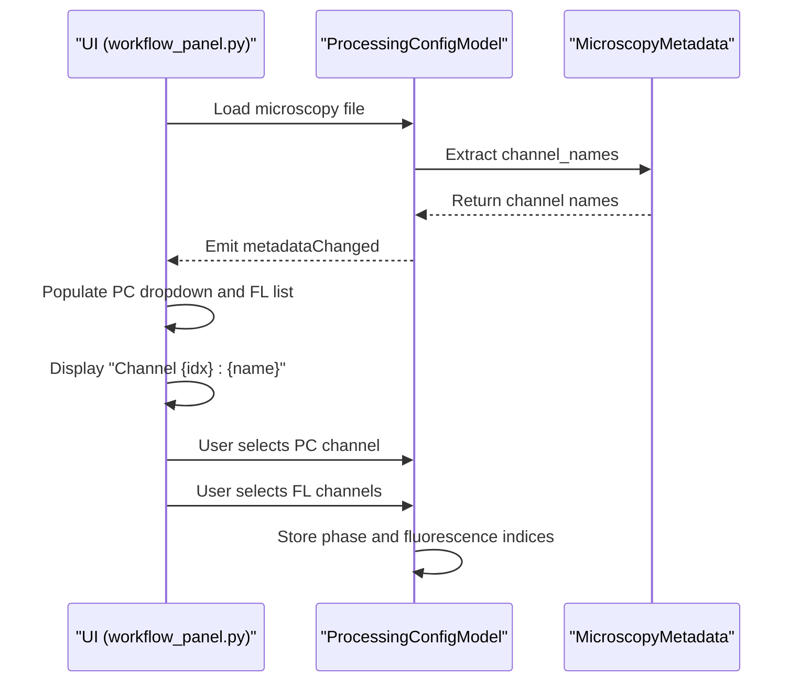
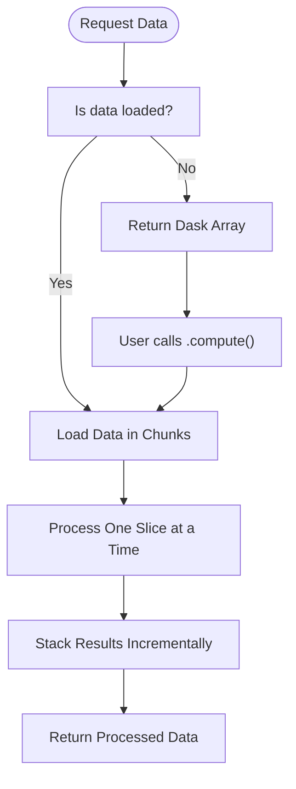

# Microscopy Data I/O

<cite>
**Referenced Files in This Document**   
- [microscopy.py](file://pyama-core/src/pyama_core/io/microscopy.py)
- [nikon.py](file://pyama-core/src/pyama_core/io/nikon.py)
- [__init__.py](file://pyama-core/src/pyama_core/io/__init__.py)
- [workflow_panel.py](file://pyama-qt/src/pyama_qt/processing/panels/workflow_panel.py)
- [models.py](file://pyama-qt/src/pyama_qt/processing/models.py)
- [controller.py](file://pyama-qt/src/pyama_qt/processing/controller.py)
- [test_workflow.py](file://tests/test_workflow.py)
</cite>

## Table of Contents
1. [Introduction](#introduction)
2. [MicroscopyReader Interface and Implementation](#microscopyreader-interface-and-implementation)
3. [Metadata Extraction Process](#metadata-extraction-process)
4. [Channel Detection Logic](#channel-detection-logic)
5. [Loading Multi-Dimensional Datasets](#loading-multi-dimensional-datasets)
6. [Memory Efficiency Strategies](#memory-efficiency-strategies)
7. [Integration with External Pipelines](#integration-with-external-pipelines)
8. [Usage Examples](#usage-examples)
9. [Conclusion](#conclusion)

## Introduction
The pyama-core microscopy data input system provides a unified interface for loading and processing multi-dimensional bioimaging datasets, with native support for Nikon ND2 format and extensibility to other formats through the bioio library. This documentation details the MicroscopyReader class interface, metadata extraction capabilities, channel detection logic, and memory-efficient data access patterns for large microscopy datasets.

**Section sources**
- [microscopy.py](file://pyama-core/src/pyama_core/io/microscopy.py#L1-L97)
- [nikon.py](file://pyama-core/src/pyama_core/io/nikon.py#L1-L79)

## MicroscopyReader Interface and Implementation
The microscopy data input system in pyama-core provides a unified interface for loading bioimaging datasets through the `load_microscopy_file` function, which serves as the primary entry point for reading microscopy data. This function leverages the bioio library to support multiple bioimaging formats including ND2 (Nikon) and CZI (Zeiss). For ND2-specific functionality, the system implements a dedicated `load_nd2` function that provides optimized reading capabilities for Nikon datasets.

The core interface returns a tuple containing a BioImage object and a MicroscopyMetadata dataclass, enabling both direct pixel data access and structured metadata retrieval. The system abstracts format-specific details, allowing users to work with a consistent API regardless of the underlying file format. The implementation uses xarray with Dask backing for lazy loading, ensuring efficient memory usage when working with large multi-dimensional datasets.



**Diagram sources**
- [microscopy.py](file://pyama-core/src/pyama_core/io/microscopy.py#L11-L24)
- [nikon.py](file://pyama-core/src/pyama_core/io/nikon.py#L12-L22)

**Section sources**
- [microscopy.py](file://pyama-core/src/pyama_core/io/microscopy.py#L27-L97)
- [nikon.py](file://pyama-core/src/pyama_core/io/nikon.py#L25-L79)

## Metadata Extraction Process
The microscopy data input system extracts comprehensive metadata from bioimaging files, including spatial dimensions, temporal information, channel configurations, and acquisition parameters. When loading a microscopy file, the system automatically extracts stage positions through the field of view (FOV) count, which is determined by the number of scenes in the BioImage object. The system identifies the number of FOVs by accessing the `img.scenes` property, which corresponds to different positions on the microscope stage.

Channel configurations are extracted from the C dimension of the image data, with channel names retrieved from the coordinate values when available. If coordinate information is not present, the system generates placeholder names (C0, C1, etc.). Time series information is extracted from the T dimension, with timepoints parsed from the coordinate values when available. The system attempts to convert time coordinates to floating-point values, falling back to sequential indices if conversion fails. Objective settings and other acquisition parameters are not explicitly extracted in the current implementation but are accessible through the underlying BioImage object.



**Diagram sources**
- [microscopy.py](file://pyama-core/src/pyama_core/io/microscopy.py#L45-L97)
- [nikon.py](file://pyama-core/src/pyama_core/io/nikon.py#L44-L78)

**Section sources**
- [microscopy.py](file://pyama-core/src/pyama_core/io/microscopy.py#L45-L97)
- [nikon.py](file://pyama-core/src/pyama_core/io/nikon.py#L44-L78)

## Channel Detection Logic
The system implements channel detection logic that identifies phase contrast and fluorescence channels based on channel names and acquisition parameters. In the UI layer, users can manually select the phase contrast channel from a dropdown menu and select multiple fluorescence channels from a multi-select list. The channel selection interface displays channels with their index and name (e.g., "Channel 0: Phase Contrast"), allowing users to identify channels based on naming conventions commonly used in microscopy acquisition.

The backend does not automatically classify channels as phase contrast or fluorescence based on their names or acquisition parameters. Instead, it provides a flexible channel selection mechanism that allows users to specify which channel indices correspond to phase contrast and which correspond to fluorescence. This approach accommodates variations in naming conventions across different laboratories and imaging setups. The system stores channel selections as integer indices, enabling consistent processing regardless of channel naming.



**Diagram sources**
- [workflow_panel.py](file://pyama-qt/src/pyama_qt/processing/panels/workflow_panel.py#L259-L328)
- [models.py](file://pyama-qt/src/pyama_qt/processing/models.py#L118-L163)

**Section sources**
- [workflow_panel.py](file://pyama-qt/src/pyama_qt/processing/panels/workflow_panel.py#L259-L328)
- [models.py](file://pyama-qt/src/pyama_qt/processing/models.py#L118-L163)

## Loading Multi-Dimensional Datasets
The system provides functions for loading multi-dimensional microscopy datasets and accessing specific fields of view (FOVs). The primary function `load_microscopy_file` returns a BioImage object that can be used to access different FOVs by setting the scene. Each FOV represents a different field of view from the microscope stage. Users can access specific FOVs by calling `img.set_scene(f)` where `f` is the FOV index.

The system supports accessing specific frames, channel stacks, and time stacks through dedicated helper functions. The `get_microscopy_frame` function retrieves a single frame specified by FOV, channel, and time indices. The `get_microscopy_channel_stack` function returns a 3D array (C, H, W) containing all channels for a specific FOV and time point. The `get_microscopy_time_stack` function returns a 3D array (T, H, W) containing all time points for a specific FOV and channel. These functions process data one slice at a time to avoid memory issues with large datasets.

**Section sources**
- [microscopy.py](file://pyama-core/src/pyama_core/io/microscopy.py#L100-L178)
- [nikon.py](file://pyama-core/src/pyama_core/io/nikon.py#L81-L149)

## Memory Efficiency Strategies
The microscopy data input system implements several memory efficiency strategies to handle large datasets. The primary strategy is lazy loading using Dask-backed xarray DataArrays, which only loads data into memory when explicitly requested. The system uses `xarray_dask_data` from the BioImage object, which provides a Dask array interface to the underlying image data, enabling chunked reading and out-of-core computation.

For accessing large data subsets, the system processes data one slice at a time and then stacks the results, rather than loading all data simultaneously. For example, the `get_microscopy_channel_stack` and `get_microscopy_time_stack` functions process each channel or time point individually before stacking them into the final array. This approach prevents memory spikes that could occur when loading large 3D or 4D datasets. The system also supports batch processing of FOVs through the `run_complete_workflow` function, which processes FOVs in batches to control memory usage.



**Diagram sources**
- [microscopy.py](file://pyama-core/src/pyama_core/io/microscopy.py#L100-L178)
- [nikon.py](file://pyama-core/src/pyama_core/io/nikon.py#L81-L149)

**Section sources**
- [microscopy.py](file://pyama-core/src/pyama_core/io/microscopy.py#L100-L178)
- [nikon.py](file://pyama-core/src/pyama_core/io/nikon.py#L81-L149)

## Integration with External Pipelines
The microscopy data input system is designed for integration with external image processing pipelines through its abstraction layer. The system exposes a clean API through the `__init__.py` file in the io module, which imports and re-exports key functions and classes. This abstraction layer allows external code to interact with the microscopy data without needing to know the underlying implementation details.

Custom format extensions can be implemented by following the pattern established for ND2 support. Developers can create new modules in the io package that implement format-specific loading functions and metadata classes, then import and re-export these in the package's `__init__.py` file. The system's use of the bioio library as the primary interface provides inherent support for additional formats that bioio can read, requiring minimal additional code for new format support.

**Section sources**
- [__init__.py](file://pyama-core/src/pyama_core/io/__init__.py#L1-L37)
- [microscopy.py](file://pyama-core/src/pyama_core/io/microscopy.py#L1-L97)

## Usage Examples
The following examples demonstrate how to use the microscopy data input system to load datasets and extract metadata. To load a microscopy file and access its metadata:

```python
from pyama_core.io import load_microscopy_file
from pathlib import Path

# Load microscopy file
img, metadata = load_microscopy_file(Path("path/to/file.nd2"))

# Access metadata
print(f"File: {metadata.base_name}")
print(f"Dimensions: {metadata.height}x{metadata.width}")
print(f"FOVs: {metadata.n_fovs}, Frames: {metadata.n_frames}")
print(f"Channels: {metadata.channel_names}")
print(f"Timepoints: {metadata.timepoints}")
```

To access specific data subsets:

```python
from pyama_core.io import get_microscopy_frame, get_microscopy_channel_stack

# Get a specific frame (FOV 0, channel 0, time 0)
frame = get_microscopy_frame(img, f=0, c=0, t=0)

# Get a channel stack (all channels for FOV 0, time 0)
channel_stack = get_microscopy_channel_stack(img, f=0, t=0)

# Get a time stack (all time points for FOV 0, channel 0)
time_stack = get_microscopy_time_stack(img, f=0, c=0)
```

For workflow integration:

```python
from pyama_core.processing.workflow import run_complete_workflow
from pyama_core.processing.workflow.services.types import ProcessingContext

# Create processing context
ctx = ProcessingContext(
    output_dir=Path("output/"),
    channels=Channels(pc=0, fl=[1, 2]),
)

# Run complete workflow
success = run_complete_workflow(
    metadata=metadata,
    context=ctx,
    fov_start=0,
    fov_end=1,
    batch_size=2,
    n_workers=2,
)
```

**Section sources**
- [test_workflow.py](file://tests/test_workflow.py#L38-L67)
- [controller.py](file://pyama-qt/src/pyama_qt/processing/controller.py#L326-L358)
- [microscopy.py](file://pyama-core/src/pyama_core/io/microscopy.py#L27-L97)

## Conclusion
The pyama-core microscopy data input system provides a robust and flexible interface for loading and processing multi-dimensional bioimaging datasets. By leveraging the bioio library and implementing format-specific optimizations, the system supports multiple microscopy formats with a consistent API. The metadata extraction process captures essential information about spatial dimensions, temporal series, and channel configurations, while the channel detection logic allows for flexible assignment of phase contrast and fluorescence channels. Memory efficiency is prioritized through lazy loading and chunked reading strategies, enabling the system to handle large datasets effectively. The well-defined abstraction layer facilitates integration with external processing pipelines and extension to additional bioimaging formats.