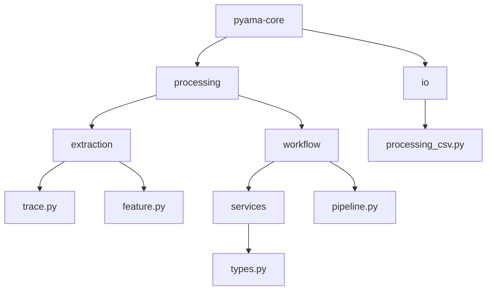
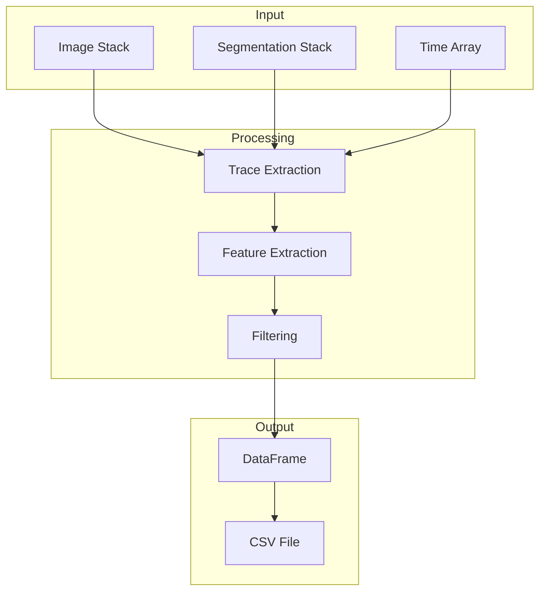
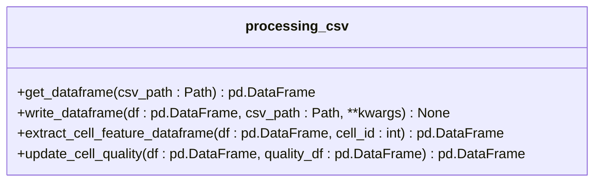
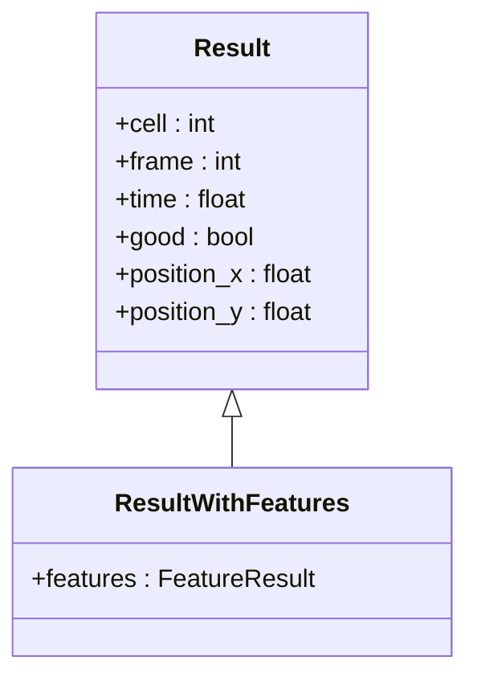
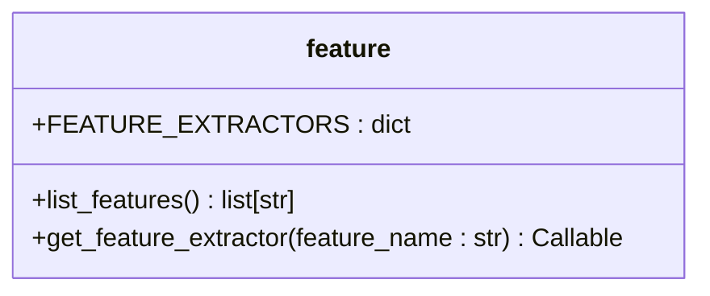
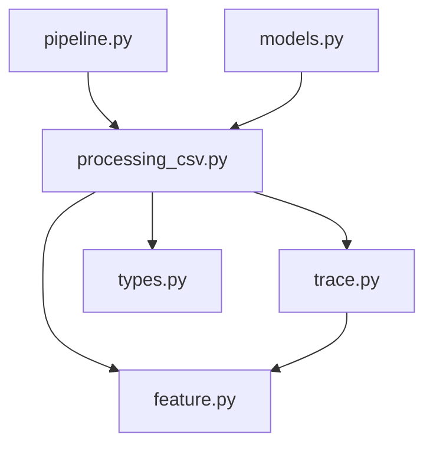

# Processing CSV I/O

<cite>
**Referenced Files in This Document**   
- [processing_csv.py](file://pyama-core/src/pyama_core/io/processing_csv.py)
- [trace.py](file://pyama-core/src/pyama_core/processing/extraction/trace.py)
- [feature.py](file://pyama-core/src/pyama_core/processing/extraction/feature.py)
- [types.py](file://pyama-core/src/pyama_core/processing/workflow/services/types.py)
- [pipeline.py](file://pyama-core/src/pyama_core/processing/workflow/pipeline.py)
- [models.py](file://pyama-qt/src/pyama_qt/visualization/models.py)
</cite>

## Table of Contents
1. [Introduction](#introduction)
2. [Project Structure](#project-structure)
3. [Core Components](#core-components)
4. [Architecture Overview](#architecture-overview)
5. [Detailed Component Analysis](#detailed-component-analysis)
6. [Dependency Analysis](#dependency-analysis)
7. [Performance Considerations](#performance-considerations)
8. [Troubleshooting Guide](#troubleshooting-guide)
9. [Conclusion](#conclusion)

## Introduction
This document provides comprehensive API documentation for the processing CSV module in the PyAMA system. The module handles CSV files generated during the image processing pipeline, specifically for cell detection results, segmentation outputs, and tracking data. The documentation covers the schema structure, column definitions, data types, integration with the core processing workflow, and downstream analysis modules. It includes practical examples for programmatically accessing processing results, modifying CSV outputs, and handling edge cases such as missing values or malformed entries. Performance considerations for handling large CSV files and best practices for data validation and error handling are also addressed.

## Project Structure
The project structure is organized into several core modules, with the processing CSV functionality residing in the `pyama-core` package. The key components are located in the `io` and `processing` directories, with specific files dedicated to CSV handling, feature extraction, and workflow management.

**Diagram sources**
- [processing_csv.py](file://pyama-core/src/pyama_core/io/processing_csv.py)
- [trace.py](file://pyama-core/src/pyama_core/processing/extraction/trace.py)
- [feature.py](file://pyama-core/src/pyama_core/processing/extraction/feature.py)
- [types.py](file://pyama-core/src/pyama_core/processing/workflow/services/types.py)
- [pipeline.py](file://pyama-core/src/pyama_core/processing/workflow/pipeline.py)

**Section sources**
- [processing_csv.py](file://pyama-core/src/pyama_core/io/processing_csv.py)
- [trace.py](file://pyama-core/src/pyama_core/processing/extraction/trace.py)
- [feature.py](file://pyama-core/src/pyama_core/processing/extraction/feature.py)
- [types.py](file://pyama-core/src/pyama_core/processing/workflow/services/types.py)
- [pipeline.py](file://pyama-core/src/pyama_core/processing/workflow/pipeline.py)

## Core Components
The core components of the processing CSV module include functions for reading and writing CSV files, extracting cell quality information, and handling feature data. The module relies on the `Result` dataclass from the `trace.py` file to define the schema structure and column definitions. The `extract_trace` function in `trace.py` is responsible for generating the initial DataFrame that is then written to CSV format. The `FEATURE_EXTRACTORS` dictionary in `feature.py` defines the available feature extraction methods, which are dynamically added to the CSV output.

**Section sources**
- [processing_csv.py](file://pyama-core/src/pyama_core/io/processing_csv.py)
- [trace.py](file://pyama-core/src/pyama_core/processing/extraction/trace.py)
- [feature.py](file://pyama-core/src/pyama_core/processing/extraction/feature.py)

## Architecture Overview
The architecture of the processing CSV module is designed to integrate seamlessly with the core processing workflow and downstream analysis modules. The module provides a set of utility functions for handling CSV files consumed by the processing module, with a format that includes FOV information, cell tracking data, and extracted features. The architecture follows a functional style, with functions designed for performance with time-series datasets. The module processes stacks frame-by-frame to manage memory usage, uses vectorized operations for feature extraction, and provides progress callbacks for long-running operations.

**Diagram sources**
- [trace.py](file://pyama-core/src/pyama_core/processing/extraction/trace.py)
- [feature.py](file://pyama-core/src/pyama_core/processing/extraction/feature.py)
- [processing_csv.py](file://pyama-core/src/pyama_core/io/processing_csv.py)

## Detailed Component Analysis
The detailed component analysis focuses on the key functions and classes that make up the processing CSV module. This includes the `get_dataframe`, `write_dataframe`, `extract_cell_feature_dataframe`, and `update_cell_quality` functions in `processing_csv.py`, as well as the `Result` and `ResultWithFeatures` classes in `trace.py`. The analysis also covers the `FEATURE_EXTRACTORS` dictionary in `feature.py`, which defines the available feature extraction methods.

### Processing CSV Module Analysis
The `processing_csv.py` module provides a set of utility functions for handling CSV files consumed by the processing module. The format includes FOV information, cell tracking data, and extracted features. The module defines the following functions:

- `get_dataframe`: Reads a CSV file and returns a pandas DataFrame with the processing data.
- `write_dataframe`: Writes a pandas DataFrame to a CSV file with default settings optimized for the processing format.
- `extract_cell_feature_dataframe`: Extracts a dataframe with time series features for a specific cell.
- `update_cell_quality`: Updates the 'good' column in a DataFrame based on an updated cell quality DataFrame.

**Diagram sources**
- [processing_csv.py](file://pyama-core/src/pyama_core/io/processing_csv.py)

**Section sources**
- [processing_csv.py](file://pyama-core/src/pyama_core/io/processing_csv.py)

### Trace Extraction Module Analysis
The `trace.py` module is responsible for extracting and filtering cell traces from microscopy time-series. The module defines the `Result` and `ResultWithFeatures` dataclasses, which are used to define the schema structure and column definitions for the CSV files. The `extract_trace` function orchestrates the complete trace extraction pipeline, including IoU-based cell tracking, feature extraction, and filtering by length and quality criteria.

**Diagram sources**
- [trace.py](file://pyama-core/src/pyama_core/processing/extraction/trace.py)

**Section sources**
- [trace.py](file://pyama-core/src/pyama_core/processing/extraction/trace.py)

### Feature Extraction Module Analysis
The `feature.py` module defines the available feature extraction methods, which are dynamically added to the CSV output. The module includes the `FEATURE_EXTRACTORS` dictionary, which maps feature names to their corresponding extraction functions. The available features include `intensity_total` and `area`, with the potential for additional features to be added in the future.

**Diagram sources**
- [feature.py](file://pyama-core/src/pyama_core/processing/extraction/feature.py)

**Section sources**
- [feature.py](file://pyama-core/src/pyama_core/processing/extraction/feature.py)

## Dependency Analysis
The processing CSV module has several dependencies on other modules within the PyAMA system. The module relies on the `Result` dataclass from the `trace.py` file to define the schema structure and column definitions. The `extract_trace` function in `trace.py` is responsible for generating the initial DataFrame that is then written to CSV format. The `FEATURE_EXTRACTORS` dictionary in `feature.py` defines the available feature extraction methods, which are dynamically added to the CSV output. The module also depends on the `ResultsPathsPerFOV` dataclass in `types.py` to manage the file paths for the CSV files.

**Diagram sources**
- [processing_csv.py](file://pyama-core/src/pyama_core/io/processing_csv.py)
- [trace.py](file://pyama-core/src/pyama_core/processing/extraction/trace.py)
- [feature.py](file://pyama-core/src/pyama_core/processing/extraction/feature.py)
- [types.py](file://pyama-core/src/pyama_core/processing/workflow/services/types.py)
- [pipeline.py](file://pyama-core/src/pyama_core/processing/workflow/pipeline.py)
- [models.py](file://pyama-qt/src/pyama_qt/visualization/models.py)

**Section sources**
- [processing_csv.py](file://pyama-core/src/pyama_core/io/processing_csv.py)
- [trace.py](file://pyama-core/src/pyama_core/processing/extraction/trace.py)
- [feature.py](file://pyama-core/src/pyama_core/processing/extraction/feature.py)
- [types.py](file://pyama-core/src/pyama_core/processing/workflow/services/types.py)
- [pipeline.py](file://pyama-core/src/pyama_core/processing/workflow/pipeline.py)
- [models.py](file://pyama-qt/src/pyama_qt/visualization/models.py)

## Performance Considerations
The processing CSV module is designed with performance in mind, particularly when handling large CSV files. The module processes stacks frame-by-frame to manage memory usage, uses vectorized operations for feature extraction, and provides progress callbacks for long-running operations. When handling large CSV files, it is recommended to use the `get_dataframe` function with the `chunksize` parameter to read the file in smaller chunks. Additionally, the `write_dataframe` function includes default settings optimized for the processing format, which can help improve write performance.

## Troubleshooting Guide
The processing CSV module includes several error handling mechanisms to help troubleshoot common issues. When reading a CSV file, the `get_dataframe` function raises a `FileNotFoundError` if the file does not exist and a `ValueError` if the file is empty or cannot be read. When writing a CSV file, the `write_dataframe` function raises a `ValueError` if the DataFrame is empty or cannot be written. When extracting cell feature data, the `extract_cell_feature_dataframe` function raises a `ValueError` if the cell ID is not found in the DataFrame. When updating cell quality, the `update_cell_quality` function raises a `ValueError` if the required columns are missing from the DataFrames.

**Section sources**
- [processing_csv.py](file://pyama-core/src/pyama_core/io/processing_csv.py)

## Conclusion
The processing CSV module in the PyAMA system provides a robust set of utilities for handling CSV files generated during the image processing pipeline. The module is designed to integrate seamlessly with the core processing workflow and downstream analysis modules, with a focus on performance and error handling. The documentation covers the schema structure, column definitions, data types, and practical examples for programmatically accessing processing results, modifying CSV outputs, and handling edge cases. By following the best practices outlined in this document, users can effectively leverage the processing CSV module to analyze and visualize their microscopy data.