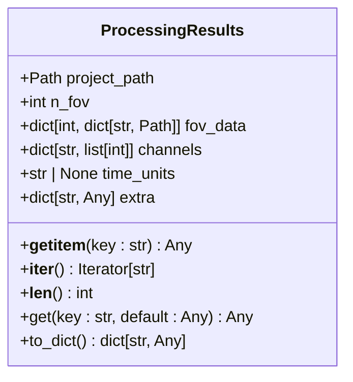
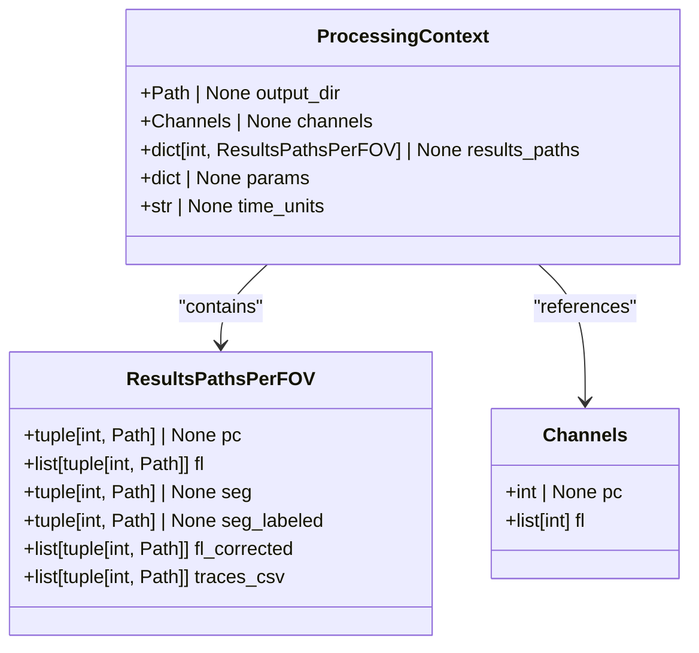
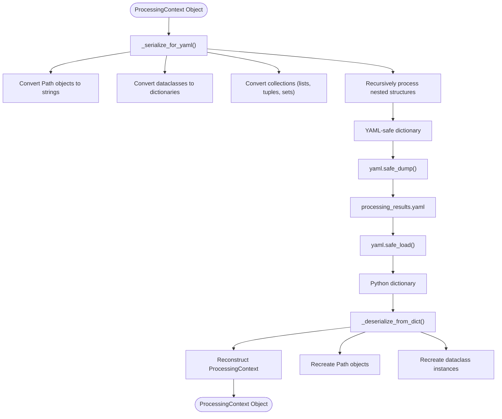
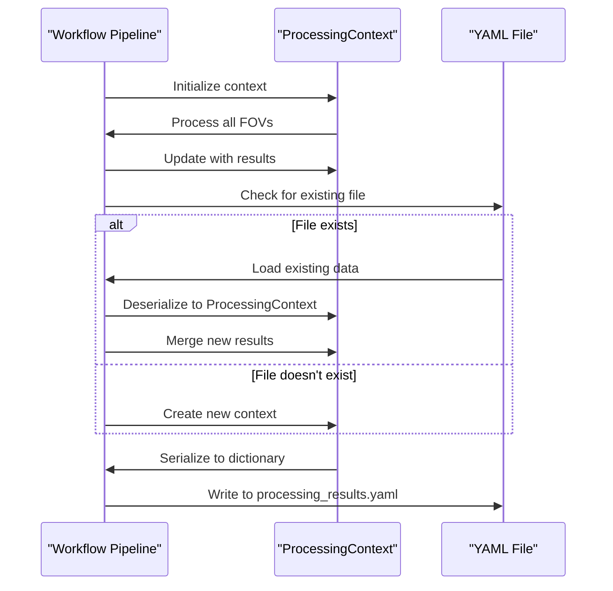
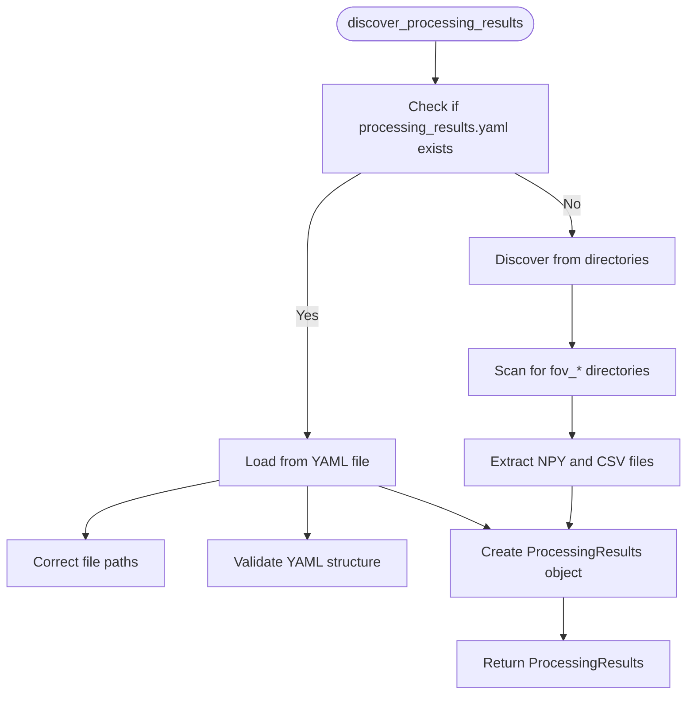

# YAML Results Serialization

<cite>
**Referenced Files in This Document**   
- [results_yaml.py](file://pyama-core/src/pyama_core/io/results_yaml.py)
- [pipeline.py](file://pyama-core/src/pyama_core/processing/workflow/pipeline.py)
- [types.py](file://pyama-core/src/pyama_core/processing/workflow/services/types.py)
</cite>

## Table of Contents
1. [Introduction](#introduction)
2. [Core Data Structure](#core-data-structure)
3. [YAML Schema and File Structure](#yaml-schema-and-file-structure)
4. [Processing Context and Results Paths](#processing-context-and-results-paths)
5. [Serialization and Deserialization](#serialization-and-deserialization)
6. [Versioning and Backward Compatibility](#versioning-and-backward-compatibility)
7. [Reading Saved Results](#reading-saved-results)
8. [Extending the Serialization Format](#extending-the-serialization-format)
9. [Validation and Integrity](#validation-and-integrity)
10. [Security Considerations](#security-considerations)
11. [Performance Optimization](#performance-optimization)
12. [Conclusion](#conclusion)

## Introduction

The YAML-based results serialization system in PyAMA provides a robust mechanism for persisting processing and analysis results from microscopy image analysis workflows. This documentation details the structure, schema, and operational principles of the serialization system, which organizes results per field of view (FOV) across different processing stages. The system enables reliable storage and retrieval of complex data structures while maintaining backward compatibility and supporting extensibility for custom data types.

The serialization system serves as the primary mechanism for storing workflow state, file paths, metadata, and processing parameters between analysis sessions. It ensures that results can be reliably reconstructed even when data directories are moved or reorganized, providing a stable interface for downstream analysis and visualization components.

**Section sources**
- [results_yaml.py](file://pyama-core/src/pyama_core/io/results_yaml.py#L1-L296)

## Core Data Structure

The core of the YAML serialization system is built around the `ProcessingResults` dataclass, which serves as the primary container for all persisted information. This structure implements the Mapping interface, allowing dictionary-like access to its properties while maintaining type safety and structured organization.



**Diagram sources**
- [results_yaml.py](file://pyama-core/src/pyama_core/io/results_yaml.py#L14-L60)

The `ProcessingResults` class contains several key fields that define the structure of the serialized data:

- **project_path**: The root directory path for the project, stored as a Path object
- **n_fov**: The number of fields of view processed in the analysis
- **fov_data**: A nested dictionary mapping FOV indices to dictionaries of data file paths
- **channels**: A dictionary containing information about fluorescence and phase contrast channels
- **time_units**: The time units used in the analysis (typically "min" for minutes)
- **extra**: An extensible dictionary for additional metadata and custom data

The class implements the Mapping interface through `__getitem__`, `__iter__`, and `__len__` methods, allowing it to be used like a dictionary while providing structured access to its properties. The `to_dict()` method converts the entire object to a standard dictionary representation, while the `_core_mapping()` method provides access to the core properties without the extra metadata.

**Section sources**
- [results_yaml.py](file://pyama-core/src/pyama_core/io/results_yaml.py#L14-L60)

## YAML Schema and File Structure

The YAML serialization system follows a hierarchical structure that organizes results by field of view and processing stage. The primary output file, `processing_results.yaml`, is stored in the output directory and contains all the metadata and file path information needed to reconstruct the analysis state.

The schema is designed to be both human-readable and machine-parsable, with a clear organization that reflects the processing workflow. The top-level structure includes:

- **results_paths**: The primary container for all file paths, organized by FOV
- **channels**: Information about the imaging channels used in the analysis
- **time_units**: The time units for temporal data
- **params**: Processing parameters and configuration settings
- **Additional metadata**: Any other contextual information needed for analysis

Within the `results_paths` section, data is organized hierarchically by FOV index, with each FOV containing entries for different processing stages:

```yaml
results_paths:
  0:
    pc: [0, "path/to/fov_000_pc_ch_0.npy"]
    fl: [[0, "path/to/fov_000_fl_ch_0.npy"], [1, "path/to/fov_000_fl_ch_1.npy"]]
    seg: [0, "path/to/fov_000_seg.npy"]
    seg_labeled: [0, "path/to/fov_000_seg_labeled.npy"]
    fl_corrected: [[0, "path/to/fov_000_fl_corrected_ch_0.npy"]]
    traces_csv: [[0, "path/to/fov_000_traces_ch_0.csv"]]
  1:
    # FOV 1 results...
channels:
  pc: 0
  fl: [0, 1]
time_units: "min"
params:
  segmentation_threshold: 0.5
  tracking_min_length: 10
```

This structure allows for efficient querying of results by FOV and processing stage, while maintaining a clear relationship between the different components of the analysis pipeline.

**Section sources**
- [results_yaml.py](file://pyama-core/src/pyama_core/io/results_yaml.py#L113-L184)
- [pipeline.py](file://pyama-core/src/pyama_core/processing/workflow/pipeline.py#L441-L471)

## Processing Context and Results Paths

The serialization system is built upon the `ProcessingContext` and `ResultsPathsPerFOV` dataclasses, which define the structure of the workflow state and results organization. These classes provide a type-safe representation of the processing pipeline that is converted to and from YAML format.



**Diagram sources**
- [types.py](file://pyama-core/src/pyama_core/processing/workflow/services/types.py#L25-L30)
- [types.py](file://pyama-core/src/pyama_core/processing/workflow/services/types.py#L15-L21)
- [types.py](file://pyama-core/src/pyama_core/processing/workflow/services/types.py#L9-L11)

The `ProcessingContext` class serves as the primary container for workflow state, containing:

- **output_dir**: The root directory for output files
- **channels**: A `Channels` object specifying which phase contrast (pc) and fluorescence (fl) channels were processed
- **results_paths**: A dictionary mapping FOV indices to `ResultsPathsPerFOV` objects
- **params**: A dictionary of processing parameters
- **time_units**: The time units for temporal data

The `ResultsPathsPerFOV` class defines the structure of results for a single FOV, with fields for each processing stage:

- **pc**: Path to the phase contrast channel data
- **fl**: List of paths to fluorescence channel data
- **seg**: Path to the segmentation mask
- **seg_labeled**: Path to the labeled segmentation mask
- **fl_corrected**: List of paths to corrected fluorescence data
- **traces_csv**: List of paths to trace data in CSV format

Each path entry is stored as a tuple containing the channel index and the file path, ensuring that channel associations are preserved in the serialized format.

**Section sources**
- [types.py](file://pyama-core/src/pyama_core/processing/workflow/services/types.py#L9-L30)

## Serialization and Deserialization

The serialization system uses a two-step process to convert between Python objects and YAML format. The `_serialize_for_yaml` function converts complex Python objects to YAML-friendly representations, while the `_deserialize_from_dict` function reconstructs Python objects from deserialized YAML data.



**Diagram sources**
- [pipeline.py](file://pyama-core/src/pyama_core/processing/workflow/pipeline.py#L143-L176)
- [pipeline.py](file://pyama-core/src/pyama_core/processing/workflow/pipeline.py#L481-L552)

The serialization process handles several special cases:

- **Path objects**: Converted to strings using `str()` to ensure they can be serialized
- **Dataclasses**: Converted to dictionaries by iterating through their fields
- **Collections**: Lists, tuples, and sets are recursively processed to ensure all nested objects are properly serialized
- **Sets**: Converted to sorted lists to ensure deterministic output

The deserialization process performs the reverse operations, reconstructing the original object hierarchy from the YAML data. It includes validation and error handling to ensure that malformed data does not cause the system to fail catastrophically.

The `run_complete_workflow` function orchestrates the serialization process at the end of a complete analysis pipeline, merging results from multiple processing stages and writing them to the `processing_results.yaml` file. This ensures that all results are consistently stored and can be reliably loaded in subsequent sessions.

**Section sources**
- [pipeline.py](file://pyama-core/src/pyama_core/processing/workflow/pipeline.py#L143-L176)
- [pipeline.py](file://pyama-core/src/pyama_core/processing/workflow/pipeline.py#L481-L552)
- [pipeline.py](file://pyama-core/src/pyama_core/processing/workflow/pipeline.py#L279-L478)

## Versioning and Backward Compatibility

The YAML serialization system incorporates several mechanisms to ensure backward compatibility and support for future schema evolution. The system is designed to gracefully handle missing or unexpected fields, allowing newer versions of the software to read results from older versions.

The primary mechanism for backward compatibility is the use of optional fields with default values. When deserializing data, the system checks for the presence of expected fields and provides sensible defaults when they are missing. For example, the `channels` and `params` fields in the `ProcessingContext` class are initialized with empty containers if they are not present in the YAML file.

The system also supports schema evolution through the use of the `extra` field in the `ProcessingResults` class. This field allows for the storage of additional metadata and custom data without requiring changes to the core schema. This extensibility ensures that the serialization format can accommodate new features and analysis types without breaking compatibility with existing code.

When merging results from multiple processing stages, the system uses the `_merge_contexts` function to combine `ProcessingContext` objects. This function carefully handles the merging of results, ensuring that existing data is preserved while incorporating new results. For list-based fields like `fl`, `fl_corrected`, and `traces_csv`, the system performs de-duplication to prevent duplicate entries.



**Diagram sources**
- [pipeline.py](file://pyama-core/src/pyama_core/processing/workflow/pipeline.py#L71-L140)
- [pipeline.py](file://pyama-core/src/pyama_core/processing/workflow/pipeline.py#L279-L478)

The versioning system also includes support for time units, with the `time_units` field explicitly storing the units used in the analysis. This ensures that temporal data can be correctly interpreted regardless of when or where the analysis was performed.

**Section sources**
- [pipeline.py](file://pyama-core/src/pyama_core/processing/workflow/pipeline.py#L71-L140)
- [pipeline.py](file://pyama-core/src/pyama_core/processing/workflow/pipeline.py#L279-L478)

## Reading Saved Results

The system provides several utilities for reading and accessing saved results from the YAML serialization files. The primary entry point is the `discover_processing_results` function, which attempts to load results from the `processing_results.yaml` file and falls back to directory-based discovery if the YAML file is not available.



**Diagram sources**
- [results_yaml.py](file://pyama-core/src/pyama_core/io/results_yaml.py#L63-L73)
- [results_yaml.py](file://pyama-core/src/pyama_core/io/results_yaml.py#L113-L184)
- [results_yaml.py](file://pyama-core/src/pyama_core/io/results_yaml.py#L187-L249)

The `load_processing_results_yaml` function provides a simpler interface for loading results from a specific YAML file, with automatic path correction to handle moved data directories. This function uses the `_correct_file_path` utility to reconstruct valid file paths based on the current directory structure.

Several helper functions are provided for accessing specific types of results:

- **get_channels_from_yaml**: Retrieves the list of fluorescence channels from the results
- **get_time_units_from_yaml**: Retrieves the time units used in the analysis
- **get_trace_csv_path_from_yaml**: Retrieves the path to the trace CSV file for a specific FOV and channel

These functions abstract away the underlying data structure, providing a clean interface for accessing commonly used information.

The system also includes robust error handling for cases where results files are missing or corrupted. When loading a YAML file, the system catches exceptions and provides meaningful error messages, allowing calling code to handle the situation appropriately.

**Section sources**
- [results_yaml.py](file://pyama-core/src/pyama_core/io/results_yaml.py#L63-L73)
- [results_yaml.py](file://pyama-core/src/pyama_core/io/results_yaml.py#L255-L294)

## Extending the Serialization Format

The YAML serialization format is designed to be extensible, allowing for the addition of custom data types and metadata without requiring changes to the core schema. This extensibility is achieved through several mechanisms that support customization while maintaining backward compatibility.

The primary mechanism for extension is the `extra` field in the `ProcessingResults` class. This dictionary can store any additional metadata or custom data that is not part of the core schema. When converting the `ProcessingResults` object to a dictionary with `to_dict()`, the contents of the `extra` field are merged with the core properties, making them accessible through the same interface.

For more complex extensions, developers can subclass the `ProcessingContext` class or add custom fields to the `params` dictionary. The `params` field is specifically designed to store processing parameters and configuration settings, making it an ideal location for custom analysis parameters.

When extending the format, it's important to follow the serialization conventions used by the system:

- Convert custom objects to dictionaries using the `_serialize_for_yaml` function
- Handle special types like Path objects by converting them to strings
- Use lists instead of sets to ensure deterministic output
- Recursively process nested structures to ensure complete serialization

The system's use of dataclasses with `__dataclass_fields__` makes it relatively straightforward to extend the serialization process to handle custom types. By ensuring that custom classes follow the same patterns as the built-in classes, they can be seamlessly integrated into the existing serialization pipeline.

For applications that need to store large amounts of custom data, it may be more efficient to store references to external files in the YAML serialization rather than the data itself. This approach maintains the lightweight nature of the YAML file while still providing access to the full dataset.

**Section sources**
- [results_yaml.py](file://pyama-core/src/pyama_core/io/results_yaml.py#L48-L51)
- [pipeline.py](file://pyama-core/src/pyama_core/processing/workflow/pipeline.py#L143-L176)

## Validation and Integrity

The serialization system includes several mechanisms to ensure the integrity and validity of the stored results. These validation checks occur at multiple levels, from file existence verification to structural validation of the YAML content.

When loading a YAML file, the system performs the following validation steps:

1. **File existence check**: Verifies that the `processing_results.yaml` file exists before attempting to read it
2. **YAML parsing validation**: Uses `yaml.safe_load()` to parse the file and catches any parsing errors
3. **Structure validation**: Checks that the required `results_paths` section is present in the YAML data
4. **Data type validation**: Ensures that FOV indices can be converted to integers and that file paths are valid

The `_correct_file_path` function provides an additional layer of validation by verifying that file paths exist and reconstructing them if necessary. This function handles the common case where data directories have been moved, ensuring that results remain accessible even when the original file paths are no longer valid.

For FOV-specific data, the system validates that each entry in the `results_paths` section has the expected structure, with appropriate channel indices and file paths. When processing multi-channel data, it verifies that the channel information is consistent across different processing stages.

The system also includes integrity checks when merging results from multiple processing stages. The `_merge_contexts` function ensures that existing results are not overwritten and that duplicate entries are eliminated, particularly for list-based fields like `fl`, `fl_corrected`, and `traces_csv`.

These validation mechanisms work together to ensure that the serialized results are reliable and can be trusted by downstream analysis components. By catching errors early in the loading process, the system prevents corrupted or incomplete data from propagating through the analysis pipeline.

**Section sources**
- [results_yaml.py](file://pyama-core/src/pyama_core/io/results_yaml.py#L115-L148)
- [results_yaml.py](file://pyama-core/src/pyama_core/io/results_yaml.py#L81-L118)
- [pipeline.py](file://pyama-core/src/pyama_core/processing/workflow/pipeline.py#L71-L140)

## Security Considerations

The YAML serialization system incorporates several security measures to protect against potential vulnerabilities when loading untrusted result files. The primary security mechanism is the use of `yaml.safe_load()` instead of the potentially dangerous `yaml.load()` function.

`yaml.safe_load()` restricts the YAML parser to a safe subset of YAML functionality, preventing the execution of arbitrary code during deserialization. This is critical for preventing YAML-based code injection attacks, which could otherwise allow malicious files to execute arbitrary Python code on the system.

In addition to using `safe_load()`, the system implements several other security measures:

- **Input validation**: All loaded data is validated before being used, with checks for expected data types and structures
- **Path sanitization**: File paths are carefully handled to prevent directory traversal attacks
- **Exception handling**: Errors during loading are caught and handled gracefully, preventing crashes that could be exploited
- **Limited deserialization scope**: The deserialization process is restricted to the expected data structures, preventing unexpected object creation

The `_correct_file_path` function includes additional security considerations by reconstructing file paths based on the current output directory rather than blindly trusting the paths in the YAML file. This prevents potential attacks that might try to access files outside the intended data directory.

When loading results from untrusted sources, it's recommended to:

1. Verify the integrity of the YAML file using checksums or digital signatures
2. Scan the file for suspicious content before loading
3. Load the file in a restricted environment with limited file system access
4. Validate all loaded data against expected schemas and value ranges

The system's design minimizes the attack surface by avoiding the serialization of executable code or complex object types that could be exploited. By focusing on simple data structures like strings, numbers, lists, and dictionaries, the system reduces the risk of security vulnerabilities.

**Section sources**
- [results_yaml.py](file://pyama-core/src/pyama_core/io/results_yaml.py#L117)
- [pipeline.py](file://pyama-core/src/pyama_core/processing/workflow/pipeline.py#L445)

## Performance Optimization

The YAML serialization system includes several performance optimizations to handle large files with complex nested structures efficiently. These optimizations address both the serialization and deserialization processes, ensuring that the system remains responsive even with large datasets.

For large datasets, the system uses memory-mapped files (memmap) for NPY data, allowing efficient access to large arrays without loading them entirely into memory. This approach significantly reduces memory usage and improves performance when working with high-resolution microscopy data.

The serialization process is optimized through several techniques:

- **Incremental writing**: Results are written to the YAML file incrementally as they become available, rather than waiting for all processing to complete
- **Efficient data structures**: The use of dataclasses and typed dictionaries ensures efficient memory usage and fast access
- **Batch processing**: Multiple FOVs are processed in batches to minimize I/O overhead
- **Parallel execution**: The workflow pipeline can utilize multiple worker processes to parallelize computation

For deserialization, the system employs lazy loading principles where possible, only loading the data that is actually needed. The `ProcessingResults` class implements the Mapping interface, allowing for on-demand access to specific fields without loading the entire dataset into memory.

When working with very large YAML files, consider the following performance tips:

1. **Use the `extra` field judiciously**: Store only essential metadata in the YAML file, keeping it lightweight
2. **Reference external files**: For large datasets, store references to external files rather than the data itself
3. **Index your data**: Organize results by FOV and processing stage to enable efficient querying
4. **Cache frequently accessed data**: Implement caching for data that is accessed repeatedly

The system's use of `yaml.safe_dump()` with `sort_keys=False` preserves the original order of keys, which can improve readability and reduce processing time compared to sorted output.

**Section sources**
- [pipeline.py](file://pyama-core/src/pyama_core/processing/workflow/pipeline.py#L463)
- [results_yaml.py](file://pyama-core/src/pyama_core/io/results_yaml.py#L113-L184)

## Conclusion

The YAML-based results serialization system in PyAMA provides a comprehensive solution for persisting and managing microscopy image analysis results. By organizing data hierarchically by field of view and processing stage, the system enables efficient storage, retrieval, and analysis of complex datasets.

The system's design emphasizes reliability, backward compatibility, and extensibility, making it suitable for both current and future analysis needs. The use of type-safe dataclasses, robust validation, and secure deserialization practices ensures that results are stored reliably and can be trusted by downstream components.

Key features of the system include:

- Hierarchical organization of results by FOV and processing stage
- Support for multiple data types and file formats
- Robust error handling and validation
- Security protections against code injection attacks
- Performance optimizations for large datasets
- Extensibility for custom data types and metadata

By following the patterns and best practices outlined in this documentation, developers can effectively use and extend the serialization system to meet their specific analysis requirements while maintaining compatibility with the broader PyAMA ecosystem.