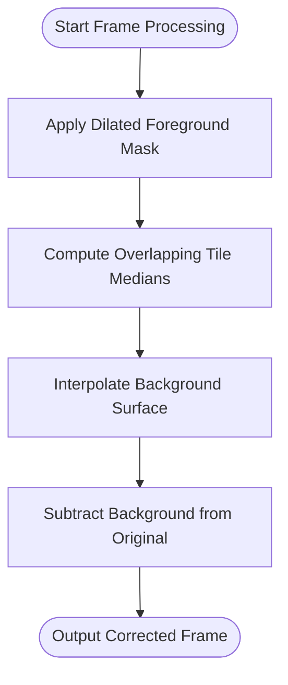

# Background Correction Service

<cite>
**Referenced Files in This Document**   
- [correction.py](file://pyama-core/src/pyama_core/processing/workflow/services/steps/correction.py)
- [tile_interp.py](file://pyama-core/src/pyama_core/processing/background/tile_interp.py)
</cite>

## Table of Contents
1. [Introduction](#introduction)
2. [Service Interface](#service-interface)
3. [Correction Methodology](#correction-methodology)
4. [Configuration Options](#configuration-options)
5. [Tile-Based Interpolation Algorithm](#tile-based-interpolation-algorithm)
6. [Data Flow and Processing Pipeline](#data-flow-and-processing-pipeline)
7. [Edge Case Handling](#edge-case-handling)
8. [Performance Considerations](#performance-considerations)
9. [Output Storage and Referencing](#output-storage-and-referencing)
10. [Parameter Tuning Examples](#parameter-tuning-examples)

## Introduction
The Background Correction Service provides a robust solution for removing illumination artifacts from microscopy images using a tile-based interpolation algorithm. This service specifically targets fluorescence channels by estimating and subtracting background illumination patterns while preserving biological signal integrity. The correction process leverages segmentation masks to distinguish foreground cellular structures from background regions, enabling accurate background estimation and removal.

**Section sources**
- [correction.py](file://pyama-core/src/pyama_core/processing/workflow/services/steps/correction.py#L1-L20)

## Service Interface
The CorrectionService class implements the background correction functionality as part of the image processing pipeline. It processes fluorescence channels for each field of view (FOV) by applying background correction to raw fluorescence data using corresponding segmentation masks. The service integrates with the processing workflow through standardized interfaces and handles multiple fluorescence channels independently.

The service interface follows a consistent pattern for processing microscopy data, accepting metadata, processing context, output directory, and FOV identifier as parameters. It manages input validation, file I/O operations, and progress reporting through callback mechanisms. The service is designed to be stateless and idempotent, allowing safe re-execution when partial results already exist.

**Diagram sources**
- [correction.py](file://pyama-core/src/pyama_core/processing/workflow/services/steps/correction.py#L25-L35)

## Correction Methodology
The background correction methodology employs a multi-step approach to estimate and remove illumination artifacts from fluorescence microscopy images. For each frame in the image stack, the algorithm first applies a dilated segmentation mask to identify foreground pixels, which are then excluded from background estimation. The remaining background pixels are used to compute local statistics through a tiled grid approach.

The correction process specifically addresses both phase contrast and fluorescence channels, though the primary correction is applied to fluorescence data. Phase contrast channels are used to generate segmentation masks that inform the background estimation process for fluorescence channels. This cross-channel dependency ensures that background correction is biologically informed, preserving signal from actual cellular structures while removing illumination artifacts.

The algorithm operates on 3D image stacks (time, height, width) and processes each time point independently, maintaining temporal consistency while allowing for frame-by-frame adaptation to changing illumination conditions. The correction preserves the original image dimensions and data type, outputting float32 arrays that represent the background-corrected intensity values.

**Section sources**
- [correction.py](file://pyama-core/src/pyama_core/processing/workflow/services/steps/correction.py#L79-L113)
- [tile_interp.py](file://pyama-core/src/pyama_core/processing/background/tile_interp.py#L151-L187)

## Configuration Options
The background correction algorithm exposes several configuration parameters that control its behavior and performance characteristics. The primary configuration options include tile_size and polynomial_order, which determine the spatial resolution and smoothness of the estimated background illumination pattern.

The tile_size parameter specifies the dimensions of the overlapping tiles used to compute local background estimates. This parameter accepts a tuple of integers representing (height, width) in pixels. Larger tile sizes result in smoother background estimates but may fail to capture fine-scale illumination variations, while smaller tiles can capture more detail but may inadvertently remove biological signal or introduce noise.

Although the current implementation uses spline interpolation rather than polynomial fitting, the conceptual equivalent of polynomial_order is determined by the interpolation method's inherent smoothness properties. The RectBivariateSpline used in the implementation provides smooth interpolation that effectively functions as a high-order polynomial fit across the tile grid.

These configuration options can be tuned based on microscope configuration, sample characteristics, and desired processing speed. The default tile size of (256, 256) pixels provides a balanced starting point for most applications, but optimal values may vary depending on the specific imaging setup and biological context.

**Section sources**
- [tile_interp.py](file://pyama-core/src/pyama_core/processing/background/tile_interp.py#L77-L113)

## Tile-Based Interpolation Algorithm
The tile-based interpolation algorithm implements a sophisticated approach to background estimation and removal through a series of coordinated processing steps. The core algorithm operates on a per-frame basis, processing each time point in the fluorescence image stack independently.

The algorithm begins by masking foreground pixels using a dilated segmentation mask, which expands cell boundaries to ensure complete coverage of biological structures. This dilation, controlled by a size parameter defaulting to 10 pixels, prevents foreground signal from contaminating background estimates. Pixels identified as foreground are set to NaN, effectively excluding them from subsequent background calculations.

Next, the algorithm divides the masked image into overlapping tiles that cover the entire field of view. The tiles overlap by approximately 50% in each dimension, ensuring smooth transitions between adjacent regions and preventing edge artifacts. For each tile, the algorithm computes the median intensity of the non-NaN (background) pixels, creating a grid of local background estimates.

When insufficient background pixels are available in a tile (resulting in NaN median values), the algorithm uses the global median of all background pixels as a fallback value. This ensures robustness even in cases where cellular confluence is high or segmentation is imperfect.

The final step involves interpolating the discrete tile medians into a continuous background surface using bivariate spline interpolation. The RectBivariateSpline function creates a smooth background model that captures illumination gradients across the entire image. This estimated background is then subtracted from the original image to produce the corrected output.

**Diagram sources**
- [tile_interp.py](file://pyama-core/src/pyama_core/processing/background/tile_interp.py#L0-L193)

## Data Flow and Processing Pipeline
The background correction service integrates into a larger processing pipeline that handles microscopy data from acquisition to analysis. The data flow begins with raw fluorescence images and corresponding segmentation masks, which are processed together to produce background-corrected fluorescence data.

The processing pipeline follows a sequential workflow where segmentation precedes background correction. The segmentation service generates binary masks that identify cellular regions in phase contrast images, and these masks are then used by the correction service to distinguish foreground from background in fluorescence channels. This dependency ensures that background estimation is informed by biological context rather than treating all pixels equally.

For each field of view, the correction service loads the raw fluorescence data as a memory-mapped array to minimize memory usage for large image stacks. Similarly, the segmentation data is loaded as a memory-mapped array, allowing efficient access to large datasets without loading them entirely into RAM. The corrected output is written to a new memory-mapped array, enabling incremental writing and reducing memory footprint.

The service processes each fluorescence channel independently, allowing different channels to have distinct correction parameters if needed. The output path for corrected data follows a consistent naming convention that includes the field of view, channel identifier, and processing step, facilitating traceability and organization of results.

**Diagram sources**
- [correction.py](file://pyama-core/src/pyama_core/processing/workflow/services/steps/correction.py#L46-L146)

## Edge Case Handling
The background correction algorithm includes robust handling of various edge cases that commonly occur in microscopy data. These edge cases include uneven illumination patterns, damaged sensor regions, high cellular confluence, and missing or corrupted input data.

For uneven illumination, the tile-based approach with overlapping tiles and spline interpolation effectively models gradual intensity gradients across the field of view. The algorithm's reliance on median statistics within each tile provides resistance to outliers and ensures stable background estimation even under challenging illumination conditions.

In cases of damaged sensor regions or other artifacts that create anomalous pixel values, the algorithm's use of median statistics (rather than mean) provides robustness against extreme values. The masking step also helps by excluding regions with obvious artifacts when they overlap with cellular structures.

When cellular confluence is very high, leaving insufficient background pixels for reliable estimation, the algorithm employs a fallback strategy using the global median of all background pixels. This ensures that correction can still be applied even in densely populated fields, though the quality may be reduced compared to sparser samples.

The implementation includes comprehensive input validation to handle missing or malformed data. It checks array dimensions, verifies shape compatibility between fluorescence and segmentation data, and validates data types before processing. The service also implements idempotent behavior by checking for existing corrected outputs, allowing safe re-execution without duplicating work or overwriting results.

**Section sources**
- [tile_interp.py](file://pyama-core/src/pyama_core/processing/background/tile_interp.py#L151-L187)
- [correction.py](file://pyama-core/src/pyama_core/processing/workflow/services/steps/correction.py#L79-L113)

## Performance Considerations
The performance of the background correction service is influenced by several factors, including tile size, image resolution, and stack depth. Larger tile sizes reduce computational complexity by decreasing the number of tiles per image, but may compromise correction accuracy for fine-scale illumination variations.

Image resolution directly impacts processing time, as higher resolution images contain more pixels to process and require more tiles to cover the field of view. The algorithm's complexity scales approximately linearly with the number of pixels, making it suitable for high-resolution microscopy data. However, very large images may benefit from optimized tile size selection to balance accuracy and performance.

The depth of the image stack (number of time points) also affects processing time, as each frame is processed independently. The algorithm processes frames sequentially, but the memory-mapped I/O design allows efficient access to large stacks without excessive memory usage. For extremely long time-lapse experiments, processing time can be reduced by downsampling temporal resolution or processing subsets of frames.

Memory usage is optimized through the use of memory-mapped arrays for both input and output data. This approach allows processing of datasets larger than available RAM by leveraging disk storage with efficient caching. The peak memory usage is primarily determined by the size of a single frame plus the memory required for tile processing and interpolation.

The algorithm's performance can be further optimized by adjusting the foreground mask dilation size. Larger dilation sizes increase processing time due to the expanded mask area, while smaller sizes may risk including foreground signal in background estimation. The default size of 10 pixels provides a balanced trade-off for most applications.

**Section sources**
- [tile_interp.py](file://pyama-core/src/pyama_core/processing/background/tile_interp.py#L77-L113)
- [correction.py](file://pyama-core/src/pyama_core/processing/workflow/services/steps/correction.py#L110-L146)

## Output Storage and Referencing
Corrected images are stored in the file system using a consistent naming convention and directory structure that facilitates organization and traceability. Each corrected fluorescence channel is saved as a separate NumPy memory-mapped file (.npy) in the field of view-specific output directory.

The output file naming follows the pattern "{base_name}_fov_{fov:03d}_fl_corrected_ch_{ch}.npy", where base_name is derived from the original microscopy file, fov is the field of view index, and ch is the channel identifier. This naming convention ensures unique identifiers for each processed dataset and maintains clear relationships between original and processed data.

The processing context maintains references to all output files through the results_paths dictionary, which maps field of view indices to structured entries containing paths for different data types. For corrected fluorescence data, the fl_corrected list stores tuples of (channel_index, file_path), enabling subsequent processing steps to locate and load the corrected images.

This referencing system allows downstream analysis steps to access corrected data without needing to reconstruct file paths or maintain separate tracking mechanisms. The memory-mapped format enables efficient loading of large datasets, as only required portions of the data are read into memory during analysis.

The service implements idempotent behavior by checking for existing output files before processing. If a corrected file already exists, it is recorded in the results_paths and the processing for that channel is skipped. This prevents redundant computation and allows safe resumption of interrupted processing workflows.

**Section sources**
- [correction.py](file://pyama-core/src/pyama_core/processing/workflow/services/steps/correction.py#L79-L113)
- [correction.py](file://pyama-core/src/pyama_core/processing/workflow/services/steps/correction.py#L110-L146)

## Parameter Tuning Examples
Effective parameter tuning for the background correction service depends on the specific microscope configuration, sample characteristics, and imaging conditions. The primary tunable parameter is tile_size, which should be adjusted based on the spatial scale of illumination artifacts and the biological content of the sample.

For widefield microscopes with relatively uniform illumination, larger tile sizes (e.g., 512x512 pixels) may be appropriate, as illumination gradients tend to vary slowly across the field of view. This setting improves processing speed while still capturing major illumination patterns. Conversely, for confocal or multiphoton systems with more complex illumination profiles, smaller tile sizes (e.g., 128x128 pixels) may be necessary to accurately model rapid intensity changes.

High-magnification imaging with small fields of view may require proportionally smaller tile sizes to maintain sufficient sampling of the illumination field. For example, at 60x magnification with a 200x200 pixel field of view, a tile size of 64x64 pixels might be optimal. In contrast, low-magnification screening applications with large fields of view (e.g., 1000x1000 pixels) could use larger tiles of 256x256 pixels or more.

Samples with very high cellular confluence may benefit from slightly larger tile sizes to ensure sufficient background pixels are available for median calculation in each tile. Conversely, sparse samples with abundant background regions can use smaller tiles to capture finer illumination details.

The foreground mask dilation size (default 10 pixels) should be tuned based on the typical cell size and segmentation accuracy. For small cells or precise segmentation masks, a smaller dilation (5-7 pixels) may suffice. For larger cells or less precise segmentation, increasing the dilation to 15-20 pixels ensures complete coverage of cellular structures.

**Section sources**
- [tile_interp.py](file://pyama-core/src/pyama_core/processing/background/tile_interp.py#L41-L80)
- [tile_interp.py](file://pyama-core/src/pyama_core/processing/background/tile_interp.py#L77-L113)