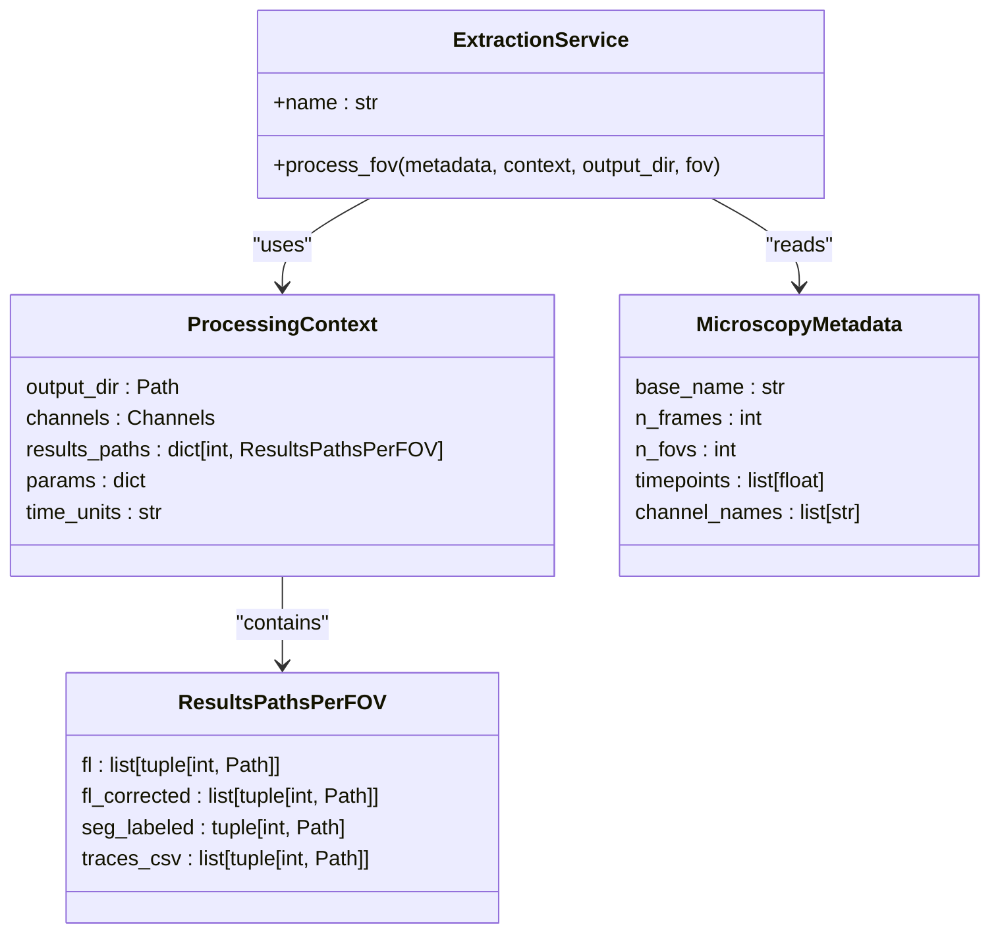
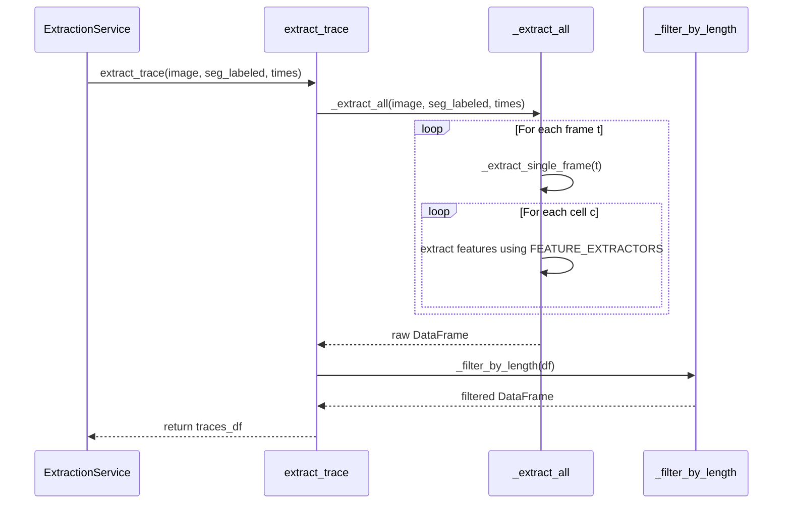
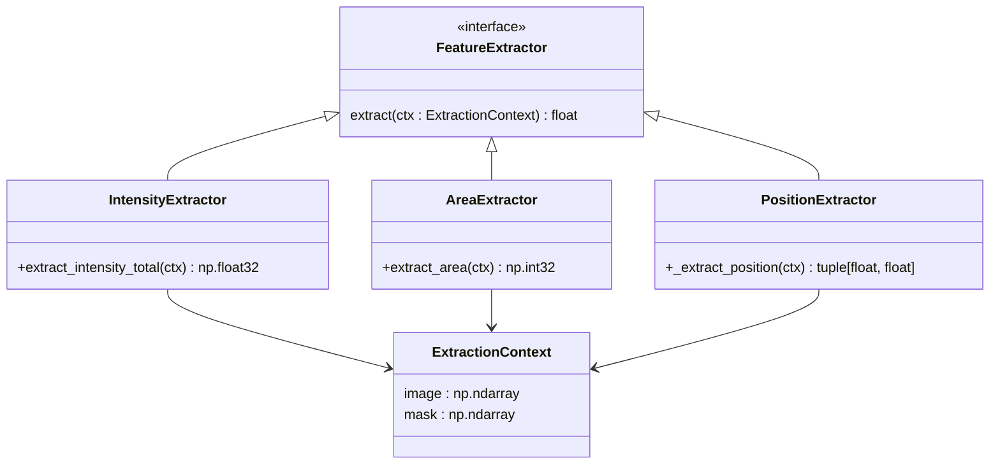
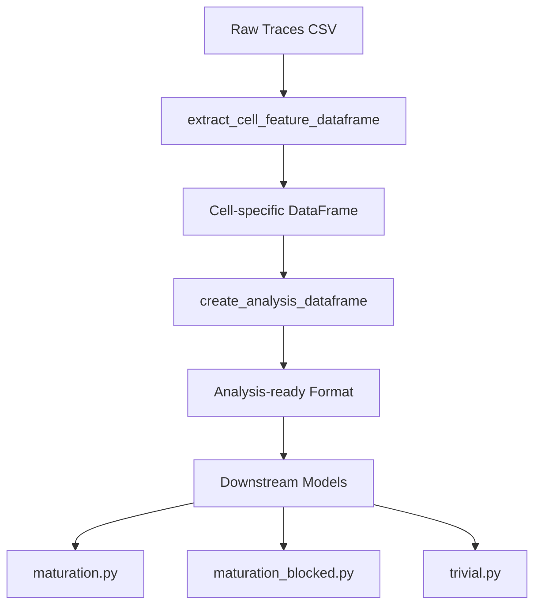

# Feature Extraction Service

<cite>
**Referenced Files in This Document**   
- [extraction.py](file://pyama-core/src/pyama_core/processing/workflow/services/steps/extraction.py)
- [trace.py](file://pyama-core/src/pyama_core/processing/extraction/trace.py)
- [feature.py](file://pyama-core/src/pyama_core/processing/extraction/feature.py)
- [types.py](file://pyama-core/src/pyama_core/processing/workflow/services/types.py)
- [microscopy.py](file://pyama-core/src/pyama_core/io/microscopy.py)
- [analysis_csv.py](file://pyama-core/src/pyama_core/io/analysis_csv.py)
</cite>

## Table of Contents
1. [Introduction](#introduction)
2. [ExtractionService Interface and Configuration](#extractionservice-interface-and-configuration)
3. [Two-Phase Extraction Process](#two-phase-extraction-process)
4. [Region Property Computation](#region-property-computation)
5. [Fluorescence Signal Extraction Over Time](#fluorescence-signal-extraction-over-time)
6. [Output Formats and Data Organization](#output-formats-and-data-organization)
7. [Customization and Configuration Examples](#customization-and-configuration-examples)
8. [Memory Management and Performance Optimization](#memory-management-and-performance-optimization)
9. [Integration with Downstream Analysis Models](#integration-with-downstream-analysis-models)
10. [Conclusion](#conclusion)

## Introduction

The Feature Extraction Service in PyAMA is responsible for transforming segmented microscopy data into quantifiable biological signals. It operates on time-series image stacks and labeled segmentation masks to extract both spatial features (area, intensity, shape) and temporal fluorescence traces per cell. This service serves as a critical bridge between image processing and biological analysis, enabling downstream modeling of cellular dynamics such as maturation and response patterns.

The core functionality is implemented in the `ExtractionService` class, which orchestrates the extraction pipeline across multiple fields of view (FOVs). It leverages memory-mapped arrays for efficient I/O and supports flexible configuration through context objects and metadata.

**Section sources**
- [extraction.py](file://pyama-core/src/pyama_core/processing/workflow/services/steps/extraction.py#L1-L133)
- [microscopy.py](file://pyama-core/src/pyama_core/io/microscopy.py#L11-L24)

## ExtractionService Interface and Configuration

The `ExtractionService` class implements the `BaseProcessingService` interface and provides a standardized `process_fov` method for per-FOV processing. It requires three primary inputs: microscopy metadata, a processing context, and an output directory.

The service uses a `ProcessingContext` object to manage state and configuration, including channel selection, result paths, and parameters. The `ResultsPathsPerFOV` dataclass tracks input and output file locations for each FOV, supporting both raw and corrected fluorescence channels.

Time information is extracted from `MicroscopyMetadata`, with fallback to frame indices when acquisition timestamps are unavailable. The service automatically handles unit conversion from microseconds to minutes for temporal consistency.



**Diagram sources**
- [extraction.py](file://pyama-core/src/pyama_core/processing/workflow/services/steps/extraction.py#L25-L133)
- [types.py](file://pyama-core/src/pyama_core/processing/workflow/services/types.py#L15-L30)
- [microscopy.py](file://pyama-core/src/pyama_core/io/microscopy.py#L11-L24)

**Section sources**
- [extraction.py](file://pyama-core/src/pyama_core/processing/workflow/services/steps/extraction.py#L25-L133)
- [types.py](file://pyama-core/src/pyama_core/processing/workflow/services/types.py#L15-L30)

## Two-Phase Extraction Process

The extraction process follows a two-phase approach: first computing per-cell features in each frame, then filtering and organizing temporal traces. This design ensures memory efficiency and computational scalability.

In the first phase, `_extract_single_frame` processes each time point independently, extracting all configured features for every detected cell. This frame-by-frame processing minimizes memory footprint by avoiding storage of intermediate full data cubes.

The second phase applies quality filtering, primarily through `_filter_by_length`, which removes traces shorter than a configurable threshold (default: 30 frames). This ensures downstream analysis receives only biologically relevant, persistent cells.



**Diagram sources**
- [trace.py](file://pyama-core/src/pyama_core/processing/extraction/trace.py#L188-L235)
- [trace.py](file://pyama-core/src/pyama_core/processing/extraction/trace.py#L140-L186)

**Section sources**
- [trace.py](file://pyama-core/src/pyama_core/processing/extraction/trace.py#L188-L235)

## Region Property Computation

Region properties are computed through a modular feature extraction system defined in `feature.py`. Each feature is implemented as a standalone function that operates on an `ExtractionContext` containing the current image frame and cell mask.

The system currently supports:
- **intensity_total**: Sum of pixel values within the cell mask
- **area**: Number of pixels in the segmented region

Each extractor returns a strongly typed value (e.g., `np.float32` for intensity, `np.int32` for area). Position coordinates are computed using bounding box centroids for performance, returning `(x, y)` as floating-point values.

The extensible `FEATURE_EXTRACTORS` dictionary allows registration of additional features without modifying core extraction logic. New extractors must conform to the signature `Callable[[ExtractionContext], float]`.



**Diagram sources**
- [feature.py](file://pyama-core/src/pyama_core/processing/extraction/feature.py#L9-L59)
- [trace.py](file://pyama-core/src/pyama_core/processing/extraction/trace.py#L60-L80)

**Section sources**
- [feature.py](file://pyama-core/src/pyama_core/processing/extraction/feature.py#L9-L59)

## Fluorescence Signal Extraction Over Time

Fluorescence signal extraction is orchestrated by the `extract_trace` function, which takes a 3D fluorescence stack, a 3D labeled segmentation stack, and a 1D time array. The function validates input dimensions and types before proceeding with extraction.

For each time point, the system identifies all labeled cells and computes their features using registered extractors. The results are accumulated into a flat DataFrame with one row per (cell, time) observation, containing cell ID, frame index, time, quality flag, position coordinates, and all extracted feature values.

Progress callbacks are supported through the `progress_callback` parameter, enabling integration with user interfaces during long-running extractions. The callback receives frame number, total frames, and status messages.

The final output is filtered to remove short traces, ensuring only cells that persist for a minimum duration (configurable via `min_length`) are included in the results.

**Section sources**
- [trace.py](file://pyama-core/src/pyama_core/processing/extraction/trace.py#L188-L235)

## Output Formats and Data Organization

Extracted data is organized hierarchically by FOV, with each FOV having its own subdirectory (`fov_XXX`). Within each FOV directory, trace data is stored in CSV format with filenames following the pattern `{basename}_fov_XXX_traces_ch_YY.csv`.

The CSV output includes a prepended `fov` column and maintains the flat structure returned by `extract_trace`, with columns for:
- `fov`: Field of view identifier
- `cell`: Cell identifier
- `frame`: Frame index
- `time`: Time in minutes
- `good`: Quality flag
- `position_x`, `position_y`: Centroid coordinates
- Feature columns (e.g., `intensity_total`, `area`)

Alternative NPY format support is available through the underlying memory-mapped array system, though CSV is the primary output format for trace data. Segmentation masks are stored in NPY format using memory mapping for efficient access.

**Section sources**
- [extraction.py](file://pyama-core/src/pyama_core/processing/workflow/services/steps/extraction.py#L100-L120)

## Customization and Configuration Examples

Users can customize feature extraction by modifying the `FEATURE_EXTRACTORS` registry or configuring processing parameters through the `ProcessingContext.params` dictionary. Channel selection is controlled via the `channels` field in the processing context.

To extract traces from specific channels only, configure the context:
```python
context.channels.fl = [0, 2]  # Only process channels 0 and 2
```

To prioritize corrected fluorescence data, ensure `fl_corrected` paths are populated in `ResultsPathsPerFOV`. The service automatically prefers corrected data over raw when both are available.

Custom features can be added:
```python
def extract_circularity(ctx: ExtractionContext) -> float:
    # Implementation here
    pass

FEATURE_EXTRACTORS["circularity"] = extract_circularity
```

Trace filtering threshold can be modified by patching `_filter_by_length` or creating a custom extraction function with different parameters.

**Section sources**
- [extraction.py](file://pyama-core/src/pyama_core/processing/workflow/services/steps/extraction.py#L50-L80)
- [feature.py](file://pyama-core/src/pyama_core/processing/extraction/feature.py#L50-L59)

## Memory Management and Performance Optimization

The extraction system employs several strategies for handling large time-series datasets:

1. **Memory-mapped arrays**: Input image and segmentation data are accessed via `open_memmap`, allowing processing of datasets larger than available RAM.
2. **Frame-by-frame processing**: Features are extracted one frame at a time, minimizing memory usage.
3. **Chunked I/O**: Data is read in chunks corresponding to individual frames rather than loading entire time stacks.
4. **Efficient data typing**: Arrays are converted to minimal required types (float32, uint16) to reduce memory footprint.

The service automatically detects and skips already-processed channels by checking for existing output files, enabling resumption of interrupted workflows without redundant computation.

For optimal performance, users should ensure sufficient disk I/O bandwidth and consider processing FOVs in parallel when system resources permit.

**Section sources**
- [extraction.py](file://pyama-core/src/pyama_core/processing/workflow/services/steps/extraction.py#L40-L45)
- [trace.py](file://pyama-core/src/pyama_core/processing/extraction/trace.py#L188-L235)

## Integration with Downstream Analysis Models

Extracted trace data is formatted for direct consumption by downstream analysis models in the PyAMA ecosystem. The flat CSV structure with consistent column naming enables seamless integration with fitting and maturation models.

The `analysis_csv.py` module provides utilities for converting extracted traces into analysis-ready DataFrames with time as index and cell IDs as columns. This format is expected by models in `pyama_core.analysis.models`.

Preprocessing requirements include:
- Time units in hours (automatically converted from minutes)
- Removal of short or low-quality traces
- Consistent cell ID numbering across FOVs
- Proper handling of missing values (NaN)

The `create_analysis_dataframe` function can restructure extracted data to meet these requirements, while `get_analysis_stats` provides quality metrics for preprocessing validation.



**Diagram sources**
- [analysis_csv.py](file://pyama-core/src/pyama_core/io/analysis_csv.py#L63-L94)
- [analysis_csv.py](file://pyama-core/src/pyama_core/io/analysis_csv.py#L130-L164)

**Section sources**
- [analysis_csv.py](file://pyama-core/src/pyama_core/io/analysis_csv.py#L63-L94)

## Conclusion

The Feature Extraction Service provides a robust, scalable solution for transforming microscopy image data into quantitative biological signals. Its modular design separates feature computation from trace organization, enabling extensibility while maintaining performance. The service's integration with PyAMA's broader workflow system ensures consistent data handling from raw images to biological interpretation, supporting both interactive analysis and automated processing pipelines.