```mermaid
sequenceDiagram
participant Context as ProcessingContext
participant Service as TrackingService
participant IO as I/O System
Service->>Context : Retrieve segmentation path
Context-->>Service : Segmentation path
Service->>IO : Load segmentation data
IO-->>Service : NPY data (mmap)
Service->>Service : Perform cell tracking
Service->>IO : Save labeled segmentation
Service->>Context : Update results_paths.seg_labeled
```

# Processing API

<cite>
**Referenced Files in This Document**   
- [pipeline.py](file://pyama-core/src/pyama_core/processing/workflow/pipeline.py)
- [base.py](file://pyama-core/src/pyama_core/processing/workflow/services/base.py)
- [types.py](file://pyama-core/src/pyama_core/processing/workflow/services/types.py)
- [segmentation.py](file://pyama-core/src/pyama_core/processing/workflow/services/steps/segmentation.py)
- [tracking.py](file://pyama-core/src/pyama_core/processing/workflow/services/steps/tracking.py)
- [extraction.py](file://pyama-core/src/pyama_core/processing/workflow/services/steps/extraction.py)
- [correction.py](file://pyama-core/src/pyama_core/processing/workflow/services/steps/correction.py)
- [copying.py](file://pyama-core/src/pyama_core/processing/workflow/services/copying.py)
</cite>

## Table of Contents
1. [Pipeline Overview](#pipeline-overview)
2. [Core Data Models](#core-data-models)
3. [Processing Services](#processing-services)
4. [Workflow Execution](#workflow-execution)
5. [Service Base Class](#service-base-class)
6. [Usage Examples](#usage-examples)
7. [Performance and Resource Management](#performance-and-resource-management)

## Pipeline Overview

The processing module in pyama-core provides a comprehensive workflow for microscopy image analysis, orchestrating multiple processing steps through a series of specialized services. The core functionality is centered around the `run_complete_workflow` function which coordinates the execution of various processing services in a defined sequence.

The workflow follows a specific execution order:
1. **CopyingService**: Extracts raw image data from microscopy files
2. **SegmentationService**: Performs cell segmentation on phase contrast images
3. **CorrectionService**: Applies background correction to fluorescence channels
4. **TrackingService**: Tracks cells across time points
5. **ExtractionService**: Extracts features and generates traces

This sequential processing ensures that each step has the necessary inputs from previous steps, creating a robust pipeline for microscopy analysis.


**Diagram sources**
- [pipeline.py](file://pyama-core/src/pyama_core/processing/workflow/pipeline.py#L279-L478)
- [copying.py](file://pyama-core/src/pyama_core/processing/workflow/services/copying.py#L23-L98)

**Section sources**
- [pipeline.py](file://pyama-core/src/pyama_core/processing/workflow/pipeline.py#L279-L478)
- [CLAUDE.md](file://CLAUDE.md#L56-L64)

## Core Data Models

The processing workflow relies on several key data models that maintain state and configuration throughout the pipeline execution. These models are defined in the `types.py` module and are used to pass information between different processing steps.

### ProcessingContext

The `ProcessingContext` class serves as the central data container that persists throughout the entire workflow. It holds configuration parameters, file paths, and processing results.


**Diagram sources**
- [types.py](file://pyama-core/src/pyama_core/processing/workflow/services/types.py#L25-L30)

### ResultsPathsPerFOV

The `ResultsPathsPerFOV` class stores file paths for processing results specific to each field of view (FOV). It maintains references to various output files generated during the workflow.


**Diagram sources**
- [types.py](file://pyama-core/src/pyama_core/processing/workflow/services/types.py#L15-L21)

### Channels

The `Channels` class defines the channel configuration for microscopy data, specifying which phase contrast and fluorescence channels should be processed.


**Diagram sources**
- [types.py](file://pyama-core/src/pyama_core/processing/workflow/services/types.py#L9-L11)

**Section sources**
- [types.py](file://pyama-core/src/pyama_core/processing/workflow/services/types.py#L9-L30)

## Processing Services

The processing module implements five core services that perform specific analysis tasks. Each service inherits from the `BaseProcessingService` class and implements the `process_fov` method to handle processing for individual fields of view.

### SegmentationService

The `SegmentationService` performs cell segmentation on phase contrast images using the LOG-STD (Laplacian of Gaussian - Standard Deviation) approach. It processes each FOV to identify cell boundaries and generate binary segmentation masks.

**Configuration Options:**
- Inherits configuration from `ProcessingContext`
- Uses phase contrast channel specified in `Channels.pc`

**Input/Output Contracts:**
- **Input**: Phase contrast image data (NPY format)
- **Output**: Binary segmentation mask (NPY format) stored in `results_paths.seg`

**Error Conditions:**
- FileNotFoundError: Phase contrast file not found
- ValueError: Unexpected dimensions in phase contrast data
- InterruptedError: Processing interrupted by user


**Diagram sources**
- [segmentation.py](file://pyama-core/src/pyama_core/processing/workflow/services/steps/segmentation.py#L25-L124)

### TrackingService

The `TrackingService` performs cell tracking across time points using the segmented cell masks. It assigns unique identifiers to cells and tracks their movement and lineage throughout the time series.

**Configuration Options:**
- Inherits configuration from `ProcessingContext`
- Uses segmentation data from `results_paths.seg`

**Input/Output Contracts:**
- **Input**: Segmentation mask (NPY format)
- **Output**: Labeled segmentation with cell IDs (NPY format) stored in `results_paths.seg_labeled`

**Error Conditions:**
- FileNotFoundError: Segmentation data not found
- InterruptedError: Processing interrupted by user



**Diagram sources**
- [tracking.py](file://pyama-core/src/pyama_core/processing/workflow/services/steps/tracking.py#L25-L125)

### ExtractionService

The `ExtractionService` performs feature extraction and trace generation from fluorescence channels. It calculates intensity values for each cell over time and outputs trace data in CSV format.

**Configuration Options:**
- Inherits configuration from `ProcessingContext`
- Uses fluorescence channels specified in `Channels.fl`
- Prefers corrected fluorescence data (`fl_corrected`) when available

**Input/Output Contracts:**
- **Input**: Fluorescence image data and labeled segmentation
- **Output**: Trace data (CSV format) stored in `results_paths.traces_csv`

**Error Conditions:**
- FileNotFoundError: Tracked segmentation or fluorescence data not found
- InterruptedError: Feature extraction interrupted


**Diagram sources**
- [extraction.py](file://pyama-core/src/pyama_core/processing/workflow/services/steps/extraction.py#L25-L132)

### CorrectionService

The `CorrectionService` applies temporal background correction to fluorescence channels. It removes background noise and improves signal quality by correcting for temporal variations in background intensity.

**Configuration Options:**
- Inherits configuration from `ProcessingContext`
- Uses fluorescence channels specified in `Channels.fl`
- Requires segmentation data for background estimation

**Input/Output Contracts:**
- **Input**: Raw fluorescence image data and segmentation mask
- **Output**: Corrected fluorescence data (NPY format) stored in `results_paths.fl_corrected`

**Error Conditions:**
- FileNotFoundError: Segmentation data not found
- ValueError: Dimension mismatch between fluorescence and segmentation data
- InterruptedError: Correction process interrupted


**Diagram sources**
- [correction.py](file://pyama-core/src/pyama_core/processing/workflow/services/steps/correction.py#L25-L146)

### CopyingService

The `CopyingService` handles the initial data extraction from microscopy files (ND2 format) and converts them to NPY format for efficient processing. It serves as the entry point for the workflow by preparing the raw data.

**Configuration Options:**
- Inherits channel configuration from `ProcessingContext.channels`
- Respects batch size and worker count parameters

**Input/Output Contracts:**
- **Input**: Microscopy file (ND2 format)
- **Output**: Phase contrast and fluorescence channels (NPY format) stored in appropriate paths

**Error Conditions:**
- ValueError: Invalid FOV range specified
- Exception during file copying


**Diagram sources**
- [copying.py](file://pyama-core/src/pyama_core/processing/workflow/services/copying.py#L23-L98)

**Section sources**
- [segmentation.py](file://pyama-core/src/pyama_core/processing/workflow/services/steps/segmentation.py#L25-L124)
- [tracking.py](file://pyama-core/src/pyama_core/processing/workflow/services/steps/tracking.py#L25-L125)
- [extraction.py](file://pyama-core/src/pyama_core/processing/workflow/services/steps/extraction.py#L25-L132)
- [correction.py](file://pyama-core/src/pyama_core/processing/workflow/services/steps/correction.py#L25-L146)
- [copying.py](file://pyama-core/src/pyama_core/processing/workflow/services/copying.py#L23-L98)

## Workflow Execution

The `run_complete_workflow` function orchestrates the entire processing pipeline, managing the execution of all processing services in the correct order and handling parallelization across multiple workers.

### run_complete_workflow Function

```python
def run_complete_workflow(
    metadata: MicroscopyMetadata,
    context: ProcessingContext,
    fov_start: int | None = None,
    fov_end: int | None = None,
    batch_size: int = 2,
    n_workers: int = 2,
) -> bool:
```

**Parameters:**
- `metadata`: MicroscopyMetadata object containing file information and acquisition parameters
- `context`: ProcessingContext object with configuration and state
- `fov_start`: Starting FOV index (inclusive, 0-based), None processes from beginning
- `fov_end`: Ending FOV index (inclusive, 0-based), None processes to end
- `batch_size`: Number of FOVs to process in each batch
- `n_workers`: Number of parallel worker processes

**Return Type:** `bool` - True if all FOVs processed successfully, False otherwise

**Execution Flow:**
1. Validate input parameters and create output directory
2. Determine FOV range to process (handles None/-1 as "all FOVs")
3. Split FOVs into batches based on batch_size
4. For each batch:
   a. Execute CopyingService to extract raw data
   b. Process batch in parallel using ProcessPoolExecutor
   c. Monitor progress through a shared queue
   d. Merge results from workers into parent context
5. Persist final results to processing_results.yaml
6. Return overall success status

The function implements robust error handling, with try-except blocks around critical sections and proper resource cleanup (manager shutdown, thread joining). It also handles incremental processing by reading existing results from processing_results.yaml and merging new results with existing ones.


**Diagram sources**
- [pipeline.py](file://pyama-core/src/pyama_core/processing/workflow/pipeline.py#L279-L478)

**Section sources**
- [pipeline.py](file://pyama-core/src/pyama_core/processing/workflow/pipeline.py#L279-L478)

## Service Base Class

All processing services inherit from the `BaseProcessingService` class, which provides common functionality and defines the interface for processing steps.

### BaseProcessingService

```python
class BaseProcessingService:
    def __init__(self) -> None:
        self.name = "Processing"
        self._progress_reporter = None

    def set_progress_reporter(self, reporter):
        """Inject a reporter callable that accepts a single event dict."""
        pass

    def progress_callback(self, f: int, t: int, T: int, message: str):
        """Report progress events to parent process."""
        pass

    def process_fov(self, metadata: MicroscopyMetadata, context: ProcessingContext, output_dir: Path, fov: int) -> None:
        raise NotImplementedError

    def process_all_fovs(self, metadata: MicroscopyMetadata, context: ProcessingContext, output_dir: Path, fov_start: int | None = None, fov_end: int | None = None) -> None:
        """Process multiple FOVs sequentially."""
        pass
```

**Key Features:**
- **Progress Reporting**: Services can report progress through the `progress_callback` method, which triggers the injected reporter callable
- **Uniform Interface**: All services implement the same `process_fov` interface
- **Batch Processing**: The base class provides `process_all_fovs` for sequential processing of multiple FOVs
- **Error Handling**: Standardized exception handling and validation

**Extension Points:**
Custom processing steps can be implemented by inheriting from `BaseProcessingService` and implementing the `process_fov` method. The service will automatically integrate with the workflow pipeline and benefit from the base class functionality.


**Diagram sources**
- [base.py](file://pyama-core/src/pyama_core/processing/workflow/services/base.py#L15-L83)

**Section sources**
- [base.py](file://pyama-core/src/pyama_core/processing/workflow/services/base.py#L15-L83)

## Usage Examples

### Basic Workflow Execution

```python
from pyama_core.io import MicroscopyMetadata
from pyama_core.processing.workflow.pipeline import run_complete_workflow
from pyama_core.processing.workflow.services.types import ProcessingContext, Channels
from pathlib import Path

# Create metadata object
metadata = MicroscopyMetadata(
    file_path=Path("path/to/microscopy.nd2"),
    base_name="experiment1",
    n_fovs=10,
    n_frames=100,
    height=1024,
    width=1024
)

# Create processing context
context = ProcessingContext(
    output_dir=Path("output/experiment1"),
    channels=Channels(pc=0, fl=[1, 2]),
    params={"segmentation_threshold": 0.5}
)

# Run complete workflow
success = run_complete_workflow(
    metadata=metadata,
    context=context,
    fov_start=0,
    fov_end=4,
    batch_size=2,
    n_workers=4
)

if success:
    print("Workflow completed successfully")
else:
    print("Workflow failed")
```

### Custom Parameter Configuration

```python
# Configure specific parameters for different services
context = ProcessingContext(
    output_dir=Path("output/custom_config"),
    channels=Channels(pc=0, fl=[1]),
    params={
        "segmentation": {
            "method": "log_std",
            "threshold": 0.3,
            "min_size": 50
        },
        "tracking": {
            "max_distance": 20,
            "linking_threshold": 0.8
        },
        "correction": {
            "temporal_window": 5,
            "spatial_window": 15
        }
    }
)

# The parameters will be accessible to each service through the context
success = run_complete_workflow(metadata, context)
```

### Integration with External Systems

```python
import logging
from typing import Dict, Any

class ExternalProgressReporter:
    """Example of integrating with an external monitoring system."""
    
    def __init__(self, system_url: str):
        self.system_url = system_url
    
    def report_progress(self, event: Dict[str, Any]):
        """Send progress updates to external monitoring system."""
        import requests
        try:
            response = requests.post(
                f"{self.system_url}/progress",
                json=event,
                timeout=5
            )
            if response.status_code != 200:
                logging.warning(f"Failed to report progress: {response.status_code}")
        except Exception as e:
            logging.warning(f"Error reporting progress: {e}")

# Usage with the workflow
reporter = ExternalProgressReporter("https://monitoring.example.com")

# Note: In the current implementation, progress reporting is handled internally
# This would require extending the service classes to accept custom reporters
```

**Section sources**
- [pipeline.py](file://pyama-core/src/pyama_core/processing/workflow/pipeline.py#L279-L478)
- [types.py](file://pyama-core/src/pyama_core/processing/workflow/services/types.py#L9-L30)

## Performance and Resource Management

The processing workflow is designed with performance and resource efficiency in mind, particularly for handling large microscopy datasets.

### Thread Safety

The workflow uses multiprocessing (ProcessPoolExecutor) rather than multithreading for parallel execution, avoiding Python's Global Interpreter Lock (GIL) limitations. Each worker process operates independently, ensuring thread safety. Shared state is managed through the `ProcessingContext` which is merged after each worker completes.

### Resource Management

- **Memory Mapping**: All large image data is handled using numpy memmap, allowing efficient access to large files without loading them entirely into memory
- **Context Merging**: Worker contexts are merged into the parent context after completion, minimizing memory overhead
- **File Handles**: File handles are properly closed using context managers and explicit cleanup in finally blocks
- **Progress Queue**: Uses a manager-backed queue for inter-process communication, with proper shutdown procedures

### Performance Implications

**Configuration Options Impact:**

| Parameter | Performance Impact | Recommendation |
|---------|-------------------|---------------|
| `batch_size` | Larger batches reduce I/O overhead but increase memory usage | Start with 2-4, adjust based on available RAM |
| `n_workers` | More workers increase CPU utilization but add coordination overhead | Match to number of CPU cores |
| `fov_start`/`fov_end` | Processing subsets reduces total execution time | Use for testing and debugging |

**Optimization Tips:**
- Use SSD storage for input/output directories to improve I/O performance
- Ensure sufficient RAM for memmap operations (at least 2x the size of largest image)
- Monitor CPU utilization and adjust `n_workers` accordingly
- For very large datasets, consider processing in smaller batches to avoid memory pressure

**Section sources**
- [pipeline.py](file://pyama-core/src/pyama_core/processing/workflow/pipeline.py#L279-L478)
- [base.py](file://pyama-core/src/pyama_core/processing/workflow/services/base.py#L15-L83)