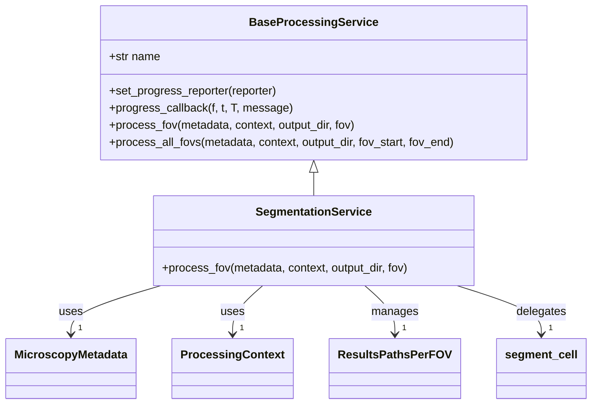
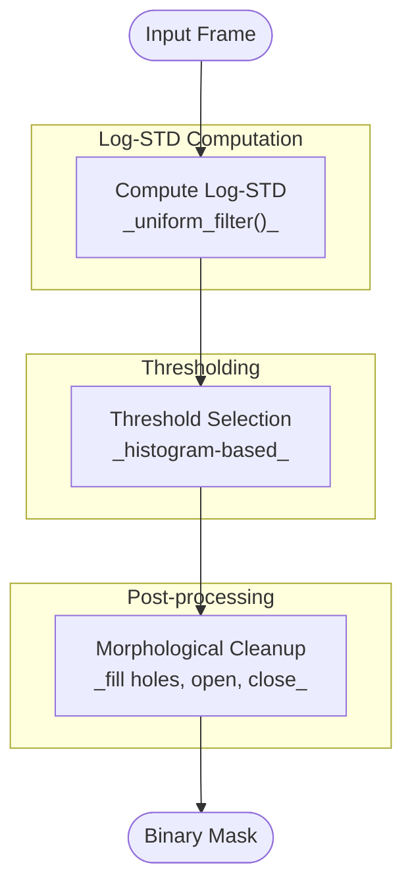
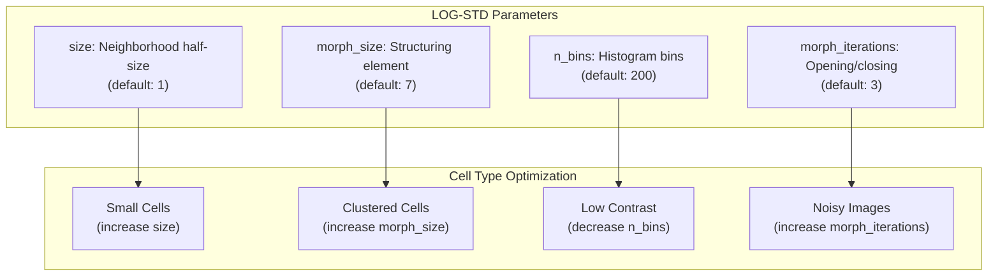
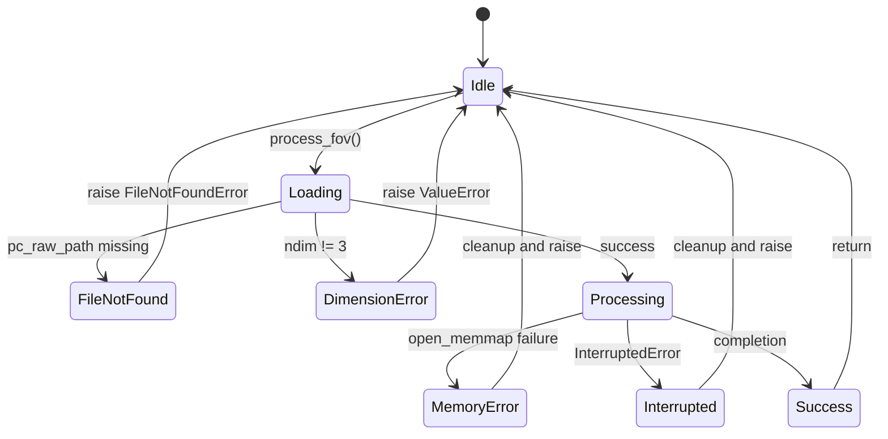
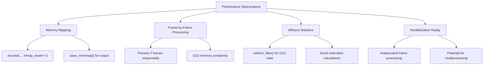

# Segmentation Service

<cite>
**Referenced Files in This Document**   
- [segmentation.py](file://pyama-core/src/pyama_core/processing/workflow/services/steps/segmentation.py)
- [log_std.py](file://pyama-core/src/pyama_core/processing/segmentation/log_std.py)
- [base.py](file://pyama-core/src/pyama_core/processing/workflow/services/base.py)
- [types.py](file://pyama-core/src/pyama_core/processing/workflow/services/types.py)
- [microscopy.py](file://pyama-core/src/pyama_core/io/microscopy.py)
</cite>

## Table of Contents
1. [Introduction](#introduction)
2. [Service Interface and Integration](#service-interface-and-integration)
3. [LOG-STD Algorithm Implementation](#log-std-algorithm-implementation)
4. [Input/Output Contracts](#inputoutput-contracts)
5. [Configuration and Parameter Tuning](#configuration-and-parameter-tuning)
6. [Error Conditions and Handling](#error-conditions-and-handling)
7. [Performance Optimization](#performance-optimization)
8. [Extension Points for Custom Algorithms](#extension-points-for-custom-algorithms)
9. [Conclusion](#conclusion)

## Introduction

The SegmentationService provides automated cell detection in phase contrast microscopy images using the LOG-STD (Laplacian of Gaussian with Standard Deviation filtering) algorithm. This service is a key component in the microscopy image analysis pipeline, transforming raw phase contrast data into binary segmentation masks that identify cellular regions. The implementation is optimized for performance and memory efficiency, processing large 3D image stacks frame-by-frame while maintaining low memory footprint.

**Section sources**
- [segmentation.py](file://pyama-core/src/pyama_core/processing/workflow/services/steps/segmentation.py#L1-L10)
- [log_std.py](file://pyama-core/src/pyama_core/processing/segmentation/log_std.py#L1-L20)

## Service Interface and Integration

The SegmentationService integrates into the processing pipeline as a concrete implementation of the BaseProcessingService interface. It operates on per-FOV (Field of View) basis, loading phase contrast data from preprocessed NumPy files and generating corresponding segmentation masks.



**Diagram sources**
- [segmentation.py](file://pyama-core/src/pyama_core/processing/workflow/services/steps/segmentation.py#L15-L124)
- [base.py](file://pyama-core/src/pyama_core/processing/workflow/services/base.py#L15-L83)

**Section sources**
- [segmentation.py](file://pyama-core/src/pyama_core/processing/workflow/services/steps/segmentation.py#L15-L124)
- [base.py](file://pyama-core/src/pyama_core/processing/workflow/services/base.py#L15-L83)

## LOG-STD Algorithm Implementation

The LOG-STD algorithm implements a robust thresholding approach for cell detection in phase contrast images. The method operates on a frame-by-frame basis for 3D image stacks, applying a three-stage pipeline to generate segmentation masks.



**Diagram sources**
- [log_std.py](file://pyama-core/src/pyama_core/processing/segmentation/log_std.py#L25-L131)

**Section sources**
- [log_std.py](file://pyama-core/src/pyama_core/processing/segmentation/log_std.py#L1-L131)

### Algorithm Stages

The LOG-STD algorithm consists of three sequential stages applied to each frame of the input image stack:

1. **Log-STD Computation**: Calculates the local log standard deviation using uniform filters to efficiently compute window statistics in O(1) time per pixel, independent of window size.
2. **Histogram-based Thresholding**: Determines an adaptive threshold by analyzing the histogram of log-STD values, setting the threshold to mode + 3σ where σ is the standard deviation of background values.
3. **Morphological Cleanup**: Applies binary morphological operations including hole filling, opening, and closing to remove noise and produce clean, contiguous cell regions.

The algorithm processes 3D inputs frame-by-frame to maintain low peak memory usage, making it suitable for large microscopy datasets.

## Input/Output Contracts

The SegmentationService follows strict input and output contracts to ensure reliable integration within the processing pipeline.

```mermaid
erDiagram
INPUT_DATA ||--o{ SEGMENTATION_SERVICE : "inputs"
SEGMENTATION_SERVICE }|--|| OUTPUT_MASK : "produces"
INPUT_DATA {
string file_path
string base_name
int n_fovs
int height
int width
int n_frames
}
SEGMENTATION_SERVICE {
int fov
Path output_dir
ProcessingContext context
}
OUTPUT_MASK {
Path seg_path
bool[3D] mask_data
tuple[int,Path] result_entry
}
```

**Diagram sources**
- [segmentation.py](file://pyama-core/src/pyama_core/processing/workflow/services/steps/segmentation.py#L25-L124)
- [types.py](file://pyama-core/src/pyama_core/processing/workflow/services/types.py#L9-L30)

**Section sources**
- [segmentation.py](file://pyama-core/src/pyama_core/processing/workflow/services/steps/segmentation.py#L25-L124)
- [types.py](file://pyama-core/src/pyama_core/processing/workflow/services/types.py#L9-L30)
- [microscopy.py](file://pyama-core/src/pyama_core/io/microscopy.py#L11-L24)

### Input Requirements

The service requires the following inputs to process a field of view:
- **MicroscopyMetadata**: Contains file path, dimensions, channel information, and timepoints
- **ProcessingContext**: Maintains state across processing steps, including results paths and parameters
- **Phase Contrast Data**: Preprocessed 3D NumPy array (T, H, W) containing phase contrast image frames
- **Output Directory**: Location for writing segmentation results

### Output Specifications

The service generates the following outputs:
- **Binary Segmentation Mask**: 3D boolean array (T, H, W) where True values indicate segmented cell regions
- **Results Path Registration**: Updates the ProcessingContext with the path to the generated segmentation file
- **Standardized Filenames**: Creates output files with consistent naming: `{basename}_fov_{xxx}_seg_ch_{y}.npy`

## Configuration and Parameter Tuning

While the LOG-STD algorithm uses adaptive thresholding that requires minimal parameter tuning, understanding the underlying parameters enables optimization for different cell types and imaging conditions.



**Diagram sources**
- [log_std.py](file://pyama-core/src/pyama_core/processing/segmentation/log_std.py#L25-L131)

**Section sources**
- [log_std.py](file://pyama-core/src/pyama_core/processing/segmentation/log_std.py#L25-L131)

### Parameter Guidance

Although the current implementation uses default parameters, the algorithm structure supports configuration through the following parameters:

- **size**: Controls the neighborhood half-size for log-STD computation. Larger values (3-5) may improve detection of larger cells but reduce sensitivity to small features.
- **n_bins**: Number of histogram bins for threshold calculation. Reducing bins (100-150) can improve performance with minimal accuracy impact.
- **morph_size**: Size of the structuring element for morphological operations. Adjust based on typical cell size in the image.
- **morph_iterations**: Number of opening and closing iterations to control aggressiveness of noise removal.

These parameters could be exposed through the ProcessingContext.params dictionary for per-experiment tuning.

## Error Conditions and Handling

The SegmentationService implements comprehensive error handling to ensure robust operation in production environments.



**Diagram sources**
- [segmentation.py](file://pyama-core/src/pyama_core/processing/workflow/services/steps/segmentation.py#L25-L124)

**Section sources**
- [segmentation.py](file://pyama-core/src/pyama_core/processing/workflow/services/steps/segmentation.py#L25-L124)

### Error Types and Recovery

The service handles the following error conditions:

- **FileNotFound**: Raised when the expected phase contrast data file does not exist. The service verifies file existence before processing and provides clear error messages with the missing file path.
- **DimensionError**: Raised when input data does not have the expected 3D shape (T, H, W). This ensures compatibility with the frame-by-frame processing model.
- **MemoryError**: Handled through try-except-finally blocks that ensure proper cleanup of memory-mapped files even when allocation fails.
- **InterruptedError**: Gracefully handles interruptions by ensuring temporary files are properly cleaned up before propagating the exception.

The service also implements idempotency by checking for existing output files, allowing safe retry of failed processing steps without duplication.

## Performance Optimization

The LOG-STD implementation incorporates several performance optimizations to handle large microscopy datasets efficiently.



**Diagram sources**
- [segmentation.py](file://pyama-core/src/pyama_core/processing/workflow/services/steps/segmentation.py#L25-L124)
- [log_std.py](file://pyama-core/src/pyama_core/processing/segmentation/log_std.py#L1-L131)

**Section sources**
- [segmentation.py](file://pyama-core/src/pyama_core/processing/workflow/services/steps/segmentation.py#L25-L124)
- [log_std.py](file://pyama-core/src/pyama_core/processing/segmentation/log_std.py#L1-L131)

### Key Optimization Strategies

- **Memory Mapping**: Uses NumPy's memory mapping to load large input files without loading them entirely into RAM, enabling processing of datasets larger than available memory.
- **Frame-by-Frame Processing**: Processes 3D image stacks one temporal frame at a time, maintaining constant memory usage regardless of time series length.
- **Efficient Statistics**: Leverages scipy.ndimage.uniform_filter for O(1) computation of local statistics, making window size independent of processing time.
- **Tile-Based Processing**: While not explicitly implemented, the frame-by-frame approach naturally supports tile-based processing for extremely large images by modifying the underlying data loading.

The design also supports parallelization across FOVs, as each field of view is processed independently, enabling straightforward distribution across multiple cores or machines.

## Extension Points for Custom Algorithms

The SegmentationService architecture provides clear extension points for implementing alternative segmentation algorithms while maintaining compatibility with the processing pipeline.

```mermaid
classDiagram
class BaseProcessingService {
<<abstract>>
+str name
+set_progress_reporter()
+progress_callback()
+process_fov()
+process_all_fovs()
}
class SegmentationService {
+process_fov()
}
class CustomSegmentationService {
+process_fov()
}
BaseProcessingService <|-- SegmentationService
BaseProcessingService <|-- CustomSegmentationService
SegmentationService --> segment_cell : current implementation
CustomSegmentationService --> custom_algorithm : extension point
note right of CustomSegmentationService
Must adhere to :
- Same input/output contracts
- Memory mapping interface
- Progress reporting
- Error handling patterns
end note
```

**Diagram sources**
- [segmentation.py](file://pyama-core/src/pyama_core/processing/workflow/services/steps/segmentation.py#L15-L124)
- [base.py](file://pyama-core/src/pyama_core/processing/workflow/services/base.py#L15-L83)

**Section sources**
- [segmentation.py](file://pyama-core/src/pyama_core/processing/workflow/services/steps/segmentation.py#L15-L124)
- [base.py](file://pyama-core/src/pyama_core/processing/workflow/services/base.py#L15-L83)

### Implementation Guidelines

To create a custom segmentation algorithm that conforms to the service interface:

1. **Inherit from BaseProcessingService**: Create a new class that extends the base service class.
2. **Implement process_fov()**: Override the processing method with the custom algorithm.
3. **Maintain Input/Output Contracts**: Ensure compatibility with the expected data formats and file naming conventions.
4. **Use Memory Mapping**: Utilize open_memmap() for output to maintain memory efficiency.
5. **Support Progress Reporting**: Call progress_callback() to provide status updates.
6. **Handle Errors Gracefully**: Implement proper exception handling and cleanup.

Custom algorithms can replace the segment_cell function while preserving the overall service structure, allowing researchers to integrate domain-specific segmentation methods into the existing workflow infrastructure.

## Conclusion

The SegmentationService provides a robust, efficient solution for cell detection in phase contrast microscopy images using the LOG-STD algorithm. Its design emphasizes performance, memory efficiency, and integration within the broader image analysis pipeline. The service's modular architecture supports both immediate use with the provided LOG-STD implementation and future extension with custom segmentation algorithms. By leveraging memory mapping, frame-by-frame processing, and efficient statistical computations, the service can handle large microscopy datasets while maintaining compatibility with the pipeline's data contracts and error handling standards.