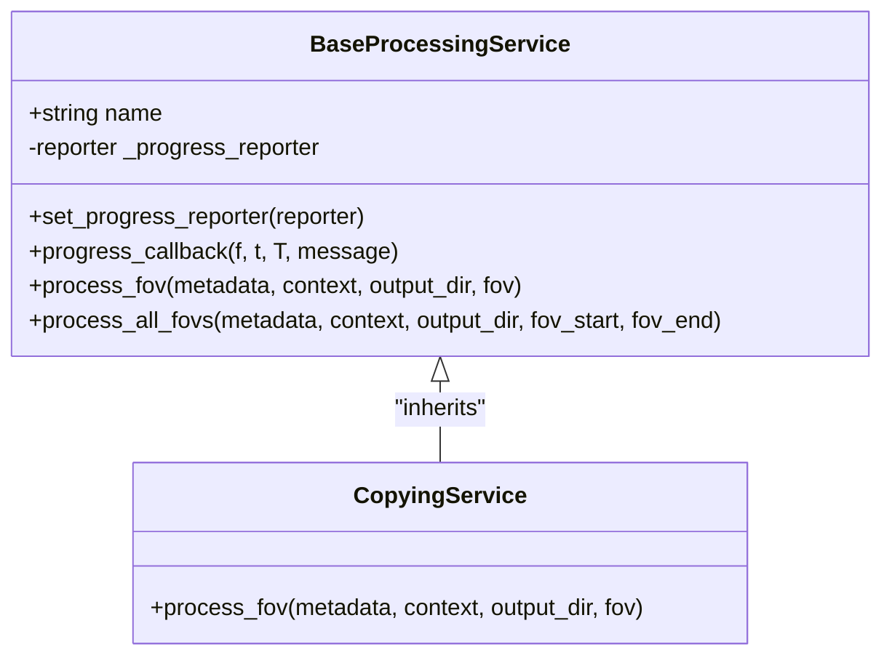
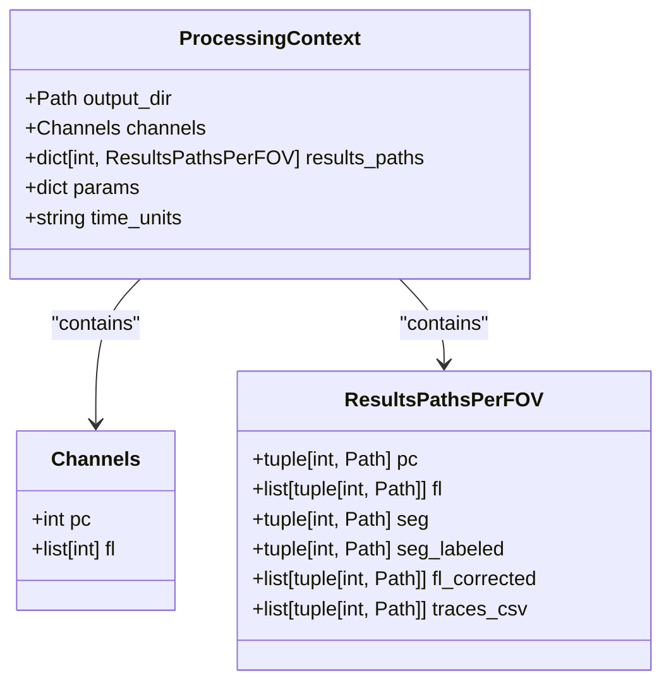
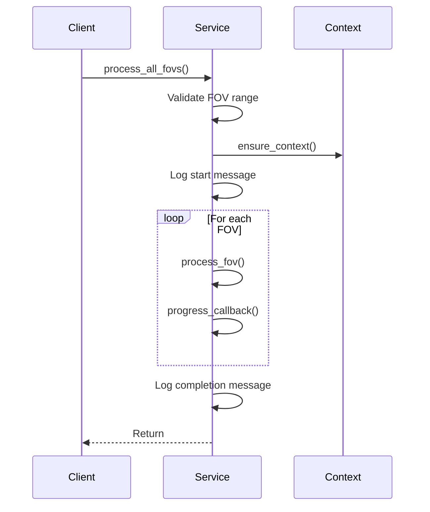
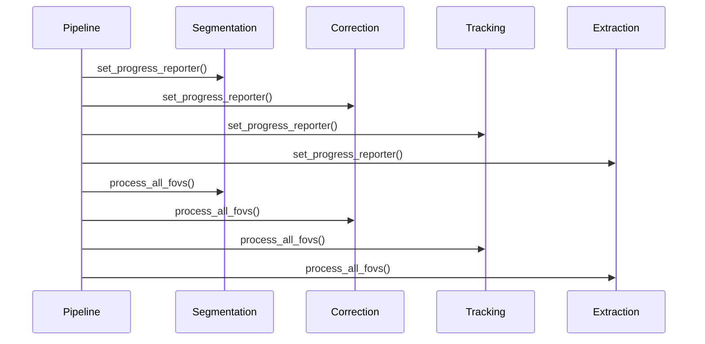
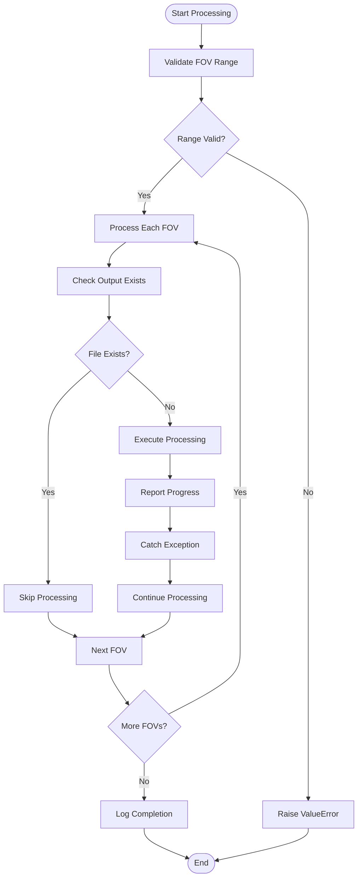
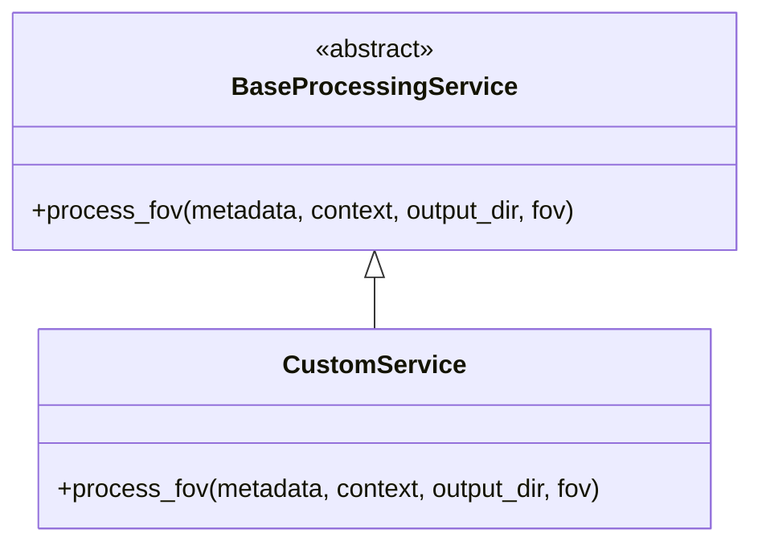
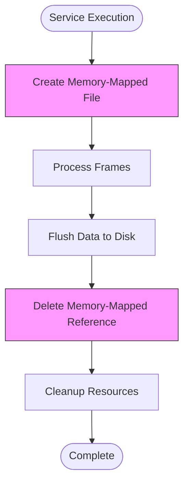
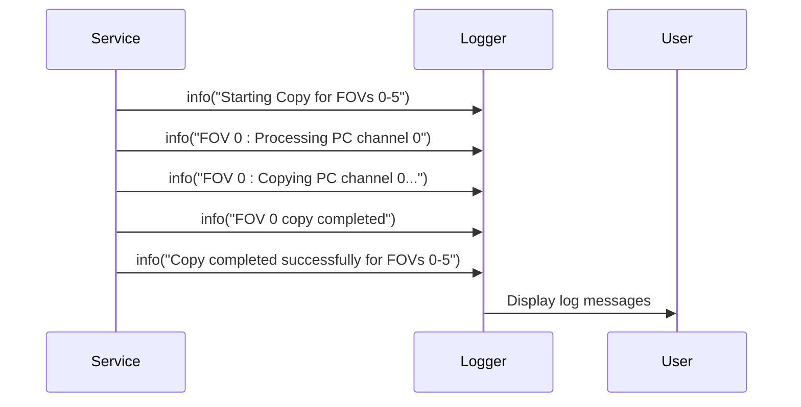
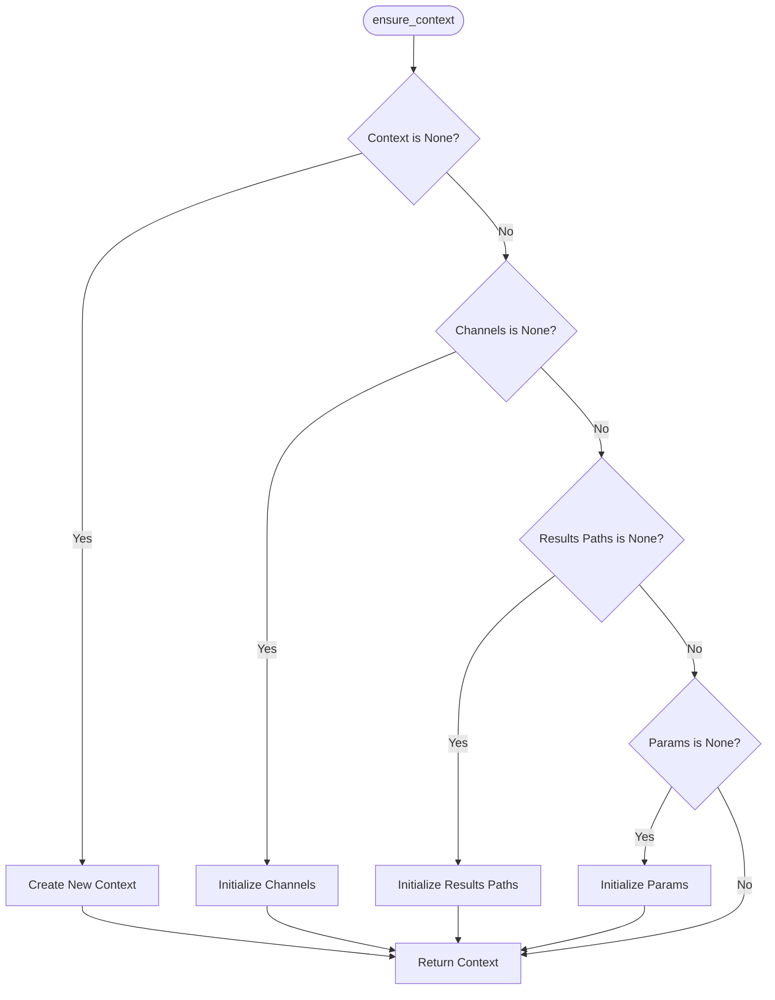

# Service Architecture

<cite>
**Referenced Files in This Document**   
- [base.py](file://pyama-core/src/pyama_core/processing/workflow/services/base.py)
- [types.py](file://pyama-core/src/pyama_core/processing/workflow/services/types.py)
- [copying.py](file://pyama-core/src/pyama_core/processing/workflow/services/copying.py)
- [pipeline.py](file://pyama-core/src/pyama_core/processing/workflow/pipeline.py)
</cite>

## Table of Contents
1. [Introduction](#introduction)
2. [Base Service Class Interface](#base-service-class-interface)
3. [Type System and Data Contracts](#type-system-and-data-contracts)
4. [Service Lifecycle Management](#service-lifecycle-management)
5. [Dependency Injection and Service Composition](#dependency-injection-and-service-composition)
6. [Error Handling Framework](#error-handling-framework)
7. [Custom Service Implementation Example](#custom-service-implementation-example)
8. [Thread Safety and Resource Management](#thread-safety-and-resource-management)
9. [Logging Integration](#logging-integration)
10. [Configuration Validation](#configuration-validation)

## Introduction
The processing service architecture in PyAMA provides a standardized framework for implementing microscopy image analysis workflows. This document details the base classes, type system, and execution patterns that enable consistent, composable, and robust processing services across the application. The architecture is designed to support modular development of analysis steps while ensuring predictable behavior, proper error handling, and efficient resource utilization.

## Base Service Class Interface

The `BaseProcessingService` class serves as the foundation for all processing services in the PyAMA framework. It defines a consistent interface and provides common functionality for progress reporting, error resilience, and batch processing of fields of view (FOVs).

**Diagram sources**
- [base.py](file://pyama-core/src/pyama_core/processing/workflow/services/base.py#L15-L83)
- [copying.py](file://pyama-core/src/pyama_core/processing/workflow/services/copying.py#L23-L98)

**Section sources**
- [base.py](file://pyama-core/src/pyama_core/processing/workflow/services/base.py#L15-L83)

## Type System and Data Contracts

The type system in `types.py` standardizes data contracts across services through dataclasses that ensure consistent data exchange and reduce coupling between components. The primary types include `ProcessingContext`, `Channels`, and `ResultsPathsPerFOV`.

**Diagram sources**
- [types.py](file://pyama-core/src/pyama_core/processing/workflow/services/types.py#L9-L21)

**Section sources**
- [types.py](file://pyama-core/src/pyama_core/processing/workflow/services/types.py#L25-L30)

## Service Lifecycle Management

The service lifecycle is managed through the `process_all_fovs` method in the base class, which handles range validation, context initialization, and sequential processing of FOVs. The lifecycle includes setup (context validation), execution (per-FOV processing), and implicit teardown (resource cleanup).

**Diagram sources**
- [base.py](file://pyama-core/src/pyama_core/processing/workflow/services/base.py#L55-L83)

**Section sources**
- [base.py](file://pyama-core/src/pyama_core/processing/workflow/services/base.py#L55-L83)

## Dependency Injection and Service Composition

Dependency injection is implemented through the `set_progress_reporter` method, allowing services to report progress events to external systems without direct coupling. Service composition occurs in the pipeline orchestration, where multiple services are instantiated and chained together to form complete analysis workflows.

**Diagram sources**
- [pipeline.py](file://pyama-core/src/pyama_core/processing/workflow/pipeline.py#L170-L213)
- [base.py](file://pyama-core/src/pyama_core/processing/workflow/services/base.py#L29-L44)

**Section sources**
- [pipeline.py](file://pyama-core/src/pyama_core/processing/workflow/pipeline.py#L170-L213)

## Error Handling Framework

The error handling framework prioritizes resilience, particularly in progress reporting where exceptions are caught and silenced to prevent workflow interruption. Validation is performed at the beginning of processing to catch configuration errors early, and file existence checks prevent redundant processing.

**Diagram sources**
- [base.py](file://pyama-core/src/pyama_core/processing/workflow/services/base.py#L55-L83)
- [copying.py](file://pyama-core/src/pyama_core/processing/workflow/services/copying.py#L28-L98)

**Section sources**
- [base.py](file://pyama-core/src/pyama_core/processing/workflow/services/base.py#L55-L83)

## Custom Service Implementation Example

To implement a custom service, inherit from `BaseProcessingService` and override the `process_fov` method. The service automatically inherits progress reporting, context management, and batch processing capabilities from the base class.

**Diagram sources**
- [base.py](file://pyama-core/src/pyama_core/processing/workflow/services/base.py#L15-L83)

**Section sources**
- [base.py](file://pyama-core/src/pyama_core/processing/workflow/services/base.py#L46-L53)

## Thread Safety and Resource Management

The architecture ensures thread safety through stateless service instances and immutable data contracts. Resource disposal is handled explicitly through context managers and manual cleanup of memory-mapped files, preventing resource leaks during long-running operations.

**Diagram sources**
- [copying.py](file://pyama-core/src/pyama_core/processing/workflow/services/copying.py#L28-L98)

**Section sources**
- [copying.py](file://pyama-core/src/pyama_core/processing/workflow/services/copying.py#L28-L98)

## Logging Integration

Logging is integrated throughout the service lifecycle, providing visibility into processing progress and status. Log messages include contextual information such as FOV number, processing step, and progress percentage, enabling detailed monitoring and debugging.

**Diagram sources**
- [base.py](file://pyama-core/src/pyama_core/processing/workflow/services/base.py#L55-L83)
- [copying.py](file://pyama-core/src/pyama_core/processing/workflow/services/copying.py#L28-L98)

**Section sources**
- [base.py](file://pyama-core/src/pyama_core/processing/workflow/services/base.py#L55-L83)

## Configuration Validation

Configuration validation is performed through the `ensure_context` function, which guarantees that all required fields are initialized with appropriate default values. This prevents null pointer exceptions and ensures consistent behavior across services regardless of input completeness.

**Diagram sources**
- [types.py](file://pyama-core/src/pyama_core/processing/workflow/services/types.py#L37-L54)

**Section sources**
- [types.py](file://pyama-core/src/pyama_core/processing/workflow/services/types.py#L37-L54)