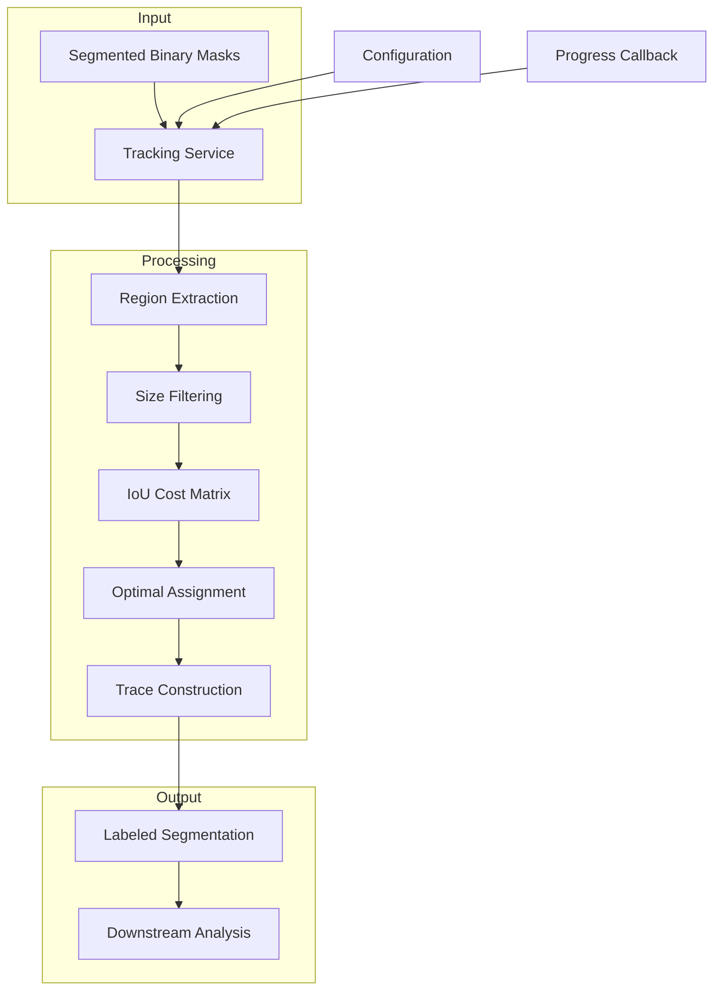
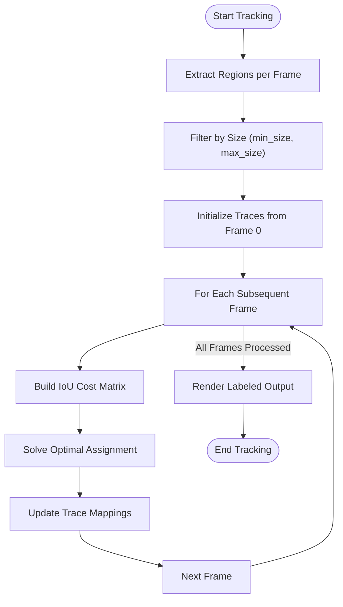
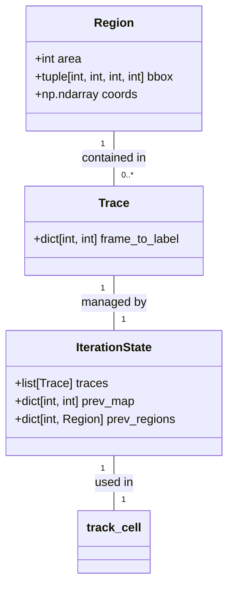
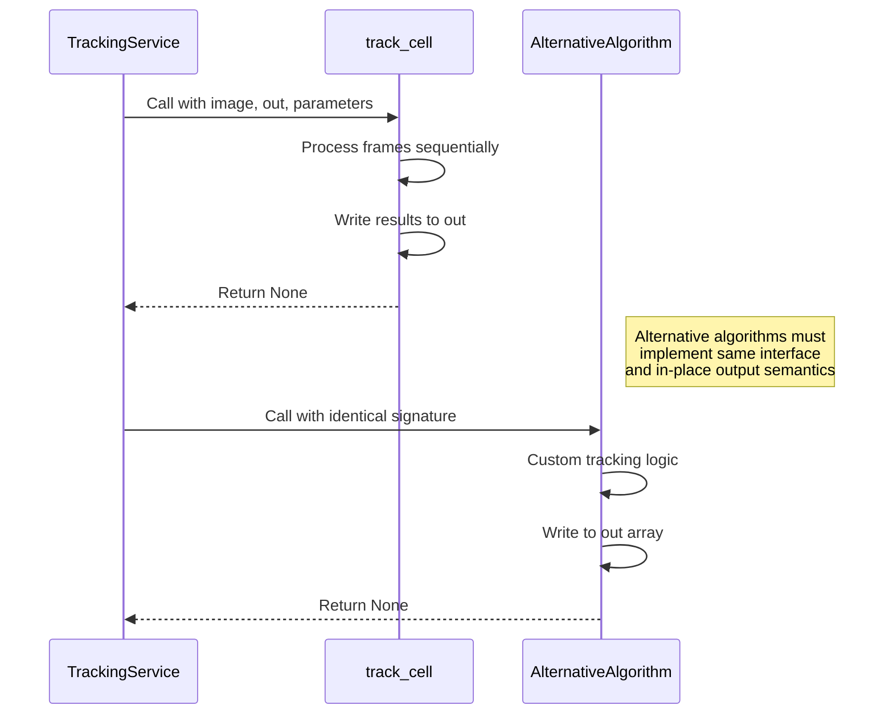

# Tracking Service

<cite>
**Referenced Files in This Document**   
- [iou.py](file://pyama-core/src/pyama_core/processing/tracking/iou.py)
- [tracking.py](file://pyama-core/src/pyama_core/processing/workflow/services/steps/tracking.py)
</cite>

## Table of Contents
1. [Introduction](#introduction)
2. [Core Components](#core-components)
3. [Architecture Overview](#architecture-overview)
4. [Detailed Component Analysis](#detailed-component-analysis)
5. [Temporal Linking Logic](#temporal-linking-logic)
6. [Configuration Options](#configuration-options)
7. [Track Representation and Data Structures](#track-representation-and-data-structures)
8. [Edge Case Handling](#edge-case-handling)
9. [Performance Considerations](#performance-considerations)
10. [Integration with Downstream Analysis](#integration-with-downstream-analysis)
11. [Extending the Tracking Algorithm](#extending-the-tracking-algorithm)
12. [Practical Examples](#practical-examples)

## Introduction
The Tracking Service in PyAMA provides robust cell tracking capabilities using an Intersection over Union (IoU)-based algorithm. This service maintains consistent cell identities across time-lapse microscopy frames by leveraging Hungarian assignment on IoU cost matrices. The system is designed to handle complex cellular behaviors including migration, division, and merging, while providing configurable parameters for different experimental conditions. This documentation details the API, configuration options, algorithmic logic, and integration points necessary for effective use and extension of the tracking functionality.

## Core Components

The Tracking Service consists of two primary components: the `TrackingService` class that manages the processing workflow, and the `track_cell` function that implements the core IoU-based tracking algorithm. The service handles input/output operations, file management, and progress reporting, while delegating the actual tracking computation to the algorithmic core. This separation of concerns allows for efficient processing of large microscopy datasets while maintaining flexibility in the tracking methodology.

**Section sources**
- [tracking.py](file://pyama-core/src/pyama_core/processing/workflow/services/steps/tracking.py#L25-L125)
- [iou.py](file://pyama-core/src/pyama_core/processing/tracking/iou.py#L279-L360)

## Architecture Overview



**Diagram sources**
- [tracking.py](file://pyama-core/src/pyama_core/processing/workflow/services/steps/tracking.py#L25-L125)
- [iou.py](file://pyama-core/src/pyama_core/processing/tracking/iou.py#L279-L360)

## Detailed Component Analysis

### Tracking Algorithm Implementation

The IoU-based tracking algorithm operates by extracting connected components from each frame's segmentation mask and establishing correspondences between consecutive frames based on region overlap. The algorithm uses bounding box IoU as a computationally efficient proxy for pixel-level overlap, enabling rapid processing of large datasets.

#### Core Tracking Process


**Diagram sources**
- [iou.py](file://pyama-core/src/pyama_core/processing/tracking/iou.py#L279-L360)
- [iou.py](file://pyama-core/src/pyama_core/processing/tracking/iou.py#L54-L71)

**Section sources**
- [iou.py](file://pyama-core/src/pyama_core/processing/tracking/iou.py#L279-L360)

## Temporal Linking Logic

The temporal linking logic employs a frame-to-frame association strategy using the Hungarian algorithm to solve the optimal assignment problem. For each consecutive frame pair, the algorithm constructs a cost matrix where costs are derived from 1-IoU values, ensuring that higher overlap regions receive lower costs and are preferentially matched. The algorithm maintains an iteration state that preserves trace continuity across frames, with each trace represented as a mapping from frame indices to region labels.

The linking process is initialized using regions from the first frame only, meaning that cells appearing for the first time in subsequent frames will only be incorporated into existing tracks if they sufficiently overlap with a cell from the previous frame. This approach prevents the creation of fragmented tracks but requires careful parameter tuning to handle cell division events appropriately.

**Section sources**
- [iou.py](file://pyama-core/src/pyama_core/processing/tracking/iou.py#L227-L276)
- [iou.py](file://pyama-core/src/pyama_core/processing/tracking/iou.py#L109-L147)

## Configuration Options

The tracking algorithm provides several configurable parameters to adapt to different cellular behaviors and experimental conditions:

- **min_iou**: Minimum Intersection over Union threshold for valid matches (default: 0.1). Higher values require greater overlap for tracking continuity.
- **min_size**: Minimum region size in pixels to include in tracking (optional). Filters out small noise regions.
- **max_size**: Maximum region size in pixels to include in tracking (optional). Filters out large artifacts or merged cells.

These parameters allow users to fine-tune the tracking behavior for specific cell types and imaging conditions. For example, rapidly migrating cells with significant shape changes may require lower min_iou values, while stable cell populations can use higher thresholds to prevent erroneous merges.

**Section sources**
- [iou.py](file://pyama-core/src/pyama_core/processing/tracking/iou.py#L279-L360)
- [iou.py](file://pyama-core/src/pyama_core/processing/tracking/iou.py#L150-L170)

## Track Representation and Data Structures

The tracking system uses several key data structures to represent and manage cell tracks:



**Diagram sources**
- [iou.py](file://pyama-core/src/pyama_core/processing/tracking/iou.py#L19-L30)
- [iou.py](file://pyama-core/src/pyama_core/processing/tracking/iou.py#L35-L35)
- [iou.py](file://pyama-core/src/pyama_core/processing/tracking/iou.py#L40-L51)

**Section sources**
- [iou.py](file://pyama-core/src/pyama_core/processing/tracking/iou.py#L19-L51)

The `Region` class encapsulates connected component properties including pixel area, bounding box coordinates, and individual pixel locations. The `Trace` type alias represents a dictionary mapping frame indices to region labels, effectively storing the lineage of each cell across time. The `IterationState` class maintains the algorithm's state between frames, including all active traces and mappings between region labels and their corresponding traces.

## Edge Case Handling

The tracking algorithm addresses several common edge cases in cell tracking:

- **Cell Division**: When a single cell divides into two, the algorithm may initially maintain the original track ID until the IoU threshold is violated. Subsequent frames may result in track fragmentation if the daughter cells move apart rapidly.
- **Cell Merging**: When two cells merge, the algorithm typically continues one of the original tracks based on which cell maintains higher IoU with the merged entity.
- **Track Fragmentation**: Temporary segmentation errors or occlusions can cause track breaks. The current algorithm does not implement gap-closing, so fragmented tracks remain separate.
- **New Cell Appearance**: Cells appearing for the first time after frame 0 are only incorporated if they overlap with existing cells from the previous frame.

The algorithm's reliance on frame-0 initialization means that cells entering the field of view later in the time series may not be properly tracked unless they immediately overlap with existing tracked cells.

**Section sources**
- [iou.py](file://pyama-core/src/pyama_core/processing/tracking/iou.py#L279-L360)
- [iou.py](file://pyama-core/src/pyama_core/processing/tracking/iou.py#L227-L276)

## Performance Considerations

The tracking algorithm is optimized for performance with several key characteristics:

- **Memory Efficiency**: Uses memory-mapped arrays for input and output, allowing processing of datasets larger than available RAM.
- **Computational Complexity**: O(N²) per frame where N is the number of cells, due to the pairwise IoU calculations and Hungarian assignment.
- **Scalability**: Processing time scales linearly with the number of frames but quadratically with cell density.
- **Parallelization**: Currently processes frames sequentially, but frame-independent region extraction could be parallelized.

For large datasets with high cell densities or frame rates, performance can be improved by:
1. Increasing the min_size parameter to filter out small noise regions
2. Using appropriate min_iou values to reduce the number of valid candidate pairs
3. Ensuring sufficient memory for memory-mapped file operations
4. Processing fields of view independently across multiple cores

The algorithm's use of bounding box IoU instead of pixel-level intersection significantly reduces computation time while maintaining reasonable accuracy for most cell tracking scenarios.

**Section sources**
- [iou.py](file://pyama-core/src/pyama_core/processing/tracking/iou.py#L109-L147)
- [tracking.py](file://pyama-core/src/pyama_core/processing/workflow/services/steps/tracking.py#L73-L111)

## Integration with Downstream Analysis

The tracking output integrates seamlessly with downstream analysis components through standardized data formats and processing context management. The labeled segmentation output (where each pixel contains a cell ID) serves as the foundation for extracting time-series features such as cell position, area, morphology, and intensity measurements. The consistent cell IDs across frames enable the construction of complete cell lineages and trajectories for migration analysis.

The ProcessingContext object maintains references to all intermediate and final results, allowing subsequent analysis steps to locate the tracked segmentation data without hard-coded paths. This contextual approach enables flexible workflow composition and reproducible analysis pipelines.

**Section sources**
- [tracking.py](file://pyama-core/src/pyama_core/processing/workflow/services/steps/tracking.py#L25-L125)
- [tracking.py](file://pyama-core/src/pyama_core/processing/workflow/services/steps/tracking.py#L108-L125)

## Extending the Tracking Algorithm

The modular design allows for extension of the base tracker with alternative algorithms while maintaining compatibility with the processing pipeline. The `track_cell` function interface serves as a contract that any replacement algorithm must satisfy:



**Diagram sources**
- [tracking.py](file://pyama-core/src/pyama_core/processing/workflow/services/steps/tracking.py#L73-L111)
- [iou.py](file://pyama-core/src/pyama_core/processing/tracking/iou.py#L279-L360)

To implement an alternative tracking algorithm, developers should:
1. Create a function with the same signature as `track_cell`
2. Ensure in-place writing to the output array
3. Handle the same parameter types and defaults
4. Maintain identical error conditions and types
5. Preserve progress callback functionality

This approach enables algorithmic innovation while preserving workflow compatibility and user experience consistency.

**Section sources**
- [iou.py](file://pyama-core/src/pyama_core/processing/tracking/iou.py#L279-L360)
- [tracking.py](file://pyama-core/src/pyama_core/processing/workflow/services/steps/tracking.py#L73-L111)

## Practical Examples

### Standard Cell Migration Tracking
```python
# Basic usage with default parameters
track_cell(
    image=segmentation_masks,
    out=labeled_output,
    min_iou=0.1,
    progress_callback=callback
)
```

### Large Cell Population with Size Filtering
```python
# Filter out small debris and large cell aggregates
track_cell(
    image=segmentation_masks,
    out=labeled_output,
    min_size=50,      # Minimum 50 pixels
    max_size=5000,    # Maximum 5000 pixels
    min_iou=0.3       # Require higher overlap
)
```

### Fast-Moving Cells with Relaxed Overlap
```python
# Lower IoU threshold for cells with rapid shape changes
track_cell(
    image=segmentation_masks,
    out=labeled_output,
    min_iou=0.05,     # Accept lower overlap
    min_size=100      # Filter small noise
)
```

These examples demonstrate how parameter tuning can adapt the tracking algorithm to different biological scenarios while maintaining the same core interface.

**Section sources**
- [iou.py](file://pyama-core/src/pyama_core/processing/tracking/iou.py#L279-L360)
- [tracking.py](file://pyama-core/src/pyama_core/processing/workflow/services/steps/tracking.py#L73-L111)