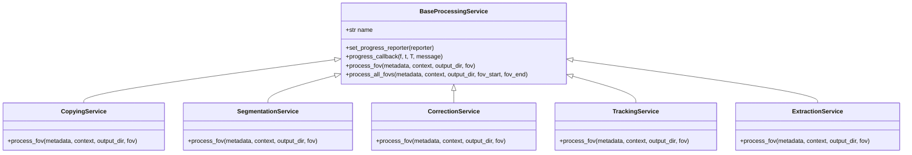
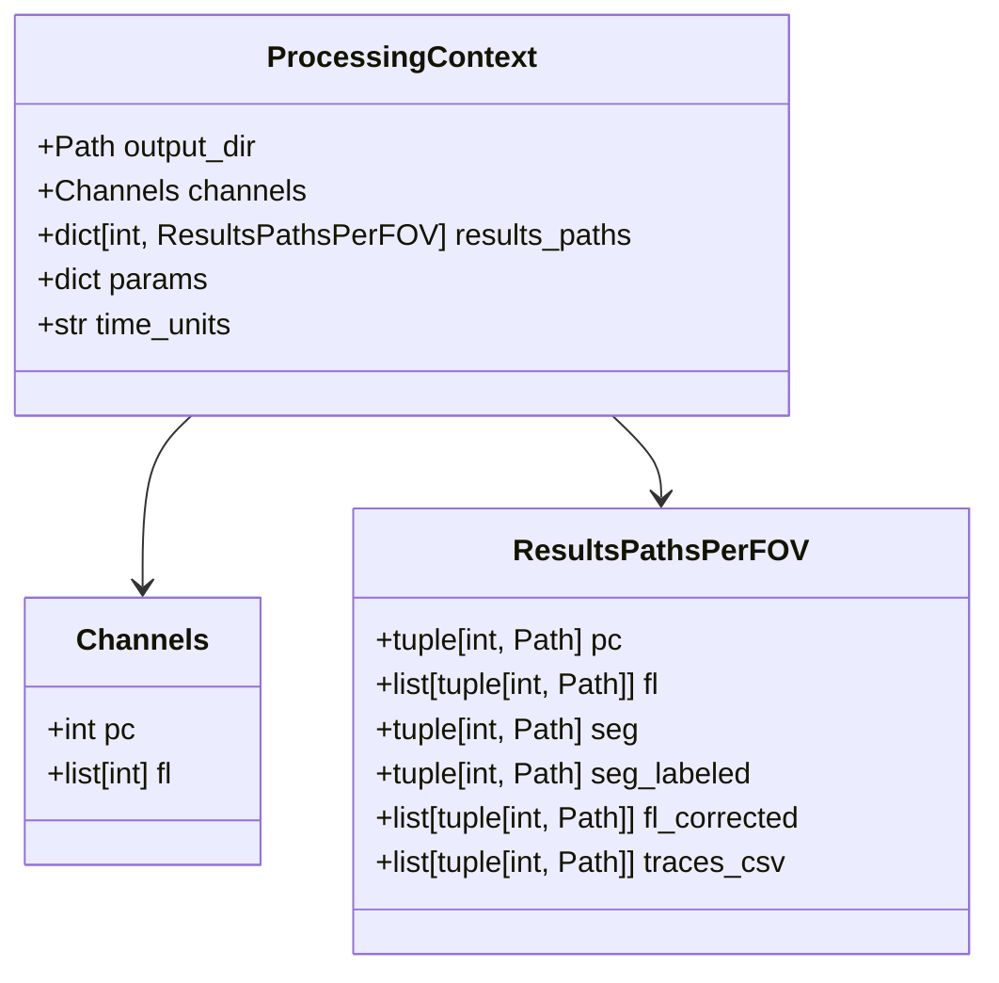
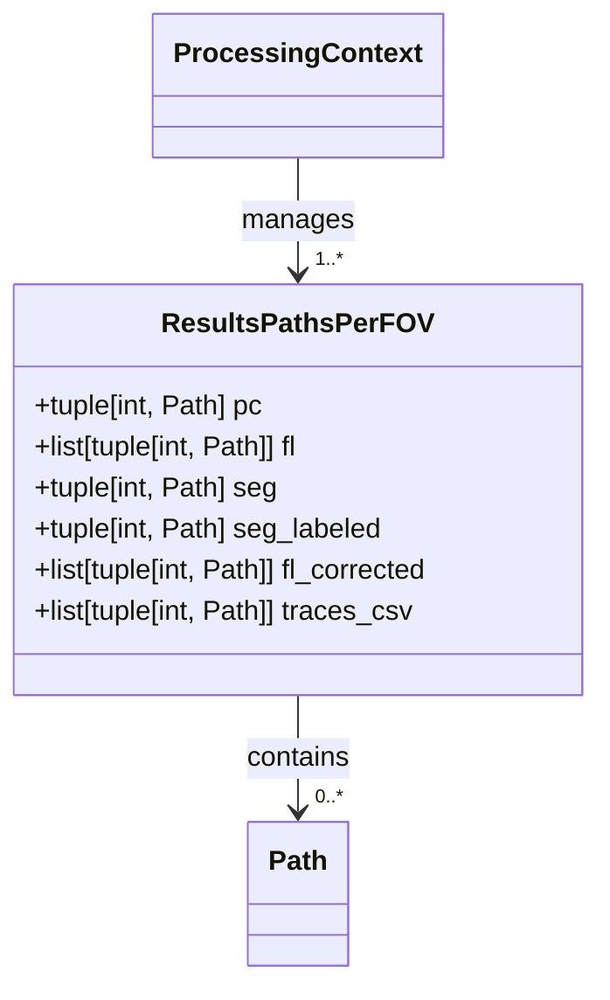
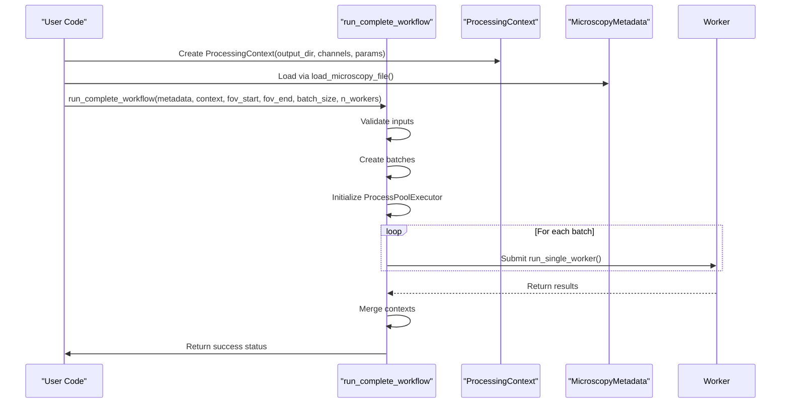
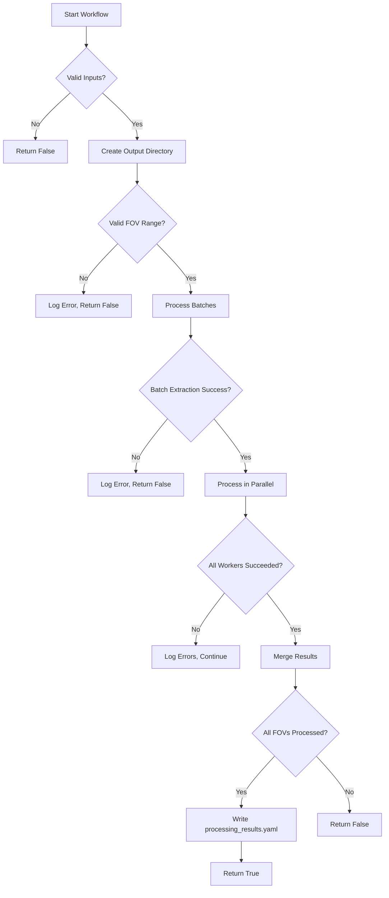
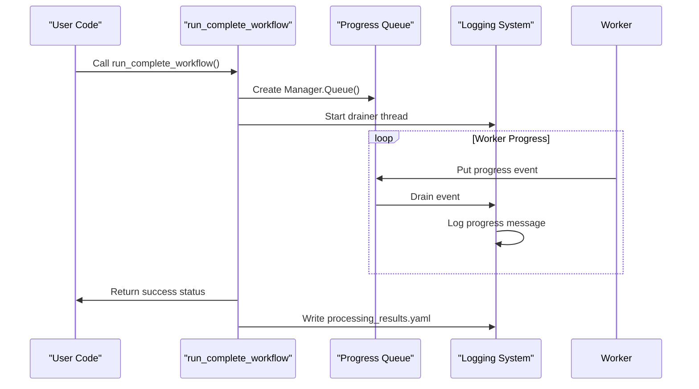
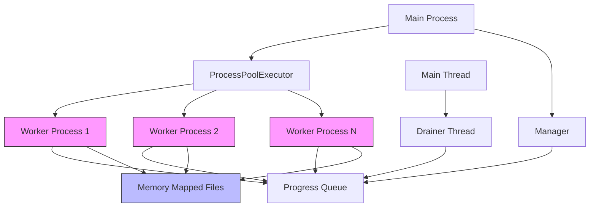
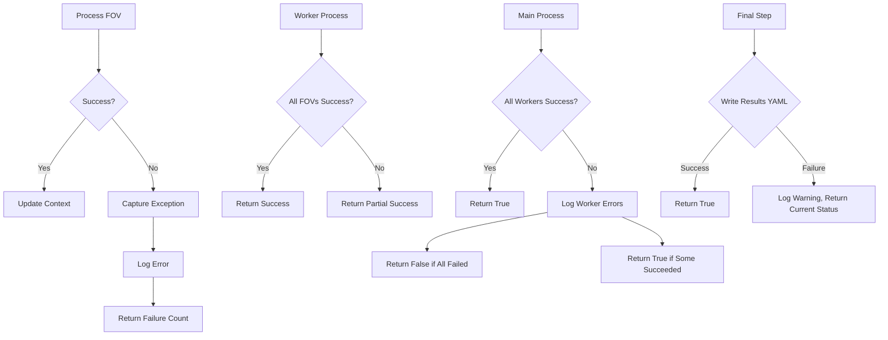
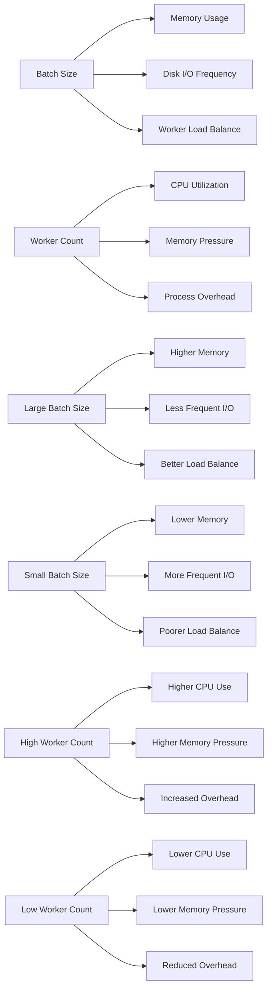

# Workflow Orchestration

<cite>
**Referenced Files in This Document**   
- [pipeline.py](file://pyama-core/src/pyama_core/processing/workflow/pipeline.py)
- [types.py](file://pyama-core/src/pyama_core/processing/workflow/services/types.py)
- [copying.py](file://pyama-core/src/pyama_core/processing/workflow/services/copying.py)
- [segmentation.py](file://pyama-core/src/pyama_core/processing/workflow/services/steps/segmentation.py)
- [correction.py](file://pyama-core/src/pyama_core/processing/workflow/services/steps/correction.py)
- [tracking.py](file://pyama-core/src/pyama_core/processing/workflow/services/steps/tracking.py)
- [extraction.py](file://pyama-core/src/pyama_core/processing/workflow/services/steps/extraction.py)
- [base.py](file://pyama-core/src/pyama_core/processing/workflow/services/base.py)
- [microscopy.py](file://pyama-core/src/pyama_core/io/microscopy.py)
- [log_std.py](file://pyama-core/src/pyama_core/processing/segmentation/log_std.py)
- [tile_interp.py](file://pyama-core/src/pyama_core/processing/background/tile_interp.py)
- [iou.py](file://pyama-core/src/pyama_core/processing/tracking/iou.py)
- [trace.py](file://pyama-core/src/pyama_core/processing/extraction/trace.py)
</cite>

## Table of Contents
1. [Introduction](#introduction)
2. [Pipeline Class Interface](#pipeline-class-interface)
3. [Processing Context Configuration](#processing-context-configuration)
4. [End-to-End Data Flow](#end-to-end-data-flow)
5. [ResultsPathsPerFOV Management](#resultspathsperfov-management)
6. [Code Examples](#code-examples)
7. [Concurrency and Resource Management](#concurrency-and-resource-management)
8. [Error Handling and Monitoring](#error-handling-and-monitoring)
9. [Performance Considerations](#performance-considerations)
10. [Conclusion](#conclusion)

## Introduction
The PyAMA core workflow orchestration system provides a comprehensive pipeline for microscopy image analysis. This documentation details the Pipeline class interface, configuration mechanisms, execution workflow, and integration patterns for the `run_complete_workflow` function. The system is designed to process microscopy data through a series of coordinated steps including copying, segmentation, correction, tracking, and extraction, with robust error handling and progress reporting capabilities.

## Pipeline Class Interface

The workflow orchestration system exposes its primary interface through the `run_complete_workflow` function, which coordinates the complete analysis pipeline. The Pipeline class (implemented as module-level functions) follows a service-oriented architecture with specialized components for each processing step.



**Diagram sources**
- [base.py](file://pyama-core/src/pyama_core/processing/workflow/services/base.py#L15-L83)
- [copying.py](file://pyama-core/src/pyama_core/processing/workflow/services/copying.py#L23-L98)
- [segmentation.py](file://pyama-core/src/pyama_core/processing/workflow/services/steps/segmentation.py#L25-L124)
- [correction.py](file://pyama-core/src/pyama_core/processing/workflow/services/steps/correction.py#L25-L146)
- [tracking.py](file://pyama-core/src/pyama_core/processing/workflow/services/steps/tracking.py#L25-L125)
- [extraction.py](file://pyama-core/src/pyama_core/processing/workflow/services/steps/extraction.py#L25-L132)

**Section sources**
- [pipeline.py](file://pyama-core/src/pyama_core/processing/workflow/pipeline.py#L0-L558)
- [base.py](file://pyama-core/src/pyama_core/processing/workflow/services/base.py#L15-L83)

## Processing Context Configuration

The `ProcessingContext` dataclass serves as the central configuration object for the workflow, carrying parameters, channel specifications, and output paths throughout the processing pipeline. It enables consistent state management across distributed processing steps.



**Diagram sources**
- [types.py](file://pyama-core/src/pyama_core/processing/workflow/services/types.py#L25-L30)
- [types.py](file://pyama-core/src/pyama_core/processing/workflow/services/types.py#L15-L21)

**Section sources**
- [types.py](file://pyama-core/src/pyama_core/processing/workflow/services/types.py#L15-L62)

## End-to-End Data Flow

The workflow orchestrates a multi-stage processing pipeline that transforms raw microscopy data into analyzed outputs. The data flow follows a sequential progression through specialized processing services, with intermediate results persisted to disk and tracked in the processing context.

```mermaid
flowchart TD
A[Raw Microscopy File] --> B[Copying Service]
B --> C[Phase Contrast & Fluorescence .npy files]
C --> D[Segmentation Service]
D --> E[Segmentation Masks .npy]
E --> F[Correction Service]
F --> G[Background Corrected Fluorescence .npy]
G --> H[Tracking Service]
H --> I[Labeled Segmentation .npy]
I --> J[Extraction Service]
J --> K[Traces CSV files]
K --> L[processing_results.yaml]
M[ProcessingContext] --> B
M --> D
M --> F
M --> H
M --> J
M --> L
N[Progress Queue] < --> B
N < --> D
N < --> F
N < --> H
N < --> J
```

**Diagram sources**
- [pipeline.py](file://pyama-core/src/pyama_core/processing/workflow/pipeline.py#L0-L558)
- [copying.py](file://pyama-core/src/pyama_core/processing/workflow/services/copying.py#L23-L98)
- [segmentation.py](file://pyama-core/src/pyama_core/processing/workflow/services/steps/segmentation.py#L25-L124)
- [correction.py](file://pyama-core/src/pyama_core/processing/workflow/services/steps/correction.py#L25-L146)
- [tracking.py](file://pyama-core/src/pyama_core/processing/workflow/services/steps/tracking.py#L25-L125)
- [extraction.py](file://pyama-core/src/pyama_core/processing/workflow/services/steps/extraction.py#L25-L132)

**Section sources**
- [pipeline.py](file://pyama-core/src/pyama_core/processing/workflow/pipeline.py#L0-L558)

## ResultsPathsPerFOV Management

The `ResultsPathsPerFOV` class plays a critical role in managing per-FOV artifacts throughout the workflow. It maintains references to all intermediate and final output files for each field of view, enabling efficient state tracking and avoiding redundant processing.



**Diagram sources**
- [types.py](file://pyama-core/src/pyama_core/processing/workflow/services/types.py#L15-L21)

**Section sources**
- [types.py](file://pyama-core/src/pyama_core/processing/workflow/services/types.py#L15-L62)

## Code Examples

### Pipeline Initialization and Configuration



**Diagram sources**
- [pipeline.py](file://pyama-core/src/pyama_core/processing/workflow/pipeline.py#L0-L558)
- [types.py](file://pyama-core/src/pyama_core/processing/workflow/services/types.py#L25-L30)
- [microscopy.py](file://pyama-core/src/pyama_core/io/microscopy.py#L0-L178)

### Success and Failure State Handling



**Diagram sources**
- [pipeline.py](file://pyama-core/src/pyama_core/processing/workflow/pipeline.py#L0-L558)

### External Monitoring Integration



**Diagram sources**
- [pipeline.py](file://pyama-core/src/pyama_core/processing/workflow/pipeline.py#L0-L558)

**Section sources**
- [pipeline.py](file://pyama-core/src/pyama_core/processing/workflow/pipeline.py#L0-L558)

## Concurrency and Resource Management

The workflow system implements a sophisticated concurrency model using Python's `ProcessPoolExecutor` to parallelize processing across multiple CPU cores. Resource cleanup is handled through context managers and explicit memory mapping disposal.



**Diagram sources**
- [pipeline.py](file://pyama-core/src/pyama_core/processing/workflow/pipeline.py#L0-L558)

**Section sources**
- [pipeline.py](file://pyama-core/src/pyama_core/processing/workflow/pipeline.py#L0-L558)

## Error Handling and Monitoring

The system implements comprehensive error handling at multiple levels, from individual FOV processing to batch-level and workflow-level failure detection. Errors are propagated through return values and logged for monitoring purposes.



**Diagram sources**
- [pipeline.py](file://pyama-core/src/pyama_core/processing/workflow/pipeline.py#L0-L558)

**Section sources**
- [pipeline.py](file://pyama-core/src/pyama_core/processing/workflow/pipeline.py#L0-L558)

## Performance Considerations

The workflow's performance is influenced by several configurable parameters, including batch size and worker count. These settings affect memory usage, disk I/O patterns, and CPU utilization.



**Diagram sources**
- [pipeline.py](file://pyama-core/src/pyama_core/processing/workflow/pipeline.py#L0-L558)

**Section sources**
- [pipeline.py](file://pyama-core/src/pyama_core/processing/workflow/pipeline.py#L0-L558)

## Conclusion

The PyAMA core workflow orchestration system provides a robust, scalable framework for microscopy image analysis. Through its well-defined `ProcessingContext` configuration, modular service architecture, and sophisticated concurrency model, it enables efficient processing of large microscopy datasets. The system's comprehensive error handling, progress reporting, and result persistence mechanisms make it suitable for both interactive and production environments. By understanding the interactions between the pipeline components and the configuration options available, users can optimize the workflow for their specific hardware and data characteristics.