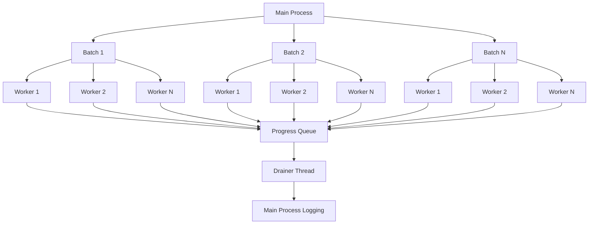
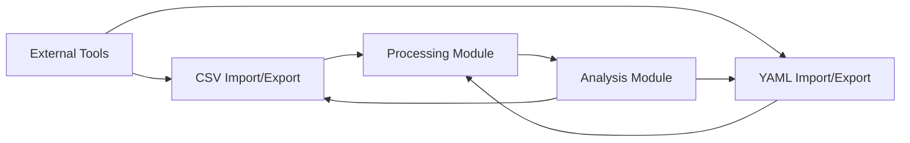

# Advanced Features

<cite>
**Referenced Files in This Document**   
- [threading.py](file://pyama-qt/src/pyama_qt/services/threading.py)
- [pipeline.py](file://pyama-core/src/pyama_core/processing/workflow/pipeline.py)
- [base.py](file://pyama-core/src/pyama_core/processing/workflow/services/base.py)
- [types.py](file://pyama-core/src/pyama_core/processing/workflow/services/types.py)
- [results_yaml.py](file://pyama-core/src/pyama_core/io/results_yaml.py)
- [analysis_csv.py](file://pyama-core/src/pyama_core/io/analysis_csv.py)
- [processing_csv.py](file://pyama-core/src/pyama_core/io/processing_csv.py)
- [controller.py](file://pyama-qt/src/pyama_qt/processing/controller.py)
- [models.py](file://pyama-qt/src/pyama_qt/processing/models.py)
- [requests.py](file://pyama-qt/src/pyama_qt/processing/requests.py)
- [utils.py](file://pyama-qt/src/pyama_qt/processing/utils.py)
- [analysis/controller.py](file://pyama-qt/src/pyama_qt/analysis/controller.py)
</cite>

## Table of Contents
1. [Threading and Worker Pattern](#threading-and-worker-pattern)
2. [Parallel Processing Architecture](#parallel-processing-architecture)
3. [Batch Operations](#batch-operations)
4. [Custom Workflow Creation](#custom-workflow-creation)
5. [Memory Management for Large Microscopy Datasets](#memory-management-for-large-microscopy-datasets)
6. [Integration with External Tools](#integration-with-external-tools)
7. [Automating Analysis Pipelines](#automating-analysis-pipelines)
8. [Performance Tuning Recommendations](#performance-tuning-recommendations)

## Threading and Worker Pattern

The application implements a robust threading and worker pattern to maintain UI responsiveness during long-running operations. The core mechanism uses Qt's QThread in combination with QObject-based workers to execute processing tasks in dedicated threads while keeping the main UI thread free for user interactions.

The `WorkerHandle` class in `threading.py` provides a safe interface for managing worker lifecycle, including proper cleanup of thread resources and signal disconnection to prevent crashes. Workers are started using the `start_worker` function, which connects the worker's start method to the thread's started signal and handles cleanup upon completion.

This pattern ensures that computationally intensive tasks like microscopy image processing do not freeze the user interface, allowing users to continue interacting with the application while workflows execute in the background.

**Section sources**
- [threading.py](file://pyama-qt/src/pyama_qt/services/threading.py#L1-L92)
- [controller.py](file://pyama-qt/src/pyama_qt/processing/controller.py#L1-L697)

## Parallel Processing Architecture

The parallel processing architecture is built around a worker pool management system that efficiently distributes tasks across multiple CPU cores. The `run_complete_workflow` function in `pipeline.py` orchestrates this parallel execution using Python's `ProcessPoolExecutor` with a spawn context to ensure clean process isolation.

The architecture implements a two-level parallelization strategy:
1. **Batch-level parallelism**: The processing range is divided into batches based on the `batch_size` parameter
2. **Worker-level parallelism**: Within each batch, FOVs are distributed across `n_workers` processes

The system uses a manager-backed queue for progress reporting from worker processes to the main thread, with a dedicated drainer thread that processes progress events and logs them appropriately. This design allows for efficient load balancing while maintaining consistent progress reporting to the user interface.



**Diagram sources**
- [pipeline.py](file://pyama-core/src/pyama_core/processing/workflow/pipeline.py#L1-L558)
- [controller.py](file://pyama-qt/src/pyama_qt/processing/controller.py#L1-L697)

**Section sources**
- [pipeline.py](file://pyama-core/src/pyama_core/processing/workflow/pipeline.py#L1-L558)
- [controller.py](file://pyama-qt/src/pyama_qt/processing/controller.py#L1-L697)

## Batch Operations

The system supports batch operations for processing multiple datasets with consistent parameters through its workflow pipeline. The `run_complete_workflow` function processes FOVs in batches, where each batch is defined by the `batch_size` parameter.

Batch processing follows a sequential pattern within each batch:
1. Copying: Extract frames from ND2 files to NPY format
2. Segmentation: Apply LOG-STD approach for cell segmentation
3. Correction: Perform background correction for fluorescence channels
4. Tracking: Track cells across time points using IOU algorithm
5. Extraction: Extract features and generate traces

Each batch is processed completely before moving to the next, ensuring that intermediate results are available for the entire batch before proceeding. This approach balances memory usage with processing efficiency, particularly important for large microscopy datasets.

The batch size can be configured by the user through the processing parameters, allowing optimization based on available system resources and dataset characteristics.

**Section sources**
- [pipeline.py](file://pyama-core/src/pyama_core/processing/workflow/pipeline.py#L1-L558)
- [models.py](file://pyama-qt/src/pyama_qt/processing/models.py#L1-L241)

## Custom Workflow Creation

Custom workflow creation is enabled through the flexible service architecture in the processing module. While the default workflow follows a fixed sequence of copying, segmentation, correction, tracking, and extraction, the service-based design allows for potential customization by combining processing steps in non-standard sequences.

The `BaseProcessingService` class provides the foundation for all processing services, defining a consistent interface with `process_fov` and `process_all_fovs` methods. Each service (CopyingService, SegmentationService, etc.) inherits from this base class and implements its specific functionality.

Users can effectively create custom workflows by:
1. Selecting specific channels to process (phase and fluorescence)
2. Defining custom FOV ranges through the `fov_start` and `fov_end` parameters
3. Configuring processing parameters that affect algorithm behavior
4. Using the merge functionality to combine results from different processing runs

The controller architecture in `controller.py` manages the execution flow and could be extended to support truly custom sequences of processing steps beyond the current fixed pipeline.

**Section sources**
- [base.py](file://pyama-core/src/pyama_core/processing/workflow/services/base.py#L1-L84)
- [pipeline.py](file://pyama-core/src/pyama_core/processing/workflow/pipeline.py#L1-L558)
- [controller.py](file://pyama-qt/src/pyama_qt/processing/controller.py#L1-L697)

## Memory Management for Large Microscopy Datasets

The system implements several memory management strategies to handle large microscopy datasets efficiently. The primary approach uses memory-mapped files (memmap) for storing and accessing large image data without loading it entirely into RAM.

In the `CopyingService`, the `open_memmap` function creates memory-mapped arrays for storing extracted frames. This allows the application to work with datasets much larger than available physical memory by leveraging the operating system's virtual memory management.

Additional memory management techniques include:
- **Progressive processing**: FOVs are processed one at a time within each worker process, limiting peak memory usage
- **Context merging**: Processing context from worker processes is merged incrementally rather than keeping all contexts in memory simultaneously
- **Efficient data structures**: The use of dataclasses with slots (`types.py`) reduces memory overhead for processing metadata
- **Generator patterns**: Where possible, iterators and generators are used instead of loading complete datasets into memory

The system also implements proper cleanup of memory-mapped files and other resources through the worker handling system, ensuring that memory is released when processing steps complete.

**Section sources**
- [copying.py](file://pyama-core/src/pyama_core/processing/workflow/services/copying.py#L1-L99)
- [types.py](file://pyama-core/src/pyama_core/processing/workflow/services/types.py#L1-L62)
- [threading.py](file://pyama-qt/src/pyama_qt/services/threading.py#L1-L92)

## Integration with External Tools

The application provides integration with external tools through CSV and YAML interchange formats, enabling seamless data exchange with other analysis software and custom scripts.

### CSV Interchange Formats

Two primary CSV formats are supported:

**Processing CSV Format**: Used for intermediate processing results, containing columns for:
- fov: Field of view index
- cell: Cell identifier
- frame: Frame number
- time: Time point
- good: Quality flag
- position_x, position_y: Cell coordinates
- Dynamic feature columns (intensity, area, etc.)

**Analysis CSV Format**: Used for final analysis data, with time as the index and cells as columns. This format includes:
- Time values as row indices
- Cell IDs as column headers
- Numeric values representing cell measurements
- Optional time units specified in a comment header

### YAML Interchange Format

The system uses YAML for storing complete processing results and configuration data. The `processing_results.yaml` file contains:
- Output directory structure
- Channel configuration
- Results paths for all processed FOVs
- Processing parameters
- Time units information

The `results_yaml.py` module provides utilities for loading, saving, and discovering processing results from YAML files, including path correction logic to handle moved data directories.



**Diagram sources**
- [analysis_csv.py](file://pyama-core/src/pyama_core/io/analysis_csv.py#L1-L164)
- [processing_csv.py](file://pyama-core/src/pyama_core/io/processing_csv.py#L1-L178)
- [results_yaml.py](file://pyama-core/src/pyama_core/io/results_yaml.py#L1-L295)

**Section sources**
- [analysis_csv.py](file://pyama-core/src/pyama_core/io/analysis_csv.py#L1-L164)
- [processing_csv.py](file://pyama-core/src/pyama_core/io/processing_csv.py#L1-L178)
- [results_yaml.py](file://pyama-core/src/pyama_core/io/results_yaml.py#L1-L295)

## Automating Analysis Pipelines

The system supports automation of analysis pipelines through both scripting interfaces and batch processing capabilities. The architecture is designed to enable programmatic control of the entire analysis workflow.

### Scripting Interface

The core processing functions are exposed through clean Python APIs that can be imported and used in custom scripts:

```python
from pyama_core.processing.workflow import run_complete_workflow
from pyama_core.io import load_microscopy_file
from pyama_core.processing.workflow.services.types import ProcessingContext

# Example automation script
metadata = load_microscopy_file("path/to/file.nd2")
context = ProcessingContext(output_dir="path/to/output")
success = run_complete_workflow(
    metadata=metadata,
    context=context,
    fov_start=0,
    fov_end=10,
    batch_size=2,
    n_workers=4
)
```

### Batch Analysis Automation

The analysis module includes built-in batch processing capabilities through the `_AnalysisWorker` class, which can process multiple CSV files in sequence. This enables automated fitting of large numbers of datasets without manual intervention.

The controller architecture in `analysis/controller.py` exposes a `start_fitting` method that accepts a `FittingRequest` object, allowing customization of the fitting process through parameters like model type, initial parameters, and bounds.

Users can create automation scripts that:
1. Discover and load multiple datasets
2. Configure processing parameters programmatically
3. Execute workflows and monitor progress
4. Process results and generate reports
5. Handle errors and edge cases systematically

**Section sources**
- [pipeline.py](file://pyama-core/src/pyama_core/processing/workflow/pipeline.py#L1-L558)
- [analysis/controller.py](file://pyama-qt/src/pyama_qt/analysis/controller.py#L1-L235)
- [requests.py](file://pyama-qt/src/pyama_qt/processing/requests.py#L1-L29)

## Performance Tuning Recommendations

To optimize performance for different hardware configurations, consider the following recommendations:

### CPU Configuration
- **Number of workers**: Set `n_workers` to match the number of physical CPU cores for optimal parallelization
- For systems with hyperthreading, experiment with values up to 1.5x the number of physical cores
- Monitor CPU utilization and adjust worker count to avoid excessive context switching

### Memory Configuration
- **Batch size**: Adjust `batch_size` based on available RAM
  - Small systems (8-16GB RAM): Use batch_size=1-2
  - Medium systems (32-64GB RAM): Use batch_size=2-4
  - Large systems (128GB+ RAM): Use batch_size=4-8
- Ensure sufficient swap space is available for very large datasets

### Storage Configuration
- Use SSD storage for both input ND2 files and output directories
- For network storage, ensure high bandwidth and low latency connections
- Consider using separate drives for input and output to reduce I/O contention

### Processing Parameters
- **FOV range**: Process smaller ranges first to test parameters before full runs
- **Channel selection**: Only process channels that are needed to reduce processing time
- **Worker coordination**: For multi-node processing, coordinate batch assignments to avoid overlap

### Monitoring and Optimization
- Monitor memory usage during processing to identify optimal batch sizes
- Use the logging output to identify bottlenecks in specific processing steps
- Profile individual services (segmentation, correction, etc.) to optimize their parameters

The system's modular design allows for targeted optimization of specific processing steps based on the characteristics of your microscopy data and hardware configuration.

**Section sources**
- [pipeline.py](file://pyama-core/src/pyama_core/processing/workflow/pipeline.py#L1-L558)
- [models.py](file://pyama-qt/src/pyama_qt/processing/models.py#L1-L241)
- [utils.py](file://pyama-qt/src/pyama_qt/processing/utils.py#L1-L42)