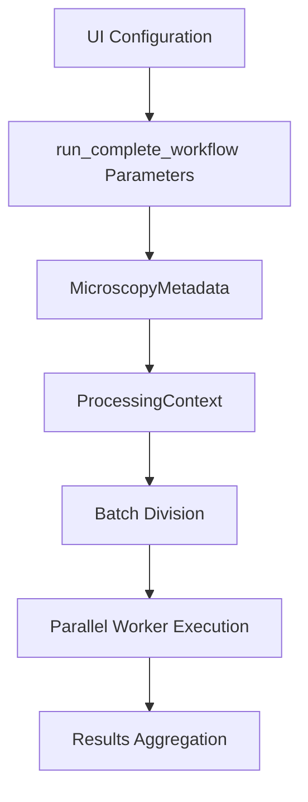
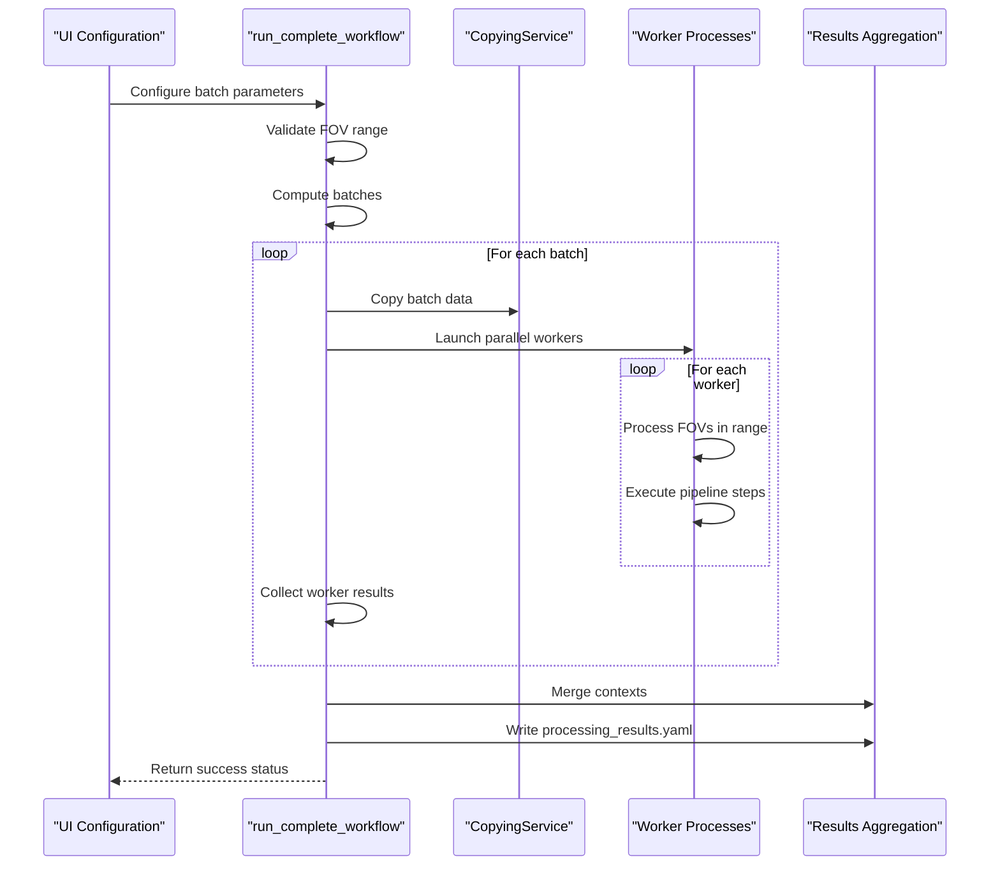
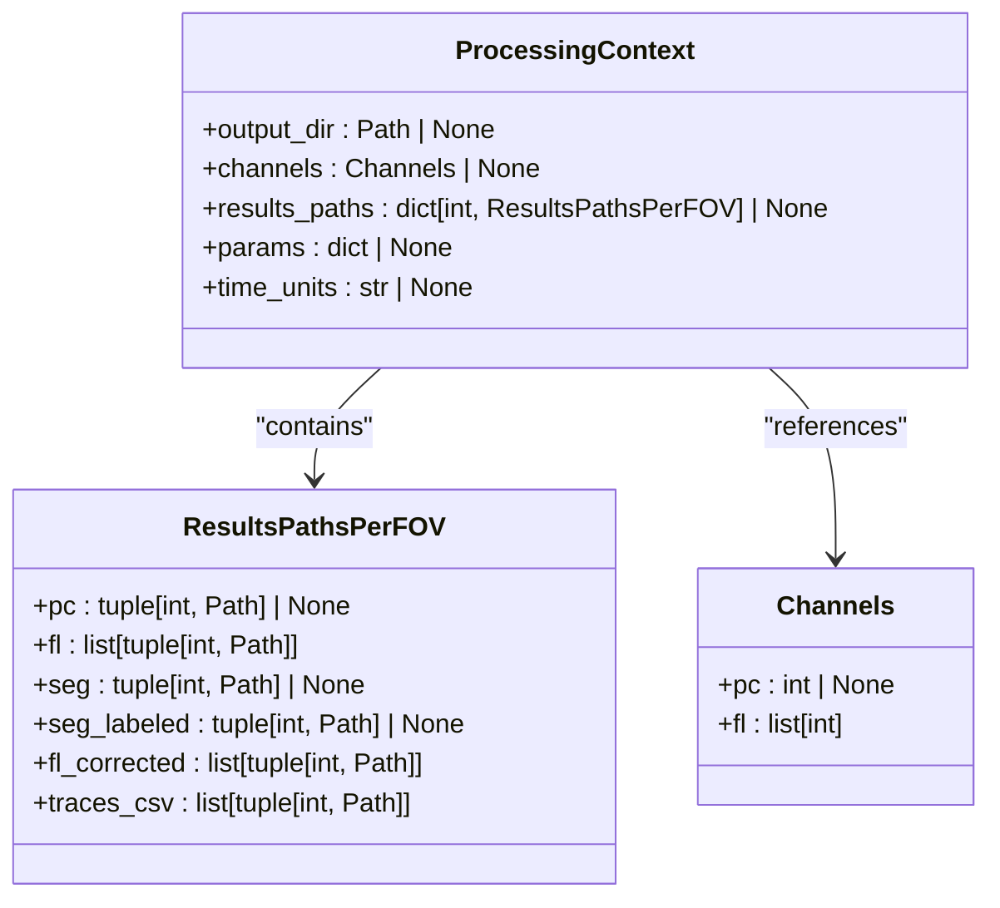

# Batch Operations

<cite>
**Referenced Files in This Document**   
- [pipeline.py](file://pyama-core/src/pyama_core/processing/workflow/pipeline.py)
- [types.py](file://pyama-core/src/pyama_core/processing/workflow/services/types.py)
- [microscopy.py](file://pyama-core/src/pyama_core/io/microscopy.py)
- [copying.py](file://pyama-core/src/pyama_core/processing/workflow/services/copying.py)
- [segmentation.py](file://pyama-core/src/pyama_core/processing/workflow/services/steps/segmentation.py)
- [correction.py](file://pyama-core/src/pyama_core/processing/workflow/services/steps/correction.py)
- [tracking.py](file://pyama-core/src/pyama_core/processing/workflow/services/steps/tracking.py)
- [extraction.py](file://pyama-core/src/pyama_core/processing/workflow/services/steps/extraction.py)
- [results_yaml.py](file://pyama-core/src/pyama_core/io/results_yaml.py)
- [analysis_csv.py](file://pyama-core/src/pyama_core/io/analysis_csv.py)
</cite>

## Table of Contents
1. [Introduction](#introduction)
2. [Batch Configuration and Data Flow](#batch-configuration-and-data-flow)
3. [Core Batch Processing Workflow](#core-batch-processing-workflow)
4. [Results Management and Aggregation](#results-management-and-aggregation)
5. [Error Isolation and Fault Tolerance](#error-isolation-and-fault-tolerance)
6. [High-Throughput Processing Patterns](#high-throughput-processing-patterns)
7. [Parameter Input and Result Export Integration](#parameter-input-and-result-export-integration)
8. [Performance Optimization Guidelines](#performance-optimization-guidelines)
9. [Conclusion](#conclusion)

## Introduction
This document details the batch operations functionality in PyAMA, focusing on the `run_complete_workflow` function that enables processing multiple fields of view (FOVs) or datasets in sequence with consistent parameters. The system is designed for high-throughput microscopy analysis, allowing researchers to process large volumes of imaging data efficiently while maintaining data integrity and reproducibility.

The batch processing system orchestrates a complete analysis pipeline across multiple FOVs, managing data flow from initial configuration through iterative execution to final result aggregation. It supports parallel processing with configurable worker allocation, progress tracking, and robust error handling to ensure reliable operation even with large datasets.

**Section sources**
- [pipeline.py](file://pyama-core/src/pyama_core/processing/workflow/pipeline.py#L279-L478)

## Batch Configuration and Data Flow
The batch processing workflow begins with configuration parameters that define the scope and execution strategy for the analysis. The `run_complete_workflow` function accepts key parameters including `fov_start`, `fov_end`, `batch_size`, and `n_workers` that control which FOVs are processed and how computational resources are allocated.

Data flow begins with the `MicroscopyMetadata` object that contains essential information about the microscopy file including the number of FOVs (`n_fovs`), dimensions, and channel information. This metadata is used to validate the requested FOV range and ensure it falls within the available data boundaries.

The processing context, represented by the `ProcessingContext` class, carries configuration parameters and state throughout the workflow. It includes the output directory, channel specifications, and a results path registry that tracks file locations for each FOV's processed data.

**Diagram sources**
- [pipeline.py](file://pyama-core/src/pyama_core/processing/workflow/pipeline.py#L279-L478)
- [types.py](file://pyama-core/src/pyama_core/processing/workflow/services/types.py#L25-L30)
- [microscopy.py](file://pyama-core/src/pyama_core/io/microscopy.py#L11-L24)

**Section sources**
- [pipeline.py](file://pyama-core/src/pyama_core/processing/workflow/pipeline.py#L279-L478)
- [types.py](file://pyama-core/src/pyama_core/processing/workflow/services/types.py#L25-L30)
- [microscopy.py](file://pyama-core/src/pyama_core/io/microscopy.py#L11-L24)

## Core Batch Processing Workflow
The `run_complete_workflow` function implements a sophisticated batch processing strategy that divides the work into manageable batches and processes them in parallel using multiple worker processes. The workflow begins by validating the FOV range and computing batch divisions based on the specified `batch_size`.

Each batch is processed through a series of pipeline steps: copying, segmentation, correction, tracking, and extraction. The system first copies raw microscopy data for the batch FOVs to the output directory using the `CopyingService`. This step ensures that subsequent processing steps can access the data efficiently, particularly when working with large files.

After data copying, the system launches parallel worker processes using Python's `ProcessPoolExecutor`. Each worker is assigned a range of FOVs to process through the complete pipeline. The number of workers is controlled by the `n_workers` parameter, allowing users to optimize resource utilization based on their hardware capabilities.

**Diagram sources**
- [pipeline.py](file://pyama-core/src/pyama_core/processing/workflow/pipeline.py#L279-L478)
- [copying.py](file://pyama-core/src/pyama_core/processing/workflow/services/copying.py#L23-L98)

**Section sources**
- [pipeline.py](file://pyama-core/src/pyama_core/processing/workflow/pipeline.py#L279-L478)
- [copying.py](file://pyama-core/src/pyama_core/processing/workflow/services/copying.py#L23-L98)

## Results Management and Aggregation
Results are managed at both the individual FOV level and the aggregate project level using the `ResultsPathsPerFOV` class. This data structure tracks file paths for each type of processed data (phase contrast, fluorescence, segmentation masks, corrected fluorescence, and trace CSVs) for each FOV, enabling efficient organization and retrieval of results.

The `ProcessingContext` maintains a dictionary of `ResultsPathsPerFOV` entries, with each FOV as a key. As each processing step completes, it records the output file paths in this structure, creating a comprehensive map of all generated data. This approach allows subsequent steps to locate required input files without recomputing paths.

At the completion of all batches, the system aggregates results by merging the contexts from all worker processes into the parent context using the `_merge_contexts` function. This merging process combines output directories, channel information, parameters, and results paths while avoiding duplicates. The final merged context is then serialized to a `processing_results.yaml` file in the output directory, providing a persistent record of the entire analysis.

**Diagram sources**
- [types.py](file://pyama-core/src/pyama_core/processing/workflow/services/types.py#L15-L21)
- [types.py](file://pyama-core/src/pyama_core/processing/workflow/services/types.py#L25-L30)

**Section sources**
- [types.py](file://pyama-core/src/pyama_core/processing/workflow/services/types.py#L15-L30)
- [pipeline.py](file://pyama-core/src/pyama_core/processing/workflow/pipeline.py#L71-L140)

## Error Isolation and Fault Tolerance
The batch processing system implements robust error handling to ensure that failures in one batch item do not compromise the entire workflow. Each worker process operates in isolation, and exceptions are caught and reported without terminating the entire pipeline.

The `run_complete_workflow` function uses a try-except block to catch any exceptions that occur during processing. If an error occurs during batch data copying, the function logs the error and returns `False` immediately, preventing further processing of corrupted data. For errors that occur within worker processes, the system catches the exception, logs the error with the affected FOV range, but continues processing other batches.

Each processing step within a worker also implements error isolation. For example, the `CopyingService` checks for existing output files and skips processing if the output already exists, preventing unnecessary computation and potential conflicts. Similarly, other services like `SegmentationService`, `CorrectionService`, `TrackingService`, and `ExtractionService` all check for existing outputs and skip processing when appropriate.

The progress reporting system is designed to be fault-tolerant, with try-except blocks around all progress reporting calls to ensure that reporting failures do not interrupt the main processing workflow. This design allows the system to continue operating even when progress reporting encounters issues.

**Section sources**
- [pipeline.py](file://pyama-core/src/pyama_core/processing/workflow/pipeline.py#L279-L478)
- [copying.py](file://pyama-core/src/pyama_core/processing/workflow/services/copying.py#L23-L98)
- [segmentation.py](file://pyama-core/src/pyama_core/processing/workflow/services/steps/segmentation.py#L25-L124)
- [correction.py](file://pyama-core/src/pyama_core/processing/workflow/services/steps/correction.py#L25-L146)
- [tracking.py](file://pyama-core/src/pyama_core/processing/workflow/services/steps/tracking.py#L25-L125)
- [extraction.py](file://pyama-core/src/pyama_core/processing/workflow/services/steps/extraction.py#L25-L132)

## High-Throughput Processing Patterns
The system is optimized for high-throughput experiments through several key design patterns. The batch processing approach with configurable batch size allows users to balance memory usage and processing efficiency. Smaller batch sizes reduce memory footprint but may increase overhead, while larger batch sizes improve throughput but require more memory.

Memory management is handled through the use of memory-mapped files (memmaps) for large image data. Services like `CopyingService`, `SegmentationService`, and others use `open_memmap` to create memory-mapped arrays that allow efficient access to large datasets without loading them entirely into RAM. This approach enables processing of datasets that exceed available memory capacity.

Progress tracking is implemented through a lightweight drainer thread that collects progress events from worker processes via a shared queue. This design minimizes the performance impact of progress reporting while providing real-time feedback on processing status. The progress information includes the current step, FOV, time point, and descriptive message, allowing users to monitor the workflow's progress.

The parallel processing architecture leverages multiple CPU cores through the `ProcessPoolExecutor`, with the number of workers configurable via the `n_workers` parameter. This allows users to optimize performance based on their specific hardware configuration, taking full advantage of multi-core systems for computationally intensive tasks like image processing and analysis.

**Section sources**
- [pipeline.py](file://pyama-core/src/pyama_core/processing/workflow/pipeline.py#L279-L478)
- [base.py](file://pyama-core/src/pyama_core/processing/workflow/services/base.py#L15-L83)
- [copying.py](file://pyama-core/src/pyama_core/processing/workflow/services/copying.py#L23-L98)

## Parameter Input and Result Export Integration
The system integrates with external configuration formats to enable reproducible batch analyses. While the core processing functions accept parameters directly, the UI layer (in pyama-qt) provides interfaces for loading batch parameters from CSV and YAML files, allowing users to define and save analysis configurations.

For result export, the system writes processed data in standardized formats that can be easily consumed by downstream analysis tools. The `analysis_csv.py` module defines utilities for writing and reading analysis CSV files that follow a specific format with time as the index and cell IDs as columns. This format includes optional time unit information in comment headers, ensuring that temporal data is properly interpreted.

The `results_yaml.py` module provides comprehensive support for discovering, loading, and writing processing results in YAML format. The `processing_results.yaml` file serves as a central manifest that documents all generated files, their locations, and associated metadata. This file enables reproducible analyses by capturing the complete state of the processing pipeline.

The system also implements path correction logic in the YAML loading functions to handle cases where data folders have been moved. This ensures that file references remain valid even when the directory structure changes, enhancing the portability and reproducibility of analyses.

**Section sources**
- [results_yaml.py](file://pyama-core/src/pyama_core/io/results_yaml.py#L0-L295)
- [analysis_csv.py](file://pyama-core/src/pyama_core/io/analysis_csv.py#L0-L164)
- [pipeline.py](file://pyama-core/src/pyama_core/processing/workflow/pipeline.py#L279-L478)

## Performance Optimization Guidelines
To optimize batch processing performance, users should consider several factors related to their specific hardware and data characteristics. The optimal batch size and worker allocation depend on available memory, storage speed, and CPU core count.

For memory management, users should set the batch size based on available RAM. As a general guideline, the batch size should be chosen so that the total memory required for all worker processes does not exceed 70-80% of available RAM to avoid excessive swapping. For systems with limited memory, smaller batch sizes (1-2) with fewer workers may be necessary.

For CPU utilization, the number of workers should generally match the number of available CPU cores for CPU-intensive tasks like segmentation and tracking. However, if the storage system is a bottleneck (e.g., slow HDD), using fewer workers may actually improve performance by reducing disk I/O contention.

Storage configuration significantly impacts performance. SSD storage provides much faster I/O than traditional HDDs, particularly for random access patterns common in image processing. When using network storage, local caching or processing on a machine with direct storage access is recommended to minimize latency.

The system's use of memory-mapped files means that sufficient disk space for temporary files is essential. Users should ensure that the output directory has sufficient space to store all processed data, which may be several times larger than the raw input data depending on the analysis steps performed.

**Section sources**
- [pipeline.py](file://pyama-core/src/pyama_core/processing/workflow/pipeline.py#L279-L478)
- [copying.py](file://pyama-core/src/pyama_core/processing/workflow/services/copying.py#L23-L98)
- [base.py](file://pyama-core/src/pyama_core/processing/workflow/services/base.py#L15-L83)

## Conclusion
The batch operations functionality in PyAMA provides a robust, scalable framework for high-throughput microscopy analysis. By implementing a well-structured pipeline with configurable batch processing, parallel execution, and comprehensive error handling, the system enables researchers to efficiently process large datasets while maintaining data integrity and reproducibility.

The integration of standardized input and output formats (CSV, YAML) enhances the system's usability and ensures that analyses can be reproduced and shared across different environments. The careful management of resources through memory mapping and configurable worker allocation allows the system to adapt to various hardware configurations, from desktop workstations to high-performance computing environments.

Future enhancements could include dynamic batch sizing based on system load, more sophisticated load balancing across workers, and enhanced progress visualization to provide users with more detailed insights into the processing workflow.