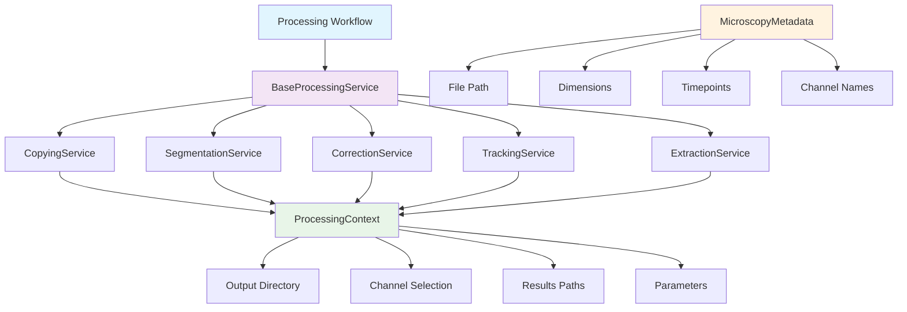
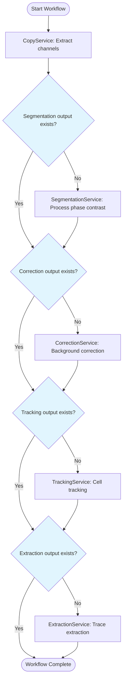
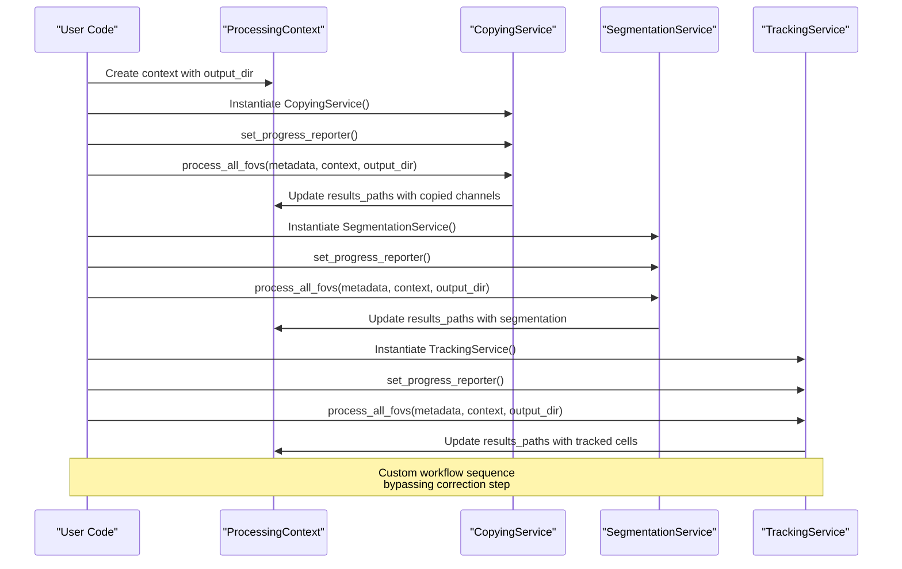
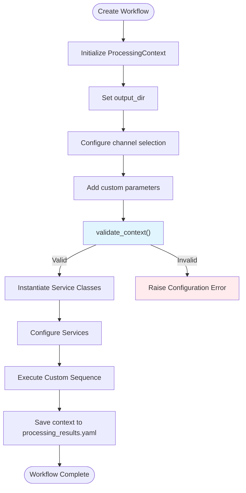
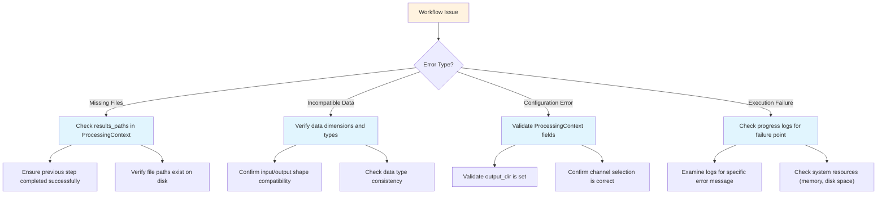

# Custom Workflows

<cite>
**Referenced Files in This Document**   
- [base.py](file://pyama-core/src/pyama_core/processing/workflow/services/base.py)
- [copying.py](file://pyama-core/src/pyama_core/processing/workflow/services/copying.py)
- [segmentation.py](file://pyama-core/src/pyama_core/processing/workflow/services/steps/segmentation.py)
- [correction.py](file://pyama-core/src/pyama_core/processing/workflow/services/steps/correction.py)
- [tracking.py](file://pyama-core/src/pyama_core/processing/workflow/services/steps/tracking.py)
- [extraction.py](file://pyama-core/src/pyama_core/processing/workflow/services/steps/extraction.py)
- [types.py](file://pyama-core/src/pyama_core/processing/workflow/services/types.py)
- [pipeline.py](file://pyama-core/src/pyama_core/processing/workflow/pipeline.py)
- [microscopy.py](file://pyama-core/src/pyama_core/io/microscopy.py)
</cite>

## Table of Contents
1. [Introduction](#introduction)
2. [Service-Oriented Architecture](#service-oriented-architecture)
3. [Base Service Class and Step Implementation](#base-service-class-and-step-implementation)
4. [Conditional Execution and Step Skipping](#conditional-execution-and-step-skipping)
5. [Creating Custom Processing Sequences](#creating-custom-processing-sequences)
6. [Data Compatibility and Context Management](#data-compatibility-and-context-management)
7. [Configuration and Parameter Validation](#configuration-and-parameter-validation)
8. [Troubleshooting Common Issues](#troubleshooting-common-issues)

## Introduction
This document details the custom workflow creation capabilities within the PyAMA framework. The system is designed around a service-oriented architecture that enables flexible composition of image processing steps including correction, segmentation, tracking, and extraction. Users and developers can selectively invoke individual processing steps outside the standard pipeline, create non-standard analysis paths, and maintain compatibility with downstream modules through a robust context management system.

## Service-Oriented Architecture
The processing workflow is built on a service-oriented architecture where each analysis step is implemented as an independent service class. This design enables flexible composition and reusability of processing components. Services are organized in a hierarchical structure with a base class defining the common interface and specific step implementations extending this base.

The architecture supports both sequential execution through the standard pipeline and ad-hoc invocation of individual services. Each service operates on microscopy data and maintains state through a shared processing context that tracks intermediate results and configuration parameters.



**Diagram sources**
- [base.py](file://pyama-core/src/pyama_core/processing/workflow/services/base.py#L15-L83)
- [types.py](file://pyama-core/src/pyama_core/processing/workflow/services/types.py#L9-L30)
- [microscopy.py](file://pyama-core/src/pyama_core/io/microscopy.py#L11-L24)

**Section sources**
- [base.py](file://pyama-core/src/pyama_core/processing/workflow/services/base.py#L15-L83)
- [types.py](file://pyama-core/src/pyama_core/processing/workflow/services/types.py#L9-L30)

## Base Service Class and Step Implementation
The foundation of the workflow system is the `BaseProcessingService` class which defines the common interface for all processing steps. This base class provides essential functionality including progress reporting, error handling, and the standard processing interface.

Each specific processing step (segmentation, correction, tracking, extraction) implements its own service class that inherits from `BaseProcessingService`. These service classes can be invoked independently of the standard pipeline, allowing for flexible workflow composition.

```mermaid
classDiagram
class BaseProcessingService {
+str name
+set_progress_reporter(reporter)
+progress_callback(f, t, T, message)
+process_fov(metadata, context, output_dir, fov)
+process_all_fovs(metadata, context, output_dir, fov_start, fov_end)
}
class SegmentationService {
+process_fov(metadata, context, output_dir, fov)
}
class CorrectionService {
+process_fov(metadata, context, output_dir, fov)
}
class TrackingService {
+process_fov(metadata, context, output_dir, fov)
}
class ExtractionService {
+process_fov(metadata, context, output_dir, fov)
}
class CopyingService {
+process_fov(metadata, context, output_dir, fov)
}
BaseProcessingService <|-- SegmentationService
BaseProcessingService <|-- CorrectionService
BaseProcessingService <|-- TrackingService
BaseProcessingService <|-- ExtractionService
BaseProcessingService <|-- CopyingService
note right of BaseProcessingService
Abstract base class defining
common interface for all
processing services
end note
```

**Diagram sources**
- [base.py](file://pyama-core/src/pyama_core/processing/workflow/services/base.py#L15-L83)
- [segmentation.py](file://pyama-core/src/pyama_core/processing/workflow/services/steps/segmentation.py#L25-L124)
- [correction.py](file://pyama-core/src/pyama_core/processing/workflow/services/steps/correction.py#L25-L146)
- [tracking.py](file://pyama-core/src/pyama_core/processing/workflow/services/steps/tracking.py#L25-L125)
- [extraction.py](file://pyama-core/src/pyama_core/processing/workflow/services/steps/extraction.py#L25-L132)
- [copying.py](file://pyama-core/src/pyama_core/processing/workflow/services/copying.py#L23-L98)

**Section sources**
- [base.py](file://pyama-core/src/pyama_core/processing/workflow/services/base.py#L15-L83)

## Conditional Execution and Step Skipping
The pipeline implementation in `pipeline.py` demonstrates conditional execution and step skipping based on the presence of intermediate files. Each service checks whether its output already exists before performing processing, allowing the workflow to resume from the last completed step.

The `run_complete_workflow` function orchestrates the execution of multiple services in sequence, with each step being conditionally executed based on the processing context and existing output files. This design prevents redundant computation and enables partial workflow execution.



**Diagram sources**
- [pipeline.py](file://pyama-core/src/pyama_core/processing/workflow/pipeline.py#L279-L478)
- [segmentation.py](file://pyama-core/src/pyama_core/processing/workflow/services/steps/segmentation.py#L25-L124)
- [correction.py](file://pyama-core/src/pyama_core/processing/workflow/services/steps/correction.py#L25-L146)

**Section sources**
- [pipeline.py](file://pyama-core/src/pyama_core/processing/workflow/pipeline.py#L279-L478)

## Creating Custom Processing Sequences
Users and developers can create custom processing sequences by programmatically chaining service instances. This enables non-standard analysis paths that deviate from the default workflow. Services can be instantiated and invoked independently, allowing for flexible composition of processing steps.

To create a custom sequence, instantiate the desired service classes and call their `process_all_fovs` method with appropriate parameters. The shared `ProcessingContext` ensures that intermediate results are properly tracked and made available to subsequent steps.



**Diagram sources**
- [pipeline.py](file://pyama-core/src/pyama_core/processing/workflow/pipeline.py#L179-L276)
- [base.py](file://pyama-core/src/pyama_core/processing/workflow/services/base.py#L55-L83)
- [types.py](file://pyama-core/src/pyama_core/processing/workflow/services/types.py#L25-L30)

**Section sources**
- [pipeline.py](file://pyama-core/src/pyama_core/processing/workflow/pipeline.py#L179-L276)

## Data Compatibility and Context Management
The system maintains data compatibility between custom step sequences and downstream analysis modules through the `ProcessingContext` object. This context tracks the state of processing, including output directories, channel selections, and file paths for intermediate results.

The `ResultsPathsPerFOV` class within the context stores references to output files for each field of view, ensuring that subsequent steps can locate required inputs. This centralized context management enables seamless integration between custom workflows and standard analysis modules.

```mermaid
classDiagram
class ProcessingContext {
+Path output_dir
+Channels channels
+dict[int, ResultsPathsPerFOV] results_paths
+dict params
+str time_units
}
class ResultsPathsPerFOV {
+tuple[int, Path] pc
+list[tuple[int, Path]] fl
+tuple[int, Path] seg
+tuple[int, Path] seg_labeled
+list[tuple[int, Path]] fl_corrected
+list[tuple[int, Path]] traces_csv
}
class Channels {
+int pc
+list[int] fl
}
ProcessingContext --> ResultsPathsPerFOV : "contains"
ProcessingContext --> Channels : "contains"
note right of ProcessingContext
Central state object that maintains<br/>compatibility across workflow steps
end note
```

**Diagram sources**
- [types.py](file://pyama-core/src/pyama_core/processing/workflow/services/types.py#L25-L30)
- [types.py](file://pyama-core/src/pyama_core/processing/workflow/services/types.py#L15-L21)
- [types.py](file://pyama-core/src/pyama_core/processing/workflow/services/types.py#L9-L11)

**Section sources**
- [types.py](file://pyama-core/src/pyama_core/processing/workflow/services/types.py#L25-L30)

## Configuration and Parameter Validation
Configuration management for custom workflows is handled through the `ProcessingContext` object and service-specific parameters. The system validates parameters and ensures proper configuration before executing processing steps.

The `ensure_context` and `ensure_results_paths_entry` functions provide validation and initialization of the processing context, ensuring that required fields are properly set before use. Parameter validation occurs at the service level, with each step validating its specific requirements before processing.



**Diagram sources**
- [types.py](file://pyama-core/src/pyama_core/processing/workflow/services/types.py#L37-L54)
- [types.py](file://pyama-core/src/pyama_core/processing/workflow/services/types.py#L33-L34)
- [pipeline.py](file://pyama-core/src/pyama_core/processing/workflow/pipeline.py#L71-L140)

**Section sources**
- [types.py](file://pyama-core/src/pyama_core/processing/workflow/services/types.py#L37-L54)

## Troubleshooting Common Issues
Common issues in custom workflow execution typically involve missing intermediate files or incompatible outputs between steps. The system provides several mechanisms to diagnose and resolve these issues.

When encountering missing intermediate files, verify that the processing context is properly maintained between service invocations. Check that the `results_paths` dictionary contains the expected file references after each step. For incompatible outputs, ensure that data formats and dimensions match between consecutive steps.

The progress reporting system can help identify where workflows fail, with detailed logging indicating the specific step and field of view where issues occur. The processing context is persisted to `processing_results.yaml`, enabling inspection of workflow state after execution.



**Diagram sources**
- [base.py](file://pyama-core/src/pyama_core/processing/workflow/services/base.py#L46-L53)
- [types.py](file://pyama-core/src/pyama_core/processing/workflow/services/types.py#L25-L30)
- [pipeline.py](file://pyama-core/src/pyama_core/processing/workflow/pipeline.py#L279-L478)

**Section sources**
- [base.py](file://pyama-core/src/pyama_core/processing/workflow/services/base.py#L46-L53)