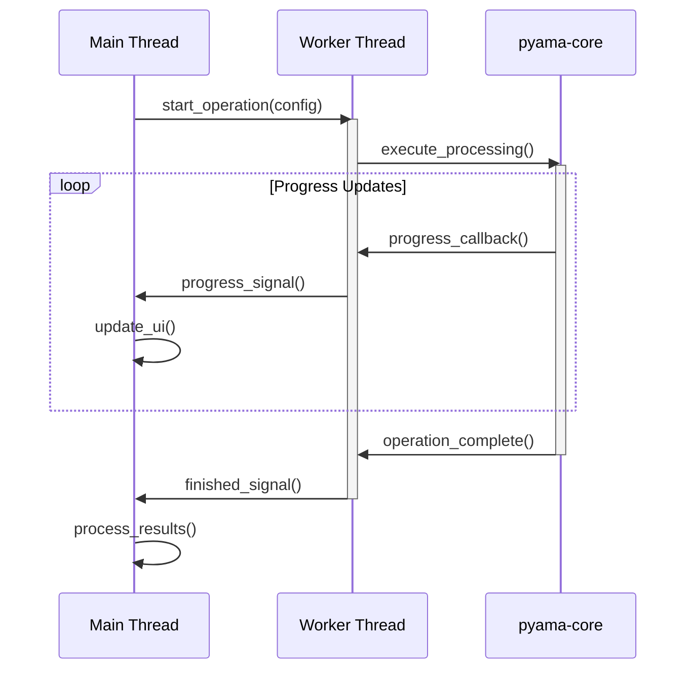
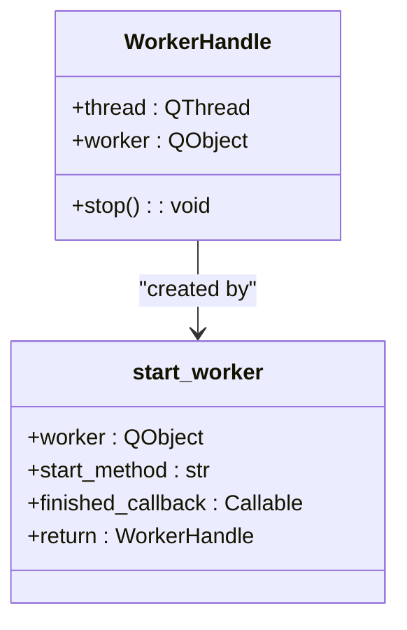
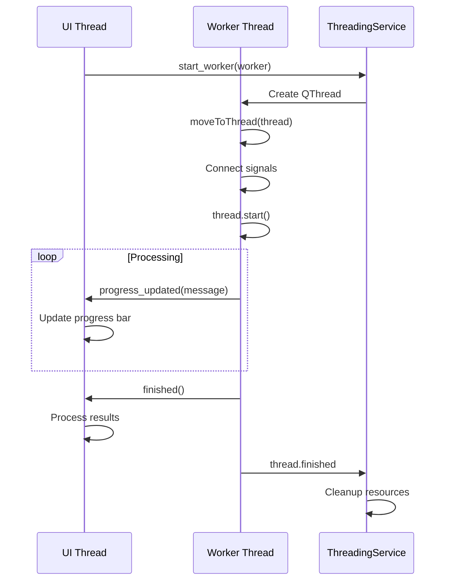

# Parallel Processing

<cite>
**Referenced Files in This Document**   
- [threading.py](file://pyama-qt/src/pyama_qt/services/threading.py)
- [base.py](file://pyama-core/src/pyama_core/processing/workflow/services/base.py)
- [pipeline.py](file://pyama-core/src/pyama_core/processing/workflow/pipeline.py)
- [iou.py](file://pyama-core/src/pyama_core/processing/tracking/iou.py)
- [analysis/controller.py](file://pyama-qt/src/pyama_qt/analysis/controller.py)
- [processing/controller.py](file://pyama-qt/src/pyama_qt/processing/controller.py)
</cite>

## Table of Contents
1. [Introduction](#introduction)
2. [Worker Thread Architecture](#worker-thread-architecture)
3. [Threading Service Implementation](#threading-service-implementation)
4. [Task Execution and Lifecycle Management](#task-execution-and-lifecycle-management)
5. [Signal-Slot Communication](#signal-slot-communication)
6. [Progress Reporting and Callback Integration](#progress-reporting-and-callback-integration)
7. [Exception Handling and Error Propagation](#exception-handling-and-error-propagation)
8. [Thread Pool Configuration and Worker Management](#thread-pool-configuration-and-worker-management)
9. [Integration with Qt Event Loop](#integration-with-qt-event-loop)
10. [Common Threading Issues and Solutions](#common-threading-issues-and-solutions)
11. [Performance Considerations](#performance-considerations)
12. [Best Practices for Monitoring and Debugging](#best-practices-for-monitoring-and-debugging)

## Introduction
The PyAMA application implements a robust parallel processing system to handle computationally intensive tasks such as image segmentation, cell tracking, and data fitting without blocking the user interface. This document details the implementation of the worker thread pattern using QThread and worker objects, the ThreadingService for thread pool management, and the integration between background tasks and the Qt event loop. The system is designed to prevent UI freezing during long-running operations while ensuring safe communication between threads and proper resource cleanup.

## Worker Thread Architecture

The parallel processing system in PyAMA follows a worker thread pattern where background tasks are executed in dedicated QThread instances. This architecture separates CPU-intensive operations from the main UI thread, maintaining application responsiveness. The system employs worker objects that are moved to separate threads and communicate with the main thread through Qt's signal-slot mechanism.

**Diagram sources**
- [threading.py](file://pyama-qt/src/pyama_qt/services/threading.py#L1-L92)

**Section sources**
- [threading.py](file://pyama-qt/src/pyama_qt/services/threading.py#L1-L92)

## Threading Service Implementation

The threading service is implemented through the `start_worker` function and `WorkerHandle` class in `threading.py`. This service provides a clean abstraction for managing worker threads, handling thread creation, worker movement, signal connections, and safe cleanup.

The `start_worker` function creates a new QThread, moves the worker object to this thread, and connects the thread's started signal to the worker's processing method. It also establishes proper cleanup connections to ensure thread and worker objects are properly deleted when operations complete.

**Diagram sources**
- [threading.py](file://pyama-qt/src/pyama_qt/services/threading.py#L9-L56)
- [threading.py](file://pyama-qt/src/pyama_qt/services/threading.py#L59-L91)

**Section sources**
- [threading.py](file://pyama-qt/src/pyama_qt/services/threading.py#L1-L92)

## Task Execution and Lifecycle Management

Worker lifecycle management is handled through the `WorkerHandle` class, which provides a safe interface for controlling worker threads. The `stop` method implements a graceful shutdown sequence that first attempts to cancel the worker operation, disconnects signals to prevent crashes, requests thread interruption, and ensures proper cleanup of thread and worker objects.

The lifecycle follows a well-defined sequence:
1. Worker creation and configuration in the main thread
2. Thread creation and worker movement via `start_worker`
3. Automatic connection of thread started signal to worker's processing method
4. Execution of the worker's task in the background thread
5. Signal emission upon completion or error
6. Automatic cleanup of thread and worker objects

This pattern ensures that workers cannot be accidentally left running and that resources are properly released even if operations are cancelled or encounter errors.

**Section sources**
- [threading.py](file://pyama-qt/src/pyama_qt/services/threading.py#L24-L56)

## Signal-Slot Communication

The system uses Qt's signal-slot mechanism for thread-safe communication between worker threads and the main UI thread. Workers emit signals to report progress, completion, and errors, which are automatically marshaled to the main thread by Qt's event system.

Key signals used in the implementation include:
- `progress_updated`: Reports processing progress with status messages
- `finished`: Indicates successful completion of the worker task
- `error_occurred`: Communicates error conditions to the main thread
- `file_processed`: Reports successful processing of individual files

These signals are connected to appropriate slots in the main thread, allowing UI updates and result processing to occur safely without direct cross-thread method calls.

**Diagram sources**
- [threading.py](file://pyama-qt/src/pyama_qt/services/threading.py#L59-L91)
- [controller.py](file://pyama-qt/src/pyama_qt/analysis/controller.py#L55-L82)

**Section sources**
- [threading.py](file://pyama-qt/src/pyama_qt/services/threading.py#L1-L92)
- [analysis/controller.py](file://pyama-qt/src/pyama_qt/analysis/controller.py#L55-L82)

## Progress Reporting and Callback Integration

Progress reporting is implemented through a combination of Qt signals and callback functions that bridge the pyama-core processing functions with the Qt UI layer. The system follows a pattern where core processing functions accept progress callback parameters, which are then connected to Qt signals for UI updates.

In the analysis workflow, the `_AnalysisWorker` class creates a progress callback function that follows the same pattern as the pyama-core implementation, reporting progress every 30 cells or on completion. This callback is passed to the `fit_trace_data` function, which calls it during processing. The worker then emits Qt signals that are handled by the main thread to update the UI.

For segmentation and tracking operations, the `BaseProcessingService` class in pyama-core implements a `progress_callback` method that emits events through an injected progress reporter. This reporter is connected to a multiprocessing queue in the `run_complete_workflow` function, allowing progress events to be communicated from worker processes to the main application.

**Section sources**
- [base.py](file://pyama-core/src/pyama_core/processing/workflow/services/base.py#L29-L44)
- [analysis/controller.py](file://pyama-qt/src/pyama_qt/analysis/controller.py#L155-L234)

## Exception Handling and Error Propagation

The system implements robust exception handling to ensure errors in worker threads are safely propagated to the main thread without crashing the application. Exceptions are caught in worker methods and communicated through dedicated error signals rather than being allowed to propagate up the call stack.

The `_AnalysisWorker.process_data` method uses a top-level try-except block to catch any unhandled exceptions, logging them and emitting an `error_occurred` signal with the error message. This pattern ensures that even unexpected errors are handled gracefully and communicated to the user interface.

For operations that may be cancelled by the user, the system implements cancellation checks at appropriate intervals. The `_is_cancelled` flag is checked during long-running loops, allowing workers to terminate gracefully when requested. The `WorkerHandle.stop` method also attempts to call a `cancel` method on the worker if it exists, providing a cooperative cancellation mechanism.

**Section sources**
- [analysis/controller.py](file://pyama-qt/src/pyama_qt/analysis/controller.py#L155-L234)
- [threading.py](file://pyama-qt/src/pyama_qt/services/threading.py#L24-L56)

## Thread Pool Configuration and Worker Management

While the current implementation creates individual threads for each worker, the system is designed to support thread pooling through the `n_workers` parameter in workflow operations. The `run_complete_workflow` function in pyama-core accepts an `n_workers` parameter that controls the number of parallel processes used for batch processing.

The workflow system splits FOV (field of view) processing into batches and further divides these batches into worker ranges based on the specified number of workers. Each worker range is processed by a separate process in a `ProcessPoolExecutor`, allowing true parallel execution on multiple CPU cores.

The `_split_worker_ranges` function divides FOV indices into contiguous, evenly sized ranges for distribution among workers. This ensures balanced workload distribution and efficient utilization of available CPU resources. The system also implements a progress queue using a multiprocessing Manager to collect progress events from worker processes and report them back to the main application.

**Section sources**
- [pipeline.py](file://pyama-core/src/pyama_core/processing/workflow/pipeline.py#L46-L68)
- [pipeline.py](file://pyama-core/src/pyama_core/processing/workflow/pipeline.py#L279-L478)

## Integration with Qt Event Loop

The parallel processing system is fully integrated with the Qt event loop, ensuring that all UI updates occur on the main thread while background operations run independently. The signal-slot mechanism automatically marshals signals from worker threads to the main thread, where they are processed during the normal event loop cycle.

This integration allows the application to remain responsive during long-running operations, with progress updates, completion notifications, and error messages being handled asynchronously. The event-driven nature of Qt ensures that UI updates are performed safely and efficiently, without the need for manual thread synchronization.

The system also handles thread cleanup through the event loop, with `deleteLater` calls scheduled for thread and worker objects when operations complete. This defers cleanup to the main thread, preventing potential race conditions and ensuring that object deletion occurs at a safe time during the event processing cycle.

**Section sources**
- [threading.py](file://pyama-qt/src/pyama_qt/services/threading.py#L1-L92)
- [analysis/controller.py](file://pyama-qt/src/pyama_qt/analysis/controller.py#L55-L82)

## Common Threading Issues and Solutions

The implementation addresses several common threading issues:

**Race Conditions**: Prevented through the use of thread-safe signal-slot communication and proper synchronization. The system avoids shared mutable state between threads, instead using message passing through signals and queues.

**Thread Affinity Errors**: Addressed by ensuring that all UI operations occur on the main thread. Worker objects are moved to background threads using `moveToThread`, and any attempts to access UI elements from worker threads would result in runtime errors that are caught by Qt's object ownership system.

**Memory Leaks**: Mitigated through the `WorkerHandle.stop` method, which ensures proper cleanup of thread and worker objects. The use of `deleteLater` schedules object deletion in the event loop, preventing premature deletion while ensuring resources are eventually freed.

**Graceful Shutdown**: Implemented through the cooperative cancellation pattern, where workers periodically check a cancellation flag and terminate their operations cleanly. The `stop` method also implements a timeout mechanism, forcing thread termination if a graceful shutdown does not complete within one second.

**Section sources**
- [threading.py](file://pyama-qt/src/pyama_qt/services/threading.py#L24-L56)
- [analysis/controller.py](file://pyama-qt/src/pyama_qt/analysis/controller.py#L155-L234)

## Performance Considerations

The system provides several parameters for tuning performance based on available hardware and dataset characteristics:

- **Number of Workers**: Configured through the `n_workers` parameter, typically set to match the number of CPU cores for optimal parallelization of CPU-bound tasks like segmentation and tracking.
- **Batch Size**: Controlled by the `batch_size` parameter, which determines how many FOVs are processed together before results are merged. Larger batches reduce overhead but increase memory usage.
- **Progress Reporting Frequency**: Optimized to report progress every 30 operations or on completion, balancing UI responsiveness with processing overhead.

For large datasets, the system can be configured with more workers to fully utilize multi-core processors. However, there are diminishing returns beyond the number of physical CPU cores due to memory bandwidth limitations and I/O constraints. The batch size should be tuned based on available RAM, as each batch requires memory for intermediate results.

**Section sources**
- [pipeline.py](file://pyama-core/src/pyama_core/processing/workflow/pipeline.py#L279-L478)

## Best Practices for Monitoring and Debugging

The system includes several features to facilitate monitoring and debugging of threaded operations:

- **Comprehensive Logging**: All worker operations are logged with detailed progress information, including FOV indices, processing steps, and completion status.
- **Progress Events**: Structured event objects containing step, FOV, progress counters, and messages are passed from workers to the main application for monitoring.
- **Error Tracing**: Full exception tracebacks are logged for debugging purposes, while user-friendly error messages are displayed in the UI.
- **Resource Monitoring**: The `WorkerHandle` class provides explicit control over thread lifecycle, making it easier to track active workers and prevent resource leaks.

When debugging threaded applications, it is recommended to:
1. Use the logging system to trace the sequence of operations
2. Monitor signal emissions to verify communication between threads
3. Check for proper cleanup of worker threads using the `WorkerHandle`
4. Test cancellation scenarios to ensure graceful shutdown
5. Verify that all UI updates occur on the main thread

**Section sources**
- [pipeline.py](file://pyama-core/src/pyama_core/processing/workflow/pipeline.py#L353-L384)
- [base.py](file://pyama-core/src/pyama_core/processing/workflow/services/base.py#L29-L44)