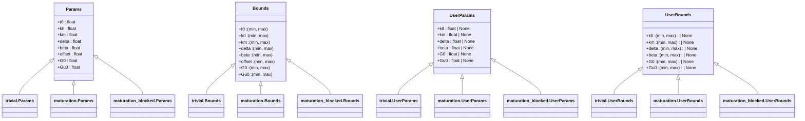
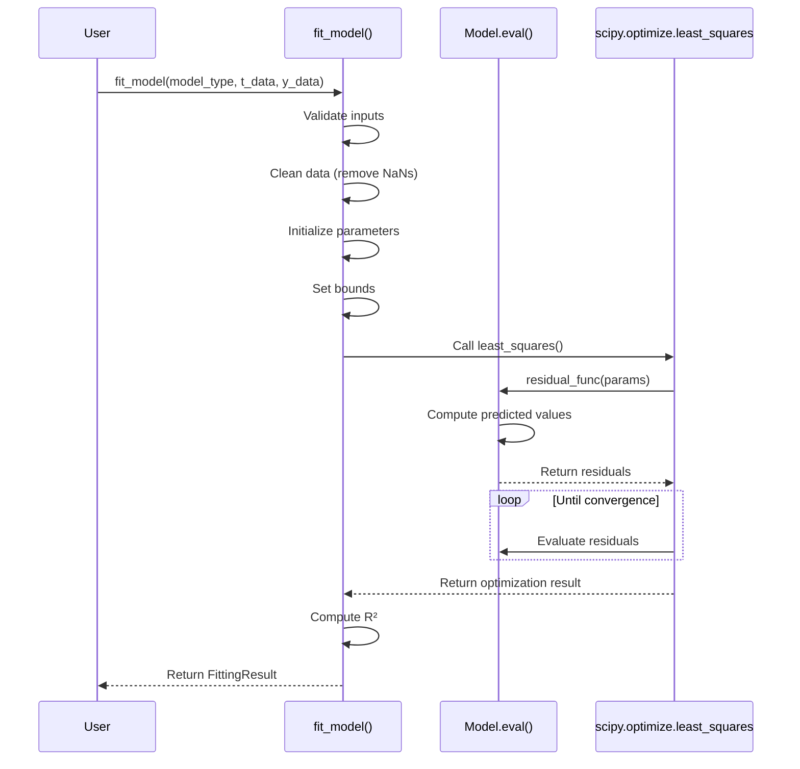
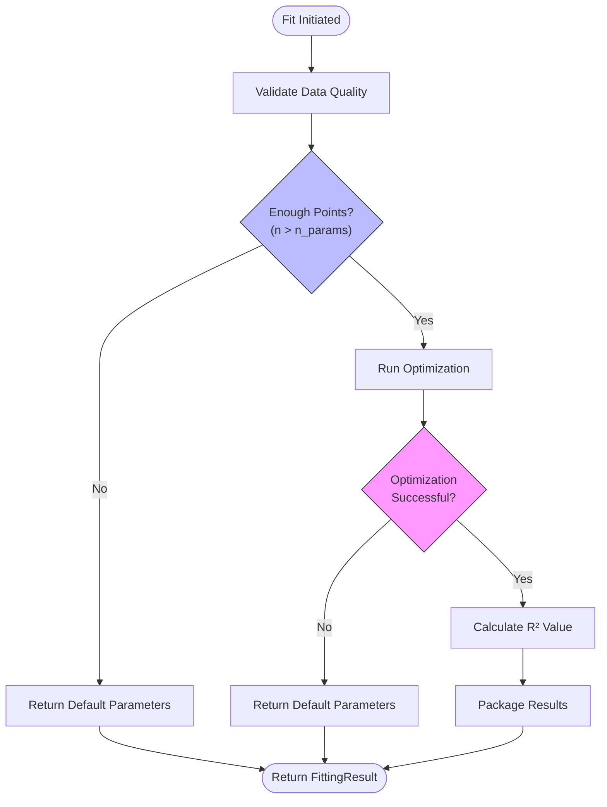
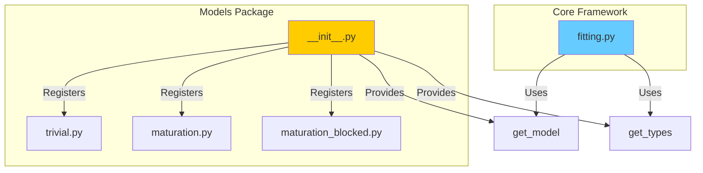
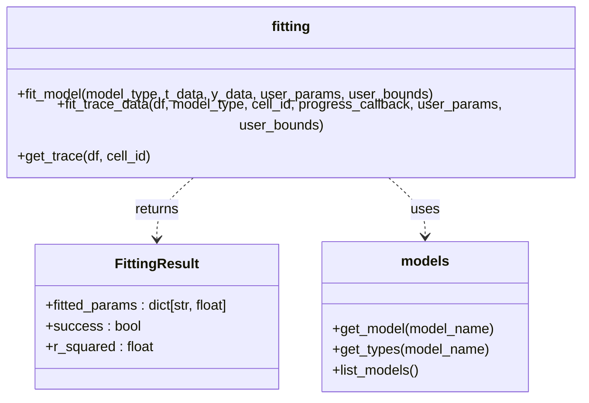

# Analysis Models

<cite>
**Referenced Files in This Document**   
- [trivial.py](file://pyama-core/src/pyama_core/analysis/models/trivial.py)
- [maturation.py](file://pyama-core/src/pyama_core/analysis/models/maturation.py)
- [maturation_blocked.py](file://pyama-core/src/pyama_core/analysis/models/maturation_blocked.py)
- [fitting.py](file://pyama-core/src/pyama_core/analysis/fitting.py)
- [__init__.py](file://pyama-core/src/pyama_core/analysis/models/__init__.py)
</cite>

## Table of Contents
1. [Introduction](#introduction)
2. [Core Mathematical Models](#core-mathematical-models)
   - [Trivial Model](#trivial-model)
   - [Maturation Model](#maturation-model)
   - [Maturation-Blocked Model](#maturation-blocked-model)
3. [Model Parameters and Biological Interpretation](#model-parameters-and-biological-interpretation)
4. [Implementation and Fitting Framework](#implementation-and-fitting-framework)
5. [Model Selection Guidelines](#model-selection-guidelines)
6. [Fitting Results and Parameter Interpretation](#fitting-results-and-parameter-interpretation)
7. [Extensibility Mechanism](#extensibility-mechanism)
8. [Common Fitting Issues and Solutions](#common-fitting-issues-and-solutions)
9. [API Reference](#api-reference)

## Introduction

The analysis models in this system provide mathematical frameworks for fitting biological time-series data, particularly gene expression dynamics in single-cell experiments. These models are designed to capture different biological scenarios in protein expression and maturation processes. The implementation supports robust curve fitting with parameter constraints, initialization strategies, and optimization algorithms to ensure biologically meaningful results. This document details the three primary models—Trivial, Maturation, and Maturation-Blocked—their mathematical formulations, biological assumptions, implementation details, and practical usage guidance.

## Core Mathematical Models

### Trivial Model

The Trivial model represents baseline gene expression dynamics without protein maturation effects. It assumes immediate fluorescence upon protein synthesis and models the balance between production and degradation.

**Biological Context**: This model is appropriate for fluorescent proteins that mature rapidly or when maturation kinetics are negligible compared to the experimental timescale. It serves as a baseline for comparison with more complex models.

**Mathematical Formulation**:
The model computes fluorescence intensity as a function of time using the formula:
```
I(t) = offset + (ktl / (delta - beta)) * (1 - exp(-(delta - beta) * (t - t0))) * exp(-beta * (t - t0))
```
for t > t0, and 0 otherwise.

**Section sources**
- [trivial.py](file://pyama-core/src/pyama_core/analysis/models/trivial.py#L1-L71)

### Maturation Model

The Maturation model extends the Trivial model by incorporating protein maturation kinetics, capturing the delay between protein synthesis and fluorescence development.

**Biological Context**: This model is suitable for fluorescent proteins with significant maturation times, such as GFP variants. It accounts for the conversion of immature (non-fluorescent) to mature (fluorescent) protein states.

**Mathematical Formulation**:
The model combines three exponential terms representing different kinetic processes:
```
I(t) = offset + ktl * [exp(-(beta + km) * (t - t0)) / (beta - delta + km) 
                      - exp(-beta * (t - t0)) / (beta - delta) 
                      + km * exp(-delta * (t - t0)) / ((beta - delta) * (beta - delta + km))]
```
for t > t0, and 0 otherwise.

**Section sources**
- [maturation.py](file://pyama-core/src/pyama_core/analysis/models/maturation.py#L1-L82)

### Maturation-Blocked Model

The Maturation-Blocked model describes decay dynamics following inhibition of protein maturation, capturing the behavior when new protein maturation is prevented.

**Biological Context**: This model applies to experiments where maturation is chemically or genetically inhibited, allowing observation of mature protein decay independent of new synthesis. It distinguishes between existing mature (G0) and immature (Gu0) protein pools.

**Mathematical Formulation**:
The model combines two decay processes:
```
I(t) = offset + G0 * exp(-beta * (t - t0)) + Gu0 * (exp(-beta * (t - t0)) - exp(-(beta + km) * (t - t0)))
```
for t > t0, and 0 otherwise.

**Section sources**
- [maturation_blocked.py](file://pyama-core/src/pyama_core/analysis/models/maturation_blocked.py#L1-L78)

## Model Parameters and Biological Interpretation

Each model defines parameters with specific biological meanings and constrained ranges to ensure physically plausible results.



**Diagram sources**
- [trivial.py](file://pyama-core/src/pyama_core/analysis/models/trivial.py#L10-L71)
- [maturation.py](file://pyama-core/src/pyama_core/analysis/models/maturation.py#L10-L82)
- [maturation_blocked.py](file://pyama-core/src/pyama_core/analysis/models/maturation_blocked.py#L10-L78)

**Parameter Definitions**:
- **t0**: Time of induction or expression onset (hours)
- **ktl**: Translational rate (molecules/hour)
- **km**: Maturation rate constant (1/hour)
- **delta**: Degradation rate of mRNA or precursor (1/hour)
- **beta**: Degradation rate of mature protein (1/hour)
- **offset**: Baseline fluorescence or measurement offset
- **G0**: Initial concentration of mature fluorescent protein
- **Gu0**: Initial concentration of immature (non-fluorescent) protein

Default values and bounds are set based on typical biological ranges to guide optimization toward realistic solutions.

**Section sources**
- [trivial.py](file://pyama-core/src/pyama_core/analysis/models/trivial.py#L50-L71)
- [maturation.py](file://pyama-core/src/pyama_core/analysis/models/maturation.py#L50-L82)
- [maturation_blocked.py](file://pyama-core/src/pyama_core/analysis/models/maturation_blocked.py#L50-L78)

## Implementation and Fitting Framework

The fitting framework provides a unified interface for model evaluation and parameter optimization, handling data preprocessing, constraint enforcement, and result validation.



**Diagram sources**
- [fitting.py](file://pyama-core/src/pyama_core/analysis/fitting.py#L1-L194)

**Key Implementation Features**:
- **Initialization Strategy**: Parameters are initialized from model defaults, optionally overridden by user-provided values
- **Constraint Handling**: Bounds are enforced during optimization using scipy's bounded optimization
- **Data Preprocessing**: Automatic removal of NaN values from input data
- **Validation**: Input parameter names are validated against model specifications
- **Error Handling**: Comprehensive exception handling ensures robust fitting even with problematic data

The framework computes the coefficient of determination (R²) to assess goodness-of-fit, providing a standardized metric for model comparison.

**Section sources**
- [fitting.py](file://pyama-core/src/pyama_core/analysis/fitting.py#L1-L194)

## Model Selection Guidelines

Choosing the appropriate model depends on experimental design, biological system, and data quality.

**Trivial Model Selection Criteria**:
- Fluorescent proteins with rapid maturation (<5% of experimental duration)
- Early-stage analysis or exploratory data analysis
- Limited data points (<15 time points)
- When maturation effects are not expected or relevant

**Maturation Model Selection Criteria**:
- Fluorescent proteins with measurable maturation times (e.g., GFP, mCherry)
- Complete time courses capturing both rise and decay phases
- Sufficient data density to resolve maturation kinetics
- Experiments specifically designed to measure maturation rates

**Maturation-Blocked Model Selection Criteria**:
- Experiments with maturation inhibition (e.g., chemical inhibitors, temperature shifts)
- Focus on protein degradation kinetics independent of synthesis
- Post-induction time courses where new maturation is blocked
- Studies of protein stability and half-life determination

Model selection should be guided by biological knowledge of the system and confirmed through comparison of goodness-of-fit metrics and parameter plausibility.

## Fitting Results and Parameter Interpretation

Fitting results are returned as structured objects containing estimated parameters, success status, and goodness-of-fit metrics.



**Diagram sources**
- [fitting.py](file://pyama-core/src/pyama_core/analysis/fitting.py#L100-L194)

**Interpretation Guidelines**:
- **R² Values**: >0.8 indicates good fit, 0.5-0.8 acceptable, <0.5 suggests poor model-data agreement
- **Parameter Plausibility**: Check if estimated values fall within biological ranges
- **Parameter Correlations**: High correlations between parameters may indicate identifiability issues
- **Residual Patterns**: Systematic patterns in residuals suggest model misspecification

The `FittingResult` object provides all necessary information for result evaluation and downstream analysis.

**Section sources**
- [fitting.py](file://pyama-core/src/pyama_core/analysis/fitting.py#L10-L30)

## Extensibility Mechanism

The models package is designed for extensibility, allowing new models to be added without modifying the core fitting framework.



**Diagram sources**
- [__init__.py](file://pyama-core/src/pyama_core/analysis/models/__init__.py#L1-L42)
- [fitting.py](file://pyama-core/src/pyama_core/analysis/fitting.py#L1-L194)

**Extension Process**:
1. Create a new module in the models package with the required structure
2. Define Params, Bounds, UserParams, and UserBounds dataclasses
3. Implement the eval function with signature `def eval(t: np.ndarray, params: Params) -> np.ndarray`
4. Add the model to the MODELS dictionary in __init__.py
5. The new model becomes immediately available through the fitting interface

This design ensures backward compatibility while supporting future model development.

**Section sources**
- [__init__.py](file://pyama-core/src/pyama_core/analysis/models/__init__.py#L1-L42)

## Common Fitting Issues and Solutions

### Overfitting
**Symptoms**: Excellent R² but biologically implausible parameters, poor generalization to new data
**Solutions**: 
- Use simpler models when justified by biology
- Apply tighter parameter bounds
- Ensure sufficient data points relative to parameters
- Validate with independent datasets

### Convergence Problems
**Symptoms**: Optimization fails, returns default parameters, or produces inconsistent results
**Solutions**:
- Improve initial parameter estimates
- Relax overly restrictive bounds
- Check data quality and preprocessing
- Verify model appropriateness for the data

### Parameter Identifiability Issues
**Symptoms**: High parameter correlations, unstable estimates across runs, wide confidence intervals
**Solutions**:
- Fix known parameters to literature values
- Simplify model structure
- Collect more informative data (e.g., different time scales)
- Use regularization techniques

### Data Quality Issues
**Symptoms**: NaN values, outliers, insufficient time points
**Solutions**:
- Implement robust data preprocessing
- Increase sampling frequency
- Verify measurement accuracy
- Consider experimental design improvements

The framework's validation and error handling help identify and mitigate many of these issues automatically.

**Section sources**
- [fitting.py](file://pyama-core/src/pyama_core/analysis/fitting.py#L40-L95)

## API Reference

The analysis models API provides functions for model access, fitting, and result interpretation.



**Diagram sources**
- [fitting.py](file://pyama-core/src/pyama_core/analysis/fitting.py#L10-L30)
- [__init__.py](file://pyama-core/src/pyama_core/analysis/models/__init__.py#L15-L29)

**Key Functions**:
- `get_model(model_name)`: Retrieve model module by name
- `get_types(model_name)`: Get parameter type definitions for a model
- `fit_model()`: Core fitting function for array data
- `fit_trace_data()`: Convenience function for DataFrame-based data
- `list_models()`: Discover available models

The API is designed for both interactive use and integration into larger analysis pipelines.

**Section sources**
- [__init__.py](file://pyama-core/src/pyama_core/analysis/models/__init__.py#L15-L35)
- [fitting.py](file://pyama-core/src/pyama_core/analysis/fitting.py#L100-L194)