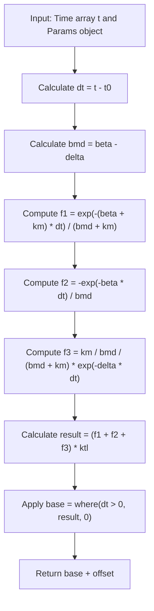
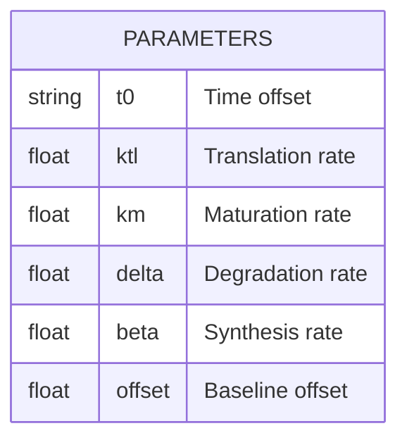
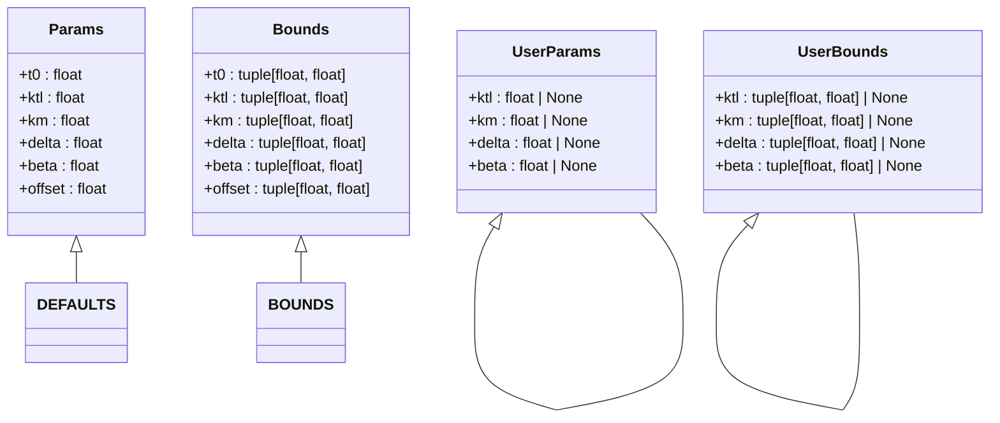
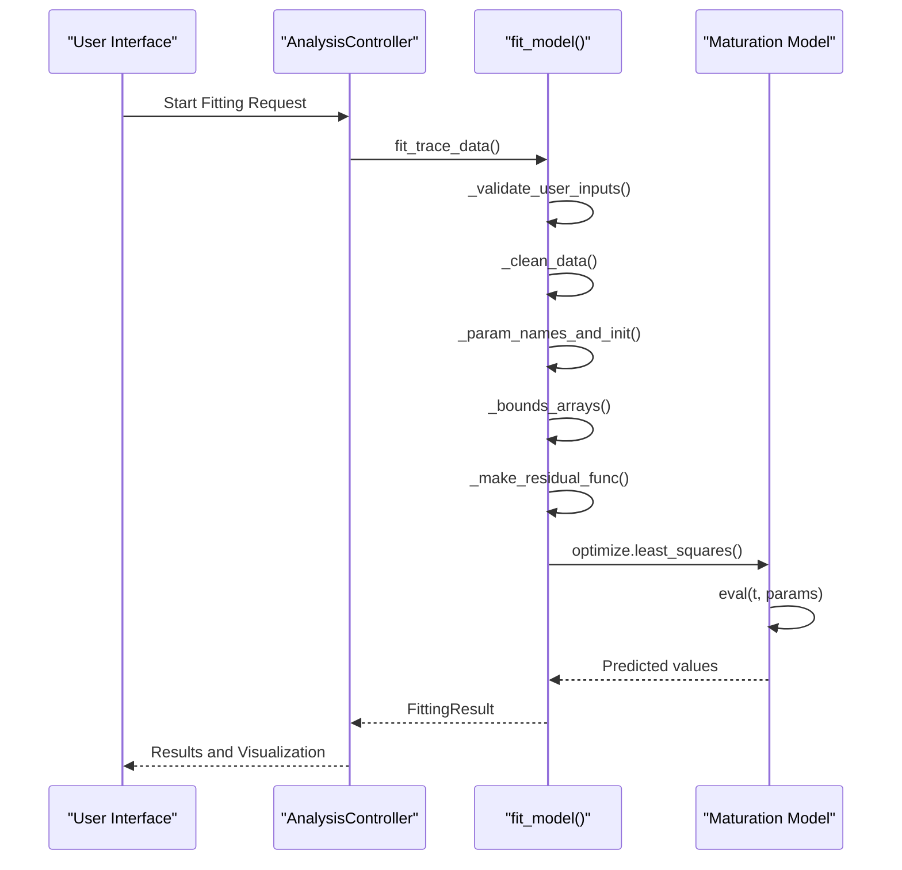
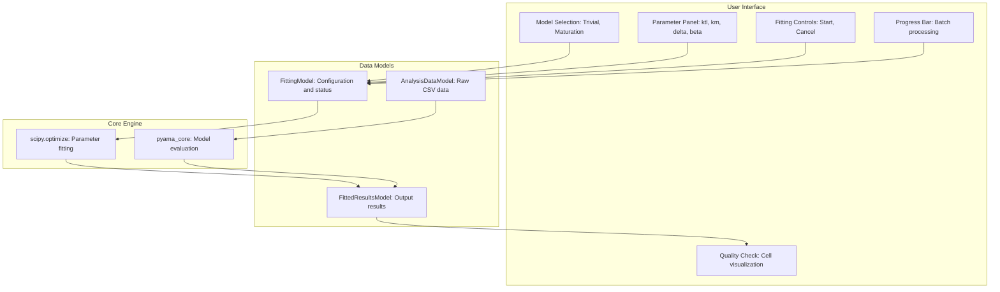

# Maturation Model

<cite>
**Referenced Files in This Document**   
- [maturation.py](file://pyama-core/src/pyama_core/analysis/models/maturation.py)
- [fitting.py](file://pyama-core/src/pyama_core/analysis/fitting.py)
- [controller.py](file://pyama-qt/src/pyama_qt/analysis/controller.py)
- [models.py](file://pyama-qt/src/pyama_qt/analysis/models.py)
- [fitting_panel.py](file://pyama-qt/src/pyama_qt/analysis/panels/fitting_panel.py)
- [__init__.py](file://pyama-core/src/pyama_core/analysis/models/__init__.py)
</cite>

## Table of Contents
1. [Introduction](#introduction)
2. [Biological Context](#biological-context)
3. [Mathematical Formulation](#mathematical-formulation)
4. [Parameter Definitions and Biological Interpretations](#parameter-definitions-and-biological-interpretations)
5. [Implementation Details](#implementation-details)
6. [Fitting Engine Integration](#fitting-engine-integration)
7. [User Interface Exposure](#user-interface-exposure)
8. [Typical Fitting Results and Interpretation](#typical-fitting-results-and-interpretation)
9. [Common Issues and Troubleshooting](#common-issues-and-troubleshooting)
10. [Performance Considerations](#performance-considerations)

## Introduction
The Maturation Model is a sigmoidal growth model designed to represent biological maturation processes, particularly in the context of gene expression and protein maturation. This model captures the transition of biological entities from immature to mature states over time, providing a quantitative framework for analyzing temporal biological data. The implementation is structured across the pyama-core and pyama-qt components, with the core mathematical model defined in the maturation.py module and integrated into a comprehensive fitting pipeline accessible through a graphical user interface.

**Section sources**
- [maturation.py](file://pyama-core/src/pyama_core/analysis/models/maturation.py#L1-L82)
- [fitting.py](file://pyama-core/src/pyama_core/analysis/fitting.py#L1-L195)

## Biological Context
The Maturation Model represents gene expression dynamics with protein maturation, capturing the temporal evolution of biological systems where entities transition from immature to mature states. This process is fundamental in cellular development and protein expression, where newly synthesized proteins undergo conformational changes or post-translational modifications before becoming functionally active. The model accounts for the delay between gene transcription and the appearance of mature, functional protein, reflecting the biological reality that maturation is not instantaneous but occurs over a characteristic timescale. This makes the model particularly suitable for analyzing time-course experiments in molecular biology, such as fluorescent protein expression, enzyme activation, or receptor maturation.

**Section sources**
- [maturation.py](file://pyama-core/src/pyama_core/analysis/models/maturation.py#L1-L5)

## Mathematical Formulation
The Maturation Model implements a sigmoidal growth function based on a system of exponential decay terms that collectively produce a characteristic S-shaped curve. The mathematical formulation is expressed as:

The model evaluates the maturation process through a combination of three exponential components that represent different phases of the maturation kinetics. The resulting function produces a sigmoidal curve that captures the lag phase, exponential growth phase, and plateau phase characteristic of biological maturation processes. The mathematical structure ensures biologically plausible behavior, with the response remaining at baseline until the maturation process initiates at time t0.

**Diagram sources**
- [maturation.py](file://pyama-core/src/pyama_core/analysis/models/maturation.py#L50-L82)

**Section sources**
- [maturation.py](file://pyama-core/src/pyama_core/analysis/models/maturation.py#L50-L82)

## Parameter Definitions and Biological Interpretations
The Maturation Model is governed by six key parameters, each with specific biological interpretations and constrained ranges to ensure physically meaningful solutions.

### Core Parameters

**t0**: Represents the time offset or lag phase before maturation begins. Biologically, this parameter captures the delay between the initiation of gene expression and the first appearance of detectable mature protein. It is constrained between 0 and 1 hour.

**ktl**: The translation rate parameter, representing the maximum potential production rate of the protein. This parameter scales the overall amplitude of the maturation curve and is biologically interpreted as the efficiency of the translational machinery. It has a wide allowable range from 1 to 5e8 to accommodate varying expression levels.

**km**: The maturation rate constant, describing how quickly immature proteins convert to their mature, functional form. This parameter determines the steepness of the rising phase of the sigmoidal curve and reflects the efficiency of folding, modification, or assembly processes. It is constrained between 1e-5 and 30 per hour.

**delta**: The degradation rate of the mature protein, representing its turnover in the cellular environment. This parameter influences the plateau level of the maturation curve and provides information about protein stability. It ranges from 1e-5 to 11 per hour.

**beta**: The synthesis rate of the immature protein form, capturing the combined effects of transcription and initial translation. This parameter works in conjunction with ktl to determine the initial production flux and is bounded between 1e-5 and 10 per hour.

**offset**: A baseline offset parameter that accounts for background signal or constitutive expression. This captures non-specific fluorescence, autofluorescence, or low-level expression that exists independently of the induced maturation process. It allows for flexible baseline adjustment with bounds from -1e6 to 1e6.

**Section sources**
- [maturation.py](file://pyama-core/src/pyama_core/analysis/models/maturation.py#L7-L45)

## Implementation Details
The Maturation Model implementation follows a modular design pattern using Python dataclasses to organize parameters, bounds, and user-specified constraints. The core implementation provides default parameter values and boundary constraints to guide the fitting process toward biologically plausible solutions.

The implementation includes comprehensive validation of user inputs to prevent invalid parameter specifications. The fitting process begins with data cleaning to remove NaN values, followed by parameter initialization using default values that are updated with any user-provided estimates. Parameter bounds are similarly constructed from model defaults and augmented with user-specified constraints when available.

**Diagram sources**
- [maturation.py](file://pyama-core/src/pyama_core/analysis/models/maturation.py#L7-L45)
- [fitting.py](file://pyama-core/src/pyama_core/analysis/fitting.py#L20-L99)

**Section sources**
- [maturation.py](file://pyama-core/src/pyama_core/analysis/models/maturation.py#L7-L45)
- [fitting.py](file://pyama-core/src/pyama_core/analysis/fitting.py#L20-L99)

## Fitting Engine Integration
The Maturation Model integrates with the core fitting engine through a standardized interface that enables consistent model evaluation, parameter optimization, and result reporting. The integration follows a modular design that allows multiple models to coexist within the same analysis framework.

The fitting process begins with input validation to ensure that user-specified parameters and bounds are compatible with the model structure. Data cleaning removes any missing values from the time and intensity arrays before analysis. The optimization routine uses scipy's least_squares function with bounded constraints to find the parameter set that minimizes the residual between observed data and model predictions. The fitting engine computes the coefficient of determination (R²) as a goodness-of-fit metric, providing quantitative assessment of model performance.

**Diagram sources**
- [fitting.py](file://pyama-core/src/pyama_core/analysis/fitting.py#L102-L147)
- [controller.py](file://pyama-qt/src/pyama_qt/analysis/controller.py#L55-L82)

**Section sources**
- [fitting.py](file://pyama-core/src/pyama_core/analysis/fitting.py#L102-L147)
- [controller.py](file://pyama-qt/src/pyama_qt/analysis/controller.py#L55-L82)

## User Interface Exposure
The Maturation Model is exposed to users through a graphical interface that provides intuitive controls for model selection, parameter specification, and result visualization. The UI implementation follows the Model-View-Controller pattern, separating the underlying data and logic from the presentation layer.

Users can select the Maturation Model from a dropdown menu alongside other available models. The parameter panel dynamically updates to show the relevant parameters (ktl, km, delta, beta) with their default values and allowable ranges. Users can modify these parameters and bounds before initiating the fitting process. The interface provides real-time feedback through a progress bar during batch processing and enables quality control by visualizing individual cell traces with overlaid fitted curves for validation.

**Diagram sources**
- [fitting_panel.py](file://pyama-qt/src/pyama_qt/analysis/panels/fitting_panel.py#L131-L141)
- [models.py](file://pyama-qt/src/pyama_qt/analysis/models.py#L1-L290)

**Section sources**
- [fitting_panel.py](file://pyama-qt/src/pyama_qt/analysis/panels/fitting_panel.py#L131-L141)
- [models.py](file://pyama-qt/src/pyama_qt/analysis/models.py#L1-L290)

## Typical Fitting Results and Interpretation
Fitting the Maturation Model to experimental data produces parameter estimates that provide quantitative insights into the biological maturation process. Successful fits are characterized by high R² values (typically >0.8) and biologically plausible parameter estimates within the expected ranges.

The fitted parameters reveal key characteristics of the maturation process:
- A small t0 value indicates rapid initiation of maturation after induction
- High ktl values suggest efficient translation and high expression levels
- Large km values correspond to fast maturation kinetics
- Low delta values indicate stable mature proteins with slow degradation
- High beta values reflect strong synthesis rates of the immature form

The quality of fit can be assessed both statistically through the R² value and visually by examining the alignment between the experimental data points and the fitted curve. Good fits should capture the characteristic sigmoidal shape with appropriate lag phase, rising phase, and plateau. The residual plot should show random scatter without systematic patterns, indicating that the model adequately captures the underlying process.

**Section sources**
- [fitting.py](file://pyama-core/src/pyama_core/analysis/fitting.py#L95-L99)
- [fitting_panel.py](file://pyama-qt/src/pyama_qt/analysis/panels/fitting_panel.py#L215-L307)

## Common Issues and Troubleshooting
Several common issues may arise when fitting the Maturation Model to experimental data, primarily related to data quality, parameter initialization, and model identifiability.

**Convergence failure due to sparse data**: When time-series data has too few points relative to the number of model parameters, the optimization routine may fail to converge. This occurs when the number of valid data points is less than the number of parameters (6 for the Maturation Model). The solution is to ensure sufficient temporal sampling density or to use simpler models for sparse datasets.

**Poor initialization leading to local minima**: The nonlinear nature of the model makes it sensitive to initial parameter guesses. Poor initialization can trap the optimizer in local minima. The system mitigates this by using biologically informed default values, but users can improve convergence by providing reasonable estimates based on prior knowledge of the system.

**Overparameterization and parameter correlation**: Some parameters may be highly correlated, making them difficult to estimate independently. For example, ktl and beta both influence the overall amplitude, while km and delta affect the shape of the curve. Regularization through appropriate bounds helps constrain solutions to biologically plausible ranges.

**Numerical instability**: The mathematical formulation involves division by (beta - delta), which can cause numerical issues when these parameters are nearly equal. The implementation handles this through careful numerical evaluation, but users should be aware that highly similar synthesis and degradation rates may produce unstable fits.

**Section sources**
- [fitting.py](file://pyama-core/src/pyama_core/analysis/fitting.py#L102-L147)
- [maturation.py](file://pyama-core/src/pyama_core/analysis/models/maturation.py#L50-L82)

## Performance Considerations
The Maturation Model implementation is designed to handle large-scale analysis of high-throughput data while maintaining computational efficiency. The fitting process is optimized for batch processing of multiple cells or conditions, with performance considerations at multiple levels.

For large datasets, the system processes files sequentially in a background worker thread to prevent UI freezing. Each CSV file containing multiple cell traces is processed independently, with fitting performed cell-by-cell. The progress callback mechanism provides regular updates during long-running analyses, reporting progress every 30 cells or at completion.

The core fitting algorithm uses scipy's least_squares optimizer with bounded constraints, which provides a good balance between robustness and speed for this class of nonlinear problems. While the current implementation processes cells sequentially within each file, the architecture supports potential parallelization across files, as each fitting task is independent. This could be leveraged in future versions to take advantage of multi-core processors for faster analysis of large experiment sets.

Memory usage is optimized by processing one file at a time and writing results to disk immediately, rather than holding all data in memory. This allows the system to handle datasets that exceed available RAM, limited only by storage capacity. The use of numpy arrays for numerical computations ensures efficient memory access patterns and vectorized operations for fast evaluation of the model function.

**Section sources**
- [controller.py](file://pyama-qt/src/pyama_qt/analysis/controller.py#L84-L235)
- [fitting.py](file://pyama-core/src/pyama_core/analysis/fitting.py#L149-L195)