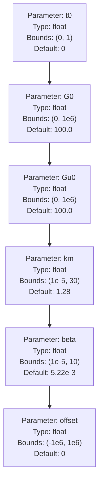
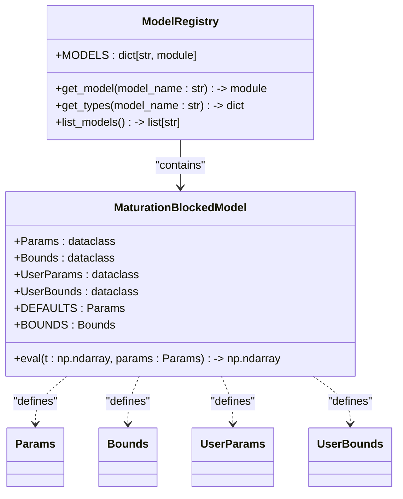
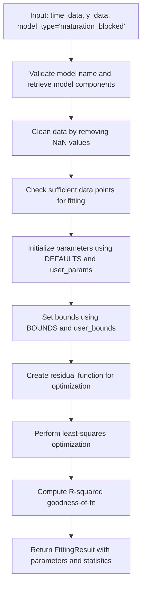
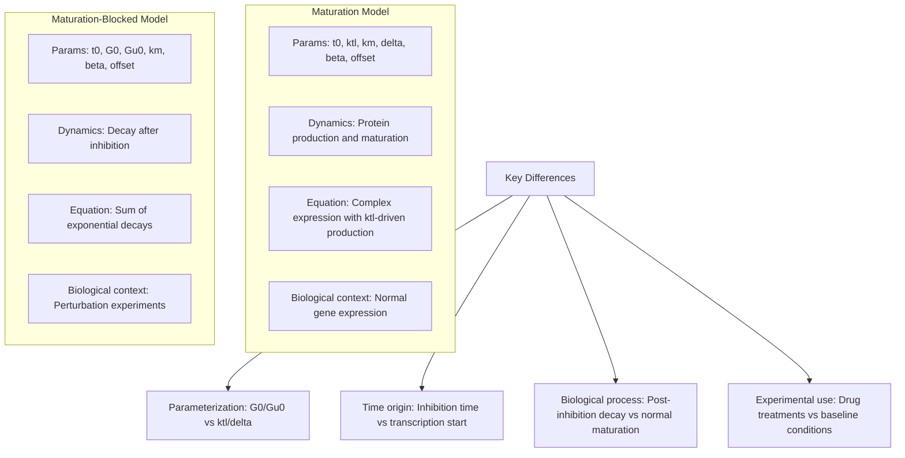
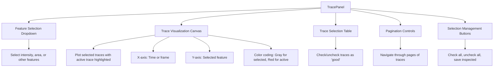

# Maturation-Blocked Model

<cite>
**Referenced Files in This Document**   
- [maturation_blocked.py](file://pyama-core/src/pyama_core/analysis/models/maturation_blocked.py)
- [maturation.py](file://pyama-core/src/pyama_core/analysis/models/maturation.py)
- [fitting.py](file://pyama-core/src/pyama_core/analysis/fitting.py)
- [trace_panel.py](file://pyama-qt/src/pyama_qt/visualization/panels/trace_panel.py)
</cite>

## Table of Contents
1. [Introduction](#introduction)
2. [Mathematical Structure](#mathematical-structure)
3. [Parameter Constraints and Default Values](#parameter-constraints-and-default-values)
4. [Model Registration and Integration](#model-registration-and-integration)
5. [Fitting Procedure](#fitting-procedure)
6. [Comparison with Standard Maturation Model](#comparison-with-standard-maturation-model)
7. [Biological Interpretation of Blocking Parameter](#biological-interpretation-of-blocking-parameter)
8. [Fitting Challenges and Identifiability](#fitting-challenges-and-identifiability)
9. [Visualization Tools](#visualization-tools)
10. [Conclusion](#conclusion)

## Introduction
The Maturation-Blocked Model is designed to represent biological systems where protein or cellular maturation processes are inhibited or blocked due to experimental perturbations such as drug treatments or genetic knockouts. This model extends the standard Maturation Model by capturing decay dynamics that occur when maturation is prevented, allowing researchers to quantify the effects of such interventions on gene expression and protein stability. The model is particularly useful in perturbation experiments where the normal maturation pathway is disrupted, enabling the study of post-transcriptional regulation and protein turnover under inhibited conditions.

**Section sources**
- [maturation_blocked.py](file://pyama-core/src/pyama_core/analysis/models/maturation_blocked.py#L1-L10)

## Mathematical Structure
The Maturation-Blocked Model describes the temporal dynamics of gene expression when maturation is blocked, using a system of exponential decay functions. The model equation is defined as:

G(t) = G₀·exp(-β·(t-t₀)) + Gu₀·[exp(-β·(t-t₀)) - exp(-(β+km)·(t-t₀))]

where:
- G₀: Initial concentration of mature protein at inhibition time
- Gu₀: Initial concentration of unprocessed precursor at inhibition time
- km: Maturation rate constant
- β: Degradation rate constant
- t₀: Time of maturation inhibition
- offset: Baseline signal offset

The model assumes that upon inhibition of maturation (at time t₀), the existing mature protein (G₀) decays with rate β, while the unprocessed precursor (Gu₀) both fails to mature and decays with the same degradation rate. The difference in exponential terms captures the accumulation and decay of the unprocessed form that would have otherwise matured.

**Section sources**
- [maturation_blocked.py](file://pyama-core/src/pyama_core/analysis/models/maturation_blocked.py#L45-L77)

## Parameter Constraints and Default Values
The Maturation-Blocked Model defines specific parameter bounds and default values to ensure biologically plausible fitting results. The model includes six parameters with the following constraints:

The UserParams and UserBounds classes allow users to specify fixed parameter values or custom bounds for specific parameters while using defaults for others. This flexibility enables targeted analysis where certain parameters are known from prior experiments or theoretical considerations.

**Diagram sources**
- [maturation_blocked.py](file://pyama-core/src/pyama_core/analysis/models/maturation_blocked.py#L15-L44)

**Section sources**
- [maturation_blocked.py](file://pyama-core/src/pyama_core/analysis/models/maturation_blocked.py#L15-L44)

## Model Registration and Integration
The Maturation-Blocked Model is integrated into the analysis framework through the models registry system. It is registered alongside other models in the __init__.py file of the models package, making it accessible through the get_model and get_types functions. The model follows a consistent interface with other models in the system, implementing the same Params, Bounds, UserParams, and UserBounds dataclasses.

This registration pattern allows the model to be seamlessly used in batch fitting workflows and analysis pipelines without requiring special handling.

**Diagram sources**
- [maturation_blocked.py](file://pyama-core/src/pyama_core/analysis/models/maturation_blocked.py#L1-L77)
- [__init__.py](file://pyama-core/src/pyama_core/analysis/models/__init__.py#L1-L41)

**Section sources**
- [maturation_blocked.py](file://pyama-core/src/pyama_core/analysis/models/maturation_blocked.py#L1-L77)
- [__init__.py](file://pyama-core/src/pyama_core/analysis/models/__init__.py#L1-L41)

## Fitting Procedure
The Maturation-Blocked Model is fitted to experimental data using the fitting module's standardized interface. The fit_model function handles parameter initialization, bounds enforcement, and optimization through scipy's least_squares solver. The fitting process follows these steps:

The fitting procedure returns a FittingResult object containing the optimized parameters, success status, and R-squared value. Users can provide custom initial parameter values and bounds through the user_params and user_bounds arguments to guide the optimization process based on prior knowledge.

**Diagram sources**
- [fitting.py](file://pyama-core/src/pyama_core/analysis/fitting.py#L50-L194)
- [maturation_blocked.py](file://pyama-core/src/pyama_core/analysis/models/maturation_blocked.py#L45-L77)

**Section sources**
- [fitting.py](file://pyama-core/src/pyama_core/analysis/fitting.py#L50-L194)

## Comparison with Standard Maturation Model
The Maturation-Blocked Model differs significantly from the standard Maturation Model in both structure and biological interpretation. While the standard model describes normal maturation dynamics with protein production, maturation, and degradation, the blocked model focuses on the decay phase after maturation inhibition.

Statistical comparison between the models can be performed using information criteria such as AIC or BIC, or through cross-validation, to determine which model better explains the observed data in different experimental conditions.

**Diagram sources**
- [maturation.py](file://pyama-core/src/pyama_core/analysis/models/maturation.py#L1-L81)
- [maturation_blocked.py](file://pyama-core/src/pyama_core/analysis/models/maturation_blocked.py#L1-L77)

**Section sources**
- [maturation.py](file://pyama-core/src/pyama_core/analysis/models/maturation.py#L1-L81)
- [maturation_blocked.py](file://pyama-core/src/pyama_core/analysis/models/maturation_blocked.py#L1-L77)

## Biological Interpretation of Blocking Parameter
In the Maturation-Blocked Model, the parameters provide direct biological insights into the system's behavior under inhibition. The G0 parameter represents the concentration of mature protein present at the time of inhibition, serving as a measure of the system's state when perturbation begins. The Gu0 parameter indicates the pool of unprocessed precursor that was prevented from maturing, reflecting the ongoing transcriptional activity up to the point of inhibition.

The km parameter (maturation rate constant) retains its interpretation from the standard model but is estimated under conditions where maturation is blocked, potentially revealing changes in maturation efficiency due to the perturbation. The beta parameter (degradation rate constant) quantifies the stability of the mature protein in the absence of new maturation, allowing researchers to distinguish between effects on protein production versus protein stability.

Confidence intervals for these parameters can be assessed through bootstrapping or profile likelihood methods, and their significance can be evaluated using model selection criteria when comparing the blocked model to alternative models or the standard maturation model.

**Section sources**
- [maturation_blocked.py](file://pyama-core/src/pyama_core/analysis/models/maturation_blocked.py#L15-L44)

## Fitting Challenges and Identifiability
The Maturation-Blocked Model presents several fitting challenges related to parameter identifiability and correlation. The G0 and Gu0 parameters may exhibit correlation since both contribute to the initial signal level, making it difficult to precisely estimate their individual values without high-quality data. Similarly, the km and beta parameters can be correlated, as different combinations of maturation and degradation rates may produce similar decay curves.

To improve parameter identifiability, experimental design should consider:
- Collecting data with high temporal resolution around the inhibition time (t₀)
- Extending the observation period to capture the full decay dynamics
- Using replicate experiments to estimate parameter uncertainty
- Combining with complementary measurements (e.g., total protein levels)

Strategies for addressing fitting challenges include fixing certain parameters based on prior knowledge, using informative priors in Bayesian fitting approaches, or designing experiments that specifically probe different aspects of the system to break parameter correlations.

**Section sources**
- [maturation_blocked.py](file://pyama-core/src/pyama_core/analysis/models/maturation_blocked.py#L15-L44)
- [fitting.py](file://pyama-core/src/pyama_core/analysis/fitting.py#L50-L194)

## Visualization Tools
The system provides visualization tools to compare blocked versus normal maturation trajectories and assess model fits. The TracePanel component allows users to visualize time traces of gene expression or protein levels, with functionality to:

- Display multiple cell traces simultaneously
- Highlight the active trace in red
- Navigate through traces using pagination controls
- Select subsets of traces for analysis
- Save inspection results

These visualization capabilities enable researchers to qualitatively assess the quality of model fits and identify patterns across cell populations, complementing the quantitative fitting results.

**Diagram sources**
- [trace_panel.py](file://pyama-qt/src/pyama_qt/visualization/panels/trace_panel.py#L1-L628)

**Section sources**
- [trace_panel.py](file://pyama-qt/src/pyama_qt/visualization/panels/trace_panel.py#L1-L628)

## Conclusion
The Maturation-Blocked Model provides a specialized framework for analyzing gene expression and protein dynamics in systems where maturation processes are inhibited. By focusing on the decay phase after perturbation, the model enables quantitative assessment of protein stability and precursor pools under blocked conditions. Its integration into the existing analysis pipeline allows seamless comparison with the standard Maturation Model and application to high-throughput datasets. Proper experimental design and careful interpretation of parameter estimates are essential for drawing meaningful biological conclusions from model fits, particularly given potential challenges with parameter identifiability. The combination of quantitative fitting and interactive visualization tools supports comprehensive analysis of perturbation experiments in biological systems.