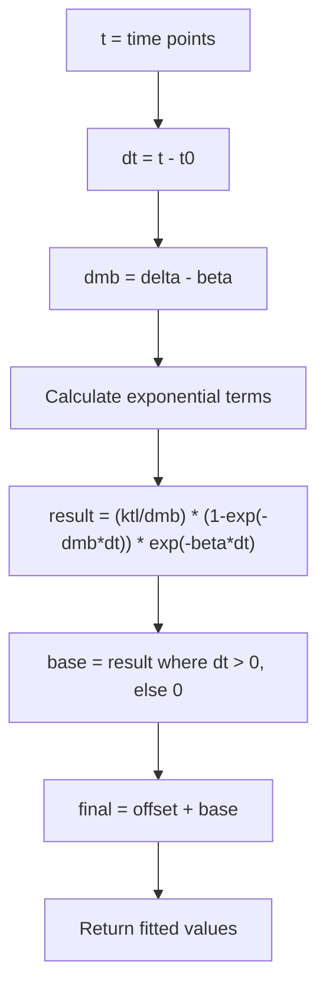
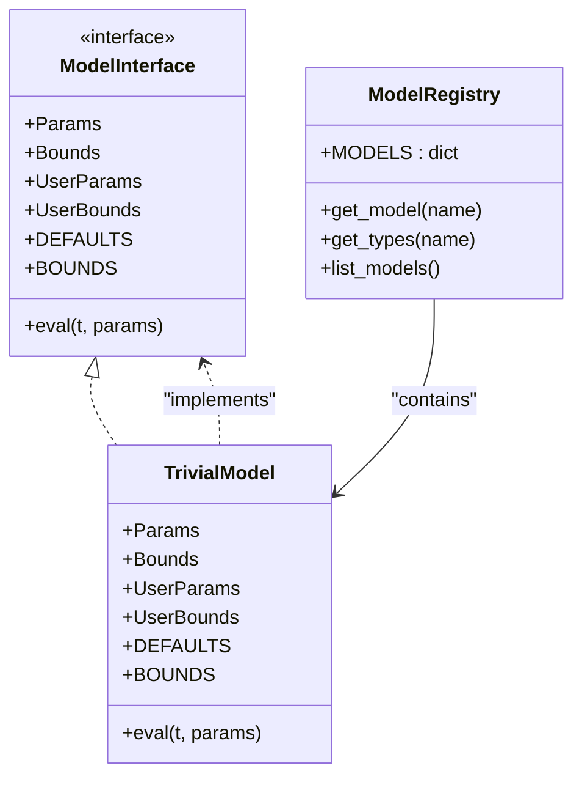
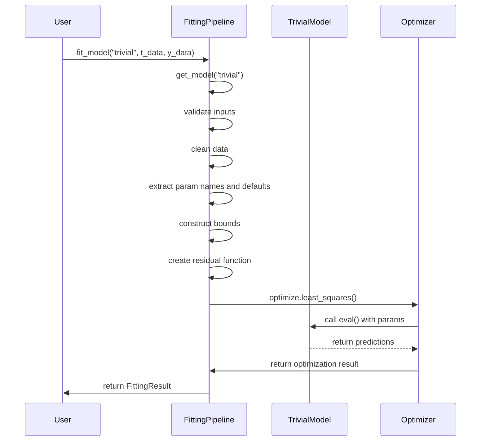

# Trivial Model

<cite>
**Referenced Files in This Document**   
- [trivial.py](file://pyama-core/src/pyama_core/analysis/models/trivial.py)
- [__init__.py](file://pyama-core/src/pyama_core/analysis/models/__init__.py)
- [fitting.py](file://pyama-core/src/pyama_core/analysis/fitting.py)
</cite>

## Table of Contents
1. [Introduction](#introduction)
2. [Mathematical Formulation](#mathematical-formulation)
3. [Implementation Details](#implementation-details)
4. [Model Registration and Plugin Architecture](#model-registration-and-plugin-architecture)
5. [Fitting Pipeline Integration](#fitting-pipeline-integration)
6. [Parameter Initialization and Constraints](#parameter-initialization-and-constraints)
7. [Optimization Approach](#optimization-approach)
8. [Use Cases and Applications](#use-cases-and-applications)
9. [Model Selection and Statistical Comparison](#model-selection-and-statistical-comparison)
10. [Parameter Interpretation and Goodness-of-Fit](#parameter-interpretation-and-goodness-of-fit)
11. [Limitations and Appropriate Usage](#limitations-and-appropriate-usage)

## Introduction
The Trivial Model serves as a baseline mathematical model for curve fitting in biological data analysis within the pyama framework. It functions as a reference model against which more complex growth dynamics can be compared, particularly in gene expression studies. This model captures simple gene expression dynamics and provides a foundation for model selection workflows by establishing a minimal complexity baseline. The implementation follows a plugin architecture that allows seamless integration with the fitting pipeline, enabling comparison with more sophisticated models like maturation and maturation_blocked. Its primary purpose is to provide a constant or simple linear reference point for biological data that may exhibit minimal or no change over time.

**Section sources**
- [trivial.py](file://pyama-core/src/pyama_core/analysis/models/trivial.py#L1-L10)

## Mathematical Formulation
The Trivial Model implements a mathematical formulation for gene expression dynamics that incorporates exponential decay and transient response characteristics. The core equation is defined as: result = (ktl / dmb) * (1.0 - np.exp(-dmb * dt)) * np.exp(-beta * dt), where dmb represents the difference between delta and beta parameters. This formulation produces a transient peak response that decays exponentially over time, with the response being zero before the time offset t0. The complete model output is calculated as offset + base, where base is the conditional result that applies only when dt > 0 (time is greater than the threshold t0). The model's behavior is governed by five parameters: t0 (time threshold), ktl (translation rate), delta (transcription rate), beta (degradation rate), and offset (baseline signal). This mathematical structure allows the model to capture basic induction dynamics with a defined onset time and subsequent decay.

**Diagram sources**
- [trivial.py](file://pyama-core/src/pyama_core/analysis/models/trivial.py#L55-L70)

**Section sources**
- [trivial.py](file://pyama-core/src/pyama_core/analysis/models/trivial.py#L55-L70)

## Implementation Details
The Trivial Model is implemented as a standalone module within the pyama-core package, following a consistent interface pattern across all models in the system. The implementation uses Python dataclasses to define structured parameter containers, including Params (all parameters), Bounds (parameter constraints), UserParams (user-specifiable parameters), and UserBounds (user-specifiable bounds). The core evaluation function, eval, takes a time array and parameter object as inputs and returns the corresponding model output array. The implementation leverages NumPy for efficient array operations and mathematical functions, ensuring compatibility with the scipy optimization routines used in the fitting pipeline. The model is designed to handle vectorized operations, allowing simultaneous evaluation at multiple time points, which is essential for efficient curve fitting with biological time-series data.

**Section sources**
- [trivial.py](file://pyama-core/src/pyama_core/analysis/models/trivial.py#L12-L70)

## Model Registration and Plugin Architecture
The Trivial Model integrates into the pyama framework through a plugin architecture implemented in the models package's __init__.py file. It is registered in the global MODELS dictionary with the key "trivial", making it accessible through the get_model and get_types functions. This registration pattern allows the fitting pipeline to dynamically load and utilize the model without hard-coded dependencies. The plugin architecture enables model-agnostic processing, where the fitting functions can work with any registered model by retrieving its parameter types, default values, and bounds through the standardized interface. This design supports extensibility, allowing new models to be added by simply creating a new module and registering it in the MODELS dictionary, following the same interface conventions as the Trivial Model.

**Diagram sources**
- [__init__.py](file://pyama-core/src/pyama_core/analysis/models/__init__.py#L1-L41)
- [trivial.py](file://pyama-core/src/pyama_core/analysis/models/trivial.py#L1-L70)

**Section sources**
- [__init__.py](file://pyama-core/src/pyama_core/analysis/models/__init__.py#L1-L41)
- [trivial.py](file://pyama-core/src/pyama_core/analysis/models/trivial.py#L1-L70)

## Fitting Pipeline Integration
The Trivial Model is integrated into the fitting pipeline through the fit_model function in the fitting.py module, which provides a unified interface for curve fitting across all registered models. The pipeline first validates user inputs against the model's UserParams and UserBounds specifications, ensuring parameter names are valid and bounds are properly formatted. It then cleans the input data by removing NaN values and checks that sufficient data points exist for fitting (at least as many as parameters). The pipeline extracts parameter names from the model's DEFAULTS dataclass and constructs initial parameter arrays and bound constraints for optimization. The residual function is created dynamically using the model's eval function, enabling the least-squares optimization to minimize the difference between observed and predicted values. This integration allows the Trivial Model to be used interchangeably with other models in the system, supporting comparative analysis and model selection workflows.

**Diagram sources**
- [fitting.py](file://pyama-core/src/pyama_core/analysis/fitting.py#L102-L147)
- [trivial.py](file://pyama-core/src/pyama_core/analysis/models/trivial.py#L55-L70)

**Section sources**
- [fitting.py](file://pyama-core/src/pyama_core/analysis/fitting.py#L102-L147)

## Parameter Initialization and Constraints
The Trivial Model defines specific default values and constraint bounds for its five parameters through the DEFAULTS and BOUNDS dataclass instances. The default parameter values are: t0=2.0, ktl=20.0, delta=0.07, beta=0.0436275356035, and offset=0.0, providing a reasonable starting point for optimization. The parameter bounds constrain the feasible search space during fitting: t0 is bounded between 0 and 30.0, ktl between 1.0 and 1e6, delta between 1e-5 and 10.1, beta between 1e-5 and 10.0, and offset between -1e6 and 1e6. These bounds prevent unrealistic parameter values and improve optimization stability. The UserParams and UserBounds dataclasses allow users to specify particular parameters to fit while fixing others, providing flexibility in the fitting process. When user parameters are provided, they override the defaults, and when user bounds are specified, they override the default bounds for those parameters.

**Section sources**
- [trivial.py](file://pyama-core/src/pyama_core/analysis/models/trivial.py#L35-L53)

## Optimization Approach
The Trivial Model utilizes scipy's least_squares optimization function for parameter fitting, which implements a trust-region reflective algorithm suitable for bounded minimization problems. The optimization minimizes the residual function, defined as the difference between observed data and model predictions, subject to the parameter bounds. The fitting process begins with initial parameter values derived from the model's defaults, potentially modified by user-specified values. The algorithm iteratively adjusts parameters to reduce the sum of squared residuals, terminating when convergence criteria are met or when the maximum number of iterations is reached. The optimization is constrained by both lower and upper bounds for each parameter, ensuring biologically plausible results. In cases where optimization fails, the fitting function returns the default parameters with a failure flag, allowing downstream processes to handle unsuccessful fits appropriately.

**Section sources**
- [fitting.py](file://pyama-core/src/pyama_core/analysis/fitting.py#L130-L140)

## Use Cases and Applications
The Trivial Model is particularly useful for analyzing biological samples that exhibit minimal or no response to experimental conditions, serving as a baseline for comparison with responsive samples. Common use cases include control conditions where gene expression is expected to remain stable, non-responsive cell lines or genetic variants, and samples with technical issues that prevent proper induction. By fitting the Trivial Model to such data, researchers can quantify the absence of response and statistically compare it against more complex models that assume induction dynamics. This comparison helps identify truly non-responsive samples versus those with subtle but significant responses. The model is also valuable for quality control, where successful fitting of the Trivial Model to negative controls validates the experimental setup and analysis pipeline.

**Section sources**
- [trivial.py](file://pyama-core/src/pyama_core/analysis/models/trivial.py#L1-L10)

## Model Selection and Statistical Comparison
The Trivial Model plays a crucial role in model selection workflows by serving as the simplest model in the hierarchy of complexity. When analyzing biological data, researchers can fit multiple models (including Trivial, maturation, and maturation_blocked) and compare their performance using statistical criteria such as AIC (Akaike Information Criterion) or BIC (Bayesian Information Criterion). These criteria balance model fit (measured by residual sum of squares) against model complexity (number of parameters), penalizing more complex models to prevent overfitting. The Trivial Model, with its five parameters, provides a baseline against which the additional explanatory power of more complex models can be assessed. If a more complex model does not provide a significantly better fit after accounting for its increased complexity, the Trivial Model may be preferred due to its parsimony. This approach supports rigorous, data-driven model selection in biological data analysis.

**Section sources**
- [fitting.py](file://pyama-core/src/pyama_core/analysis/fitting.py#L138-L139)

## Parameter Interpretation and Goodness-of-Fit
The parameters of the Trivial Model have specific biological interpretations: t0 represents the time of induction or response onset, ktl reflects the translation rate or maximum expression level, delta and beta govern the transcription and degradation rates respectively, and offset accounts for baseline signal or measurement background. The goodness-of-fit is quantified by the r_squared value in the FittingResult, which measures the proportion of variance in the data explained by the model. An r_squared value close to 1.0 indicates a good fit, while values near 0.0 suggest the model does not capture the data patterns well. For the Trivial Model, a high r_squared in non-responsive samples confirms the absence of induction dynamics, while a low r_squared may indicate either poor data quality or the presence of unmodeled biological processes. The success flag in the FittingResult indicates whether the optimization converged properly, providing additional quality assessment.

**Section sources**
- [trivial.py](file://pyama-core/src/pyama_core/analysis/models/trivial.py#L12-L53)
- [fitting.py](file://pyama-core/src/pyama_core/analysis/fitting.py#L138-L139)

## Limitations and Appropriate Usage
The Trivial Model has several limitations that constrain its appropriate usage. It assumes a specific mathematical form of gene expression dynamics that may not capture all biological scenarios, particularly those with complex induction patterns, oscillations, or multiple phases. The model should not be used when there is clear evidence of non-trivial dynamics in the data, as more appropriate models (like maturation or maturation_blocked) would provide better explanations. Additionally, the model may fail when the delta and beta parameters are nearly equal, as this creates a division by zero in the mathematical formulation (dmb = delta - beta). The model is also not suitable for data with insufficient time points relative to the number of parameters, as this leads to overfitting or optimization failure. Users should exercise caution when interpreting results from the Trivial Model and always compare its performance against more complex alternatives when biological induction is expected.

**Section sources**
- [trivial.py](file://pyama-core/src/pyama_core/analysis/models/trivial.py#L65-L70)
- [fitting.py](file://pyama-core/src/pyama_core/analysis/fitting.py#L118-L122)