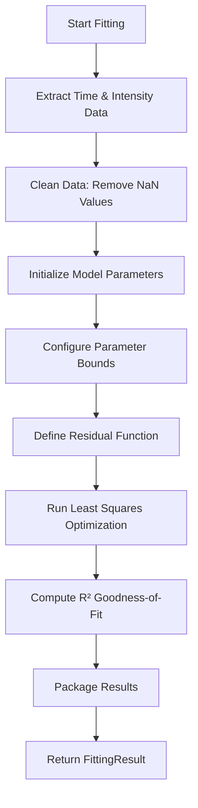
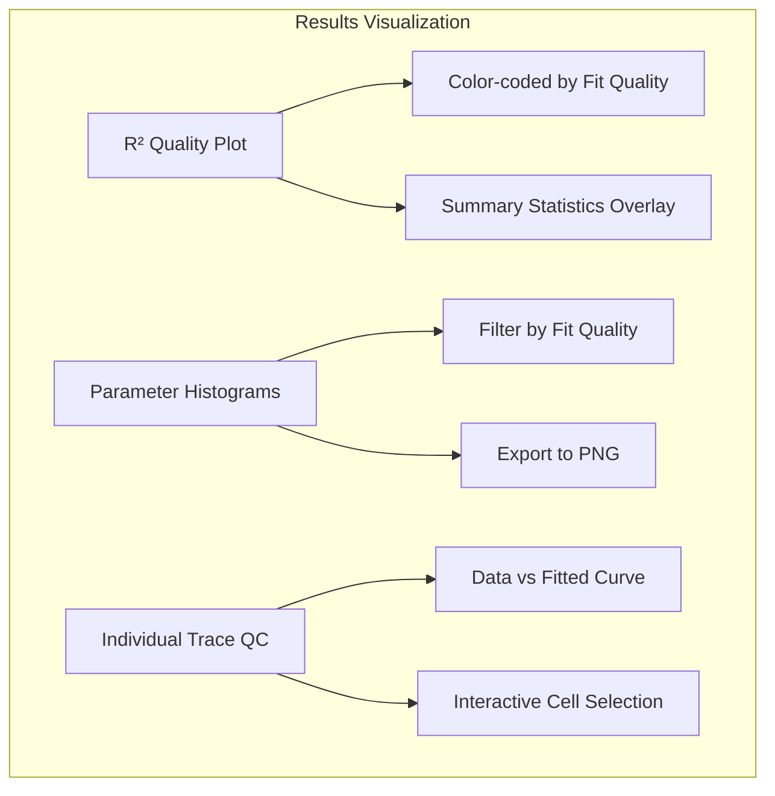
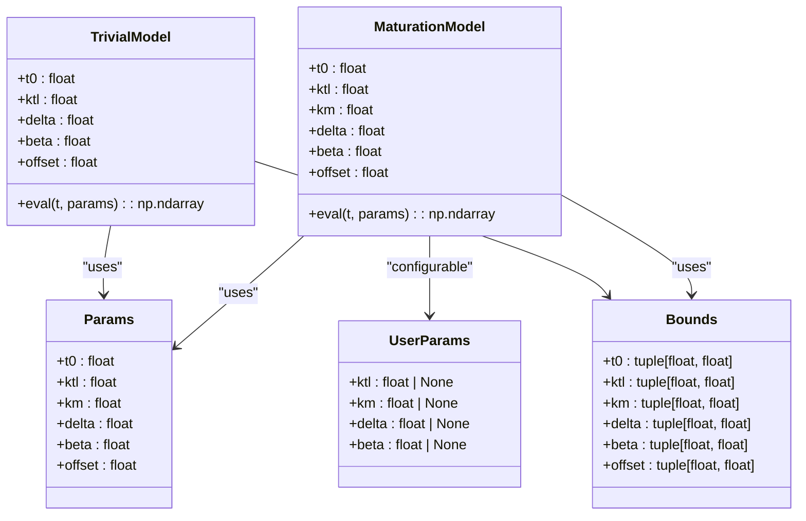
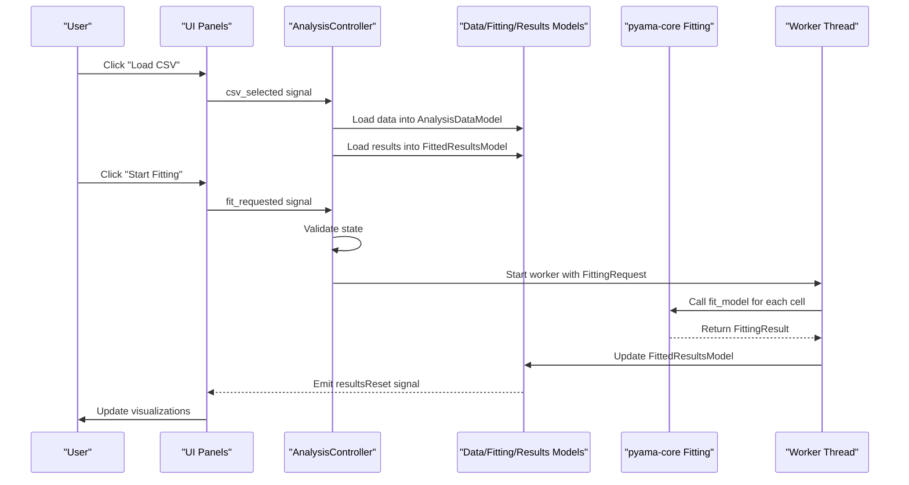

# Analysis Module

<cite>
**Referenced Files in This Document**   
- [fitting.py](file://pyama-core/src/pyama_core/analysis/fitting.py)
- [maturation.py](file://pyama-core/src/pyama_core/analysis/models/maturation.py)
- [trivial.py](file://pyama-core/src/pyama_core/analysis/models/trivial.py)
- [__init__.py](file://pyama-core/src/pyama_core/analysis/models/__init__.py)
- [analysis_csv.py](file://pyama-core/src/pyama_core/io/analysis_csv.py)
- [AnalysisController.py](file://pyama-qt/src/pyama_qt/analysis/controller.py)
- [models.py](file://pyama-qt/src/pyama_qt/analysis/models.py)
- [fitting_panel.py](file://pyama-qt/src/pyama_qt/analysis/panels/fitting_panel.py)
- [data_panel.py](file://pyama-qt/src/pyama_qt/analysis/panels/data_panel.py)
- [results_panel.py](file://pyama-qt/src/pyama_qt/analysis/panels/results_panel.py)
- [parameter_panel.py](file://pyama-qt/src/pyama_qt/components/parameter_panel.py)
- [requests.py](file://pyama-qt/src/pyama_qt/analysis/requests.py)
- [threading.py](file://pyama-qt/src/pyama_qt/services/threading.py)
- [page.py](file://pyama-qt/src/pyama_qt/analysis/page.py)
</cite>

## Table of Contents
1. [Introduction](#introduction)
2. [Data Loading and CSV Handling](#data-loading-and-csv-handling)
3. [Model Selection and Parameter Configuration](#model-selection-and-parameter-configuration)
4. [Curve Fitting Workflow](#curve-fitting-workflow)
5. [Batch Processing Across FOVs](#batch-processing-across-fovs)
6. [Results Visualization and Quality Control](#results-visualization-and-quality-control)
7. [Analysis Models for Maturation Dynamics](#analysis-models-for-maturation-dynamics)
8. [Error Handling and Convergence Issues](#error-handling-and-convergence-issues)
9. [Integration Architecture](#integration-architecture)
10. [Conclusion](#conclusion)

## Introduction
The Analysis Module provides comprehensive tools for post-processing data analysis and curve fitting of biological time-series data. This system enables researchers to load processed results, apply biological models to trace data, visualize fitting outcomes, and export results for further analysis. The module supports multiple biological models including gene expression dynamics and protein maturation processes, with flexible parameter configuration and robust fitting algorithms. Designed for high-throughput analysis, the system handles batch processing across multiple fields of view (FOVs) and experimental conditions while providing detailed quality metrics for result validation.

## Data Loading and CSV Handling
The analysis workflow begins with loading processed results from CSV files containing time-series trace data. The system uses a standardized CSV format where time values are stored as the index (in hours) and individual cell traces are represented as columns. When a CSV file is loaded through the UI's "Load CSV" button, the `AnalysisDataModel` processes the data and automatically detects time units from comment headers (supporting seconds, minutes, and hours with automatic conversion to hours). The system discovers CSV files in the specified directory, excluding files with "_fitted" or "_traces" suffixes to prevent loading of derivative files. Upon loading, the system checks for a corresponding "_fitted.csv" file containing previous fitting results, which are automatically loaded if present to maintain analysis continuity. The raw data is stored in a pandas DataFrame with proper type conversion and missing value handling, enabling subsequent analysis operations.

**Section sources**
- [analysis_csv.py](file://pyama-core/src/pyama_core/io/analysis_csv.py#L0-L164)
- [data_panel.py](file://pyama-qt/src/pyama_qt/analysis/panels/data_panel.py#L0-L103)
- [AnalysisController.py](file://pyama-qt/src/pyama_qt/analysis/controller.py#L21-L135)

## Model Selection and Parameter Configuration
The analysis system provides an interactive interface for model selection and parameter configuration through the fitting panel. Users can choose between available biological models such as "Trivial" (simple gene expression) and "Maturation" (gene expression with protein maturation) via a dropdown menu. When a model is selected, the parameter configuration table automatically updates to display the relevant parameters with their default values and allowable bounds. The system distinguishes between core model parameters and user-configurable parameters, exposing only the latter for manual adjustment. Parameters are presented in a table format with columns for name, value, minimum bound, and maximum bound, allowing users to modify values directly when the "Set parameters manually" option is enabled. The parameter system supports both point estimates and constrained optimization by allowing users to specify custom bounds for each parameter, which are validated before fitting to ensure mathematical validity.

**Section sources**
- [fitting_panel.py](file://pyama-qt/src/pyama_qt/analysis/panels/fitting_panel.py#L0-L307)
- [parameter_panel.py](file://pyama-qt/src/pyama_qt/components/parameter_panel.py#L0-L221)
- [models.py](file://pyama-qt/src/pyama_qt/analysis/models.py#L129-L200)

## Curve Fitting Workflow
The curve fitting process follows a systematic workflow from data preparation to model optimization. When fitting is initiated, the system extracts time and intensity data for each cell trace, removing any NaN values to ensure clean input for the optimization algorithm. The selected biological model is instantiated with default parameters, which are then updated with any user-specified values. Parameter bounds are similarly configured, combining model defaults with user overrides. The fitting algorithm uses scipy's least_squares optimizer to minimize the residual function, which calculates the difference between observed data and model predictions. The optimization process estimates kinetic parameters by fitting the model to the experimental time-series data. After fitting, the system computes the coefficient of determination (R²) as a goodness-of-fit metric, providing a quantitative assessment of how well the model explains the observed data. Results are packaged in a `FittingResult` object containing the fitted parameters, success status, and R² value.

**Diagram sources**
- [fitting.py](file://pyama-core/src/pyama_core/analysis/fitting.py#L0-L194)

**Section sources**
- [fitting.py](file://pyama-core/src/pyama_core/analysis/fitting.py#L0-L194)
- [fitting_panel.py](file://pyama-qt/src/pyama_qt/analysis/panels/fitting_panel.py#L0-L307)

## Batch Processing Across FOVs
The analysis system supports batch processing of multiple CSV files across different fields of view (FOVs) and experimental conditions. When the "Start Fitting" button is clicked, the controller creates a fitting request containing the selected model type, user parameters, and bounds, which is processed in a dedicated worker thread to maintain UI responsiveness. The batch processing system iterates through all discovered CSV files in the specified directory, applying the same fitting configuration to each dataset. For each file, the system loads the trace data, applies the selected model to all cell traces, and saves the results to a corresponding "_fitted.csv" file in the same directory. Progress is reported through status messages, and the system handles errors gracefully, allowing the batch process to continue even if individual files fail to process. This capability enables high-throughput analysis of large experimental datasets, facilitating comparative studies across multiple conditions and replicates.

**Section sources**
- [AnalysisController.py](file://pyama-qt/src/pyama_qt/analysis/controller.py#L21-L135)
- [requests.py](file://pyama-qt/src/pyama_qt/analysis/requests.py#L0-L13)
- [threading.py](file://pyama-qt/src/pyama_qt/services/threading.py#L0-L92)

## Results Visualization and Quality Control
The results panel provides comprehensive visualization tools for assessing fitting quality and parameter distributions. After fitting is complete, users can visualize individual cell traces with overlaid fitted curves, enabling visual inspection of model performance. The quality control system displays a scatter plot of R² values across all cells, color-coded to indicate fitting quality (green for R² > 0.9, orange for 0.7 < R² ≤ 0.9, and red for R² ≤ 0.7), with summary statistics showing the percentage of good, fair, and poor fits. Parameter distributions are visualized as histograms, allowing users to examine the population-level behavior of fitted kinetic parameters. The histogram view includes a "Good Fits Only" filter option that restricts analysis to high-quality fits (R² > 0.9), enabling more reliable parameter estimation. Users can save all parameter histograms as PNG files for reporting and publication. The system also supports random cell selection for quick inspection of representative traces, facilitating rapid assessment of overall fitting performance.

**Diagram sources**
- [results_panel.py](file://pyama-qt/src/pyama_qt/analysis/panels/results_panel.py#L0-L264)
- [fitting_panel.py](file://pyama-qt/src/pyama_qt/analysis/panels/fitting_panel.py#L0-L307)

**Section sources**
- [results_panel.py](file://pyama-qt/src/pyama_qt/analysis/panels/results_panel.py#L0-L264)
- [fitting_panel.py](file://pyama-qt/src/pyama_qt/analysis/panels/fitting_panel.py#L0-L307)

## Analysis Models for Maturation Dynamics
The system implements specialized biological models for analyzing gene expression and protein maturation dynamics. The "Maturation" model describes a system with transcription, translation, protein maturation, and degradation processes, characterized by five kinetic parameters: transcription-translation rate (ktl), maturation rate (km), degradation rate (delta), maturation-to-degradation ratio (beta), and baseline offset. The model accounts for the time delay between gene induction and observable fluorescence through the maturation process. The "Trivial" model represents a simpler gene expression system without explicit maturation, suitable for systems where maturation is fast relative to other processes. Both models are implemented as Python dataclasses with clearly defined parameters, bounds, and evaluation functions. The models expose user-configurable parameters while keeping certain parameters (like t0) fixed to their defaults, providing a balance between flexibility and identifiability. The mathematical formulation of these models enables the extraction of biologically meaningful kinetic parameters from time-lapse microscopy data.

**Diagram sources**
- [maturation.py](file://pyama-core/src/pyama_core/analysis/models/maturation.py#L0-L82)
- [trivial.py](file://pyama-core/src/pyama_core/analysis/models/trivial.py#L0-L71)
- [__init__.py](file://pyama-core/src/pyama_core/analysis/models/__init__.py#L0-L42)

**Section sources**
- [maturation.py](file://pyama-core/src/pyama_core/analysis/models/maturation.py#L0-L82)
- [trivial.py](file://pyama-core/src/pyama_core/analysis/models/trivial.py#L0-L71)

## Error Handling and Convergence Issues
The system implements robust error handling to manage common fitting challenges and convergence issues. The fitting algorithm includes validation checks for user-provided parameters and bounds, ensuring that parameter names are valid and bounds are mathematically sound (minimum < maximum). The system handles insufficient data points by checking that the number of valid observations exceeds the number of model parameters, preventing overfitting. When optimization fails to converge, the system gracefully returns a failure status with default parameters rather than propagating errors, allowing batch processing to continue. The least_squares optimizer is configured with appropriate bounds to prevent parameter values from diverging to infinity. For models with potential numerical instability (such as those involving exponential functions), the implementation includes safeguards like conditional evaluation (using np.where) to handle edge cases. The system also provides detailed error messages through the status bar, helping users diagnose and address fitting problems. Users can improve convergence by adjusting initial parameter values or widening parameter bounds based on prior knowledge of the biological system.

**Section sources**
- [fitting.py](file://pyama-core/src/pyama_core/analysis/fitting.py#L0-L194)
- [AnalysisController.py](file://pyama-qt/src/pyama_qt/analysis/controller.py#L21-L135)

## Integration Architecture
The analysis module follows a Model-View-Controller (MVC) architecture with clear separation of concerns between UI components, data models, and processing logic. The `AnalysisController` coordinates between the data, fitting, and results models, handling user interactions and workflow management. The core fitting algorithms are implemented in the pyama-core package, providing a framework-agnostic interface that can be used independently of the Qt UI. The UI components (data panel, fitting panel, and results panel) bind to their respective models, automatically updating when model data changes. Signal-slot connections enable communication between components without tight coupling. Worker threads handle computationally intensive fitting operations, preventing UI freezing during batch processing. The system uses pandas DataFrames as the primary data structure for both raw traces and fitted results, ensuring consistency across components. CSV import/export functionality maintains data persistence between sessions, while the modular model system allows for easy extension with additional biological models.

**Diagram sources**
- [page.py](file://pyama-qt/src/pyama_qt/analysis/page.py#L0-L64)
- [AnalysisController.py](file://pyama-qt/src/pyama_qt/analysis/controller.py#L21-L135)
- [models.py](file://pyama-qt/src/pyama_qt/analysis/models.py#L15-L288)

**Section sources**
- [page.py](file://pyama-qt/src/pyama_qt/analysis/page.py#L0-L64)
- [AnalysisController.py](file://pyama-qt/src/pyama_qt/analysis/controller.py#L21-L135)
- [models.py](file://pyama-qt/src/pyama_qt/analysis/models.py#L15-L288)

## Conclusion
The Analysis Module provides a comprehensive framework for post-processing and curve fitting of biological time-series data. By integrating robust mathematical models with an intuitive user interface, the system enables researchers to extract meaningful kinetic parameters from complex experimental data. The modular architecture separates core analysis logic from UI components, ensuring maintainability and extensibility. Key features include support for multiple biological models, flexible parameter configuration, batch processing capabilities, and comprehensive quality control visualizations. The system handles common challenges in curve fitting such as convergence issues and parameter identifiability through careful algorithm design and user guidance. With its CSV-based data persistence and high-throughput processing capabilities, the module is well-suited for analyzing large-scale microscopy experiments and deriving quantitative insights into dynamic biological processes.