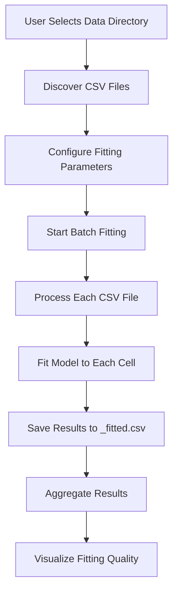
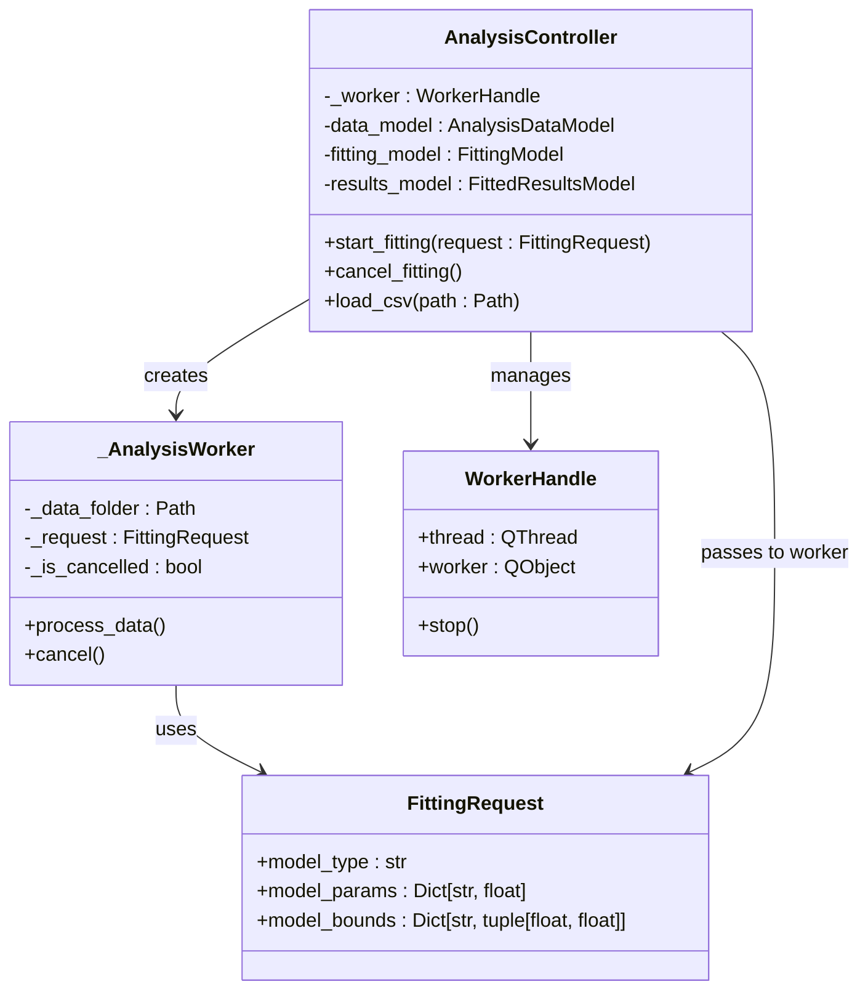
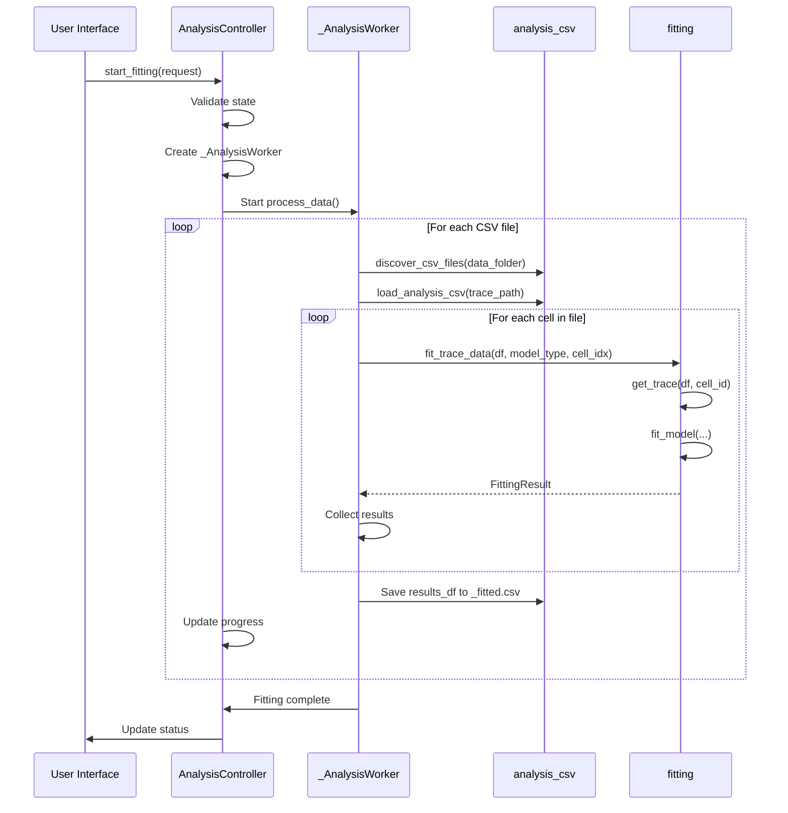
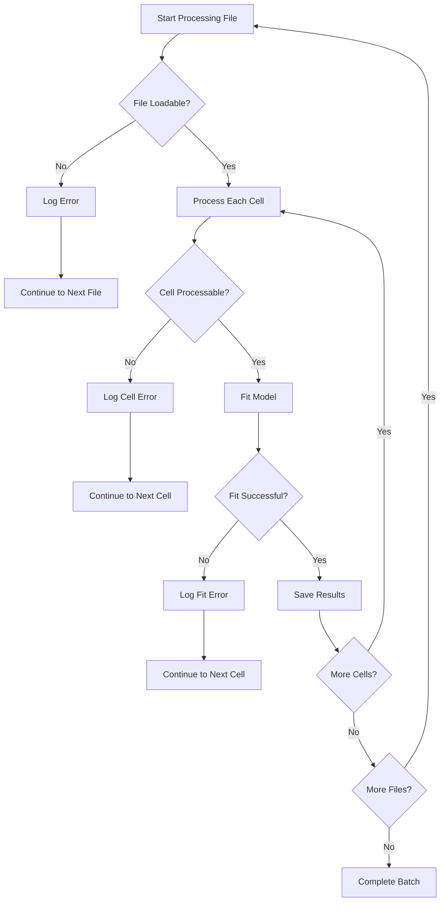
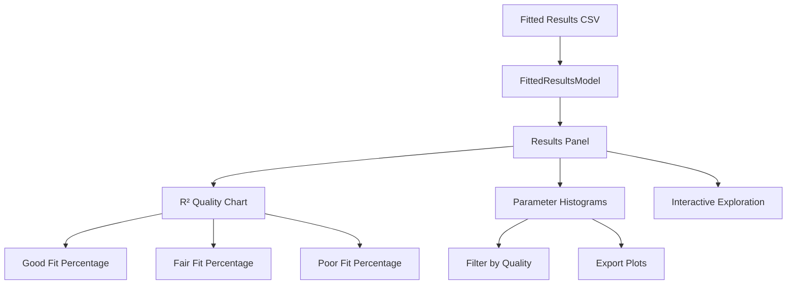

# Batch Fitting

<cite>
**Referenced Files in This Document**   
- [controller.py](file://pyama-qt/src/pyama_qt/analysis/controller.py)
- [fitting.py](file://pyama-core/src/pyama_core/analysis/fitting.py)
- [analysis_csv.py](file://pyama-core/src/pyama_core/io/analysis_csv.py)
- [requests.py](file://pyama-qt/src/pyama_qt/analysis/requests.py)
- [models.py](file://pyama-qt/src/pyama_qt/analysis/models.py)
- [fitting_panel.py](file://pyama-qt/src/pyama_qt/analysis/panels/fitting_panel.py)
- [threading.py](file://pyama-qt/src/pyama_qt/services/threading.py)
</cite>

## Table of Contents
1. [Introduction](#introduction)
2. [Batch Fitting Workflow](#batch-fitting-workflow)
3. [Core Components](#core-components)
4. [Data Flow and Processing](#data-flow-and-processing)
5. [Error Handling and Recovery](#error-handling-and-recovery)
6. [Performance Optimization](#performance-optimization)
7. [Results Aggregation and Visualization](#results-aggregation-and-visualization)
8. [Best Practices](#best-practices)

## Introduction
The Batch Fitting sub-feature in the Analysis Module enables automated model fitting across multiple fields of view and experimental conditions. This system allows users to process numerous datasets simultaneously, significantly improving throughput for large-scale experiments. The implementation combines a responsive Qt-based user interface with robust background processing to handle computationally intensive fitting operations without blocking the main application thread. The system supports various biological models and provides comprehensive error recovery mechanisms to ensure reliable processing even with imperfect datasets.

## Batch Fitting Workflow
The batch fitting process follows a structured workflow from dataset selection to results aggregation. Users begin by loading one or more CSV files containing time-series data through the Data Panel. The system automatically discovers all relevant CSV files in the selected directory, excluding previously fitted results files. Once datasets are selected, users configure fitting parameters including model type, initial parameter values, and parameter bounds through the Fitting Panel. Initiating the batch process triggers the creation of a background worker that processes each file sequentially, fitting the selected model to every cell trace within each dataset. Results are saved incrementally to prevent data loss and can be visualized immediately upon completion.

**Diagram sources**
- [controller.py](file://pyama-qt/src/pyama_qt/analysis/controller.py#L155-L234)
- [analysis_csv.py](file://pyama-core/src/pyama_core/io/analysis_csv.py#L145-L163)

**Section sources**
- [controller.py](file://pyama-qt/src/pyama_qt/analysis/controller.py#L55-L82)
- [fitting_panel.py](file://pyama-qt/src/pyama_qt/analysis/panels/fitting_panel.py#L150-L180)

## Core Components
The batch fitting system comprises several interconnected components that work together to enable efficient parallel processing. The AnalysisController serves as the central coordinator, managing the lifecycle of fitting operations and maintaining state between the UI and background workers. The _AnalysisWorker class executes the actual fitting process in a separate thread, preventing the application from becoming unresponsive during long-running operations. The FittingRequest dataclass encapsulates all parameters needed for a fitting job, ensuring type safety and clear interface boundaries. The threading system provides safe worker management with proper cleanup to prevent resource leaks.

**Diagram sources**
- [controller.py](file://pyama-qt/src/pyama_qt/analysis/controller.py#L55-L82)
- [requests.py](file://pyama-qt/src/pyama_qt/analysis/requests.py#L6-L13)
- [threading.py](file://pyama-qt/src/pyama_qt/services/threading.py#L15-L92)

**Section sources**
- [controller.py](file://pyama-qt/src/pyama_qt/analysis/controller.py#L1-L235)
- [requests.py](file://pyama-qt/src/pyama_qt/analysis/requests.py#L1-L14)

## Data Flow and Processing
The data flow in the batch fitting system follows a clear pipeline from user input to final results. When a user selects a data directory, the discover_csv_files function identifies all relevant CSV files while excluding previously fitted results. For each identified file, the system loads the data using load_analysis_csv, which handles time unit conversion and data validation. The fit_trace_data function processes each cell trace individually, applying the specified model with user-defined parameters and bounds. Results are collected in memory and written to disk as soon as each file is processed, ensuring data persistence even if subsequent files fail. The incremental saving approach minimizes memory usage and allows for partial results when some datasets are problematic.

**Diagram sources**
- [controller.py](file://pyama-qt/src/pyama_qt/analysis/controller.py#L155-L234)
- [fitting.py](file://pyama-core/src/pyama_core/analysis/fitting.py#L174-L193)
- [analysis_csv.py](file://pyama-core/src/pyama_core/io/analysis_csv.py#L145-L163)

**Section sources**
- [controller.py](file://pyama-qt/src/pyama_qt/analysis/controller.py#L155-L234)
- [fitting.py](file://pyama-core/src/pyama_core/analysis/fitting.py#L1-L194)

## Error Handling and Recovery
The batch fitting system implements comprehensive error handling to ensure robust operation across diverse datasets. The system distinguishes between recoverable and non-recoverable errors, allowing partial completion when possible. For individual cell fitting failures, the system logs the error and continues processing remaining cells, preventing a single problematic trace from halting the entire batch. File-level errors, such as unreadable CSV files, are similarly handled by logging the issue and proceeding to the next file. The worker thread includes a cancellation mechanism that allows users to stop long-running operations gracefully. All critical sections are wrapped in try-except blocks to prevent crashes from propagating to the main application.

**Diagram sources**
- [controller.py](file://pyama-qt/src/pyama_qt/analysis/controller.py#L155-L234)
- [fitting.py](file://pyama-core/src/pyama_core/analysis/fitting.py#L1-L194)

**Section sources**
- [controller.py](file://pyama-qt/src/pyama_qt/analysis/controller.py#L155-L234)
- [fitting.py](file://pyama-core/src/pyama_core/analysis/fitting.py#L100-L150)

## Performance Optimization
The batch fitting system incorporates several performance optimizations to handle large datasets efficiently. The processing is offloaded to a background thread to maintain UI responsiveness, with progress updates sent via Qt signals to avoid blocking. Memory usage is optimized by processing one file at a time and writing results incrementally, rather than holding all results in memory. The system leverages pandas DataFrames for efficient data manipulation and NumPy for numerical computations in the fitting algorithms. For very large datasets, users can improve performance by selecting appropriate model complexity and parameter bounds to reduce fitting time per cell. The progress callback system reports status at regular intervals to balance feedback frequency with performance overhead.

**Section sources**
- [controller.py](file://pyama-qt/src/pyama_qt/analysis/controller.py#L155-L234)
- [fitting.py](file://pyama-core/src/pyama_core/analysis/fitting.py#L1-L194)
- [threading.py](file://pyama-qt/src/pyama_qt/services/threading.py#L1-L93)

## Results Aggregation and Visualization
After batch fitting completes, results are automatically aggregated and made available for visualization. The system loads fitted results from all _fitted.csv files into a unified DataFrame, enabling cross-dataset analysis. The Results Panel provides interactive visualizations including R² quality charts and parameter histograms, allowing users to quickly assess fitting performance across all cells. Users can filter histograms to show only high-quality fits (R² > 0.9) or examine the full distribution of parameter values. The visualization system supports exporting all parameter histograms as PNG files for reporting purposes. Quality metrics are calculated automatically, providing percentages of good, fair, and poor fits to help users evaluate overall experiment quality.

**Diagram sources**
- [models.py](file://pyama-qt/src/pyama_qt/analysis/models.py#L200-L289)
- [results_panel.py](file://pyama-qt/src/pyama_qt/analysis/panels/results_panel.py#L1-L265)

**Section sources**
- [models.py](file://pyama-qt/src/pyama_qt/analysis/models.py#L200-L289)
- [results_panel.py](file://pyama-qt/src/pyama_qt/analysis/panels/results_panel.py#L1-L265)

## Best Practices
To achieve optimal results with the batch fitting system, users should follow several best practices. Before initiating a batch process, verify that all CSV files follow the expected format with time as the index and cell traces as columns. Select model parameters and bounds based on prior knowledge of the biological system to improve fitting convergence. For large datasets, consider starting with a subset of files to validate parameters before processing the complete dataset. Monitor memory usage when processing very large numbers of cells, as each fitting operation requires additional memory. Regularly save fitted results to prevent data loss, especially when processing time-consuming batches. When encountering systematic fitting failures, examine the R² distribution to identify potential issues with data quality or model selection.

**Section sources**
- [controller.py](file://pyama-qt/src/pyama_qt/analysis/controller.py#L1-L235)
- [fitting.py](file://pyama-core/src/pyama_core/analysis/fitting.py#L1-L194)
- [results_panel.py](file://pyama-qt/src/pyama_qt/analysis/panels/results_panel.py#L1-L265)