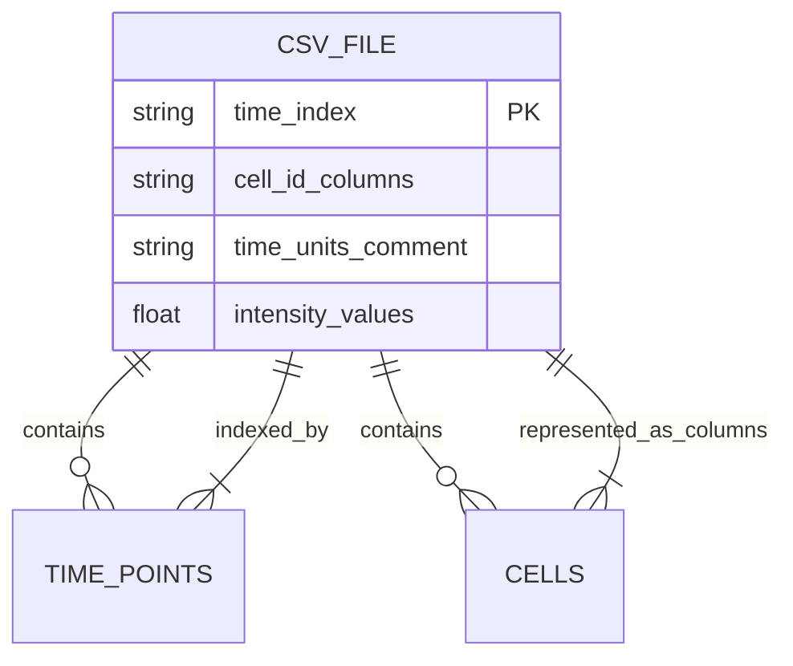
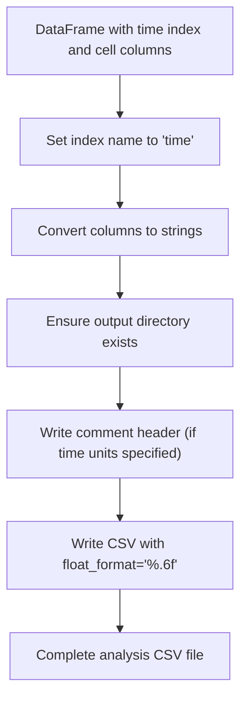
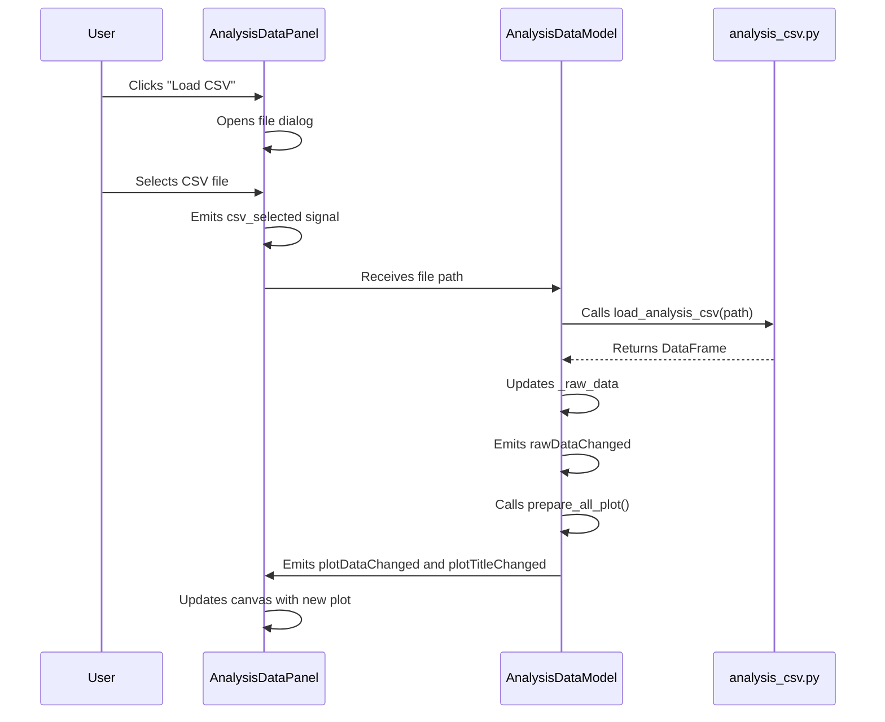
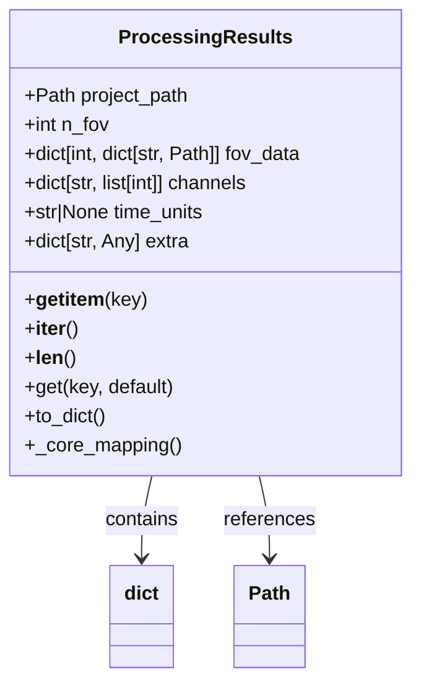

# Data Import and Export

<cite>
**Referenced Files in This Document**   
- [data_panel.py](file://pyama-qt/src/pyama_qt/analysis/panels/data_panel.py)
- [analysis_csv.py](file://pyama-core/src/pyama_core/io/analysis_csv.py)
- [results_yaml.py](file://pyama-core/src/pyama_core/io/results_yaml.py)
- [models.py](file://pyama-qt/src/pyama_qt/analysis/models.py)
</cite>

## Table of Contents
1. [Introduction](#introduction)
2. [Data Import Workflow](#data-import-workflow)
3. [Analysis CSV Format](#analysis-csv-format)
4. [Data Export and Serialization](#data-export-and-serialization)
5. [UI Integration and Data Flow](#ui-integration-and-data-flow)
6. [Error Handling and Validation](#error-handling-and-validation)
7. [YAML Results Integration](#yaml-results-integration)
8. [Best Practices for Data Preparation](#best-practices-for-data-preparation)
9. [Troubleshooting Common Issues](#troubleshooting-common-issues)
10. [Conclusion](#conclusion)

## Introduction

The data import and export sub-feature of the Analysis Module enables users to load time-series intensity data from CSV files and export analysis results in standardized formats. This system bridges the gap between raw experimental data and processed analytical results, supporting both interactive exploration and reproducible workflows. The implementation separates concerns between UI components in `pyama-qt` and core I/O functionality in `pyama-core`, ensuring maintainability and testability.

**Section sources**
- [data_panel.py](file://pyama-qt/src/pyama_qt/analysis/panels/data_panel.py#L1-L104)
- [analysis_csv.py](file://pyama-core/src/pyama_core/io/analysis_csv.py#L1-L165)

## Data Import Workflow

The data import process begins with the user selecting a CSV file through the UI's data panel. The `AnalysisDataPanel` component provides a "Load CSV" button that triggers a file dialog, restricting selection to `.csv` files. Upon selection, the panel emits a `csv_selected` signal with the file path, which is handled by the underlying `AnalysisDataModel`.

The model delegates CSV loading to the `load_analysis_csv` function from the core I/O module. This function performs several critical operations: it checks for the file's existence, reads optional time unit metadata from comment headers, loads the data into a pandas DataFrame with time as the index, and converts all values to numeric types while coercing invalid entries to NaN. If time units are specified and not in hours, automatic conversion is applied using predefined factors (e.g., seconds to hours uses a factor of 1/3600).

**Section sources**
- [data_panel.py](file://pyama-qt/src/pyama_qt/analysis/panels/data_panel.py#L60-L69)
- [models.py](file://pyama-qt/src/pyama_qt/analysis/models.py#L42-L55)
- [analysis_csv.py](file://pyama-core/src/pyama_core/io/analysis_csv.py#L39-L91)

## Analysis CSV Format

The analysis CSV format follows a simple but strict schema designed for time-series cellular data. The format uses time values as the row index (labeled "time") and cell identifiers as column headers. Key characteristics include:

- **Index**: Time values in hours (or convertible units) as the first column
- **Columns**: Sequential cell IDs starting from 0 as column headers
- **Header**: Optional comment line `# Time units: [units]` specifying original time units
- **Data**: Numeric intensity values, with missing data represented as empty cells or NaN

The `create_analysis_dataframe` utility ensures proper formatting by creating a DataFrame with sequential cell IDs and filling missing cells with NaN values. The `get_analysis_stats` function provides metadata extraction, calculating statistics such as time points count, cell count, duration, time interval, missing values, and complete traces.

**Diagram sources**
- [analysis_csv.py](file://pyama-core/src/pyama_core/io/analysis_csv.py#L1-L165)

**Section sources**
- [analysis_csv.py](file://pyama-core/src/pyama_core/io/analysis_csv.py#L93-L142)

## Data Export and Serialization

Data export is handled by the `write_analysis_csv` function, which serializes a pandas DataFrame to the analysis CSV format. The function ensures the output directory exists, sets the index name to "time", converts column headers to strings, and writes the data with six decimal places precision. If time units are specified, they are written as a comment header before the CSV content.

The export process preserves data integrity by using pandas' built-in CSV writing capabilities while adding domain-specific formatting. The resulting files are human-readable and compatible with external analysis tools. For downstream analysis, users can directly import these CSV files into statistical software or programming environments like Python, R, or MATLAB.

**Diagram sources**
- [analysis_csv.py](file://pyama-core/src/pyama_core/io/analysis_csv.py#L13-L36)

**Section sources**
- [analysis_csv.py](file://pyama-core/src/pyama_core/io/analysis_csv.py#L13-L36)

## UI Integration and Data Flow

The integration between the UI's data panel and core I/O functionality follows a clean Model-View-Controller pattern. The `AnalysisDataPanel` serves as the view component, handling user interaction and visualization, while the `AnalysisDataModel` acts as the model, managing data state and business logic.

When a CSV file is selected, the data panel emits a signal that the model captures and processes by calling `load_csv`. Upon successful loading, the model emits a `rawDataChanged` signal, triggering the data panel's `_on_raw_data_changed` method. This method generates a hash of the plot data to prevent redundant rendering and updates the matplotlib canvas with all individual traces (in gray) and their mean (in red).

The data flow is optimized to minimize unnecessary computations. A hash-based change detection system prevents redundant plotting when the data hasn't changed. The visualization always shows the "all lines + mean" view, regardless of any cell highlighting in other components, ensuring consistency in the data panel.

**Diagram sources**
- [data_panel.py](file://pyama-qt/src/pyama_qt/analysis/panels/data_panel.py#L71-L99)
- [models.py](file://pyama-qt/src/pyama_qt/analysis/models.py#L57-L86)

**Section sources**
- [data_panel.py](file://pyama-qt/src/pyama_qt/analysis/panels/data_panel.py#L51-L54)
- [models.py](file://pyama-qt/src/pyama_qt/analysis/models.py#L42-L55)

## Error Handling and Validation

The system implements comprehensive error handling at multiple levels. At the file system level, `load_analysis_csv` checks for file existence and raises a `FileNotFoundError` if the specified path doesn't exist. During parsing, pandas' `to_numeric` function with `errors="coerce"` converts invalid entries to NaN, preventing parsing failures from malformed data.

The UI layer provides user-friendly error reporting through Python's logging system. When CSV loading fails, the exception is logged with full traceback information, helping users and developers diagnose issues. The system gracefully handles various data quality issues, including missing columns (treated as missing data), data type mismatches (converted to NaN), and malformed CSV syntax (handled by pandas' robust CSV parser).

For time unit conversion, the system supports multiple aliases (e.g., "seconds", "sec", "s") and applies appropriate conversion factors. Invalid time units are ignored, and the data is assumed to be in hours. This lenient approach ensures that minor formatting errors don't prevent data loading while still providing correct time scaling when metadata is available.

**Section sources**
- [analysis_csv.py](file://pyama-core/src/pyama_core/io/analysis_csv.py#L39-L91)
- [models.py](file://pyama-qt/src/pyama_qt/analysis/models.py#L42-L55)

## YAML Results Integration

While CSV files handle raw and processed intensity data, the system uses YAML files to store metadata and processing results through the `ProcessingResults` class. This dataclass-based structure contains project path, number of fields of view (FOV), per-FOV data file mappings, channel information, and time units.

The YAML integration serves two purposes: first, it provides a human-readable configuration format for processing parameters; second, it acts as an index for large datasets with multiple FOVs and channels. The system can load results either from an explicit `processing_results.yaml` file or by discovering directory structure when the YAML file is missing.

Path correction logic handles cases where data folders have been moved. When loading from YAML, the system attempts to use original paths, but if they don't exist, it reconstructs paths based on relative structure (using the last two path components: FOV directory and filename). This robustness ensures that projects remain portable across different systems and directory structures.

**Diagram sources**
- [results_yaml.py](file://pyama-core/src/pyama_core/io/results_yaml.py#L14-L60)

**Section sources**
- [results_yaml.py](file://pyama-core/src/pyama_core/io/results_yaml.py#L1-L296)

## Best Practices for Data Preparation

To ensure successful data import, external CSV files should follow these guidelines:

1. **Structure**: Use time values in the first column with header "time" (automatically set by export)
2. **Cell IDs**: Use sequential integers starting from 0 as column headers
3. **Time Units**: Include a comment line `# Time units: [units]` if not in hours
4. **Data Quality**: Ensure numeric values; use empty cells for missing data
5. **Formatting**: Save with standard CSV formatting, UTF-8 encoding

For downstream analysis, exported CSV files are immediately usable in various tools. The consistent formatting with time in hours and six decimal places precision ensures numerical stability. When sharing results, include both the CSV data and any associated YAML metadata files to preserve full context.

The `discover_csv_files` utility helps locate appropriate CSV files by excluding files with "_fitted" or "_traces" in their names, focusing on primary data files. This convention helps organize related files while keeping the main analysis data easily discoverable.

**Section sources**
- [analysis_csv.py](file://pyama-core/src/pyama_core/io/analysis_csv.py#L144-L165)

## Troubleshooting Common Issues

**Malformed CSV Files**: If a CSV file fails to load, check for proper comma separation, consistent column counts, and valid numeric data. The system will convert invalid entries to NaN, but severe formatting issues may prevent loading entirely.

**Missing Columns**: When cell data is missing for certain time points, the system automatically fills with NaN values. Ensure that all expected cell IDs are present as columns, even if some have incomplete data.

**Data Type Mismatches**: Non-numeric values in data columns are converted to NaN. Verify that intensity values don't contain text labels, units, or special characters.

**Time Unit Issues**: If time values appear incorrect, check for the `# Time units:` comment header. The system supports various time unit specifications, but misspelled units will be ignored.

**File Path Problems**: When working with YAML results, ensure that the directory structure matches the paths stored in the YAML file, or rely on the path correction system by maintaining the relative structure of FOV directories and files.

**Section sources**
- [analysis_csv.py](file://pyama-core/src/pyama_core/io/analysis_csv.py#L39-L91)
- [results_yaml.py](file://pyama-core/src/pyama_core/io/results_yaml.py#L100-L150)

## Conclusion

The data import and export system in PyAMA provides a robust foundation for analysis workflows, balancing user-friendliness with technical rigor. By separating UI concerns from core I/O functionality, the design ensures maintainability while providing rich features like automatic time unit conversion, hash-based rendering optimization, and path correction for portable projects. The combination of CSV for data and YAML for metadata creates a flexible ecosystem that supports both interactive exploration and reproducible research.