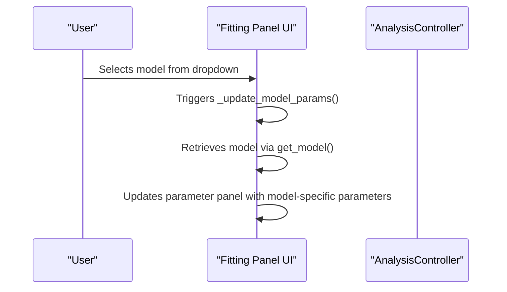
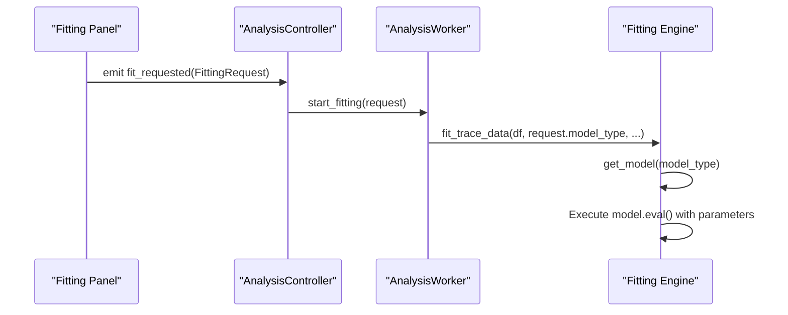
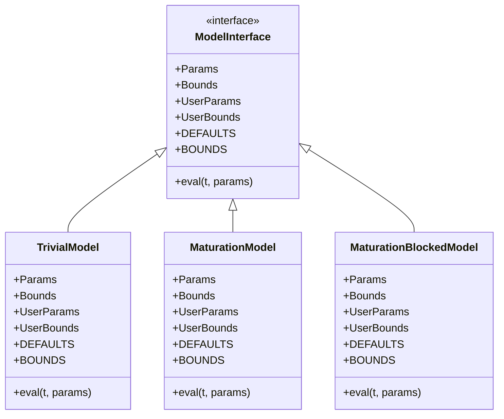
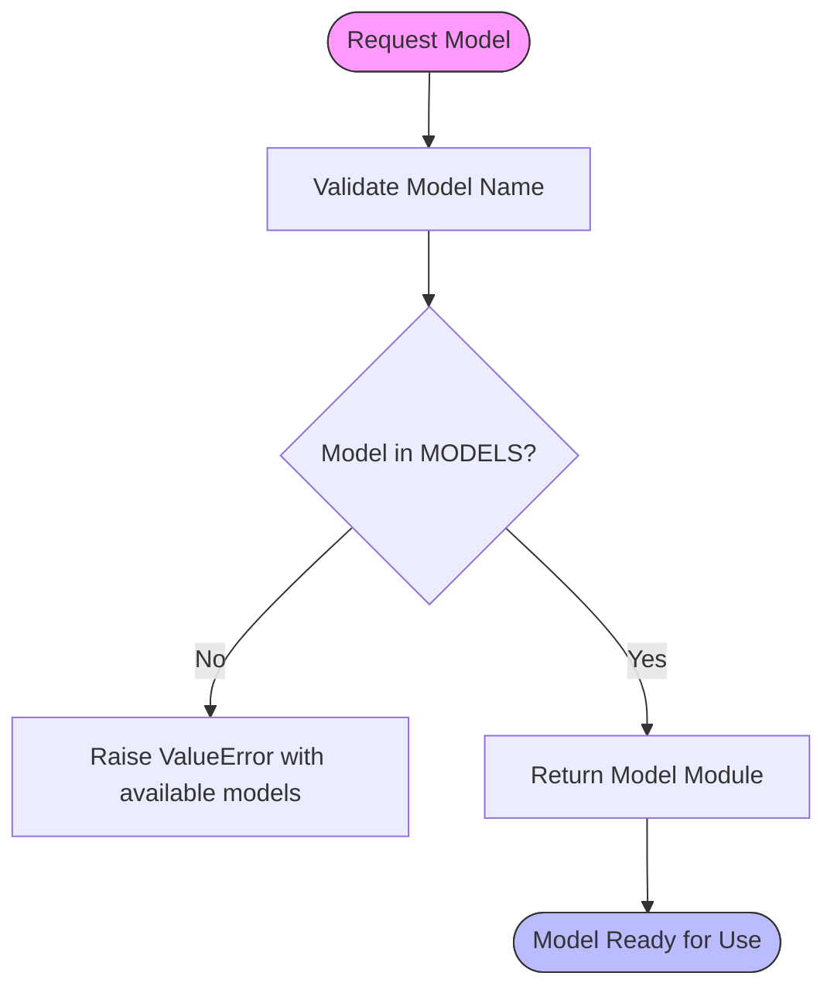
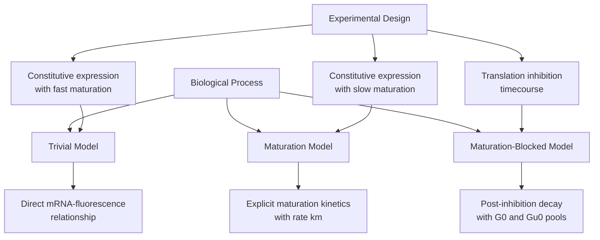
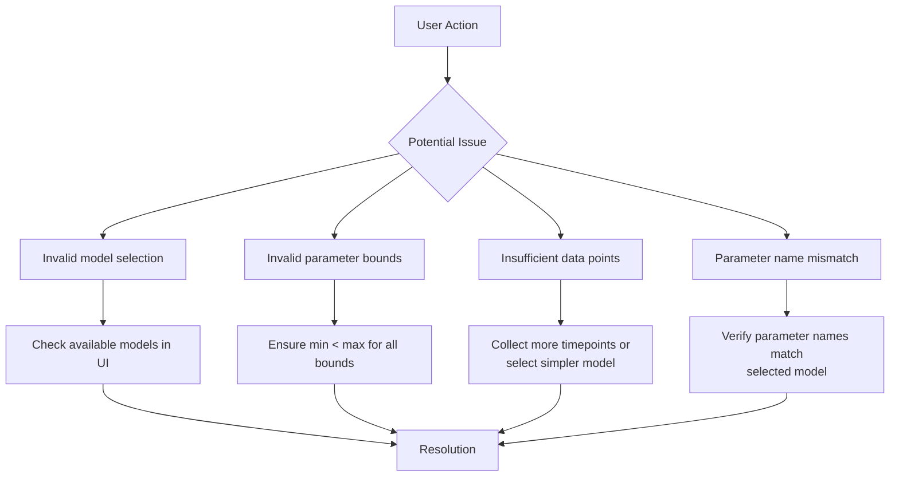
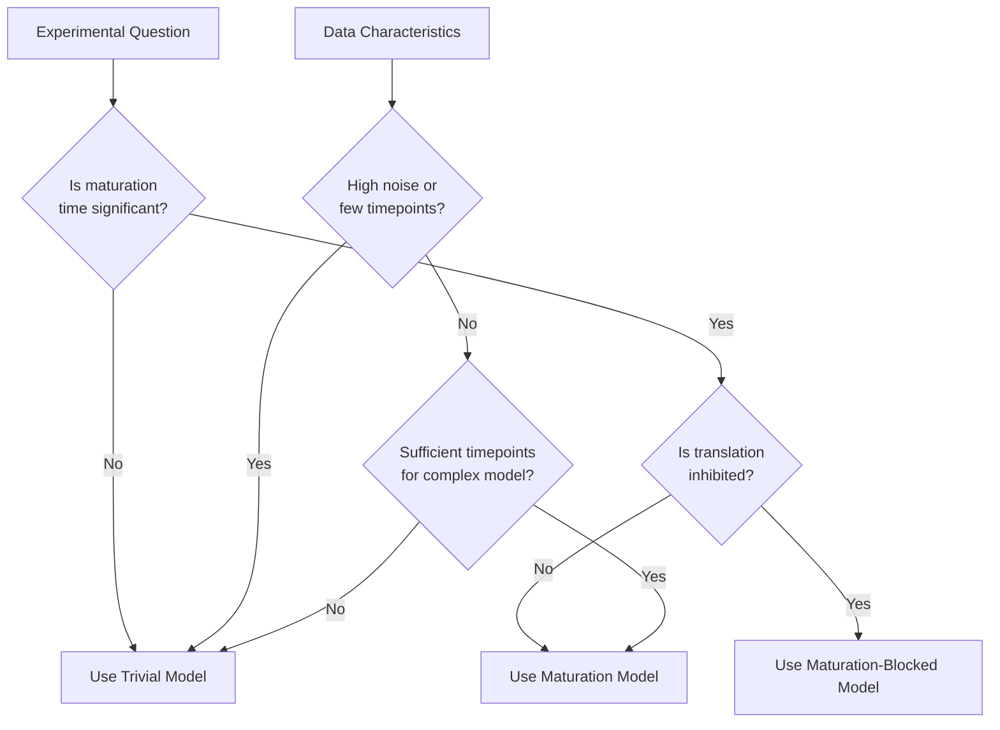

# Model Selection

<cite>
**Referenced Files in This Document**   
- [trivial.py](file://pyama-core/src/pyama_core/analysis/models/trivial.py)
- [maturation.py](file://pyama-core/src/pyama_core/analysis/models/maturation.py)
- [maturation_blocked.py](file://pyama-core/src/pyama_core/analysis/models/maturation_blocked.py)
- [__init__.py](file://pyama-core/src/pyama_core/analysis/models/__init__.py)
- [fitting.py](file://pyama-core/src/pyama_core/analysis/fitting.py)
- [fitting_panel.py](file://pyama-qt/src/pyama_qt/analysis/panels/fitting_panel.py)
- [controller.py](file://pyama-qt/src/pyama_qt/analysis/controller.py)
- [models.py](file://pyama-qt/src/pyama_qt/analysis/models.py)
- [requests.py](file://pyama-qt/src/pyama_qt/analysis/requests.py)
</cite>

## Table of Contents
1. [Introduction](#introduction)
2. [Model Selection in the UI](#model-selection-in-the-ui)
3. [Model Propagation to Fitting Engine](#model-propagation-to-fitting-engine)
4. [Plugin-like Model Architecture](#plugin-like-model-architecture)
5. [Model Registration and Instantiation](#model-registration-and-instantiation)
6. [Biological Models and Their Domain Logic](#biological-models-and-their-domain-logic)
7. [Common Issues and Troubleshooting](#common-issues-and-troubleshooting)
8. [Model Selection Guidance](#model-selection-guidance)
9. [Conclusion](#conclusion)

## Introduction
This document provides comprehensive documentation for the model selection sub-feature of the Analysis Module in the pyama system. It explains how users can choose between different biological models through the user interface and how this selection is propagated to the core fitting engine. The document covers the plugin-like architecture of the models module, demonstrates how new models can be added, and explains the biological relevance of each model. It also addresses common configuration issues and provides guidance on selecting appropriate models based on experimental conditions, making the content accessible to both beginners and experienced developers.

## Model Selection in the UI

The model selection interface is implemented in the `AnalysisFittingPanel` class within the pyama-qt application. Users can select between available biological models through a dropdown menu in the fitting panel of the application's graphical interface.

The UI presents three model options to users: "Trivial", "Maturation", and "Maturation-Blocked". When a user selects a model from the dropdown, the interface automatically updates the parameter input fields to display only the parameters relevant to the selected model. This dynamic parameter display ensures that users are only presented with configurable options that are meaningful for their chosen model.

The model selection process is event-driven, with the UI components connected to the underlying model through Qt signals and slots. When a user changes the model selection, the `_update_model_params` method is triggered, which retrieves the appropriate model configuration and updates the parameter panel accordingly.

**Diagram sources**
- [fitting_panel.py](file://pyama-qt/src/pyama_qt/analysis/panels/fitting_panel.py#L150-L185)

**Section sources**
- [fitting_panel.py](file://pyama-qt/src/pyama_qt/analysis/panels/fitting_panel.py#L150-L185)

## Model Propagation to Fitting Engine

Once a user selects a model and initiates the fitting process, the model selection is propagated from the UI to the core fitting engine through a well-defined request-response pattern. The selected model type and associated parameters are packaged into a `FittingRequest` object, which serves as the data transfer mechanism between the UI layer and the analysis backend.

The `AnalysisController` class acts as the intermediary that coordinates this propagation. When the user clicks the "Start Fitting" button, the controller collects the current model selection and parameter values from the UI, creates a `FittingRequest` object, and passes it to the worker process responsible for executing the fitting algorithm.

The fitting engine in the pyama-core package receives this request and uses the model type string to dynamically retrieve the appropriate model implementation through the `get_model` function. This function serves as a factory that returns the module corresponding to the requested model type, enabling the fitting algorithm to work with any registered model without requiring code changes.

**Diagram sources**
- [fitting_panel.py](file://pyama-qt/src/pyama_qt/analysis/panels/fitting_panel.py#L220-L240)
- [controller.py](file://pyama-qt/src/pyama_qt/analysis/controller.py#L40-L60)
- [fitting.py](file://pyama-core/src/pyama_core/analysis/fitting.py#L102-L147)

**Section sources**
- [fitting_panel.py](file://pyama-qt/src/pyama_qt/analysis/panels/fitting_panel.py#L220-L240)
- [controller.py](file://pyama-qt/src/pyama_qt/analysis/controller.py#L40-L60)
- [requests.py](file://pyama-qt/src/pyama_qt/analysis/requests.py#L7-L12)
- [fitting.py](file://pyama-core/src/pyama_core/analysis/fitting.py#L102-L147)

## Plugin-like Model Architecture

The models module implements a plugin-like architecture that allows for easy extension and modification of biological models without requiring changes to the core fitting engine. This architecture is based on a consistent interface that all models must implement, enabling the system to treat different models uniformly while preserving their unique biological characteristics.

The architecture follows a modular design pattern where each biological model is contained within its own Python module (trivial.py, maturation.py, maturation_blocked.py). Each module defines the same set of components: `Params`, `Bounds`, `UserParams`, `UserBounds`, `DEFAULTS`, `BOUNDS`, and an `eval` function. This consistency allows the fitting engine to interact with any model using the same code path, regardless of the underlying biological assumptions.

The central registry for models is maintained in the `__init__.py` file of the models package, which imports all available models and registers them in the `MODELS` dictionary. This registration pattern enables dynamic model discovery and instantiation, as the system can enumerate all available models through the `list_models()` function and retrieve any model by name using the `get_model()` function.

**Diagram sources**
- [__init__.py](file://pyama-core/src/pyama_core/analysis/models/__init__.py#L15-L35)
- [trivial.py](file://pyama-core/src/pyama_core/analysis/models/trivial.py#L1-L70)
- [maturation.py](file://pyama-core/src/pyama_core/analysis/models/maturation.py#L1-L81)
- [maturation_blocked.py](file://pyama-core/src/pyama_core/analysis/models/maturation_blocked.py#L1-L77)

**Section sources**
- [__init__.py](file://pyama-core/src/pyama_core/analysis/models/__init__.py#L1-L42)

## Model Registration and Instantiation

Model registration and instantiation follow a factory pattern implemented in the `__init__.py` file of the models package. The registration process begins with the import of individual model modules, which are then added to the `MODELS` dictionary with lowercase string keys. This dictionary serves as the central registry for all available models in the system.

The `get_model()` function acts as the primary factory method for model instantiation, taking a model name string as input and returning the corresponding module object. This function performs validation by checking if the requested model exists in the registry, providing a clear error message with available options if the requested model is not found.

The `get_types()` function complements the factory pattern by providing access to the type definitions within each model module. This function returns a dictionary containing the `Params`, `Bounds`, `UserParams`, and `UserBounds` classes for the requested model, allowing the UI and fitting engine to introspect the model's structure without directly importing the module.

When a new model is added to the system, it must be registered by adding an import statement and including it in the `MODELS` dictionary. The new model must implement the same interface as existing models, defining the required classes and functions with identical signatures to ensure compatibility with the fitting engine.

**Diagram sources**
- [__init__.py](file://pyama-core/src/pyama_core/analysis/models/__init__.py#L15-L35)

**Section sources**
- [__init__.py](file://pyama-core/src/pyama_core/analysis/models/__init__.py#L15-L35)

## Biological Models and Their Domain Logic

The system implements three distinct biological models that represent different assumptions about gene expression dynamics. Each model is designed to capture specific biological phenomena and is appropriate for different experimental conditions.

### Trivial Model
The Trivial model represents simple gene expression dynamics without protein maturation effects. It assumes that fluorescence is directly proportional to mRNA levels, making it suitable for systems where the fluorescent protein matures rapidly compared to the timescale of the experiment. The model has parameters for transcription rate (ktl), mRNA degradation rate (delta), protein degradation rate (beta), and a time offset (t0). This model is mathematically simpler and has fewer parameters, making it more robust for datasets with lower signal-to-noise ratios.

### Maturation Model
The Maturation model extends the Trivial model by explicitly accounting for protein maturation kinetics. This model is appropriate when the maturation time of the fluorescent protein is significant compared to the experimental timescale. It introduces a maturation rate parameter (km) that describes the conversion of immature to mature fluorescent protein. The model captures the delay between gene expression and detectable fluorescence, providing more accurate parameter estimates when maturation effects are present in the data.

### Maturation-Blocked Model
The Maturation-Blocked model describes decay dynamics after maturation inhibition, such as when a translation inhibitor is applied. This model is specifically designed for perturbation experiments where protein production is stopped, and only degradation processes are observed. It uses initial concentrations of mature (G0) and immature (Gu0) protein pools, allowing it to capture the biphasic decay pattern that results from the continued maturation of existing immature proteins after translation inhibition.

**Section sources**
- [trivial.py](file://pyama-core/src/pyama_core/analysis/models/trivial.py#L58-L70)
- [maturation.py](file://pyama-core/src/pyama_core/analysis/models/maturation.py#L64-L81)
- [maturation_blocked.py](file://pyama-core/src/pyama_core/analysis/models/maturation_blocked.py#L64-L77)

## Common Issues and Troubleshooting

Several common issues can arise when working with the model selection feature, primarily related to model misconfiguration and invalid parameter ranges. Understanding these issues and their solutions is essential for effective use of the system.

### Model Configuration Issues
One common issue occurs when users attempt to select a model that is not properly registered in the system. This typically results in a ValueError with a message listing the available models. This issue can be resolved by ensuring that the model module is properly imported in the `__init__.py` file and included in the `MODELS` dictionary.

### Parameter Range Validation
The system validates parameter ranges to ensure they are physically meaningful. Common validation errors include:
- Bounds where the minimum value is greater than or equal to the maximum value
- Parameter names that do not exist in the selected model
- Bounds specified for parameters that are not user-configurable

These validation checks are performed by the `_validate_user_inputs` function in the fitting module, which raises descriptive error messages to help users correct their configurations.

### Data Requirements
Each model has different data requirements based on its complexity. The Trivial model requires fewer data points than the Maturation or Maturation-Blocked models due to having fewer parameters. If insufficient data points are available for the selected model, the fitting process will fail with a warning. Users should ensure they have adequate temporal resolution and measurement duration to support the complexity of their chosen model.

**Section sources**
- [fitting.py](file://pyama-core/src/pyama_core/analysis/fitting.py#L20-L50)
- [fitting_panel.py](file://pyama-qt/src/pyama_qt/analysis/panels/fitting_panel.py#L250-L280)

## Model Selection Guidance

Selecting the appropriate model depends on the biological system being studied and the experimental design. The following guidance can help users make informed decisions about which model to use.

### Choosing the Trivial Model
The Trivial model should be used when:
- The fluorescent protein matures rapidly (maturation time << experimental timescale)
- Data quality is low or noisy, requiring a simpler model with fewer parameters
- Preliminary analysis is being conducted to establish baseline parameter estimates
- The experimental system is expected to follow simple gene expression dynamics

This model is the most robust to noise and requires the least amount of data, making it ideal for initial exploration of new datasets.

### Choosing the Maturation Model
The Maturation model should be used when:
- The fluorescent protein has a significant maturation time (e.g., GFP variants)
- The experimental timescale is comparable to or shorter than the maturation time
- More accurate parameter estimates are needed for publication-quality analysis
- The system is expected to show a delay between gene expression and fluorescence

This model provides a more realistic representation of gene expression dynamics when maturation effects are present, but requires higher quality data and more timepoints than the Trivial model.

### Choosing the Maturation-Blocked Model
The Maturation-Blocked model should be used when:
- A translation inhibitor (e.g., cycloheximide) has been applied to block new protein synthesis
- The experiment specifically measures protein degradation after translational arrest
- The goal is to estimate protein half-life independent of transcription and translation rates
- Biphasic decay curves are observed in the data

This specialized model is essential for perturbation experiments designed to measure protein stability, as it correctly accounts for the continued maturation of existing immature protein pools after translation inhibition.

**Section sources**
- [trivial.py](file://pyama-core/src/pyama_core/analysis/models/trivial.py)
- [maturation.py](file://pyama-core/src/pyama_core/analysis/models/maturation.py)
- [maturation_blocked.py](file://pyama-core/src/pyama_core/analysis/models/maturation_blocked.py)

## Conclusion
The model selection sub-feature of the Analysis Module provides a flexible and extensible framework for fitting biological models to experimental data. The plugin-like architecture allows for easy addition of new models while maintaining a consistent interface for the fitting engine. The UI integration enables users to select models and configure parameters through an intuitive interface, with the selection propagated to the core engine through a well-defined request pattern.

Understanding the biological assumptions behind each model is crucial for appropriate model selection. The Trivial model provides a simple baseline for systems with rapid maturation, the Maturation model accounts for protein maturation kinetics in constitutive expression systems, and the Maturation-Blocked model is specialized for translation inhibition experiments. By following the guidance provided in this document, users can select the most appropriate model for their experimental conditions and avoid common configuration issues.

The modular design of the system facilitates future extensions, allowing researchers to implement new biological models as needed for their specific research questions while leveraging the existing fitting infrastructure.