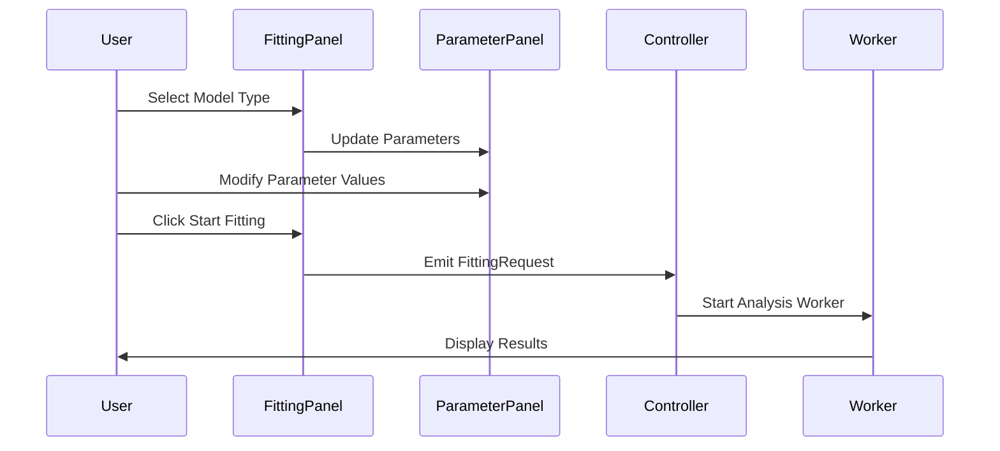
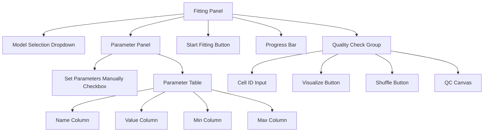
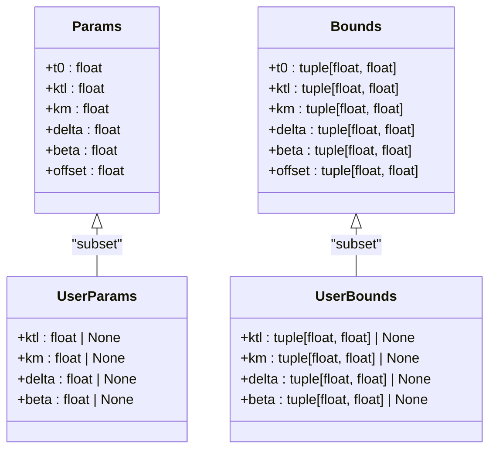
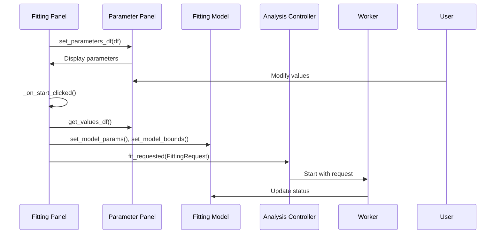

# Parameter Configuration

<cite>
**Referenced Files in This Document**   
- [fitting_panel.py](file://pyama-qt/src/pyama_qt/analysis/panels/fitting_panel.py)
- [parameter_panel.py](file://pyama-qt/src/pyama_qt/components/parameter_panel.py)
- [requests.py](file://pyama-qt/src/pyama_qt/analysis/requests.py)
- [FittingModel.py](file://pyama-qt/src/pyama_qt/analysis/models.py)
- [trivial.py](file://pyama-core/src/pyama_core/analysis/models/trivial.py)
- [maturation.py](file://pyama-core/src/pyama_core/analysis/models/maturation.py)
- [controller.py](file://pyama-qt/src/pyama_qt/analysis/controller.py)
</cite>

## Table of Contents
1. [Introduction](#introduction)
2. [Parameter Configuration Workflow](#parameter-configuration-workflow)
3. [UI Components and Controls](#ui-components-and-controls)
4. [Parameter Object Structure](#parameter-object-structure)
5. [Model-Specific Parameters](#model-specific-parameters)
6. [Default Values and Bounds](#default-values-and-bounds)
7. [Data Flow from UI to Fitting Engine](#data-flow-from-ui-to-fitting-engine)
8. [Common Configuration Issues](#common-configuration-issues)
9. [Best Practices for Biological Systems](#best-practices-for-biological-systems)
10. [Troubleshooting Guide](#troubleshooting-guide)

## Introduction

The parameter configuration sub-feature in the Analysis Module enables users to set initial parameters, bounds, and constraints for curve fitting operations through an intuitive graphical interface. This system bridges the gap between biological domain knowledge and computational fitting algorithms, allowing researchers to incorporate prior understanding of their experimental systems into the fitting process. The configuration interface is designed to be accessible to beginners while providing the flexibility and control required by experienced developers and data scientists.

**Section sources**
- [fitting_panel.py](file://pyama-qt/src/pyama_qt/analysis/panels/fitting_panel.py#L32-L306)

## Parameter Configuration Workflow

The parameter configuration workflow begins when a user selects a model type from the dropdown menu in the fitting panel. Upon selection, the interface automatically populates the parameter table with the appropriate parameters for the chosen model, including default values and recommended bounds. Users can choose to accept these defaults or manually adjust parameters by enabling the "Set parameters manually" checkbox. The system validates all inputs in real-time, ensuring that parameter values and bounds are numerically sound before submission.

When the user clicks "Start Fitting," the current parameter values and bounds are collected from the UI, packaged into a fitting request, and passed to the analysis worker for processing. The quality check section allows users to visualize both raw data and fitted curves, providing immediate feedback on the quality of the fit and enabling iterative refinement of parameter settings.

**Diagram sources**
- [fitting_panel.py](file://pyama-qt/src/pyama_qt/analysis/panels/fitting_panel.py#L32-L306)
- [parameter_panel.py](file://pyama-qt/src/pyama_qt/components/parameter_panel.py#L22-L220)

**Section sources**
- [fitting_panel.py](file://pyama-qt/src/pyama_qt/analysis/panels/fitting_panel.py#L32-L306)

## UI Components and Controls

The parameter configuration interface consists of several key components that work together to provide a seamless user experience. The model selection dropdown allows users to choose between available fitting models such as "Trivial" and "Maturation." When a model is selected, the parameter panel dynamically updates to display the relevant parameters for that model.

The parameter panel presents parameters in a tabular format with columns for parameter name, value, minimum bound, and maximum bound. A checkbox labeled "Set parameters manually" controls whether users can edit parameter values directly. When unchecked, the panel displays read-only default values; when checked, all value fields become editable, allowing users to input custom initial guesses.

Additional controls include the "Start Fitting" button to initiate the fitting process, a progress bar that appears during fitting operations, and quality check tools that enable visualization of individual cell traces with overlaid fitted curves.

**Diagram sources**
- [fitting_panel.py](file://pyama-qt/src/pyama_qt/analysis/panels/fitting_panel.py#L32-L306)
- [parameter_panel.py](file://pyama-qt/src/pyama_qt/components/parameter_panel.py#L22-L220)

**Section sources**
- [fitting_panel.py](file://pyama-qt/src/pyama_qt/analysis/panels/fitting_panel.py#L32-L306)
- [parameter_panel.py](file://pyama-qt/src/pyama_qt/components/parameter_panel.py#L22-L220)

## Parameter Object Structure

The parameter configuration system uses a structured approach to organize fitting parameters, with distinct classes defining different aspects of the fitting process. Each model defines four key dataclasses: Params, Bounds, UserParams, and UserBounds. The Params class contains all parameters required by the model's evaluation function, while Bounds specifies the permissible range for each parameter.

UserParams includes only those parameters that users are expected to configure, typically excluding fixed parameters like t0 and offset. Similarly, UserBounds defines the configurable bounds for user parameters. This separation allows the system to maintain internal consistency while providing a simplified interface for users. Default values are stored in a DEFAULTS object, and recommended bounds are stored in a BOUNDS object, both instantiated from their respective classes.

**Diagram sources**
- [trivial.py](file://pyama-core/src/pyama_core/analysis/models/trivial.py#L1-L72)
- [maturation.py](file://pyama-core/src/pyama_core/analysis/models/maturation.py#L1-L83)

**Section sources**
- [trivial.py](file://pyama-core/src/pyama_core/analysis/models/trivial.py#L1-L72)
- [maturation.py](file://pyama-core/src/pyama_core/analysis/models/maturation.py#L1-L83)

## Model-Specific Parameters

The system supports multiple fitting models, each with its own set of parameters tailored to specific biological scenarios. The "Trivial" model represents simple gene expression dynamics with parameters ktl (transcription-translation rate), delta (degradation rate), beta (maturation rate), and offset (baseline signal). The "Maturation" model extends this with an additional km parameter representing maturation rate, making it suitable for systems where protein maturation significantly affects the fluorescence signal.

When a user selects a model, the system retrieves the corresponding UserParams dataclass to determine which parameters should be displayed in the interface. This ensures that only relevant parameters are presented to the user, reducing cognitive load and preventing configuration errors. The parameter panel automatically adjusts its content based on the selected model, showing the appropriate number of rows and parameter names.

**Section sources**
- [trivial.py](file://pyama-core/src/pyama_core/analysis/models/trivial.py#L1-L72)
- [maturation.py](file://pyama-core/src/pyama_core/analysis/models/maturation.py#L1-L83)
- [fitting_panel.py](file://pyama-qt/src/pyama_qt/analysis/panels/fitting_panel.py#L32-L306)

## Default Values and Bounds

Default parameter values and bounds are carefully chosen based on typical biological systems and numerical stability requirements. For the Trivial model, ktl defaults to 20.0 with bounds of (1.0, 1e6), reflecting typical transcription-translation rates observed in experimental systems. The delta parameter defaults to 0.07 with bounds of (1e-5, 10.1), representing degradation rates on the order of hours.

For the Maturation model, ktl defaults to 1e3 with wider bounds of (1, 5e8) to accommodate the broader dynamic range often seen in maturation processes. The km parameter defaults to 1.28 with bounds of (1e-5, 30), covering typical maturation rate constants. These defaults are stored in the DEFAULTS and BOUNDS objects within each model file and are automatically loaded when the corresponding model is selected.

The bounds serve multiple purposes: they constrain the parameter space to biologically plausible values, prevent numerical overflow or underflow during optimization, and improve convergence by guiding the fitting algorithm toward reasonable solutions. Users can modify these bounds when they have specific knowledge about their experimental system that suggests different parameter ranges.

**Section sources**
- [trivial.py](file://pyama-core/src/pyama_core/analysis/models/trivial.py#L1-L72)
- [maturation.py](file://pyama-core/src/pyama_core/analysis/models/maturation.py#L1-L83)

## Data Flow from UI to Fitting Engine

The data flow from the UI to the fitting engine follows a well-defined sequence that ensures parameter integrity and proper synchronization between components. When a model is selected, the fitting panel calls `_update_model_params()`, which retrieves the model's UserParams and BOUNDS objects to construct a DataFrame of parameter information. This DataFrame is passed to the parameter panel's `set_parameters_df()` method, which populates the table with default values and bounds.

When the user initiates fitting, the `_on_start_clicked()` method collects current parameter values and bounds from the parameter panel using `_collect_model_params()` and `_collect_model_bounds()`. These values are packaged into a FittingRequest object containing the model type, parameter values, and bounds. The request is emitted via the fit_requested signal and handled by the AnalysisController, which passes it to the analysis worker for processing.

The FittingModel class acts as a central repository for fitting configuration, storing the current model type, parameters, and bounds. Changes to these values are communicated via Qt signals, ensuring that all components remain synchronized. This architecture follows the model-view-controller pattern, with clear separation between the UI presentation, the underlying data model, and the control logic.

**Diagram sources**
- [fitting_panel.py](file://pyama-qt/src/pyama_qt/analysis/panels/fitting_panel.py#L32-L306)
- [parameter_panel.py](file://pyama-qt/src/pyama_qt/components/parameter_panel.py#L22-L220)
- [models.py](file://pyama-qt/src/pyama_qt/analysis/models.py#L129-L200)
- [controller.py](file://pyama-qt/src/pyama_qt/analysis/controller.py#L21-L135)

**Section sources**
- [fitting_panel.py](file://pyama-qt/src/pyama_qt/analysis/panels/fitting_panel.py#L32-L306)
- [parameter_panel.py](file://pyama-qt/src/pyama_qt/components/parameter_panel.py#L22-L220)
- [models.py](file://pyama-qt/src/pyama_qt/analysis/models.py#L129-L200)
- [requests.py](file://pyama-qt/src/pyama_qt/analysis/requests.py#L7-L12)
- [controller.py](file://pyama-qt/src/pyama_qt/analysis/controller.py#L21-L135)

## Common Configuration Issues

Several common issues can arise during parameter configuration that affect fitting results. Poor initial guesses are a frequent cause of convergence failures, particularly when starting values are orders of magnitude away from the true solution. For example, setting ktl to 1.0 when the true value is closer to 1000 can cause the optimization algorithm to get stuck in local minima or fail to converge entirely.

Overly restrictive bounds can also prevent successful fitting by excluding the true parameter values from the search space. Conversely, excessively wide bounds may lead to numerical instability or extremely long computation times as the algorithm explores implausible regions of parameter space. Another common issue is parameter correlation, where two or more parameters have compensatory effects on the model output, making it difficult for the optimizer to find a unique solution.

The quality check visualization helps identify these issues by allowing users to immediately see whether the initial parameter values produce a curve that roughly matches the data pattern. If the initial curve is completely misaligned with the data, this suggests that the initial guesses need adjustment before running the full fitting process.

**Section sources**
- [fitting_panel.py](file://pyama-qt/src/pyama_qt/analysis/panels/fitting_panel.py#L32-L306)
- [trivial.py](file://pyama-core/src/pyama_core/analysis/models/trivial.py#L1-L72)
- [maturation.py](file://pyama-core/src/pyama_core/analysis/models/maturation.py#L1-L83)

## Best Practices for Biological Systems

When configuring parameters for biological systems, users should leverage prior knowledge about their experimental setup to inform parameter selection. For gene expression systems, the ktl parameter should be initialized based on expected expression levels and promoter strength, with stronger promoters warranting higher initial ktl values. The delta parameter should reflect the expected degradation rate of the protein, which can often be estimated from literature values for similar proteins or half-life measurements.

For systems with known maturation kinetics, the km parameter should be initialized based on the maturation half-life of the fluorescent protein being used. Common fluorescent proteins like GFP have maturation half-lives on the order of hours, which translates to km values around 1-2. Users should also consider the temporal resolution of their experiment when setting bounds, ensuring that parameter values are compatible with the time scale of data collection.

When in doubt, it is generally better to use wider bounds with reasonable initial guesses rather than overly restrictive bounds. The fitting algorithm can typically converge to the correct solution given appropriate starting values, even with broad bounds. Users should also take advantage of the quality check visualization to iteratively refine their parameter settings, starting with defaults and making incremental adjustments based on visual feedback.

**Section sources**
- [trivial.py](file://pyama-core/src/pyama_core/analysis/models/trivial.py#L1-L72)
- [maturation.py](file://pyama-core/src/pyama_core/analysis/models/maturation.py#L1-L83)
- [fitting_panel.py](file://pyama-qt/src/pyama_qt/analysis/panels/fitting_panel.py#L32-L306)

## Troubleshooting Guide

When encountering issues with parameter configuration, users should follow a systematic troubleshooting approach. First, verify that the correct model type is selected for the biological system being analyzed. Next, check that the "Set parameters manually" checkbox is enabled if custom values are intended, as disabled manual mode will ignore user inputs.

If fitting fails to converge, examine the initial parameter values in the quality check visualization. If the initial curve does not roughly follow the data trend, adjust the initial guesses to better match the observed pattern. For example, if the data shows rapid signal increase, increase the ktl value; if the signal decays slowly, decrease the delta value.

When receiving convergence errors, temporarily widen the parameter bounds to ensure the true solution is not being excluded from the search space. After successful fitting with wide bounds, the resulting parameter values can inform tighter, more biologically realistic bounds for subsequent analyses.

Monitor the progress bar and status messages for indications of fitting progress. If the fitting process hangs or progresses very slowly, consider whether the parameter space is too large or whether there are numerical issues with extreme parameter values. In such cases, restarting with more moderate initial values and bounds often resolves the issue.

**Section sources**
- [fitting_panel.py](file://pyama-qt/src/pyama_qt/analysis/panels/fitting_panel.py#L32-L306)
- [controller.py](file://pyama-qt/src/pyama_qt/analysis/controller.py#L21-L135)
- [models.py](file://pyama-qt/src/pyama_qt/analysis/models.py#L129-L200)