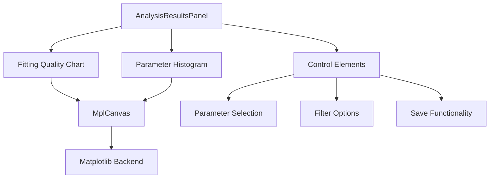
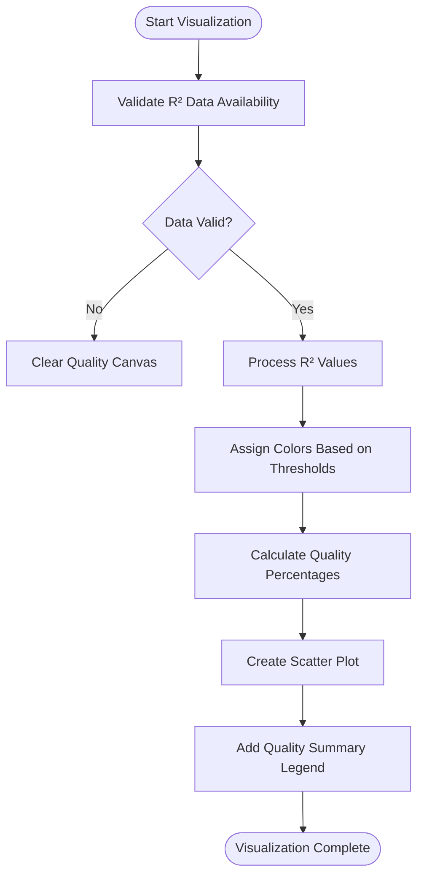
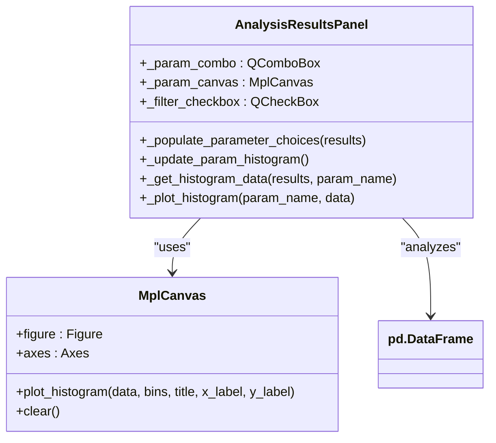
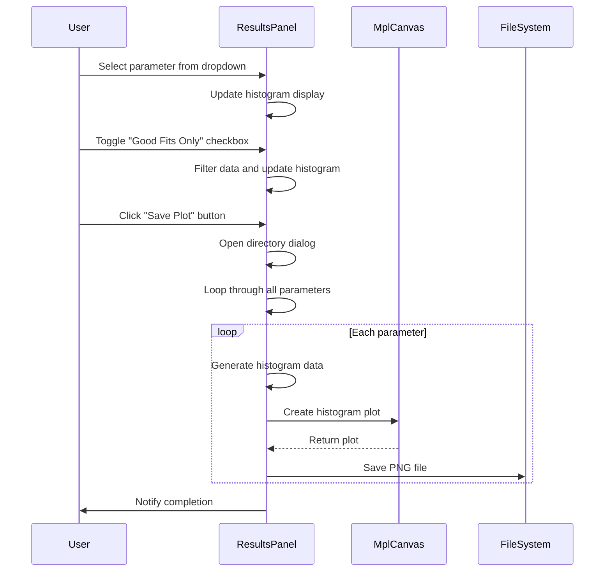
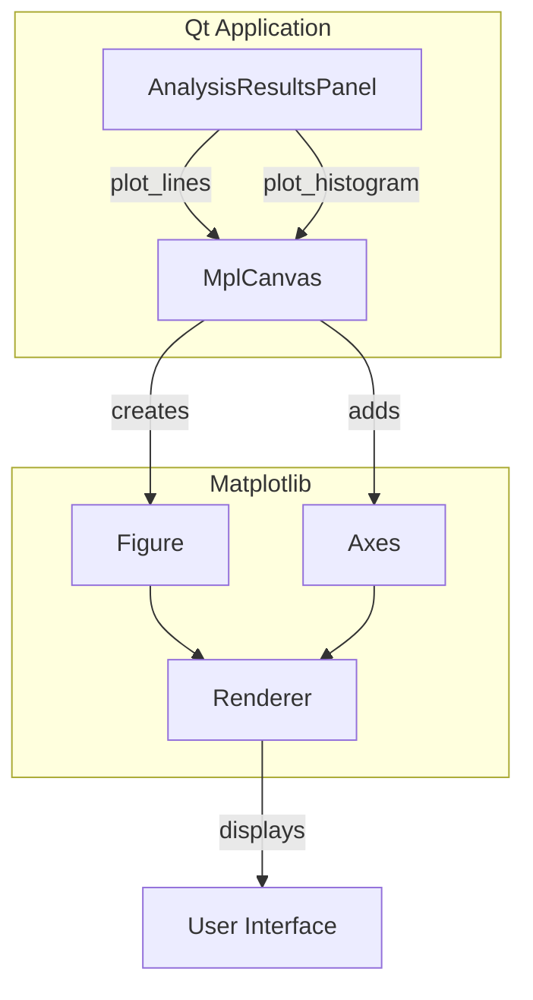

# Results Visualization

<cite>
**Referenced Files in This Document**   
- [results_panel.py](file://pyama-qt/src/pyama_qt/analysis/panels/results_panel.py)
- [mpl_canvas.py](file://pyama-qt/src/pyama_qt/components/mpl_canvas.py)
- [fitting.py](file://pyama-core/src/pyama_core/analysis/fitting.py)
- [fitting_panel.py](file://pyama-qt/src/pyama_qt/analysis/panels/fitting_panel.py)
</cite>

## Table of Contents
1. [Introduction](#introduction)
2. [Core Visualization Components](#core-visualization-components)
3. [Fitting Quality Visualization](#fitting-quality-visualization)
4. [Parameter Distribution Analysis](#parameter-distribution-analysis)
5. [Interactive Features](#interactive-features)
6. [Integration with MPL Canvas](#integration-with-mpl-canvas)
7. [Goodness-of-Fit Metrics](#goodness-of-fit-metrics)
8. [Common Issues and Performance](#common-issues-and-performance)
9. [Interpretation Guidelines](#interpretation-guidelines)
10. [Conclusion](#conclusion)

## Introduction
The Results Visualization sub-feature of the Analysis Module provides comprehensive visual feedback on model fitting outcomes. This system enables users to evaluate fitting quality, analyze parameter distributions, and validate model assumptions through interactive matplotlib-based visualizations. The implementation integrates analysis results with a Qt-based GUI through the MPL canvas component, offering both immediate feedback during analysis and tools for post-processing evaluation. This documentation explains the visualization system's architecture, functionality, and usage patterns, providing guidance for both novice users and experienced developers.

## Core Visualization Components

The Results Visualization system consists of several interconnected components that work together to display analysis outcomes. The primary visualization interface is the AnalysisResultsPanel, which contains two main plotting areas: one for fitting quality assessment and another for parameter distribution analysis. These components work in conjunction with the MplCanvas widget that serves as the rendering surface for all matplotlib visualizations.



**Diagram sources**
- [results_panel.py](file://pyama-qt/src/pyama_qt/analysis/panels/results_panel.py#L26-L263)
- [mpl_canvas.py](file://pyama-qt/src/pyama_qt/components/mpl_canvas.py#L14-L199)

**Section sources**
- [results_panel.py](file://pyama-qt/src/pyama_qt/analysis/panels/results_panel.py#L26-L263)

## Fitting Quality Visualization

The fitting quality visualization displays the R² values for all fitted cells in a scatter plot format, with color-coding to indicate the quality of each fit. The system automatically categorizes fits into three quality tiers: good (R² > 0.9), fair (0.7 < R² ≤ 0.9), and poor (R² ≤ 0.7). Each point on the chart represents a single cell's fitting result, with the x-axis showing the cell index and the y-axis showing the corresponding R² value.

The visualization includes a text overlay that summarizes the percentage distribution of fits across the three quality categories, providing immediate insight into the overall success rate of the fitting process. This summary helps users quickly assess whether their model parameters and bounds are appropriate for the dataset.



**Diagram sources**
- [results_panel.py](file://pyama-qt/src/pyama_qt/analysis/panels/results_panel.py#L87-L138)
- [mpl_canvas.py](file://pyama-qt/src/pyama_qt/components/mpl_canvas.py#L85-L126)

**Section sources**
- [results_panel.py](file://pyama-qt/src/pyama_qt/analysis/panels/results_panel.py#L87-L138)

## Parameter Distribution Analysis

The parameter distribution analysis component displays histograms of fitted parameter values across all cells. Users can select which parameter to visualize from a dropdown menu that automatically populates with all available numeric parameters from the fitting results. This feature enables users to identify patterns in parameter distributions, detect outliers, and assess the biological plausibility of fitted values.

The system filters out metadata columns and non-numeric data when populating the parameter selection dropdown, ensuring that only meaningful parameters are presented to the user. For each selected parameter, a histogram with 30 bins is generated, showing the frequency distribution of values across the cell population.



**Diagram sources**
- [results_panel.py](file://pyama-qt/src/pyama_qt/analysis/panels/results_panel.py#L140-L170)
- [results_panel.py](file://pyama-qt/src/pyama_qt/analysis/panels/results_panel.py#L172-L215)
- [mpl_canvas.py](file://pyama-qt/src/pyama_qt/components/mpl_canvas.py#L129-L139)

**Section sources**
- [results_panel.py](file://pyama-qt/src/pyama_qt/analysis/panels/results_panel.py#L140-L215)

## Interactive Features

The Results Visualization system includes several interactive features that enhance user experience and analytical capabilities. The most significant interactive elements include parameter selection, result filtering, and batch plot export functionality.

The parameter selection dropdown allows users to quickly switch between different fitted parameters to examine their distributions. The "Good Fits Only" checkbox enables filtering of the histogram data to include only cells with successful fits (R² > 0.9), helping users focus on high-quality results when analyzing parameter distributions.

The "Save Plot" button triggers a batch export process that generates PNG files for histograms of all parameters, facilitating documentation and sharing of results. This feature opens a directory selection dialog and saves each parameter's histogram as a separate file named after the parameter.



**Diagram sources**
- [results_panel.py](file://pyama-qt/src/pyama_qt/analysis/panels/results_panel.py#L172-L263)

**Section sources**
- [results_panel.py](file://pyama-qt/src/pyama_qt/analysis/panels/results_panel.py#L172-L263)

## Integration with MPL Canvas

The visualization system integrates with matplotlib through the MplCanvas component, which provides a high-level API for plotting various chart types within the Qt application. This component serves as a bridge between the matplotlib plotting library and the Qt GUI framework, handling the technical details of embedding matplotlib figures in Qt widgets.

The MplCanvas class offers specialized methods for different visualization types, including plot_lines for scatter plots and line charts, plot_histogram for distribution analysis, and plot_image for image display. These methods abstract away the complexity of matplotlib's object-oriented interface, providing a simplified API that the Results Panel can use to generate visualizations with minimal code.



**Diagram sources**
- [mpl_canvas.py](file://pyama-qt/src/pyama_qt/components/mpl_canvas.py#L14-L199)

**Section sources**
- [mpl_canvas.py](file://pyama-qt/src/pyama_qt/components/mpl_canvas.py#L14-L199)

## Goodness-of-Fit Metrics

The system calculates and presents several goodness-of-fit metrics to help users evaluate model performance. The primary metric is the coefficient of determination (R²), which is computed during the fitting process in the core analysis module. The R² value represents the proportion of variance in the dependent variable that is predictable from the independent variable(s), with values closer to 1.0 indicating better fit quality.

The R² calculation is implemented in the _compute_r_squared function, which uses the standard formula: 1 - (SS_res / SS_tot), where SS_res is the sum of squares of residuals and SS_tot is the total sum of squares. This calculation includes safeguards to ensure the result is always within the valid range [0, 1].

```mermaid
flowchart TD
A[Raw Data] --> B[Clean Data]
B --> C[Model Prediction]
C --> D[Residuals]
D --> E[SS_res = Σ(residuals²)]
B --> F[Mean of Data]
F --> G[SS_tot = Σ(data - mean)²]
E --> H[R² = 1 - (SS_res / SS_tot)]
H --> I[Clamp to [0,1]]
I --> J[Final R² Value]
```

**Diagram sources**
- [fitting.py](file://pyama-core/src/pyama_core/analysis/fitting.py#L102-L147)

**Section sources**
- [fitting.py](file://pyama-core/src/pyama_core/analysis/fitting.py#L102-L147)

## Common Issues and Performance

The Results Visualization system may encounter several common issues, particularly when working with large datasets. Performance bottlenecks can occur when processing thousands of cells, as each histogram generation involves data filtering and matplotlib rendering operations. The system addresses this by using efficient pandas operations for data filtering and by minimizing unnecessary recalculations.

Visualization artifacts may appear when parameter values have extreme ranges or when there are outliers in the data. The system handles missing or invalid data by using pandas' coercion features to convert non-numeric values to NaN, which are then dropped from the analysis. This approach ensures that visualization operations don't fail due to data type issues.

For very large result sets, users may experience delays when switching between parameters or when saving all histograms. The batch save operation processes each parameter sequentially, which can be time-consuming with many parameters. Users are advised to be patient during these operations or to selectively save only the most important parameter distributions.

**Section sources**
- [results_panel.py](file://pyama-qt/src/pyama_qt/analysis/panels/results_panel.py#L189-L205)
- [fitting.py](file://pyama-core/src/pyama_core/analysis/fitting.py#L102-L147)

## Interpretation Guidelines

Interpreting the visualization outputs requires understanding both the technical aspects of the fitting process and the biological context of the data. The fitting quality chart should be examined first to assess the overall success rate of the model fitting. A high percentage of good fits (R² > 0.9) indicates that the model is appropriate for the data and that the parameter bounds are reasonable.

When analyzing parameter distributions, users should look for unimodal distributions centered around biologically plausible values. Bimodal or multimodal distributions may indicate subpopulations within the data or issues with model specification. Extremely wide distributions or outliers may suggest problems with data quality or model overfitting.

The parameter histograms filtered to show only good fits can help distinguish between parameters that are well-constrained by the data versus those that are poorly determined. Parameters that show similar distributions with and without the good fits filter are likely well-identified, while those that change dramatically may be sensitive to fitting quality.

**Section sources**
- [results_panel.py](file://pyama-qt/src/pyama_qt/analysis/panels/results_panel.py#L87-L138)
- [results_panel.py](file://pyama-qt/src/pyama_qt/analysis/panels/results_panel.py#L172-L215)

## Conclusion
The Results Visualization sub-feature provides a comprehensive suite of tools for evaluating and interpreting model fitting outcomes. By integrating matplotlib visualizations with a user-friendly Qt interface, the system enables both quick assessment of fitting quality and in-depth analysis of parameter distributions. The interactive features, particularly the parameter selection and filtering capabilities, empower users to explore their data from multiple perspectives. Understanding how to interpret these visualizations is crucial for validating model assumptions, identifying outliers, and making informed decisions about experimental parameters and analysis workflows.