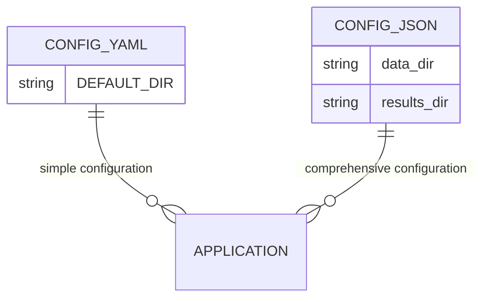
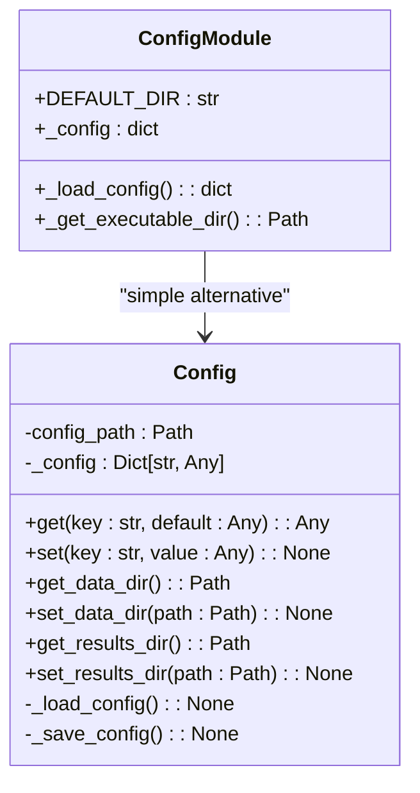
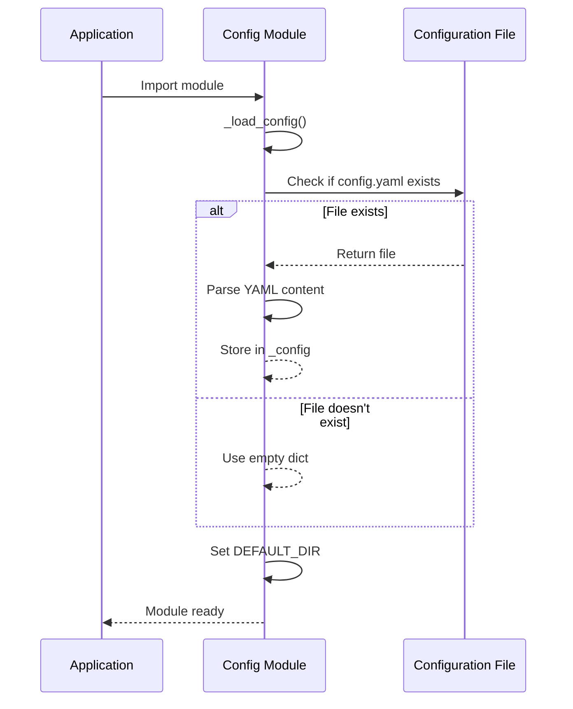
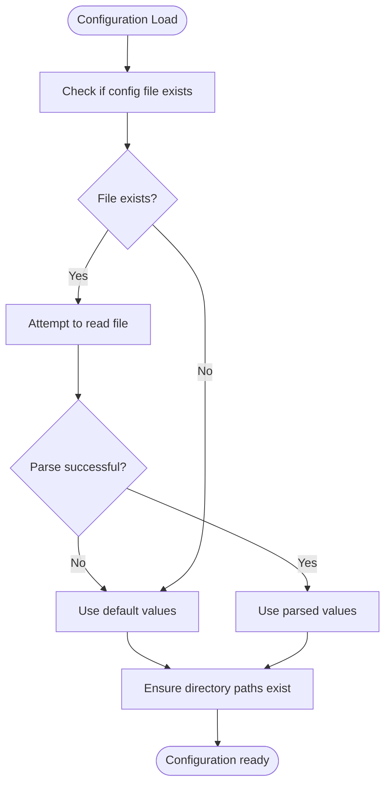

# Configuration Management

<cite>
**Referenced Files in This Document**   
- [config.py](file://pyama-qt/src/pyama_qt/config.py)
- [config.yaml](file://pyama-qt/src/pyama_qt/config.yaml)
- [config.py](file://pyama-qt-slim/src/pyama_qt/lib/config.py)
- [globals.py](file://pyama-qt-slim/src/pyama_qt/globals.py)
</cite>

## Table of Contents
1. [Introduction](#introduction)
2. [Configuration File Structure](#configuration-file-structure)
3. [Programmatic Configuration Access](#programmatic-configuration-access)
4. [Configuration Loading Sequence](#configuration-loading-sequence)
5. [User Interface for Configuration](#user-interface-for-configuration)
6. [Validation and Default Values](#validation-and-default-values)
7. [Global Settings vs Workflow Parameters](#global-settings-vs-workflow-parameters)
8. [Cross-Platform Path Handling](#cross-platform-path-handling)
9. [Custom Configuration Examples](#custom-configuration-examples)
10. [Troubleshooting Configuration Issues](#troubleshooting-configuration-issues)

## Introduction
The PyAMA configuration system manages application settings, data directories, and results paths across multiple components. Two distinct configuration implementations exist in the codebase: a simple YAML-based system in the full PyAMA-Qt application and a more comprehensive JSON-based system in the PyAMA-Qt-Slim variant. Both systems provide mechanisms for persistent storage of user preferences, default path management, and environment customization. This documentation covers the architecture, usage, and management of these configuration systems for both end-users and developers.

**Section sources**
- [config.py](file://pyama-qt/src/pyama_qt/config.py#L1-L53)
- [config.py](file://pyama-qt-slim/src/pyama_qt/lib/config.py#L1-L84)

## Configuration File Structure
The configuration system uses different file formats depending on the application variant. The full PyAMA-Qt application employs a `config.yaml` file located in the executable directory, containing simple key-value pairs for application settings. Currently, the primary configurable parameter is `DEFAULT_DIR`, which specifies the default directory for file dialogs. The PyAMA-Qt-Slim variant uses a JSON configuration file located at `~/.pyama/config.json`, which stores more complex settings including data and results directory paths. The YAML format in the full application is commented to guide users, with the `DEFAULT_DIR` parameter currently commented out, indicating that the system will use default values unless explicitly configured.



**Diagram sources**
- [config.yaml](file://pyama-qt/src/pyama_qt/config.yaml#L1-L7)
- [config.py](file://pyama-qt-slim/src/pyama_qt/lib/config.py#L9-L63)

**Section sources**
- [config.yaml](file://pyama-qt/src/pyama_qt/config.yaml#L1-L7)
- [config.py](file://pyama-qt-slim/src/pyama_qt/lib/config.py#L9-L63)

## Programmatic Configuration Access
The configuration system provides programmatic access through dedicated modules and classes. In the full PyAMA-Qt application, configuration values are loaded into module-level variables during import, with `DEFAULT_DIR` being the primary exposed setting. The PyAMA-Qt-Slim variant implements a more sophisticated `Config` class that encapsulates configuration management with methods for getting and setting values, as well as specialized accessors for data and results directories. The `Config` class automatically handles file operations, creating the configuration directory when needed and persisting changes to disk. A global instance is provided through the `get_config()` function, enabling easy access throughout the application. Convenience functions like `get_data_dir()` and `get_results_dir()` provide direct access to commonly used paths without requiring direct interaction with the configuration object.



**Diagram sources**
- [config.py](file://pyama-qt/src/pyama_qt/config.py#L1-L53)
- [config.py](file://pyama-qt-slim/src/pyama_qt/lib/config.py#L9-L63)

**Section sources**
- [config.py](file://pyama-qt/src/pyama_qt/config.py#L1-L53)
- [config.py](file://pyama-qt-slim/src/pyama_qt/lib/config.py#L9-L63)

## Configuration Loading Sequence
The configuration loading process follows a specific sequence during application startup. In the full PyAMA-Qt application, the `_load_config()` function is called immediately when the module is imported, attempting to read `config.yaml` from the executable directory. If the file exists and can be parsed, its contents are stored in the `_config` variable; otherwise, an empty dictionary is used. The `DEFAULT_DIR` value is then extracted from this configuration, falling back to the user's home directory if not specified. In PyAMA-Qt-Slim, the `Config` class constructor automatically calls `_load_config()` when the global instance is created, attempting to read from `~/.pyama/config.json`. If the file doesn't exist or contains invalid JSON, an empty configuration dictionary is initialized. Both systems implement error handling to ensure the application can start even when configuration loading fails, with warnings logged for troubleshooting purposes.



**Diagram sources**
- [config.py](file://pyama-qt/src/pyama_qt/config.py#L1-L53)
- [config.py](file://pyama-qt-slim/src/pyama_qt/lib/config.py#L9-L63)

**Section sources**
- [config.py](file://pyama-qt/src/pyama_qt/config.py#L1-L53)
- [config.py](file://pyama-qt-slim/src/pyama_qt/lib/config.py#L9-L63)

## User Interface for Configuration
While the codebase does not contain explicit UI components for configuration management, the design implies user interaction through file dialogs that respect the configured `DEFAULT_DIR`. The configuration system is designed to persist user preferences across sessions, suggesting that directory selections made through the application's file dialogs would be saved and reused. The PyAMA-Qt-Slim variant's `Config` class provides `set_data_dir()` and `set_results_dir()` methods, indicating that UI components likely exist elsewhere in the codebase to allow users to modify these settings through the application interface. The global constants in `globals.py` suggest that UI elements such as tab order and window dimensions are configurable, though the current implementation appears to use hardcoded values. Future enhancements could include a dedicated settings panel to expose configuration options directly to users.

**Section sources**
- [config.py](file://pyama-qt-slim/src/pyama_qt/lib/config.py#L9-L63)
- [globals.py](file://pyama-qt-slim/src/pyama_qt/globals.py#L1-L35)

## Validation and Default Values
The configuration system implements robust validation and fallback mechanisms to ensure reliable operation. Both implementations handle missing configuration files gracefully, initializing with default values rather than failing. The full PyAMA-Qt application uses the user's home directory as the default for `DEFAULT_DIR` when no configuration is present or when the `DEFAULT_DIR` parameter is not specified in the YAML file. The PyAMA-Qt-Slim variant defines default data and results directories within the user's home folder under a `PyAMA` subdirectory, ensuring these paths exist by creating them if necessary. Error handling is implemented at multiple levels: the YAML loader uses `yaml.safe_load()` to prevent code execution vulnerabilities, while the JSON-based system catches `JSONDecodeError` and `IOError` exceptions. Configuration saves in the JSON system are designed to fail silently, preventing application crashes due to write permission issues while still allowing core functionality to continue.



**Diagram sources**
- [config.py](file://pyama-qt/src/pyama_qt/config.py#L1-L53)
- [config.py](file://pyama-qt-slim/src/pyama_qt/lib/config.py#L9-L63)
- [globals.py](file://pyama-qt-slim/src/pyama_qt/globals.py#L1-L35)

**Section sources**
- [config.py](file://pyama-qt/src/pyama_qt/config.py#L1-L53)
- [config.py](file://pyama-qt-slim/src/pyama_qt/lib/config.py#L9-L63)
- [globals.py](file://pyama-qt-slim/src/pyama_qt/globals.py#L1-L35)

## Global Settings vs Workflow Parameters
The configuration system distinguishes between global application settings and workflow-specific parameters. Global settings, managed by the configuration modules, include persistent preferences like data and results directory locations, UI dimensions, and logging configuration. These settings apply across all workflows and are preserved between application sessions. Workflow-specific parameters, such as analysis algorithms or processing options, are not managed by the current configuration system but are likely handled separately within their respective modules. The separation is evident in the code structure, with the `pyama_core` package containing workflow-specific processing steps that would require their own parameter management. The global constants in `globals.py` further illustrate this separation, with application-wide settings like window dimensions and tab order distinguished from processing-specific configurations like `MAX_WORKERS`.

**Section sources**
- [config.py](file://pyama-qt-slim/src/pyama_qt/lib/config.py#L9-L63)
- [globals.py](file://pyama-qt-slim/src/pyama_qt/globals.py#L1-L35)

## Cross-Platform Path Handling
The configuration system incorporates cross-platform path handling through the use of Python's `pathlib.Path` class. Both configuration implementations utilize `Path` objects for directory operations, ensuring compatibility across Windows, macOS, and Linux systems. The full PyAMA-Qt application uses `Path` to construct the configuration file path relative to the executable directory, while PyAMA-Qt-Slim uses it for the user-specific configuration path. The `os.path.expanduser()` function is employed in the full application to resolve the `~` symbol to the user's home directory on all platforms. Directory creation uses `mkdir(parents=True, exist_ok=True)` to handle nested directory structures and avoid errors when directories already exist, a cross-platform approach that works consistently across operating systems. The use of forward slashes in the commented `DEFAULT_DIR` example in `config.yaml` suggests platform-agnostic path representation, with the `pathlib` library handling the conversion to platform-specific separators as needed.

**Section sources**
- [config.py](file://pyama-qt/src/pyama_qt/config.py#L1-L53)
- [config.py](file://pyama-qt-slim/src/pyama_qt/lib/config.py#L9-L63)
- [globals.py](file://pyama-qt-slim/src/pyama_qt/globals.py#L1-L35)

## Custom Configuration Examples
Custom configurations can be implemented by modifying the configuration files or extending the configuration classes. For the full PyAMA-Qt application, users can uncomment and modify the `DEFAULT_DIR` parameter in `config.yaml` to set a custom default directory for file dialogs:

```yaml
# Default directory for file dialogs
DEFAULT_DIR: "/project/custom_data"
```

In PyAMA-Qt-Slim, developers can extend the `Config` class to add new configuration parameters. For example, to add a custom processing parameter:

```python
def set_custom_processing_param(self, value: str) -> None:
    """Set a custom processing parameter."""
    self.set("custom_processing_param", value)

def get_custom_processing_param(self) -> str:
    """Get the custom processing parameter."""
    return self.get("custom_processing_param", "default_value")
```

Specialized workflows can leverage the configuration system to store workflow-specific settings. For instance, a high-throughput screening workflow might store plate map templates or instrument calibration data in the configuration. The JSON format in PyAMA-Qt-Slim supports nested structures, allowing complex configuration data to be stored:

```json
{
  "data_dir": "/data/hts",
  "results_dir": "/results/hts",
  "workflow_profiles": {
    "high_throughput": {
      "batch_size": 96,
      "processing_threads": 8,
      "output_format": "parquet"
    }
  }
}
```

**Section sources**
- [config.yaml](file://pyama-qt/src/pyama_qt/config.yaml#L1-L7)
- [config.py](file://pyama-qt-slim/src/pyama_qt/lib/config.py#L9-L63)

## Troubleshooting Configuration Issues
Common configuration issues include permission errors, path resolution failures, and missing configuration files. Permission errors typically occur when the application cannot write to the configuration directory. For PyAMA-Qt-Slim, ensure that the `~/.pyama` directory has appropriate write permissions. On Unix-like systems, use `chmod 755 ~/.pyama` to set proper permissions. Path resolution failures may occur if configured paths contain invalid characters or exceed system limits. Verify that all configured paths exist and are accessible by using the application's file dialogs to navigate to the directories. If configuration files are missing, the application should fall back to defaults, but users can manually create them. For the full PyAMA-Qt application, create `config.yaml` in the executable directory with valid YAML syntax. For PyAMA-Qt-Slim, the configuration file will be created automatically when settings are modified, but users can pre-create `~/.pyama/config.json` with appropriate content. When troubleshooting, check the application logs for configuration-related warnings or errors, as the system logs messages about configuration loading status and fallbacks.

**Section sources**
- [config.py](file://pyama-qt/src/pyama_qt/config.py#L1-L53)
- [config.py](file://pyama-qt-slim/src/pyama_qt/lib/config.py#L9-L63)
- [globals.py](file://pyama-qt-slim/src/pyama_qt/globals.py#L1-L35)