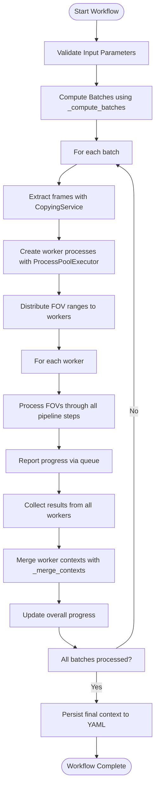

# Core Processing Pipeline

<cite>
**Referenced Files in This Document**   
- [pipeline.py](file://pyama-core/src/pyama_core/processing/workflow/pipeline.py)
- [base.py](file://pyama-core/src/pyama_core/processing/workflow/services/base.py)
- [types.py](file://pyama-core/src/pyama_core/processing/workflow/services/types.py)
- [copying.py](file://pyama-core/src/pyama_core/processing/workflow/services/copying.py)
- [segmentation.py](file://pyama-core/src/pyama_core/processing/workflow/services/steps/segmentation.py)
- [correction.py](file://pyama-core/src/pyama_core/processing/workflow/services/steps/correction.py)
- [tracking.py](file://pyama-core/src/pyama_core/processing/workflow/services/steps/tracking.py)
- [extraction.py](file://pyama-core/src/pyama_core/processing/workflow/services/steps/extraction.py)
- [controller.py](file://pyama-qt/src/pyama_qt/processing/controller.py)
</cite>

## Table of Contents
1. [Introduction](#introduction)
2. [Service-Oriented Architecture](#service-oriented-architecture)
3. [Pipeline Orchestration Mechanism](#pipeline-orchestration-mechanism)
4. [ProcessingContext Data Model](#processingcontext-data-model)
5. [Error Handling and Recovery](#error-handling-and-recovery)
6. [Parallel Execution Model](#parallel-execution-model)
7. [Extensibility Mechanism](#extensibility-mechanism)
8. [System Context Diagram](#system-context-diagram)
9. [Scalability Considerations](#scalability-considerations)
10. [Testing Strategy](#testing-strategy)

## Introduction
The Core Processing Pipeline component implements a service-oriented architecture for microscopy image analysis, designed to process large datasets through a series of independent processing steps. The pipeline orchestrates the execution of copying, correction, segmentation, tracking, and extraction services in a coordinated workflow. Each processing step operates as an independent service that can be executed in parallel across multiple worker processes, enabling efficient processing of large microscopy datasets. The pipeline is designed to handle long-running operations with robust error handling and recovery mechanisms, while maintaining state through a shared ProcessingContext data model that carries parameters and file paths throughout the workflow.

## Service-Oriented Architecture
The Core Processing Pipeline implements a service-oriented architecture where individual processing steps are encapsulated as independent services. Each service inherits from the BaseProcessingService class and implements specific processing functionality for a particular stage of the analysis workflow. The architecture consists of five primary services: CopyingService, SegmentationService, CorrectionService, TrackingService, and ExtractionService. Each service operates on microscopy data and contributes to the overall analysis pipeline by performing specialized processing tasks.

The services follow a consistent interface pattern, with each service implementing a process_fov method that processes a single field of view (FOV) and a process_all_fovs method that processes multiple FOVs in sequence. This design enables both individual service testing and integration into the larger pipeline workflow. The services are designed to be stateless and idempotent, allowing them to be safely retried in case of failures.

**Diagram sources**
- [base.py](file://pyama-core/src/pyama_core/processing/workflow/services/base.py#L15-L83)
- [copying.py](file://pyama-core/src/pyama_core/processing/workflow/services/copying.py#L23-L98)
- [segmentation.py](file://pyama-core/src/pyama_core/processing/workflow/services/steps/segmentation.py#L25-L124)
- [correction.py](file://pyama-core/src/pyama_core/processing/workflow/services/steps/correction.py#L25-L146)
- [tracking.py](file://pyama-core/src/pyama_core/processing/workflow/services/steps/tracking.py#L25-L125)
- [extraction.py](file://pyama-core/src/pyama_core/processing/workflow/services/steps/extraction.py#L25-L132)

**Section sources**
- [base.py](file://pyama-core/src/pyama_core/processing/workflow/services/base.py#L15-L83)
- [copying.py](file://pyama-core/src/pyama_core/processing/workflow/services/copying.py#L23-L98)
- [segmentation.py](file://pyama-core/src/pyama_core/processing/workflow/services/steps/segmentation.py#L25-L124)
- [correction.py](file://pyama-core/src/pyama_core/processing/workflow/services/steps/correction.py#L25-L146)
- [tracking.py](file://pyama-core/src/pyama_core/processing/workflow/services/steps/tracking.py#L25-L125)
- [extraction.py](file://pyama-core/src/pyama_core/processing/workflow/services/steps/extraction.py#L25-L132)

## Pipeline Orchestration Mechanism
The pipeline orchestration mechanism coordinates the execution of individual processing services in a defined sequence, managing data flow between stages and ensuring proper execution order. The run_complete_workflow function serves as the central orchestration point, coordinating the execution of all processing steps across multiple fields of view. The orchestration follows a batch processing model where FOVs are grouped into batches, and each batch is processed through the complete pipeline before moving to the next batch.

The orchestration mechanism implements a two-level parallelization strategy. At the batch level, processing occurs sequentially to manage disk I/O and memory usage. Within each batch, multiple worker processes handle different ranges of FOVs in parallel. The orchestration uses a ProcessPoolExecutor to manage worker processes, with each worker executing the complete pipeline (segmentation, correction, tracking, extraction) on its assigned FOV range. This design balances parallel efficiency with resource constraints.

**Diagram sources**
- [pipeline.py](file://pyama-core/src/pyama_core/processing/workflow/pipeline.py#L279-L478)
- [pipeline.py](file://pyama-core/src/pyama_core/processing/workflow/pipeline.py#L179-L276)

**Section sources**
- [pipeline.py](file://pyama-core/src/pyama_core/processing/workflow/pipeline.py#L279-L478)

## ProcessingContext Data Model
The ProcessingContext data model serves as the central data carrier throughout the workflow, maintaining state and sharing information between processing stages. The context is implemented as a dataclass that contains essential information for pipeline execution, including output directory, channel configuration, results paths, parameters, and time units. This shared context enables services to coordinate their operations without direct dependencies on each other.

The context model includes nested data structures to organize information hierarchically. The Channels class specifies which phase contrast and fluorescence channels to process, while the ResultsPathsPerFOV class tracks file paths for intermediate and final results for each FOV. The context is designed to be thread-safe and serializable, allowing it to be passed between processes and persisted to disk. The ensure_context function provides a factory method to create properly initialized context instances with default values for all fields.

**Diagram sources**
- [types.py](file://pyama-core/src/pyama_core/processing/workflow/services/types.py#L37-L54)
- [types.py](file://pyama-core/src/pyama_core/processing/workflow/services/types.py#L0-L62)

**Section sources**
- [types.py](file://pyama-core/src/pyama_core/processing/workflow/services/types.py#L0-L62)

## Error Handling and Recovery
The pipeline implements comprehensive error handling and recovery strategies to ensure robust processing of long-running operations. Each processing stage includes try-except blocks to catch and handle exceptions, preventing the entire workflow from failing due to isolated errors in individual FOVs. When an error occurs during processing of a specific FOV, the pipeline logs the error and continues processing other FOVs, ensuring maximum data recovery.

The recovery mechanism includes context merging functionality that combines results from successful worker processes even when some workers fail. The _merge_contexts function intelligently combines context data from multiple sources, preserving existing values while incorporating new results. This allows the pipeline to save partial results and resume processing from the point of failure. Additionally, the pipeline checks for existing output files before processing each FOV, skipping already completed work and enabling restart from failure points.

The pipeline also implements proper resource cleanup through try-finally blocks and context managers, ensuring that memory-mapped files and other resources are properly released even when exceptions occur. Progress reporting is designed to be fault-tolerant, with try-except blocks around progress reporting calls to prevent reporting failures from affecting the main processing logic.

**Section sources**
- [pipeline.py](file://pyama-core/src/pyama_core/processing/workflow/pipeline.py#L279-L478)
- [pipeline.py](file://pyama-core/src/pyama_core/processing/workflow/pipeline.py#L71-L140)
- [base.py](file://pyama-core/src/pyama_core/processing/workflow/services/base.py#L15-L83)

## Parallel Execution Model
The parallel execution model leverages Python's multiprocessing capabilities to achieve high throughput processing of microscopy data. The model implements a hybrid approach combining batch processing with worker-based parallelization. The _compute_batches function divides the total FOV range into contiguous batches, while the _split_worker_ranges function distributes FOVs within each batch across multiple worker processes.

The pipeline uses a ProcessPoolExecutor with a configurable number of workers (n_workers) to manage parallel execution. Each worker process runs in a separate Python interpreter with its own memory space, avoiding the limitations of Python's Global Interpreter Lock (GIL). The workers communicate progress and results back to the main process through a shared manager queue, enabling real-time progress monitoring and result aggregation.

The execution model includes a progress reporting system that allows worker processes to send progress updates to the main process. A dedicated drainer thread consumes these updates and logs them, providing visibility into the processing status without blocking the worker processes. This design enables efficient parallel processing while maintaining responsiveness and providing detailed progress information.

**Diagram sources**
- [pipeline.py](file://pyama-core/src/pyama_core/processing/workflow/pipeline.py#L30-L43)
- [pipeline.py](file://pyama-core/src/pyama_core/processing/workflow/pipeline.py#L46-L68)
- [pipeline.py](file://pyama-core/src/pyama_core/processing/workflow/pipeline.py#L279-L478)

**Section sources**
- [pipeline.py](file://pyama-core/src/pyama_core/processing/workflow/pipeline.py#L30-L43)
- [pipeline.py](file://pyama-core/src/pyama_core/processing/workflow/pipeline.py#L46-L68)
- [pipeline.py](file://pyama-core/src/pyama_core/processing/workflow/pipeline.py#L179-L276)
- [pipeline.py](file://pyama-core/src/pyama_core/processing/workflow/pipeline.py#L279-L478)

## Extensibility Mechanism
The pipeline architecture includes several extensibility mechanisms that allow new processing steps to be added without modifying the core orchestration logic. The service-oriented design enables new functionality to be implemented as independent services that inherit from the BaseProcessingService class. Developers can create new processing steps by implementing the process_fov method with custom logic while reusing the existing process_all_fovs infrastructure.

The ProcessingContext data model supports extensibility through its flexible params dictionary field, which can store arbitrary configuration parameters for new processing steps. The results_paths structure can also be extended to track output files from new services by adding new fields to the ResultsPathsPerFOV class. This design allows new services to integrate with the existing context management and persistence mechanisms.

The pipeline's modular design separates the orchestration logic from the individual processing steps, making it possible to modify or replace services without affecting the overall workflow. The use of well-defined interfaces and dependency injection through the context object enables loose coupling between components, facilitating testing and replacement of individual services.

**Section sources**
- [base.py](file://pyama-core/src/pyama_core/processing/workflow/services/base.py#L15-L83)
- [types.py](file://pyama-core/src/pyama_core/processing/workflow/services/types.py#L0-L62)
- [pipeline.py](file://pyama-core/src/pyama_core/processing/workflow/pipeline.py#L279-L478)

## System Context Diagram
The system context diagram illustrates the relationship between the core processing services and the UI applications that interact with them. The PyAMA-Qt application provides a graphical interface for configuring and launching the processing pipeline, while the core services handle the actual image analysis tasks. The controller layer mediates between the UI and the processing core, translating user actions into pipeline operations.

The UI components include configuration panels for setting processing parameters and monitoring workflow status, while the core processing components execute the analysis pipeline. The integration between UI and core components is achieved through a clean separation of concerns, with the controller managing the flow of data and commands between the presentation layer and the processing engine.

**Diagram sources**
- [controller.py](file://pyama-qt/src/pyama_qt/processing/controller.py#L0-L697)
- [pipeline.py](file://pyama-core/src/pyama_core/processing/workflow/pipeline.py#L279-L478)

**Section sources**
- [controller.py](file://pyama-qt/src/pyama_qt/processing/controller.py#L0-L697)
- [page.py](file://pyama-qt/src/pyama_qt/processing/page.py#L0-L82)
- [workflow_panel.py](file://pyama-qt/src/pyama_qt/processing/panels/workflow_panel.py#L0-L329)

## Scalability Considerations
The pipeline architecture incorporates several scalability considerations to handle large datasets and high-throughput processing requirements. The parallel execution model allows the pipeline to utilize multiple CPU cores effectively, with configurable worker counts to match available hardware resources. The batch processing approach manages memory usage by processing subsets of data at a time, preventing excessive memory consumption with large datasets.

The use of memory-mapped files (via numpy.memmap) enables efficient processing of large image data without loading entire datasets into memory. This approach allows the pipeline to handle datasets larger than available RAM by leveraging disk storage for intermediate results. The incremental context merging and persistence strategy ensures that progress is saved periodically, reducing the risk of data loss during long-running operations.

The pipeline's modular design allows for horizontal scaling by distributing processing across multiple machines, with each machine handling a subset of FOVs. The file-based output structure and YAML context persistence enable easy distribution of work and aggregation of results. The configuration parameters (batch_size and n_workers) provide fine-grained control over resource utilization, allowing users to optimize performance based on their specific hardware and dataset characteristics.

**Section sources**
- [pipeline.py](file://pyama-core/src/pyama_core/processing/workflow/pipeline.py#L279-L478)
- [pipeline.py](file://pyama-core/src/pyama_core/processing/workflow/pipeline.py#L30-L43)
- [pipeline.py](file://pyama-core/src/pyama_core/processing/workflow/pipeline.py#L46-L68)

## Testing Strategy
The testing strategy for the pipeline components emphasizes modularity and isolation, enabling comprehensive testing of individual services and integration points. Each processing service can be tested independently using unit tests that verify the correctness of the process_fov method with mock data. The service-oriented architecture facilitates this approach by minimizing dependencies between components.

Integration testing focuses on the pipeline orchestration and data flow between services, verifying that the ProcessingContext is properly maintained and updated throughout the workflow. The test_bioio.py file in the tests directory indicates a focus on testing the integration with bioio for format-agnostic data access, ensuring compatibility with various microscopy file formats.

The pipeline's design supports testing through several mechanisms: the ensure_context function provides a reliable way to create test contexts, the progress reporting system can be mocked for testing without side effects, and the file existence checks enable idempotent testing by allowing tests to be run multiple times without cleaning up intermediate files. The use of well-defined interfaces and dependency injection makes it possible to substitute mock implementations for external dependencies during testing.

**Section sources**
- [test_bioio.py](file://tests/test_bioio.py)
- [test_workflow.py](file://tests/test_workflow.py)
- [base.py](file://pyama-core/src/pyama_core/processing/workflow/services/base.py#L15-L83)
- [types.py](file://pyama-core/src/pyama_core/processing/workflow/services/types.py#L0-L62)