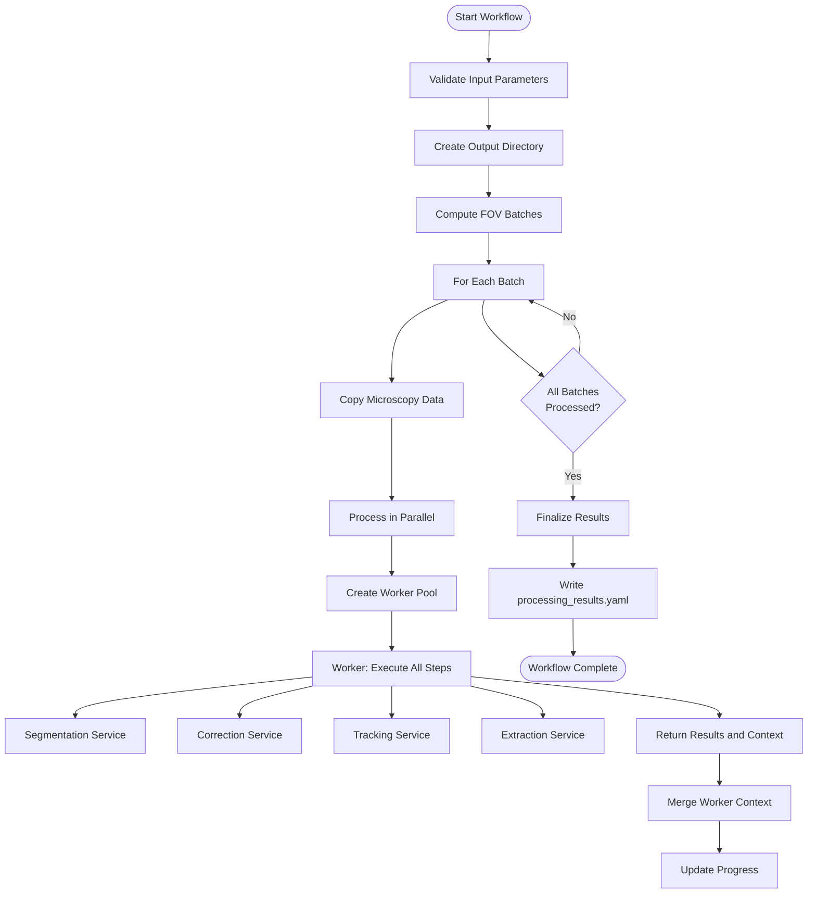
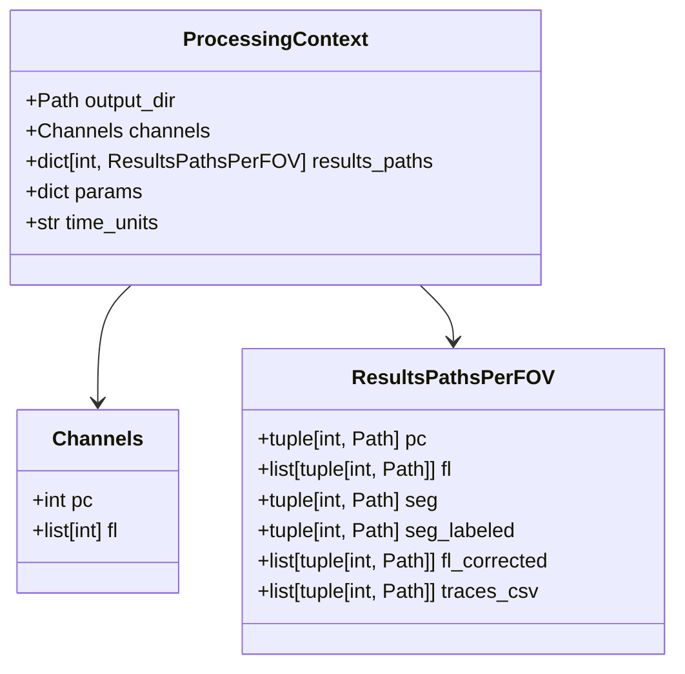
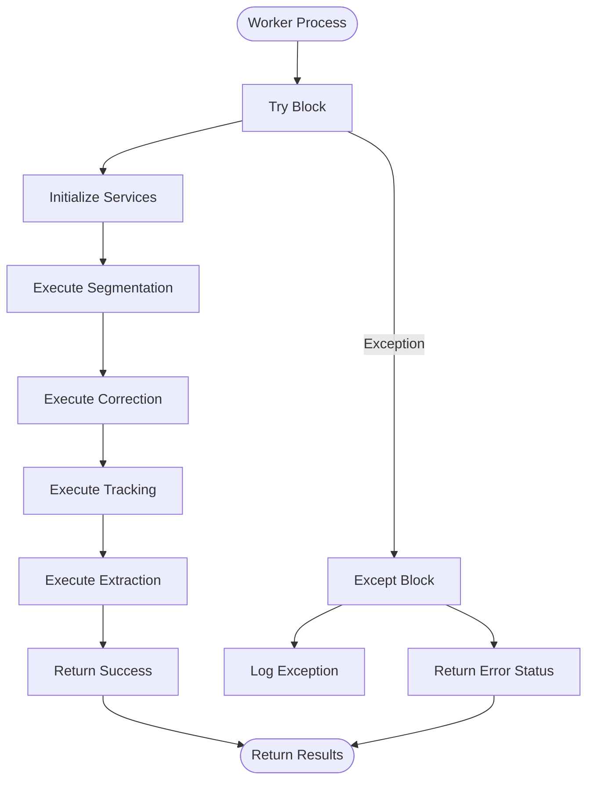
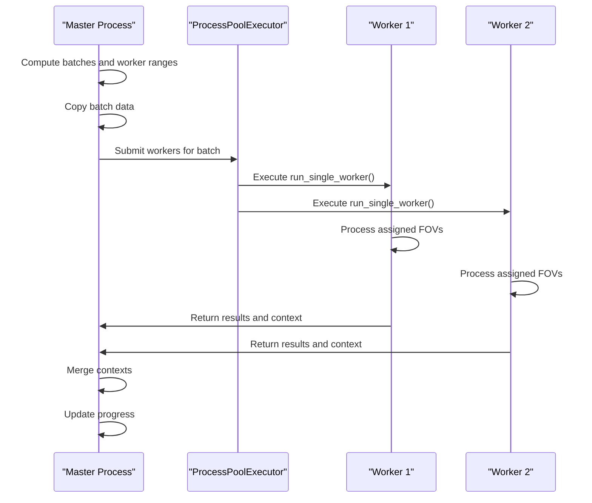

# Pipeline Orchestration

<cite>
**Referenced Files in This Document**   
- [pipeline.py](file://pyama-core/src/pyama_core/processing/workflow/pipeline.py)
- [types.py](file://pyama-core/src/pyama_core/processing/workflow/services/types.py)
- [base.py](file://pyama-core/src/pyama_core/processing/workflow/services/base.py)
- [copying.py](file://pyama-core/src/pyama_core/processing/workflow/services/copying.py)
- [segmentation.py](file://pyama-core/src/pyama_core/processing/workflow/services/steps/segmentation.py)
- [correction.py](file://pyama-core/src/pyama_core/processing/workflow/services/steps/correction.py)
- [tracking.py](file://pyama-core/src/pyama_core/processing/workflow/services/steps/tracking.py)
- [extraction.py](file://pyama-core/src/pyama_core/processing/workflow/services/steps/extraction.py)
</cite>

## Table of Contents
1. [Introduction](#introduction)
2. [Pipeline Execution Flow](#pipeline-execution-flow)
3. [Processing Context Management](#processing-context-management)
4. [Error Handling and Recovery](#error-handling-and-recovery)
5. [Parallel Processing and Batch Workflow](#parallel-processing-and-batch-workflow)
6. [Logging and Progress Reporting](#logging-and-progress-reporting)
7. [Performance Considerations](#performance-considerations)
8. [Conclusion](#conclusion)

## Introduction
The pipeline orchestration mechanism in pyama-core coordinates the execution of microscopy image analysis workflows through a structured, fault-tolerant process. The system processes multiple fields of view (FOVs) through a sequence of computational steps including data copying, segmentation, background correction, cell tracking, and feature extraction. The orchestration is designed to handle large datasets efficiently while maintaining state across processing stages and providing robust error recovery.

**Section sources**
- [pipeline.py](file://pyama-core/src/pyama_core/processing/workflow/pipeline.py#L279-L478)

## Pipeline Execution Flow
The `run_complete_workflow` function serves as the central orchestrator for the entire analysis pipeline. It coordinates the execution of individual processing steps in a defined sequence: first copying raw microscopy data, followed by segmentation, background correction, cell tracking, and finally trace extraction. Each step is implemented as a service class that inherits from `BaseProcessingService`, ensuring consistent interfaces and behavior across the pipeline.

The workflow begins by validating input parameters and establishing the output directory structure. It then processes FOVs in batches, with each batch being handled by multiple worker processes. The orchestration follows a master-worker pattern where the main process manages batch scheduling and context merging, while worker processes handle the actual computation for assigned FOV ranges.

**Diagram sources**
- [pipeline.py](file://pyama-core/src/pyama_core/processing/workflow/pipeline.py#L279-L478)
- [base.py](file://pyama-core/src/pyama_core/processing/workflow/services/base.py#L30-L84)

**Section sources**
- [pipeline.py](file://pyama-core/src/pyama_core/processing/workflow/pipeline.py#L279-L478)
- [base.py](file://pyama-core/src/pyama_core/processing/workflow/services/base.py#L30-L84)

## Processing Context Management
The `ProcessingContext` object plays a critical role in maintaining state and passing data between pipeline stages. This dataclass serves as a central repository for workflow state, containing references to output directories, channel configurations, file paths for intermediate results, and processing parameters.

The context is passed between all processing steps, allowing each service to access necessary information and record its outputs. Key attributes include:
- `output_dir`: Root directory for all output files
- `channels`: Configuration of phase contrast and fluorescence channels
- `results_paths`: Dictionary mapping FOV indices to file paths for various output types
- `params`: Dictionary for storing processing parameters
- `time_units`: Specification of time units for the dataset

Context merging occurs when worker processes complete their tasks, with the master process integrating the worker's context into the main context using the `_merge_contexts` function. This ensures that all file path references and metadata are preserved across the distributed processing architecture.

**Diagram sources**
- [types.py](file://pyama-core/src/pyama_core/processing/workflow/services/types.py#L25-L30)
- [types.py](file://pyama-core/src/pyama_core/processing/workflow/services/types.py#L3-L23)

**Section sources**
- [types.py](file://pyama-core/src/pyama_core/processing/workflow/services/types.py#L25-L30)
- [pipeline.py](file://pyama-core/src/pyama_core/processing/workflow/pipeline.py#L71-L140)

## Error Handling and Recovery
The pipeline implements comprehensive error handling to ensure robust execution across long-running workflows. The orchestration mechanism employs a multi-layered approach to fault tolerance, with error handling at both the batch level and individual worker level.

At the batch level, if any batch fails during the data copying phase, the entire workflow terminates immediately to prevent processing corrupted or incomplete data. During parallel processing, each worker process operates independently, allowing the workflow to continue even if individual workers fail. When a worker encounters an exception, it returns failure information that is logged, but the master process continues processing other workers' results.

The context merging process includes defensive programming with try-except blocks to prevent failures in merging worker contexts from terminating the entire workflow. Similarly, the final step of writing results to YAML includes exception handling to ensure that processing results are not lost even if the final serialization fails.

**Diagram sources**
- [pipeline.py](file://pyama-core/src/pyama_core/processing/workflow/pipeline.py#L279-L478)
- [pipeline.py](file://pyama-core/src/pyama_core/processing/workflow/pipeline.py#L179-L276)

**Section sources**
- [pipeline.py](file://pyama-core/src/pyama_core/processing/workflow/pipeline.py#L279-L478)

## Parallel Processing and Batch Workflow
The pipeline integrates with background workers through Python's multiprocessing module to achieve improved throughput for large datasets. The orchestration uses a `ProcessPoolExecutor` to manage a pool of worker processes, enabling true parallel execution across multiple CPU cores.

The workflow employs a two-level batching strategy:
1. **Batch Level**: FOVs are grouped into batches based on the `batch_size` parameter
2. **Worker Level**: Each batch is further divided among `n_workers` processes

For each batch, the master process first copies the raw microscopy data to the output directory using the `CopyingService`. Then, it distributes the processing workload among worker processes, with each worker handling a contiguous range of FOVs. This approach minimizes I/O contention while maximizing CPU utilization.

The `run_single_worker` function executes the complete pipeline (segmentation, correction, tracking, extraction) for its assigned FOV range, ensuring that data locality is maintained within each worker process. This design reduces the overhead of inter-process communication and allows for efficient memory usage.

**Diagram sources**
- [pipeline.py](file://pyama-core/src/pyama_core/processing/workflow/pipeline.py#L279-L478)
- [pipeline.py](file://pyama-core/src/pyama_core/processing/workflow/pipeline.py#L179-L276)

**Section sources**
- [pipeline.py](file://pyama-core/src/pyama_core/processing/workflow/pipeline.py#L279-L478)

## Logging and Progress Reporting
The pipeline provides comprehensive visibility into workflow execution through a sophisticated logging and progress reporting system. The master process and worker processes communicate progress updates through a shared `progress_queue`, which is monitored by a dedicated "drainer" thread in the master process.

Each processing service can report progress events that include the current step, FOV index, current frame, total frames, and a descriptive message. These events are processed by the drainer thread, which logs them to provide real-time feedback on the workflow's progress. The system reports progress at multiple levels:
- Batch-level progress (percentage of total FOVs completed)
- Step-level progress (which processing stage is active)
- Frame-level progress within each FOV

The logging system uses Python's standard logging module with structured messages that enable both human readability and potential programmatic analysis. Progress is reported at regular intervals (every 30 frames by default) to avoid overwhelming the logging system while still providing timely updates.

**Section sources**
- [pipeline.py](file://pyama-core/src/pyama_core/processing/workflow/pipeline.py#L279-L478)
- [base.py](file://pyama-core/src/pyama_core/processing/workflow/services/base.py#L60-L75)

## Performance Considerations
The pipeline is optimized for processing large microscopy datasets through several key strategies. For memory usage, the system employs memory-mapped files (via `open_memmap`) for all intermediate data products, allowing efficient access to large arrays without loading them entirely into RAM. This enables processing of datasets that exceed available memory by accessing data on-demand from disk.

The batch processing approach minimizes I/O overhead by copying data in contiguous blocks, while the parallel worker architecture maximizes CPU utilization for compute-intensive steps like segmentation and background correction. The system is particularly efficient for datasets with many FOVs, as the parallelization scales with the number of available CPU cores.

For large datasets, optimal performance is achieved by tuning the `batch_size` and `n_workers` parameters based on available system resources. Larger batch sizes reduce the overhead of process creation, while appropriate worker counts ensure CPU cores are fully utilized without excessive context switching.

**Section sources**
- [pipeline.py](file://pyama-core/src/pyama_core/processing/workflow/pipeline.py#L279-L478)
- [copying.py](file://pyama-core/src/pyama_core/processing/workflow/services/copying.py#L23-L98)

## Conclusion
The pipeline orchestration mechanism in pyama-core provides a robust, scalable framework for microscopy image analysis. By coordinating a sequence of processing steps through a well-defined workflow, the system ensures consistent and reproducible results across diverse datasets. The combination of state management through the ProcessingContext, fault-tolerant error handling, and efficient parallel processing enables reliable analysis of large-scale microscopy experiments. The comprehensive logging and progress reporting provide essential visibility into long-running workflows, making the system suitable for both interactive use and unattended batch processing.