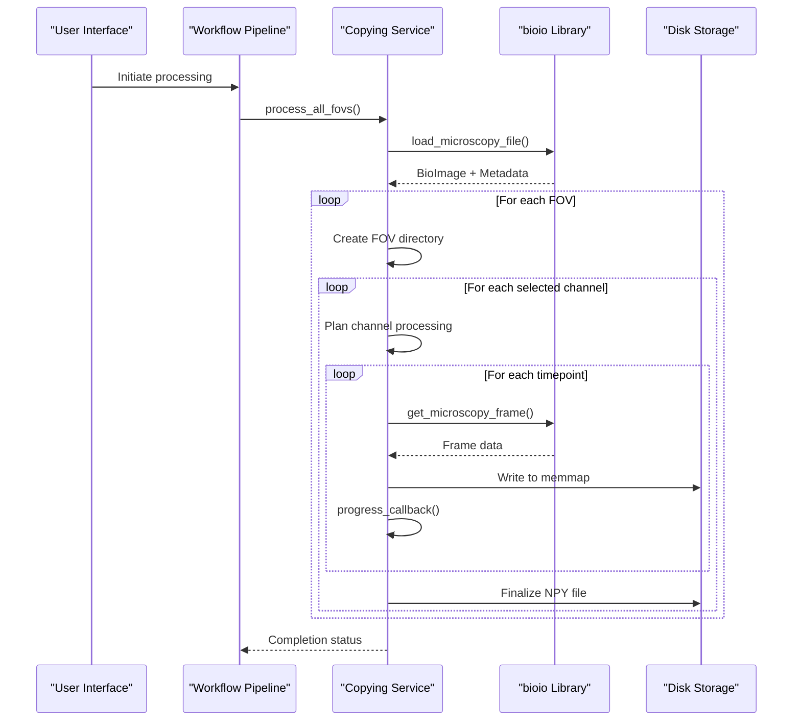
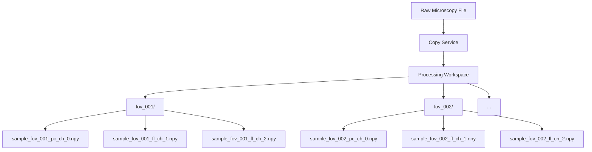
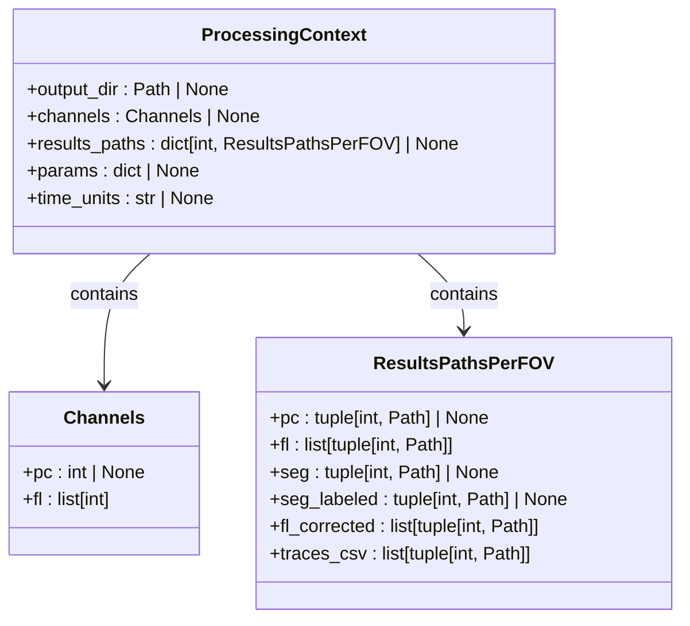

# Copying Service

<cite>
**Referenced Files in This Document**   
- [copying.py](file://pyama-core/src/pyama_core/processing/workflow/services/copying.py)
- [microscopy.py](file://pyama-core/src/pyama_core/io/microscopy.py)
- [types.py](file://pyama-core/src/pyama_core/processing/workflow/services/types.py)
- [base.py](file://pyama-core/src/pyama_core/processing/workflow/services/base.py)
- [pipeline.py](file://pyama-core/src/pyama_core/processing/workflow/pipeline.py)
</cite>

## Table of Contents
1. [Introduction](#introduction)
2. [Core Functionality](#core-functionality)
3. [File Organization Strategy](#file-organization-strategy)
4. [Configuration and Filtering](#configuration-and-filtering)
5. [Processing Context Management](#processing-context-management)
6. [Error Handling and Common Issues](#error-handling-and-common-issues)
7. [Workflow Integration](#workflow-integration)
8. [Performance Considerations](#performance-considerations)

## Introduction

The Copying Service is the foundational component in the PyAMA microscopy analysis pipeline, responsible for ingesting raw bioimaging data and preparing it for downstream processing. As the first step in the workflow, it handles the extraction and organization of microscopy data from proprietary formats into a standardized, accessible structure. The service is specifically designed to process large multidimensional datasets from formats such as ND2 and CZI, which are commonly used in high-content screening and live-cell imaging experiments.

This service plays a critical role in ensuring data integrity and accessibility throughout the analysis pipeline. By converting raw microscopy files into a standardized NPY format organized by field of view (FOV) and channel, it creates a consistent foundation upon which subsequent processing steps can reliably operate. The service's design prioritizes efficiency, data organization, and fault tolerance, making it suitable for handling the large file sizes typical in modern microscopy applications.

**Section sources**
- [copying.py](file://pyama-core/src/pyama_core/processing/workflow/services/copying.py#L1-L20)

## Core Functionality

The Copying Service provides essential functionality for parsing and extracting data from bioimaging formats using the bioio library. When a microscopy file is processed, the service first loads the file and extracts comprehensive metadata including image dimensions, time series information, channel details, and acquisition parameters. This metadata is captured in the MicroscopyMetadata dataclass, which contains key information such as the number of frames, fields of view, channels, spatial dimensions, and temporal characteristics.

The core extraction process involves reading individual frames from the source microscopy file and writing them to memory-mapped NPY files. This approach allows for efficient handling of large datasets that may exceed available RAM, as the data can be accessed in chunks rather than loaded entirely into memory. The service uses the get_microscopy_frame function to extract specific frames based on FOV, channel, and time indices, ensuring precise control over which portions of the multidimensional dataset are processed.

For each frame extraction, the service implements progress reporting through the progress_callback mechanism, which updates the processing status at regular intervals. This allows monitoring of the copying process, particularly important given the potentially long duration of operations on large microscopy datasets. The service also handles various file format specifics transparently, abstracting the differences between ND2, CZI, and other supported formats from the rest of the processing pipeline.

**Diagram sources**
- [copying.py](file://pyama-core/src/pyama_core/processing/workflow/services/copying.py#L23-L98)
- [microscopy.py](file://pyama-core/src/pyama_core/io/microscopy.py#L27-L125)

**Section sources**
- [copying.py](file://pyama-core/src/pyama_core/processing/workflow/services/copying.py#L23-L98)
- [microscopy.py](file://pyama-core/src/pyama_core/io/microscopy.py#L27-L125)

## File Organization Strategy

The Copying Service implements a systematic directory structure for organizing processed microscopy data, creating a standardized foundation for subsequent analysis steps. The primary organizational unit is the field of view (FOV), with each FOV receiving its own dedicated directory named in the format "fov_XXX" where XXX is a zero-padded three-digit number (e.g., fov_001, fov_002). This hierarchical structure ensures clear separation of data from different spatial regions of the sample.

Within each FOV directory, the service creates individual NPY files for each selected channel, following a consistent naming convention: "{basename}_fov_XXX_{channel_type}_ch_YY.npy". The filename incorporates the original file's base name, the FOV identifier, the channel type (pc for phase contrast, fl for fluorescence), and the channel index. This naming scheme provides immediate identification of the file's contents without requiring metadata lookup, facilitating both automated processing and manual inspection.

The service processes data in the NPY format using memory mapping (memmap), which offers several advantages for large microscopy datasets. Memory mapping allows the data to be accessed as if it were loaded into RAM while actually being read from disk on-demand, significantly reducing memory footprint. Each NPY file contains a 3D array with dimensions (T, H, W) representing time, height, and width respectively, preserving the temporal dynamics of the original acquisition. This structure enables efficient frame-by-frame processing in downstream analysis steps while maintaining random access to any timepoint.

**Diagram sources**
- [copying.py](file://pyama-core/src/pyama_core/processing/workflow/services/copying.py#L23-L98)

**Section sources**
- [copying.py](file://pyama-core/src/pyama_core/processing/workflow/services/copying.py#L23-L98)

## Configuration and Filtering

The Copying Service supports flexible configuration options that allow users to filter and select specific portions of the microscopy data for processing. Channel selection is controlled through the ProcessingContext object, which contains a Channels dataclass with two primary properties: pc (phase contrast) and fl (fluorescence). The pc field accepts a single integer representing the phase contrast channel index, while the fl field accepts a list of integers representing the fluorescence channel indices to be processed.

This filtering capability enables targeted analysis of specific channels of interest, conserving computational resources and storage space. For example, a user might configure the service to process only fluorescence channels 1 and 3 while skipping channel 2, or to process only the phase contrast channel for segmentation purposes. When no channels are selected (both pc and fl are empty), the service gracefully skips the FOV with an informational message, preventing unnecessary processing.

The service also supports FOV range filtering through parameters passed to the process_all_fovs method, allowing users to process only a subset of the available fields of view. This is particularly useful for quality control, where a user might want to test the processing pipeline on a small subset of FOVs before committing to processing the entire dataset. The combination of channel and FOV filtering provides fine-grained control over the data extraction process, enabling efficient resource utilization and targeted analysis workflows.

**Section sources**
- [copying.py](file://pyama-core/src/pyama_core/processing/workflow/services/copying.py#L23-L98)
- [types.py](file://pyama-core/src/pyama_core/processing/workflow/services/types.py#L9-L11)

## Processing Context Management

The Copying Service plays a crucial role in initializing and populating the ProcessingContext, which serves as the central data structure for coordinating the entire analysis workflow. When the service processes each FOV and channel, it updates the context's results_paths dictionary with references to the newly created NPY files. This dictionary maps each FOV index to a ResultsPathsPerFOV object that contains tuples of (channel_index, file_path) for both phase contrast (pc) and fluorescence (fl) channels.

The ProcessingContext acts as a shared state object that is passed between all processing steps in the pipeline, ensuring continuity and coordination. By populating this context with source and destination paths, the Copying Service establishes the foundation for subsequent steps such as segmentation, correction, tracking, and trace extraction. Each downstream service can then access the paths to the processed data without needing to reconstruct the file organization logic, promoting modularity and reducing potential errors.

The service also handles context initialization through the ensure_context function, which provides default values for missing components. This fault-tolerant design ensures that the service can operate even if the context is partially configured or uninitialized, making the pipeline more robust to configuration errors. The context's channels and results_paths components are specifically designed to be incrementally updated, allowing multiple services to contribute to the same context object throughout the workflow.

**Diagram sources**
- [types.py](file://pyama-core/src/pyama_core/processing/workflow/services/types.py#L9-L21)
- [types.py](file://pyama-core/src/pyama_core/processing/workflow/services/types.py#L25-L30)

**Section sources**
- [types.py](file://pyama-core/src/pyama_core/processing/workflow/services/types.py#L9-L30)
- [copying.py](file://pyama-core/src/pyama_core/processing/workflow/services/copying.py#L23-L98)

## Error Handling and Common Issues

The Copying Service incorporates several mechanisms to handle common issues encountered when processing large microscopy datasets. One of the primary concerns is disk space management, as raw microscopy files can range from tens to hundreds of gigabytes, and the extracted NPY files may require comparable or greater storage. The service does not perform pre-emptive disk space checks but relies on the underlying file system to handle write failures, which are caught and reported through exception handling.

For corrupted or unreadable files, the service implements robust error handling in the load_microscopy_file function, which wraps the bioio library calls in try-except blocks. When a file cannot be loaded, the service raises a RuntimeError with a descriptive message, allowing the calling code to handle the failure appropriately. This prevents the entire processing pipeline from crashing due to a single problematic file while still ensuring that issues are properly reported.

The service also handles the case of existing output files gracefully, checking for the presence of NPY files before attempting to write them. If a file already exists, the service skips the copying process for that channel and instead updates the ProcessingContext with the existing file's path. This idempotent behavior allows the service to resume interrupted processing without duplicating work or overwriting existing results, which is particularly valuable when processing large datasets that may take hours or days to complete.

Additional safeguards include the use of memory mapping with proper flushing and cleanup, preventing data corruption in the event of process termination. The service explicitly calls flush() on memory-mapped arrays and uses try-except blocks to ensure cleanup even if an error occurs during writing. This attention to resource management helps maintain data integrity throughout the copying process.

**Section sources**
- [copying.py](file://pyama-core/src/pyama_core/processing/workflow/services/copying.py#L23-L98)
- [microscopy.py](file://pyama-core/src/pyama_core/io/microscopy.py#L27-L97)

## Workflow Integration

The Copying Service is designed as the initial step in the PyAMA analysis workflow, typically invoked by the run_complete_workflow function in the pipeline module. It is instantiated and executed before other processing services such as segmentation, correction, tracking, and extraction, establishing the data foundation upon which these subsequent steps depend. The service's position at the beginning of the pipeline ensures that all raw data is properly organized and converted before more computationally intensive analysis begins.

Integration with the workflow is facilitated through the BaseProcessingService class, which provides a common interface and shared functionality across all processing services. The Copying Service inherits from this base class, implementing the required process_fov and process_all_fovs methods while leveraging shared features like progress reporting and error handling. This consistent interface allows the workflow orchestrator to treat all processing steps uniformly, regardless of their specific functionality.

The service is called in batches as part of the workflow's parallel processing strategy, with the pipeline dividing the total FOVs into manageable chunks that are processed sequentially. This batching approach helps manage system resources and provides natural checkpoints for monitoring progress. After each batch of FOVs is copied, the pipeline proceeds to execute the remaining processing steps in parallel across multiple worker processes, using the copied NPY files as input.

**Diagram sources**
- [pipeline.py](file://pyama-core/src/pyama_core/processing/workflow/pipeline.py#L283-L355)
- [copying.py](file://pyama-core/src/pyama_core/processing/workflow/services/copying.py#L23-L98)

**Section sources**
- [pipeline.py](file://pyama-core/src/pyama_core/processing/workflow/pipeline.py#L283-L355)
- [base.py](file://pyama-core/src/pyama_core/processing/workflow/services/base.py#L15-L83)

## Performance Considerations

The Copying Service is optimized for performance when handling large microscopy datasets, employing several strategies to balance speed, memory usage, and disk I/O efficiency. The use of memory mapping (memmap) for NPY files is a key performance feature, allowing the service to process datasets larger than available RAM by reading and writing data in chunks. This approach minimizes memory footprint while maintaining reasonable processing speeds, as only the currently processed frame needs to reside in memory at any given time.

Disk I/O performance is a critical factor in the copying process, as writing hundreds of gigabytes of data can become a bottleneck. The service writes data sequentially frame by frame, which is generally more efficient than random access patterns. However, the actual performance depends heavily on the underlying storage system, with SSDs providing significantly better throughput than traditional HDDs, especially for random access patterns that may occur when processing multiple channels interleaved in time.

The service's progress reporting is intentionally throttled to every 30th frame to minimize the performance impact of logging and progress updates. This balance ensures that users receive regular feedback on the processing status without incurring significant overhead from frequent I/O operations. For extremely large datasets, users should ensure adequate disk space (typically 1.5-2x the size of raw data) and consider using high-performance storage solutions to minimize processing time.

**Section sources**
- [copying.py](file://pyama-core/src/pyama_core/processing/workflow/services/copying.py#L23-L98)
- [base.py](file://pyama-core/src/pyama_core/processing/workflow/services/base.py#L65-L75)