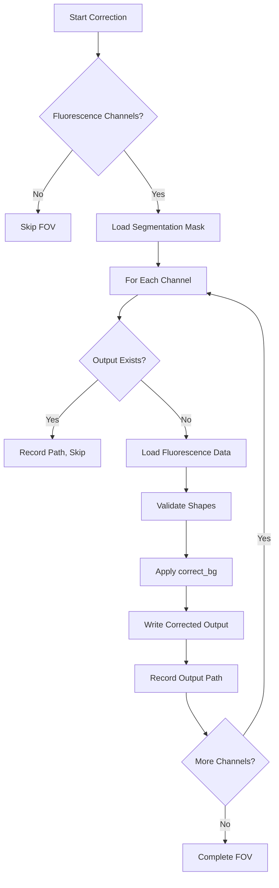
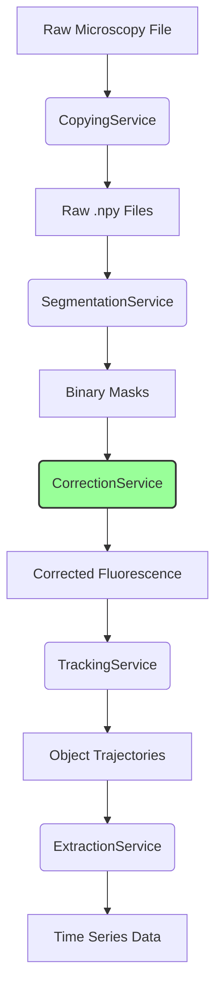
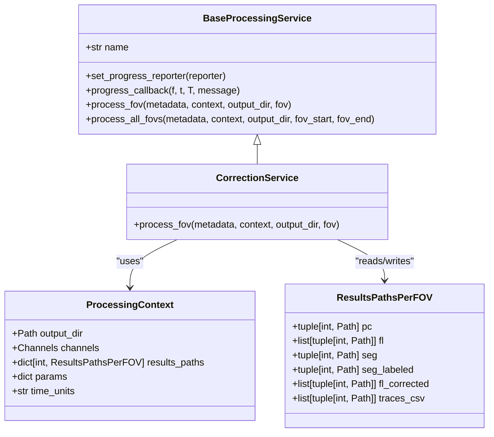
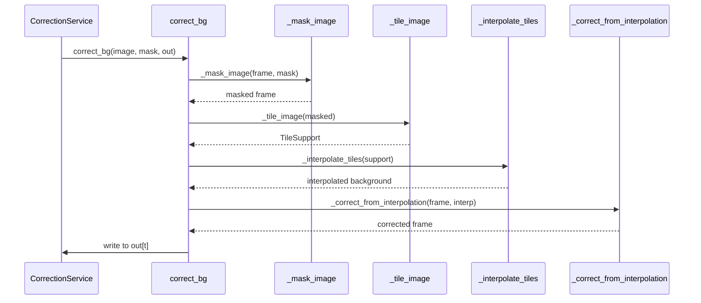
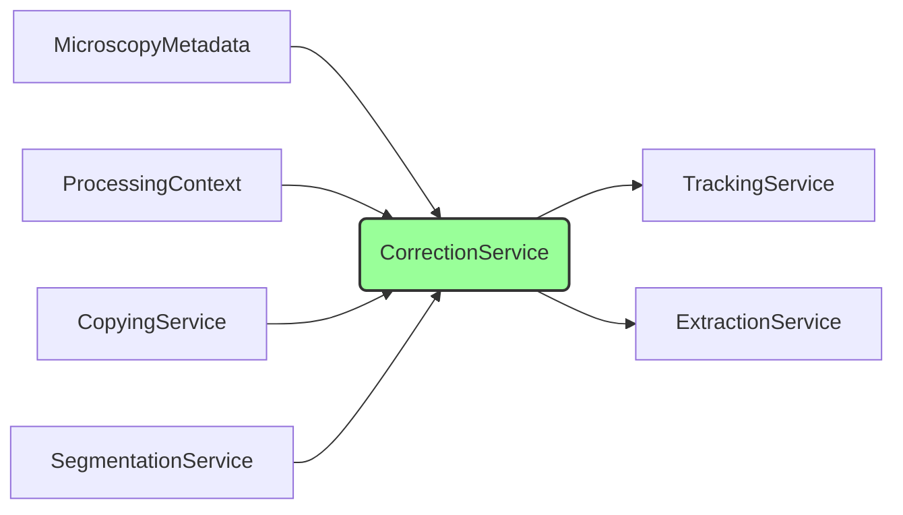

# Correction Service

<cite>
**Referenced Files in This Document**   
- [correction.py](file://pyama-core/src/pyama_core/processing/workflow/services/steps/correction.py)
- [tile_interp.py](file://pyama-core/src/pyama_core/processing/background/tile_interp.py)
- [types.py](file://pyama-core/src/pyama_core/processing/workflow/services/types.py)
- [pipeline.py](file://pyama-core/src/pyama_core/processing/workflow/pipeline.py)
- [microscopy.py](file://pyama-core/src/pyama_core/io/microscopy.py)
- [base.py](file://pyama-core/src/pyama_core/processing/workflow/services/base.py)
</cite>

## Table of Contents
1. [Introduction](#introduction)
2. [Core Components](#core-components)
3. [Architecture Overview](#architecture-overview)
4. [Detailed Component Analysis](#detailed-component-analysis)
5. [Dependency Analysis](#dependency-analysis)
6. [Performance Considerations](#performance-considerations)
7. [Troubleshooting Guide](#troubleshooting-guide)
8. [Conclusion](#conclusion)

## Introduction
The Correction Service is a key component in the PyAMA microscopy image analysis pipeline, responsible for performing background correction on fluorescence channels using a tile-based interpolation method. It operates as part of a multi-step preprocessing workflow, following data loading and segmentation steps. The service processes each field of view (FOV) independently, applying temporal background correction to 3D image stacks (time, height, width) by estimating and subtracting spatially varying background signals. This correction enhances image contrast and improves downstream analysis accuracy, particularly for fluorescence intensity measurements and cell tracking.

**Section sources**
- [correction.py](file://pyama-core/src/pyama_core/processing/workflow/services/steps/correction.py#L25-L146)

## Core Components
The Correction Service implements background correction logic using a functional pipeline defined in `tile_interp.py`. It integrates with the ProcessingContext to access input paths and record output locations. The service processes fluorescence channels only, skipping phase contrast data, and supports resuming interrupted processing by detecting existing output files. It leverages memory-mapped arrays for efficient I/O with large microscopy datasets and reports progress through callback mechanisms.

**Diagram sources**
- [correction.py](file://pyama-core/src/pyama_core/processing/workflow/services/steps/correction.py#L25-L146)

**Section sources**
- [correction.py](file://pyama-core/src/pyama_core/processing/workflow/services/steps/correction.py#L25-L146)
- [tile_interp.py](file://pyama-core/src/pyama_core/processing/background/tile_interp.py#L152-L192)

## Architecture Overview
The Correction Service operates within a modular pipeline architecture where each processing step is encapsulated as a service. It inherits from BaseProcessingService, implementing the `process_fov` method to handle individual fields of view. The service relies on prior execution of the CopyingService (to extract raw image data) and SegmentationService (to generate foreground masks). It produces background-corrected fluorescence images that serve as input for subsequent tracking and extraction steps.

**Diagram sources**
- [pipeline.py](file://pyama-core/src/pyama_core/processing/workflow/pipeline.py#L0-L558)
- [correction.py](file://pyama-core/src/pyama_core/processing/workflow/services/steps/correction.py#L25-L146)

## Detailed Component Analysis

### Correction Service Implementation
The CorrectionService class orchestrates the background correction process for each FOV. It retrieves input paths from the ProcessingContext, validates data shapes, and manages output file creation. The service uses memory-mapped arrays to handle large datasets efficiently, avoiding full in-memory loading. It implements progress reporting through the inherited progress_callback mechanism and gracefully handles existing outputs to support workflow resumption.

#### For Object-Oriented Components:

**Diagram sources**
- [correction.py](file://pyama-core/src/pyama_core/processing/workflow/services/steps/correction.py#L25-L146)
- [base.py](file://pyama-core/src/pyama_core/processing/workflow/services/base.py#L15-L83)
- [types.py](file://pyama-core/src/pyama_core/processing/workflow/services/types.py#L25-L30)

### Background Correction Algorithm
The `correct_bg` function in `tile_interp.py` implements the core image processing logic using a tile-based interpolation approach. For each frame in the 3D stack, it applies a dilated foreground mask to isolate background pixels, computes median values from overlapping tiles, interpolates a smooth background surface, and subtracts this background from the original image.

#### For API/Service Components:

**Diagram sources**
- [tile_interp.py](file://pyama-core/src/pyama_core/processing/background/tile_interp.py#L152-L192)

### Configuration Parameters
The background correction process can be configured through parameters accessible via the ProcessingContext.params dictionary. Key parameters include:
- `tile_size`: Tuple specifying height and width of interpolation tiles (default: (256, 256))
- `mask_dilation_size`: Integer controlling foreground mask dilation (default: 10)
- `interpolation_method`: String specifying interpolation algorithm (currently only RectBivariateSpline is implemented)

These parameters allow users to balance correction quality and computational efficiency based on their specific imaging conditions and hardware constraints.

**Section sources**
- [tile_interp.py](file://pyama-core/src/pyama_core/processing/background/tile_interp.py#L0-L193)
- [types.py](file://pyama-core/src/pyama_core/processing/workflow/services/types.py#L25-L30)

## Dependency Analysis
The Correction Service has well-defined dependencies within the processing pipeline. It depends on the successful completion of prior steps and specific data structures being available in the ProcessingContext. The service assumes that raw fluorescence data and segmentation masks have been written to disk by previous services.

**Diagram sources**
- [pipeline.py](file://pyama-core/src/pyama_core/processing/workflow/pipeline.py#L0-L558)
- [correction.py](file://pyama-core/src/pyama_core/processing/workflow/services/steps/correction.py#L25-L146)

## Performance Considerations
The Correction Service is designed to handle large microscopy datasets efficiently, but several factors impact its performance:

1. **Memory Usage**: The service uses memory-mapped arrays to avoid loading entire datasets into RAM. However, peak memory usage occurs when processing large frames, as intermediate arrays (masked image, tile support, interpolation) are created during correction.

2. **Tile Size**: Smaller tiles provide finer background correction but increase computational overhead due to more tiles per frame. Larger tiles reduce computation time but may miss localized background variations.

3. **Parallelization**: The pipeline supports multi-worker execution, with each worker processing a batch of FOVs. However, within a single FOV, correction is applied sequentially across time points.

4. **I/O Performance**: The service performs significant disk I/O when reading raw data and writing corrected outputs. Using fast storage (SSD) and appropriate memmap settings can improve throughput.

Optimization tips:
- Increase tile size for homogeneous background fields
- Use batch_size=1 with more workers for better load balancing
- Ensure sufficient RAM to cache frequently accessed data
- Monitor disk I/O during processing and consider using faster storage

**Section sources**
- [correction.py](file://pyama-core/src/pyama_core/processing/workflow/services/steps/correction.py#L25-L146)
- [tile_interp.py](file://pyama-core/src/pyama_core/processing/background/tile_interp.py#L0-L193)

## Troubleshooting Guide
Common issues and their solutions when using the Correction Service:

1. **Shape Mismatch Errors**: Occur when fluorescence and segmentation data have different dimensions. Ensure consistent image dimensions across channels and verify that segmentation was successfully generated for the same FOV.

2. **Missing Input Files**: The service expects raw fluorescence data and segmentation masks to exist. Verify that prior steps (Copying and Segmentation) completed successfully and check output directories for expected files.

3. **Memory Errors with Large Images**: For very large frames, consider increasing virtual memory or processing smaller regions. The tile-based approach helps, but extremely large frames may still exceed available memory.

4. **Incomplete Processing**: If the service skips channels, check if output files already exist. The service skips processing when corrected outputs are found, which may mask underlying issues.

5. **Poor Correction Quality**: Adjust tile_size or verify segmentation quality. Poor foreground masks lead to inaccurate background estimation.

**Section sources**
- [correction.py](file://pyama-core/src/pyama_core/processing/workflow/services/steps/correction.py#L25-L146)
- [tile_interp.py](file://pyama-core/src/pyama_core/processing/background/tile_interp.py#L152-L192)

## Conclusion
The Correction Service provides essential background correction capabilities for microscopy image analysis within the PyAMA pipeline. By leveraging tile-based interpolation and efficient memory management, it enables accurate fluorescence signal quantification while handling large datasets. Its integration with the ProcessingContext allows for flexible configuration and seamless workflow orchestration. Understanding its dependencies, configuration options, and performance characteristics enables users to optimize its use for various imaging applications, from basic research to high-throughput screening.