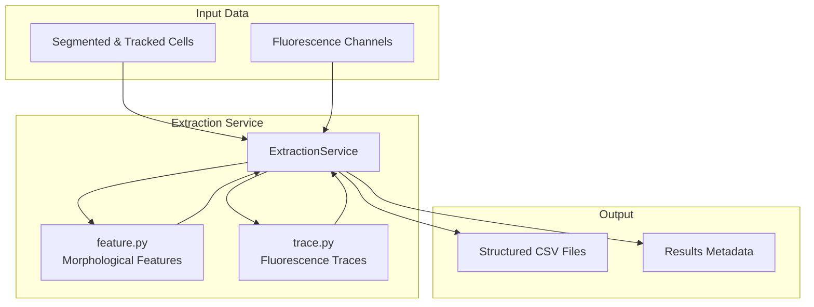
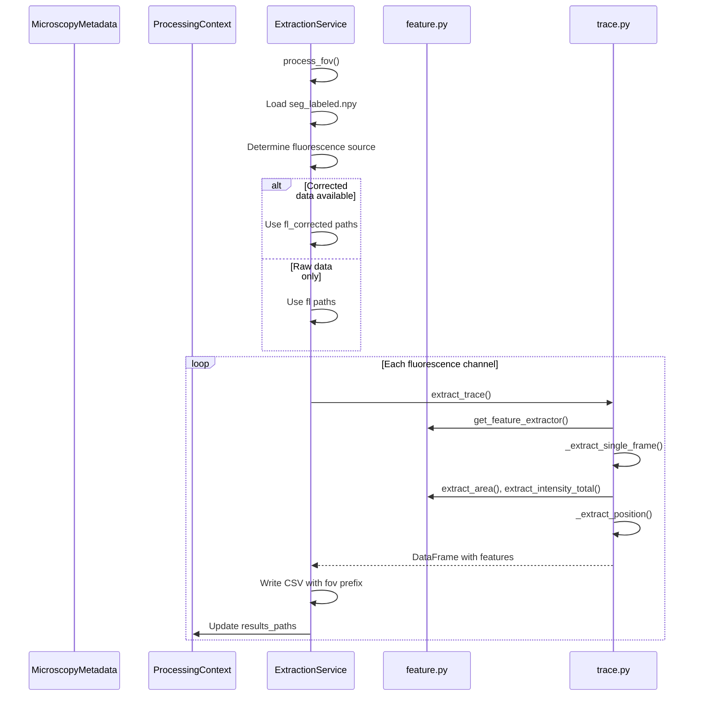
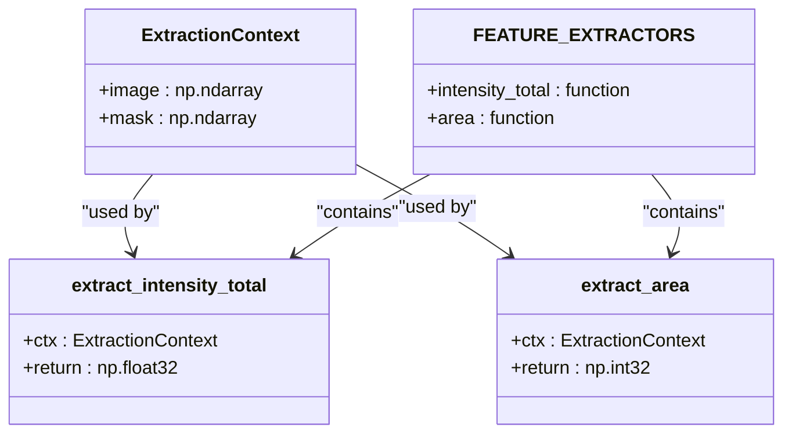
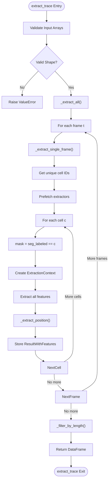
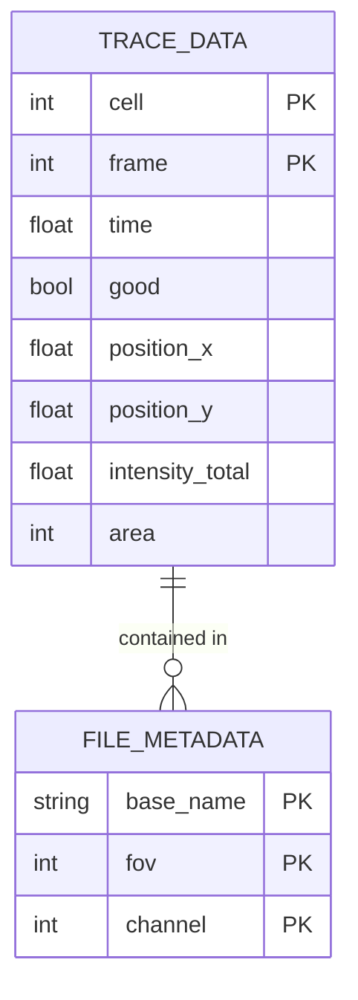

# Extraction Service

<cite>
**Referenced Files in This Document**   
- [extraction.py](file://pyama-core/src/pyama_core/processing/workflow/services/steps/extraction.py)
- [feature.py](file://pyama-core/src/pyama_core/processing/extraction/feature.py)
- [trace.py](file://pyama-core/src/pyama_core/processing/extraction/trace.py)
- [types.py](file://pyama-core/src/pyama_core/processing/workflow/services/types.py)
- [microscopy.py](file://pyama-core/src/pyama_core/io/microscopy.py)
</cite>

## Table of Contents
1. [Introduction](#introduction)
2. [Core Components](#core-components)
3. [Architecture Overview](#architecture-overview)
4. [Detailed Component Analysis](#detailed-component-analysis)
5. [Data Organization and Output Structure](#data-organization-and-output-structure)
6. [Configuration and Parameters](#configuration-and-parameters)
7. [Performance Considerations](#performance-considerations)
8. [Integration with Downstream Analysis](#integration-with-downstream-analysis)

## Introduction
The Extraction Service is a critical component in the PyAMA microscopy analysis pipeline, responsible for extracting quantitative features from segmented and tracked cells across time series data. As one of the final processing steps, it transforms spatial and temporal image data into structured numerical features that support downstream analysis, modeling, and visualization. This service operates on pre-processed data including segmented cell masks and fluorescence channels, extracting morphological metrics and fluorescence intensity trajectories for each cell over time.

**Section sources**
- [extraction.py](file://pyama-core/src/pyama_core/processing/workflow/services/steps/extraction.py#L1-L24)

## Core Components
The Extraction Service comprises three primary components: the service orchestrator, feature extraction module, and trace generation module. These components work together to extract quantitative data from time-series microscopy images. The service processes each field of view (FOV) independently, loading tracked segmentation data and fluorescence channels to compute cell-level features across time points. It integrates with feature.py for morphological metric calculation and trace.py for generating fluorescence intensity trajectories, organizing the extracted data by FOV and cell ID.

**Section sources**
- [extraction.py](file://pyama-core/src/pyama_core/processing/workflow/services/steps/extraction.py#L25-L132)
- [feature.py](file://pyama-core/src/pyama_core/processing/extraction/feature.py#L1-L59)
- [trace.py](file://pyama-core/src/pyama_core/processing/extraction/trace.py#L1-L236)

## Architecture Overview

**Diagram sources**
- [extraction.py](file://pyama-core/src/pyama_core/processing/workflow/services/steps/extraction.py#L25-L132)
- [feature.py](file://pyama-core/src/pyama_core/processing/extraction/feature.py#L1-L59)
- [trace.py](file://pyama-core/src/pyama_core/processing/extraction/trace.py#L1-L236)

## Detailed Component Analysis

### Extraction Service Implementation
The ExtractionService class extends BaseProcessingService and implements the process_fov method to handle feature extraction for each field of view. It coordinates the extraction workflow by loading tracked segmentation data and fluorescence channels, then processing each fluorescence channel to generate feature traces. The service follows a specific processing order, first attempting to use corrected fluorescence data and falling back to raw data when corrections are not available.

**Diagram sources**
- [extraction.py](file://pyama-core/src/pyama_core/processing/workflow/services/steps/extraction.py#L25-L132)
- [trace.py](file://pyama-core/src/pyama_core/processing/extraction/trace.py#L1-L236)
- [feature.py](file://pyama-core/src/pyama_core/processing/extraction/feature.py#L1-L59)

### Feature Extraction Module
The feature.py module provides the core functionality for calculating morphological metrics from segmented cells. It defines an ExtractionContext dataclass that encapsulates the image and mask data needed for feature calculation. The module implements a registry pattern with the FEATURE_EXTRACTORS dictionary, allowing extensible feature calculation. Currently implemented features include total intensity and cell area, with the framework supporting additional features through the registration of new extractor functions.

**Diagram sources**
- [feature.py](file://pyama-core/src/pyama_core/processing/extraction/feature.py#L1-L59)

### Trace Generation Module
The trace.py module implements the complete pipeline for extracting cell traces from microscopy time-series data. It follows a functional programming style and is designed for performance with large datasets. The module processes data frame-by-frame to manage memory usage efficiently, using vectorized operations for feature extraction. It includes progress callbacks for monitoring long-running operations and implements quality filtering to remove short-lived or low-quality cell traces.

**Diagram sources**
- [trace.py](file://pyama-core/src/pyama_core/processing/extraction/trace.py#L1-L236)

**Section sources**
- [trace.py](file://pyama-core/src/pyama_core/processing/extraction/trace.py#L1-L236)

## Data Organization and Output Structure
The Extraction Service organizes extracted data in a structured format that supports downstream analysis and visualization. For each field of view, the service creates a dedicated directory (fov_XXX) containing CSV files for each fluorescence channel. The output files follow a consistent naming convention: {base_name}_fov_{XXX}_traces_ch_{Y}.csv, where XXX is the FOV number and Y is the channel index.

The extracted data is organized in a long-format DataFrame where each row represents a (cell, time) observation. The DataFrame includes essential metadata columns such as cell ID, frame index, and time (in minutes), along with morphological features and fluorescence intensity values. The structure supports efficient querying and analysis, with the cell ID enabling tracking of individual cells across time points.

**Diagram sources**
- [extraction.py](file://pyama-core/src/pyama_core/processing/workflow/services/steps/extraction.py#L25-L132)
- [trace.py](file://pyama-core/src/pyama_core/processing/extraction/trace.py#L1-L236)

**Section sources**
- [extraction.py](file://pyama-core/src/pyama_core/processing/workflow/services/steps/extraction.py#L25-L132)

## Configuration and Parameters
The Extraction Service operates with configuration parameters passed through the ProcessingContext object. The service determines which features to extract based on the FEATURE_EXTRACTORS registry in feature.py, which currently includes intensity_total and area. The service automatically detects available fluorescence channels from the results_paths in the ProcessingContext, prioritizing corrected data (fl_corrected) when available and falling back to raw data (fl) otherwise.

Time information is extracted from the MicroscopyMetadata.timepoints array when available, converting from milliseconds to minutes. When timepoint metadata is not available, the service uses frame indices as a fallback, assuming one frame per minute. The trace filtering parameters, including minimum trace length (default 30 frames), are hardcoded in the _filter_by_length function in trace.py.

**Section sources**
- [extraction.py](file://pyama-core/src/pyama_core/processing/workflow/services/steps/extraction.py#L25-L132)
- [types.py](file://pyama-core/src/pyama_core/processing/workflow/services/types.py#L1-L62)
- [microscopy.py](file://pyama-core/src/pyama_core/io/microscopy.py#L1-L125)

## Performance Considerations
The Extraction Service is designed to handle large microscopy datasets efficiently. It uses memory-mapped arrays (via open_memmap) to access large image stacks without loading them entirely into memory. The service processes fluorescence channels sequentially, allowing for incremental progress and reducing peak memory usage. For large datasets with many cells and time points, the service provides progress callbacks to monitor extraction status.

The trace extraction pipeline is optimized for performance through several strategies: frame-by-frame processing to manage memory, vectorized operations for feature extraction, and efficient centroid calculation using bounding box approximation rather than full mask scanning. The service skips processing for channels where output already exists, enabling resumption of interrupted workflows. For very large datasets, the overall workflow supports parallel processing across multiple FOVs and workers, with the Extraction Service operating as part of this parallelized pipeline.

**Section sources**
- [extraction.py](file://pyama-core/src/pyama_core/processing/workflow/services/steps/extraction.py#L25-L132)
- [trace.py](file://pyama-core/src/pyama_core/processing/extraction/trace.py#L1-L236)
- [pipeline.py](file://pyama-core/src/pyama_core/processing/workflow/pipeline.py#L1-L558)

## Integration with Downstream Analysis
The extracted data serves as the primary input for downstream analysis and modeling. The structured CSV format is compatible with various analysis tools and libraries, particularly pandas for data manipulation and scikit-learn for machine learning applications. The output format supports fitting models that analyze cell behavior over time, such as growth curves, fluorescence dynamics, and response to stimuli.

The inclusion of cell IDs enables tracking of individual cells across time points, supporting lineage analysis and cell fate determination. The positional data (position_x, position_y) allows for spatial analysis of cell distributions and movements. The modular design of the feature extraction system enables easy extension with additional morphological or textural features to support specialized analysis workflows. The extracted data is also used by visualization components in the PyAMA-Qt interface to generate time-series plots and spatial maps of cell properties.

**Section sources**
- [extraction.py](file://pyama-core/src/pyama_core/processing/workflow/services/steps/extraction.py#L25-L132)
- [analysis_csv.py](file://pyama-core/src/pyama_core/io/analysis_csv.py#L1-L100)
- [results_yaml.py](file://pyama-core/src/pyama_core/io/results_yaml.py#L1-L100)