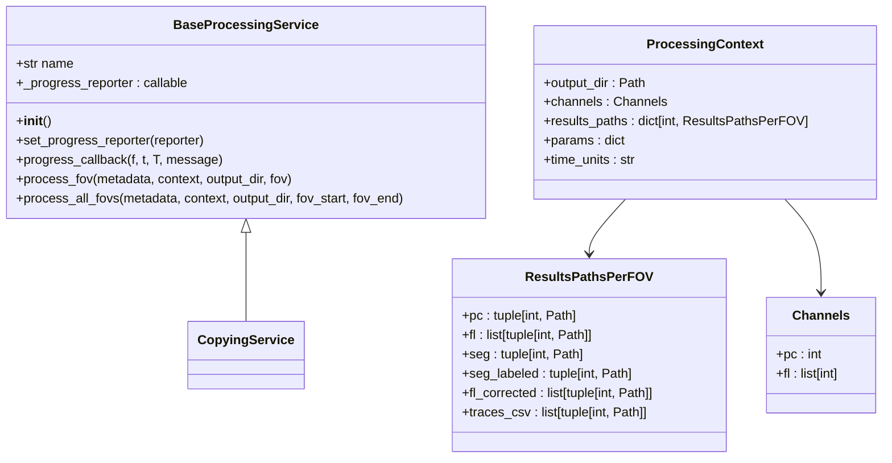
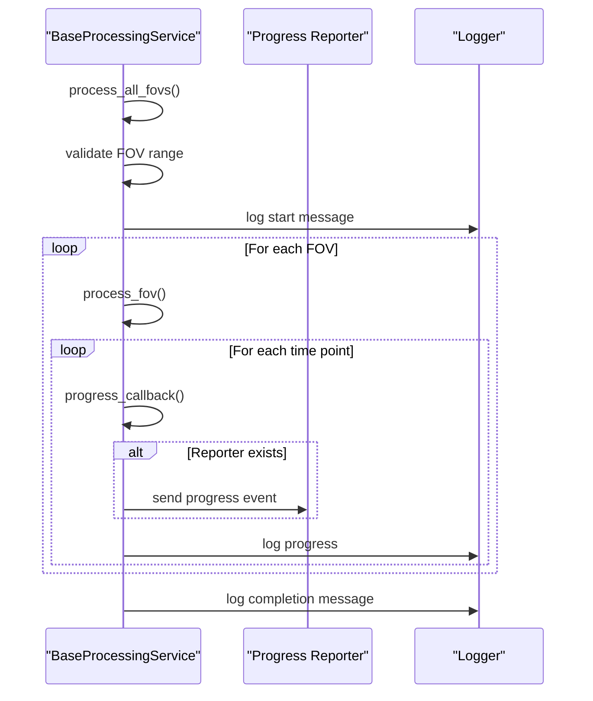
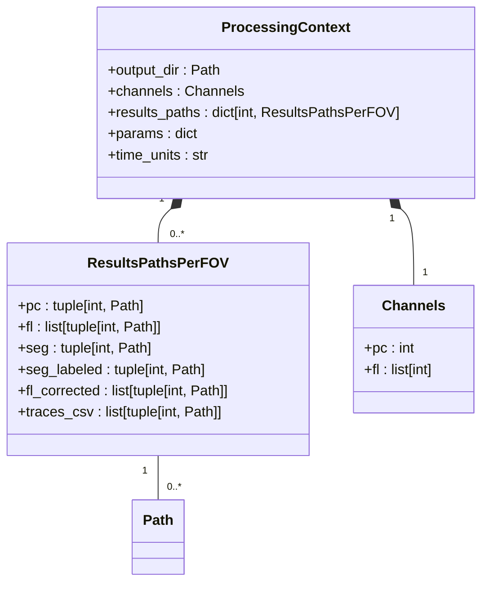
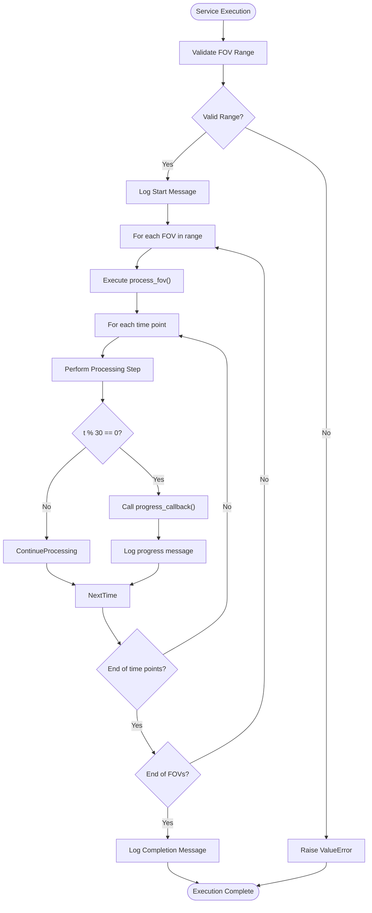
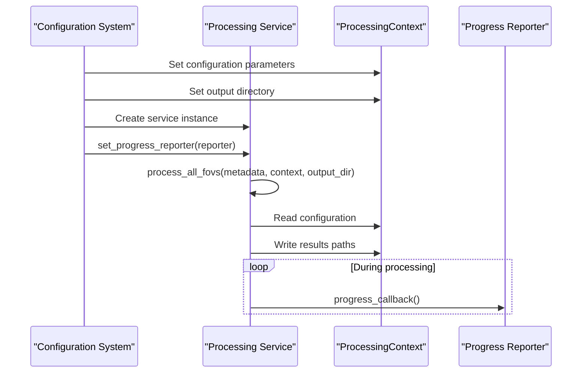
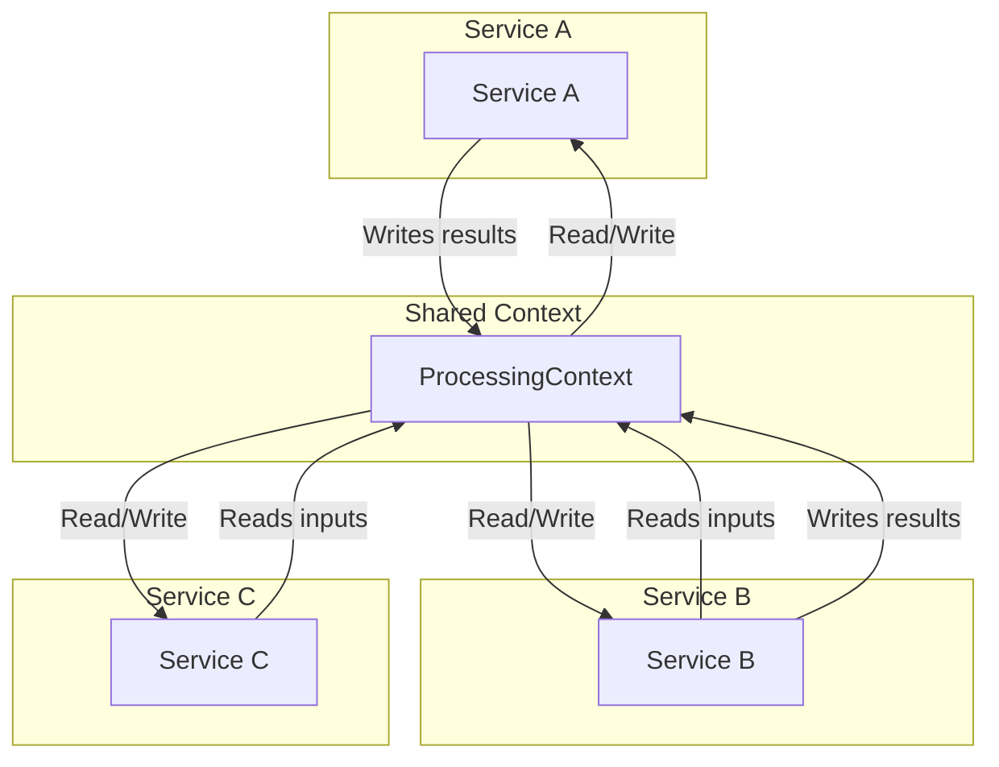
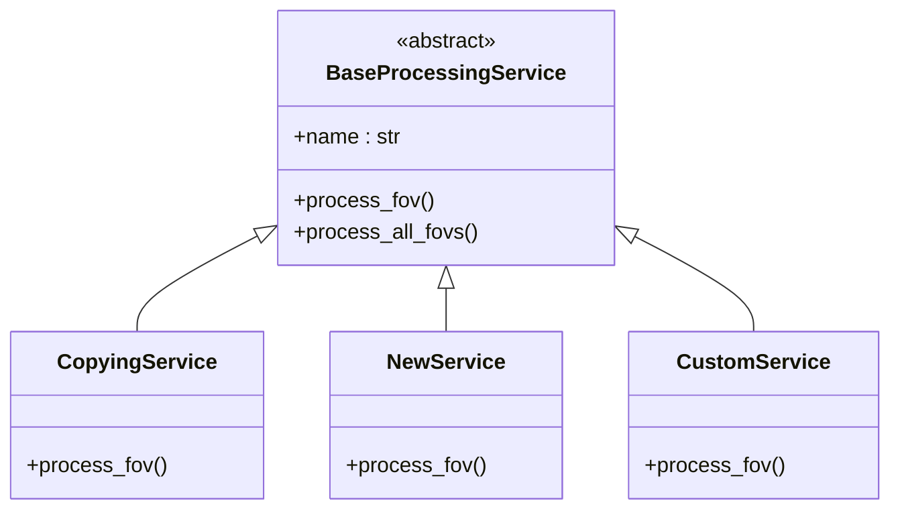
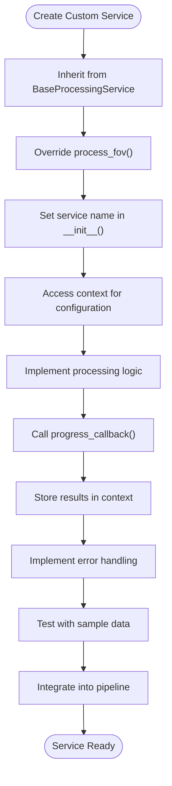

# Processing Services

<cite>
**Referenced Files in This Document**   
- [base.py](file://pyama-core/src/pyama_core/processing/workflow/services/base.py)
- [types.py](file://pyama-core/src/pyama_core/processing/workflow/services/types.py)
- [copying.py](file://pyama-core/src/pyama_core/processing/workflow/services/copying.py)
</cite>

## Table of Contents
1. [Introduction](#introduction)
2. [Core Components](#core-components)
3. [Base Service Architecture](#base-service-architecture)
4. [Shared Data Models](#shared-data-models)
5. [Service Lifecycle Management](#service-lifecycle-management)
6. [Dependency Injection and Configuration](#dependency-injection-and-configuration)
7. [Context Sharing and Loose Coupling](#context-sharing-and-loose-coupling)
8. [Extensibility Model](#extensibility-model)
9. [Custom Service Implementation Guide](#custom-service-implementation-guide)
10. [Conclusion](#conclusion)

## Introduction
The Processing Services framework provides a structured architecture for implementing microscopy image analysis workflows. This documentation details the core components that enable consistent, extensible, and maintainable processing pipelines. The framework is designed around a base service class that defines a uniform interface for all processing steps, shared data models that facilitate context sharing, and a lifecycle management system that ensures proper execution flow.

**Section sources**
- [base.py](file://pyama-core/src/pyama_core/processing/workflow/services/base.py#L1-L10)
- [types.py](file://pyama-core/src/pyama_core/processing/workflow/services/types.py#L1-L10)

## Core Components
The Processing Services framework consists of three primary components: the base service class, shared data models, and the lifecycle management system. These components work together to create a cohesive architecture for image processing workflows. The base service class provides a consistent interface for all processing steps, while the shared data models enable context sharing across services. The lifecycle management system ensures that services are properly initialized, executed, and cleaned up.

**Diagram sources**
- [base.py](file://pyama-core/src/pyama_core/processing/workflow/services/base.py#L15-L83)
- [types.py](file://pyama-core/src/pyama_core/processing/workflow/services/types.py#L9-L30)

**Section sources**
- [base.py](file://pyama-core/src/pyama_core/processing/workflow/services/base.py#L15-L83)
- [types.py](file://pyama-core/src/pyama_core/processing/workflow/services/types.py#L9-L30)

## Base Service Architecture
The BaseProcessingService class serves as the foundation for all processing services in the framework. It defines a consistent interface that ensures uniform behavior across different processing steps. The base class provides essential functionality including progress reporting, error handling, and batch processing of fields of view (FOVs). All concrete service implementations inherit from this base class and must implement the process_fov method to define their specific processing logic.

The base service architecture promotes code reuse and maintainability by centralizing common functionality. Services can focus on their specific processing logic while relying on the base class for infrastructure concerns. This separation of concerns allows for easier testing, debugging, and extension of the processing pipeline.

**Diagram sources**
- [base.py](file://pyama-core/src/pyama_core/processing/workflow/services/base.py#L15-L83)

**Section sources**
- [base.py](file://pyama-core/src/pyama_core/processing/workflow/services/base.py#L15-L83)

## Shared Data Models
The types module defines shared data models that facilitate context sharing across processing services. The ProcessingContext class serves as a central repository for shared state, configuration parameters, and processing results. This approach enables loose coupling between services while maintaining access to essential information.

The ResultsPathsPerFOV class provides a structured way to track output files for each field of view, with separate fields for different channel types and processing stages. The Channels class defines which microscopy channels should be processed, allowing services to adapt their behavior based on the selected channels.

These data models use Python's dataclass decorator with slots=True for improved memory efficiency and performance. The ensure_context function ensures that all fields are properly initialized, even when the context is created with partial data.

**Diagram sources**
- [types.py](file://pyama-core/src/pyama_core/processing/workflow/services/types.py#L9-L30)

**Section sources**
- [types.py](file://pyama-core/src/pyama_core/processing/workflow/services/types.py#L9-L30)

## Service Lifecycle Management
The Processing Services framework implements a well-defined lifecycle for service execution. Each service follows a consistent pattern of initialization, execution, and completion. The process_all_fovs method in the base class manages the overall execution flow, handling FOV range validation, progress logging, and iteration over fields of view.

The process_fov method represents the core processing logic for a single field of view. Concrete service implementations must override this method to provide their specific functionality. The base class ensures that the context is properly initialized through the ensure_context function before processing begins.

Progress reporting is integrated into the lifecycle through the progress_callback method, which is called at regular intervals during processing. This allows external systems to monitor progress and provide feedback to users. The callback is designed to be resilient, with exception handling that prevents progress reporting issues from affecting the main processing flow.

**Diagram sources**
- [base.py](file://pyama-core/src/pyama_core/processing/workflow/services/base.py#L55-L83)

**Section sources**
- [base.py](file://pyama-core/src/pyama_core/processing/workflow/services/base.py#L55-L83)

## Dependency Injection and Configuration
The framework employs dependency injection to provide services with necessary collaborators and configuration. The set_progress_reporter method allows external systems to inject a callback function for progress reporting. This approach enables services to report progress without being tightly coupled to any specific UI or monitoring system.

Configuration parameters are passed through the ProcessingContext object, which acts as a dependency container. Services access their configuration through the context's params dictionary, allowing for flexible and dynamic configuration without requiring changes to service constructors or interfaces.

The output directory is also provided through the context, enabling services to write their results to the appropriate location without hardcoding paths. This makes services more reusable and easier to test in different environments.

**Diagram sources**
- [base.py](file://pyama-core/src/pyama_core/processing/workflow/services/base.py#L22-L27)
- [types.py](file://pyama-core/src/pyama_core/processing/workflow/services/types.py#L25-L30)

**Section sources**
- [base.py](file://pyama-core/src/pyama_core/processing/workflow/services/base.py#L22-L27)
- [types.py](file://pyama-core/src/pyama_core/processing/workflow/services/types.py#L25-L30)

## Context Sharing and Loose Coupling
The ProcessingContext object enables services to share state and results without direct dependencies. Each service can read from and write to the context, creating a shared workspace for the entire processing pipeline. This approach promotes loose coupling by eliminating the need for services to have direct references to each other.

The results_paths dictionary in the context tracks output files for each field of view, allowing subsequent services to locate and use the outputs of previous steps. For example, a segmentation service can find the pre-processed images created by a correction service without knowing which specific correction service was used.

Channel selection through the channels field allows services to adapt their behavior based on the workflow configuration. A service can check which channels are selected and process only those channels, making services more flexible and reusable across different experimental setups.

**Diagram sources**
- [types.py](file://pyama-core/src/pyama_core/processing/workflow/services/types.py#L25-L30)

**Section sources**
- [types.py](file://pyama-core/src/pyama_core/processing/workflow/services/types.py#L25-L30)

## Extensibility Model
The framework is designed to be highly extensible, allowing new services to be added without modifying the core pipeline. New services are created by subclassing BaseProcessingService and implementing the process_fov method. The base class handles all infrastructure concerns, allowing developers to focus on the specific processing logic.

The plugin architecture enables services to be discovered and loaded dynamically. As long as a service follows the interface defined by the base class, it can be integrated into the processing pipeline. This approach supports both built-in services and third-party extensions.

The use of dataclasses for shared models makes it easy to extend the context with additional fields without breaking existing services. Services that don't use new fields can continue to work unchanged, while new services can take advantage of the additional information.

**Diagram sources**
- [base.py](file://pyama-core/src/pyama_core/processing/workflow/services/base.py#L15-L83)
- [copying.py](file://pyama-core/src/pyama_core/processing/workflow/services/copying.py#L23-L98)

**Section sources**
- [base.py](file://pyama-core/src/pyama_core/processing/workflow/services/base.py#L15-L83)
- [copying.py](file://pyama-core/src/pyama_core/processing/workflow/services/copying.py#L23-L98)

## Custom Service Implementation Guide
To implement a custom service, create a new class that inherits from BaseProcessingService. Override the process_fov method to define the specific processing logic. Set the name attribute in the constructor to identify the service in logs and progress reports.

Access configuration parameters through the context.params dictionary, and write output file paths to the context.results_paths dictionary. Use the progress_callback method to report progress at regular intervals, especially during long-running operations.

Ensure that your service handles edge cases gracefully, such as missing input files or invalid parameters. Use logging to provide informative messages about the service's progress and any issues encountered.

**Diagram sources**
- [base.py](file://pyama-core/src/pyama_core/processing/workflow/services/base.py#L46-L53)
- [types.py](file://pyama-core/src/pyama_core/processing/workflow/services/types.py#L25-L30)

**Section sources**
- [base.py](file://pyama-core/src/pyama_core/processing/workflow/services/base.py#L46-L53)
- [types.py](file://pyama-core/src/pyama_core/processing/workflow/services/types.py#L25-L30)

## Conclusion
The Processing Services framework provides a robust foundation for building microscopy image analysis workflows. By defining a consistent interface through the BaseProcessingService class and enabling context sharing through the ProcessingContext object, the framework promotes loose coupling, reusability, and maintainability. The extensibility model allows new services to be added without modifying the core pipeline, supporting both built-in functionality and third-party extensions. This architecture enables the creation of complex, multi-step processing workflows while maintaining code quality and developer productivity.