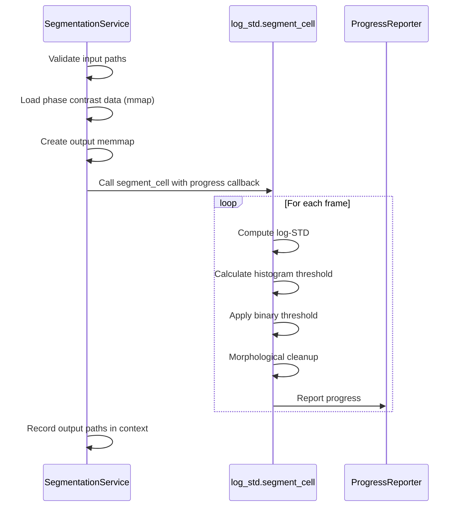
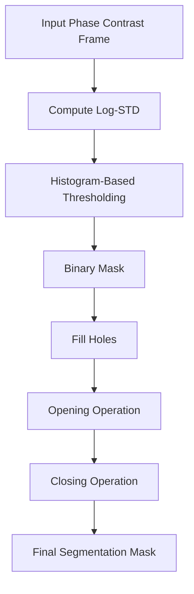
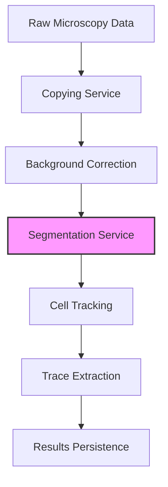

# Segmentation Service

<cite>
**Referenced Files in This Document**   
- [log_std.py](file://pyama-core/src/pyama_core/processing/segmentation/log_std.py)
- [segmentation.py](file://pyama-core/src/pyama_core/processing/workflow/services/steps/segmentation.py)
- [pipeline.py](file://pyama-core/src/pyama_core/processing/workflow/pipeline.py)
- [tracking.py](file://pyama-core/src/pyama_core/processing/workflow/services/steps/tracking.py)
- [correction.py](file://pyama-core/src/pyama_core/processing/workflow/services/steps/correction.py)
- [base.py](file://pyama-core/src/pyama_core/processing/workflow/services/base.py)
- [types.py](file://pyama-core/src/pyama_core/processing/workflow/services/types.py)
- [microscopy.py](file://pyama-core/src/pyama_core/io/microscopy.py)
</cite>

## Table of Contents
1. [Introduction](#introduction)
2. [LOG-STD Algorithm Overview](#log-std-algorithm-overview)
3. [Segmentation Workflow Orchestration](#segmentation-workflow-orchestration)
4. [Input Requirements and Image Characteristics](#input-requirements-and-image-characteristics)
5. [Output Mask Generation Process](#output-mask-generation-process)
6. [Configuration Parameters](#configuration-parameters)
7. [Pipeline Position and Integration](#pipeline-position-and-integration)
8. [Data Persistence and Downstream Access](#data-persistence-and-downstream-access)
9. [Common Segmentation Challenges](#common-segmentation-challenges)
10. [Parameter Tuning Strategies](#parameter-tuning-strategies)

## Introduction
The Segmentation Service in PyAMA implements a specialized cell detection pipeline for phase contrast microscopy images using the LOG-STD (Laplacian of Gaussian with Standard Deviation) algorithm. This service plays a critical role in the overall image analysis workflow by converting raw microscopy data into binary masks that identify cellular regions. The implementation is optimized for both performance and memory efficiency, processing large 3D image stacks frame-by-frame to minimize memory footprint while maintaining computational speed through efficient numerical algorithms.

**Section sources**
- [segmentation.py](file://pyama-core/src/pyama_core/processing/workflow/services/steps/segmentation.py#L1-L125)
- [log_std.py](file://pyama-core/src/pyama_core/processing/segmentation/log_std.py#L1-L131)

## LOG-STD Algorithm Overview
The LOG-STD algorithm implements a multi-stage approach to cell segmentation in phase contrast images. The core methodology combines local statistical analysis with morphological processing to identify cellular structures. For each 2D frame in the input stack, the algorithm computes the log standard deviation using a uniform filter, which efficiently calculates local mean and mean-of-squares in O(1) time per pixel regardless of window size. This approach leverages the fact that cellular regions in phase contrast images typically exhibit higher local variance compared to background areas.

The algorithm first computes the local mean and squared mean using scipy.ndimage.uniform_filter, then calculates variance as the difference between mean-of-squares and squared mean. The logarithm of the standard deviation is computed for pixels where variance is positive, with zero values assigned elsewhere. This log-STD transformation enhances the contrast between cellular structures and background, making subsequent thresholding more effective.

**Section sources**
- [log_std.py](file://pyama-core/src/pyama_core/processing/segmentation/log_std.py#L1-L131)

## Segmentation Workflow Orchestration
The SegmentationService class orchestrates the segmentation workflow by coordinating data loading, algorithm execution, and result persistence. The service inherits from BaseProcessingService and implements the process_fov method to handle individual fields of view. It begins by validating the existence of input phase contrast data, then loads the 3D image stack using memory mapping to handle large files efficiently.

The service invokes the segment_cell function from the log_std module, passing the input data and a pre-allocated output array. A progress callback is provided to report processing status, which is integrated with the overall workflow's progress reporting system. The service handles both legacy and modern data path conventions, extracting channel indices when available and falling back to default values when context information is incomplete.

**Diagram sources**
- [segmentation.py](file://pyama-core/src/pyama_core/processing/workflow/services/steps/segmentation.py#L1-L125)
- [log_std.py](file://pyama-core/src/pyama_core/processing/segmentation/log_std.py#L1-L131)

**Section sources**
- [segmentation.py](file://pyama-core/src/pyama_core/processing/workflow/services/steps/segmentation.py#L1-L125)

## Input Requirements and Image Characteristics
The Segmentation Service requires 3D numpy arrays in the shape (T, H, W) representing time-series phase contrast microscopy images, where T is the number of frames, H is height, and W is width. The input data must be float-like arrays, with the service automatically converting to float32 if necessary. The algorithm is specifically designed for phase contrast images, which typically exhibit halo effects around cellular structures and varying contrast levels across the field of view.

The service expects input data to have undergone background correction prior to segmentation, as this preprocessing step improves the consistency of cellular signal intensity. The phase contrast data should be stored in .npy format using memory mapping to enable efficient access to large datasets without loading the entire volume into memory. The service validates input dimensions and raises ValueError exceptions for improperly shaped arrays.

**Section sources**
- [segmentation.py](file://pyama-core/src/pyama_core/processing/workflow/services/steps/segmentation.py#L1-L125)
- [log_std.py](file://pyama-core/src/pyama_core/processing/segmentation/log_std.py#L1-L131)

## Output Mask Generation Process
The output mask generation process transforms the input phase contrast images into binary segmentation masks through a three-stage pipeline. First, the _compute_logstd_2d function calculates the log standard deviation for each pixel using a uniform filter with configurable neighborhood size. Second, the _threshold_by_histogram function analyzes the log-STD distribution to determine an adaptive threshold by identifying the background mode and setting the threshold at mode + 3σ.

Third, the _morph_cleanup function applies morphological operations to refine the binary mask. This includes hole filling to ensure cellular regions are contiguous, followed by opening and closing operations with a square structuring element to remove noise and smooth boundaries. The final boolean mask is written directly to a memory-mapped array to minimize memory usage, with the service handling cleanup of temporary memory mappings in case of interruptions.

**Diagram sources**
- [log_std.py](file://pyama-core/src/pyama_core/processing/segmentation/log_std.py#L1-L131)

**Section sources**
- [log_std.py](file://pyama-core/src/pyama_core/processing/segmentation/log_std.py#L1-L131)

## Configuration Parameters
The LOG-STD segmentation algorithm incorporates several configurable parameters that control its behavior. The neighborhood size parameter in _compute_logstd_2d determines the effective window size (2*size+1) for local statistics calculation, with larger values providing more robust statistics but potentially blurring fine cellular details. The morphological cleanup operation accepts size and iterations parameters, where size defines the dimensions of the square structuring element and iterations controls the number of opening and closing operations.

Although these parameters are currently hardcoded in the implementation, the architecture supports potential future extension to make them configurable through the ProcessingContext.params dictionary. The thresholding algorithm uses a fixed 200-bin histogram resolution and a 3-sigma offset from the background mode, providing a balance between sensitivity to cellular structures and robustness to noise.

**Section sources**
- [log_std.py](file://pyama-core/src/pyama_core/processing/segmentation/log_std.py#L1-L131)

## Pipeline Position and Integration
The Segmentation Service occupies a critical position in the PyAMA processing pipeline, executing after background correction and before cell tracking. This sequential arrangement ensures that cellular segmentation benefits from the improved signal consistency provided by background correction, while supplying the binary masks required for subsequent tracking algorithms. The service is invoked as part of the run_complete_workflow function in the pipeline module, which coordinates the execution of all processing steps across multiple fields of view.

The service integrates with other components through the ProcessingContext object, which maintains references to input and output file paths across the workflow. After segmentation completes, the generated masks are recorded in the results_paths dictionary within the context, making them available to downstream services such as CorrectionService (for fluorescence channel correction) and TrackingService (for cell lineage identification).

**Diagram sources**
- [pipeline.py](file://pyama-core/src/pyama_core/processing/workflow/pipeline.py#L1-L558)
- [segmentation.py](file://pyama-core/src/pyama_core/processing/workflow/services/steps/segmentation.py#L1-L125)
- [correction.py](file://pyama-core/src/pyama_core/processing/workflow/services/steps/correction.py#L1-L147)
- [tracking.py](file://pyama-core/src/pyama_core/processing/workflow/services/steps/tracking.py#L1-L126)

**Section sources**
- [pipeline.py](file://pyama-core/src/pyama_core/processing/workflow/pipeline.py#L1-L558)

## Data Persistence and Downstream Access
Segmentation results are persisted as boolean numpy arrays in .npy format using memory mapping for efficient storage and access. The output files follow a naming convention that includes the base name, field of view index, and channel information (e.g., "{basename}_fov_{fov:03d}_seg_ch_{ch}.npy"). These files are recorded in the ProcessingContext.results_paths dictionary as tuples containing the channel index and file path, enabling downstream services to reliably locate the segmentation masks.

The TrackingService directly consumes these segmentation masks to perform cell tracking, loading them with memory mapping to handle large datasets efficiently. Similarly, the CorrectionService uses the segmentation masks to define cellular regions for fluorescence background correction. The processing_results.yaml file persists the final state of the ProcessingContext, providing a complete record of all generated files that can be accessed by analysis and visualization components.

**Section sources**
- [segmentation.py](file://pyama-core/src/pyama_core/processing/workflow/services/steps/segmentation.py#L1-L125)
- [tracking.py](file://pyama-core/src/pyama_core/processing/workflow/services/steps/tracking.py#L1-L126)
- [correction.py](file://pyama-core/src/pyama_core/processing/workflow/services/steps/correction.py#L1-L147)
- [pipeline.py](file://pyama-core/src/pyama_core/processing/workflow/pipeline.py#L1-L558)

## Common Segmentation Challenges
The LOG-STD algorithm addresses several common challenges in phase contrast cell segmentation. Overlapping cells present a significant challenge, as the algorithm's thresholding approach may merge adjacent cells into single regions. The current implementation does not include explicit cell separation techniques, relying instead on the tracking algorithm to potentially resolve merged cells over time based on their movement patterns.

Other challenges include variations in image quality across different fields of view, changes in cellular morphology over time, and artifacts from the microscopy process. The algorithm's reliance on local variance makes it sensitive to noise, though the morphological cleanup steps help mitigate this issue. In cases of very low contrast or poor image quality, the histogram-based thresholding may fail to distinguish cellular regions from background, resulting in under-segmentation.

**Section sources**
- [log_std.py](file://pyama-core/src/pyama_core/processing/segmentation/log_std.py#L1-L131)

## Parameter Tuning Strategies
While the current implementation uses fixed parameters, effective parameter tuning strategies could significantly improve segmentation quality. The neighborhood size parameter should be tuned relative to the typical cell diameter in the images, with the effective window size approximately matching the cell size. For morphological operations, the structuring element size should be slightly smaller than the minimum expected cell size to avoid removing legitimate cellular regions.

Threshold sensitivity can be adjusted by modifying the sigma multiplier in the threshold calculation, with higher values producing more conservative (sparser) segmentation and lower values yielding more inclusive (denser) results. In practice, these parameters could be optimized using ground truth annotations and metrics such as Dice coefficient or intersection-over-union. The algorithm's modular design would allow for systematic parameter optimization across a representative set of training images to determine optimal values for specific experimental conditions.

**Section sources**
- [log_std.py](file://pyama-core/src/pyama_core/processing/segmentation/log_std.py#L1-L131)