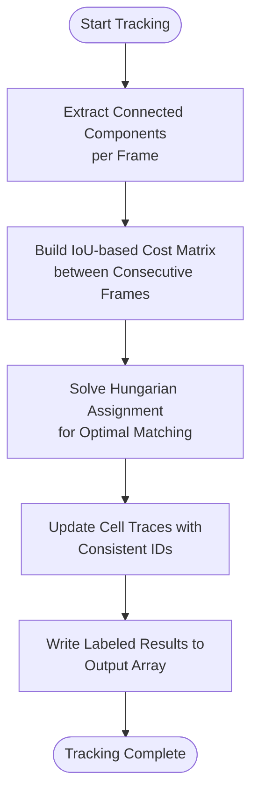
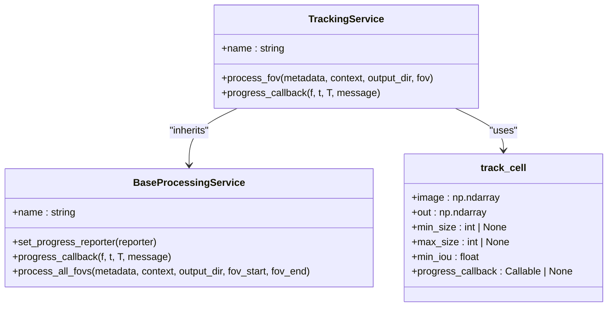
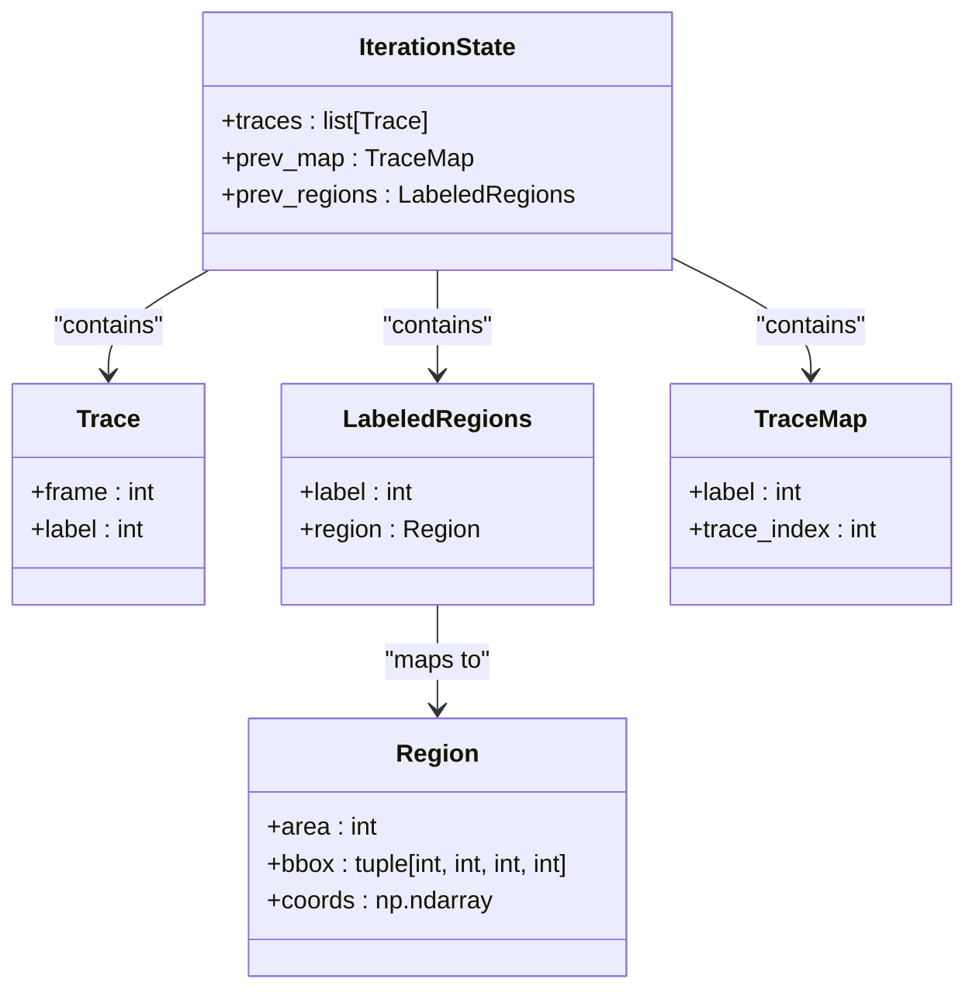
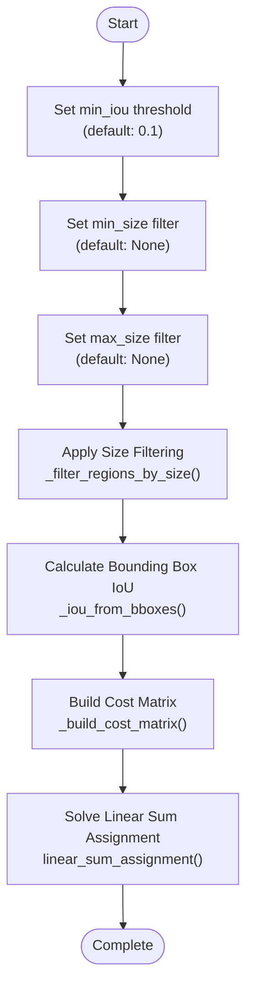
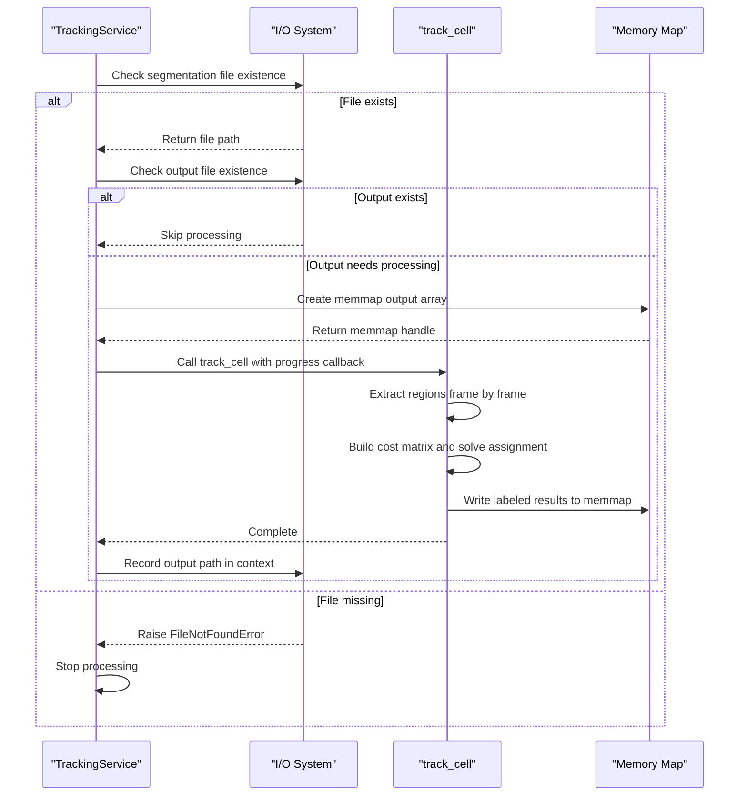

# Tracking Service

<cite>
**Referenced Files in This Document**   
- [tracking.py](file://pyama-core/src/pyama_core/processing/workflow/services/steps/tracking.py)
- [iou.py](file://pyama-core/src/pyama_core/processing/tracking/iou.py)
- [base.py](file://pyama-core/src/pyama_core/processing/workflow/services/base.py)
- [types.py](file://pyama-core/src/pyama_core/processing/workflow/services/types.py)
- [microscopy.py](file://pyama-core/src/pyama_core/io/microscopy.py)
</cite>

## Table of Contents
1. [Introduction](#introduction)
2. [Tracking Algorithm Overview](#tracking-algorithm-overview)
3. [Core Components](#core-components)
4. [Data Structures and State Management](#data-structures-and-state-management)
5. [Configuration Parameters](#configuration-parameters)
6. [Processing Workflow](#processing-workflow)
7. [Dependency on Segmentation](#dependency-on-segmentation)
8. [Output Serialization and Downstream Usage](#output-serialization-and-downstream-usage)
9. [Common Tracking Issues and Solutions](#common-tracking-issues-and-solutions)
10. [Performance Considerations](#performance-considerations)

## Introduction
The Tracking Service implements a robust cell tracking solution for longitudinal analysis of time-lapse microscopy data. It builds upon successful segmentation results to maintain consistent cell identities across frames using an Intersection over Union (IoU)-based matching algorithm. This service enables researchers to analyze cell lineages, division events, and dynamic behaviors over time by establishing persistent cell IDs throughout the imaging sequence.

**Section sources**
- [tracking.py](file://pyama-core/src/pyama_core/processing/workflow/services/steps/tracking.py#L1-L10)

## Tracking Algorithm Overview
The tracking system employs an IoU-based Hungarian assignment algorithm to match segmented cells between consecutive frames. The core algorithm extracts connected components from each frame's segmentation mask, computes pairwise IoU values between regions in adjacent frames, and solves an optimal assignment problem to maintain consistent cell labeling. This approach effectively handles cell movement, shape changes, and moderate overlaps while preserving lineage information.

The algorithm operates in-place on preallocated output arrays, processing frames sequentially from the initial time point. Cell tracks are seeded from the first frame's regions, and subsequent frames are matched based on spatial overlap. The use of bounding box IoU for cost calculation provides an efficient approximation that balances accuracy with computational performance.

**Diagram sources**
- [iou.py](file://pyama-core/src/pyama_core/processing/tracking/iou.py#L279-L360)

**Section sources**
- [iou.py](file://pyama-core/src/pyama_core/processing/tracking/iou.py#L1-L50)

## Core Components
The Tracking Service consists of two primary components: the `TrackingService` class that manages the processing workflow and the `track_cell` function that implements the core tracking algorithm. The service handles input/output operations, memory mapping, and progress reporting, while delegating the actual tracking computation to the algorithm module.

The `track_cell` function serves as the public entrypoint for the tracking algorithm, accepting a 3D boolean array of segmented regions and writing labeled cell IDs to a preallocated output array. It performs comprehensive validation of input dimensions and types, ensuring compatibility between the segmentation data and output buffer.

**Diagram sources**
- [tracking.py](file://pyama-core/src/pyama_core/processing/workflow/services/steps/tracking.py#L25-L125)
- [iou.py](file://pyama-core/src/pyama_core/processing/tracking/iou.py#L279-L360)

**Section sources**
- [tracking.py](file://pyama-core/src/pyama_core/processing/workflow/services/steps/tracking.py#L25-L125)
- [iou.py](file://pyama-core/src/pyama_core/processing/tracking/iou.py#L279-L360)

## Data Structures and State Management
The tracking algorithm maintains cell lineages through several key data structures that preserve state across frames. The `IterationState` class encapsulates the current tracking state, including active traces, previous frame mappings, and region properties. Each cell's lineage is represented as a trace—a dictionary mapping frame indices to region labels—allowing reconstruction of the complete cell history.

The algorithm uses dictionaries to efficiently map between region labels and trace indices, enabling rapid lookups during the assignment process. Region properties including area, bounding box coordinates, and pixel coordinates are stored in the `Region` dataclass, providing quick access to geometric information without repeated computation.

**Diagram sources**
- [iou.py](file://pyama-core/src/pyama_core/processing/tracking/iou.py#L45-L85)

**Section sources**
- [iou.py](file://pyama-core/src/pyama_core/processing/tracking/iou.py#L45-L85)

## Configuration Parameters
The tracking algorithm exposes several configurable parameters that control its behavior and sensitivity. The `min_iou` parameter sets the minimum Intersection over Union threshold for considering two regions as potential matches, with a default value of 0.1. Higher values make the tracker more conservative, requiring greater overlap for matches, while lower values allow for more lenient matching.

Size filtering parameters `min_size` and `max_size` enable exclusion of regions based on pixel area, helping to eliminate noise or artifacts from the tracking process. These parameters are particularly useful for removing small segmentation errors or large debris that could interfere with accurate cell tracking.

**Diagram sources**
- [iou.py](file://pyama-core/src/pyama_core/processing/tracking/iou.py#L279-L360)

**Section sources**
- [iou.py](file://pyama-core/src/pyama_core/processing/tracking/iou.py#L279-L360)

## Processing Workflow
The tracking workflow follows a systematic process that begins with loading segmentation data and ends with writing labeled results. The `TrackingService` first verifies the existence of input segmentation files, then creates a memory-mapped output array to handle large datasets efficiently. This approach minimizes memory usage while allowing direct writing of results to disk.

The workflow processes each field of view (FOV) independently, checking for existing tracking results to avoid redundant computation. When results are not present, the service invokes the `track_cell` function with appropriate parameters and progress callbacks. The processing pipeline handles exceptions gracefully, ensuring cleanup of temporary resources even when interruptions occur.

**Diagram sources**
- [tracking.py](file://pyama-core/src/pyama_core/processing/workflow/services/steps/tracking.py#L25-L125)

**Section sources**
- [tracking.py](file://pyama-core/src/pyama_core/processing/workflow/services/steps/tracking.py#L25-L125)

## Dependency on Segmentation
The Tracking Service has a critical dependency on successful segmentation, as it operates directly on the binary segmentation masks produced by earlier processing steps. The quality of tracking results is fundamentally limited by the accuracy and consistency of the segmentation. Poor segmentation with fragmented cells, merged cells, or false positives will propagate into tracking errors.

The service assumes that segmentation has already been performed and stored in NumPy array format (.npy files). It specifically looks for segmentation data in the expected naming convention based on the microscopy metadata. The tracking algorithm cannot compensate for segmentation errors but can filter regions based on size criteria to mitigate some artifacts.

**Section sources**
- [tracking.py](file://pyama-core/src/pyama_core/processing/workflow/services/steps/tracking.py#L40-L60)

## Output Serialization and Downstream Usage
Tracking results are serialized as 3D uint16 arrays in NumPy's .npy format, with consistent cell IDs maintained across all frames. Each pixel in the output array contains the cell ID for that location, enabling reconstruction of cell positions and shapes at any time point. The memory-mapped approach allows efficient handling of large datasets that may exceed available RAM.

The labeled segmentation data serves as input for downstream analysis such as lineage tree construction, division event detection, and feature extraction over time. Other components in the processing pipeline, such as the extraction module, use these consistent cell IDs to compute time-series measurements of cellular properties like area, intensity, and morphology.

**Section sources**
- [tracking.py](file://pyama-core/src/pyama_core/processing/workflow/services/steps/tracking.py#L90-L110)

## Common Tracking Issues and Solutions
Several common challenges arise in cell tracking, including cell collisions, temporary disappearances due to focus issues, and division events. The current implementation handles moderate cell movements and shape changes effectively but has limitations in cases of severe cell overlap or prolonged disappearance.

For cell collisions where two cells merge in the segmentation mask, the tracker may incorrectly maintain a single ID, losing individual cell identities. Similarly, when cells temporarily disappear due to imaging artifacts, the tracker may fail to re-establish the lineage if the gap exceeds the effective matching window determined by the IoU threshold.

Solutions include adjusting the `min_iou` parameter to make matching more or less lenient, applying stricter size filters to remove artifacts, and ensuring high-quality segmentation as a prerequisite. For division events, the current algorithm does not explicitly handle cell splitting, so daughter cells may inherit the parent ID or be treated as new cells depending on the segmentation quality.

**Section sources**
- [iou.py](file://pyama-core/src/pyama_core/processing/tracking/iou.py#L200-L250)

## Performance Considerations
The tracking algorithm is designed to balance accuracy with computational efficiency. By using bounding box IoU rather than pixel-level intersection calculations, it achieves significant performance improvements while maintaining reasonable matching accuracy. The use of memory mapping allows processing of large datasets without loading entire volumes into RAM.

The algorithm's complexity scales with the number of regions per frame and the total number of frames. For datasets with high cell density or long time series, processing time increases accordingly. The current implementation processes frames sequentially, which limits opportunities for parallelization but ensures consistent state management across the entire time series.

**Section sources**
- [iou.py](file://pyama-core/src/pyama_core/processing/tracking/iou.py#L150-L180)