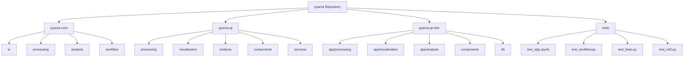
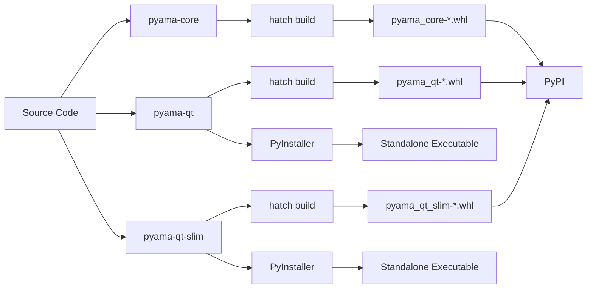
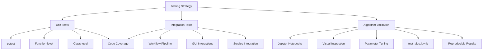
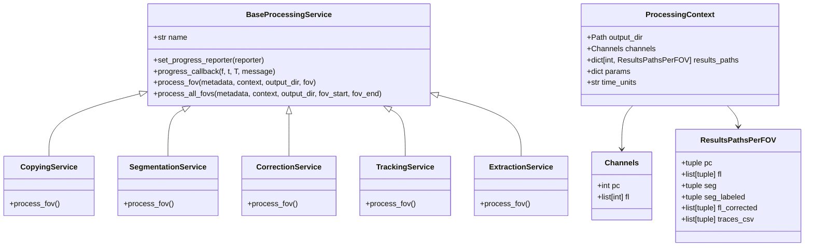

# Developer Guide

<cite>
**Referenced Files in This Document**   
- [pyama-core/pyproject.toml](file://pyama-core/pyproject.toml)
- [pyama-qt/pyproject.toml](file://pyama-qt/pyproject.toml)
- [pyama-qt-slim/pyproject.toml](file://pyama-qt-slim/pyproject.toml)
- [pyproject.toml](file://pyproject.toml)
- [pyama-core/src/pyama_core/processing/workflow/pipeline.py](file://pyama-core/src/pyama_core/processing/workflow/pipeline.py)
- [pyama-core/src/pyama_core/processing/workflow/services/base.py](file://pyama-core/src/pyama_core/processing/workflow/services/base.py)
- [pyama-core/src/pyama_core/processing/workflow/services/steps/segmentation.py](file://pyama-core/src/pyama_core/processing/workflow/services/steps/segmentation.py)
- [pyama-core/src/pyama_core/processing/workflow/services/steps/correction.py](file://pyama-core/src/pyama_core/processing/workflow/services/steps/correction.py)
- [pyama-core/src/pyama_core/processing/workflow/services/steps/tracking.py](file://pyama-core/src/pyama_core/processing/workflow/services/steps/tracking.py)
- [pyama-core/src/pyama_core/processing/workflow/services/steps/extraction.py](file://pyama-core/src/pyama_core/processing/workflow/services/steps/extraction.py)
- [pyama-core/src/pyama_core/processing/workflow/services/copying.py](file://pyama-core/src/pyama_core/processing/workflow/services/copying.py)
- [pyama-core/src/pyama_core/processing/workflow/services/types.py](file://pyama-core/src/pyama_core/processing/workflow/services/types.py)
- [pyama-core/src/pyama_core/io/microscopy.py](file://pyama-core/src/pyama_core/io/microscopy.py)
- [pyama-core/src/pyama_core/io/nikon.py](file://pyama-core/src/pyama_core/io/nikon.py)
- [pyama-core/src/pyama_core/processing/segmentation/log_std.py](file://pyama-core/src/pyama_core/processing/segmentation/log_std.py)
- [pyama-core/src/pyama_core/processing/background/tile_interp.py](file://pyama-core/src/pyama_core/processing/background/tile_interp.py)
- [pyama-core/src/pyama_core/processing/tracking/iou.py](file://pyama-core/src/pyama_core/processing/tracking/iou.py)
- [pyama-core/src/pyama_core/processing/extraction/trace.py](file://pyama-core/src/pyama_core/processing/extraction/trace.py)
- [pyama-core/src/pyama_core/analysis/fitting.py](file://pyama-core/src/pyama_core/analysis/fitting.py)
- [pyama-core/src/pyama_core/analysis/models/maturation.py](file://pyama-core/src/pyama_core/analysis/models/maturation.py)
- [pyama-qt/src/pyama_qt/main.py](file://pyama-qt/src/pyama_qt/main.py)
- [pyama-qt/src/pyama_qt/processing/controller.py](file://pyama-qt/src/pyama_qt/processing/controller.py)
- [pyama-qt/src/pyama_qt/processing/page.py](file://pyama-qt/src/pyama_qt/processing/page.py)
- [pyama-qt/src/pyama_qt/processing/panels/workflow_panel.py](file://pyama-qt/src/pyama_qt/processing/panels/workflow_panel.py)
- [pyama-qt/src/pyama_qt/visualization/controller.py](file://pyama-qt/src/pyama_qt/visualization/controller.py)
- [pyama-qt/src/pyama_qt/analysis/controller.py](file://pyama-qt/src/pyama_qt/analysis/controller.py)
- [pyama-qt/src/pyama_qt/components/mpl_canvas.py](file://pyama-qt/src/pyama_qt/components/mpl_canvas.py)
- [pyama-qt/src/pyama_qt/services/threading.py](file://pyama-qt/src/pyama_qt/services/threading.py)
- [pyama-qt-slim/src/pyama_qt/app/processing/page.py](file://pyama-qt-slim/src/pyama_qt/app/processing/page.py)
- [tests/test_algo.ipynb](file://tests/test_algo.ipynb)
</cite>

## Table of Contents
1. [Development Environment Setup](#development-environment-setup)
2. [Project Structure](#project-structure)
3. [Contribution Workflow](#contribution-workflow)
4. [Build and Packaging](#build-and-packaging)
5. [Testing Strategy](#testing-strategy)
6. [Architecture Patterns](#architecture-patterns)
7. [Coding Standards](#coding-standards)
8. [Extending the Application](#extending-the-application)
9. [Cross-Platform and Qt Development](#cross-platform-and-qt-development)
10. [Performance Profiling](#performance-profiling)
11. [Debugging Strategies](#debugging-strategies)

## Development Environment Setup

The pyama project uses Poetry for dependency management across all components. To set up a development environment, first install Poetry following the official installation guide. Then, navigate to the root directory of the repository and install workspace dependencies:

```bash
poetry install
```

Each component (pyama-core, pyama-qt, pyama-qt-slim) has its own `pyproject.toml` file that defines dependencies. The root `pyproject.toml` configures the workspace using uv, allowing shared dependency management. For development tasks, install the dev dependency group:

```bash
poetry install --with dev
```

Code formatting is enforced using Ruff, configured in the project's tooling. Apply formatting across the codebase with:

```bash
poetry run ruff format .
```

Linting and static analysis are also handled by Ruff. Run checks with:

```bash
poetry run ruff check .
```

For Jupyter notebook development and testing, ensure the ipykernel is installed in the Poetry environment to enable notebook execution within the virtual environment.

**Section sources**
- [pyama-core/pyproject.toml](file://pyama-core/pyproject.toml)
- [pyama-qt/pyproject.toml](file://pyama-qt/pyproject.toml)
- [pyama-qt-slim/pyproject.toml](file://pyama-qt-slim/pyproject.toml)
- [pyproject.toml](file://pyproject.toml)

## Project Structure

The pyama repository consists of three main components organized in a monorepo structure: pyama-core (processing library), pyama-qt (full GUI application), and pyama-qt-slim (lightweight UI implementation). The core processing logic resides in `pyama-core/src/pyama_core`, which is structured into four main modules: `io` for data input/output, `processing` for image analysis algorithms, `analysis` for post-processing and modeling, and `processing/workflow` for pipeline orchestration.

The `pyama-qt` component provides a Qt-based GUI built with PySide6, following an MVC-like pattern where controllers manage state and coordinate between views and the core processing engine. The UI is organized into pages (processing, visualization, analysis) with corresponding panels for specific functionality. The `pyama-qt-slim` variant offers a simplified UI structure with a focus on essential components, organized under an `app` directory with dedicated modules for each application section.

Shared configuration and utility code are located in the respective `lib` or `components` directories. Test files are located in the top-level `tests` directory, including both Python unit tests and Jupyter notebooks for algorithm validation.



**Diagram sources**
- [pyama-core/src/pyama_core](file://pyama-core/src/pyama_core)
- [pyama-qt/src/pyama_qt](file://pyama-qt/src/pyama_qt)
- [pyama-qt-slim/src/pyama_qt](file://pyama-qt-slim/src/pyama_qt)
- [tests](file://tests)

**Section sources**
- [pyama-core/src/pyama_core](file://pyama-core/src/pyama_core)
- [pyama-qt/src/pyama_qt](file://pyama-qt/src/pyama_qt)
- [pyama-qt-slim/src/pyama_qt](file://pyama-qt-slim/src/pyama_qt)

## Contribution Workflow

Contributors should follow a feature-branch workflow, creating branches from the main branch for new development. Before submitting changes, ensure all code is formatted with Ruff and passes all linting checks. The contribution process begins with forking the repository and setting up the development environment as described in the setup section.

When implementing new features or fixes, follow the existing architectural patterns. For core processing algorithms, implement functionality in the appropriate module under `pyama-core/src/pyama_core/processing`. Add corresponding unit tests in the `tests` directory. For GUI enhancements in `pyama-qt`, follow the MVC pattern by implementing business logic in controller classes and updating views in the panel modules.

Commit messages should be descriptive and follow conventional commit guidelines. Before creating a pull request, run the complete test suite to ensure compatibility. The CI pipeline will validate code formatting, run unit tests, and check for dependency conflicts.

**Section sources**
- [pyama-core/src/pyama_core](file://pyama-core/src/pyama_core)
- [pyama-qt/src/pyama_qt](file://pyama-qt/src/pyama_qt)
- [tests](file://tests)

## Build and Packaging

Each component in the pyama repository is packaged as a separate Python distribution using Hatch, configured through `pyproject.toml` files. The build system uses hatchling as the backend, with wheel packages generated from the `src` directories. To build a component, navigate to its directory and run:

```bash
hatch build
```

This generates a wheel distribution in the `dist` directory. The pyama-core package is a pure Python library with dependencies on scientific computing packages (numpy, scipy, scikit-image) and bioimaging libraries (bioio, bioio-nd2). The pyama-qt and pyama-qt-slim packages include GUI dependencies (PySide6, matplotlib) and expose console scripts through the `pyama-qt = "pyama_qt.main:main"` entry point.

For standalone application distribution, PyInstaller is included in the dev dependencies. The packaging configuration supports creating executable binaries for Windows, macOS, and Linux platforms. The build process preserves the modular structure, allowing components to be distributed independently or bundled together.



**Diagram sources**
- [pyama-core/pyproject.toml](file://pyama-core/pyproject.toml)
- [pyama-qt/pyproject.toml](file://pyama-qt/pyproject.toml)
- [pyama-qt-slim/pyproject.toml](file://pyama-qt-slim/pyproject.toml)
- [pyama-qt/src/pyama_qt/main.py](file://pyama-qt/src/pyama_qt/main.py)

**Section sources**
- [pyama-core/pyproject.toml](file://pyama-core/pyproject.toml)
- [pyama-qt/pyproject.toml](file://pyama-qt/pyproject.toml)
- [pyama-qt-slim/pyproject.toml](file://pyama-qt-slim/pyproject.toml)

## Testing Strategy

The testing strategy combines unit tests, integration tests, and algorithm validation notebooks. The primary testing framework is pytest, with test files located in the top-level `tests` directory. Unit tests validate individual functions and classes, particularly for core processing algorithms in pyama-core. Integration tests verify the complete workflow pipeline and GUI interactions.

Jupyter notebooks are used for algorithm validation, allowing visual inspection of processing results and parameter tuning. The `test_algo.ipynb` notebook serves as a template for validating new or modified image processing algorithms, providing a reproducible environment for testing segmentation, correction, tracking, and extraction steps with real microscopy data.

The workflow pipeline is tested through integration tests that simulate complete processing runs with mock metadata and context objects. These tests verify the correct execution sequence, error handling, and context merging across parallel workers. The service-oriented architecture enables isolated testing of individual processing steps through the BaseProcessingService interface.



**Diagram sources**
- [tests/test_algo.ipynb](file://tests/test_algo.ipynb)
- [pyama-core/src/pyama_core/processing/workflow/pipeline.py](file://pyama-core/src/pyama_core/processing/workflow/pipeline.py)
- [pyama-core/src/pyama_core/processing/workflow/services/base.py](file://pyama-core/src/pyama_core/processing/workflow/services/base.py)

**Section sources**
- [tests/test_algo.ipynb](file://tests/test_algo.ipynb)
- [pyama-core/src/pyama_core/processing/workflow/pipeline.py](file://pyama-core/src/pyama_core/processing/workflow/pipeline.py)

## Architecture Patterns

The pyama architecture follows a service-oriented design with elements of MVC in the GUI components. The core processing engine is organized around workflow services that inherit from BaseProcessingService, implementing a consistent interface for processing FOVs (fields of view). This pattern enables modular development and testing of individual processing steps.

The complete workflow pipeline orchestrates multiple services (Copying, Segmentation, Correction, Tracking, Extraction) in sequence, with support for parallel execution across FOV batches. The ProcessingContext dataclass serves as a state container that flows through the pipeline, accumulating results and configuration. This approach follows a functional pipeline pattern where each service transforms the context incrementally.

In the pyama-qt application, a controller-based MVC pattern is implemented. Controllers (e.g., processing.controller, visualization.controller) manage application state and coordinate between UI views (panels) and the core processing engine. The threading service handles background execution of long-running processing tasks, preventing UI freezing.



**Diagram sources**
- [pyama-core/src/pyama_core/processing/workflow/services/base.py](file://pyama-core/src/pyama_core/processing/workflow/services/base.py)
- [pyama-core/src/pyama_core/processing/workflow/services/copying.py](file://pyama-core/src/pyama_core/processing/workflow/services/copying.py)
- [pyama-core/src/pyama_core/processing/workflow/services/steps/segmentation.py](file://pyama-core/src/pyama_core/processing/workflow/services/steps/segmentation.py)
- [pyama-core/src/pyama_core/processing/workflow/services/steps/correction.py](file://pyama-core/src/pyama_core/processing/workflow/services/steps/correction.py)
- [pyama-core/src/pyama_core/processing/workflow/services/steps/tracking.py](file://pyama-core/src/pyama_core/processing/workflow/services/steps/tracking.py)
- [pyama-core/src/pyama_core/processing/workflow/services/steps/extraction.py](file://pyama-core/src/pyama_core/processing/workflow/services/steps/extraction.py)
- [pyama-core/src/pyama_core/processing/workflow/services/types.py](file://pyama-core/src/pyama_core/processing/workflow/services/types.py)

**Section sources**
- [pyama-core/src/pyama_core/processing/workflow/services/base.py](file://pyama-core/src/pyama_core/processing/workflow/services/base.py)
- [pyama-core/src/pyama_core/processing/workflow/pipeline.py](file://pyama-core/src/pyama_core/processing/workflow/pipeline.py)
- [pyama-core/src/pyama_core/processing/workflow/services/types.py](file://pyama-core/src/pyama_core/processing/workflow/services/types.py)

## Coding Standards

The project adheres to PEP 8 coding style guidelines, with formatting enforced by Ruff. Type hints are required for all function and method signatures, following modern Python typing practices. Dataclasses are used extensively for configuration and state objects, leveraging the `@dataclass(slots=True)` pattern for memory efficiency.

Module organization follows a consistent pattern: each processing step has a dedicated module with clear separation between algorithm implementation and workflow integration. Service classes are named with the "Service" suffix (e.g., SegmentationService) and inherit from BaseProcessingService to ensure interface consistency.

Logging is implemented using the standard logging module, with structured log messages that include FOV, timepoint, and step information. Error handling follows Python best practices, with specific exception types for different error conditions and meaningful error messages that aid debugging.

For scientific computing code, NumPy array operations are preferred over loops, and memory mapping is used for large image data to minimize memory footprint. The codebase uses pathlib.Path throughout for filesystem operations, ensuring cross-platform compatibility.

**Section sources**
- [pyama-core/src/pyama_core/processing/workflow/services/base.py](file://pyama-core/src/pyama_core/processing/workflow/services/base.py)
- [pyama-core/src/pyama_core/processing/workflow/services/types.py](file://pyama-core/src/pyama_core/processing/workflow/services/types.py)
- [pyama-core/src/pyama_core/io/microscopy.py](file://pyama-core/src/pyama_core/io/microscopy.py)

## Extending the Application

Developers can extend pyama by adding new processing steps, analysis models, or UI components. To add a new processing step, create a service class that inherits from BaseProcessingService and implements the process_fov method. Register the service in the workflow pipeline by adding it to the run_complete_workflow function in pipeline.py.

For new analysis models, add modules to the `pyama-core/src/pyama_core/analysis/models` directory. Models should follow the existing pattern of implementing a fitting function that operates on extracted traces. The analysis controller automatically discovers and loads model classes from this directory.

To extend the GUI with new components, create panel modules in the appropriate section (processing, visualization, analysis) under pyama-qt. Panels should inherit from the base Qt widget classes and integrate with the corresponding controller. The page classes manage navigation between panels and coordinate state updates.

New processing algorithms should be implemented in the relevant module under `pyama-core/src/pyama_core/processing` (e.g., segmentation, background, tracking). The algorithm should accept appropriate input arrays and output arrays with memory mapping support for large datasets. Unit tests and Jupyter notebook validation should accompany all new algorithms.

**Section sources**
- [pyama-core/src/pyama_core/processing/workflow/pipeline.py](file://pyama-core/src/pyama_core/processing/workflow/pipeline.py)
- [pyama-core/src/pyama_core/analysis/models](file://pyama-core/src/pyama_core/analysis/models)
- [pyama-qt/src/pyama_qt/processing/panels](file://pyama-qt/src/pyama_qt/processing/panels)
- [pyama-qt/src/pyama_qt/processing/page.py](file://pyama-qt/src/pyama_qt/processing/page.py)
- [pyama-core/src/pyama_core/processing](file://pyama-core/src/pyama_core/processing)

## Cross-Platform and Qt Development

The pyama application is designed to run on Windows, macOS, and Linux platforms. The core processing engine is platform-agnostic, while the Qt interface uses PySide6 for cross-platform GUI rendering. Developers should test UI components on multiple platforms to ensure consistent behavior and appearance.

Qt-specific development tools include Qt Designer for UI layout design and Qt Creator for comprehensive GUI development. The application uses a programmatic approach to UI construction rather than .ui files, with layouts defined in Python code. This approach enables dynamic UI updates and better version control.

For high-DPI displays, the application should respect system scaling settings. Qt's high-DPI scaling is enabled by default in PySide6, but custom painting operations in components like mpl_canvas should account for device pixel ratio.

Threading is managed through the services/threading module, which provides a worker interface for running long-running processing tasks in the background without blocking the UI. All GUI updates must occur on the main thread, with progress reporting using Qt's signal-slot mechanism.

**Section sources**
- [pyama-qt/src/pyama_qt/components/mpl_canvas.py](file://pyama-qt/src/pyama_qt/components/mpl_canvas.py)
- [pyama-qt/src/pyama_qt/services/threading.py](file://pyama-qt/src/pyama_qt/services/threading.py)
- [pyama-qt/src/pyama_qt/main.py](file://pyama-qt/src/pyama_qt/main.py)

## Performance Profiling

Performance profiling focuses on the core image processing pipeline, which handles large microscopy datasets. The workflow uses multiprocessing with ProcessPoolExecutor to parallelize processing across FOVs, with configurable worker count and batch size. Memory mapping (numpy.memmap) is used extensively to avoid loading entire datasets into RAM.

For profiling individual algorithms, use Python's cProfile module in conjunction with visualization tools like snakeviz. Focus on optimizing hot paths in segmentation, correction, and tracking algorithms, where operations are applied to every pixel in large 3D image stacks.

Memory usage can be monitored using psutil or memory_profiler, particularly during long-running processing tasks. The application should maintain a consistent memory footprint regardless of dataset size by leveraging memory-mapped files and processing data in chunks.

I/O performance is critical when reading from ND2 files and writing intermediate results. The copying service extracts frames to NPY format for faster subsequent access. Consider using faster storage (SSD) and optimizing the number of parallel workers based on available CPU cores and I/O bandwidth.

**Section sources**
- [pyama-core/src/pyama_core/processing/workflow/pipeline.py](file://pyama-core/src/pyama_core/processing/workflow/pipeline.py)
- [pyama-core/src/pyama_core/processing/workflow/services/copying.py](file://pyama-core/src/pyama_core/processing/workflow/services/copying.py)
- [pyama-core/src/pyama_core/processing/segmentation/log_std.py](file://pyama-core/src/pyama_core/processing/segmentation/log_std.py)
- [pyama-core/src/pyama_core/processing/background/tile_interp.py](file://pyama-core/src/pyama_core/processing/background/tile_interp.py)

## Debugging Strategies

Effective debugging of pyama involves multiple approaches depending on the component being developed. For core processing algorithms, use the test_algo.ipynb notebook to load sample data and execute processing steps in isolation. This allows inspection of intermediate results and parameter tuning.

For workflow pipeline issues, enable detailed logging by configuring the root logger to DEBUG level. The pipeline logs progress events for each FOV and timepoint, which helps identify where processing fails. When debugging multiprocessing issues, disable parallel execution by setting n_workers=1 to simplify the execution flow.

In the Qt application, use print statements and logging to trace controller state changes and signal emissions. The threading service includes error reporting that captures exceptions from worker threads and displays them in the GUI. For UI layout issues, use Qt's built-in debugging tools or temporarily add visual borders to widgets to understand layout behavior.

For memory-related issues, use memory_profiler to identify leaks in long-running operations. The use of memory-mapped files should prevent most memory issues, but improper handling of memmap objects can lead to resource leaks.

**Section sources**
- [tests/test_algo.ipynb](file://tests/test_algo.ipynb)
- [pyama-core/src/pyama_core/processing/workflow/pipeline.py](file://pyama-core/src/pyama_core/processing/workflow/pipeline.py)
- [pyama-qt/src/pyama_qt/services/threading.py](file://pyama-qt/src/pyama_qt/services/threading.py)
- [pyama-core/src/pyama_core/io/nikon.py](file://pyama-core/src/pyama_core/io/nikon.py)