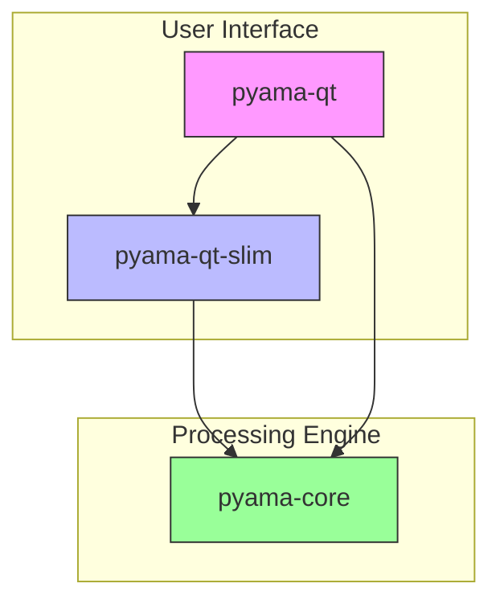
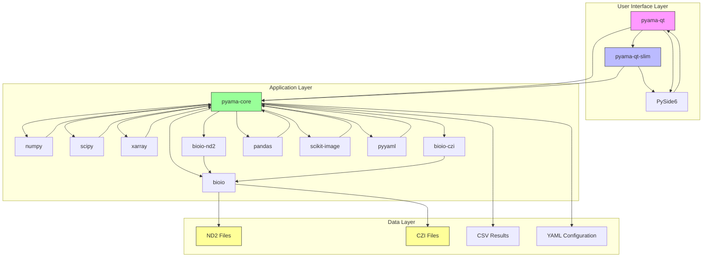

# Introduction

<cite>
**Referenced Files in This Document**   
- [README.md](file://README.md)
- [pyama-core/pyproject.toml](file://pyama-core/pyproject.toml)
- [pyama-qt/pyproject.toml](file://pyama-qt/pyproject.toml)
- [pyama-qt-slim/pyproject.toml](file://pyama-qt-slim/pyproject.toml)
- [CLAUDE.md](file://CLAUDE.md)
- [pyama-core/src/pyama_core/__init__.py](file://pyama-core/src/pyama_core/__init__.py)
- [pyama-qt/src/pyama_qt/main.py](file://pyama-qt/src/pyama_qt/main.py)
</cite>

## Table of Contents
1. [Project Overview](#project-overview)
2. [Modular Architecture](#modular-architecture)
3. [Key Use Cases in Life Sciences](#key-use-cases-in-life-sciences)
4. [Technology Stack and Dependencies](#technology-stack-and-dependencies)
5. [Architectural Patterns](#architectural-patterns)
6. [Core Concepts](#core-concepts)
7. [System Context and Component Relationships](#system-context-and-component-relationships)
8. [Getting Started](#getting-started)

## Project Overview

PyAMA is a Qt-based desktop application designed for advanced microscopy data analysis in life sciences research. The software provides a comprehensive solution for processing, analyzing, and visualizing complex biological imaging datasets, particularly those generated from time-lapse microscopy experiments. As a modular Python application, PyAMA enables researchers to streamline their workflow from raw image acquisition to quantitative analysis and visualization.

The application specializes in handling multi-dimensional microscopy data, with native support for ND2 (Nikon) and CZI (Zeiss) file formats through the bioio library. PyAMA is particularly valuable for studies involving cell dynamics, where researchers need to track cellular behavior over time, quantify fluorescence intensities, and analyze maturation processes in biological systems.

**Section sources**
- [README.md](file://README.md#L1-L38)
- [CLAUDE.md](file://CLAUDE.md#L0-L92)

## Modular Architecture

PyAMA follows a modular architecture consisting of three primary components that work together to provide a flexible and scalable analysis platform:

- **pyama-core**: The processing engine that contains all non-UI algorithms, data models, and utilities. This core library implements the fundamental image processing, analysis, and I/O functionality, serving as the computational backbone of the application.

- **pyama-qt**: A full-featured graphical user interface built with PySide6 that provides an interactive environment for microscopy data analysis. This component offers a tabbed interface with dedicated sections for processing, analysis, and visualization workflows.

- **pyama-qt-slim**: A lightweight GUI implementation that provides the essential user interface components without the business logic, allowing for easier integration and customization in specialized research environments.

This modular design enables researchers to use the full GUI application for interactive analysis or leverage the core library programmatically for batch processing and integration into larger analysis pipelines.

**Diagram sources**
- [README.md](file://README.md#L1-L38)
- [pyama-core/pyproject.toml](file://pyama-core/pyproject.toml#L0-L24)
- [pyama-qt/pyproject.toml](file://pyama-qt/pyproject.toml#L0-L26)

**Section sources**
- [README.md](file://README.md#L1-L38)
- [pyama-core/pyproject.toml](file://pyama-core/pyproject.toml#L0-L24)
- [pyama-qt/pyproject.toml](file://pyama-qt/pyproject.toml#L0-L26)
- [pyama-qt-slim/pyproject.toml](file://pyama-qt-slim/pyproject.toml#L0-L25)

## Key Use Cases in Life Sciences

PyAMA addresses several critical use cases in modern life sciences research:

- **Batch Processing of Microscopy Files**: The application supports efficient batch processing of large microscopy datasets in ND2 and CZI formats, enabling researchers to analyze multiple experiments systematically.

- **Cell Segmentation**: PyAMA implements a Laplacian of Gaussian with Standard Deviation (LOG-STD) approach for robust cell segmentation, accurately identifying individual cells within complex tissue samples.

- **Cell Tracking**: The tracking service enables researchers to follow individual cells across time points in time-lapse experiments, providing insights into cell migration, division, and lineage relationships.

- **Curve Fitting for Maturation Dynamics**: The analysis module includes specialized models for fitting curves to maturation dynamics, including maturation, maturation-blocked, and trivial models that help quantify biological processes over time.

- **Multi-Channel Analysis**: The software distinguishes between phase contrast (PC) and fluorescence (FL) channels, allowing for correlative analysis of structural and functional information in the same sample.

These capabilities make PyAMA particularly valuable for studies in cell biology, developmental biology, and pharmacology, where quantitative analysis of cellular dynamics is essential.

**Section sources**
- [CLAUDE.md](file://CLAUDE.md#L54-L82)
- [pyama-core/src/pyama_core/analysis/models](file://pyama-core/src/pyama_core/analysis/models)

## Technology Stack and Dependencies

PyAMA is built on a modern Python technology stack optimized for scientific computing and desktop application development:

- **PySide6**: The Qt Python bindings provide the foundation for the application's graphical user interface, enabling cross-platform compatibility and a responsive user experience.

- **bioio**: This library and its format-specific extensions (bioio-nd2, bioio-czi) handle the reading and processing of microscopy file formats, abstracting the complexities of different vendor-specific formats.

- **numpy**: The fundamental package for numerical computing in Python, used extensively for array operations and mathematical computations on image data.

- **scipy**: Provides scientific algorithms for optimization, integration, interpolation, and other mathematical operations required for image analysis.

- **xarray**: Used for handling multi-dimensional labeled arrays, which is particularly useful for representing time-series microscopy data with multiple channels and fields of view.

- **pandas**: Facilitates data manipulation and analysis, particularly for handling tabular data generated from feature extraction.

- **scikit-image**: Offers a comprehensive set of image processing algorithms for tasks such as filtering, morphology, and segmentation.

- **matplotlib**: Integrated for data visualization, enabling the creation of publication-quality plots and graphs.

This technology stack ensures that PyAMA can handle the computational demands of modern microscopy data while providing a user-friendly interface for researchers.

**Section sources**
- [pyama-core/pyproject.toml](file://pyama-core/pyproject.toml#L0-L24)
- [pyama-qt/pyproject.toml](file://pyama-qt/pyproject.toml#L0-L26)
- [pyama-qt-slim/README.md](file://pyama-qt-slim/README.md#L41-L47)

## Architectural Patterns

PyAMA employs several architectural patterns to ensure maintainability, scalability, and separation of concerns:

- **Model-View-Controller (MVC)**: The Qt-based GUI follows the MVC pattern, with clear separation between the user interface (View), business logic (Controller), and data models. This pattern is evident in the organization of the pyama-qt package, which includes separate modules for models, views (panels), and controllers.

- **Service-Oriented Workflow**: The core processing pipeline is organized as a series of services that operate on a shared processing context. Each service (CopyingService, SegmentationService, CorrectionService, TrackingService, ExtractionService) performs a specific task in the analysis workflow, allowing for modular development and easy extension.

- **Typed Data Structures**: The application uses TypedDict (ProcessingContext) as a central data structure that flows through the pipeline, ensuring type safety and clear documentation of the data being processed.

- **Event-Driven Architecture**: Progress reporting is implemented through callback functions that emit events, enabling real-time updates to the user interface during long-running processing tasks.

- **Threaded Execution**: Background processing is managed through a threading service that allows computationally intensive tasks to run without blocking the user interface, improving responsiveness.

These architectural patterns contribute to a robust and extensible codebase that can accommodate new analysis methods and adapt to evolving research requirements.

**Section sources**
- [CLAUDE.md](file://CLAUDE.md#L54-L82)
- [pyama-core/src/pyama_core/processing/workflow/services/base.py](file://pyama-core/src/pyama_core/processing/workflow/services/base.py#L0-L42)
- [pyama-qt/src/pyama_qt/services/__init__.py](file://pyama-qt/src/pyama_qt/services/__init__.py#L0-L4)

## Core Concepts

Understanding PyAMA requires familiarity with several key concepts that form the foundation of its data model and processing workflow:

- **Fields of View (FOVs)**: The fundamental unit of analysis in PyAMA, representing a specific region of the sample captured in the microscopy experiment. Processing occurs at the FOV level, with configurable batch sizes and worker counts to optimize performance.

- **Phase Contrast/Fluorescence Channels**: The software distinguishes between phase contrast (PC) channels, which provide structural information about cells, and fluorescence (FL) channels, which reveal specific molecular targets through fluorescent labeling. Channel indexing allows users to specify which channels to use for different analysis tasks.

- **Processing Pipelines**: A sequence of processing steps that transform raw microscopy data into quantitative results. The pipeline includes copying, segmentation, correction, tracking, and extraction services that operate in sequence on the input data.

- **Processing Context**: A central data structure (ProcessingContext) that contains all the information needed for the analysis workflow, including output directory paths, channel configurations, and processing parameters. This context flows through the pipeline, accumulating results at each step.

- **Feature Extraction**: The process of quantifying cellular properties such as intensity, area, and shape over time, resulting in time-series data that can be analyzed to understand cellular dynamics.

These concepts provide the framework for understanding how PyAMA transforms raw microscopy images into meaningful biological insights.

**Section sources**
- [CLAUDE.md](file://CLAUDE.md#L54-L82)
- [tests/test_workflow.py](file://tests/test_workflow.py#L38-L67)
- [pyama-core/src/pyama_core/processing/workflow/services/types.py](file://pyama-core/src/pyama_core/processing/workflow/services/types.py)

## System Context and Component Relationships

The following diagram illustrates the system context and component relationships in PyAMA, showing how the different modules interact to provide a complete microscopy analysis solution:

**Diagram sources**
- [README.md](file://README.md#L1-L38)
- [pyama-core/pyproject.toml](file://pyama-core/pyproject.toml#L0-L24)
- [pyama-qt/pyproject.toml](file://pyama-qt/pyproject.toml#L0-L26)
- [pyama-qt-slim/pyproject.toml](file://pyama-qt-slim/pyproject.toml#L0-L25)
- [CLAUDE.md](file://CLAUDE.md#L54-L82)

## Getting Started

To begin using PyAMA, users can install the application via pip or uv, with the recommended approach being uv for dependency management. The full-featured GUI can be launched using the `pyama-qt` command, which opens the main application window with tabs for processing, analysis, and visualization.

For developers and advanced users, the pyama-core library can be imported directly into Python scripts for programmatic access to the analysis functionality. The test workflow in `tests/test_workflow.py` provides a template for implementing custom analysis pipelines.

Documentation for PyAMA includes:
- Installation instructions in the README.md files
- User guide for interactive analysis workflows
- API reference for programmatic access to the core functionality
- Example notebooks demonstrating common use cases

The modular design allows users to start with the GUI for exploratory analysis and transition to programmatic usage for reproducible research workflows.

**Section sources**
- [README.md](file://README.md#L1-L38)
- [pyama-qt-slim/README.md](file://pyama-qt-slim/README.md#L21-L34)
- [CLAUDE.md](file://CLAUDE.md#L0-L92)
- [tests/test_workflow.py](file://tests/test_workflow.py#L0-L40)