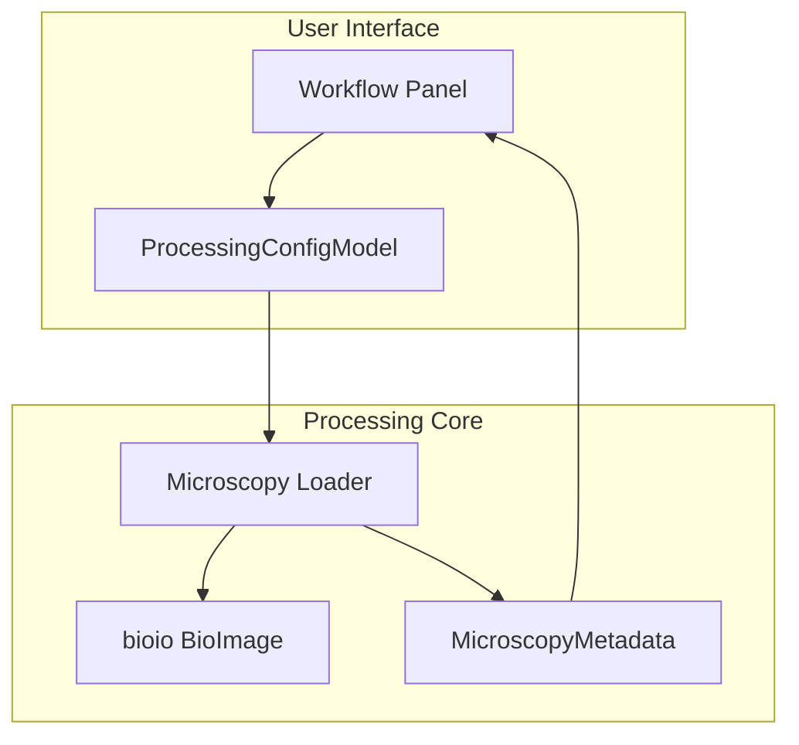
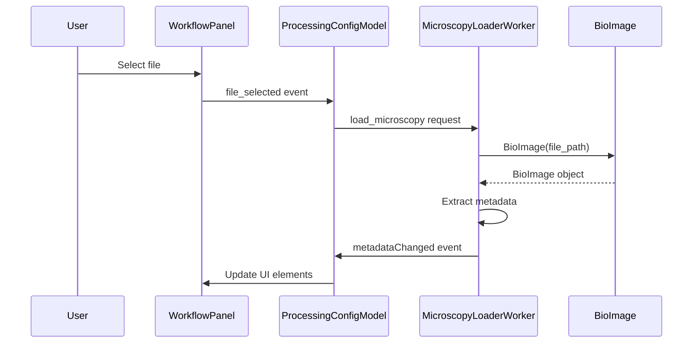
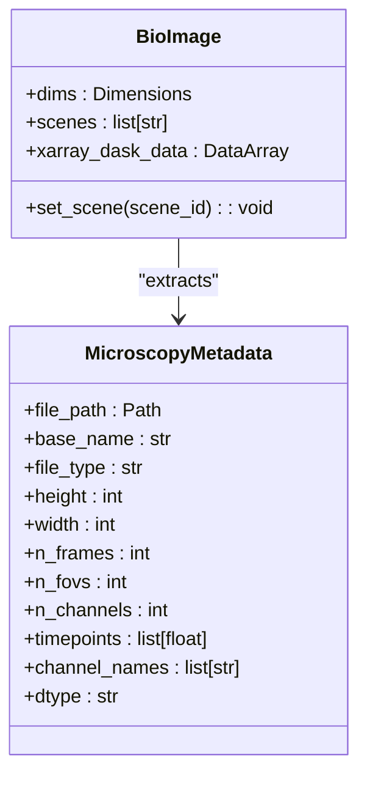
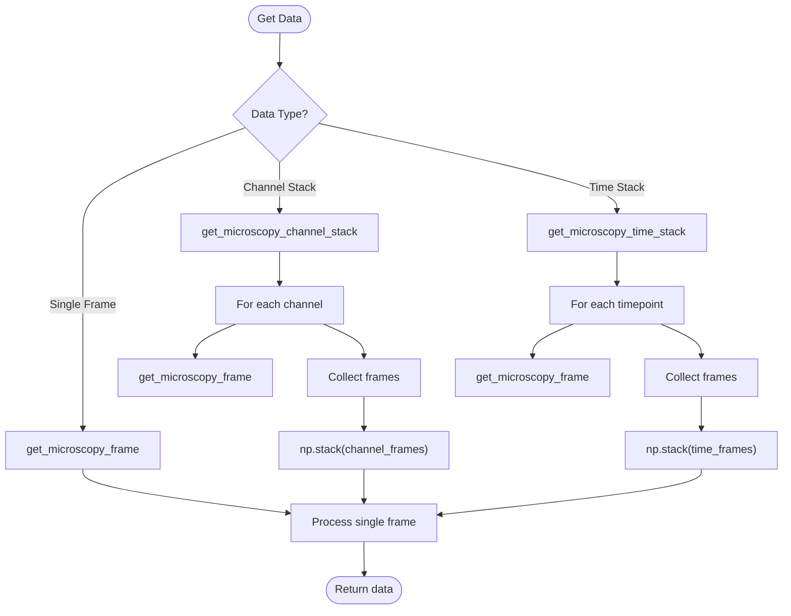
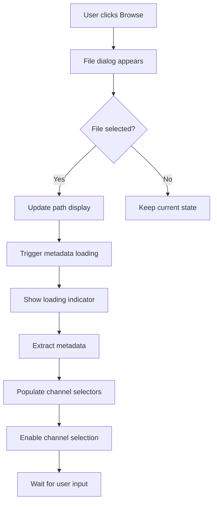

# Data Loading

<cite>
**Referenced Files in This Document**   
- [microscopy.py](file://pyama-core/src/pyama_core/io/microscopy.py)
- [nikon.py](file://pyama-core/src/pyama_core/io/nikon.py)
- [types.py](file://pyama-core/src/pyama_core/processing/workflow/services/types.py)
- [models.py](file://pyama-qt/src/pyama_qt/processing/models.py)
- [workflow_panel.py](file://pyama-qt/src/pyama_qt/processing/panels/workflow_panel.py)
- [controller.py](file://pyama-qt/src/pyama_qt/processing/controller.py)
</cite>

## Table of Contents
1. [Introduction](#introduction)
2. [Core Components](#core-components)
3. [Architecture Overview](#architecture-overview)
4. [Detailed Component Analysis](#detailed-component-analysis)
5. [User Interface Flow](#user-interface-flow)
6. [Data Loading and Preprocessing](#data-loading-and-preprocessing)
7. [Error Handling and Common Issues](#error-handling-and-common-issues)
8. [Performance Optimization](#performance-optimization)
9. [Conclusion](#conclusion)

## Introduction
The Data Loading sub-feature enables ingestion of microscopy data from ND2, CZI, and other bioimaging formats into the pyama processing pipeline. This system leverages the bioio library to provide unified access to multi-dimensional microscopy data while extracting essential metadata for downstream analysis. The loading process integrates tightly with the application's processing context and user interface to support configuration of channel selection and preprocessing parameters before pipeline execution.

**Section sources**
- [microscopy.py](file://pyama-core/src/pyama_core/io/microscopy.py#L1-L178)

## Core Components

The data loading functionality is built around several key components that handle file ingestion, metadata extraction, and data access. The core implementation resides in the `microscopy.py` module, which provides a unified interface for loading various bioimaging formats through the bioio library. The `MicroscopyMetadata` dataclass captures essential file information including dimensions, channel names, timepoints, and data types. Supporting functions enable efficient access to specific data subsets such as individual frames, channel stacks, or time series.

The `Channels` class in the processing context defines how phase contrast and fluorescence channels are configured for analysis. This configuration is critical for directing subsequent processing steps to the appropriate data channels. The integration between the core loading functionality and the Qt-based user interface ensures that metadata is properly propagated to the UI components for user interaction.

**Section sources**
- [microscopy.py](file://pyama-core/src/pyama_core/io/microscopy.py#L1-L178)
- [types.py](file://pyama-core/src/pyama_core/processing/workflow/services/types.py#L9-L11)
- [models.py](file://pyama-qt/src/pyama_qt/processing/models.py#L18-L20)

## Architecture Overview

The data loading architecture follows a layered pattern with clear separation between file I/O, data representation, and user interface concerns. The bioio library serves as the foundation for format-agnostic file access, providing consistent interfaces for ND2, CZI, and other supported formats. Above this layer, the microscopy module implements domain-specific functionality for metadata extraction and data access patterns.

**Diagram sources**
- [microscopy.py](file://pyama-core/src/pyama_core/io/microscopy.py#L1-L178)
- [models.py](file://pyama-qt/src/pyama_qt/processing/models.py#L31-L188)
- [workflow_panel.py](file://pyama-qt/src/pyama_qt/processing/panels/workflow_panel.py#L1-L200)

## Detailed Component Analysis

### Microscopy File Loading
The `load_microscopy_file` function provides a unified entry point for loading microscopy data regardless of format. It uses the bioio library to create a BioImage object that supports lazy loading through Dask-backed xarray DataArrays. This approach enables efficient access to large datasets without loading the entire file into memory.

**Diagram sources**
- [microscopy.py](file://pyama-core/src/pyama_core/io/microscopy.py#L27-L97)
- [models.py](file://pyama-qt/src/pyama_qt/processing/models.py#L31-L188)
- [workflow_panel.py](file://pyama-qt/src/pyama_qt/processing/panels/workflow_panel.py#L162-L196)

### Metadata Extraction
The `MicroscopyMetadata` class captures essential information about the loaded microscopy file, including spatial dimensions, temporal information, channel configuration, and data types. During loading, the system extracts this metadata by querying the BioImage object's dimensions and coordinate information. When available, channel names are extracted from the file's metadata; otherwise, default names (C0, C1, etc.) are generated. Timepoints are extracted from the T coordinate when present, with fallback to sequential numbering.

**Diagram sources**
- [microscopy.py](file://pyama-core/src/pyama_core/io/microscopy.py#L11-L24)
- [microscopy.py](file://pyama-core/src/pyama_core/io/microscopy.py#L27-L97)

### Data Access Patterns
The system provides several utility functions for accessing specific data subsets from the loaded microscopy file. The `get_microscopy_frame` function retrieves a single frame specified by FOV, channel, and time indices. For more complex access patterns, `get_microscopy_channel_stack` returns all channels for a specific FOV and timepoint, while `get_microscopy_time_stack` returns all timepoints for a specific FOV and channel. These functions process data sequentially to minimize memory usage, making them suitable for large datasets.

**Diagram sources**
- [microscopy.py](file://pyama-core/src/pyama_core/io/microscopy.py#L100-L177)

## User Interface Flow

The user interface for data loading is implemented in the `WorkflowPanel` component, which provides controls for file selection, channel configuration, and output directory specification. When the user clicks the "Browse" button for microscopy files, a file dialog appears with filters for supported formats (.nd2, .czi). Upon file selection, the system initiates asynchronous loading of metadata, which then populates the channel selection controls.

The channel configuration section includes a dropdown for selecting the phase contrast channel and a multi-select list for fluorescence channels. These UI elements are automatically populated with the channel names extracted from the file metadata. The phase contrast channel selector includes a "None" option, while the fluorescence list allows multiple selections to accommodate experiments with several fluorescent markers.

**Diagram sources**
- [workflow_panel.py](file://pyama-qt/src/pyama_qt/processing/panels/workflow_panel.py#L46-L196)
- [models.py](file://pyama-qt/src/pyama_qt/processing/models.py#L31-L188)

**Section sources**
- [workflow_panel.py](file://pyama-qt/src/pyama_qt/processing/panels/workflow_panel.py#L46-L196)
- [models.py](file://pyama-qt/src/pyama_qt/processing/models.py#L31-L188)

## Data Loading and Preprocessing

The data loading process begins with the user selecting a microscopy file through the UI. This triggers the `ProcessingConfigModel` to initiate metadata loading, which is handled by a background worker to prevent UI freezing. The `load_microscopy_file` function uses bioio to create a BioImage object, which provides a consistent interface across different file formats.

Once loaded, the metadata is used to configure the processing context, particularly the `Channels` object which specifies which channels contain phase contrast and fluorescence data. This configuration is essential for directing subsequent processing steps to the correct data channels. Before pipeline execution, the raw data may undergo preprocessing such as normalization or background subtraction, though these operations occur after the initial loading phase.

The system supports lazy loading through Dask-backed arrays, meaning that pixel data is only loaded into memory when specifically requested for processing or visualization. This approach enables efficient handling of large datasets that might not fit entirely in RAM.

**Section sources**
- [microscopy.py](file://pyama-core/src/pyama_core/io/microscopy.py#L27-L97)
- [types.py](file://pyama-core/src/pyama_core/processing/workflow/services/types.py#L25-L30)
- [controller.py](file://pyama-qt/src/pyama_qt/processing/controller.py#L356-L388)

## Error Handling and Common Issues

The data loading system includes comprehensive error handling for common issues encountered with microscopy files. Unsupported file formats are rejected by the file dialog filters, but if an unsupported format is selected, the loading function raises a `RuntimeError` with descriptive messaging. Corrupted files or files with incompatible structures trigger similar exceptions during the BioImage creation phase.

Memory limitations are addressed through the use of Dask-backed arrays and sequential processing of data subsets. When loading extremely large datasets, users may still encounter memory issues, in which case the system recommends processing smaller subsets or using machines with more RAM. The background worker pattern prevents UI freezing during long loading operations, and appropriate status messages are displayed to inform users of progress or errors.

Common issues include:
- **Unsupported formats**: Ensure files are in ND2 or CZI format
- **Corrupted files**: Verify file integrity and re-acquire if necessary
- **Memory limitations**: Process smaller FOVs or time ranges
- **Missing metadata**: Files without proper channel naming may use default names

**Section sources**
- [microscopy.py](file://pyama-core/src/pyama_core/io/microscopy.py#L27-L97)
- [controller.py](file://pyama-qt/src/pyama_qt/processing/controller.py#L356-L388)
- [models.py](file://pyama-qt/src/pyama_qt/processing/models.py#L80-L122)

## Performance Optimization

To optimize data access speed and memory usage during loading, the system employs several strategies. The primary optimization is the use of Dask-backed xarray DataArrays, which enable lazy loading and chunked processing of large datasets. This means that data is only loaded into memory when explicitly requested, significantly reducing initial memory footprint.

For data access, the system processes frames sequentially rather than loading entire datasets at once. The `get_microscopy_channel_stack` and `get_microscopy_time_stack` functions process one frame at a time and stack them, which trades off some speed for much lower memory usage. When performance is critical and sufficient memory is available, users can modify these functions to load multiple frames in parallel.

Additional performance tips include:
- **Use SSD storage**: Faster I/O significantly improves data access speed
- **Process smaller FOV ranges**: Limit processing to relevant regions
- **Reduce batch size**: Smaller batches use less memory during processing
- **Close other applications**: Free up memory for large dataset processing
- **Use 64-bit Python**: Enables access to more than 4GB of RAM

The bioio library's format-specific optimizations also contribute to performance, with native readers for ND2 and CZI formats providing efficient access to pixel data and metadata.

**Section sources**
- [microscopy.py](file://pyama-core/src/pyama_core/io/microscopy.py#L100-L177)
- [microscopy.py](file://pyama-core/src/pyama_core/io/microscopy.py#L27-L97)

## Conclusion

The data loading sub-feature provides a robust foundation for ingesting microscopy data from ND2, CZI, and other bioimaging formats into the pyama analysis pipeline. By leveraging the bioio library, the system achieves format-agnostic file access while maintaining consistent interfaces for metadata extraction and data retrieval. The integration between the core loading functionality and the Qt-based user interface enables intuitive configuration of channel selection and processing parameters.

The architecture emphasizes memory efficiency through lazy loading and sequential processing, making it suitable for large microscopy datasets. Comprehensive error handling addresses common issues such as unsupported formats and corrupted files, while performance optimizations ensure efficient data access. The clear separation between file I/O, metadata management, and user interface concerns creates a maintainable and extensible foundation for future format support and processing enhancements.