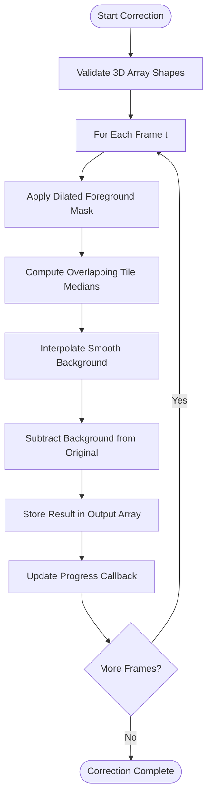
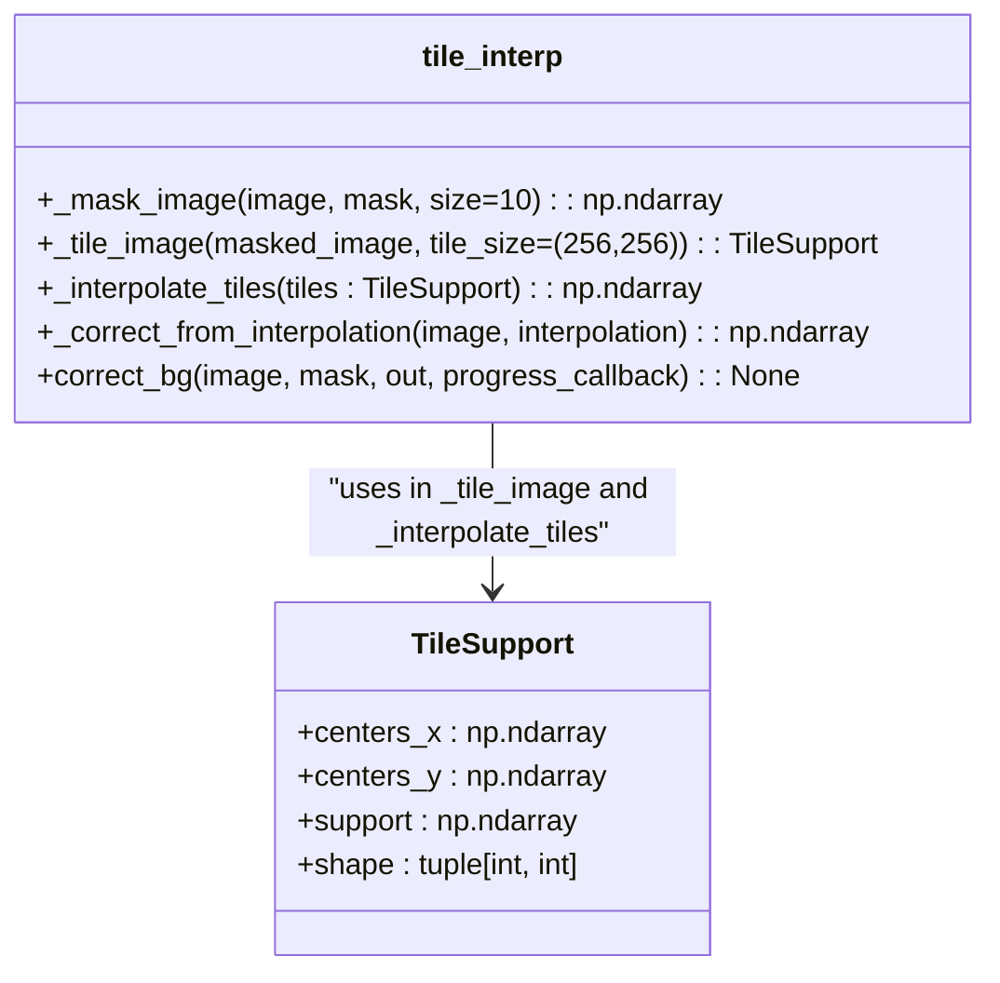
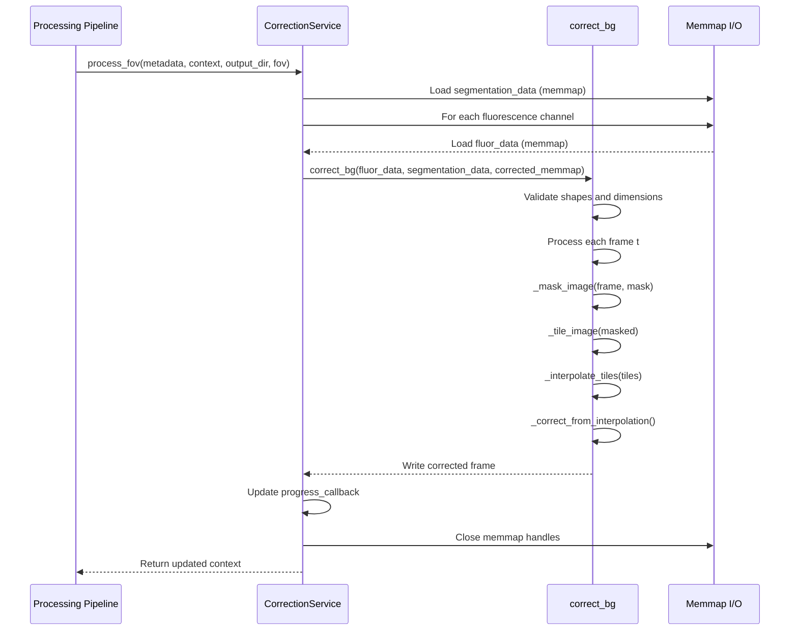

# Background Correction

<cite>
**Referenced Files in This Document**   
- [tile_interp.py](file://pyama-core/src/pyama_core/processing/background/tile_interp.py)
- [correction.py](file://pyama-core/src/pyama_core/processing/workflow/services/steps/correction.py)
- [__init__.py](file://pyama-core/src/pyama_core/processing/background/__init__.py)
</cite>

## Table of Contents
1. [Introduction](#introduction)
2. [Background Correction Algorithm](#background-correction-algorithm)
3. [Tile-Based Interpolation Process](#tile-based-interpolation-process)
4. [Key Parameters and Configuration](#key-parameters-and-configuration)
5. [Integration with Processing Pipeline](#integration-with-processing-pipeline)
6. [Performance Considerations](#performance-considerations)
7. [Troubleshooting Guide](#troubleshooting-guide)
8. [Conclusion](#conclusion)

## Introduction
The Background Correction sub-feature is designed to remove illumination artifacts from microscopy images by estimating and subtracting spatially varying background intensity. This correction is essential for accurate quantitative analysis of fluorescence signals, particularly in long-term time-lapse imaging where uneven illumination can significantly impact results. The implementation uses a tile-based interpolation algorithm that operates on 3D image stacks frame-by-frame, leveraging segmentation masks to distinguish foreground from background regions.

**Section sources**
- [tile_interp.py](file://pyama-core/src/pyama_core/processing/background/tile_interp.py#L1-L43)
- [correction.py](file://pyama-core/src/pyama_core/processing/workflow/services/steps/correction.py#L1-L10)

## Background Correction Algorithm
The background correction algorithm follows a four-step process for each frame in a 3D image stack: foreground masking, tile-based median computation, background interpolation, and subtraction. The core function `correct_bg` orchestrates this workflow, processing temporal image sequences while maintaining memory efficiency through memmap arrays. The algorithm assumes that background intensity can be reliably estimated from pixels outside segmented cellular regions, which are masked as foreground.

The correction process preserves the original image dimensions and data type while outputting float32 precision results to accommodate potential negative values after background subtraction. Input validation ensures all arrays (image, mask, output) have identical 3D shapes with consistent temporal, height, and width dimensions.

**Diagram sources**
- [tile_interp.py](file://pyama-core/src/pyama_core/processing/background/tile_interp.py#L152-L192)

**Section sources**
- [tile_interp.py](file://pyama-core/src/pyama_core/processing/background/tile_interp.py#L152-L192)

## Tile-Based Interpolation Process
The tile-based interpolation algorithm divides each image frame into overlapping tiles to estimate local background intensity. The process begins with foreground masking using morphological dilation via a maximum filter with a default window size of 21 pixels (controlled by the `size` parameter in `_mask_image`). This dilation ensures cellular boundaries are fully excluded from background estimation.

Tiles are generated with approximately 50% overlap in both dimensions, creating a dense sampling of background regions. The tile size defaults to 256×256 pixels but adapts based on image dimensions to ensure at least 2×2 tile coverage. For each tile, the median intensity of unmasked pixels is computed, providing robustness against outliers. NaN values resulting from fully masked tiles are replaced with the global median of all background pixels.

Background interpolation uses `RectBivariateSpline` from SciPy to create a smooth 2D surface from the tile medians. The spline interpolation operates on the transposed support matrix to align coordinate systems, producing a continuous background estimate that is subtracted from the original frame. This approach effectively removes low-frequency illumination artifacts while preserving high-frequency biological signal.

**Diagram sources**
- [tile_interp.py](file://pyama-core/src/pyama_core/processing/background/tile_interp.py#L20-L33)
- [tile_interp.py](file://pyama-core/src/pyama_core/processing/background/tile_interp.py#L45-L192)

**Section sources**
- [tile_interp.py](file://pyama-core/src/pyama_core/processing/background/tile_interp.py#L45-L192)

## Key Parameters and Configuration
The background correction system exposes several parameters that control its behavior, though they are currently hard-coded in the implementation. The primary parameters include:

- **Tile Size**: Set to (256, 256) pixels by default in `_tile_image`, this determines the spatial resolution of background estimation. Larger tiles capture broader illumination gradients but may miss local variations.
- **Mask Dilation Size**: Configured as 10 in `_mask_image`, this controls the half-size of the maximum filter window (resulting in 21×21 pixel dilation) to expand segmented regions and prevent foreground contamination.
- **Interpolation Method**: Uses `RectBivariateSpline` for smooth surface fitting, providing continuous derivatives across tile boundaries.
- **Correction Mode**: Operates in subtractive mode only, where the interpolated background is directly subtracted from the original image.

These parameters are not currently exposed through external configuration but are central to the algorithm's performance. The tile size adapts automatically for small images to maintain adequate coverage, ensuring robustness across different microscopy formats.

**Section sources**
- [tile_interp.py](file://pyama-core/src/pyama_core/processing/background/tile_interp.py#L77-L113)
- [tile_interp.py](file://pyama-core/src/pyama_core/processing/background/tile_interp.py#L107-L156)

## Integration with Processing Pipeline
The background correction service integrates into the main processing pipeline through the `CorrectionService` class, which implements the `BaseProcessingService` interface. The service processes each field of view (FOV) independently, loading raw fluorescence data and corresponding segmentation masks from memmap files to handle large datasets efficiently.

The integration follows a structured workflow: for each FOV, the service loads segmentation data once and processes all fluorescence channels sequentially. Output files are named systematically using the base name, FOV index, and channel number, with results stored in `.npy` format. The service checks for existing corrected files to avoid redundant processing and updates the context with output paths for downstream steps.

Progress reporting is integrated through a callback mechanism that reports frame-level progress to the pipeline's monitoring system. Error handling includes validation of array dimensions and proper cleanup of memmap resources in case of interruption.

**Diagram sources**
- [correction.py](file://pyama-core/src/pyama_core/processing/workflow/services/steps/correction.py#L30-L146)
- [tile_interp.py](file://pyama-core/src/pyama_core/processing/background/tile_interp.py#L152-L192)

**Section sources**
- [correction.py](file://pyama-core/src/pyama_core/processing/workflow/services/steps/correction.py#L30-L146)

## Performance Considerations
The background correction implementation prioritizes memory efficiency when processing large microscopy datasets. By using memmap arrays for both input and output, the system can handle image stacks that exceed available RAM, accessing data through memory-mapped files. This approach allows processing of multi-gigabyte datasets without loading entire volumes into memory.

Each frame is processed independently, enabling potential parallelization across temporal frames or spatial tiles. The current implementation processes frames sequentially but could be optimized for multi-threading, particularly for the independent tile median computations. The 50% tile overlap ensures smooth transitions in the interpolated background while maintaining computational efficiency through vectorized NumPy operations.

Memory usage scales with image dimensions rather than temporal length, as only one frame is held in memory at a time during processing. The intermediate `TileSupport` structure has minimal memory footprint relative to the full image, storing only tile centers and medians. For very large images, the number of tiles increases quadratically, but the current adaptive tiling strategy helps maintain reasonable computational complexity.

**Section sources**
- [correction.py](file://pyama-core/src/pyama_core/processing/workflow/services/steps/correction.py#L85-L95)
- [tile_interp.py](file://pyama-core/src/pyama_core/processing/background/tile_interp.py#L77-L113)

## Troubleshooting Guide
Common issues in background correction and their solutions include:

- **Over-correction**: Occurs when foreground regions are insufficiently masked, causing biological signal to be interpreted as background. Ensure segmentation masks are comprehensive and consider increasing the mask dilation size parameter.
- **Edge Artifacts**: May appear when tiles near image boundaries have insufficient data. The current implementation handles this through global median fallback for NaN tiles, but extreme edge gradients may require boundary-specific processing.
- **Non-uniform Illumination Patterns**: The tile-based interpolation assumes smoothly varying illumination. For highly structured illumination (e.g., grid patterns), consider preprocessing or alternative correction methods.
- **Memory Errors**: While memmap usage prevents most memory issues, ensure sufficient disk space for temporary files and verify file permissions for the output directory.
- **Shape Mismatch Errors**: Validate that fluorescence and segmentation data have identical dimensions before correction. The system checks for shape consistency and will raise ValueError if dimensions don't match.

For debugging, the progress callback provides frame-level monitoring, and intermediate results can be inspected by examining individual output frames. The modular design allows testing of each processing step independently.

**Section sources**
- [tile_interp.py](file://pyama-core/src/pyama_core/processing/background/tile_interp.py#L152-L192)
- [correction.py](file://pyama-core/src/pyama_core/processing/workflow/services/steps/correction.py#L100-L130)

## Conclusion
The background correction system provides robust removal of illumination artifacts from microscopy images through a tile-based interpolation approach. By leveraging segmentation masks to identify foreground regions and computing local background estimates from overlapping tiles, the algorithm effectively separates biological signal from technical artifacts. The integration with the processing pipeline through memory-mapped files enables efficient handling of large datasets, while the modular design facilitates maintenance and potential enhancements. Future improvements could include configurable parameters, alternative interpolation methods, and support for multiplicative correction modes.