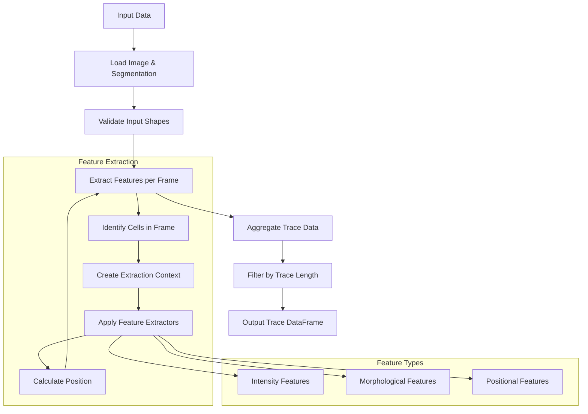
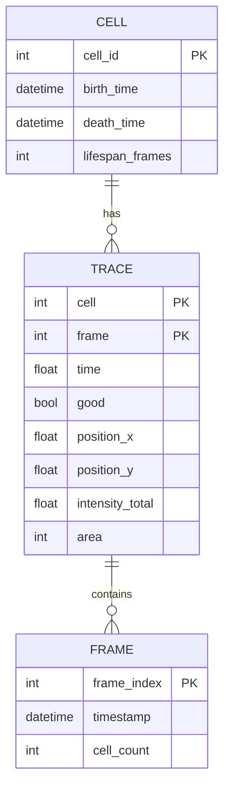
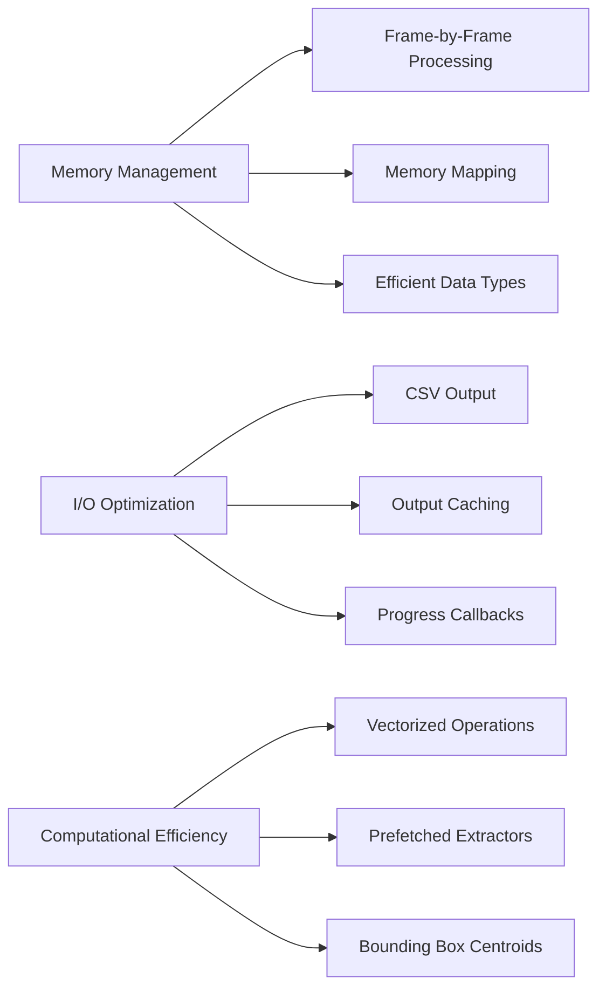

# Feature Extraction

<cite>
**Referenced Files in This Document**   
- [feature.py](file://pyama-core/src/pyama_core/processing/extraction/feature.py)
- [trace.py](file://pyama-core/src/pyama_core/processing/extraction/trace.py)
- [extraction.py](file://pyama-core/src/pyama_core/processing/workflow/services/steps/extraction.py)
</cite>

## Table of Contents
1. [Introduction](#introduction)
2. [Core Components](#core-components)
3. [Feature Extraction Pipeline](#feature-extraction-pipeline)
4. [Trace Data Organization](#trace-data-organization)
5. [Performance Considerations](#performance-considerations)
6. [Troubleshooting Guide](#troubleshooting-guide)

## Introduction
This document details the feature extraction sub-feature responsible for quantifying cellular properties over time in the pyama microscopy analysis system. The system extracts intensity-based features from fluorescence channels and morphological features from segmentation masks, organizing the results into trace files for downstream analysis. The implementation focuses on time-series analysis of cell behavior, with robust handling of temporal alignment, data filtering, and I/O operations.

## Core Components

The feature extraction system consists of three main components that work together to process microscopy data and generate time-series traces of cellular properties. The system is designed to handle large 3D image stacks efficiently while maintaining accuracy in feature quantification.

**Section sources**
- [feature.py](file://pyama-core/src/pyama_core/processing/extraction/feature.py#L1-L59)
- [trace.py](file://pyama-core/src/pyama_core/processing/extraction/trace.py#L1-L236)
- [extraction.py](file://pyama-core/src/pyama_core/processing/workflow/services/steps/extraction.py#L1-L133)

## Feature Extraction Pipeline

The feature extraction pipeline processes fluorescence image stacks and labeled segmentation masks to extract quantitative measurements of cellular properties over time. The pipeline consists of several stages that transform raw imaging data into structured time-series traces.

**Diagram sources**
- [trace.py](file://pyama-core/src/pyama_core/processing/extraction/trace.py#L70-L117)
- [feature.py](file://pyama-core/src/pyama_core/processing/extraction/feature.py#L17-L43)

The pipeline begins with the `extract_trace` function, which serves as the main entry point for the feature extraction process. This function validates input dimensions, ensures proper data typing, and orchestrates the extraction workflow. The core of the pipeline is the `_extract_all` function, which processes each frame of the time-series data sequentially to manage memory usage effectively.

Feature extraction is controlled through a registry pattern implemented in the `FEATURE_EXTRACTORS` dictionary. Currently supported features include:
- **intensity_total**: Total fluorescence intensity within a cell's mask
- **area**: Cell area measured in pixels

The system uses an `ExtractionContext` dataclass to encapsulate the image data and segmentation mask for each cell, providing a consistent interface for feature extraction functions. Each feature extractor receives this context and returns a scalar value representing the computed feature.

Temporal alignment is handled by the `times` parameter, which provides the time coordinate for each frame. The system prefers real acquisition times from metadata when available, converting millisecond timestamps to minutes. When precise timing information is unavailable, the system falls back to using frame indices as time values, assuming one frame per minute.

**Section sources**
- [trace.py](file://pyama-core/src/pyama_core/processing/extraction/trace.py#L188-L235)
- [feature.py](file://pyama-core/src/pyama_core/processing/extraction/feature.py#L47-L58)

## Trace Data Organization

Extracted features are organized into a structured DataFrame format that facilitates downstream analysis. The trace data structure is designed to be both human-readable and machine-processable, with a flat schema that avoids complex hierarchical indexing.

**Diagram sources**
- [trace.py](file://pyama-core/src/pyama_core/processing/extraction/trace.py#L30-L41)
- [trace.py](file://pyama-core/src/pyama_core/processing/extraction/trace.py#L120-L169)

The resulting DataFrame contains one row per (cell, time) observation with the following columns:
- **cell**: Unique identifier for each tracked cell
- **frame**: Frame index in the time series
- **time**: Time coordinate in minutes
- **good**: Quality flag (currently always True)
- **position_x, position_y**: Centroid coordinates based on bounding box center
- **Feature columns**: One column per extracted feature (e.g., intensity_total, area)

The trace files are saved in CSV format with the naming convention `{base_name}_fov_{fov:03d}_traces_ch_{ch}.csv`, where `ch` represents the fluorescence channel index. An additional `fov` column is prepended to the DataFrame to identify the field of view, enabling aggregation across multiple FOVs in downstream analysis.

A filtering step removes short traces by applying a minimum length threshold (default: 30 frames). This ensures that only cells observed for a sufficient duration are included in the output, improving the quality of subsequent analysis. The filtering is implemented efficiently using pandas groupby operations to count frames per cell before filtering.

**Section sources**
- [trace.py](file://pyama-core/src/pyama_core/processing/extraction/trace.py#L172-L185)
- [extraction.py](file://pyama-core/src/pyama_core/processing/workflow/services/steps/extraction.py#L30-L132)

## Performance Considerations

The feature extraction system incorporates several optimizations to handle large microscopy datasets efficiently while managing memory and I/O constraints.

**Diagram sources**
- [trace.py](file://pyama-core/src/pyama_core/processing/extraction/trace.py#L120-L169)
- [extraction.py](file://pyama-core/src/pyama_core/processing/workflow/services/steps/extraction.py#L30-L132)

**Memory Usage**: The system processes image stacks frame-by-frame rather than loading entire 3D volumes into memory. This approach enables analysis of large time-series datasets that would otherwise exceed available RAM. The implementation uses memory mapping (`open_memmap`) to access large numpy array files without loading them entirely into memory. Data types are optimized by converting inputs to appropriate types (float32 for images, uint16 for labels) with copy=False to avoid unnecessary duplication.

**I/O Bottlenecks**: Trace files can become large when analyzing many cells over extended time periods. The system addresses this by writing CSV files directly from the DataFrame without intermediate structures. The float_format parameter is set to "%.6f" to control precision and file size. An output caching mechanism skips processing for channels where trace files already exist, preventing redundant computation and I/O operations.

**Computational Efficiency**: The pipeline prefetches feature extractors at the frame level to avoid repeated dictionary lookups. Position calculation uses a fast bounding-box approximation rather than computing the exact centroid, significantly improving performance for large cells. The column ordering strategy minimizes peak memory during DataFrame construction by extending lists in the requested order.

**Section sources**
- [trace.py](file://pyama-core/src/pyama_core/processing/extraction/trace.py#L120-L169)
- [extraction.py](file://pyama-core/src/pyama_core/processing/workflow/services/steps/extraction.py#L30-L132)

## Troubleshooting Guide

This section provides guidance for diagnosing and resolving common issues that may occur during feature extraction.

**Section sources**
- [trace.py](file://pyama-core/src/pyama_core/processing/extraction/trace.py#L188-L235)
- [extraction.py](file://pyama-core/src/pyama_core/processing/workflow/services/steps/extraction.py#L30-L132)

### Extraction Failures
Common causes of extraction failures and their solutions:

| Issue | Cause | Solution |
|------|-------|----------|
| ValueError: image and seg_labeled must be 3D arrays | Input data has incorrect dimensionality | Verify that both fluorescence and segmentation inputs are 3D (T, H, W) arrays |
| FileNotFoundError: Tracked segmentation data not found | Segmentation file missing or path incorrect | Check that segmentation processing completed successfully and files exist |
| Shape mismatch between image and segmentation | Different spatial dimensions or frame counts | Ensure both inputs have identical shapes before extraction |
| Empty trace files | No cells detected in segmentation | Verify segmentation quality and thresholding parameters |

### Missing Data and Channel Alignment
Issues related to missing data and channel misalignment:

- **Missing fluorescence channels**: The system checks for both corrected and raw fluorescence data, preferring corrected data when available. If no fluorescence data is found for a channel, that channel is skipped with a log message.
- **Channel misalignment**: The current implementation assumes perfect spatial and temporal alignment between fluorescence channels and segmentation masks. Users must ensure proper registration during preprocessing.
- **Timepoint misalignment**: When metadata timepoints are available, they are used for temporal alignment. Otherwise, frame indices are used as time values. Inconsistent frame rates or missing frames should be addressed in preprocessing.

### Data Type Conversion Issues
The system performs automatic data type conversion to ensure compatibility:
- Images are converted to float32 for intensity calculations
- Segmentation masks are converted to uint16 to accommodate cell IDs
- Time arrays are converted to float for consistent temporal representation

If type conversion fails, verify that input data contains valid numerical values and does not include NaN or infinite values that could propagate through calculations.