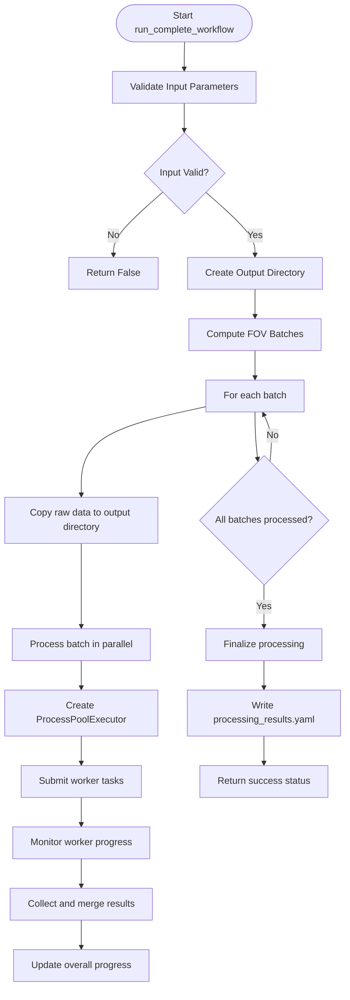
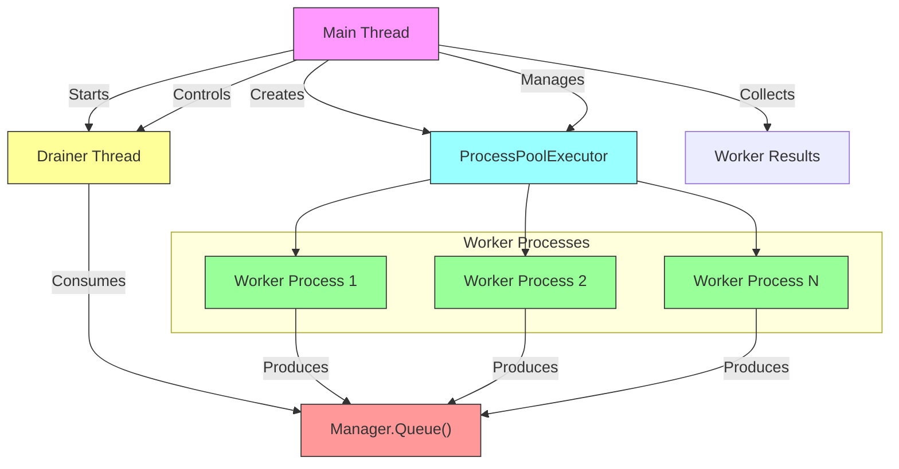
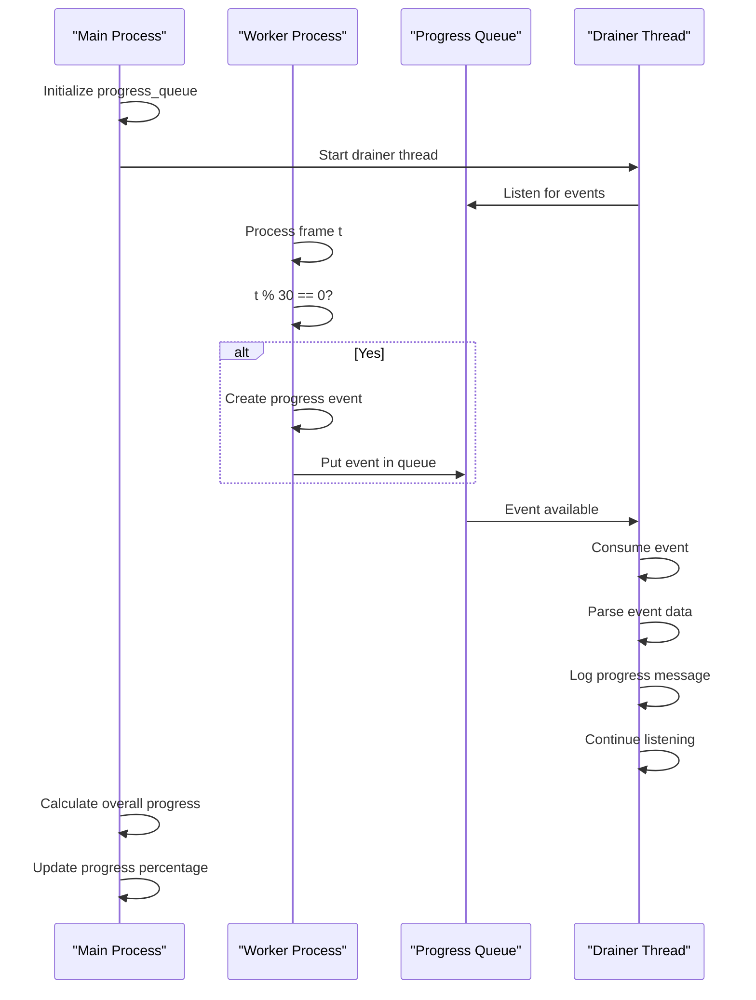
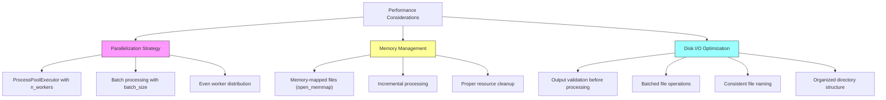

# Pipeline Execution

<cite>
**Referenced Files in This Document**   
- [pipeline.py](file://pyama-core/src/pyama_core/processing/workflow/pipeline.py)
- [copying.py](file://pyama-core/src/pyama_core/processing/workflow/services/copying.py)
- [segmentation.py](file://pyama-core/src/pyama_core/processing/workflow/services/steps/segmentation.py)
- [correction.py](file://pyama-core/src/pyama_core/processing/workflow/services/steps/correction.py)
- [tracking.py](file://pyama-core/src/pyama_core/processing/workflow/services/steps/tracking.py)
- [extraction.py](file://pyama-core/src/pyama_core/processing/workflow/services/steps/extraction.py)
- [base.py](file://pyama-core/src/pyama_core/processing/workflow/services/base.py)
- [types.py](file://pyama-core/src/pyama_core/processing/workflow/services/types.py)
- [microscopy.py](file://pyama-core/src/pyama_core/io/microscopy.py)
</cite>

## Table of Contents
1. [Pipeline Execution Overview](#pipeline-execution-overview)
2. [Execution Sequence](#execution-sequence)
3. [Background Workers and Threading](#background-workers-and-threading)
4. [Progress Tracking and Status Updates](#progress-tracking-and-status-updates)
5. [Exception Handling and Logging](#exception-handling-and-logging)
6. [Performance Considerations](#performance-considerations)
7. [Troubleshooting Pipeline Failures](#troubleshooting-pipeline-failures)

## Pipeline Execution Overview

The pipeline execution system orchestrates a multi-step processing workflow for microscopy data, designed to handle large datasets efficiently while maintaining UI responsiveness. The core function `run_complete_workflow` coordinates the entire process, managing data flow between processing stages and ensuring proper error handling and context persistence.

The pipeline processes Fields of View (FOVs) through a defined sequence of operations: copying raw data, segmentation, background correction, cell tracking, and trace extraction. The system is designed to handle partial execution recovery and provides comprehensive progress tracking throughout the processing lifecycle.

**Section sources**
- [pipeline.py](file://pyama-core/src/pyama_core/processing/workflow/pipeline.py#L279-L478)
- [types.py](file://pyama-core/src/pyama_core/processing/workflow/services/types.py#L25-L30)
- [microscopy.py](file://pyama-core/src/pyama_core/io/microscopy.py#L11-L24)

## Execution Sequence

The pipeline execution follows a strict sequence of processing steps, each implemented as a specialized service class that inherits from `BaseProcessingService`. The execution flow begins with the `run_complete_workflow` function, which coordinates the entire processing pipeline.

The execution sequence consists of the following steps:
1. **Copying**: Raw microscopy data is copied from the source file to the output directory in a standardized format
2. **Segmentation**: Phase contrast images are processed to identify cell regions using log-STD thresholding
3. **Correction**: Fluorescence channels undergo background correction using tiled interpolation
4. **Tracking**: Cells are tracked across frames using IoU-based Hungarian assignment
5. **Extraction**: Fluorescence traces are extracted for each tracked cell

Each processing step is implemented as a service class (`CopyingService`, `SegmentationService`, `CorrectionService`, `TrackingService`, `ExtractionService`) that follows the template method pattern. The `process_all_fovs` method in the base class handles range validation and iteration, while the `process_fov` method is implemented by each service to perform the specific processing logic.

The execution sequence is orchestrated by the `run_single_worker` function, which processes a contiguous range of FOVs through all pipeline steps in the defined order. Each step is executed only if the previous step completed successfully, ensuring data dependency integrity.

**Diagram sources**
- [pipeline.py](file://pyama-core/src/pyama_core/processing/workflow/pipeline.py#L279-L478)
- [base.py](file://pyama-core/src/pyama_core/processing/workflow/services/base.py#L55-L83)

**Section sources**
- [pipeline.py](file://pyama-core/src/pyama_core/processing/workflow/pipeline.py#L279-L478)
- [base.py](file://pyama-core/src/pyama_core/processing/workflow/services/base.py#L55-L83)
- [copying.py](file://pyama-core/src/pyama_core/processing/workflow/services/copying.py#L28-L98)
- [segmentation.py](file://pyama-core/src/pyama_core/processing/workflow/services/steps/segmentation.py#L25-L124)
- [correction.py](file://pyama-core/src/pyama_core/processing/workflow/services/steps/correction.py#L25-L146)
- [tracking.py](file://pyama-core/src/pyama_core/processing/workflow/services/steps/tracking.py#L25-L125)
- [extraction.py](file://pyama-core/src/pyama_core/processing/workflow/services/steps/extraction.py#L25-L132)

## Background Workers and Threading

The pipeline employs a sophisticated multiprocessing architecture to ensure UI responsiveness during long-running operations. The system uses a combination of process pools and threading to manage concurrent execution while maintaining efficient resource utilization.

The main execution thread creates a `ProcessPoolExecutor` with a configurable number of workers (`n_workers` parameter). Each worker process handles a contiguous range of FOVs, allowing for true parallel execution across multiple CPU cores. The worker distribution is calculated using the `_split_worker_ranges` function, which evenly divides FOV indices among available workers while handling remainder distribution.

To maintain UI responsiveness, a lightweight drainer thread monitors progress from worker processes. This thread runs in the background, consuming progress events from a shared `progress_queue` and logging them without blocking the main execution flow. The drainer thread is implemented as a daemon thread with a stop event for clean shutdown.

The threading model follows a producer-consumer pattern:
- **Producer**: Worker processes generate progress events
- **Consumer**: Drainer thread consumes and logs progress events
- **Coordinator**: Main thread manages the process pool and collects results

This architecture ensures that the UI remains responsive even during intensive processing, as the heavy computational work is offloaded to separate processes while progress updates are handled by a lightweight thread.

**Diagram sources**
- [pipeline.py](file://pyama-core/src/pyama_core/processing/workflow/pipeline.py#L279-L478)
- [pipeline.py](file://pyama-core/src/pyama_core/processing/workflow/pipeline.py#L46-L68)

**Section sources**
- [pipeline.py](file://pyama-core/src/pyama_core/processing/workflow/pipeline.py#L279-L478)
- [base.py](file://pyama-core/src/pyama_core/processing/workflow/services/base.py#L22-L27)

## Progress Tracking and Status Updates

The pipeline implements a comprehensive progress tracking system that provides real-time status updates throughout the execution process. Progress is reported at multiple levels: batch level, worker level, and individual processing step level.

The progress tracking system uses a shared `progress_queue` managed by a multiprocessing manager to allow worker processes to report their status back to the main process. Each processing service implements a `progress_callback` method that generates progress events at regular intervals (every 30 frames by default).

Progress events are structured dictionaries containing the following information:
- **step**: Current processing step name
- **fov**: Field of View being processed
- **t**: Current frame index
- **T**: Total number of frames
- **message**: Descriptive message of current operation

The drainer thread consumes these events and logs them to provide real-time feedback on processing status. The main thread also calculates overall progress as a percentage based on completed FOVs, providing a high-level progress indicator.

The system implements several optimization features for progress tracking:
- **Throttling**: Progress updates are throttled to every 30 frames to prevent excessive logging
- **Error resilience**: Malformed events are handled gracefully without crashing the tracking system
- **Context preservation**: Worker contexts are periodically reported to enable debugging

This multi-level progress tracking system ensures that users receive timely feedback on processing status while maintaining system performance.

**Diagram sources**
- [pipeline.py](file://pyama-core/src/pyama_core/processing/workflow/pipeline.py#L279-L478)
- [base.py](file://pyama-core/src/pyama_core/processing/workflow/services/base.py#L29-L44)

**Section sources**
- [pipeline.py](file://pyama-core/src/pyama_core/processing/workflow/pipeline.py#L279-L478)
- [base.py](file://pyama-core/src/pyama_core/processing/workflow/services/base.py#L29-L44)

## Exception Handling and Logging

The pipeline implements a robust exception handling and logging system designed to ensure graceful failure and comprehensive error reporting. The system follows a defensive programming approach with multiple layers of error handling at different levels of the execution stack.

At the highest level, the `run_complete_workflow` function is wrapped in a try-except block that catches all exceptions and logs them with full traceback information using `logger.exception()`. This ensures that any unhandled errors are properly recorded and do not crash the entire application.

Each processing step implements specific exception handling:
- **CopyingService**: Handles file I/O exceptions and validates channel selection
- **SegmentationService**: Validates input data dimensions and handles segmentation failures
- **CorrectionService**: Validates fluorescence and segmentation data compatibility
- **TrackingService**: Ensures segmentation data is available before tracking
- **ExtractionService**: Validates input paths and handles interrupted operations

The system also implements context-aware error handling through the `_merge_contexts` function, which attempts to merge worker contexts even if individual steps fail. This allows for partial results to be preserved and enables recovery from transient errors.

Logging is implemented at multiple levels:
- **INFO level**: Normal processing progress and completion messages
- **WARNING level**: Non-critical issues like failed context merging
- **ERROR level**: Processing failures and validation errors
- **EXCEPTION level**: Unhandled exceptions with full traceback

The logging system provides detailed information for debugging, including FOV indices, frame numbers, and processing step context, enabling effective troubleshooting of pipeline failures.

**Section sources**
- [pipeline.py](file://pyama-core/src/pyama_core/processing/workflow/pipeline.py#L279-L478)
- [pipeline.py](file://pyama-core/src/pyama_core/processing/workflow/pipeline.py#L71-L140)
- [base.py](file://pyama-core/src/pyama_core/processing/workflow/services/base.py#L29-L44)

## Performance Considerations

The pipeline is optimized for performance through several key strategies that address parallelization, memory management, and disk I/O efficiency.

**Parallelization Strategy**: The system uses a hybrid approach combining process-level and batch-level parallelization. The `ProcessPoolExecutor` enables true parallel execution across multiple CPU cores, while batch processing allows for efficient memory management by processing FOVs in chunks. The `_compute_batches` and `_split_worker_ranges` functions optimize worker distribution to balance load across available resources.

**Memory Management**: The pipeline employs memory-mapped files (`open_memmap`) for large image data, allowing efficient access without loading entire datasets into RAM. This approach enables processing of large microscopy files that exceed available memory. The system also implements proper cleanup of memory-mapped arrays using try-finally blocks to ensure resources are released even if processing is interrupted.

**Disk I/O Optimization**: The pipeline optimizes disk I/O through several techniques:
- **Batched processing**: Reduces the number of file system operations by processing multiple FOVs together
- **Output validation**: Checks for existing outputs before processing to avoid redundant computation
- **Efficient file naming**: Uses consistent, predictable naming conventions to minimize file system lookups
- **Directory structure**: Organizes outputs by FOV to reduce directory size and improve access speed

**Resource Efficiency**: The system implements several efficiency features:
- **Context merging**: Merges processing contexts incrementally to minimize memory overhead
- **Progress throttling**: Limits progress updates to prevent excessive logging I/O
- **Graceful shutdown**: Implements proper cleanup of multiprocessing resources to prevent resource leaks

These performance optimizations enable the pipeline to efficiently process large microscopy datasets while maintaining responsiveness and resource efficiency.

**Diagram sources**
- [pipeline.py](file://pyama-core/src/pyama_core/processing/workflow/pipeline.py#L30-L43)
- [pipeline.py](file://pyama-core/src/pyama_core/processing/workflow/pipeline.py#L46-L68)
- [base.py](file://pyama-core/src/pyama_core/processing/workflow/services/base.py#L29-L44)

**Section sources**
- [pipeline.py](file://pyama-core/src/pyama_core/processing/workflow/pipeline.py#L30-L43)
- [pipeline.py](file://pyama-core/src/pyama_core/processing/workflow/pipeline.py#L46-L68)
- [base.py](file://pyama-core/src/pyama_core/processing/workflow/services/base.py#L29-L44)
- [copying.py](file://pyama-core/src/pyama_core/processing/workflow/services/copying.py#L28-L98)

## Troubleshooting Pipeline Failures

The pipeline provides several mechanisms for troubleshooting and recovering from failures, enabling effective debugging and partial execution recovery.

**Common Failure Points and Solutions**:
1. **Invalid FOV Range**: Ensure the specified FOV range is valid and within the bounds of the microscopy file
2. **Missing Output Directory**: Verify that the output directory is specified in the processing context
3. **Missing Input Files**: Check that required input files (phase contrast, fluorescence) exist before processing
4. **Memory Issues**: Reduce batch size or worker count to lower memory usage
5. **Permission Errors**: Ensure write permissions for the output directory

**Partial Execution Recovery**: The pipeline supports partial execution recovery through several mechanisms:
- **Output validation**: Each processing step checks for existing outputs before processing, allowing resumed execution
- **Context persistence**: Processing results are written to `processing_results.yaml`, enabling recovery from previous state
- **Batch processing**: Failed batches can be reprocessed independently without restarting the entire pipeline

**Debugging Individual Steps**: The system provides several tools for debugging individual processing steps:
- **Logging**: Comprehensive logging at multiple levels provides detailed execution information
- **Progress events**: Real-time progress updates help identify where failures occur
- **Context inspection**: The processing context can be inspected to verify data flow between steps
- **Isolated testing**: Individual services can be tested independently using the `process_all_fovs` method

**Recovery Strategies**:
1. **Restart from failure point**: Use the existing `processing_results.yaml` to resume processing
2. **Reprocess specific batches**: Adjust batch parameters to reprocess only failed batches
3. **Modify processing parameters**: Adjust worker count or batch size to address resource issues
4. **Validate inputs**: Check input files and processing context before restarting

These troubleshooting capabilities ensure that pipeline failures can be effectively diagnosed and resolved, minimizing data loss and processing time.

**Section sources**
- [pipeline.py](file://pyama-core/src/pyama_core/processing/workflow/pipeline.py#L279-L478)
- [pipeline.py](file://pyama-core/src/pyama_core/processing/workflow/pipeline.py#L71-L140)
- [pipeline.py](file://pyama-core/src/pyama_core/processing/workflow/pipeline.py#L143-L176)
- [base.py](file://pyama-core/src/pyama_core/processing/workflow/services/base.py#L55-L83)